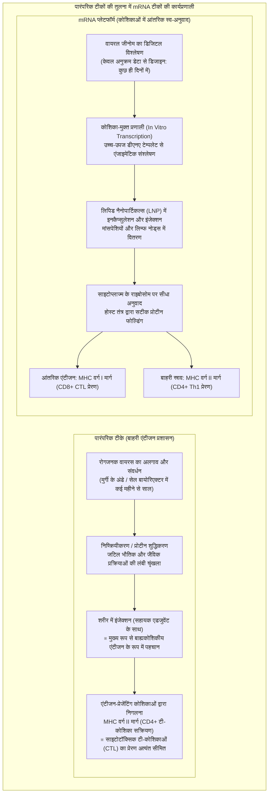
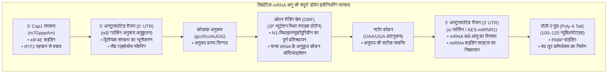
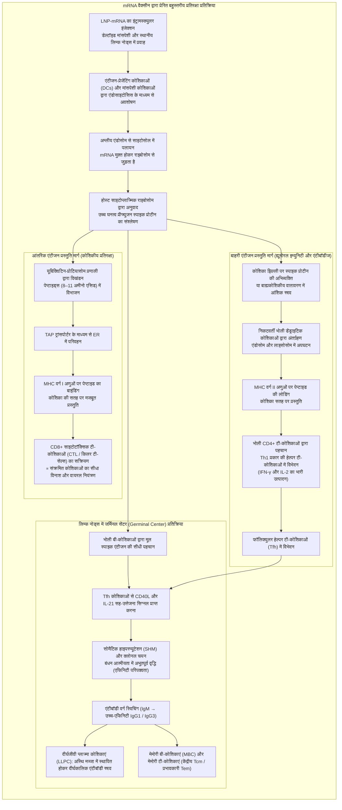

## प्रस्तावना: mRNA क्रांति —— कैसे एक «अति-संवेदनशील अणु» ने मानव इतिहास में सबसे तेज़ वैक्सीन विकास संभव बनाया

जनवरी 2020 में, चीन के वुहान में उत्पन्न अज्ञात श्वसन संक्रमण के रोगजनक "SARS-CoV-2" का संपूर्ण जीनोमिक अनुक्रम (लगभग 30,000 बेस) ऑनलाइन सार्वजनिक किया गया। इसके मात्र 42 दिन बाद, अमेरिकी बायोटेक कंपनी मॉडर्ना (Moderna) ने नैदानिक परीक्षण के लिए वैक्सीन शीशियों का पहला बैच "mRNA-1273" अमेरिकी राष्ट्रीय स्वास्थ्य संस्थान (NIH) को भेज दिया। उसी समय, जर्मनी की बायोएनटेक (BioNTech) और अमेरिका की फाइजर (Pfizer) की संयुक्त टीम ने अपने उम्मीदवार "BNT162b2" के साथ मात्र 11 महीनों की अभूतपूर्व गति से चरण III के बड़े पैमाने के नैदानिक परीक्षण पूरे कर आपातकालीन उपयोग प्राधिकरण (EUA) प्राप्त कर लिया — यह गति आधुनिक चिकित्सा के इतिहास में पहले कभी नहीं देखी गई थी।

पारंपरिक टीका विकास — चाहे वह मुर्गियों के अंडों या विशाल बायोरिएक्टरों में सेल कल्चर द्वारा तैयार किए जाने वाले जीवित क्षीण (लाइव-एटेन्यूएटेड), निष्क्रिय (इनएक्टिवेटेड), या पुनः संयोजक प्रोटीन (रीकॉम्बिनेंट प्रोटीन) टीके हों — में वायरस को अलग करने, उपभेदों के चयन, संवर्धन प्रक्रियाओं के अनुकूलन से लेकर सुरक्षा सत्यापन तक आमतौर पर **10 से 15 साल** का लंबा समय और अरबों डॉलर की लागत लगना फार्मास्यूटिकल उद्योग का "सामान्य नियम" माना जाता था।

लेकिन mRNA तकनीक ने इन स्थापित धारणाओं को जड़ से उखाड़ फेंका। इस तकनीक की मूल क्रांति यह थी कि इसने टीकों को "बाहर प्रयोगशाला में संवर्धित और शुद्ध किए गए एंटीजन प्रोटीन उत्पाद" से बदलकर **"एक सॉफ़्टवेयर प्लेटफ़ॉर्म में बदल दिया जो शरीर की अपनी कोशिकाओं में लक्षित प्रोटीन का डिजिटल जेनेटिक ब्लूप्रिंट अस्थायी रूप से लोड करता है, जिससे मानव शरीर स्वयं एक इन-हाउस एंटीजन फ़ैक्टरी बन जाता है"**।



### सेंट्रल डोगमा में mRNA की क्षणभंगुरता और "मानव जीनोम संशोधन की असंभवता"

समाज में उठी इस भ्रांति और आशंका के विपरीत कि "mRNA वैक्सीन लगाने से मानव डीएनए बदल जाएगा या यह जीनोम में शामिल हो जाएगा", आणविक जीव विज्ञान का मौलिक सिद्धांत — **"सेंट्रल डोगमा (Central Dogma)"** — स्पष्ट और निर्विवाद वैज्ञानिक उत्तर देता है।

यूकेरियोटिक कोशिकाओं में आनुवंशिक जानकारी एक अपरिवर्तनीय एकतरफा प्रवाह का पालन करती है: **डीएनए (कोशिका केंद्रक) → ट्रांसक्रिप्शन (Transcription) → mRNA (केंद्रक से बाहर निकलना) → ट्रांसलेशन (Translation) → प्रोटीन (साइटोप्लाज्म)**। प्रशासित कृत्रिम mRNA सीधे साइटोप्लाज्म में स्थित राइबोसोम से जुड़ता है और स्पाइक प्रोटीन का उत्पादन करता है।
1. **न्यूक्लियर लोकलाइज़ेशन सिग्नल का अभाव**: सिंथेटिक mRNA में नाभिकीय छिद्रों (Nuclear Pores) को पार करने के लिए आवश्यक कोई आणविक संकेत नहीं होता, इसलिए यह कोशिका के केंद्रक में प्रवेश करने में भौतिक रूप से अक्षम है और पूरी तरह साइटोप्लाज्म में ही रहता है।
2. **रिवर्स ट्रांसक्रिप्टेज़ एंजाइम की अनुपस्थिति**: आरएनए को डीएनए में बदलने के लिए "रिवर्स ट्रांसक्रिप्टेज़" और उसे क्रोमोसोम में जोड़ने के लिए "इंटीग्रेज़" एंजाइम की आवश्यकता होती है, जो रेट्रोवायरस में पाए जाते हैं लेकिन स्वस्थ मानव कोशिकाओं में पूरी तरह अनुपस्थित होते हैं (लाइन-1 रेट्रोट्रांसपोजोन पर किए गए इन-विट्रो चरम प्रयोगशाला प्रयोग कृत्रिम थे और विवो में शारीरिक स्थितियों के तहत जीनोमिक प्रविष्टि का कोई प्रमाण नहीं मिला है)।
3. **शरीर में तीव्र प्राकृतिक अपघटन**: mRNA एक अत्यंत अस्थायी संदेशवाहक है। कुछ घंटों से लेकर कुछ दिनों के भीतर, कोशिकीय राइबोन्यूक्लिएज (RNases) द्वारा इसे पूरी तरह से प्राकृतिक न्यूक्लियोटाइड्स में हाइड्रोलाइज कर दिया जाता है, जिसे शरीर अपनी सामान्य चयापचय प्रक्रिया में समाहित कर लेता है।

अतः mRNA टीका **"एक समयबद्ध स्वतः-नष्ट होने वाला संदेश"** है जो प्रोटीन संश्लेषित करते ही समाप्त हो जाता है, और इसका मानव डीएनए को स्थायी रूप से बदलने का कोई जैविक या भौतिक आधार नहीं है।

---

## अध्याय 1: 40 वर्षों का संघर्ष और निर्णायक सफलता —— mRNA को दवा में बदलने वाले वैज्ञानिक

2020 का त्वरित अनुप्रयोग कोई रातों-रात हुआ चमत्कार नहीं था। इसके पीछे उन वैज्ञानिकों का चार दशकों से अधिक का निष्ठावान आधारभूत शोध था, जिन्हें वैज्ञानिक समुदाय द्वारा उपेक्षित किया गया, पदों से डिमोट किया गया और जिनके शोध अनुदान बार-बार रोके गए। 2023 में डॉ. **कैटालिन कारिको (Katalin Karikó)** और डॉ. **ड्रू वीसमैन (Drew Weissman)** को फिजियोलॉजी या मेडिसिन में नोबेल पुरस्कार से सम्मानित किया जाना मौलिक विज्ञान की इस दृढ़ता की ऐतिहासिक विजय का प्रतीक है।

### 1.1 शुरुआती mRNA अनुसंधान की निराशाजनक दीवार: अस्थिरता और घातक जन्मजात प्रतिरक्षा प्रतिक्रिया

1961 में फ्रेंकोइस जैकब (François Jacob) और सिडनी ब्रेनर (Sydney Brenner) द्वारा mRNA की खोज के बाद से, आणविक जीवविज्ञानी यह सपना देखते रहे थे कि "यदि हम शरीर में mRNA डाल सकें, तो हम कोशिकाओं से किसी भी चिकित्सीय प्रोटीन का उत्पादन करा सकते हैं।"

हालाँकि, 1980 और 1990 के दशक में किए गए शुरुआती प्रयोग भयानक विफलताओं में समाप्त हुए। वैज्ञानिकों के सामने दो विशाल दुर्गम बाधाएँ थीं:
- **अत्यधिक भौतिक-रासायनिक अस्थिरता**: जीवित ऊतकों, हवा और उंगलियों की त्वचा पर आरएनए-विषाणुओं से रक्षा के लिए शक्तिशाली **"राइबोन्यूक्लिएज (RNase)"** एंजाइम प्रचुर मात्रा में मौजूद रहते हैं। "नग्न आरएनए" (Naked RNA) इंजेक्शन के तुरंत बाद कुछ ही सेकंडों में बिखर जाता था, और कोशिकाओं तक पहुँच ही नहीं पाता था।
- **जन्मजात प्रतिरक्षा प्रणाली का अनियंत्रित विस्फोट**: यदि वैज्ञानिक किसी तरह जानवरों में अक्षुण्ण सिंथेटिक आरएनए पहुंचाने में सफल भी हो जाते, तो शरीर उसे एक घातक वायरल हमले के रूप में पहचानता था। इससे भारी साइटोकाइन स्टॉर्म शुरू हो जाता था, जिससे जानवर गंभीर शॉक में चले जाते थे और उनकी मृत्यु हो जाती थी। परिणामस्वरूप, mRNA पर "अत्यधिक विषाक्त और चिकित्सीय रूप से अनुपयोगी अणु" का ठप्पा लगा दिया गया।

विश्वविद्यालय में पदोन्नति से वंचित किए जाने और बार-बार रिसर्च ग्रांट खारिज होने के बावजूद, पेनसिल्वेनिया विश्वविद्यालय के एक कोने में हंगेरियन मूल की बायोकेमिस्ट कैटालिन कारिको इस विश्वास पर अडिग रहीं कि आरएनए में अभूतपूर्व चिकित्सीय क्षमता छिपी है।

### 1.2 कारिको और वीसमैन की ऐतिहासिक खोज (2005): यूरिडीन संशोधन द्वारा TLR रिसेप्टर्स को चकमा देना

1997 में, कारिको की मुलाकात इम्यूनोलॉजिस्ट ड्रू वीसमैन से हुई, जो एचआईवी वैक्सीन विकसित करने के लिए डेंड्राइटिक कोशिकाओं (Dendritic Cells: DCs) की एंटीजन-प्रेजेंटिंग क्षमता का अध्ययन कर रहे थे। दोनों ने हाथ मिलाया और डेंड्राइटिक कोशिकाओं पर mRNA के प्रभाव पर संयुक्त शोध शुरू किया।

उनका केंद्रीय प्रश्न था: **"स्तनपायी कोशिकाओं का अपना ट्रांसफर आरएनए (tRNA) और राइबोसोमल आरएनए (rRNA) प्रतिरक्षा प्रणाली को क्यों उत्तेजित नहीं करता, जबकि प्रयोगशाला में टेस्ट ट्यूब में संश्लेषित (In Vitro Transcription: IVT) mRNA डेंड्राइटिक कोशिकाओं में तीव्र भड़काऊ प्रतिक्रिया पैदा करता है?"**

स्तनधारियों की कोशिका झिल्लियों और एंडोसोम में रोगजनकों के न्यूक्लिक एसिड पैटर्न को भांपने वाले सेंसर मौजूद होते हैं, जिन्हें **"टोल-लाइक रिसेप्टर्स (Toll-like Receptors: TLRs)"** कहा जाता है:
- **TLR3**: डबल-स्ट्रैंडेड आरएनए (dsRNA) को पहचानता है।
- **TLR7 / TLR8**: सिंगल-स्ट्रैंडेड आरएनए (ssRNA) में यूरिडीन (U) से समृद्ध अनुक्रमों को पहचानते हैं।
- **RIG-I / MDA5**: साइटोप्लाज्म में 5'-ट्राइफॉस्फेट और लंबे dsRNA का पता लगाकर टाइप I इंटरफेरॉन (IFN-α/β) रिलीज कराते हैं।

कारिको और वीसमैन ने पाया कि स्तनपायी कोशिकाओं का आरएनए ट्रांसक्रिप्शन के बाद व्यापक रासायनिक संशोधनों से गुजरता है, जबकि आईवीटी द्वारा निर्मित आरएनए केवल चार मानक असंशोधित क्षारों (A, C, G, U) से बना होता था।

2005 में उन्होंने एक ऐतिहासिक शोधपत्र प्रकाशित किया: **जब उन्होंने सिंथेटिक mRNA में "यूरिडीन" (Uracil) को उसके प्राकृतिक संशोधित रूप "स्यूडॉयूरिडीन" (Pseudouridine: Ψ) से बदल दिया, तो TLR7, TLR8 और अन्य इंट्रासेल्युलर सेंसरों द्वारा इसकी पहचान लगभग समाप्त हो गई, और घातक सूजन पूरी तरह गायब हो गई।**

### 1.3 स्यूडॉयूरिडीन से "N1-मिथाइलस्यूडॉयूरिडीन (m1Ψ)" का विकास

कारिको और वीसमैन की खोज केवल सूजन को शांत करने तक सीमित नहीं रही। आश्चर्यजनक रूप से, संशोधित mRNA का राइबोसोम द्वारा अनुवाद कई गुना से लेकर दर्जनों गुना तक बढ़ गया।

सामान्य यूरिडीन युक्त विदेशी mRNA जब कोशिका में प्रवेश करता है, तो सेलुलर अलार्म सिस्टम **प्रोटीन किनेज R (PKR)** और **2'-5'-ऑलिगोएडेनिलाट सिंथेटेस (OAS)** को सक्रिय कर देता है। PKR इनिशिएशन फैक्टर **eIF2α** को फॉस्फोराइलेट करके पूरी कोशिका में प्रोटीन संश्लेषण रोक देता है, जबकि OAS एंजाइम **RNase L** को सक्रिय करके साइटोप्लाज्मिक आरएनए को नष्ट करने लगता है।

स्यूडॉयूरिडीन संशोधन इन निगरानी एंजाइमों को चकमा देता है, जिससे राइबोसोम बिना किसी रुकावट के लंबे समय तक सुचारू रूप से प्रोटीन का अनुवाद करते रहते हैं।

इसके बाद, 2010 के दशक में बायोएनटेक और मॉडर्ना ने इस तकनीक को और आगे बढ़ाया और **"N1-मिथाइलस्यूडॉयूरिडीन (m1Ψ: N1-methylpseudouridine)"** की पहचान की, जिसमें स्यूडॉयूरिडीन के N1 स्थान पर एक मिथाइल समूह जोड़ा गया था:
- m1Ψ राइबोसोम के डिकोडिंग केंद्र में कोडन-एंटीकोडन पेयरिंग को बाधित किए बिना अवांछित द्वितीयक संरचनाओं को शिथिल करता है।
- यह TLR7/8 के प्रति आकर्षण को शून्य कर देता है, और यूरिडीन को 100% m1Ψ से बदलने पर विवो में प्रोटीन उत्पादन चरम स्तर पर पहुंच जाता है।
फाइजर/बायोएनटेक (BNT162b2) और मॉडर्ना (mRNA-1273) दोनों ने अपने टीकों में इस **100% m1Ψ पूर्ण प्रतिस्थापन** तकनीक को मानक के रूप में अपनाया।

### 1.4 संरचनात्मक स्थिरता का शिखर: बार्नी ग्राहम और जेसन मैकलेलन का "2P म्यूटेशन"

mRNA के रासायनिक संशोधन के साथ-साथ, टीकों की अभूतपूर्व सफलता का दूसरा आधारभूत स्तंभ **"2P म्यूटेशन (Two-Proline Substitution)" द्वारा प्रीफ्यूजन स्पाइक प्रोटीन की 3D संरचना को स्थिर करना** था।

कोरोनावायरस की सतह पर मौजूद **स्पाइक (S) ग्लाइकोप्रोटीन** मानव कोशिकाओं के ACE2 रिसेप्टर्स से जुड़कर संक्रमण स्थापित करता है। यह स्पाइक प्रोटीन एक मेटास्टेबल "आणविक स्प्रिंग" की तरह व्यवहार करता है, जो झिल्ली संलयन से पहले और बाद में अपनी संरचना नाटकीय रूप से बदल लेता है:
- **प्रीफ्यूजन संरचना (Prefusion Conformation)**: ट्राइमर के शीर्ष पर रिसेप्टर बाइंडिंग डोमेन (RBD) खुला रहता है, जहां वायरस को बेअसर करने वाली **शक्तिशाली न्यूट्रलाइजिंग एंटीबॉडीज** के जुड़ने के लिए उपयुक्त एपिटोप प्रचुर मात्रा में होते हैं।
- **पोस्टफ्यूजन संरचना (Postfusion Conformation)**: कोशिका झिल्ली के साथ विलीन होने के बाद का रूप, जो सुई जैसी लंबी छड़ में बदल जाता है। इस रूप के खिलाफ बनी एंटीबॉडीज जीवित वायरस को बेअसर करने में अत्यंत कमजोर होती हैं।

अमेरिकी नेशनल इंस्टीट्यूट ऑफ एलर्जी एंड इंफेक्शियस डिजीज (NIAID) के **बार्नी ग्राहम (Barney Graham)** और यूनिवर्सिटी ऑफ टेक्सास एट ऑस्टिन के **जेसन मैकलेलन (Jason McLellan)** ने MERS और SARS-1 पर क्रायो-इलेक्ट्रॉन माइक्रोस्कोपी अध्ययनों के माध्यम से पता लगाया था कि स्पाइक प्रोटीन के काज क्षेत्र (Hinge region) में अमीनो एसिड स्थिति 986 और 987 पर दो क्रमिक **"प्रोलिन (Proline: P)"** प्रतिस्थापित करने से प्रोटीन पोस्टफ्यूजन में गिरने से रुक जाता है और **प्रीफ्यूजन अवस्था में स्थायी रूप से लॉक (फ्रीज) हो जाता है**।

जनवरी 2020 में जीनोम अनुक्रम मिलते ही, इस 2P म्यूटेशन को तुरंत mRNA ब्लूप्रिंट में शामिल कर लिया गया। इसके परिणामस्वरूप शरीर की कोशिकाओं ने वही स्पाइक प्रोटीन उत्पादित किया जो सबसे मजबूत और सुरक्षात्मक एंटीबॉडीज को प्रेरित करता है।

---

## अध्याय 2: mRNA अणु की सटीक आणविक वास्तुकला —— सिंथेटिक ट्रांसक्रिप्ट इंजीनियरिंग

चिकित्सीय mRNA केवल वायरल जीन की एक नकल नहीं है। यह सिंथेटिक बायोलॉजी द्वारा तैयार किया गया एक **अत्यधिक परिष्कृत बायो-पॉलिमर** है, जिसके प्रत्येक डोमेन को अधिकतम अनुवाद दक्षता और नियंत्रित जीवनकाल के लिए फाइन-ट्यून किया गया है।



### 2.1 5' कैप संरचना (Cap0 से Cap1 का विकास): स्व-पहचान और अनुवाद दीक्षा

यूकेरियोटिक mRNA के 5' सिरे पर एक विशिष्ट **"7-मिथाइलग्वानोसिन (m7G) कैप"** होती है। इस कैप की रासायनिक शुद्धता और संरचना अस्तित्व का प्रश्न है:
- **Cap0 संरचना (m7GpppN)**: इसे कशेरुकी साइटोप्लाज्म में मौजूद जन्मजात प्रतिरक्षा सेंसर **IFIT1 (Interferon-induced protein with tetratricopeptide repeats 1)** द्वारा तुरंत "गैर-स्व (विदेशी वायरस)" के रूप में पहचाना जाता है और अनुवाद रोक दिया जाता है।
- **Cap1 संरचना (m7GpppNm)**: इसमें कैप के निकटवर्ती पहले राइबोज़ के 2'-O स्थान पर एक मिथाइल समूह जुड़ा होता है। यह मानव कोशिकाओं का सामान्य मार्कर है, जो IFIT1 की नजरों से पूरी तरह बच जाता है।

टीकों में को-ट्रांसक्रिप्शनल कैपिंग (CleanCap® विधि) का उपयोग करके **95% से अधिक शुद्ध Cap1 संरचना** हासिल की जाती है। यह इनिशिएशन फैक्टर **eIF4F (eIF4E, eIF4G, eIF4A)** को मजबूती से जोड़ती है और राइबोसोम के 40S सबयूनिट को तुरंत लोड कराती है।

### 2.2 5' और 3' अनट्रांसलेटेड क्षेत्रों (UTR) का अनुकूलन

गैर-कोडिंग UTR क्षेत्र राइबोसोम की स्कैनिंग गति और mRNA की उम्र को नियंत्रित करते हैं:
- **5' UTR का डिज़ाइन**: लंबे हेयरपिन लूप या G-क्वाड्रुप्लेक्स जैसी जटिल संरचनाएं राइबोसोम की गति में भौतिक बाधा उत्पन्न करती हैं। इसलिए मानव **α-ग्लोबिन** और **β-ग्लोबिन** जीन से व्युत्पन्न अत्यधिक सुव्यवस्थित और द्वितीयक-संरचना-मुक्त UTR का उपयोग किया जाता है।
- **3' UTR का डिज़ाइन**: यह mRNA के समयपूर्व क्षय को रोकता है। इसमें मानव कोशिकाओं के माइक्रो-आरएनए (miRNA) बाइंडिंग साइटों को सावधानीपूर्वक हटा दिया जाता है ताकि साइलेंसिंग न हो (जैसे माउस अल्फा-ग्लोबिन या अमीनो एसिड बढ़ाने वाले AES और माइटोकॉन्ड्रियल mtRNR1 के काइमेरिक तत्व)।

### 2.3 ओपन रीडिंग फ्रेम (ORF) और कोडन ऑप्टिमाइज़ेशन

स्पाइक प्रोटीन को कोड करने वाले ORF को उन्नत बायोइन्फॉर्मेटिक्स एल्गोरिदम द्वारा **"कोडन ऑप्टिमाइज़"** किया जाता है:
1. **मानव tRNA प्रचुरता से तालमेल**: आनुवंशिक कोड की अपभ्रष्टता (Degeneracy) का लाभ उठाते हुए, वायरल कोडनों को उन समानार्थी कोडनों से बदल दिया जाता है जिनके संगत tRNA मानव कोशिकाओं में प्रचुरता में मौजूद होते हैं, जिससे अनुवाद की गति अधिकतम हो जाती है।
2. **GC सामग्री में वृद्धि**: आरएनए अनुक्रम में ग्वानिन (G) और साइटोसिन (C) के अनुपात को रणनीतिक रूप से बढ़ाकर आणविक स्थिरता बढ़ाई जाती है और अवांछित स्प्लिसिंग संकेतों को समाप्त किया जाता है।
3. **dsRNA उप-उत्पादों का उन्मूलन**: T7 आरएनए पॉलीमरेज़ के कारण बनने वाले अवांछित डबल-स्ट्रैंडेड आरएनए (dsRNA) के अंशों को HPLC शुद्धिकरण द्वारा हटा दिया जाता है ताकि कोई विषाक्त प्रतिरक्षा उत्तेजना न हो।

### 2.4 पॉली-ए पूंछ (Poly-A Tail) और "क्लोज्ड-लूप मॉडल"

3' सिरे पर एडेनिन अवशेषों की श्रृंखला **"पॉली-ए टेल"** एक आणविक टाइमर की तरह काम करती है:
- यह **पॉली(ए)-बाइंडिंग प्रोटीन (PABP)** से जुड़ती है।
- 5' कैप पर बंधे eIF4G और 3' PABP के बीच आपसी संपर्क से mRNA एक **"बंद लूप" (Closed-Loop Model)** बना लेता है।
- इस वृत्ताकार संरचना के कारण, राइबोसोम स्टॉप कोडन (UAA/UGA) पर समाप्त होते ही साइटोसोल में तैरने के बजाय तुरंत फिर से 5' कैप पर रीसायकल हो जाता है, जिससे एक ही mRNA से हजारों बार प्रोटीन बनता है।
- टीकों में इसकी लंबाई **100 से 120 न्यूक्लियोटाइड्स** के बीच सटीक रूप से रखी जाती है।

---

## अध्याय 3: जैविक रक्षा दीवारों को भेदने वाला वाहक —— लिपिड नैनोपार्टिकल (LNP) इंजीनियरिंग

चाहे mRNA कितना भी उत्कृष्ट क्यों न बना हो, यदि उसे लक्षित कोशिकाओं के भीतर सुरक्षित रूप से पहुंचाने वाला "डिलीवरी सिस्टम" न हो, तो वह शून्य के बराबर है। इस क्रांति का वास्तविक इंजीनियर 80 से 100 नैनोमीटर व्यास का **"लिपिड नैनोपार्टिकल (Lipid Nanoparticles: LNPs)"** था।

### 3.1 नग्न mRNA (Naked RNA) का सीधा प्रशासन क्यों असंभव है?

नग्न mRNA को सीधे मांसपेशियों में इंजेक्ट करने पर शून्य प्रभावशीलता मिलने के दो बुनियादी कारण हैं:
1. **ऋणात्मक आवेश का इलेक्ट्रोस्टैटिक प्रतिकर्षण**: आरएनए की फॉस्फोडिएस्टर रीढ़ पर मजबूत ऋणात्मक आवेश (एनायन) होता है। मानव कोशिका झिल्ली की सतह भी ऋणात्मक रूप से आवेशित होती है। कूलम्ब के नियम के अनुसार, दोनों एक दूसरे को अत्यधिक बल से पीछे धकेलते हैं।
2. **ऊतकों में RNase द्वारा तात्कालिक विनाश**: बाह्यकोशिकीय तरल पदार्थों में मौजूद आरनेज एंजाइम कुछ ही मिनटों में इसे नष्ट कर देते हैं।

इसलिए, mRNA को सुरक्षा प्रदान करने और कोशिका झिल्ली को पार कराने के लिए एक "नैनो-आकार के ट्रोजन हॉर्स" की आवश्यकता थी।

### 3.2 LNP के "चार स्वर्ण लिपिड": संरचना और कार्य

फाइज़र और मॉडर्ना के टीकों में प्रयुक्त LNP **चार विशेष लिपिड अणुओं** के सटीक दाढ़ अनुपात (Molar ratio) से बने होते हैं:

```
【LNP के 4 प्रमुख घटक लिपिड】
1. आयनीकरण योग्य कैटायनिक लिपिड (Ionizable Lipid) 〜 46-50 mol%
2. हेल्पर फॉस्फोलिपिड (Helper Lipid: DSPC) 〜 10 mol%
3. कोलेस्ट्रॉल (Cholesterol) 〜 38-43 mol%
4. पेगिलेटेड लिपिड (PEGylated Lipid) 〜 1.5-1.7 mol%
```

| लिपिड घटक | मुख्य अणु (Pfizer / Moderna) | अनुपात (mol%) | भौतिक-रासायनिक गुण | विवो में अनिवार्य जैविक कार्य |
| :--- | :--- | :--- | :--- | :--- |
| **आयनीकरण योग्य लिपिड<br/>(Ionizable Lipid)** | **ALC-0315** (Pfizer)<br/>**SM-102** (Moderna) | **~46 से 50%** | स्पष्ट pKa **6.0 से 6.8**। अम्लीय वातावरण में धनात्मक (कैटायन), शारीरिक pH पर तटस्थ। तृतीयक अमीन और बायोडिग्रेडेबल एस्टर बॉन्ड युक्त। | ① निर्माण के समय अम्लीय pH में ऋणावेशित mRNA से बंधकर उसे कोर में सघन करता है।<br/>② रक्त के तटस्थ pH (7.4) पर उदासीन हो जाता है, जिससे साइटोटॉक्सिसिटी और हीमोलिसिस से बचाव होता है।<br/>③ अम्लीय एंडोसोम के भीतर पुनः प्रोटॉनेट होकर झिल्ली को तोड़ता है और mRNA को बाहर निकालता है। |
| **हेल्पर फॉस्फोलिपिड<br/>(Helper Lipid)** | **DSPC**<br/>(1,2-distearoyl-sn-glycero-3-phosphocholine) | **~10%** | उच्च चरण संक्रमण तापमान (~55°C) वाला संतृप्त फॉस्फोलिपिड; बेलनाकार आकार। | LNP के बाहरी खोल में एक स्थिर लिपिड बाइलेयर बनाता है, जो नैनोकण की संरचनात्मक कठोरता और स्थिरता बनाए रखता है। |
| **कोलेस्ट्रॉल<br/>(Cholesterol)** | पौधों से प्राप्त उच्च-शुद्धता कोलेस्ट्रॉल | **~38 से 43%** | कठोर स्टेरॉयड कंकाल और छोटा हाइड्रोफिलिक हाइड्रॉक्सिल समूह। | फॉस्फोलिपिड्स के बीच की रिक्तियों को भरता है, झिल्ली की तरलता और पैकिंग को अनुकूलित करता है, लीकेज रोकता है और संलयन को सुगम बनाता है। |
| **पेगिलेटेड लिपिड<br/>(PEGylated Lipid)** | **ALC-0159** (Pfizer)<br/>**PEG2000-DMG** (Moderna) | **~1.5 से 1.7%** | लिपिड एंकर (डाइमिristॉयल ग्लिसरॉल) से जुड़ी हाइड्रोफिलिक पॉलीइथाइलीन ग्लाइकोल श्रृंखला। | ① भंडारण के दौरान कणों को आपस में चिपकने से रोकता है और आकार (~80nm) को स्थिर रखता है।<br/>② प्लाज्मा प्रोटीन के अनियंत्रित अवशोषण (ओप्सोनाइजेशन) को रोकता है और रक्त परिसंचरण काल बढ़ाता है।<br/>③ शरीर में धीरे-धीरे अलग होकर कोशिकाओं द्वारा अवशोषण की अनुमति देता है। |

### 3.3 एंडोसाइटोसिस और एंडोसोमल एस्केप (Endosomal Escape) का चमत्कार

इंजेक्शन के बाद सबसे महत्वपूर्ण चरण कोशिका के भीतर mRNA का सुरक्षित पहुँचना है:
1. **ApoE अवशोषण और एंडोसाइटोसिस**: रक्त और अंतरालीय द्रव में पहुंचने पर, LNPs प्राकृतिक **एपोलाइपोप्रोटीन E (ApoE)** को आकर्षित करते हैं। यह डेंड्राइटिक कोशिकाओं, मैक्रोफेज और मायोसाइट्स पर मौजूद **एलडीएल रिसेप्टर्स (LDLR)** से जुड़कर एंडोसाइटोसिस द्वारा एंडोसोम वेसिकल्स में समाहित हो जाता है।
2. **एंडोसोम का अम्लीकरण**: प्रोटॉन पंप (V-ATPase) हाइड्रोजन आयनों ($H^+$) को पंप करता है, जिससे आंतरिक pH 7.4 से गिरकर 6.5 और फिर 5.0 से नीचे आ जाता है।
3. **आवेश का पलटना और प्रोटॉन स्पंज प्रभाव**: आयनीकरण योग्य लिपिड (pKa 6.0–6.8) तेजी से प्रोटॉन स्वीकार करते हैं और **अत्यधिक धनात्मक (कैटायनिक) अवस्था में बदल जाते हैं**।
4. **झिल्ली संलयन और साइटोसोल में मुक्ति**: धनावेशित लिपिड एंडोसोम झिल्ली के ऋणावेशित फॉस्फोलिपिड्स (जैसे फॉस्फेटिडिलसेरिन) के साथ अत्यधिक बल से अंतःक्रिया करते हैं। इससे लैमेलर संरचना ढह जाती है और "इनवर्टेड हेक्सागोनल फेज ($H_{II}$)" बन जाता है। इस छिद्र से mRNA बिना किसी नुकसान के **साइटोप्लाज्म के राइबोसोम पूल में मुक्त हो जाता है**।

नैनोबायोलॉजी अध्ययनों से पता चलता है कि एंडोसोम में प्रवेश करने वाले mRNA का केवल **कुछ प्रतिशत से 10–15%** ही साइटोसोल में सफलतापूर्वक बच पाता है। लेकिन mRNA की असाधारण अनुवाद क्षमता के कारण, यह छोटा सा अंश भी शरीर को व्यापक सुरक्षा देने के लिए पर्याप्त मात्रा में स्पाइक प्रोटीन का उत्पादन कर देता है।

### 3.4 माइक्रोफ्लुइडिक मिक्सिंग तकनीक (Microfluidic Formulation)

LNP का बड़े पैमाने पर विनिर्माण **"माइक्रोफ्लुइडिक्स (Microfluidics)"** तकनीक द्वारा संभव हुआ:
सूक्ष्म चैनलों में, चारों लिपिडों का इथेनॉल घोल और mRNA का अम्लीय जलीय घोल उच्च नियंत्रित प्रवाह दर पर एक दूसरे से टकराए जाते हैं।
इथेनॉल तुरंत पानी में पतला हो जाता है, जिससे लिपिड की घुलनशीलता अचानक गिर जाती है और **स्व-संयोजन (Self-assembly)** प्रेरित होता है: कैटायनिक लिपिड mRNA को घेरकर कोर बनाते हैं, जबकि DSPC और PEG बाहरी खोल का निर्माण करते हैं। यह प्रक्रिया मिलीसेकंड में **80–100nm आकार, 90% से अधिक इनकैप्सुलेशन दक्षता और संकीर्ण पॉलीडिस्पर्सिटी (PDI < 0.1)** वाले LNP लगातार उत्पन्न करती है।

---

## अध्याय 4: बहुस्तरीय प्रतिरक्षा कैस्केड —— साइटोप्लाज्मिक अनुवाद से प्रणालीगत सुरक्षा की स्थापना तक

mRNA टीकों की पारंपरिक टीकों पर श्रेष्ठता का सबसे बड़ा जैविक रहस्य यह है कि वे **MHC क्लास I और क्लास II दोनों मार्गों को एक साथ सक्रिय करते हैं**।



### 4.1 मांसपेशी ऊतक और लिम्फ नोड्स में स्थानीय अवशोषण

डेल्टॉइड मांसपेशी में इंजेक्शन के बाद, अधिकांश LNPs कुछ घंटों से दिनों के भीतर निकटवर्ती ड्रेनिंग लिम्फ नोड्स (कांख के लिम्फ नोड्स) में चले जाते हैं।
- मांसपेशी कोशिकाएं स्पाइक प्रोटीन की सतह अभिव्यक्ति करती हैं, लेकिन प्रतिरक्षा का असली संचालन पेशेवर एंटीजन-प्रेजेंटिंग कोशिकाएं — **डेंड्राइटिक कोशिकाएं (DCs)** और मैक्रोफेज करती हैं।
- डेंड्राइटिक कोशिकाओं के साइटोप्लाज्म में अनुवादित स्पाइक प्रोटीन प्राकृतिक ग्लाइकोसिलेशन और उचित डाइसल्फ़ाइड बॉन्ड गठन के बाद अपनी मूल त्रि-आयामी प्रीफ्यूजन संरचना में कोशिका झिल्ली पर प्रदर्शित होता है।

### 4.2 MHC क्लास I मार्ग: किलर टी-कोशिकाओं (CD8+ CTL) का अभूतपूर्व प्रेरण

पारंपरिक प्रोटीन या निष्क्रिय टीके केवल कोशिका के बाहर से एंटीजन पेश करते हैं, इसलिए वे संक्रमित कोशिकाओं को नष्ट करने वाली **CD8+ साइटोटॉक्सिक टी-कोशिकाओं (CTL)** को सक्रिय करने में असमर्थ रहते हैं।

mRNA टीके एंटीजन को **कोशिका के भीतर (साइटोप्लाज्म)** संश्लेषित करवाते हैं:
1. **प्रोटियासोमल विखंडन**: उत्पादित स्पाइक प्रोटीन का एक हिस्सा यूबिक्विटिन द्वारा चिह्नित होकर **प्रोटियासोम** द्वारा 8–11 अमीनो एसिड के पेप्टाइड्स में काटा जाता है।
2. **ER में परिवहन**: यह पेप्टाइड **TAP** ट्रांसपोर्टर के माध्यम से एंडोप्लाज्मिक रेटिकुलम (ER) में भेजा जाता है।
3. **MHC-I पर लोडिंग**: पेप्टाइड्स नए संश्लेषित **MHC वर्ग I (HLA-A, B, C)** अणुओं के ग्रूव में फिट होकर गॉल्जी बॉडी के रास्ते कोशिका की बाहरी सतह पर प्रदर्शित होते हैं।
4. **किलर टी-सेल्स की प्राइमिंग**: भोली CD8+ टी-कोशिकाएं अपने TCR और सह-उत्तेजक संकेतों के माध्यम से इस कॉम्प्लेक्स को पहचानती हैं और **घातक प्रभावकारी साइटोटॉक्सिक टी-कोशिकाओं (CTLs)** में बदल जाती हैं।

यही मजबूत सेलुलर प्रतिरक्षा बाद में वेरिएंट्स द्वारा एंटीबॉडीज को चकमा दिए जाने पर भी लोगों को गंभीर बीमारी और मृत्यु से बचाने वाली अंतिम अभेद्य ढाल साबित हुई।

### 4.3 MHC क्लास II मार्ग और Th1-बायस्ड हेल्पर टी-कोशिकाओं का विकास

साथ ही, संश्लेषित स्पाइक प्रोटीन सामान्य कोशिकीय स्राव या एपोप्टोसिस के माध्यम से बाहर भी निकलता है:
- इसे अन्य भोली डेंड्राइटिक कोशिकाएं निगलती हैं और लाइसोसोम में 13–18 अमीनो एसिड के टुकड़ों में तोड़ती हैं।
- ये टुकड़े **MHC वर्ग II (HLA-DR, DQ, DP)** अणुओं पर लोड होकर कोशिका की सतह पर प्रस्तुत होते हैं।
- LNP घटकों के अंतर्निहित सहायक प्रभाव के कारण, भोली CD4+ कोशिकाएं एलर्जी पैदा करने वाले Th2 प्रकार के बजाय एंटी-वायरल रक्षा के लिए आदर्श **"Th1 प्रकार (IFN-γ और IL-2 स्रावित करने वाली)"** में ध्रुवीकृत होती हैं, जिससे फेफड़ों की भड़काऊ क्षति (VAED) का खतरा पूरी तरह समाप्त हो गया।

### 4.4 जर्मिनल सेंटर (Germinal Centers) और बी-सेल एफिनिटी परिपक्वता

mRNA टीकों की सबसे चमत्कारी प्रतिक्रिया लिम्फ नोड्स में **"जर्मिनल सेंटर्स (Germinal Centers: GCs)"** का महीनों तक सक्रिय रहना है:
1. **मूल एंटीजन की पहचान**: लिम्फ नोड फॉलिकल्स में मौजूद भोली बी-कोशिकाएं अपने रिसेप्टर्स (BCR) के माध्यम से स्पाइक प्रोटीन ट्राइमर से सीधे जुड़ती हैं।
2. **फॉलिक्युलर हेल्पर टी-सेल्स (Tfh) से मदद**: एंटीजन ग्रहण करने वाली बी-कोशिकाएं जर्मिनल सेंटर में जाती हैं और **Tfh कोशिकाओं** से CD40L और IL-21 सिग्नल प्राप्त करती हैं।
3. **सोमैटिक हाइपरम्यूटेशन (SHM) और क्लोनल चयन**: जर्मिनल सेंटर के डार्क ज़ोन में बी-कोशिकाएं तेजी से विभाजित होती हैं और अपने एंटीबॉडी-बाइंडिंग जीन में यादृच्छिक उत्परिवर्तन लाती हैं। लाइट ज़ोन में, केवल वही कोशिकाएं जीवित रहती हैं जो स्पाइक से सबसे मजबूती से चिपकती हैं; कमजोर कोशिकाएं एपोप्टोसिस द्वारा नष्ट कर दी जाती हैं।
4. **क्लास-स्विच और मेमोरी सेल्स**: एंटीबॉडीज कम-एफिनिटी IgM से बदलकर **उच्च-एफिनिटी न्यूट्रलाइजिंग IgG (विशेषकर IgG1 और IgG3)** बन जाती हैं। विजेता कोशिकाएं **दीर्घजीवी प्लाज्मा कोशिकाओं (LLPC)** में बदल जाती हैं जो अस्थि मज्जा में जाकर महीनों तक एंटीबॉडीज का स्राव करती हैं, जबकि अन्य **मेमोरी बी-कोशिकाएं (MBC)** बनकर भविष्य के हमलों के लिए तैयार रहती हैं।

लिम्फ नोड बायोप्सी अध्ययनों ने साबित किया है कि mRNA टीकाकरण से प्रेरित जर्मिनल सेंटर प्रतिक्रिया **कम से कम 6 महीने से अधिक समय तक लगातार सक्रिय बनी रहती है**, जो एंटीबॉडी की असाधारण गुणवत्ता की व्याख्या करती है।

---

## अध्याय 5: नैदानिक प्रमाण, प्रभावशीलता की गतिशीलता और म्यूटेंट वेरिएंट्स के खिलाफ जंग

### 5.1 चरण III के बड़े पैमाने के नैदानिक परीक्षण परिणाम: 95% प्रभावशीलता का आश्चर्यजनक प्रभाव

नवंबर और दिसंबर 2020 में *द न्यू इंग्लैंड जर्नल ऑफ मेडिसिन (NEJM)* में प्रकाशित फाइजर (Polack et al.) और मॉडर्ना (Baden et al.) के तीसरे चरण के नैदानिक परीक्षण परिणामों ने वैश्विक चिकित्सा जगत को अचंभित कर दिया:
- **फाइजर/बायोएनटेक (BNT162b2: 43,448 प्रतिभागी)**: प्लेसीबो समूह में 162 रोगसूचक कोविड मामले दर्ज किए गए, जबकि टीका समूह में केवल 8 मामले सामने आए, जिसने **95.0% (95% CI: 90.3–97.6%)** की लक्षण निवारक प्रभावशीलता दर्ज की। गंभीर बीमारी के प्लेसीबो में 9 मामले थे, जबकि टीका समूह में केवल 1 मामला था।
- **मॉडर्ना (mRNA-1273: 30,420 प्रतिभागी)**: प्लेसीबो में 185 मामले (30 गंभीर, 1 मृत्यु) के मुकाबले टीका समूह में केवल 11 मामले (0 गंभीर), जिससे **94.1% (95% CI: 89.3–96.8%)** प्रभावशीलता और गंभीर बीमारी के खिलाफ 100% सुरक्षा साबित हुई।

शुरुआत में, अमेरिकी एफडीए और डब्ल्यूएचओ ने आपातकालीन अनुमोदन के लिए न्यूनतम 50% प्रभावशीलता की सीमा तय की थी। इन्फ्लूएंजा टीकों की सामान्य 40–60% वार्षिक प्रभावशीलता को देखते हुए, एक पूरी तरह से अज्ञात नए वायरस के खिलाफ 95% का यह आंकड़ा आधुनिक संक्रामक रोग विशेषज्ञों की कल्पना से कहीं परे एक ऐतिहासिक उपलब्धि थी।

### 5.2 सांख्यिकीय व्याख्या: सापेक्ष जोखिम में कमी (RRR) बनाम पूर्ण जोखिम में कमी (ARR)

आंकड़ों की व्याख्या को लेकर एक भ्रम फैलाया गया कि "95% प्रभावशीलता केवल सापेक्ष जोखिम कमी (RRR) है, जबकि पूर्ण जोखिम कमी (ARR) मात्र 1% से कम है, इसलिए टीका व्यर्थ है।"

इस सांख्यिकीय भ्रम का वस्तुनिष्ठ वैज्ञानिक विश्लेषण इस प्रकार है:
- **RRR (सापेक्ष जोखिम में कमी)**: प्लेसीबो घटना दर ($I_p$) की तुलना टीका समूह की घटना दर ($I_v$) से करता है:
  $$RRR = \frac{I_p - I_v}{I_p} \times 100\% = \frac{0.0088 - 0.0004}{0.0088} \approx 95\%$$
  यह **टीके की जैविक और प्रतिरक्षात्मक क्षमता** का शुद्ध पैमाना है।
- **ARR (पूर्ण जोखिम में कमी)**: परीक्षण की सीमित अवधि के दौरान पूरी आबादी में संक्रमित होने वाले लोगों के अनुपात का प्रत्यक्ष अंतर:
  $$ARR = I_p - I_v \approx 0.88\% - 0.04\% = 0.84\%$$
- **सांख्यिकी का वास्तविक सच**:
  ARR पूरी तरह से इस बात पर निर्भर करता है कि परीक्षण के दौरान **"समाज में संक्रमण का प्रसार (पृष्ठभूमि घटना दर)"** कितना था। यदि अत्यंत शांत महामारी के समय परीक्षण किया जाए, तो दुनिया के सबसे उत्कृष्ट टीके का ARR भी गणितीय रूप से 1% से कम ही रहेगा। लेकिन जैसे ही संक्रमण विस्फोट होता है और आबादी के 20% लोग वायरस के संपर्क में आते हैं, तो पूर्ण सुरक्षा लाभ तुरंत $20\% \times 95\% = 19\%$ हो जाता है।
  अतः, ARR के आधार पर टीके को अप्रभावी बताना जैविक प्रभावकारिता और महामारी विज्ञान के जोखिम के बीच भ्रम का परिणाम है।

### 5.3 वास्तविक दुनिया के साक्ष्य (Real-World Evidence): राष्ट्रीय स्तर के डेटा की सच्चाई

जब नियंत्रित परीक्षणों से बाहर निकलकर करोड़ों बुजुर्गों, गंभीर बीमारियों से पीड़ित लोगों और कमजोर इम्युनिटी वाले सामान्य समाज में टीकाकरण लागू हुआ, तो mRNA टीकों की प्रभावशीलता निर्विवाद रही।

**इजराइल (1.2 मिलियन लोगों का क्लैलिट कोहोर्ट अध्ययन, Dagan et al., NEJM 2021)**, यूके (UKHSA) और यूएसए (CDC) के व्यापक डेटा ने तीन निर्णायक सच्चाइयों की पुष्टि की:
1. **मूल वेरिएंट्स पर पूर्ण प्रभुत्व**: वुहान मूल स्ट्रेन और अल्फा वेरिएंट के खिलाफ वास्तविक दुनिया में 90% से अधिक संक्रमण सुरक्षा और 95% से अधिक अस्पताल में भर्ती होने से सुरक्षा की पूरी पुष्टि हुई।
2. **संक्रमण रोकथाम का क्रमिक क्षय**: टीकाकरण के 4 से 6 महीने बाद, रक्त में न्यूट्रलाइजिंग एंटीबॉडीज के प्राकृतिक क्षय के कारण हल्के रोगसूचक संक्रमण से सुरक्षा घटकर 60–70% रह गई।
3. **गंभीर बीमारी और मृत्यु के खिलाफ दीर्घकालिक अटूट ढाल**: इसके विपरीत, आईसीयू और मृत्यु से बचाने वाली सुरक्षा एंटीबॉडी स्तर घटने के बाद भी 85–90% से अधिक बनी रही। इसका कारण यह था कि रक्त में एंटीबॉडीज कम होने पर भी अस्थि मज्जा की मेमोरी बी-कोशिकाएं संक्रमण होते ही कुछ ही दिनों में एंटीबॉडीज की बाढ़ ला देती हैं, और फेफड़ों में **CD8+ किलर टी-कोशिकाएं** वायरस को तेजी से नष्ट करती रहती हैं।

### 5.4 वेरिएंट्स की लहर और इम्यून एस्केप: एंटीबॉडी में गिरावट और टी-कोशिकाओं की मजबूती

जैसे-जैसे महामारी बढ़ी, वायरस ने प्रतिरक्षा दबाव के तहत म्यूटेशन जमा करना शुरू किया।

| वेरिएंट वंश | प्रमुख म्यूटेशन (RBD आदि) | न्यूट्रलाइजेशन संवेदनशीलता (मूल की तुलना) | 2 खुराक से संक्रमण सुरक्षा | 2 खुराक से गंभीर बीमारी सुरक्षा | बूस्टर खुराक का प्रभाव |
| :--- | :--- | :--- | :--- | :--- | :--- |
| **वुहान मूल स्ट्रेन<br/>(Wuhan-Hu-1)** | संदर्भ मानक | **1.0x** (मानक) | **~95%** | **>95%** | एंटीबॉडी स्तर मानक से कई गुना बढ़ जाता है |
| **अल्फा<br/>(Alpha: B.1.1.7)** | N501Y, P681H | **1.5 से 2 गुना हल्की कमी** | **~85–90%** | **~95%** | संक्रमण और गंभीर बीमारी दोनों से उच्च सुरक्षा बहाल |
| **डेल्टा<br/>(Delta: B.1.617.2)** | L452R, T478K, P681R | **3 से 6 गुना गिरावट** | **~60–75%** (समय के साथ कमी) | **~90%** | तीसरी खुराक से रोगसूचक सुरक्षा वापस >85% हो गई |
| **ओमाइक्रोन BA.1/BA.2<br/>(शुरुआती Omicron)** | RBD में 15+ म्यूटेशन<br/>(K417N, E484A, N501Y आदि) | **20 से 40 गुना भारी गिरावट** | **~20–40%** (2 खुराकों के बाद भारी गिरावट) | **~70–80%** (टी-सेल इम्युनिटी द्वारा सुरक्षित) | बूस्टर खुराक से रोगसूचक सुरक्षा 65–75% और गंभीर सुरक्षा 90%+ हो गई |
| **ओमाइक्रोन BA.4/BA.5<br/>और XBB/JN.1** | L452R, F486V/P, R346T<br/>चरम रिसेप्टर एफिनिटी व एस्केप | **एंटीबॉडी बाइंडिंग का भारी नुकसान** | **केवल 2 खुराकों से लगभग नगण्य** | **~60–70%** (बेसल टी-सेल मेमोरी द्वारा सुरक्षित) | अद्यतन बाइवेलेंट और मोनोवेलेंट XBB/JN.1 टीकों ने न्यूट्रलाइजेशन बहाल किया और गंभीर सुरक्षा 70–80%+ की |

ओमाइक्रोन के आगमन ने दिखाया कि केवल न्यूट्रलाइजिंग एंटीबॉडीज के भरोसे संक्रमण को पूरी तरह रोकना मुश्किल था, क्योंकि स्पाइक प्रोटीन में 30 से अधिक म्यूटेशन ने बाहरी संरचना को बदल दिया था।

लेकिन यहाँ **"टी-सेल प्रतिरक्षा"** ने जीवन रक्षक भूमिका निभाई:
- एंटीबॉडीज स्पाइक की सतह पर उभरे हुए कुछ विशिष्ट 3D संरचनात्मक एपिटोप्स को पहचानती हैं, इसलिए कुछ म्यूटेशन से उनका बंधन कमजोर हो जाता है।
- इसके विपरीत, टी-कोशिकाएं **रैखिक पेप्टाइड टुकड़ों (Linear Epitopes)** को पहचानती हैं, जो पूरे 1,273 अमीनो एसिड स्पाइक में फैले होते हैं।
- विभिन्न मनुष्यों में अलग-अलग HLA प्रकार होने के कारण, वायरस के लिए सभी टी-सेल एपिटोप्स से एक साथ बचना जैविक रूप से असंभव था।
- अध्ययनों से सिद्ध हुआ कि **ओमाइक्रोन के खिलाफ भी टीकों द्वारा प्रेरित टी-सेल एपिटोप्स का 80 से 90% से अधिक हिस्सा पूरी तरह सुरक्षित रहा**। यही कारण था कि संक्रमण के भारी विस्फोट के बावजूद मौतों और आईसीयू प्रवेश में भारी गिरावट आई।

### 5.5 बूस्टर टीकाकरण और अद्यतन टीकों का डिज़ाइन

mRNA प्लेटफॉर्म ने वायरस के विकास के साथ तालमेल बिठाने में अपनी अद्वितीय गति दिखाई:
1. **होमोलॉगस बूस्टर (तीसरी खुराक)**: मूल टीके की अतिरिक्त खुराक देने से जर्मिनल सेंटर्स पुनः सक्रिय हो गए और मेमोरी बी-कोशिकाओं में एफिनिटी परिपक्वता बढ़ गई, जिससे ओमाइक्रोन के खिलाफ भी क्रॉस-न्यूट्रलाइजिंग एंटीबॉडीज उत्पन्न हुईं।
2. **बाइवेलेंट टीके (Bivalent Vaccines)**: मूल स्ट्रेन और ओमाइक्रोन BA.4/5 के mRNA को 1:1 के अनुपात में मिलाकर व्यापक प्रतिरक्षा दायरा बनाया गया।
3. **मोनोवेलेंट अद्यतन टीके (XBB.1.5, JN.1)**: "एंटीजेनिक इंप्रिंटिंग" (Antigenic Sin) से बचने के लिए टीकों को नवीनतम प्रचलित उपभेदों के मोनोवेलेंट रूप में अपडेट किया गया। कंप्यूटर पर डिजिटल सीक्वेंस प्राप्त होने के **मात्र 2 से 3 महीने के भीतर** नई शीशियां उत्पादन लाइनों से तैयार हो गईं — यह गति किसी अन्य पारंपरिक तकनीक में असंभव थी।

---

## अध्याय 6: सुरक्षा प्रोफ़ाइल, दुष्प्रभावों की पैथोफिज़ियोलॉजी और जोखिम-लाभ विश्लेषण

किसी भी दवा की तरह, mRNA टीके भी जैविक उत्पाद हैं, और उनके अत्यधिक लाभों के साथ जुड़े जोखिमों और दुष्प्रभावों का वैज्ञानिक ईमानदारी से विश्लेषण करना अनिवार्य है।

### 6.1 स्थानीय और प्रणालीगत प्रतिक्रियाशीलता (Reactogenicity): प्रतिरक्षा सक्रियता की शारीरिक लागत

इंजेक्शन के बाद होने वाले सामान्य लक्षण — जैसे इंजेक्शन वाली जगह पर दर्द, सूजन, लालिमा, बुखार, थकान, सिरदर्द और मांसपेशियों में दर्द — किसी विषाक्तता का परिणाम नहीं हैं, बल्कि यह **"शरीर की जन्मजात प्रतिरक्षा प्रणाली के ठीक से काम करने का प्राकृतिक शारीरिक संकेत"** है:
- LNP लिपिड और आरएनए अणु स्थानीय मैक्रोफेज से **IL-1β, IL-6, TNF-α और टाइप I इंटरफेरॉन** का क्षणिक स्राव कराते हैं।
- रक्तप्रवाह में IL-6 का प्रसार मस्तिष्क के हाइपोथैलेमस में तापमान नियंत्रण केंद्र को उत्तेजित करता है, जिससे बुखार आता है।
- ये लक्षण 24 से 48 घंटों में स्वतः ठीक हो जाते हैं और पैरासिटामोल या इबुप्रोफेन जैसी दवाओं से आसानी से नियंत्रित होते हैं।

### 6.2 मायोकार्डिटिस और पेरिकार्डिटिस (Myocarditis / Pericarditis)

वैश्विक निगरानी प्रणालियों (VAERS, VSD और इजराइली स्वास्थ्य मंत्रालय) ने पाया कि विशेष रूप से **12 से 29 वर्ष के युवा पुरुषों में दूसरी खुराक के बाद** अत्यंत दुर्लभ मामलों में मायोकार्डिटिस (हृदय की मांसपेशी में सूजन) और पेरिकार्डिटिस देखा गया।

#### ① महामारी विज्ञान की आवृत्ति
- कुल आवृत्ति अत्यंत दुर्लभ है: **प्रति 100,000 खुराक पर लगभग 1 से 5 मामले**।
- उच्चतम जोखिम वाले समूह (**16–19 वर्ष के पुरुष, दूसरी खुराक के बाद**) में भी यह दर **प्रति 100,000 खुराक पर लगभग 10 से 15 मामले (~0.01%)** है।
- मॉडर्ना की खुराक (100μg) में फाइजर (30μg) की तुलना में दर थोड़ी अधिक पाई गई, इसलिए कई देशों में युवाओं के लिए फाइजर को प्राथमिकता दी गई।

#### ② आणविक पैथोफिज़ियोलॉजी के तंत्र
1. **मुक्त स्पाइक प्रोटीन**: हार्वर्ड विश्वविद्यालय (Yonker et al., Circulation 2023) के अनुसार, मायोकार्डिटिस विकसित करने वाले कुछ युवाओं के रक्त में एंटीबॉडी से मुक्त अप्रभावित "फ्री स्पाइक प्रोटीन" पाया गया, जिसने हृदय ऊतक में जन्मजात रिसेप्टर्स को अत्यधिक उत्तेजित किया होगा।
2. **टेस्टोस्टेरोन हार्मोन का प्रभाव**: टेस्टोस्टेरोन Th1 प्रतिरक्षा और भड़काऊ मैक्रोफेज को बढ़ावा देता है, जबकि एस्ट्रोजेन में सूजन-रोधी गुण होते हैं, जो पुरुषों में इसके अधिक मामलों की व्याख्या करता है।
3. **क्षणिक ऑटोइम्यूनिटी**: हृदय के सिकुड़ने वाले प्रोटीन (अल्फा-मायोसिन) के खिलाफ क्षणिक क्रॉस-रिएक्टिविटी।

#### ③ नैदानिक परिणाम और वास्तविक संक्रमण से तुलना
- **90% से अधिक मामले हल्के होते हैं**: मरीज गैर-स्टेरायडल विरोधी भड़काऊ दवाओं (NSAIDs) के साथ कुछ ही दिनों से एक सप्ताह में बिना किसी दीर्घकालिक हृदय क्षति के पूरी तरह स्वस्थ हो जाते हैं।
- **वायरस संक्रमण का जोखिम कहीं अधिक घातक है**: सीडीसी और यूके के आंकड़ों से स्पष्ट है कि SARS-CoV-2 वायरस के वास्तविक संक्रमण से होने वाले गंभीर मायोकार्डिटिस, हृदय गति रुकने, रक्त के थक्कों और मृत्यु का जोखिम टीके के जोखिम से दर्जनों गुना अधिक है। इसलिए युवा पुरुषों के लिए भी टीकाकरण का शुद्ध लाभ जोखिम से कहीं अधिक रहता है।

### 6.3 एनाफिलेक्सिस और PEG एलर्जी

गंभीर तीव्र एलर्जी प्रतिक्रिया (एनाफिलेक्सिस) की आवृत्ति **प्रति 10 लाख खुराक पर लगभग 2 से 5 मामले** है:
- मुख्य कारण LNP के बाहरी आवरण में मौजूद **PEG2000 (पॉलीइथाइलीन ग्लाइकोल)** के प्रति पहले से मौजूद एंटीबॉडीज या पूरक-मध्यस्थ स्यूडोएलर्जी (CARPA) है, जो सौंदर्य प्रसाधनों और रेचक दवाओं के व्यापक उपयोग से कुछ लोगों में बन जाती हैं।
- टीकाकरण केंद्र पर 15–30 मिनट के अवलोकन और तुरंत एपिनेफ्रीन (एड्रेनालाईन) इंजेक्शन के प्रोटोकॉल द्वारा मौतों को पूरी तरह रोका गया।

### 6.4 एडेनोवायरस वेक्टर टीकों (TTS/VITT) की तुलना में सुरक्षा

एस्ट्राजेनेका और जॉनसन एंड जॉनसन जैसे वायरल वेक्टर टीकों में रक्त के थक्कों और प्लेटलेट्स की कमी की गंभीर स्थिति **"थ्रोम्बोसिस विद थ्रोम्बोसाइटोपेनिया सिंड्रोम (TTS / VITT)"** देखी गई थी:
- यह एडेनोवायरस कैप्सिड प्रोटीन के प्लेटलेट फैक्टर 4 (PF4) से जुड़ने और ऑटोएंटीबॉडी बनने के कारण होती थी।
- **mRNA टीकों में कोई वायरल कैप्सिड प्रोटीन नहीं होता**: इसलिए इनमें VITT का कोई जोखिम नहीं पाया गया है।

### 6.5 ADE (एंटीबॉडी-डिपेंडेंट एन्हांसमेंट) और VAED की भ्रांतियों का निवारण

अतीत में डेंगू वैक्सीन और 1960 के दशक में आरएसवी इनएक्टिवेटेड वैक्सीन के परीक्षणों में एंटीबॉडीज द्वारा बीमारी को और बदतर बनाने वाली स्थितियां (**ADE** या **VAED**) देखी गई थीं।
- अरबों खुराकों के बाद भी **mRNA टीकों में ADE या VAED का एक भी मामला नहीं देखा गया**।
- इसका आणविक कारण 2P म्यूटेशन द्वारा केवल अत्यधिक न्यूट्रलाइजिंग एंटीबॉडीज का निर्माण और LNP द्वारा शुद्ध Th1-प्रकार की प्रतिरक्षा को प्रेरित करना था, जिसने फेफड़ों की एलर्जी जैसी भड़काऊ क्षति को पूरी तरह रोक दिया।

| दुष्प्रभाव / प्रतिकूल घटना | आवृत्ति | सामान्य शुरुआत समय | मुख्य पैथोफिज़ियोलॉजिकल तंत्र | नैदानिक परिणाम और प्रबंधन |
| :--- | :--- | :--- | :--- | :--- |
| **स्थानीय प्रतिक्रियाएं** (दर्द, लालिमा, सूजन) | **70–85%** (अत्यधिक सामान्य) | टीका लगने के दिन से अगले दिन | मांसपेशी में साइटोकाइन्स (IL-1, TNF) का स्राव और न्यूट्रोफिल घुसपैठ | 1–3 दिनों में स्वतः ठीक; ठंडा सेक, सामान्य देखभाल। |
| **प्रणालीगत प्रतिक्रियाशीलता** (बुखार, थकान, सिरदर्द) | **50–70%** (सामान्य, दूसरी खुराक में अधिक) | टीके के 12–24 घंटे बाद | रक्त में IL-6 और IFN का प्रवाह, मस्तिष्क के तापमान केंद्र की उत्तेजना | 1–2 दिनों में गायब; पैरासिटामोल या दर्द निवारक दवाएं। |
| **मायोकार्डिटिस / पेरिकार्डिटिस** | **1–5 प्रति 100,000 खुराक** (अत्यंत दुर्लभ, युवा पुरुष) | टीकाकरण के 2–4 दिनों के भीतर | फ्री स्पाइक प्रोटीन, टेस्टोस्टेरोन प्रभाव, क्षणिक ऑटोइम्यूनिटी | **90%+ मामले हल्के**; NSAIDs से तेजी से पूर्ण स्वस्थ लाभ। |
| **एनाफिलेक्सिस** | **2–5 प्रति 10 लाख खुराक** (अत्यंत दुर्लभ) | इंजेक्शन के तुरंत बाद 15–30 मिनट | PEG2000 के खिलाफ एंटीबॉडी या पूरक प्रणाली का सक्रियण | एपिनेफ्रीन (एड्रेनालाईन) इंजेक्शन से बिना किसी जटिलता के तुरंत ठीक। |
| **गुइयां-बैरे सिंड्रोम (GBS)** | **सामान्य जनसंख्या की प्राकृतिक दर के बराबर** | टीकाकरण के कई सप्ताह बाद | माइलिन के खिलाफ ऑटोएंटीबॉडी (वेक्टर टीकों में थोड़ी वृद्धि, mRNA से संबंध खारिज) | अंतःशिरा इम्युनोग्लोबुलिन (IVIg) और प्लाज्मा विनिमय। |

---

## अध्याय 7: विभिन्न टीका प्रौद्योगिकी प्लेटफॉर्म्स का गहन तुलनात्मक विश्लेषण

कोविड-19 महामारी ने आधुनिक बायोमेडिकल इंजीनियरिंग के सभी प्लेटफॉर्म्स को एक ही मंच पर सीधे तुलनात्मक परीक्षण में खड़ा कर दिया।

```mermaid
flowchart TD
    subgraph AntigenPresentationPlatforms ["विभिन्न टीका प्लेटफॉर्म्स के विवो एंटीजन प्रस्तुति मार्ग"]
        subgraph Sub_MRNA ["① mRNA वैक्सीन (Pfizer / Moderna)"]
            M1["LNP में संलग्न mRNA"] --> M2["साइटोप्लाज्म में वितरण"] --> M3["होस्ट कोशिकाएं एंटीजन बनाती हैं"]
            M3 --> M4["MHC-I (किलर टी-सेल्स)<br/>और MHC-II (न्यूट्रलाइजिंग एंटीबॉडीज)<br/>★ आदर्श दोहरी प्रतिरक्षा"]
        end

        subgraph Sub_Vector ["② वायरल वेक्टर (AstraZeneca / J&J)"]
            V1["रीकॉम्बिनेंट एडेनोवायरस"] --> V2["कोशिका केंद्रक में DNA प्रवेश"] --> V3["ट्रांसक्रिप्शन के बाद प्रोटीन संश्लेषण"]
            V3 --> V4["MHC-I और MHC-II प्रेरण<br/>※ एंटी-वेक्टर एंटीबॉडीज बूस्टर प्रभाव घटाते हैं"]
        end

        subgraph Sub_Protein ["③ रीकॉम्बिनेंट प्रोटीन (Novavax)"]
            P1["कीट कोशिकाओं में निर्मित शुद्ध स्पाइक"] --> P2["मजबूत एडजुवेंट के साथ इंट्रामस्क्युलर इंजेक्शन"]
            P2 --> P3["बाह्यकोशिकीय एंटीजन के रूप में अंतर्ग्रहण"] --> P4["MHC-II (मुख्य रूप से एंटीबॉडीज)<br/>※ MHC-I प्रेरण अत्यंत सीमित"]
        end

        subgraph Sub_Inactivated ["④ निष्क्रिय वायरस (Sinovac / Sinopharm)"]
            I1["संवर्धित वायरस का रासायनिक निष्क्रियीकरण"] --> I2["एल्यूमीनियम जेल एडजुवेंट के साथ संयोजन"]
            I2 --> I3["संपूर्ण वायरल कणों का फैगोसाइटोसिस"] --> I4["सभी प्रोटीनों के प्रति एंटीबॉडीज<br/>※ कम न्यूट्रलाइजेशन, नगण्य टी-सेल प्रेरण"]
        end
    end
```



### 7.1 mRNA बनाम वायरल वेक्टर (DNA प्लेटफॉर्म्स)

वायरल वेक्टर टीके स्पाइक जीन (DNA) को हानिरहित एडेनोवायरस के खोल में लोड करते हैं।
- **लाभ**: डीएनए रासायनिक रूप से स्थिर होता है, इसलिए इसे 2–8°C के सामान्य फ्रिज में रखा जा सकता है।
- **गंभीर दोष (एंटी-वेक्टर इम्युनिटी)**: शरीर स्पाइक के साथ-साथ वाहक एडेनोवायरस खोल के खिलाफ भी एंटीबॉडीज बना लेता है। इसलिए बार-बार बूस्टर लगाने पर शरीर वाहक को कोशिकाओं तक पहुंचने से पहले ही नष्ट कर देता है, जिससे प्रभावशीलता कम हो जाती है।
- इसके विपरीत, mRNA के LNP में कोई प्रोटीन नहीं होता, इसलिए **बिना किसी एंटी-कैरियर इम्युनिटी के अनगिनत बार बूस्टर दिए जा सकते हैं**।

### 7.2 mRNA बनाम रीकॉम्बिनेंट प्रोटीन टीके

नोवावैक्स (Novavax) जैसे टीके कीट कोशिकाओं में स्पाइक प्रोटीन को बाहर संवर्धित और शुद्ध करके सैपोनिन-आधारित एडजुवेंट (Matrix-M™) के साथ देते हैं।
- **लाभ**: सिद्ध और पारंपरिक तकनीक, बहुत कम दुष्प्रभाव।
- **कमजोरी**: जीवित कोशिकाओं में प्रोटीन उत्पादन और फोल्डिंग में कई महीने लगते हैं, इसलिए नए वेरिएंट्स के खिलाफ तेजी से नया टीका बनाना बेहद धीमा होता है।

### 7.3 mRNA बनाम निष्क्रिय वायरस टीके

साइनोवैक और साइनोफार्म के टीकों में रासायनिक रूप से निष्क्रिय संपूर्ण वायरस होता है।
- **लाभ**: स्पाइक के अलावा न्यूक्लियोकैप्सिड जैसे सभी वायरल घटक मौजूद होते हैं।
- **कमजोरी**: न्यूट्रलाइजिंग एंटीबॉडीज बहुत कम बनती हैं और किलर टी-कोशिकाएं लगभग शून्य होती हैं। ओमाइक्रोन के सामने इनकी सुरक्षा बहुत तेजी से समाप्त हो गई। इसके अलावा इन्हें अत्यंत जटिल BSL-3 स्तर की बड़ी प्रयोगशालाओं की आवश्यकता होती है।

### 7.4 विनिर्माण प्रक्रिया और कोल्ड-चेन की थर्मोडायनामिक सीमाएं

mRNA टीकों की सबसे बड़ी चुनौती **अल्ट्रा-कोल्ड चेन (-80°C से -20°C भंडारण)** थी:
- **कारण**: जलीय वातावरण में आरएनए का 2'-OH समूह फॉस्फोडिएस्टर रीढ़ पर हमला करके स्वतः-अपघटन (Autohydrolysis) कर देता है। इसके अलावा लिपिड भी ऑक्सीकृत हो सकते हैं।
- **समाधान और विनिर्माण लाभ**: प्रारंभिक बैचों को -80°C (फाइजर) या -20°C (मॉडर्ना) पर फ्रीज किया गया। लेकिन चूंकि यह प्रक्रिया "कोशिका-मुक्त एंजाइमेटिक संश्लेषण (IVT)" है, इसलिए विशाल बायोरिएक्टरों की आवश्यकता नहीं होती। कुछ ही लीटर के छोटे रिएक्टर से कुछ ही दिनों में करोड़ों खुराकें तैयार की जा सकती हैं, जिसने वैश्विक आपूर्ति को संभव बनाया।

| तुलनात्मक पैरामीटर | ① mRNA वैक्सीन | ② वायरल वेक्टर | ③ रीकॉम्बिनेंट प्रोटीन | ④ निष्क्रिय वायरस |
| :--- | :--- | :--- | :--- | :--- |
| **प्रतिनिधि उत्पाद** | **Pfizer (BNT162b2)<br/>Moderna (mRNA-1273)** | AstraZeneca (ChAdOx1)<br/>J&J (Ad26.COV2.S) | Novavax (NVX-CoV2373) | Sinovac (CoronaVac)<br/>Sinopharm (BBIBP) |
| **एंटीजन का रूप** | LNP में संलग्न mRNA | रीकॉम्बिनेंट एडेनोवायरस DNA | शुद्ध स्पाइक नैनोपार्टिकल प्रोटीन | रासायनिक रूप से निष्क्रिय संपूर्ण वायरस |
| **एंटीजन उत्पादन स्थल** | **होस्ट कोशिका साइटोप्लाज्म (आंतरिक)** | होस्ट कोशिका केंद्रक व साइटोप्लाज्म | बाह्य बायोरिएक्टर (कीट/CHO कोशिकाएं) | बाह्य बायोरिएक्टर (वेरो कोशिकाएं) |
| **न्यूट्रलाइजिंग एंटीबॉडी** | **सर्वोच्च और सबसे मजबूत** | मजबूत से मध्यम | बहुत मजबूत | मध्यम से कमजोर |
| **CD8+ CTL प्रेरण** | **अत्यंत मजबूत (MHC-I प्रस्तुति)** | मजबूत | बहुत सीमित | लगभग शून्य |
| **वेरिएंट अनुकूलन गति** | **सबसे तेज (2 से 3 महीने)** | मध्यम (2 से 4 महीने) | धीमी (6 से 12 महीने) | बहुत धीमी (>6 महीने) |
| **प्रमुख प्रतिकूल घटनाएं** | बुखार, दर्द, दुर्लभ मायोकार्डिटिस | बुखार, दुर्लभ थ्रोम्बोसिस (VITT) | इंजेक्शन स्थल पर हल्का दर्द | बहुत हल्के स्थानीय लक्षण |
| **भंडारण तापमान** | **-80°C से -20°C (फ्रीजर)** | 2°C से 8°C (सामान्य फ्रिज) | 2°C से 8°C (सामान्य फ्रिज) | 2°C से 8°C (सामान्य फ्रिज) |
| **दोहराव बूस्टर उपयुक्तता** | **सर्वश्रेष्ठ (असीमित)** | कम (वाहक-रोधी एंटीबॉडी के कारण) | उच्च | उच्च |

---

## अध्याय 8: mRNA प्रौद्योगिकी के नए क्षितिज —— कैंसर इम्यूनोथेरेपी से व्यक्तिगत चिकित्सा के भविष्य तक

कोविड-19 में अपनी ताकत साबित करने के बाद, mRNA तकनीक अब **21वीं सदी की आधुनिक बायोमेडिसिन के मूलभूत आधार** को बदलने जा रही है।

### 8.1 व्यक्तिगत कैंसर नियोएंटीजन वैक्सीन (Personalized Cancer Vaccines)

बायोएनटेक और मॉडर्ना की स्थापना का मूल उद्देश्य संक्रामक रोग नहीं, बल्कि **"कैंसर का इलाज"** था।

कैंसर कोशिकाओं में सैकड़ों आनुवंशिक म्यूटेशन जमा होते हैं, जिससे वे असामान्य प्रोटीन टुकड़े **"नियोएंटीजन (Neoantigens)"** बनाती हैं जो सामान्य कोशिकाओं में नहीं होते:
- **व्यक्तिगत mRNA कैंसर वैक्सीन की कार्यप्रणाली**:
  1. मरीज के ट्यूमर और सामान्य कोशिकाओं के डीएनए का नेक्स्ट-जेनरेशन सीक्वेंसिंग (NGS) द्वारा विश्लेषण।
  2. एआई और बायोइन्फॉर्मेटिक्स द्वारा अनुमान लगाया जाता है कि कौन से म्यूटेंट पेप्टाइड्स (10 से 34 नियोएंटीजन) मरीज के HLA अणुओं से सबसे मजबूती से बंधकर किलर टी-कोशिकाओं को उत्तेजित करेंगे।
  3. मरीज के लिए एक अनुकूलित mRNA स्ट्रैंड कुछ ही हफ्तों में तैयार किया जाता है।
  4. इंजेक्शन लगाने पर मरीज के अपने शरीर में केवल कैंसर कोशिकाओं को नष्ट करने वाली किलर टी-कोशिकाओं (CD8+ CTL) की भारी सेना तैयार हो जाती है।
- **सफलता के आंकड़े**: 2023 में मॉडर्ना और मर्क (MSD) ने उच्च जोखिम वाले मेलेनोमा के मरीजों में व्यक्तिगत mRNA वैक्सीन (mRNA-4157 / V940) और कीट्रूडा के संयोजन से **पुनरावृत्ति या मृत्यु के जोखिम में 44% की भारी कमी** दर्ज की (Lancet 2024)। वर्तमान में फेफड़ों और अग्नाशय के कैंसर पर तीसरे चरण के परीक्षण चल रहे हैं।

### 8.2 संक्रामक रोगों का बहुआयामी विस्तार: फ्लू, आरएसवी, एचआईवी और मलेरिया

- **संयोजन टीके**: एक ही शीशी में मौसमी फ्लू (चार प्रकार) और कोविड-19 से बचाने वाले संयुक्त 5-घटक टीकों का विकास।
- **पैन-कोरोनावायरस वैक्सीन**: भविष्य की महामारियों से पहले से बचाव के लिए स्पाइक के संरक्षित S2 डोमेन को लक्षित करने वाले सार्वभौमिक टीके।
- **जटिल रोगजनक**: एचआईवी (ब्रॉडली न्यूट्रलाइजिंग एंटीबॉडीज bNAbs को प्रेरित करने वाले), मलेरिया और तपेदिक (टीबी) के लिए जटिल त्रि-आयामी mRNA टीकों के नैदानिक परीक्षण जारी हैं।

### 8.3 इन-विवो प्रोटीन रिप्लेसमेंट थेरेपी और दुर्लभ आनुवंशिक रोग

mRNA केवल एंटीजन बनाने के लिए नहीं है, बल्कि **शरीर में गायब एंजाइमों या आवश्यक प्रोटीनों की सीधे भरपाई करने वाली दवा** भी है:
- **मेटाबोलिक रोग (MMA और PA)**: जन्मजात आनुवंशिक दोषों के कारण लिवर में एंजाइम की कमी वाले बच्चों को LNP में संलग्न सामान्य एंजाइम mRNA नियमित रूप से दिया जा रहा है (Moderna mRNA-3705), जिससे असाधारण सुधार देखा गया है।
- **mRNA-एनकोडेड एंटीबॉडीज**: लिवर की कोशिकाओं को चिकित्सीय मोनोक्लोनल एंटीबॉडीज बनाने वाली फैक्ट्री में बदलकर सीधे रक्तप्रवाह में दवा रिलीज कराना।

### 8.4 इन-विवो CAR-T सेल थेरेपी: शरीर के भीतर टी-कोशिकाओं की आनुवंशिक री-इंजीनियरिंग

पारंपरिक CAR-T थेरेपी में मरीज की टी-कोशिकाओं को शरीर से बाहर निकालकर प्रयोगशाला में वायरस द्वारा संशोधित किया जाता है, जिसमें हफ्तों का समय और करोड़ों रुपये खर्च होते हैं।
- अत्याधुनिक mRNA अनुसंधान इसे **"एक इंजेक्शन द्वारा शरीर के भीतर (in vivo) सीधे CAR-T कोशिकाएं बनाने वाली तकनीक"** में बदल रहा है।
- टी-सेल रिसेप्टर्स (CD4 या CD5) को पहचानने वाले एंटीबॉडी-टैग किए गए **टारगेटेड LNP (tLNP)** में CAR-एनकोडिंग mRNA को भरकर सीधे नस में इंजेक्ट किया जाता है।
- नैनोकण रक्त में टी-कोशिकाओं से जुड़ते हैं और उनमें अस्थायी रूप से CAR व्यक्त कराते हैं।
- पेनसिल्वेनिया विश्वविद्यालय (Rurik et al., Science 2022) ने चूहों के हृदय फाइब्रोसिस में रोगजनक फाइब्रोब्लास्ट्स को सफलतापूर्वक नष्ट करके हृदय की कार्यप्रणाली को पूरी तरह बहाल किया। mRNA का क्षणिक प्रभाव होने के कारण यह स्थायी डीएनए परिवर्तन के कैंसरकारी जोखिमों से पूरी तरह मुक्त है।

### 8.5 अगली पीढ़ी की इंजीनियरिंग चुनौतियाँ

1. **सेल्फ-एम्प्लीफाइंग mRNA (saRNA / प्रतिकृति टीके)**: अल्फावायरस के आरएनए-निर्भर आरएनए पोलीमरेज़ (RdRp) जीन को शामिल करके, यह अणु साइटोप्लाज्म में अपनी प्रतियों को स्वयं गुणा करता है। इससे पारंपरिक टीकों की तुलना में **10 से 100 गुना कम खुराक (कुछ माइक्रोग्राम)** में समान सुरक्षा मिलती है, जिससे लागत और दुष्प्रभाव बहुत कम हो जाते हैं (जापान में स्वीकृत: Kostaive®)।
2. **लायोफिलाइज़ेशन और कमरे के तापमान पर स्थिरता**: ट्रेहलोस और सुक्रोज शर्करा का उपयोग करके टीकों को सूखे पाउडर के रूप में **2–8°C या कमरे के तापमान (25°C)** पर महीनों तक स्थिर रखने की तकनीक विकसित हो चुकी है, जिससे अविकसित देशों में कोल्ड चेन की बाधा समाप्त हो रही है।
3. **ऊतक-विशिष्ट डिलीवरी (SORT तकनीक)**: पाँचवें लिपिड अणु को जोड़कर LNP के सतह आवेश को बदला जाता है, जिससे वे लिवर को दरकिनार कर फेफड़ों, तिल्ली, अस्थि मज्जा या कैंसर ऊतकों को चुनिंदा रूप से लक्षित कर सकते हैं (**Selective Organ Targeting**)।

---

## अध्याय 9: निष्कर्ष —— मौलिक विज्ञान की विजय और एक नए जैविक युग का उदय

### 9.1 जिज्ञासा से प्रेरित दशकों के मौलिक शोध का संचय

कोविड-19 महामारी के संकट में mRNA टीकों का कुछ ही महीनों में मानवता के हाथों में आ जाना कोई "आकस्मिक जादू" नहीं था।
यह 1961 में mRNA की संरचना को समझने, लिपिड थर्मोडायनामिक्स की गुत्थियाँ सुलझाने, जन्मजात प्रतिरक्षा के टोल-लाइक रिसेप्टर्स की खोज करने और कैटालिन कारिको तथा ड्रू वीसमैन जैसे वैज्ञानिकों के दशकों के अनथक, उपेक्षित परिश्रम का ऐतिहासिक संगम था।
यह सफलता स्पष्ट रूप से साबित करती है कि **"तत्काल लाभ की चिंता किए बिना केवल बौद्धिक जिज्ञासा से प्रेरित मौलिक आधारभूत विज्ञान ही मानवता का सबसे बड़ा सुरक्षा कवच है"**।

### 9.2 वैज्ञानिक साक्षरता और अनिश्चितता का सामना करता समाज

चिकित्सा में "शून्य जोखिम" जैसी कोई वस्तु नहीं होती। विज्ञान का सार अंधविश्वास में नहीं, बल्कि विशाल वस्तुनिष्ठ आंकड़ों के आधार पर "जोखिम और लाभ के संतुलित और सटीक मूल्यांकन" में है।
सोशल मीडिया के युग में अफवाहों और षड्यंत्र सिद्धांतों से ऊपर उठकर, आणविक जीव विज्ञान के तथ्यों और महामारी विज्ञान के साक्ष्यों को तर्कसंगत रूप से समझना ही आने वाली महामारियों के खिलाफ समाज का सबसे बड़ा रक्षा सूत्र बनेगा।

### 9.3 mRNA चिकित्सा विकास का ऐतिहासिक घटनाक्रम (1961 से वर्तमान)

| वर्ष / काल | वैज्ञानिक घटना और ऐतिहासिक मील का पत्थर | प्रमुख योगदानकर्ता और संस्थान | चिकित्सा और जैव-रासायनिक महत्व |
| :--- | :--- | :--- | :--- |
| **1961** | **mRNA (मैसेंजर आरएनए) की खोज** | एफ. जैकब, एस. ब्रेनर, जे. मोनो आदि | डीएनए से प्रोटीन तक आनुवंशिक जानकारी के मध्यस्थ अणु की पहचान। सेंट्रल डोगमा की स्थापना। |
| **1978** | **लाइपोसोम द्वारा कोशिकाओं में mRNA डिलीवरी** | डी. दिमित्रियादिस और उनके सहयोगी | कृत्रिम फॉस्फोलिपिड पुटिकाओं द्वारा खरगोश के ग्लोबिन mRNA को चूहे के लिम्फोसाइट्स में अनुवादित किया। |
| **1989** | **कैटायनिक लिपिड का उपयोग करके ट्रांसफेक्शन** | आर. मेलोन, पी. फेल्गनर आदि | सिंथेटिक कैटायनिक लिपिड (DOTMA) द्वारा विट्रो में कोशिकाओं में mRNA प्रविष्ट कर प्रोटीन बनाया। |
| **1990** | **चूहे की मांसपेशियों में mRNA की सीधी अभिव्यक्ति** | जे. वोल्फ और टीम (विस्कॉन्सिन वि.वि.) | नग्न mRNA के सीधे इंजेक्शन से विवो में प्रोटीन अभिव्यक्ति देखी गई। mRNA दवा की अवधारणा का जन्म। |
| **1997** | **कारिको और वीसमैन की ऐतिहासिक मुलाकात** | के. कारिको, डी. वीसमैन (पेनसिल्वेनिया वि.वि.) | फोटोकॉपी मशीन के सामने हुई मुलाकात से डेंड्राइटिक कोशिकाओं और आरएनए पर संयुक्त शोध की शुरुआत। |
| **2005** | **यूरिडीन संशोधन द्वारा प्रतिरक्षा से बचने की खोज** | के. कारिको, डी. वीसमैन | **स्यूडॉयूरिडीन (Ψ)** संशोधन ने TLR7/8 की पहचान रोकी, सूजन को शांत किया और अनुवाद बढ़ाया (नोबेल पुरस्कार)। |
| **2008** | **BioNTech (बायोएनटेक) की स्थापना** | यू. साहिन, ओ. ट्यूरेसी, सी. ह्यूबर (जर्मनी) | व्यक्तिगत कैंसर इम्यूनोथेरेपी विकसित करने के लिए mRNA प्लेटफॉर्म कंपनी की नींव रखी गई। |
| **2010** | **Moderna (मॉडर्ना) की स्थापना** | डी. रॉसी, आर. लैंगर, टी. स्प्रिंगर (बोस्टन) | संशोधित mRNA का उपयोग करके स्टेम सेल और नवीन चिकित्सीय दवाओं के विकास के लिए स्थापना। |
| **2015** | **N1-मिथाइलस्यूडॉयूरिडीन (m1Ψ) की पहचान** | बायोएनटेक, मॉडर्ना, वैश्विक शोधकर्ता | स्यूडॉयूरिडीन से भी बेहतर प्रतिरक्षा शांति और अधिकतम अनुवाद दक्षता। आधुनिक टीकों की आधारशिला। |
| **2017** | **स्पाइक प्रोटीन के 2P म्यूटेशन की पहचान** | जे. मैकलेलन, बी. ग्राहम (NIAID / टेक्सास) | दो प्रोलिन प्रतिस्थापन द्वारा कोरोनावायरस स्पाइक को प्रीफ्यूजन अवस्था में फ्रीज करने की विधि खोजी। |
| **2018** | **पहले LNP-आरएनए उत्पाद (Patisiran) को FDA मंजूरी** | एल्नाइलम फार्मास्यूटिकल्स (Alnylam) | दुर्लभ वंशानुगत अमाइलॉइडोसिस की दवा (siRNA); मनुष्यों में LNP की नैदानिक सुरक्षा और प्रभावशीलता सिद्ध। |
| **जनवरी 2020** | **SARS-CoV-2 जीनोम अनुक्रम सार्वजनिक** | चीनी सीडीसी / फुदान वि.वि. (प्रो. झांग योंगझेन) | डिजिटल कोड मिलते ही कुछ ही दिनों में mRNA-1273 और BNT162b2 के अनुक्रम डिजाइन पूरे हुए। |
| **नवंबर 2020** | **तीसरे चरण के परीक्षण परिणाम घोषित (95% प्रभाव)** | फाइजर/बायोएनटेक, मॉडर्ना | 40,000+ लोगों पर 94–95% सुरक्षा का अचंभित करने वाला परिणाम NEJM में प्रकाशित हुआ। |
| **दिसंबर 2020** | **मानव इतिहास में पहला आपातकालीन उपयोग प्राधिकरण (EUA)** | यूके MHRA, यूएस एफडीए | ब्रिटेन और अमेरिका से शुरू होकर इतिहास का सबसे बड़ा वैश्विक टीकाकरण अभियान प्रारंभ हुआ। |
| **2022** | **ओमाइक्रोन अनुकूलित बाइवेलेंट बूस्टर टीकों की शुरुआत** | फाइजर/बायोएनटेक, मॉडर्ना | वायरस के विकास के जवाब में कुछ ही महीनों में BA.4/5 अनुक्रमों वाले नए टीके तैनात किए गए। |
| **अक्टूबर 2023** | **कारिको और वीसमैन को नोबेल पुरस्कार** | करोलिंस्का इंस्टीट्यूट नोबेल असेंबली | न्यूक्लियोसाइड बेस संशोधनों की खोज के लिए चिकित्सा के नोबेल पुरस्कार से नवाजा गया। |
| **2023–वर्तमान** | **कैंसर टीकों की नई उड़ान और saRNA की स्वीकृति** | बायोएनटेक, मॉडर्ना, वीएलपी आदि | मेलेनोमा के चरण IIb में सफलता, सेल्फ-एम्प्लीफाइंग आरएनए टीकों की मंजूरी, प्रोग्रामेबल दवा का नया युग। |

mRNA अणु, जिसे कभी "अत्यधिक नाजुक और चिकित्सा के लिए सर्वथा अनुपयुक्त" कहकर छोड़ दिया गया था, वैज्ञानिकों की पीढ़ियों की अटूट लगन और प्रतिभा से मानव इतिहास में सर्वाधिक जीवन बचाने वाली प्रौद्योगिकियों में से एक बन गया।
इसकी शक्ति केवल एक वैश्विक महामारी को रोकने तक सीमित नहीं है, बल्कि यह कैंसर के पूर्ण उन्मूलन और दुर्लभ आनुवंशिक व्याधियों पर विजय प्राप्त करने के आधुनिक चिकित्सा के अंतिम क्षितिज की ओर निरंतर अग्रसर है।
