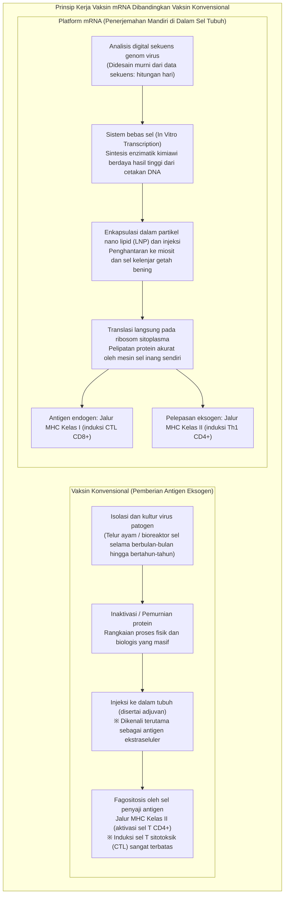
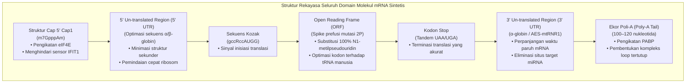
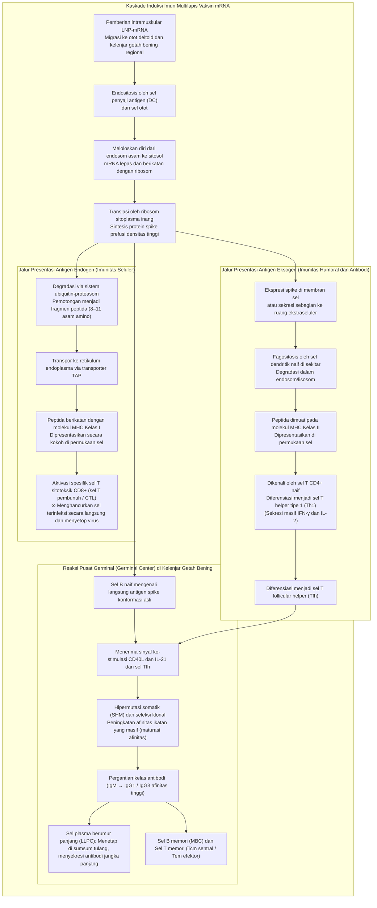
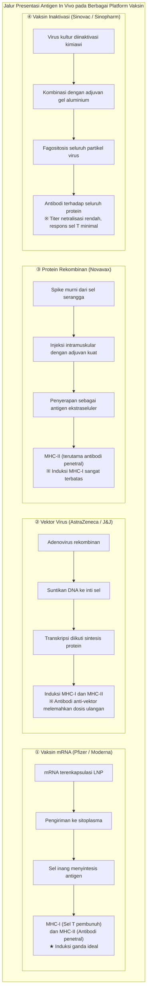

## Pendahuluan: Revolusi mRNA —— Bagaimana «Molekul yang Sangat Rapuh» Menghadirkan Pengembangan Vaksin Tercepat dalam Sejarah Manusia

Pada bulan Januari 2020, sekuens genom lengkap (sekitar 30.000 basa) dari patogen penyebab sindrom pernapasan akut misterius di Wuhan, Tiongkok — yang dinamai SARS-CoV-2 — dirilis secara daring ke seluruh dunia. Hanya berselang 42 hari kemudian, perusahaan bioteknologi Amerika Serikat, Moderna, telah mengirimkan batch pertama vial vaksin uji klinis "mRNA-1273" ke Institut Kesehatan Nasional AS (NIH). Pada saat yang sama, tim kemitraan BioNTech Jerman dan Pfizer AS dengan kandidat "BNT162b2" melaju dengan kecepatan kilat yang belum pernah terjadi sebelumnya dalam sejarah biomedis, menyelesaikan uji klinis fase III berskala besar dan meraih Izin Penggunaan Darurat (EUA) hanya dalam kurun waktu 11 bulan.

Pengembangan vaksin tradisional — baik berupa vaksin hidup yang dilemahkan (live-attenuated), vaksin inaktivasi, maupun vaksin protein rekombinan yang memerlukan pengembangbiakan virus pada telur ayam berembrio atau bioreaktor sel kultur raksasa — secara konvensional menuntut waktu **10 hingga 15 tahun** kerja keras dan biaya astronomis: mulai dari isolasi virus, seleksi galur, optimasi proses kultur, hingga pemurnian bertahap dan validasi keamanan yang berliku.

Namun, teknologi mRNA merombak total paradigma tersebut dari akarnya. Esensi revolusi ini adalah mendefinisikan ulang vaksin: bukan lagi sebagai "produk industri berupa protein antigenik yang dikultur dan dimurnikan di luar tubuh sebelum disuntikkan", melainkan sebagai **"platform perangkat lunak biologis yang memuat cetak biru genetik digital dari protein target ke dalam mesin seluler tubuh inang sendiri secara sementara, mengubah tubuh menjadi pabrik antigen mandiri yang beroperasi dengan presisi molekuler tinggi"**.



### Sifat Transien mRNA dalam Dogma Sentral dan "Kemustahilan Modifikasi Genom Manusia"

Menjawab kekhawatiran dan spekulasi publik bahwa "vaksinasi mRNA dapat mengubah atau terintegrasi ke dalam DNA manusia", prinsip paling mendasar dalam biologi molekuler — yaitu **"Dogma Sentral" (Central Dogma)** — memberikan bantahan ilmiah yang definitif dan tidak terbantahkan.

Pada sel eukariotik, informasi genetik mengalir secara searah dan ireversibel: **DNA (inti sel/nukleus) → Transkripsi (Transcription) → mRNA (ekspor ke sitoplasma) → Translasi (Translation) → Protein (sitoplasma)**. Molekul mRNA sintetis eksogen yang diberikan langsung memasuki sitosol dan ditranslasikan oleh ribosom tanpa pernah menyentuh inti sel:
1. **Tidak adanya Sinyal Lokalisasi Nukleus (NLS)**: mRNA sintetis tidak memiliki tanda peptida atau sinyal transportasi nukleus yang memungkinkannya melintasi pori-pori membran inti (nuclear pore complexes). Dengan demikian, mRNA terkurung secara fisik di dalam sitoplasma.
2. **Ketiadaan Enzim Transkriptase Balik dan Integrase**: Untuk mengubah RNA menjadi DNA, diperlukan enzim khusus "Reverse Transcriptase", dan untuk menyisipkannya ke dalam kromosom manusia diperlukan enzim "Integrase". Sel manusia yang sehat tidak memiliki enzim-enzim retroviral tersebut (eksperimen laboratorium ekstrem yang memaksakan aktivitas retrotransposon LINE-1 dilakukan secara in vitro artifisial dan tidak terbukti terjadi dalam kondisi fisiologis in vivo).
3. **Degradasi Alami yang Cepat di Dalam Tubuh**: mRNA pada dasarnya adalah molekul transien yang sangat rapuh. Dalam hitungan jam hingga beberapa hari, mRNA dihidrolisis sepenuhnya oleh enzim ribonuklease (RNase) seluler menjadi nukleotida alami yang kemudian dimetabolisme dan didaur ulang oleh sel inang.

Dengan demikian, vaksin mRNA pada hakikatnya adalah **"pesan perangkat lunak sementara yang memiliki mekanisme swa-hancur segera setelah sintesis protein selesai"**, sehingga secara biologis mustahil mengubah DNA genom inang secara permanen.

---

## Bab 1: Empat Puluh Tahun Perjuangan dan Terobosan —— Para Ilmuwan yang Mengubah mRNA Menjadi Obat

Penerapan kilat pada tahun 2020 bukanlah keajaiban yang muncul tiba-tiba tanpa sebab. Di baliknya terbentang fondasi riset dasar selama lebih dari empat dekade yang dijalani oleh para ilmuwan gigih, yang kerap dipandang sebelah mata oleh komunitas akademis, diturunkan jabatannya, dan berulang kali kehilangan pendanaan riset. Penganugerahan Hadiah Nobel Fisiologi atau Kedokteran tahun 2023 kepada Dr. **Katalin Karikó** dan Dr. **Drew Weissman** adalah penghormatan yang sangat layak bagi keteguhan riset sains dasar tersebut.

### 1.1 Tembok Keputusasaan Awal Penelitian mRNA: Ketidakstabilan Ekstrem dan Reaksi Imun Bawaan yang Mematikan

Sejak mRNA pertama kali diidentifikasi pada tahun 1961 oleh François Jacob, Sydney Brenner, dan rekan-rekannya, para ahli biologi molekuler memendam impian besar: "Jika kita bisa menyuntikkan mRNA ke dalam tubuh makhluk hidup, kita bisa mengarahkan sel untuk memproduksi protein terapeutik apa pun yang kita inginkan."

Namun, eksperimen-eksperimen awal pada dekade 1980-an dan 1990-an selalu berakhir dengan kegagalan telak. Para perintis terbentur oleh dua rintangan raksasa yang tampak mustahil diatasi:
- **Ketidakstabilan Fisikokimia Ekstrem**: Jaringan biologis, udara, dan permukaan kulit manusia dipenuhi oleh enzim penghancur yang sangat kuat, yaitu **"Ribonuklease" (RNase)**, yang berevolusi untuk melindungi tubuh dari invasi virus RNA. Molekul mRNA telanjang (Naked RNA) akan terurai berkeping-keping dalam hitungan detik setelah disuntikkan ke dalam tubuh, bahkan sebelum sempat mendekati membran sel.
- **Ledakan Bencana Sistem Imun Bawaan**: Andaikan peneliti berhasil menyuntikkan mRNA utuh ke dalam tubuh hewan percobaan, sistem kekebalan tubuh mamalia langsung mengenalinya sebagai sinyal bahaya infeksi virus patogen yang mematikan. Hal ini memicu badai sitokin inflamasi akut yang menyebabkan syok septik dan kematian pada hewan uji. mRNA pun dicap sebagai "molekul cacat yang terlalu toksik dan tidak akan pernah bisa dijadikan obat".

Kendati tersingkir dari jalur promosi profesor dan berulang kali ditolak dalam pengajuan hibah penelitian di University of Pennsylvania, seorang ahli biokimia kelahiran Hungaria, Katalin Karikó, tetap teguh pada keyakinannya bahwa RNA menyimpan potensi medis revolusioner yang belum terkuak.

### 1.2 Penemuan Bersejarah Karikó dan Weissman (2005): Menghindari Reseptor TLR Melalui Modifikasi Uridin

Pada tahun 1997, Karikó bertemu dengan Drew Weissman, seorang imunolog yang tengah meneliti kapasitas sel dendritik (Dendritic Cells: DC) dalam mempresentasikan antigen guna merancang vaksin HIV. Keduanya sepakat berkolaborasi untuk meneliti bagaimana sel dendritik merespons molekul mRNA.

Pertanyaan mendasar yang mereka hadapi adalah: **"Mengapa molekul transfer RNA (tRNA) dan ribosomal RNA (rRNA) milik sel tubuh mamalia sendiri tidak diserang oleh sistem imun, sementara mRNA yang disintesis di laboratorium melalui reaksi transkripsi in vitro (IVT) memicu reaksi peradangan yang sangat hebat pada sel dendritik?"**

Membran sel dan kompartemen endosom mamalia dijaga ketat oleh sensor imun bawaan yang dikenal sebagai **"Toll-like Receptors" (TLR)**:
- **TLR3**: mendeteksi RNA untai ganda (dsRNA).
- **TLR7 dan TLR8**: mendeteksi sekuens kaya uridin (U) pada RNA untai tunggal (ssRNA).
- **RIG-I dan MDA5**: sensor sitoplasma yang mendeteksi RNA asing berujung 5'-trifosfat dan dsRNA panjang, yang memicu transkripsi interferon tipe I (IFN-α/β).

Karikó dan Weissman menyadari perbedaan krusial: RNA endogen mamalia sarat dengan **modifikasi kimia pascatranskripsi** (seperti metilasi dan isomerisasi), sedangkan mRNA hasil IVT standar hanya dibangun dari empat basa kanonikal tanpa modifikasi (A, C, G, U).

Pada tahun 2005, mereka mempublikasikan makalah monumental: **ketika basa uridin (Uracil) pada mRNA digantikan dengan basa modifikasi alami isomernya, yaitu "pseudouridin" (Pseudouridine: Ψ), pengenalan oleh TLR7, TLR8, dan sensor intraseluler anjlok drastis, dan reaksi peradangan mematikan lenyap sepenuhnya.**

### 1.3 Evolusi dari Pseudouridin Menuju "N1-Metilpseudouridin (m1Ψ)"

Terobosan Karikó dan Weissman tidak berhenti pada penekanan peradangan. Yang luar biasa, efisiensi translasi protein oleh ribosom melonjak berlipat ganda hingga puluhan kali lipat pada mRNA yang dimodifikasi.

Ketika mRNA asing yang mengandung uridin normal memasuki sel, aktivasi sensor imun memicu enzim pertahanan seluler: **Protein Kinase R (PKR)** dan **2'-5'-Oligoadenylate Synthetase (OAS)**. PKR memfosforilasi faktor inisiasi translasi **eIF2α** sehingga mematikan seluruh sintesis protein di dalam sel, sedangkan OAS mengaktifkan **RNase L** untuk mencincang seluruh RNA di sitoplasma secara membabi buta.

Modifikasi pseudouridin berhasil menipu sistem pertahanan ini sehingga PKR dan OAS tidak terpicu, memungkinkan ribosom membaca kode genetik secara mulus dan berkelanjutan.

Pada dekade 2010-an, perusahaan bioteknologi seperti BioNTech dan Moderna melakukan penyaringan lanjutan dan mengidentifikasi turunan yang lebih unggul: **"N1-metilpseudouridin" (m1Ψ / N1-methylpseudouridine)**, dengan menyematkan gugus metil pada atom nitrogen posisi 1:
- m1Ψ mengurangi kekakuan struktur sekunder RNA tanpa mengganggu pemasangan basa kodon-antikodon pada decoding center ribosom.
- m1Ψ melenyapkan afinitas terhadap TLR7/8 ke tingkat mendekati nol, dan substitusi 100% uridin dengan m1Ψ melipatgandakan hasil ekspresi protein secara in vivo.
Vaksin BNT162b2 (Pfizer/BioNTech) dan mRNA-1273 (Moderna) secara standar mengadopsi **teknologi substitusi 100% penuh m1Ψ** ini.

### 1.4 Mahakarya Stabilisasi Struktur: "Mutasi 2P" oleh Barney Graham dan Jason McLellan

Pilar kedua penentu keberhasilan vaksin COVID-19 adalah **stabilisasi struktur tiga dimensi glikoprotein spike dalam konformasi prefusi (sebelum fusi membran) melalui "Mutasi Dua Prolin" (2P Mutation / Two-Proline Substitution)**.

Glikoprotein **Spike (S)** yang menonjol di permukaan SARS-CoV-2 adalah kunci pengikat reseptor ACE2 pada sel manusia. Protein ini bertindak seperti "pegas molekuler" metastabil yang bentuk spasialnya berubah secara radikal:
- **Konformasi Prefusi (Prefusion)**: Bentuk trimer dengan Receptor-Binding Domain (RBD) yang terbuka di puncaknya, mengekspos epitop konformasional ideal bagi induksi **antibodi netralisasi poten**.
- **Konformasi Pascafusi (Postfusion)**: Bentuk setelah membran berfusi, di mana protein meregang secara permanen menyerupai jarum. Antibodi yang diarahkan pada bentuk pascafusi memiliki kapasitas yang sangat lemah dalam menetralkan virus hidup.

Tim riset yang dipimpin oleh **Barney Graham** dari NIAID/NIH dan **Jason McLellan** dari University of Texas at Austin, melalui studi biologi struktural mikroskop elektron kriogenik (Cryo-EM) pada virus MERS-CoV dan SARS-1, menemukan bahwa mengganti dua asam amino berurutan pada daerah engsel heliks sentral (posisi lisin 986 dan valin 987) dengan **dua residu "Prolin" (Proline: P)** mampu mencegah keruntuhan struktur menuju pascafusi, **mengunci protein spike secara kokoh dalam konformasi prefusi**.

Ketika sekuens SARS-CoV-2 diunggah pada Januari 2020, mutasi 2P ini langsung diterapkan ke dalam desain mRNA. Hasilnya, sel tubuh manusia memproduksi dan memamerkan antigen spike dalam bentuk paling imunogenik yang secara spesifik memicu pembentukan antibodi penetral berdaya lindung tinggi.

---

## Bab 2: Arsitektur Presisi Molekul mRNA —— Rekayasa Transkrip Sintetis

mRNA terapeutik bukanlah sekadar salinan mentah gen virus, melainkan **biopolimer berteknologi tinggi (Engineered Biopolymer)** yang setiap domain regulatorinya telah dioptimalkan secara mendalam guna memaksimalkan translasi dan mengatur waktu paruh molekul secara presisi.



### 2.1 Struktur Tudung 5' (Evolusi dari Cap0 ke Cap1): Pengenalan Diri dan Inisiasi Translasi

Pada ujung 5' mRNA eukariotik bertengger **tudung 7-metilguanosin (m7G Cap)**. Kemurnian kimiawi dan pola metilasi struktur ini sangat krusial:
- **Tipe Cap0 (m7GpppN)**: Struktur paling sederhana yang di dalam sitosol sel vertebrata tingkat tinggi langsung dideteksi oleh sensor kekebalan **IFIT1 (Interferon-induced protein with tetratricopeptide repeats 1)** sebagai RNA virus asing, sehingga proses translasi seketika diblokir.
- **Tipe Cap1 (m7GpppNm)**: Mengandung metilasi tambahan pada posisi 2'-O dari gula ribosa nukleotida pertama setelah tudung. Ini adalah tanda khas mRNA sel inang eukariotik, yang membuatnya sepenuhnya tak kasat mata bagi IFIT1.

Vaksin Pfizer dan Moderna mengadopsi teknologi capping ko-transkripsional (seperti CleanCap®) yang menghasilkan **lebih dari 95% struktur Cap1 autentik**. Hal ini memfasilitasi perekrutan kompleks faktor inisiasi translasi **eIF4F (eIF4E, eIF4G, eIF4A)** dan pemuatan cepat subunit ribosom 40S pada mRNA.

### 2.2 Optimasi 5' dan 3' Un-translated Regions (UTR)

Wilayah yang tidak diterjemahkan menjadi protein (UTR) mengatur kecepatan pemindaian ribosom dan stabilitas molekul:
- **Desain 5' UTR**: Sekuens yang membentuk struktur sekunder rapat (seperti hairpin loops atau G-quadruplex) menghambat pergerakan ribosom. Karena itu, digunakan sekuens yang dirancang khusus berbasis 5' UTR gen **α-globin dan β-globin manusia** yang bebas dari hambatan struktural.
- **Desain 3' UTR**: Berfungsi memperlambat proses deadenilasi dan degradasi endonukleolitik. Sekuens penstabil (misalnya turunan 3' UTR α-globin mencit atau penggabungan sekuens peningkat asam amino AES dengan rRNA mitokondria mtRNR1) disematkan dengan mengeliminasi seluruh situs target mikroRNA (miRNA seed matches) agar tidak terjadi pembungkaman ekspresi gen.

### 2.3 Open Reading Frame (ORF) dan Optimasi Kodon

Wilayah penyandi protein spike (ORF) dioptimasi melalui algoritma bioinformatika tingkat tinggi:
1. **Penyelarasan dengan Kelimpahan tRNA Manusia**: Melalui degenerasi kode genetik, kodon-kodon viral digantikan dengan kodon sinonim yang memiliki kelimpahan tRNA tinggi di sitoplasma manusia. Hal ini mengeliminasi jeda decoding ribosom dan memaksimalkan laju elongasi translasi.
2. **Peningkatan Kadar GC**: Peningkatan rasio guanin dan sitosin (GC-content) mendestabilisasi struktur pengganggu, melenyapkan situs splicing prematur, dan memperkuat kestabilan termodinamika mRNA.
3. **Pembersihan Produk Sampingan dsRNA**: Jejak dsRNA hasil reaksi transkripsi menyimpang dari T7 RNA polimerase disaring secara ketat menggunakan kromatografi cair kinerja tinggi (HPLC) demi mencegah reaksi inflamasi yang tak diinginkan.

### 2.4 Ekor Poli-A (Poly-A Tail) dan "Model Loop Tertutup" (Closed-Loop Model)

Untaian residu adenin pada ujung 3' berfungsi sebagai arloji penentu umur biologis mRNA:
- Di dalam sel, ekor ini diikat oleh **Poly(A)-binding protein (PABP)**.
- Interaksi antara PABP pada ujung 3' dan eIF4G pada tudung 5' melipat mRNA menjadi **"Kompleks Loop Tertutup" (Closed-Loop Model)** yang sirkular.
- Struktur sirkular ini memungkinkan ribosom yang telah mencapai kodon stop (UAA-UGA) untuk langsung didaur ulang kembali ke tudung 5' guna memulai putaran translasi baru, memproduksi ribuan molekul protein dari satu utas mRNA yang sama.
- Panjang ekor dikalibrasi secara ketat pada rentang **100 hingga 120 nukleotida** untuk menjaga ketahanan terhadap eksonuklease.

---

## Bab 3: Bahtera Pengangkut Menembus Pertahanan Tubuh —— Rekayasa Partikel Nano Lipid (LNP)

Betapapun sempurnanya sekuens mRNA dirancang, molekul tersebut tidak akan berfungsi sama sekali tanpa sistem penghantaran (delivery system) yang mampu membimbingnya masuk ke dalam sel target. Penyelamat utama yang mengubah mRNA menjadi obat adalah **"Partikel Nano Lipid" (Lipid Nanoparticles: LNPs)** berdiameter sekitar 80 hingga 100 nanometer.

### 3.1 Mengapa mRNA Telanjang (Naked RNA) Tidak Dapat Disuntikkan Begitu Saja?

Penyuntikan mRNA telanjang langsung ke jaringan otot praktis tidak menghasilkan kemanjuran apa pun akibat dua rintangan besar:
1. **Tolakan Elektrostatik Muatan Negatif**: Tulang punggung fosfodiester mRNA bermuatan negatif kuat (polianionik). Di sisi lain, lapisan terluar membran sel manusia juga bermuatan negatif akibat gugus kepala fosfolipid dan asam sialat glikokaliks. Hukum Coulomb menyebabkan kedua entitas tersebut saling tolak-menolak dengan kuat.
2. **Penghancuran Seketika oleh RNase Cairan Tubuh**: Waktu paruh RNA telanjang di cairan interstisial dan darah hanyalah beberapa menit sebelum dihancurkan total oleh enzim nuklease.

Oleh karena itu, diperlukan "kuda Troya berukuran nano" yang mampu membungkus muatan negatif, melindungi muatan genetik, dan memfasilitasi penetrasi membran sel.

### 3.2 "Empat Lipid Emas" Pembentuk LNP dan Peran Molekulernya

LNP pada vaksin Pfizer dan Moderna tersusun dari **empat komponen lipid terkalibrasi** dengan rasio molar yang sangat presisi:

```
【Empat Lipid Utama Penyusun LNP】
1. Lipid Kationik Terionisasi (Ionizable Lipid) 〜 46-50 mol%
2. Lipid Pembantu / Fosfolipid (Helper Lipid: DSPC) 〜 10 mol%
3. Kolesterol (Cholesterol) 〜 38-43 mol%
4. Lipid Ter-PEGilasi (PEGylated Lipid) 〜 1.5-1.7 mol%
```

| Komponen Lipid | Molekul yang Digunakan (Pfizer / Moderna) | Rasio Molar (mol%) | Karakteristik Fisikokimia | Fungsi Biologis Esensial |
| :--- | :--- | :--- | :--- | :--- |
| **Lipid Terionisasi<br/>(Ionizable Lipid)** | **ALC-0315** (Pfizer)<br/>**SM-102** (Moderna) | **~46 hingga 50%** | Nilai pKa semu **6.0–6.8**. Bermuatan positif di lingkungan asam, netral pada pH fisiologis. Memiliki gugus amina tersier dan ikatan ester terurai hayati. | ① Mengikat mRNA bermuatan negatif pada pH asam saat formulasi inti partikel.<br/>② Netral pada pH darah (7.4) sehingga terhindar dari toksisitas membran dan hemolisis.<br/>③ Terprotonasi kembali dalam endosom asam untuk merusak membran endosom dan melepaskan mRNA. |
| **Lipid Pembantu<br/>(Helper Lipid)** | **DSPC**<br/>(1,2-distearoyl-sn-glycero-3-phosphocholine) | **~10%** | Fosfolipid jenuh dengan suhu transisi fase tinggi (~55°C) dan bentuk molekul silindris. | Membentuk lipid bilayer yang stabil di kulit luar LNP, menjaga ketegaran struktural dan integritas morfologi partikel nano. |
| **Kolesterol<br/>(Cholesterol)** | Kolesterol murni nabati (plant-derived) | **~38 hingga 43%** | Kerangka steroid kaku dengan gugus hidroksil kecil; molekul pengatur kerapatan membran. | Mengisi celah di antara molekul fosfolipid, mengoptimalkan fluiditas dan elastisitas membran, mencegah kebocoran, dan mendukung fusi membran sel. |
| **Lipid Ter-PEGilasi<br/>(PEGylated Lipid)** | **ALC-0159** (Pfizer)<br/>**PEG2000-DMG** (Moderna) | **~1.5 hingga 1.7%** | Rantai hidrofilik polietilena glikol (berat molekul 2000 Da) terikat pada jangkar lipid (dimiristilgliserol). | ① Mencegah agregasi antarpartikel selama penyimpanan dan mengontrol keseragaman ukuran (~80 nm).<br/>② Mencegah opsonisasi protein plasma, memperpanjang waktu sirkulasi darah.<br/>③ Meluruh secara bertahap (shedding) di dalam tubuh untuk memungkinkan penyerapan seluler. |

### 3.3 Keajaiban Endositosis dan Pelarian Endosom (Endosomal Escape)

Setelah disuntikkan secara intramuskular, rintangan terbesar sebelum translasi dimulai adalah **"Pelarian Endosom" (Endosomal Escape)**:
1. **Opsonisasi ApoE dan Endositosis**: Saat terpapar cairan interstisial dan darah, LNP menyerap **Apolipoprotein E (ApoE)** endogen pada permukaannya. Hal ini memicu penyerapan melalui reseptor Low-Density Lipoprotein (**LDLR**) pada permukaan sel dendritik, makrofag, dan miosit melalui endositosis yang dimediasi reseptor ke dalam vesikel endosom.
2. **Pengasaman Endosom**: Saat endosom awal matang menjadi endosom lanjut, pompa proton V-ATPase menurunkan pH luminal dari 7.4 menjadi 6.5 hingga di bawah 5.5.
3. **Pembalikan Muatan dan "Efek Spons Proton"**: Lipid terionisasi (pKa 6.0–6.8) menyerap proton ($H^+$) secara masif, **bertransformasi drastis dari netral menjadi bermuatan positif kuat (kationik)**.
4. **Fusi Membran dan Pembebasan ke Sitosol**: Lipid kationik berinteraksi kuat secara elektrostatik dengan fosfolipid anionik (seperti fosfatidilserin) pada membran endosom. Ini mengacaukan struktur lamelar bilayer dan memicu fase heksagonal terbalik ($H_{II}$). Membran endosom robek dan berlubang, melepaskan muatan mRNA tanpa cacat **langsung ke kolam ribosom di sitoplasma**.

Penelitian nanobiologi membuktikan bahwa proporsi mRNA yang berhasil meloloskan diri ke sitoplasma sebenarnya hanya **beberapa persen hingga 15%**. Namun, karena efisiensi translasi mRNA yang luar biasa tinggi, jumlah kecil yang lolos tersebut sudah lebih dari cukup untuk menghasilkan ledakan produksi protein spike yang memicu kekebalan protektif.

### 3.4 Teknologi Pencampuran Mikrofluidik (Microfluidic Formulation)

Produksi massal LNP secara konsisten dimungkinkan oleh lompatan teknologi **"Pencampuran Mikrofluidik" (Microfluidics)**:
Dalam saluran mikro selebar puluhan mikrometer, larutan etanol berisi keempat lipid ditabrakkan dengan larutan akuatik asam berisi mRNA pada rasio laju alir yang dikendalikan dengan sangat cermat.
Pengenceran mendadak konsentrasi etanol menurunkan kelarutan lipid secara drastis, memicu fenomena **swa-rakit (Self-assembly)**: lipid kationik memadatkan mRNA di bagian inti, sementara DSPC, kolesterol, dan lipid PEG membentuk cangkang luar pelindung. Proses ini secara kontinu menghasilkan LNP dengan **ukuran seragam 80–100 nm, efisiensi enkapsulasi >90%, dan indeks polidispersitas yang sangat sempit (PDI < 0.1)** dalam hitungan milidetik.

---

## Bab 4: Kaskade Imun Multilapis —— Dari Translasi Sitoplasmik hingga Pembentukan Kekebalan Sistemik

Keunggulan mutlak vaksin mRNA atas vaksin inaktivasi dan vaksin subunit protein terletak pada kemampuannya **mengaktifkan presentasi antigen ganda melalui jalur MHC Kelas I dan MHC Kelas II secara simultan**.



### 4.1 Penyerapan Lokal pada Jaringan Otot dan Kelenjar Getah Bening Penguras

Setelah disuntikkan ke dalam otot deltoid, sebagian besar LNP berpindah melalui cairan interstisial menuju kelenjar getah bening regional (terutama kelenjar getah bening ketiak/aksila) dalam beberapa jam hingga hari pertama.
- Meskipun miosit (sel otot) turut menyerap mRNA dan mengekspresikan spike, pengendali utama induksi imun adalah sel penyaji antigen profesional (APC), terutama **Sel Dendritik (Dendritic Cells: DC)** dan makrofag di kelenjar getah bening.
- Protein spike prefusi yang ditranslasikan di sitoplasma sel dendritik menjalani modifikasi pascatranslasi alami (glikosilasi dan pembentukan ikatan disulfida yang tepat), membentuk struktur trimer asli yang terpasang di permukaan membran sel.

### 4.2 Jalur MHC Kelas I dan Induksi Masif Sel T Sitotoksik (CD8+ CTL)

Vaksin konvensional (protein subunit atau virus inaktivasi) mengalirkan antigen dari luar sel, sehingga hanya mengaktifkan jalur MHC Kelas II dan sangat sulit memicu **Sel T Sitotoksik pembunuh (CD8+ CTL)** yang bertugas melisiskan sel yang telah terinfeksi virus.

Sebaliknya, vaksin mRNA menginstruksikan sintesis antigen **di dalam sitoplasma (endogen)**:
1. **Degradasi Proteasom**: Sebagian protein spike sitoplasmik ditandai oleh ubiquitin dan dipotong oleh kompleks **proteasom** menjadi peptida pendek (8–11 asam amino).
2. **Transpor TAP**: Fragmen peptida diangkut secara aktif ke dalam retikulum endoplasma (ER) oleh transporter **TAP**.
3. **Pemuatan ke MHC Kelas I**: Peptida disematkan ke celah pengikat molekul **MHC Kelas I (HLA-A, B, C)** dan dihantarkan melalui aparatus Golgi ke permukaan luar sel.
4. **Priming Sel T Pembunuh**: Sel T CD8+ naif mengenali kompleks MHC-I/peptida ini melalui reseptor sel T (TCR), dan dengan dorongan sinyal ko-stimulasi (CD80/CD86 dan CD28), berdiferensiasi menjadi **Sel T Sitotoksik Efektor (CTL)**.

Induksi sel T pembunuh yang tangguh ini terbukti menjadi benteng pertahanan terakhir yang tak tergoyahkan dalam mencegah keparahan dan kematian ketika varian mutan virus berhasil menghindari antibodi penetral.

### 4.3 Jalur MHC Kelas II dan Polarisasi Sel T Pembantu Tipe Th1

Secara paralel, protein spike yang disekresikan atau dilepaskan saat sel lisis memasuki lingkungan ekstraseluler:
- Sel dendritik naif lainnya menelan antigen ini dan memecahnya di dalam lisosom asam menjadi fragmen 13–18 asam amino.
- Fragmen tersebut dimuat ke molekul **MHC Kelas II (HLA-DR, DQ, DP)** untuk dipresentasikan kepada sel T CD4+ naif.
- Komponen lipid LNP memberikan sinyal adjuvan bawaan yang mengarahkan diferensiasi sel CD4+ secara dominan ke arah **Th1 (penghasil interferon-gamma dan IL-2)**, alih-alih Th2 yang berisiko memicu alergi. Hal ini sangat krusial dalam meniadakan komplikasi patologis paru (VAED).

### 4.4 Pembentukan Pusat Germinal (Germinal Centers) dan Maturasi Afinitas Sel B

Puncak respons imun adaptif yang paling spektakuler dari vaksin mRNA adalah pemeliharaan **Pusat Germinal (Germinal Centers: GC)** jangka panjang di folikel kelenjar getah bening:
1. **Pengenalan Antigen Natif**: Sel B naif berikatan langsung melalui BCR dengan trimer spike konformasi asli di permukaan sel penyaji antigen.
2. **Dukungan Kuat Sel Tfh**: Sel B bermigrasi ke pusat germinal dan menerima sinyal penyelamat hidup (CD40L dan IL-21) dari **Sel T Follicular Helper (Tfh)**.
3. **Hipermutasi Somatik (SHM) dan Seleksi Klonal**: Pada zona gelap (dark zone) pusat germinal, enzim AID memicu mutasi acak berfrekuensi tinggi pada gen pengikat antigen sel B. Pada zona terang (light zone), terjadi seleksi ketat: hanya sel B dengan mutasi yang menghasilkan ikatan terkuat terhadap spike yang diizinkan bertahan hidup, sedangkan sel B berafinitas rendah dimusnahkan melalui apoptosis.
4. **Pergantian Kelas dan Diferensiasi Sel Berumur Panjang**: Antibodi berevolusi dari IgM afinitas rendah menjadi **IgG afinitas tinggi (terutama IgG1 dan IgG3)** berdaya netralisasi superior. Klon elit bermigrasi ke sumsum tulang sebagai **Sel Plasma Berumur Panjang (Long-Lived Plasma Cells: LLPC)** yang menyekresi antibodi selama berbulan-bulan, sementara yang lain menjadi **Sel B Memori (Memory B Cells: MBC)** yang bersiaga di seluruh tubuh.

Biopsi kelenjar getah bening pada manusia membuktikan bahwa reaksi pusat germinal yang dipicu oleh vaksin mRNA **tetap aktif secara luar biasa selama lebih dari 6 bulan setelah dosis pertama**, menjelaskan kualitas dan kematangan antibodi yang tiada tanding.

---

## Bab 5: Bukti Klinis, Dinamika Efikasi, dan Pertempuran Melawan Varian Mutan

### 5.1 Hasil Uji Klinis Fase III Skala Besar: Kejutan Efikasi 95%

Hasil uji klinis Fase III vaksin Pfizer (Polack et al.) dan Moderna (Baden et al.) yang dipublikasikan di *The New England Journal of Medicine (NEJM)* pada akhir tahun 2020 mengguncang dunia kedokteran:
- **Pfizer/BioNTech (BNT162b2: 43.448 partisipan)**: Tercatat 162 kasus COVID-19 bergejala pada kelompok plasebo berbanding hanya 8 kasus pada kelompok vaksin, menghasilkan **efikasi pencegahan gejala sebesar 95,0% (95% CI: 90,3–97,6%)**. Kasus parah terjadi pada 9 orang di kelompok plasebo berbanding hanya 1 orang di kelompok vaksin.
- **Moderna (mRNA-1273: 30.420 partisipan)**: 185 kasus COVID-19 pada kelompok plasebo (termasuk 30 kasus parah dan 1 kematian) berbanding 11 kasus pada kelompok vaksin (0 kasus parah), menunjukkan **efikasi 94,1% (95% CI: 89,3–96,8%)** serta efikasi 100% terhadap penyakit parah.

Awalnya, FDA AS dan WHO menetapkan ambang batas minimum persetujuan darurat sebesar 50%. Mempertimbangkan bahwa efikasi vaksin influenza musiman biasanya berkisar antara 40% hingga 60%, angka 95% terhadap patogen yang benar-benar baru merupakan kemenangan spektakuler bioteknologi molekuler.

### 5.2 Interpretasi Statistik: Relative Risk Reduction (RRR) vs. Absolute Risk Reduction (ARR)

Sempat timbul kesalahpahaman publik yang menyatakan bahwa "angka 95% hanyalah Pengurangan Risiko Relatif (RRR), sementara Pengurangan Risiko Mutlak (ARR) kurang dari 1%, sehingga vaksin dianggap tidak berguna".

Analisis ilmiah dan matematis yang tepat membantah klaim keliru tersebut:
- **RRR (Relative Risk Reduction)**: Membandingkan rasio kejadian pada kelompok plasebo ($I_p$) dan kelompok vaksin ($I_v$):
  $$RRR = \frac{I_p - I_v}{I_p} \times 100\% = \frac{0,0088 - 0,0004}{0,0088} \approx 95\%$$
  Ini adalah ukuran murni dari **kapasitas biologis dan imunologis vaksin dalam melucuti patogen**.
- **ARR (Absolute Risk Reduction)**: Selisih absolut proporsi orang yang terinfeksi dalam populasi uji selama jendela waktu observasi:
  $$ARR = I_p - I_v \approx 0,88\% - 0,04\% = 0,84\%$$
- **Hakikat Statistik**:
  Nilai ARR sepenuhnya bergantung pada **"tingkat penularan dan paparan virus di masyarakat (background incidence rate)"** selama masa uji. Jika uji klinis dilakukan di masyarakat dengan sirkulasi virus yang sangat rendah, ARR vaksin tercanggih mana pun secara matematis pasti berada di bawah 1%. Namun, ketika terjadi lonjakan wabah dan 20% populasi terpapar, maka ARR seketika melonjak menjadi $20\% \times 95\% = 19\%$.
  Oleh karena itu, mengklaim vaksin tidak efektif hanya karena ARR kecil adalah kesalahan metodologis fatal yang mencampuradukkan potensi biologis dengan laju paparan epidemiologis.

### 5.3 Bukti Dunia Nyata (Real-World Evidence): Data Skala Nasional

Ketika diterapkan pada populasi dunia nyata yang heterogen (mencakup puluhan juta lansia, penderita komorbiditas, dan pasien imunosupresi), vaksin mRNA terus membuktikan ketangguhannya.

Studi kohort skala nasional di **Israel (studi pencocokan 1,2 juta orang dari Clalit Health Services, Dagan et al., NEJM 2021)** serta data registri nasional Inggris (UKHSA) dan CDC AS membuktikan tiga fakta krusial:
1. **Dominasi Melawan Galur Awal**: Terhadap galur asli Wuhan dan varian Alfa, efikasi di dunia nyata konsisten di atas 90% dalam mencegah infeksi dan di atas 95% dalam mencegah rawat inap dan kematian.
2. **Pelemahan Proteksi Infeksi Seiring Waktu**: Setelah 4 hingga 6 bulan, seiring peluruhan alami titer antibodi dalam darah, perlindungan terhadap infeksi bergejala ringan menurun ke kisaran 60–70%.
3. **Ketahanan Perlindungan Penyakit Parah dan Kematian**: Sebaliknya, perlindungan terhadap rawat inap rumah sakit, penggunaan ventilator, dan kematian tetap kokoh bertahan di atas 85–90% untuk jangka panjang. Hal ini berkat kesiapsiagaan sel B memori di sumsum tulang dan **barikade kokoh imunitas seluler sel T pembunuh (CD8+ CTL)** yang membasmi virus di jaringan paru-paru.

### 5.4 Gelombang Varian Mutan dan Immune Escape: Penurunan Antibodi vs. Ketahanan Sel T

Seiring berjalannya pandemi, SARS-CoV-2 mengakumulasi mutasi genetik di bawah tekanan seleksi imun.

| Silsilah Varian | Mutasi Kunci (RBD dsb.) | Sensitivitas Netralisasi (relatif thd asal) | Efikasi Infeksi (2 dosis) | Efikasi Sakit Parah (2 dosis) | Efek Dosis Penguat (Booster) |
| :--- | :--- | :--- | :--- | :--- | :--- |
| **Galur Asli Wuhan<br/>(Wuhan-Hu-1)** | Standar rujukan | **1,0x** (basis) | **~95%** | **>95%** | Titer antibodi melonjak puluhan kali lipat |
| **Alfa<br/>(Alpha: B.1.1.7)** | N501Y, P681H | **Turun tipis 1,5–2 kali** | **~85–90%** | **~95%** | Memulihkan perlindungan maksimal |
| **Delta<br/>(Delta: B.1.617.2)** | L452R, T478K, P681R | **Turun 3–6 kali** | **~60–75%** (turun seiring waktu) | **~90%** | Dosis ketiga memulihkan perlindungan gejala hingga >85% |
| **Omicron BA.1/BA.2<br/>(Omicron Awal)** | >15 mutasi di RBD<br/>(K417N, E484A, N501Y dll.) | **Anjlok 20–40 kali lipat** | **~20–40%** (turun drastis pd 2 dosis) | **~70–80%** (dipertahankan sel T) | Dosis penguat mendongkrak perlindungan gejala ke 65–75% & sakit parah ke >90% |
| **Omicron BA.4/BA.5<br/>& Subvarian XBB/JN.1** | L452R, F486V/P, R346T<br/>afinitas reseptor & escape ekstrem | **Kehilangan ikatan netralisasi luas** | **Hampir nihil (hanya 2 dosis lama)** | **~60–70%** (dipertahankan memori sel T) | Vaksin bivalen dan monovalen XBB.1.5/JN.1 mengembalikan antibodi penetral & proteksi rawat inap 70–80%+ |

Munculnya varian Omicron memperlihatkan batas pertahanan lini depan antibodi: lebih dari 30 mutasi pada protein spike mengubah bentuk epitop konformasional di permukaan virus.

Namun, di sinilah **imunitas sel T menunjukkan keunggulannya yang tak tertandingi**:
- Antibodi menargetkan epitop struktural 3D sempit di puncak RBD, sehingga beberapa mutasi asam amino sudah cukup menurunkan daya ikatnya.
- Sebaliknya, sel T mengenali **fragmen peptida linier pendek** yang tersebar merata di sepanjang 1.273 asam amino protein spike.
- Karena setiap individu manusia mengekspresikan molekul HLA (MHC) yang sangat beragam, virus secara biologis mustahil memutasikan seluruh epitop sel T secara serentak.
- Konsorsium riset global membuktikan: **lebih dari 80–90% epitop sel T yang dipicu vaksin asli tetap utuh sempurna terhadap Omicron**. Ketahanan sel T inilah yang mencegah kolapsnya ruang ICU dan menekan angka kematian di seluruh dunia saat gelombang Omicron meledak.

### 5.5 Vaksinasi Penguat (Booster) dan Desain Vaksin Pembaruan Antikultur

Platform mRNA menunjukkan kelincahan luar biasa dalam beradaptasi dengan evolusi virus:
1. **Booster Homolog (Dosis ke-3)**: Suntikan dosis tambahan vaksin asli menyalakan kembali pusat germinal dan memicu maturasi afinitas sel B memori untuk memproduksi antibodi netralisasi silang terhadap Omicron.
2. **Vaksin Bivalen (Bivalent Vaccines)**: Formulasi campuran 1:1 antara mRNA galur asli dan varian Omicron BA.4/5 berhasil memperluas cakupan spektrum imun.
3. **Vaksin Monovalen Terkini (XBB.1.5, JN.1)**: Untuk menghindari fenomena "Antigenic Imprinting" (Original Antigenic Sin), formulasi diperbarui menjadi monovalen sesuai galur dominan terbaru. Hanya butuh waktu **2 hingga 3 bulan** dari pembacaan kode digital hingga produksi botol siap pakai — kecepatan yang tidak mungkin ditandingi platform konvensional mana pun.

---

## Bab 6: Profil Keamanan, Patofisiologi Efek Samping, dan Analisis Risiko-Manfaat

Sebagai produk biologis berdaya kuat, vaksin mRNA memiliki profil reaktogenisitas terduga serta potensi efek samping langka yang wajib dianalisis secara objektif dan transparan berdasarkan data sains kedokteran.

### 6.1 Reaktogenisitas Lokal dan Sistemik: Biaya Fisiologis Kesiapsiagaan Imun

Gejala umum yang dirasakan setelah vaksinasi — seperti nyeri di tempat suntikan, kemerahan, demam, kelelahan, menggigil, nyeri otot, dan sakit kepala — bukanlah kerusakan toksik, melainkan **"tanda biologis alami bahwa sistem kekebalan bawaan tubuh sedang bekerja aktif"**:
- Lipid LNP dan molekul RNA memicu makrofag lokal untuk melepaskan sitokin pro-inflamasi sementara seperti **IL-1β, IL-6, TNF-α, dan interferon tipe I**.
- Sirkulasi IL-6 memicu pusat termoregulasi di hipotalamus otak yang menyebabkan kenaikan suhu tubuh (demam).
- Sebagian besar gejala ini mereda spontan dalam kurun waktu 24 hingga 48 jam dan dapat diringankan dengan obat pereda nyeri/demam seperti parasetamol atau ibuprofen.

### 6.2 Miokarditis dan Perikarditis (Myocarditis / Pericarditis)

Sistem farmakovigilans global (VAERS, VSD di AS, serta kementerian kesehatan Israel dan Eropa) mengidentifikasi kejadian miokarditis dan perikarditis yang sangat langka, terutama pada **remaja putra dan pria muda (usia 12–29 tahun)** beberapa hari setelah dosis kedua.

#### ① Frekuensi Epidemiologis
- Insidensi keseluruhan sangat langka: **sekitar 1 hingga 5 kasus per 100.000 dosis**.
- Pada kelompok berisiko tertinggi (**pria usia 16–19 tahun setelah dosis kedua**), angkanya berkisar antara **10 hingga 15 kasus per 100.000 dosis (~0,01%)**.
- Vaksin Moderna (100 µg) menunjukkan angka kejadian sedikit lebih tinggi dibandingkan Pfizer (30 µg), sehingga banyak negara memprioritaskan vaksin Pfizer untuk pria muda.

#### ② Hipotesis Mekanisme Patofisiologi Molekuler
1. **Protein Spike Bebas**: Penelitian Harvard (Yonker et al., Circulation 2023) menemukan bahwa pada beberapa pemuda yang mengalami miokarditis, terdeteksi kadar kecil "protein spike bebas" yang tidak terikat antibodi dalam darah, yang memicu stimulasi berlebih pada reseptor kardiomiosit.
2. **Pengaruh Hormon Testosteron**: Testosteron memperkuat respons Th1 dan makrofag pro-inflamasi, sedangkan estrogen memiliki efek anti-inflamasi, menjelaskan mengapa pria muda lebih rentan.
3. **Reaksi Autoimun Transien**: Reaktivitas silang sementara terhadap protein kontraktil jantung seperti alfa-miosin.

#### ③ Perjalanan Klinis dan Perbandingan Krusial dengan Infeksi Virus
- **Lebih dari 90% kasus bersifat ringan**: Pasien sembuh total dalam beberapa hari dengan terapi suportif anti-inflamasi non-steroid (NSAID) tanpa meninggalkan disfungsi jantung kronis.
- **Risiko akibat infeksi SARS-CoV-2 jauh lebih mematikan**: Data CDC AS dan Inggris membuktikan bahwa risiko miokarditis berat, aritmia fatal, gagal jantung, badai sitokin, dan kematian akibat terinfeksi virus nyata puluhan kali lipat lebih tinggi daripada risiko akibat vaksinasi. Dengan demikian, rasio manfaat-risiko tetap sangat mendukung vaksinasi.

### 6.3 Anafilaksis dan Alergi PEG

Reaksi alergi anafilaksis berat terjadi pada frekuensi yang amat kecil, yaitu **sekitar 2 hingga 5 kasus per 1 juta dosis**:
- Pemicu utama adalah reaksi terhadap **PEG2000 (Polietilena Glikol)** pada LNP akibat sensitisasi sebelumnya dari produk kosmetik atau obat pencahar, atau melalui aktivasi komplemen (CARPA).
- Prosedur observasi selama 15–30 menit di lokasi vaksinasi serta penanganan kilat dengan injeksi intramuskular epinefrin (adrenalin) berhasil mencegah kematian secara total.

### 6.4 Ketiadaan Risiko Sindrom Trombosis dengan Trombositopenia (TTS / VITT)

Vaksin vektor adenovirus (AstraZeneca dan Johnson & Johnson) sempat dikaitkan dengan sindrom pembekuan darah fatal **TTS/VITT (Thrombosis with Thrombocytopenia Syndrome)**:
- VITT disebabkan oleh interaksi protein kapsid adenovirus dengan Platelet Factor 4 (PF4), memicu pembentukan autoantibodi yang menggumpalkan trombosit di sinus vena otak.
- **Vaksin mRNA sama sekali tidak mengandung kapsid protein virus**: Oleh karena itu, vaksin mRNA **terbebas sepenuhnya dari risiko TTS/VITT**.

### 6.5 Menepis Kekhawatiran Fenomena ADE dan VAED

Sejarah mencatat bahwa kegagalan vaksin demam berdarah dan vaksin RSV inaktivasi pada 1960-an dipicu oleh fenomena **ADE (Antibody-Dependent Enhancement)** dan **VAED (Vaccine-Associated Enhanced Disease)**:
- Setelah miliaran dosis diberikan di seluruh dunia, **tidak ditemukan satu pun kasus ADE atau VAED pada vaksin mRNA COVID-19**.
- Kuncinya adalah mutasi 2P yang menjamin pembentukan antibodi penetral afinitas tinggi murni, serta formulasi LNP yang secara ketat mengarahkan imunitas sel T ke tipe Th1, melenyapkan risiko kerusakan paru tipe Th2.

| Efek Samping / Kejadian Merugikan | Frekuensi Kejadian | Waktu Muncul Khas | Mekanisme Patofisiologis Utama | Luaran Klinis dan Penanganan |
| :--- | :--- | :--- | :--- | :--- |
| **Reaksi Lokal Suntikan** (nyeri, bengkak, kemerahan) | **70–85%** (sangat umum) | Hari penyuntikan hingga esok hari | Pelepasan sitokin lokal (IL-1, TNF) dan infiltrasi neutrofil di otot | Sembuh sendiri dalam 1–3 hari. Kompres dingin dan istirahat. |
| **Reaktogenisitas Sistemik** (demam, letih, sakit kepala) | **50–70%** (umum, lebih kuat pd dosis 2) | 12–24 jam pascavaksinasi | Lonjakan IL-6 dan IFN sistemik memicu pusat termoregulasi otak | Hilang dalam 1–2 hari. Parasetamol atau obat pereda nyeri. |
| **Miokarditis dan Perikarditis** | **1–5 per 100.000 dosis** (sangat langka, pria 12–29 th) | 2–4 hari setelah suntikan | Spike bebas, modulasi hormon testosteron, autoimunitas transien | **>90% kasus ringan**. Pemulihan cepat dan sempurna dengan NSAID. |
| **Anafilaksis** | **2–5 per 1.000.000 dosis** (amat sangat langka) | Dalam 15–30 menit pertama | Alergi terhadap PEG2000 atau aktivasi komplemen mastosit (CARPA) | Sembuh tuntas tanpa sekuelae dengan injeksi cepat epinefrin. |
| **Sindrom Guillain-Barré** | **Sesuai angka kejadian dasar populasi** | Beberapa minggu kemudian | Autoantibodi terhadap mielin (dilaporkan pd vektor virus, dibantah pd mRNA) | Terapi Imunoglobulin Intravena (IVIg) atau pertukaran plasma. |

---

## Bab 7: Perbandingan Menyeluruh Platform Teknologi Vaksin

Pandemi COVID-19 menjadi arena pembuktian di mana seluruh platform bioteknologi yang dimiliki peradaban manusia saling berkompetisi secara langsung.



### 7.1 mRNA vs. Vektor Virus (Platform Berbasis DNA)

Vaksin vektor adenovirus membawa gen spike (DNA) di dalam cangkang virus yang telah dilemahkan.
- **Kelebihan**: DNA lebih stabil, memungkinkan penyimpanan pada suhu kulkas standar (2–8°C).
- **Kelemahan Fatal (Anti-Vector Immunity)**: Tubuh membentuk antibodi tidak hanya terhadap protein spike, tetapi juga terhadap cangkang adenovirus pengangkutnya. Akibatnya, pada dosis penguat (booster) berikutnya, pembawa dinetralkan oleh sistem imun sebelum sempat menginfeksi sel target. Selain itu, ada risiko langka VITT.
- Sebaliknya, vaksin mRNA menggunakan LNP sintetis yang bebas imunogenisitas protein, sehingga **dapat disuntikkan berulang kali tanpa batas tanpa terganggu antibodi anti-pembawa**.

### 7.2 mRNA vs. Vaksin Protein Rekombinan

Vaksin seperti Novavax menyintesis dan memurnikan protein spike di bioreaktor sel serangga, lalu menyuntikkannya bersama adjuvan berbasis saponin (Matrix-M™).
- **Kelebihan**: Teknologi matang dengan reaktogenisitas yang sangat lembut.
- **Kekurangan**: Proses kultur seluler dan pemurnian memerlukan waktu berbulan-bulan, sehingga adaptasi terhadap kemunculan varian baru menjadi sangat lambat.

### 7.3 mRNA vs. Vaksin Inaktivasi

Vaksin Sinovac dan Sinopharm menggunakan virus utuh yang dimatikan dengan bahan kimia.
- **Kelebihan**: Menyajikan seluruh protein virus (termasuk nukleokapsid).
- **Kekurangan**: Titer antibodi netralisasi rendah dan induksi sel T sitotoksik (CTL) hampir nol. Proteksi terhadap Omicron runtuh dengan cepat. Membutuhkan fasilitas keamanan hayati BSL-3 yang sangat mahal dan rumit.

### 7.4 Proses Manufaktur dan Tantangan Termodinamika Rantai Dingin

Tantangan logistik terbesar vaksin mRNA pada awal pandemi adalah **"Rantai Dingin Beku Ekstrem (-80°C hingga -20°C)"**:
- **Alasan Fisikokimia**: Ikatan fosfodiester RNA rentan mengalami autohidrolisis spontan oleh gugus 2'-OH dalam lingkungan berair, ditambah risiko oksidasi lipid LNP.
- **Pendinginan Ekstrem**: Diperlukan suhu -80°C (Pfizer) atau -20°C (Moderna) untuk membekukan pergerakan molekuler dan mencegah hidrolisis.
- **Keunggulan Manufaktur yang Masif**: Karena transkripsi enzimatik bersifat bebas sel (in vitro), bioreaktor kecil berukuran beberapa liter mampu memproduksi ratusan juta dosis mRNA dalam beberapa hari. Kemampuan skalabilitas inilah yang memungkinkan pasokan miliaran dosis ke seluruh penjuru dunia.

| Parameter Perbandingan | ① Vaksin mRNA | ② Vektor Virus | ③ Protein Rekombinan | ④ Vaksin Inaktivasi |
| :--- | :--- | :--- | :--- | :--- |
| **Contoh Produk** | **Pfizer (BNT162b2)<br/>Moderna (mRNA-1273)** | AstraZeneca (ChAdOx1)<br/>J&J (Ad26.COV2.S) | Novavax (NVX-CoV2373) | Sinovac (CoronaVac)<br/>Sinopharm (BBIBP) |
| **Bentuk Antigen** | mRNA dalam partikel nano lipid | DNA dalam adenovirus non-replikasi | Protein partikel nano murni | Seluruh virion inaktivasi formalin |
| **Tempat Produksi Antigen** | **Sitosol sel inang (endogen)** | Nukleus & sitosol sel inang | Di luar tubuh (sel serangga/CHO) | Di luar tubuh (sel kultur Vero) |
| **Titer Antibodi Penetral** | **Tertinggi dan Terkuat** | Kuat hingga Sedang | Sangat Kuat | Sedang hingga Lemah |
| **Induksi CTL CD8+** | **Sangat Kuat (via MHC-I)** | Kuat | Sangat Terbatas | Hampir Nihil |
| **Kecepatan Update Galur** | **Tercepat (2–3 bulan)** | Sedang (2–4 bulan) | Lambat (6–12 bulan) | Sangat Lambat (>6 bulan) |
| **Efek Samping Utama** | Demam, nyeri, miokarditis langka | Demam, trombosis langka (VITT) | Nyeri lokal ringan | Reaksi lokal sangat minimal |
| **Suhu Penyimpanan** | **-80°C s.d. -20°C (beku)** | 2°C s.d. 8°C (kulkas biasa) | 2°C s.d. 8°C (kulkas biasa) | 2°C s.d. 8°C (kulkas biasa) |
| **Kesesuaian Dosis Ulangan** | **Sempurna (tidak terbatas)** | Rendah (imunitas anti-vektor) | Sangat Baik | Sangat Baik |

---

## Bab 8: Garis Depan Teknologi mRNA —— Dari Imunoterapi Kanker Menuju Pengobatan Presisi

Keberhasilan menangkal COVID-19 menetapkan mRNA sebagai **arsitektur perangkat lunak dasar bagi masa depan kedokteran biomedis abad ke-21**.

### 8.1 Vaksin Kanker Neoantigen Terpersonalisasi (Personalized Cancer Vaccines)

Misi pendirian BioNTech dan Moderna sedari awal bukanlah penyakit menular, melainkan **"Pengobatan Kanker (Onkologi)"**.

Sel kanker mengakumulasi mutasi genetik yang menghasilkan protein abnormal yang tidak ada pada sel sehat, yang dikenal sebagai **"Neoantigen"**:
- **Alur Kerja Pembuatan Vaksin Kanker Personal**:
  1. Sampel tumor dan jaringan sehat pasien disekuensing menggunakan Next-Generation Sequencing (NGS).
  2. Algoritma AI memprediksi kandidat mutasi peptida (10–34 neoantigen) yang paling kuat mengikat molekul HLA unik pasien.
  3. Kaset mRNA sintetis yang memuat mutasi-mutasi tersebut diproduksi secara kustom dalam hitungan minggu.
  4. Disuntikkan ke tubuh pasien untuk memobilisasi armada sel T sitotoksik CD8+ elit yang secara spesifik memburu sel tumor tanpa merusak jaringan sehat.
- **Data Uji Klinis Mengagumkan**: Pada uji klinis Fase IIb (Moderna dan Merck/MSD), kombinasi vaksin mRNA kustom (mRNA-4157 / V940) dengan Keytruda pada pasien melanoma berisiko tinggi berhasil **menurunkan risiko kekambuhan atau kematian sebesar 44%** dibandingkan monoterapi (Lancet 2024). Saat ini uji Fase III untuk kanker paru dan pankreas sedang berjalan pesat.

### 8.2 Ekspansi Luas pada Penyakit Menular: Flu Kombinasi, RSV, HIV, dan Malaria

- **Vaksin Kombinasi Multiplex**: Penggabungan vaksin influenza musiman (4 galur A dan B) bersama vaksin COVID-19 dalam satu botol suntikan tunggal.
- **Vaksin Pan-Coronavirus**: Vaksin yang menargetkan daerah lestari (domain S2) yang tidak mudah bermutasi untuk menangkal potensi pandemi virus korona di masa depan.
- **Penyakit Menular Kronis**: Uji klinis vaksin mRNA kompleks untuk memicu antibodi netralisasi luas (bNAbs) terhadap HIV, malaria, dan tuberkulosis.

### 8.3 Terapi Penggantian Protein In Vivo dan Penyakit Genetik Langka

mRNA juga berfungsi sebagai **obat pengganti protein atau enzim yang hilang langsung di dalam jaringan tubuh**:
- **Penyakit Metabolik Asidemia Metilmalonat (MMA) dan Propionat (PA)**: Bayi dan anak yang kekurangan enzim metabolisme bawaan menerima infus LNP-mRNA enzim normal secara berkala (Moderna mRNA-3705), memulihkan fungsi metabolik hati secara dramatis.
- **Antibodi yang Disandi oleh mRNA**: Mengarahkan sel hati pasien untuk memproduksi dan menyekresikan antibodi monoklonal terapeutik langsung ke aliran darah.

### 8.4 Terapi Sel CAR-T In Vivo: Memprogram Sel Imun Langsung di Dalam Tubuh

Terapi CAR-T konvensional memerlukan ekstraksi sel T pasien ke luar tubuh, modifikasi genetik di laboratorium steril selama berminggu-minggu, dan reinfusi dengan biaya miliaran rupiah.
- Penelitian mutakhir mRNA mengembangkan **Targeted LNP (tLNP)** yang dilengkapi antibodi pengarah reseptor sel T (CD4 atau CD5).
- Saat disuntikkan ke pembuluh darah, partikel nano ini secara spesifik diserap oleh sel T dalam sirkulasi, memicu ekspresi CAR transien.
- Tim University of Pennsylvania (Rurik et al., Science 2022) berhasil menggunakan CAR-T mRNA in vivo untuk melisiskan fibroblas patologis pada fibrosis jantung mencit dan memulihkan fungsi pompa jantung. Karena ekspresi mRNA bersifat transien, risiko mutagenesis dan keganasan sekunder dapat dihindari sepenuhnya.

### 8.5 Tantangan Rekayasa Generasi Berikutnya

1. **Self-Amplifying mRNA (saRNA / Vaksin Replikon)**: Memasukkan gen enzim replikase RNA (RdRp) dari alphavirus, memungkinkan molekul menggandakan dirinya secara mandiri di sitoplasma. Dosis dapat dipangkas **10 hingga 100 kali lipat lebih kecil (hanya beberapa mikrogram)**, menekan biaya dan efek samping (disetujui di Jepang: Kostaive®).
2. **Liofilisasi dan Stabilitas Suhu Ruang**: Formulasi serbuk kering beku menggunakan gula pelindung (trehalosa dan sukrosa) memungkinkan penyimpanan pada **suhu kulkas standar (2–8°C) atau suhu ruang (25°C)** selama berbulan-bulan, meniadakan kendala rantai dingin beku ekstrem di negara berkembang.
3. **Pengiriman Spesifik Jaringan (Teknologi SORT)**: Penambahan molekul lipid kelima yang memodulasi muatan permukaan LNP memungkinkan partikel menghindari hati dan mengantarkan muatan mRNA secara selektif ke paru-paru, limpa, sumsum tulang, atau jaringan tumor (**Selective Organ Targeting**).

---

## Bab 9: Penutup —— Kemenangan Sains Dasar dan Fajar Abad Baru Biologi

### 9.1 Akumulasi Riset Dasar Berbasis Rasa Ingin Tahu Selama Berpuluh Tahun

Kehadiran vaksin mRNA dalam hitungan bulan di tengah krisis pandemi COVID-19 bukanlah sihir instan tanpa latar belakang.
Ia adalah muara dari pertemuan berbagai mata air sains: penguraian struktur mRNA pada 1961, riset termodinamika lipid dwilapis, penemuan reseptor TLR imun bawaan, serta keteguhan tak tergoyahkan dari para peneliti seperti Katalin Karikó dan Drew Weissman yang bertahan di tengah sepinya pengakuan selama puluhan tahun.
Keberhasilan ini membuktikan bahwa **"sains dasar yang didorong oleh rasa ingin tahu murni tanpa pamrih komersial jangka pendek adalah jaminan keamanan hayati paling kokoh bagi kelangsungan hidup manusia"**.

### 9.2 Literasi Sains dan Masyarakat di Tengah Ketidakpastian

Dalam dunia medis tidak ada intervensi yang memiliki "risiko nol mutlak". Hakikat sains terletak pada perbandingan rasional kuantitatif antara manfaat terbukti dan risiko langka berdasarkan data objektif masif.
Menghadapi era disinformasi dan teori konspirasi di media sosial, pemahaman masyarakat yang berlandaskan literasi biologi molekuler dan bukti epidemiologis dunia nyata adalah perisai paling ampuh untuk menghadapi pandemi berikutnya.

### 9.3 Tabel Kronologis Tonggak Sejarah Pengembangan Medis mRNA (1961 – Sekarang)

| Era / Tahun | Peristiwa Ilmiah & Tonggak Sejarah | Tokoh & Institusi Kunci | Signifikansi Medis & Biokimia |
| :--- | :--- | :--- | :--- |
| **1961** | **Penemuan mRNA (Messenger RNA)** | F. Jacob, S. Brenner, J. Monod dkk. | Mengidentifikasi molekul pembawa pesan dari DNA ke protein; perumusan Dogma Sentral. |
| **1978** | **Penghantaran mRNA Seluler via Liposom** | D. Dimitriadis dan kolega | Keberhasilan ekspresi translasi mRNA globin kelinci ke dalam limfosit mencit menggunakan vesikel lipid. |
| **1989** | **Transfeksi mRNA Menggunakan Lipid Kationik** | R. Malone, P. Felgner dkk. | Penggunaan lipid sintetis (DOTMA) untuk memasukkan mRNA ke dalam sel dan menghasilkan protein in vitro. |
| **1990** | **Ekspresi Langsung mRNA pada Otot Mencit** | J. Wolff dkk. (Univ. of Wisconsin) | Injeksi mRNA telanjang langsung ke otot mencit menghasilkan ekspresi protein in vivo; kelahiran konsep terapi mRNA. |
| **1997** | **Pertemuan Bersejarah Karikó dan Weissman** | K. Karikó, D. Weissman (Univ. of Pennsylvania) | Pertemuan tak sengaja di depan mesin fotokopi memicu riset bersama sel dendritik dan mRNA. |
| **2005** | **Penemuan Modifikasi Nukleosida Penghindar Imun (Ψ)** | K. Karikó, D. Weissman | **Substitusi pseudouridin (Ψ)** melumpuhkan sensor TLR7/8, melenyapkan inflamasi, dan melipatgandakan translasi (Nobel). |
| **2008** | **Pendirian Perusahaan BioNTech** | U. Şahin, Ö. Türeci, C. Huber (Mainz) | Berdiri dengan visi mengembangkan imunoterapi kanker kustom berbasis platform mRNA. |
| **2010** | **Pendirian Perusahaan Moderna** | D. Rossi, R. Langer, T. Springer (Boston) | Didirikan untuk mengomersialkan teknologi mRNA modifikasi bagi terapi regeneratif dan vaksin. |
| **2015** | **Identifikasi N1-Metilpseudouridin (m1Ψ)** | BioNTech, Moderna, akademisi global | Meredam imun lebih sempurna dari pseudouridin dan memaksimalkan translasi; fondasi vaksin COVID-19. |
| **2017** | **Identifikasi Mutasi 2P Stabilisasi Spike** | J. McLellan, B. Graham (NIAID / UT Austin) | Substitusi dua prolin mengunci spike koronavirus dalam bentuk prefusi untuk menginduksi antibodi penetral terkuat. |
| **2018** | **Obat RNA-LNP Pertama Disetujui FDA (Patisiran)** | Alnylam Pharmaceuticals | Terapi amiloidosis herediter (siRNA); pembuktian keamanan klinis dan efikasi penghantaran sistemik LNP pada manusia. |
| **Januari 2020** | **Sekuens Genom SARS-CoV-2 Dipublikasikan** | CDC Tiongkok / Fudan Univ. (Prof. Zhang Yongzhen) | Rilis digital terbuka; desain sekuens mRNA-1273 dan BNT162b2 tuntas hanya dalam hitungan hari. |
| **November 2020** | **Pengumuman Hasil Fase III (Efikasi 95%)** | Kemitraan Pfizer/BioNTech, Moderna | Uji klinis pada puluhan ribu orang membuktikan efikasi luar biasa 94–95% (diterbitkan di NEJM). |
| **Desember 2020** | **Izin Penggunaan Darurat (EUA) Pertama di Dunia** | MHRA Inggris, FDA Amerika Serikat | Kampanye vaksinasi global terbesar dalam sejarah manusia dimulai, menyelamatkan puluhan juta nyawa. |
| **2022** | **Peluncuran Vaksin Penguat Bivalen Omicron** | Pfizer/BioNTech, Moderna | Respons kilat memperbarui sekuens memasukkan subvarian BA.4/5 untuk mengimbangi mutasi virus. |
| **Oktober 2023** | **Hadiah Nobel Kedokteran untuk Karikó dan Weissman** | Majelis Nobel di Karolinska Institutet | Penghormatan dunia atas penemuan modifikasi basa nukleosida yang memungkinkan lahirnya vaksin mRNA efektif. |
| **2023–Kini** | **Ekspansi Vaksin Kanker dan Persetujuan saRNA** | BioNTech, Moderna, VLP Therapeutics dkk. | Sukses Fase IIb melanoma, persetujuan vaksin self-amplifying mRNA, membuka era kedokteran terprogram. |

Molekul mRNA, yang dulunya dicap terlampau rapuh dan mustahil dijadikan obat, kini berkat keteguhan dan kecerdasan lintas generasi ilmuwan telah menjelma menjadi salah satu teknologi penyelamat jiwa paling perkasa dalam sejarah manusia.
Perannya dalam memadamkan pandemi COVID-19 hanyalah bab pembuka dari sebuah epos besar biomedis yang kini terus melaju menaklukkan kanker dan penyakit genetik langka di masa depan.
