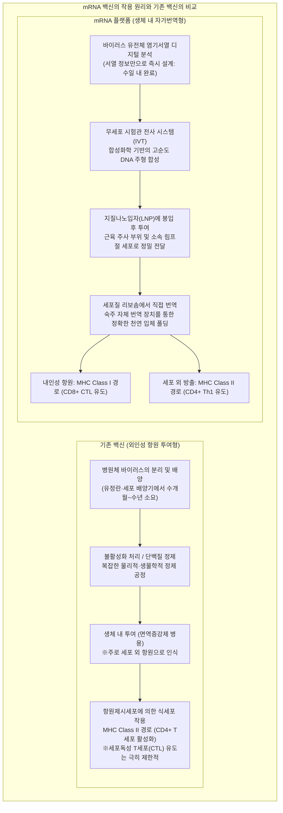
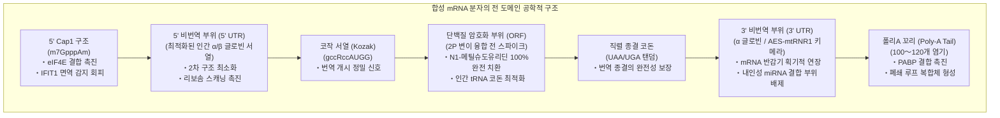
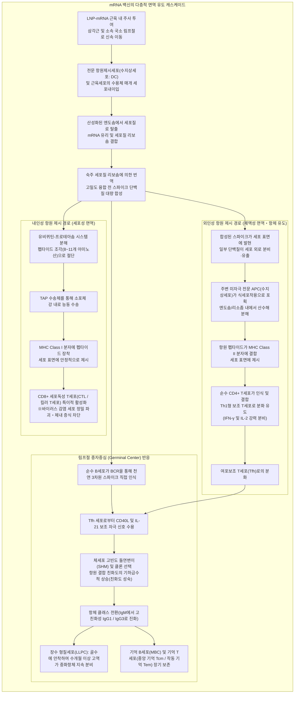
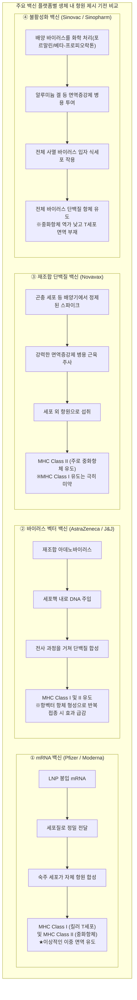

## 서론: mRNA 혁명 —— '깨지기 쉬운 분자'가 개척한 인류 역사상 최단기간 백신 개발

2020년 1월, 중국 우한에서 발생한 원인 불명의 급성 호흡기 감염병 병원체 'SARS-CoV-2'의 전체 유전체 염기서열(약 30,000개 염기)이 온라인에 전격 공개되었다. 서열이 공개된 지 불과 42일 만에 미국 모더나(Moderna)는 임상시험용 백신 바이알 'mRNA-1273'의 초기 배치를 미국 국립보건원(NIH)으로 출하하였고, 독일 바이온텍(BioNTech)과 미국 화이자(Pfizer)의 공동 개발팀이 선보인 'BNT162b2'와 함께, 인류 역사상 전례 없는 11개월이라는 번개 같은 속도로 대규모 임상 3상 시험 완료 및 긴급사용승인(EUA)을 획득하였다.

기존 백신 개발 방식 —— 유정란 배양이나 대형 바이오리액터 세포 배양을 거치는 생백신, 불활성화 사백신, 재조합 단백질 백신 —— 은 바이러스의 분리, 균주 선별, 배양 공정 최적화, 대규모 안전성 검증에 이르기까지 통상 **10년에서 15년** 이라는 아득한 세월과 천문학적인 비용이 소요되는 것이 의약품 개발의 확고한 '상식'이었다.

그러나 mRNA 기술은 그 상식을 밑바닥부터 뒤흔들었다. 이 기술의 본질은 백신을 '외부 시설에서 장기간 배양하고 정제하여 인체에 주입하는 산업 생산 항원 단백질'에서, **'숙주 자신의 세포 내 번역 기구에 표적 단백질의 설계도(디지털 유전 코드)를 일시적으로 로딩하여 생체 내부를 맞춤형 항원 생산 공장으로 탈바꿈시키는 소프트웨어적 플랫폼'** 으로 재정의한 데 있다.



### 센트럴 도그마에서 mRNA의 일과성과 '유전체 변형의 불가성'

일각에서 제기되었던 "mRNA 백신을 접종하면 인간의 유전자(DNA)가 변형되는 것이 아니냐"는 불안에 대해 분자생물학의 절대 원리인 **'센트럴 도그마(Central Dogma, 중심원리)'** 는 명확하고 확고한 과학적 해답을 제공한다.

진핵생물에서 유전 정보의 흐름은 **DNA(세포핵) → 전사(Transcription) → mRNA(핵 외 방출) → 번역(Translation) → 단백질(세포질)** 이라는 비가역적이고 엄격한 일방통행 경로를 따른다. 주입된 외인성 mRNA는 세포질에 존재하는 리보솜에 의해 직접 번역되어 목적하는 스파이크 단백질을 생산한다.
1. **핵 이행 신호의 부재**: 인공 합성 mRNA에는 세포핵막의 핵공 복합체를 통과하기 위한 핵 국소화 신호가 전혀 존재하지 않으며 오직 세포질 내에만 머문다.
2. **역전사효소 및 인테그라아제의 결여**: mRNA를 DNA로 역전사하기 위해서는 레트로바이러스 등이 보유한 특수한 '역전사효소(Reverse Transcriptase)'가 필요하며, 이를 숙주 유전체에 삽입하기 위해서는 '인테그라아제(Integrase)'가 필수적이다. 건강한 인체 세포 내에는 이러한 효소가 전혀 존재하지 않는다(세포 실험실 극한 조건에서 내인성 레트로트랜스포존 LINE-1을 이용한 역전사 가능성을 논한 시험관 연구조차도 정상 생체 내에서는 유전체 삽입 증거를 단 한 건도 입증하지 못했다).
3. **생체 내 급속한 자연 분해 대사**: mRNA는 본질적으로 수 시간에서 수일 이내에 세포 내 리보뉴클레아제(RNase)에 의해 모노뉴클레오타이드로 완전히 가수분해되어 정상 생체 대사 경로를 통해 소멸한다.

즉, mRNA 백신은 **"단백질을 합성한 직후 스스로 분해되어 사라지는 시한부 일과성 메시지"** 이며, 숙주의 유전체 DNA를 영구적으로 조작하는 것은 생물학적 메커니즘상 원천적으로 불가능하다.

---

## 제1장: 40년의 고투와 도약 —— mRNA를 의약품으로 탈바꿈시킨 과학자들

2020년의 전광석화 같은 실용화는 결코 우연히 일어난 기적이 아니다. 그 이면에는 학계로부터 이단 취급을 받고 연구비 삭감에 시달리면서도 40년 이상 분자의 비밀에 매달려온 과학자들의 끈질긴 기초과학 연구 축적이 있었다. 2023년 노벨 생리의학상이 **카탈린 카리코(Katalin Karikó)** 박사와 **드루 와이스먼(Drew Weissman)** 박사에게 수여된 것은 기초과학이 거둔 숭고한 승리의 증거이다.

### 1.1 초기 mRNA 연구의 절망적 장벽: 불안정성과 치명적 선천면역 반응

1961년 프랑수아 자코브(François Jacob)와 시드니 브레너(Sydney Brenner) 등에 의해 mRNA가 처음 발견된 이래, 분자생물학자들은 "합성 mRNA를 생체에 주입할 수 있다면 원하는 모든 치료용 단백질을 체내에서 자유자재로 합성할 수 있을 것"이라는 꿈을 품어왔다.

그러나 1980년대부터 1990년대에 걸쳐 진행된 초기 동물실험은 번번이 처참한 실패로 끝났다. 당시 연구자들의 앞길을 가로막은 것은 거대한 두 가지 장벽이었다.
- **극단적인 물리화학적 불안정성**: 생체 조직과 공기 중, 피부 표면에는 외부 RNA 바이러스로부터 신체를 방어하기 위한 강력한 분해 효소인 **'리보뉴클레아제(RNase)'** 가 도처에 존재한다. 보호막이 없는 순수 mRNA(Naked RNA)는 체내에 주입되는 순간 RNase에 의해 산산조각 나며 세포 내부로 진입조차 하지 못했다.
- **파멸적인 선천면역계의 폭주**: 만에 하나 온전한 시험관 전사 RNA를 대량 투여한다 하더라도, 체내 면역계는 이를 치명적인 병원체 침입으로 인식하여 급성 염증성 사이토카인 폭풍을 유발했다. 동물실험에서 극심한 쇼크와 사망이 속출하면서 mRNA는 "독성이 너무 강해 의약품으로는 결코 사용할 수 없는 결함 분자"라는 낙인이 찍혔다.

대학 내 승진 심사에서 연거푸 탈락하고 연구비 지원이 수차례 중단되는 혹독한 시련 속에서도, 펜실베이니아 대학교의 한구석에서 "RNA에는 인류를 구할 미지의 잠재력이 있다"고 굳게 믿었던 인물이 바로 헝가리 출신의 생화학자 카탈린 카리코였다.

### 1.2 카리코와 와이스먼의 역사적 발견(2005년): 유리딘 변형을 통한 TLR 수용체 회피

1997년, 카리코는 복사기 앞에서 면역학자 드루 와이스먼을 운명처럼 만났다. 와이스먼은 에이즈(HIV) 백신 개발을 목표로 수지상세포(Dendritic Cells, DC)의 항원제시 기능을 연구하고 있었다. 뜻이 맞은 두 사람은 mRNA를 이용해 수지상세포를 활성화하는 공동 연구를 전격 시작했다.

두 사람이 직면한 핵심 난제는 **"어째서 생체 자신의 전달 RNA(tRNA)나 리보솜 RNA(rRNA)는 면역계의 공격을 받지 않는데, 시험관 내 전사(In Vitro Transcription, IVT)로 합성한 mRNA만 수지상세포를 격렬하게 자극하여 파괴적 염증을 일으키는가"** 였다.

포유류의 세포막과 엔도솜 막에는 침입한 병원체의 핵산 패턴을 감지하는 선천면역 센서인 **'톨유사수용체(Toll-like Receptors, TLR)'** 가 포진해 있다.
- **TLR3**: 이중가닥 RNA(dsRNA)를 특이적으로 인식.
- **TLR7 / TLR8**: 단일가닥 RNA(ssRNA) 내의 변형되지 않은 유리딘(U) 풍부 서열을 인식.
- **RIG-I / MDA5**: 세포질 내에서 외래 5' 삼인산 RNA 및 긴 이중가닥 RNA를 감지하여 제1형 인터페론(IFN-α/β) 전사를 강력 유도.

카리코와 와이스먼은 포유류 세포 내 천연 RNA에 광범위하게 존재하는 **'화학적 변형 염기'** 에 주목했다. 체내의 tRNA와 rRNA는 전사 후 메틸화, 이성질화 등 다양한 화학 변형을 겪는다. 반면 기존의 IVT 반응으로 합성된 mRNA는 변형되지 않은 표준 4대 염기(A, C, G, U)만으로 단순하게 구성되어 있었다.

2005년, 두 사람은 과학사에 길이 남을 기념비적 논문을 발표했다. **합성 mRNA를 구성하는 '유리딘(Uridine)'을 전사 후 천연 변형체인 '슈도유리딘(Pseudouridine, Ψ)'으로 완전히 치환하여 합성하자, TLR7과 TLR8은 물론 세포 내 면역 센서의 감시망을 완벽히 회피하며 치명적인 염증 반응이 기적처럼 완전히 사라진 것이다.**

### 1.3 슈도유리딘에서 'N1-메틸슈도유리딘(m1Ψ)'으로의 진화

카리코와 와이스먼의 발견은 면역 거부 억제에 그치지 않았다. 놀랍게도 유리딘이 변형된 mRNA는 세포질 내 리보솜에 의한 번역 효율이 수배에서 수십 배까지 비약적으로 상승했다.

일반 유리딘을 함유한 외인성 mRNA가 세포 내로 들어오면 선천면역 센서 활성화로 인해 **PKR(단백질 키나아제 R)** 과 **2'-5' 올리고아데닐산 합성효소(OAS)** 가 유도된다. PKR은 번역 개시 인자 **eIF2α** 를 인산화하여 세포 전체의 단백질 생산을 차단하고, OAS는 **RNase L** 을 가동하여 세포질 내 RNA를 무차별 파괴한다(숙주 세포의 항바이러스 방어 반응).

그러나 슈도유리딘 변형은 이러한 세포 내 감시망의 활성화를 원천 차단하므로, 리보솜이 매끄럽고 안정적으로 mRNA 주형을 장시간 연속 번역할 수 있게 만들었다.

이후 2010년대에 들어 바이온텍과 모더나 등 바이오 벤처들에 의해 대규모 스크리닝이 이루어졌고, 슈도유리딘의 1번 질소 원자에 메틸기를 도입한 **'N1-메틸슈도유리딘(m1Ψ: N1-methylpseudouridine)'** 이 최종 발굴되었다.
- m1Ψ는 리보솜 디코딩 센터에서 코돈-안티코돈 염기쌍 결합을 전혀 방해하지 않으면서 과도한 2차 구조 형성을 완화한다.
- TLR7/8에 대한 결합력을 극한으로 낮추어, 미변형 유리딘을 100% 치환했을 때 생체 내 단백질 발현율을 극대화한다.
화이자/바이온텍의 BNT162b2와 모더나의 mRNA-1273 백신 모두 이 **100% m1Ψ 완전 치환 기술** 을 핵심 산업 표준으로 채택하고 있다.

### 1.4 스파이크 단백질 안정화의 금자탑: 바니 그레이엄과 제이슨 맥렐런의 '2P 변이'

mRNA의 면역 회피 및 번역 증폭과 함께, 코로나19 백신의 전례 없는 성공을 완성한 또 하나의 노벨상급 구조생물학적 업적은 **'2P 변이(Two-Proline Substitution)'를 통한 융합 전(Prefusion) 스파이크 단백질의 입체구조 고정화** 이다.

SARS-CoV-2 표면에 돌출된 **스파이크(S) 당단백질** 은 숙주 세포의 ACE2 수용체에 결합하여 침투를 매개하는 핵심 열쇠이다. 이 스파이크 단백질은 세포막과 융합하기 전과 후에 극적인 구조 변화를 일으키는 극도로 불안정한 분자 용수철과 같은 동적 구조물이다.
- **융합 전 구조(Prefusion Conformation)**: 3량체 정점에 수용체 결합 도메인(RBD)이 노출되어 있어 바이러스를 무력화하는 **'강력한 중화항체'** 가 결합하기에 가장 적합한 핵심 항원 표위를 풍부하게 품고 있다.
- **융합 후 구조(Postfusion Conformation)**: 세포막과 융합한 후 비가역적으로 붕괴된 가늘고 긴 바늘 형태이다. 이 상태에 결합하는 항체는 바이러스 중화 능력이 현저히 떨어진다.

미국 국립알레르기·전염병연구소(NIAID)의 **바니 그레이엄(Barney Graham)** 과 텍사스 대학교 오스틴의 **제이슨 맥렐런(Jason McLellan)** 연구팀은 2012년 메르스(MERS) 및 사스(SARS-CoV-1)의 냉동전자현미경(Cryo-EM) 구조 분석을 통해, 스파이크 단백질 S2 소단위 힌지 영역(중앙 나선 상단 986번 라이신과 987번 발린)을 **2개의 연속된 '프롤린(Proline: P)'으로 치환** 하면, 단백질이 융합 후 구조로 붕괴하는 것을 물리적으로 차단하고 **가장 면역원성이 높은 융합 전 입체구조 그대로 단단히 고정(Freeze)할 수 있음** 을 밝혀냈다.

2020년 1월 SARS-CoV-2의 유전체 염기서열이 공개되자마자 연구진은 이 '2P 변이' 설계를 즉시 적용했다.
mRNA를 통해 생체 내에서 발현되는 스파이크 단백질을 2P 변이체(K986P, V987P)로 설계함으로써, **"가장 높은 감염 차단력을 유도할 수 있는 완벽한 입체구조"** 를 인체 면역계에 안정적이고 집중적으로 제시할 수 있게 된 것이다.

---

## 제2장: mRNA 분자의 정밀 아키텍처 —— 인공 합성 mRNA의 분자 설계 공학

치료용 mRNA는 단순히 자연계 바이러스의 유전 정보를 복사한 것이 아니다. 리보솜에 의한 번역 효율을 극대화하고 세포 내 분해 속도를 정밀하게 제어하기 위해 각 도메인마다 첨단 분자생명공학적 튜닝이 적용된 **'인공 생체 고분자(Engineered Biopolymer)'** 이다.



### 2.1 5' 캡 구조(Cap0에서 Cap1으로): 세포 내 자가 인식과 번역 개시

진핵생물 mRNA의 5' 말단에는 독특한 **'7-메틸구아노신(m7G) 캡 구조'** 가 장착되어 있다. 인공 mRNA에서 이 캡의 화학적 순도와 메틸화 양식은 백신의 성공 여부를 좌우한다.
- **Cap0형(m7GpppN)**: 가장 단순한 캡 구조이지만, 척추동물 세포질 내 항바이러스 면역 센서인 **'IFIT1(테트라트리코펩타이드 반복 함유 인터페론 유도 단백질 1)'** 에 의해 '외래 침입 바이러스 RNA'로 감지되어 번역이 즉각 중단된다.
- **Cap1형(m7GpppNm)**: 캡에 인접한 첫 번째 리보오스의 2'-O 위치가 메틸화된 구조(2'-O-methylation)이다. 진핵생물 고유의 천연 mRNA 표식으로 작용하여 IFIT1의 감시를 완전히 회피한다.

화이자와 모더나 백신은 공전사 캡핑 유사체 기술(CleanCap® 등)을 도입하여 시험관 전사 단계에서 **95% 이상의 극히 높은 효율로 균일한 Cap1 구조** 를 구현했다. 이를 통해 번역 개시 인자 복합체인 **eIF4F(eIF4E, eIF4G, eIF4A)** 가 강력하게 결합하여 리보솜 40S 소단위체를 5' 말단으로 신속히 유도한다.

### 2.2 5' 및 3' 비번역 부위(UTR)의 공학적 최적화

단백질로 번역되지 않는 **5' UTR** 과 **3' UTR** 은 mRNA의 세포 내 위치, 리보솜의 이동 속도, mRNA의 물리적 수명(분해 반감기)을 통제하는 관제탑 역할을 수행한다.
- **5' UTR 설계**: 길이가 과도하게 길거나 강력한 2차 구조(헤어핀 루프나 G-사중나선: G-quadruplex)를 형성하는 서열은 리보솜의 스캐닝을 물리적으로 가로막는다. 따라서 2차 구조가 최소화되고 발현율이 검증된 인간 **α-글로빈** 또는 **β-글로빈** 의 UTR 서열이 기본 골격으로 사용된다.
- **3' UTR 설계**: 탈아데닐화 효소나 엔도뉴클레아제의 공격을 지연시키고 숙주 마이크로RNA(miRNA)에 의한 예기치 않은 발현 억제를 방지하기 위해, miRNA 시드 결합 부위를 철저히 제거한 서열(마우스 α-글로빈 또는 아미노산 인핸서 AES와 미토콘드리아 rRNA mtRNR1의 키메라 복합체 등)이 배치된다.

### 2.3 개방형 해독틀(ORF)과 코돈 최적화

스파이크 단백질의 아미노산 서열을 암호화하는 ORF 영역에는 최첨단 생물정보학 기반의 **'코돈 최적화(Codon Optimization)'** 가 정밀하게 적용되었다.

유전 암호의 축퇴성(Degeneracy)으로 인해 동일한 아미노산을 지정하는 동의 코돈이 다수 존재한다. 야생형 바이러스(SARS-CoV-2)의 코돈 빈도는 인간 세포질 내 코돈 사용 빈도(Codon Bias)와 현격한 차이를 보인다.
1. **인간 tRNA 풀과의 조화**: 인간 세포질에 풍부한 고빈도 tRNA에 부합하는 동의 코돈으로 치환함으로써 리보솜의 디코딩 대기 시간을 최소화하고 번역 신장 속도(Elongation rate)를 극대화한다.
2. **GC 함량 증대**: RNA 서열 내 구아닌(G)과 사이토신(C)의 비율을 전략적으로 끌어올려 mRNA의 열역학적 안정성을 대폭 향상시키고 잠재적인 스플라이싱 부위 및 조기 폴리아데닐화 신호를 완전히 소거한다.
3. **이중가닥 RNA(dsRNA) 부산물 최소화**: 시험관 전사 공정 중 T7 RNA 중합효소의 역행 전사 등으로 인해 발생하는 미량의 dsRNA 불순물은 치명적인 선천면역 폭주를 유발하므로 서열 설계 최적화와 함께 HPLC(고성능 액체 크로마토그래피) 및 셀룰로오스 정제를 통해 철저히 제거된다.

### 2.4 폴리A 꼬리(Poly-A Tail)와 '폐쇄 루프 모델'

3' 말단에 길게 이어지는 아데닌 잔기 서열인 **'폴리A 꼬리'** 는 mRNA의 수명을 조절하는 분자 타이머이다.
- 세포질 내에서 폴리A 꼬리는 **폴리A 결합 단백질(PABP)** 과 결합한다.
- 5' 캡에 결합된 eIF4G와 3' 폴리A의 PABP가 강한 상호작용을 일으켜 단일가닥 mRNA는 거대한 원형 구조물인 **'폐쇄 루프 모델(Closed-Loop Model)'** 을 완성한다.
- 이 원형 고리 구조 덕분에 리보솜은 종결 코돈에서 단백질 합성을 마친 직후 곧바로 5' 개시 코돈으로 신속히 리사이클링되어, 단 하나의 mRNA 분자로부터 수천 개의 스파이크 단백질을 쉼 없이 찍어낼 수 있다.
- 또한 엑소뉴클레아제 효소가 양 끝단에 접근하는 것을 입체적으로 방해하여 분해를 강력 억제한다. 화이자와 모더나 백신 모두 약 100~120개 염기 길이의 정밀한 폴리A 꼬리가 적용되어 있다.

---

## 제3장: 생체 방어벽을 돌파하는 나노 수송선 —— 지질나노입자(LNP) 공학

아무리 완벽하게 설계된 mRNA라 하더라도 표적 세포 내부로 안전하게 전달하는 수송체계가 없다면 의약품으로서 단 1마이크로그램의 기능도 발휘할 수 없다. mRNA 치료제를 실현시킨 기술적 주역은 직경 약 80~100나노미터의 초정밀 **'지질나노입자(Lipid Nanoparticles, LNP)'** 이다.

### 3.1 어째서 순수 mRNA(Naked RNA)는 직접 투여할 수 없는가

순수 mRNA를 근육에 직접 주사할 경우 백신 효과는 사실상 전무하다. 이는 인체가 가진 두 가지 강력한 물리·생화학적 장벽 때문이다.
1. **음전하 간의 정전기적 반발**: mRNA의 인산디에스테르 골격은 강한 음전하(다중 음이온)를 띤다. 인간 세포막 표면의 인지질 이중층 친수성 머리 부분과 당칼릭스 역시 음전하를 띠고 있어, 쿨롱 힘에 의해 서로를 강하게 밀어낸다.
2. **체액 내 RNase에 의한 즉각 분해**: 혈액과 조직액에는 무수한 RNase가 상시 대기하고 있어, 알몸 상태의 mRNA는 체내 반감기가 수분에 불과하다.

따라서 음전하를 차폐하여 보호하고 세포막을 안전하게 통과시켜 세포질로 방출하는 '나노 크기의 트로이 목마'가 절대적으로 요구되었다.

### 3.2 LNP를 구성하는 '황금의 4대 지질'의 역할과 화학구조

화이자/바이온텍 및 모더나 백신의 LNP는 엄밀하게 계산된 몰비로 조합된 **4종의 기능성 지질 분자** 로 구성되어 있다.

```
【LNP의 4대 핵심 구성 지질】
1. 이온화 가능 양이온 지질 (Ionizable Cationic Lipid) 〜 약 46-50 mol%
2. 헬퍼 인지질 (Helper Lipid: DSPC) 〜 약 10 mol%
3. 콜레스테롤 (Cholesterol) 〜 약 38-43 mol%
4. PEG화 지질 (PEGylated Lipid) 〜 약 1.5-1.7 mol%
```

| 지질 성분 | 대표 채택 분자 (화이자 / 모더나) | 배합 몰비 (mol%) | 물리화학적 특성 | 생체 내 필수 기능 |
| :--- | :--- | :--- | :--- | :--- |
| **이온화 가능 지질<br/>(Ionizable Lipid)** | **ALC-0315** (Pfizer)<br/>**SM-102** (Moderna) | **약 46 〜 50%** | 겉보기 pKa가 **6.0〜6.8** . 산성 환경에서 양전하, 중성 환경에서 전하 중성. 3차 아민과 생체 분해성 에스터 결합 보유. | ① 산성 제조 pH에서 음전하 mRNA와 정전기적으로 결합하여 코어에 고밀도 봉입.<br/>② 생리적 pH(7.4) 체액에서는 중성화되어 세포 독성 및 용혈 현상 완벽 방지.<br/>③ 엔도솜 내부(산성)에서 재프로톤화되어 막을 붕괴시키고 탈출 유도. |
| **헬퍼 인지질<br/>(Helper Lipid)** | **DSPC**<br/>(1,2-디스테아로일-sn-글리세로-3-포스포콜린) | **약 10%** | 높은 상전이 온도(약 55℃)를 갖는 포화 인지질. 원통형 분자 기하학 구조. | LNP 외곽에 안정된 지질 이중층(라멜라 상)을 형성하여 나노입자의 구조적 강성과 물리적 안정성 유지. |
| **콜레스테롤<br/>(Cholesterol)** | 고순도 식물 유래 정제 콜레스테롤 | **약 38 〜 43%** | 강직한 스테로이드 다환 골격과 작은 친수성 수산기. 막 패킹 조절자. | 인지질 이중층 간극을 메워 막 유동성과 상전이 거동 최적화; 표적 세포막과의 융합능 향상 및 입자 내용물 누출 방지. |
| **PEG화 지질<br/>(PEGylated Lipid)** | **ALC-0159** (Pfizer)<br/>**PEG2000-DMG** (Moderna) | **약 1.5 〜 1.7%** | 친수성 폴리에틸렌글리콜(PEG2000) 사슬이 소수성 지질 앵커(디미리스틸글리세롤 등)에 결합. | ① 제조·보관 시 입자 간 응집을 방지하여 균일한 입경(약 80nm) 유지.<br/>② 혈청 단백질의 비특이적 흡착(옵소닌화)을 차단하여 체내 순환 반감기 확보.<br/>③ 체내 진입 후 표면에서 서서히 탈락하여 세포 흡수를 촉진. |

### 3.3 세포내이입과 엔도솜 탈출(Endosomal Escape)의 생물물리학적 기적

근육 주사 후 목적 단백질이 번역되기까지의 전 과정에서 가장 어렵고 효율이 낮은 결정적 관문은 바로 세포 내 **'엔도솜 탈출(Endosomal Escape)'** 이다.

1. **표면 흡착 및 수용체 매개 세포내이입**:
   근육 조직에 주입된 LNP는 표면의 PEG 지질이 서서히 탈락하면서 체내 **아포지단백질 E(ApoE)** 를 자발적으로 흡착한다. 이를 통해 천연 지단백질로 위장한 LNP는 수지상세포나 대식세포, 근육세포 표면의 **저밀도 지단백질 수용체(LDLR)** 에 결합하여 세포내이입(Endocytosis) 과정을 거쳐 조기 엔도솜(Early Endosome) 내부로 들어간다.
2. **엔도솜 산성화와 프로톤화**:
   엔도솜이 성숙해지며 막 표면의 수소이온 펌프(V-ATPase)가 가동되어 내부 pH는 중성(7.4)에서 산성(pH 6.5 → 5.5 이하)으로 급격히 떨어진다.
3. **이온화 지질의 전하 역전과 '양성자 스펀지 효과'**:
   pKa가 6.0~6.8로 조절된 LNP의 이온화 가능 지질은 산성 환경에서 수소이온($H^+$)을 일제히 흡수하며 **전하 중성에서 강력한 양전하(Cationic) 상태로 급격한 상전이** 를 일으킨다.
4. **막 융합 및 세포질로의 mRNA 방출**:
   강력한 양전하를 띤 이온화 지질은 엔도솜 내막에 풍부한 음전하 인지질(포스파티딜세린 등)과 강하게 결합하여 막의 평면 라멜라 구조를 파괴하고 비이중층 구조인 **'역육각상(Hexagonal II phase: $H_{II}$ 상)'** 을 유발한다. 이 국소 막 붕괴와 삼투압 팽창(양성자 스펀지 효과)이 맞물리며 엔도솜에 나노 균열이 발생하고, 봉입되어 있던 mRNA가 온전한 상태로 **세포질(Cytosol)의 리보솜 풀로 탈출** 하게 된다.

나노바이올로지 연구에 따르면 엔도솜에 갇힌 mRNA 중 세포질로 온전히 탈출하는 비율은 불과 **수 퍼센트에서 10여 퍼센트** 에 지나지 않는다. 그러나 mRNA는 워낙 고효율의 증폭 번역 주형이므로, 이 작은 탈출량만으로도 인체 면역계를 완벽히 감작시키기에 충분한 수백만 개의 스파이크 단백질이 폭발적으로 합성된다.

### 3.4 미세유체 혼합 기술(Microfluidic Formulation)

수십억 도즈의 LNP를 균일한 고품질로 대량생산할 수 있게 만든 혁신의 심장은 바로 **'미세유체 혼합(Microfluidics)'** 공정이다.

과거 비커 교반기나 고압 유화 균질기를 사용한 조잡한 제조 방식은 입자 크기가 제각각(넓은 다분산도)이었고 봉입률이 낮아 규격화가 불가능했다.
현대 mRNA 백신 공장에서는 폭 수십 마이크로미터의 미세 유로 칩 내부에서 **'에탄올에 용해된 4대 지질 용액'** 과 **'산성 완충액에 용해된 mRNA 수용액'** 을 정밀 제어된 유속비(통상 1:3)로 초고속 충돌시킨다.

충돌 순간 에탄올 농도가 급격히 희석되면서 지질의 용해도가 곤두박질치고 극적인 자기조립(Self-assembly)이 유도된다. 양전하를 띤 이온화 지질이 mRNA의 음전하를 감싸며 나노 코어를 형성하고, 그 외곽을 DSPC, 콜레스테롤, PEG 지질이 감싸 안아 **평균 입경 80~100nm, mRNA 봉입률 90% 이상, 극히 좁은 단분산도(PDI < 0.1)** 를 갖춘 고품질 LNP가 밀리초 단위로 균일하게 연속 합성된다.

---

## 제4장: 다층적 면역 유도 캐스케이드 —— 세포질 번역에서 전신 면역 확립까지

mRNA 백신이 기존 불활성화 백신이나 재조합 단백질 백신을 압도하는 가장 결정적인 면역학적 원인은 **'생체 내 이중 항원 제시(MHC Class I과 Class II의 동시 활성화)'** 에 있다.



### 4.1 국소 근육 조직 및 소속 림프절에서의 효율적 흡수와 고발현

삼각근에 주사된 LNP의 대부분은 간질액을 따라 수 시간에서 수일 내에 소속 림프절(주로 겨드랑이 림프절)로 유입된다.
- 주사 부위 골격근 세포도 mRNA를 받아들여 표면에 스파이크를 발현하지만, 면역 반응을 주도하는 진짜 주인공은 조직 대식세포와 림프절에 밀집한 **'전문 항원제시세포(Professional APCs)'인 수지상세포(DC)** 이다.
- 수지상세포 내에서 합성된 융합 전 스파이크 단백질은 세포 내 소포체와 골지체에서 천연 번역 후 변형(당화 및 정확한 이황화 결합)을 거쳐 실제 바이러스와 완전히 동일한 3량체 입체 형태로 세포막 표면에 발현된다.

### 4.2 MHC Class I 경로를 통한 세포독성 T세포(CD8+ CTL)의 극적 유도

기존 사백신이나 단백질 백신은 세포 '외부'에서 항원을 투여하므로 후술할 MHC Class II 경로만 편향되게 활성화하여, **'바이러스에 감염된 세포 자체를 찾아내어 직접 사멸시키는 킬러 T세포(CD8+ CTL)'** 를 유도하기가 구조적으로 극히 어려웠다.

그러나 mRNA 백신은 항원을 세포 **'내부(세포질)'** 에서 직접 만들어내는 획기적 특징을 갖는다.
1. **프로테아솜 분해**: 세포질에서 합성된 스파이크 단백질의 일부는 세포 내 품질 관리 메커니즘에 의해 유비퀴틴화되고, **프로테아솜(Proteasome)** 복합체에 의해 8~11개 아미노산 길이의 펩타이드 조각으로 절단된다.
2. **소포체 내 능동 수송**: 절단된 펩타이드 조각은 항원 펩타이드 수송체(**TAP**)에 의해 소포체(ER) 내부로 능동 수송된다.
3. **MHC Class I 결합 및 표면 제시**: 소포체 내에서 갓 조립된 **MHC Class I(인간 백혈구 항원: HLA-A, B, C)** 분자의 홈에 스파이크 펩타이드가 장착되고 골지체를 거쳐 세포막 외부에 당당히 제시된다.
4. **킬러 T세포의 원발 자극**: 림프절의 순수 CD8+ T세포는 T세포 수용체(TCR)를 통해 이 복합체를 특이적으로 인식하고 보조 자극 신호(CD80/86-CD28)를 받아 폭발적으로 분열하며 **작동 세포독성 T세포(CTL)** 로 분화한다.

이 강력한 CTL 유도야말로 훗날 변이 바이러스의 출현으로 중화항체가 뚫렸을 때조차, **'중증화와 사망을 확고하게 막아내는 인체의 마지막 철벽 방패'** 로 기능한 분자면역학적 근거이다.

### 4.3 MHC Class II 경로와 Th1형 보조 T세포 극화

동시에 합성된 스파이크 단백질은 세포 사멸이나 세포외유출(Exocytosis) 과정을 통해 세포 외부로도 방출된다.
- 이를 주변의 전문 수지상세포가 식세포작용으로 섭취하여 산성 리소좀 내부에서 13~18개 아미노산 조각으로 가수분해한다.
- 이 조각들이 **MHC Class II(HLA-DR, DQ, DP)** 분자에 탑재되어 세포 표면에 제시된다.
- 순수 CD4+ T세포가 이를 인식하면 LNP 지질이 유발하는 미세한 천연 면역증강 환경에 힘입어, 알레르기성 Th2형이 아닌 바이러스 방어에 가장 이상적인 **'Th1형 보조 T세포(인터페론 감마 및 IL-2 대량 분비)'** 로 극화 분화한다. 이 Th1 우세 반응은 후술할 치명적 백신 부작용(VAED)을 완벽히 차단하는 데 결정적인 역할을 했다.

### 4.4 림프절 종자중심(Germinal Center)의 지속 형성과 B세포 친화도 성숙

mRNA 백신 면역 반응 중 가장 정교하고 아름다운 현상은 림프절 내부에 형성되는 **'종자중심(Germinal Center, GC)'** 의 장기 유지이다.

1. **천연 입체 항원 인식**: 림프 여포에 상주하는 순수 B세포는 B세포 수용체(BCR)를 통해 수지상세포 표면에 고정된 온전한 3차원 스파이크 단백질을 직접 인식한다.
2. **여포보조 T세포(Tfh)의 강력한 지원**: 항원을 포획한 B세포는 종자중심으로 이동하여 특수 분화된 **Tfh 세포** 로부터 CD40L 및 인터루킨-21(IL-21) 생존 증식 신호를 전달받는다.
3. **체세포 고빈도 돌연변이(SHM)와 클론 경쟁**:
   - 종자중심 암구(Dark Zone)에서 B세포는 AID 효소의 작용으로 항체 가변부 유전자에 무작위 점돌연변이를 초고속으로 유발하며 폭발적으로 증식한다(**체세포 고빈도 돌연변이, SHM**).
   - 이어 명구(Light Zone)로 이동한 변이 B세포들은 여포수지상세포(FDC)가 보유한 스파이크 항원을 두고 치열한 결합 경쟁(Selection)을 벌인다.
   - 스파이크에 훨씬 더 강력하고 정밀하게 달라붙는 돌연변이를 획득한 '엘리트 B세포'만이 Tfh의 생존 신호를 얻고, 결합력이 약한 B세포는 가차 없이 세포자멸사(Apoptosis)로 도태된다.
4. **클래스 스위칭과 장수 형질세포 및 기억 세포 확립**:
   - 이 과정에서 초기 저친화성 IgM 항체에서 강력한 중화력을 갖춘 **고친화성 IgG(주로 IgG1 및 IgG3)** 로 진화하는 항체 클래스 전환이 일어난다.
   - 살아남은 최정예 B세포의 일부는 **장수 형질세포(LLPC: Long-Lived Plasma Cells)** 로 분화하여 골수에 영구 안착, 수개월에서 수년에 걸쳐 혈액 내로 초당 수천 분자의 초고친화성 중화항체를 뿜어낸다.
   - 또 다른 일부는 **기억 B세포(MBC)** 가 되어 전신 림프절과 비장에 대기하며 향후 변이 바이러스가 침입했을 때 즉각 재가동된다.

인간 림프절 미세침 흡인 생검 연구에 따르면, mRNA 백신으로 형성된 종자중심 반응은 **초기 접종 후 최소 6개월 이상 이례적으로 활발히 유지** 되어 변이 바이러스에도 대응할 수 있는 고도화된 항체 풀을 훈련시킴이 입증되었다.

---

## 제5장: 임상 에비던스·유효성 추이·변이 바이러스와의 전면전

### 5.1 대규모 3상 임상시험 결과: 95% 예방 효과의 충격

2020년 11월과 12월, 세계 최고 권위의 의학 저널인 《뉴잉글랜드 저널 오브 메디신(NEJM)》에 화이자(Polack et al.)와 모더나(Baden et al.)의 3상 임상시험 결과가 연이어 발표되며 전 세계 의학계에 거대한 충격을 안겼다.
- **화이자(BNT162b2: 43,448명 등록)**: 위약군에서 162건의 코로나19 유증상 감염이 발생한 반면 백신군에서는 단 8건에 그쳐 **발병 예방 효과 95.0%(95% CI: 90.3–97.6%)** 를 기록했다. 중증 환자 역시 위약군 9명 대비 접종군 1명에 불과했다.
- **모더나(mRNA-1273: 30,420명 등록)**: 위약군 185건(중증 30건, 사망 1건) 대비 백신군 11건(중증 0건)으로 **발병 예방 효과 94.1%(95% CI: 89.3–96.8%)** , 중증 예방 효과 100%를 달성했다.

미국 FDA와 WHO가 사전에 제시했던 긴급사용승인 최소 기준은 '유효율 50% 이상'이었다. 매년 맞는 독감 백신의 유효율이 통상 40~60% 선임을 감안할 때, 완전히 새로운 신종 감염병에 대해 달성한 '95%'라는 수치는 전 세계 감염병 전문가들의 예상을 아득히 뛰어넘은 전례 없는 대승리였다.

### 5.2 상대위험감소율(RRR)과 절대위험감소율(ARR)의 통계학적 해석

임상시험 데이터 공개 직후 일각에서는 "95%라는 수치는 상대위험감소율(RRR)일 뿐이며, 절대위험감소율(ARR)은 고작 1% 미만이므로 백신 효과가 과장되었다"는 통계적 곡해가 나타났다.

이를 과학적 역학 원리로 명쾌하게 정리한다:
- **RRR(상대위험감소율, Relative Risk Reduction)**: 위약군 발병률 $I_p$ 와 백신군 발병률 $I_v$ 의 상대적 차이:
  $$RRR = \frac{I_p - I_v}{I_p} \times 100\% = \frac{0.0088 - 0.0004}{0.0088} \approx 95\%$$
  이는 **"백신이라는 생물학적 제제가 바이러스의 발병력을 몇 퍼센트나 차단할 수 있는가"를 나타내는 순수 생물학적·면역학적 효능** 지표이다.
- **ARR(절대위험감소율, Absolute Risk Reduction)**: 임상시험 관찰 기간(약 2~3개월) 동안 전체 인구 집단에서 발병한 절대 비율의 차이:
  $$ARR = I_p - I_v \approx 0.88\% - 0.04\% = 0.84\%$$
- **역학 통계의 본질**:
  ARR은 시험 기간 중 **'사회 전체의 감염 유행 강도(배경 발병률)'** 에 절대적으로 좌우된다. 감염자가 극히 적고 모두가 격리된 사회에서 시험을 진행하면 아무리 신적인 100% 완벽한 백신이라도 ARR은 필연적으로 0.1% 미만이 된다. 반대로 대유행이 번져 인구의 20%가 노출되는 환경이 되면 ARR은 즉각 $20\% \times 95\% = 19\%$ 로 치솟는다.
  따라서 "ARR이 작으므로 백신이 무용하다"는 주장은 생물학적 효능과 환경 노출률을 혼동한 기초 통계학적 오류이다.

### 5.3 실제임상증거(RWE): 국가 단위 대규모 빅데이터가 증명한 진실

임상시험의 통제된 이상적 환경을 벗어나, 고령자, 만성질환자, 면역저하자가 뒤섞인 수천만 명의 거친 현실 사회에 백신이 투입되었을 때 실제 효과는 어떠했는가?

전 국민 신속 접종을 단행한 **이스라엘(Clalit 120만 명 매칭 코호트 연구, Dagan et al., NEJM 2021)** 과 영국(UKHSA), 미국(CDC)의 대규모 추적 관찰은 다음과 같은 결정적 사실들을 입증했다.
1. **초기 유행주에 대한 완벽한 방어**: 우한 야생형 및 알파 변이에 대해 실제 사회에서도 90% 이상의 감염 예방과 95% 이상의 입원·사망 방어가 완벽히 재현되었다.
2. **감염 예방 효과의 시간 경과에 따른 감쇄**: 접종 4~6개월 후 혈중 중화항체의 자연 반감기로 인해 유증상 감염 차단 효과는 60~70%대로 서서히 하락했다.
3. **중증화 및 사망 방어력의 장기적 불침번**: 그러나 입원과 기계호흡, 사망을 막아내는 중증 예방 효과는 항체가 감소한 뒤에도 85~90% 이상의 확고한 고공행진을 장기간 유지했다. 이는 혈중 항체가 줄어도 골수의 기억 B세포가 수일 내에 항체를 급속 재합성하며, **폐포 깊숙한 곳에서 바이러스의 침투를 궤멸시키는 강력한 CD8+ 킬러 T세포 면역** 이 건재했기 때문이다.

### 5.4 변이주의 파도와 면역 회피: 중화항체 저하와 T세포의 견고성

팬데믹이 전개됨에 따라 바이러스는 숙주 면역압을 회피하기 위해 무수한 돌연변이를 축적해 나갔다.

| 변이주 계통 | 주요 핵심 돌연변이 (RBD 등) | 체외 중화항체 감수성 (초기주 대비) | 2회 접종 시 감염 예방 효과 | 2회 접종 시 중증 예방 효과 | 부스터(3회/업데이트 백신) 효과 |
| :--- | :--- | :--- | :--- | :--- | :--- |
| **우한 초기주<br/>(Wuhan-Hu-1)** | 기준형 (변이 없음) | **1.0배** (기준) | **약 95%** | **약 95% 이상** | 항체 역가 폭발적 수배~수십 배 상승 |
| **알파 변이<br/>(Alpha: B.1.1.7)** | N501Y, P681H | **약 1.5 〜 2배 소폭 감소** | **약 85 〜 90%** | **약 95%** | 감염·중증 방어 모두 최고 수준 유지 |
| **델타 변이<br/>(Delta: B.1.617.2)** | L452R, T478K, P681R | **약 3 〜 6배 유의미한 저하** | **약 60 〜 75%** (시간 경과 시 저하) | **약 90%** | 3회 접종으로 발병 예방 85% 이상 회복 |
| **오미크론 초기<br/>(BA.1 / BA.2)** | RBD에 15개 이상 아미노산 변이<br/>(K417N, E484A, N501Y 등) | **20 〜 40배 급격한 추락** | **약 20 〜 40%** (2회 접종 시 감염 방어 급감) | **약 70 〜 80%** (T세포 면역으로 방어선 유지) | 3회 추가접종 시 발병 예방 65~75%, 중증 예방 90% 이상으로 대폭 복원 |
| **오미크론 하위<br/>(BA.4/5, XBB, JN.1)** | L452R, F486V/P, R346T<br/>수용체 결합력 및 면역 회피 극한화 | **기존 혈청 항체 결합능 대폭 상실** | **2회 접종만으로는 감염 방어 미미** | **약 60 〜 70%** (기초 T세포 면역으로 지탱) | 오미크론 대응 2가 백신 / 단가 XBB.1.5, JN.1 백신으로 중화항체 재유도 및 중증 방어 70~80% 이상 확보 |

오미크론(Omicron)의 출현은 중화항체만으로 바이러스의 감염 자체를 완벽히 막아내는 방어선의 한계를 드러냈다. 오미크론 스파이크 단백질에는 30개 이상, RBD에만 15개의 아미노산 변이가 집중되어 초기 백신으로 유도된 중화항체의 결합 표위 대다수가 구조적으로 변형되었기 때문이다.

그러나 이때 결정적 구원투수로 등판한 것이 바로 **'T세포 면역의 광범위한 다양성'** 이었다.
- 중화항체가 인식하는 표적은 스파이크 표면의 노출된 좁은 3차원 입체 형태(입체 구조 표위, Conformational Epitopes)에 집중되어 있어 몇 군데 변이만으로 결합력이 급락한다.
- 반면 T세포가 인식하는 것은 MHC 분자에 의해 잘게 잘려 제시되는 **선형 펩타이드 절편(선형 표위, Linear Epitopes)** 으로, 스파이크 단백질 전체(1,273개 아미노산)에 수백 개가 골고루 분산되어 있다.
- 인간 집단은 개인마다 HLA 유전형이 천차만별이므로 바이러스가 모든 인간의 T세포 표위를 일제히 변이시켜 탈출하는 것은 진화생물학적으로 불가능하다.
- 각국 연구기관의 정밀 분석 결과, **오미크론에 대해서도 초기 백신으로 획득된 T세포 표위의 80~90% 이상이 손상되지 않고 고스란히 보존되어 있음** 이 입증되었다. 이것이 오미크론 대유행 당시 감염자 수가 폭증했음에도 백신 접종 국가들의 치명률과 중환자실(ICU) 입원율이 극적으로 낮게 억제된 핵심 면역학적 원리이다.

### 5.5 추가접종(부스터 샷)과 항원 업데이트 백신의 신속 배치

항체 감소와 변이 바이러스에 맞서 mRNA 플랫폼의 진정한 진가인 **'신속한 기동성(Agility)'** 이 유감없이 발휘되었다.
1. **동종 부스터(3차 접종)**: 초기주 백신을 추가 투여하는 것만으로 림프절 종자중심 반응이 재점화되어 기존 기억 B세포가 추가 친화도 성숙을 진행, 오미크론까지 교차 중화하는 진화된 항체군을 생산해냈다.
2. **2가 백신(Bivalent Vaccines)**: 초기주와 오미크론 BA.1 또는 BA.4/5의 mRNA를 1:1로 섞은 2가 백신이 승인되어 면역 범용성을 확장했다.
3. **단가 업데이트 백신(XBB.1.5, JN.1 계통)**: 항원 원죄(Immune Imprinting) 현상을 피하기 위해 최신 유행 변이주 단일 mRNA로 신속히 전환되었다. 컴퓨터에서 디지털 DNA 염기서열을 재입력하는 것만으로 불과 2~3개월 만에 새로운 변이주 대응 완제품을 출하할 수 있는 능력은, 오직 무세포 화학적 공정을 갖춘 mRNA 플랫폼만이 달성할 수 있는 인류 기술의 비약이었다.

---

## 제6장: 안전성 프로파일·이상반응의 병태생리·위험-이득 정량 분석

모든 의약품과 생물학적 제제와 마찬가지로 mRNA 백신 역시 생체에 주입되는 물질인 이상, 이득(감염 예방·중증 회피)의 반대편에는 반드시 위험(이상반응·부작용)이 존재한다. 과학적 진실성에 기반하여 이상반응의 병태생리를 규명하고, 객관적인 위험-이득(Risk-Benefit) 비율을 정량 평가하는 것이 현대 의학의 본분이다.

### 6.1 국소 및 전신 반응원성(Reactogenicity): 면역계 가동의 생리적 비용

접종 후 흔히 경험하는 국소 증상(주사 부위 통증, 부종, 발적)과 전신 증상(38℃ 이상의 발열, 피로감, 두통, 오한, 근육통 및 관절통)은 조직 파괴의 독성이 아니라 **'생체의 선천면역계가 설계된 의도대로 강력하게 작동하고 있다는 정상적인 생리적 신호'** 이다.
- LNP를 이루는 지질 분자들과 미세한 자극에 반응하여 국소 수지상세포와 대식세포로부터 **IL-1β, IL-6, TNF-α, 제1형 인터페론(IFN-α/β)** 등의 염증성 사이토카인이 일시적으로 혈류로 분비된다.
- 이 물질들이 시상하부 체온조절 중추를 자극하여 발열을 일으키고 전신 근골격계에 피로감과 통증을 유도한다.
- 대부분의 증상은 접종 후 24~48시간 이내에 자연 소실되며, 아세트아미노펜(타이레놀)이나 이부프로펜 등 소염진통제로 충분히 조절 가능하다.

### 6.2 심근염 및 심낭염(Myocarditis / Pericarditis): 역학과 추정 병리 메커니즘

수십억 회 접종이 이루어지며 전 세계 약물감시망(미국 VAERS·VSD, 이스라엘 보건부, 한국 질병청 등)을 통해 특정한 역학적 집단 —— **'청소년 및 12~29세 젊은 남성'** 에서 접종 후 수일 이내(주로 2차 접종 후) 극히 드물게 **심근염·심낭염** 이 발생한다는 사실이 정밀하게 규명되었다.

#### ① 역학적 발생 빈도
- 전체 인구 대상 발생률은 **접종 10만 회당 1~5건(약 0.001~0.005%)** 수준으로 극히 희귀하다.
- 최고 위험군인 **16~19세 젊은 남성의 2차 접종 후** 에서도 발생률은 **10만 회당 약 10~15건(약 0.01%)** 안팎이다.
- 모더나(mRNA-1273: 100μg) 백신이 화이자(BNT162b2: 30μg) 백신보다 용량이 높아 젊은 남성에서 발생률이 통계적으로 소폭 높았으며, 이에 따라 다수 국가가 젊은 층에 화이자 백신을 우선 권고하는 지침을 확립했다.

#### ② 추정되는 분자 병리 메커니즘
현재 학계에서 유력하게 제시하는 기전은 복합 요인의 상호작용이다:
1. **미결합 유리 스파이크 단백질의 작용**: 하버드 대학교 융커(Yonker) 등의 연구(Circulation 2023)에 따르면 심근염이 발생한 젊은 환자의 혈장에서는 항체와 결합하지 않은 '유리 스파이크(Free Spike)'가 고농도로 검출되어 심근 조직의 선천면역 수용체를 과도 자극했을 가능성이 제기되었다.
2. **남성호르몬(테스토스테론)의 영향**: 왜 젊은 남성에 편중되는가? 남성호르몬은 Th1 면역 반응과 염증성 대식세포를 활성화하는 반면, 여성호르몬(에스트로겐)은 심장 보호 및 항염증 작용을 하므로 호르몬 환경의 차이가 감수성을 결정짓는 주요 인자로 꼽힌다.
3. **일시적 자가면역 교차 반응**: 심근 수축 단백질인 α-미오신 등 자가 항원에 대한 일시적인 교차 반응 항체가 유도되었다는 가설.

#### ③ 임상 경과 및 '실제 감염과의 정량 비교'
대중에게 반드시 전달되어야 할 결정적 임상 사실은 **백신 유발 심근염의 90% 이상이 경증이며, 입원하더라도 NSAIDs(비스테로이드 소염제) 투여 등 보존적 치료로 며칠에서 1주일 이내에 심기능이 완전히 정상 회복되는 매우 양호한 예후를 보인다** 는 점이다(전격성 심부전이나 사망은 극히 드물다).
더욱 결정적인 것은 **"SARS-CoV-2 바이러스에 실제로 감염되어 발생하는 심근염 발생률과 중증도, 사망 위험이 백신 접종으로 인한 위험보다 수배에서 수십 배나 훨씬 더 높다"** 는 확고한 의학적 데이터이다. 감염으로 인한 다발성 장기 손상, 심근염, 뇌혈관 질환, 롱코비드(후유증)를 예방하는 백신의 절대적 임상 이득은 최고 위험군인 젊은 남성층에서도 드문 부작용 위험을 압도적으로 상회함이 전 세계 역학 연구를 통해 거듭 확인되었다.

### 6.3 아나필락시스와 PEG 알레르기

접종 수분에서 30분 이내에 발생하는 급성 중증 알레르기 반응인 아나필락시스의 빈도는 **접종 100만 회당 약 2~5건** 이다. 일반 독감 백신(100만 회당 1건)보다 다소 높으나 여전히 극히 드문 수준이다.
- **원인 물질**: LNP 외피를 구성하는 **PEG2000(폴리에틸렌글리콜)** 에 대한 기존 항-PEG IgE 항체 보유자, 또는 보체 활성화 관련 가성 알레르기(CARPA) 반응에 의한 비만세포 탈과립이 원인으로 지목된다.
- 일상생활에서 화장품, 샴푸, 대장내시경 하제 등을 통해 PEG 성분에 미리 감작된 극소수에서 발생한다.
- 접종 현장에서의 15~30분 관찰 대기 및 에피네프린 근육 주사(에피펜 등) 프로토콜을 통해 사망 사례는 거의 완벽히 방지되었다.

### 6.4 아데노바이러스 벡터 백신(TTS/VITT)과의 기전적 차이

아스트라제네카(ChAdOx1-S)나 얀센(Ad26.COV2.S) 등 **바이러스 벡터 백신** 에서는 젊은 여성을 중심으로 **'혈소판 감소성 혈전증(TTS / VITT)'** 이라는 치명적 부작용이 발생해 큰 논란이 되었다.
- **VITT의 기전**: 아데노바이러스 캡시드 단백질이 혈소판 제4인자(PF4)와 결합하여 거대 복합체를 형성하고, 헤파린 유도 혈소판 감소증(HIT)과 유사한 자가항체를 만들어 전신 혈소판 응집과 뇌정맥동혈전증을 유발한다.
- **mRNA 백신의 안전성**: mRNA 백신(화이자·모더나)은 순수 인공 합성 지질과 단일가닥 RNA로만 구성되어 있어 이러한 바이러스 단백질 껍질이 아예 존재하지 않으므로 **TTS/VITT 발생 위험이 전혀 나타나지 않는다** .

### 6.5 항체 의존성 감염 증강(ADE) 및 백신 관련 질환 악화(VAED)의 검증

과거 뎅기열 백신(Dengvaxia)이나 1960년대 영유아 호흡기세포융합바이러스(FI-RSV) 사백신 시험에서는 유도된 불완전한 항체가 바이러스와 결합한 뒤 대식세포 감염을 오히려 도와 병세를 악화시키는 **'항체 의존성 감염 증강(ADE)'** 이나 호산구 침윤을 유발하는 **'백신 관련 질환 악화(VAED)'** 라는 비극적 역사가 있었다.

코로나19 백신 개발 초기에도 학계 일각에서 ADE/VAED 발생에 대한 이론적 우려가 제기되었으나, **전 세계 수십억 회 접종과 대유행 관찰 결과 mRNA 백신으로 인한 ADE나 VAED 사례는 단 한 건도 관찰되지 않았다** .
그 분자생물학적 이유는 명확하다:
1. **2P 변이를 통한 초고친화성 중화항체 독점 유도**: 융합 전 고정화 스파이크 덕분에 유도된 항체 대부분이 바이러스를 즉각 무력화하는 '강력한 중화항체'이며 감염을 증강시키는 비중화 항체 비율이 극히 낮다.
2. **철저한 Th1 면역 편향**: mRNA와 LNP의 조합이 면역계를 세포성 면역 중심인 Th1으로 강력 유도하여, 천식 유사 알레르기성 Th2 반응(VAED의 본체)을 원천 차단했다.

| 부작용 / 이상반응 항목 | 발생 빈도 | 발병 호발 시기 | 핵심 병태생리학적 메커니즘 | 임상 경과 및 표준 대응법 |
| :--- | :--- | :--- | :--- | :--- |
| **국소 반응** (통증·발적·부종) | **70 〜 85%** (극히 흔함) | 접종 당일 ~ 다음 날 | 주사 부위 조직 내 급성 염증 사이토카인(IL-1, TNF) 분비 및 호중구 침윤 | 1~3일 내 자연 호전. 냉찜질, 대증 요법. |
| **전신 반응원성** (발열·피로·두통) | **50 〜 70%** (흔함, 2차 접종 시 심함) | 접종 후 12~24시간 | 순환 혈류 내 IL-6, IFN-α/β 방출로 시상하부 체온조절 중추 자극 | 1~2일 내 소실. 아세트아미노펜 등 해열진통제 복용. |
| **심근염 · 심낭염** | **10만 회당 1〜5건** (극히 드묾, 10~20대 남성 호발) | 접종 후 2~4일 이내 | 미중화 유리 스파이크 과자극, 테스토스테론 의존적 염증 증폭, 일시적 자가면역 반응 | **대부분(>90%) 경증**. NSAIDs 등 보존적 치료로 빠르게 완전 회복. |
| **아나필락시스** | **100만 회당 2〜5건** (극히 드묾) | 접종 직후 ~ 30분 이내 | LNP 외피 PEG2000에 대한 기존 IgE 항체 또는 보체 활성화(CARPA) 비만세포 탈과립 | 즉각적인 에피네프린 근육 주사로 후유증 없이 완전 회복. |
| **길랑-바레 증후군** | **mRNA 백신에서는 자연 발생률과 동일** | 접종 후 수주 이내 | 말초신경 수초에 대한 자가항체 생성 (바이러스 벡터 백신에선 소폭 보고되었으나 mRNA 백신은 연관성 완전 배제) | 고용량 면역글로불린 정맥주사(IVIg), 혈장교환술. |

---

## 제7장: 주요 백신 기술 플랫폼의 종합 비교 분석

코로나19 팬데믹은 인류가 보유한 모든 생명공학 플랫폼이 총출동하여 성능을 입증한 역사상 최대의 바이오 경연장이었다.



### 7.1 mRNA vs 바이러스 벡터(DNA형 플랫폼)

바이러스 벡터 백신은 복제 능력을 없앤 아데노바이러스 껍질 속에 스파이크 DNA를 넣어 인체에 전달한다.
- **장점**: DNA 분자는 화학적으로 매우 안정하여 통상적인 냉장 온도(2~8℃)에서 장기 보관 및 유통이 가능해 개도국 보급에 유리했다.
- **치명적 약점(항벡터 면역)**: 가장 큰 결점은 인체가 '스파이크 단백질'뿐만 아니라 '수송선인 아데노바이러스 껍질' 자체에 대해서도 중화항체를 형성한다는 점이다. 이로 인해 2회 접종이나 추가접종 시 전달체가 체내에서 미리 파괴되어 백신 효과가 급감한다. 또한 치명적인 TTS/VITT 혈전증 위험이 젊은 층에 큰 걸림돌이 되었다.
- **mRNA의 압승**: 반면 mRNA 백신은 지질나노입자가 인공 합성 지질로서 항원성이 없으므로, **아무리 여러 차례 추가접종을 반복해도 수송체가 체내 항체에 의해 제거되지 않는다** .

### 7.2 mRNA vs 재조합 단백질 백신

노바백스(Novavax / Nuvaxovid)로 대표되는 단백질 백신은 곤충 세포 배양기를 통해 스파이크 단백질을 시험관 내에서 배양·정제한 뒤 면역증강제(Matrix-M™)와 함께 주입한다.
- **장점**: B형 간염 백신 등 수십 년간 축적된 전통 기술로, 접종 후 발열 등 전신 반응원성이 mRNA 백신에 비해 매우 부드럽고 온화하다.
- **약점**: 살아있는 세포를 배양해 단백질을 정제하고 3차원 구조를 재현하는 공정이 수개월 이상 걸리므로, 새로운 변이 바이러스가 출현했을 때 신속하게 백신을 업데이트하기가 구조적으로 매우 어렵다.

### 7.3 mRNA vs 불활성화 사백신

중국의 시노백(CoronaVac)과 시노팜(BBIBP-CorV) 백신은 바이러스를 대량 증식시킨 뒤 화학물질(베타-프로피오락톤 등)로 감염력을 완전히 파괴하여 알루미늄 겔과 함께 투여한다.
- **장점**: 스파이크뿐만 아니라 뉴클레오캡시드(N) 단백질 등 바이러스 전체 구성 요소를 포함한다.
- **약점**: 중화항체 유도능이 mRNA 백신에 비해 현저히 낮고, 세포독성 T세포(CTL) 유도능은 사실상 전무하다. 오미크론 변이 확산 시 방어선이 조기에 무너졌다. 또한 고위험 생물안전등급 3단계(BSL-3)의 초대형 세포 배양 시설이 필수적이며 생물학적 오염 위험을 수반한다.

### 7.4 제조 공정·공급망·콜드체인의 열역학적 제약

mRNA 백신의 유통에서 가장 가혹했던 병목 현상은 초기에 요구되었던 **'초저온 콜드체인(-80℃~-20℃)'** 이었다.
- **물리화학적 원인**: mRNA의 리보오스 2' 위치의 수산기(-OH)는 수용액 환경에서 인접 인산기를 친핵성 공격하여 스스로 분해되는 '자가가수분해(Autohydrolysis)'를 일으키기 쉽다. 또한 LNP의 지질 성분 역시 산화와 상전이를 겪으며 입자끼리 엉겨 붙는다.
- **냉동 보관의 필연성**: 이 열역학적 분해 반응을 완전히 동결시키기 위해 화이자 백신 초기 분량은 드라이아이스를 사용한 **-80℃~-60℃** , 모더나 백신은 **-20℃** 의 엄격한 냉동 관리가 요구되었다.
- **제조 공정의 압도적 효율성**: 그러나 제조 공정 자체는 '무세포 시험관 전사계(IVT)'이므로 수천 리터의 거대 바이오리액터에서 수개월간 세포를 배양할 필요가 없으며, 불과 수 리터 크기의 효소 반응기에서 며칠 만에 수억 도즈 분량의 고순도 mRNA를 한꺼번에 합성할 수 있다. 이 **'소규모 제조 풋프린트와 무한에 가까운 생산 확장성(Scalability)'** 이야말로 단 1년 만에 전 세계에 수십억 회분을 신속 공급할 수 있었던 최대의 산업적 승인이다.

| 비교 분석 항목 | ① mRNA 백신 | ② 바이러스 벡터 백신 | ③ 재조합 단백질 백신 | ④ 불활성화 사백신 |
| :--- | :--- | :--- | :--- | :--- |
| **대표 상용화 제품** | **화이자 (BNT162b2)<br/>모더나 (mRNA-1273)** | 아스트라제네카 (ChAdOx1)<br/>얀센 (Ad26.COV2.S) | 노바백스 (NVX-CoV2373)<br/>다이이찌산쿄 (다이치로나) | 시노백 (CoronaVac)<br/>시노팜 (BBIBP) |
| **항원 물리적 형태** | 지질나노입자 봉입 mRNA | 비복제형 아데노바이러스 DNA | 정제 나노입자 단백질 | 포르말린 처리 전세포 사멸 바이러스 |
| **항원 생산 장소** | **인체 세포질 자체 합성 (내인성)** | 인체 세포핵 전사 및 세포질 번역 | 체외 바이오리액터 (곤충/CHO 세포) | 체외 바이오리액터 (Vero 세포) |
| **중화항체 유도력** | **극히 강력함 (세계 최고 수준)** | 강력~중등도 | 강력함 | 중등도~미약함 |
| **CD8+ CTL 유도력** | **극히 강력함 (MHC-I 직접 제시)** | 강력함 | 극히 제한적 (교차 제시 의존) | 거의 없음 |
| **변이주 업데이트 속도**| **최속 (수주~2개월 내 완료)** | 보통 (2~4개월) | 느림 (6개월~1년) | 극히 느림 (반년 이상 소요) |
| **주요 이상반응** | 발열·통증 흔함, 드물게 심근염 | 발열, 드물게 혈전증(TTS/VITT) | 국소 통증, 피로감 (매우 경미) | 주사 부위 통증 (가장 경미) |
| **보관 및 유통 온도** | **-80℃ 〜 -20℃ (초저온 냉동)** | 2℃ 〜 8℃ (일반 냉장) | 2℃ 〜 8℃ (일반 냉장) | 2℃ 〜 8℃ (일반 냉장) |
| **다회 반복 접종 적합성**| **극히 우수함 (제약 없음)** | 낮음 (항벡터 항체 간섭 발생) | 우수함 | 우수함 |

---

## 제8장: mRNA 기술의 프론티어 —— 암 면역치료에서 개인 맞춤형 의료의 미래로

팬데믹이라는 미증유의 위기를 통해 검증된 mRNA 기술의 진정한 가치는 단순 감염병 백신을 넘어, **'21세기 바이오 메디컬 전체의 기반 운영체제'** 를 완전히 다시 쓰는 혁명으로 확장되고 있다.

### 8.1 개인 맞춤형 암 신생항원 백신(Personalized Cancer Vaccines)

원래 바이온텍과 모더나가 창립 이래 목표로 삼았던 진정한 주 전장은 감염병이 아니라 현대 의학의 최대 난치병인 **'암(Oncology)'** 이었다.

암세포는 수많은 유전자 돌연변이를 축적하며 정상 세포에는 없는 비정상적인 아미노산 서열인 **'신생항원(Neoantigen)'** 을 표면에 발현한다. 그러나 암세포는 면역관문 분자(PD-L1 등)를 악용해 T세포의 공격을 교묘히 회피한다.
- **맞춤형 mRNA 암 치료 프로토콜**:
  1. 환자의 절제된 종양 조직과 정상 혈액 세포를 차세대 염기서열 분석(NGS)으로 전장 엑솜 및 전사체 해독.
  2. 인공지능(AI)과 생물정보학 알고리즘을 통해 환자 고유의 HLA형에 가장 강력하게 결합하고 킬러 T세포를 최대로 자극할 수 있는 최적의 신생항원 후보(10~34개 변이)를 선별.
  3. 이 돌연변이 서열들을 단 하나의 긴 mRNA 분자에 직렬로 연결하여 환자 맞춤형 mRNA 백신을 수주 만에 합성.
  4. 환자에게 투여하여 환자 체내에서 **"자신의 암세포만을 표적 사살하는 최정예 CD8+ CTL 군단"** 을 대규모로 훈련·동원.
- **세계적 임상 성과**:
  2023년 모더나와 머크(MSD)는 완전 절제술을 받은 고위험 악성 흑색종 환자를 대상으로 한 2b상 임상시험에서, 맞춤형 신생항원 백신(mRNA-4157 / V940)과 면역관문억제제 키트루다를 병용 투여했을 때 키트루다 단독군 대비 **재발 또는 사망 위험을 44%나 획기적으로 낮추었다** 고 발표했다(Lancet 2024). 현재 췌장암, 비소세포폐암 등 난치성 암을 대상으로 글로벌 대규모 3상 확증 임상이 급물살을 타고 있다.

### 8.2 감염병 분야의 전방위 확장: 다가 인플루엔자·RSV·HIV·말라리아

mRNA 플랫폼의 다중화(Multiplexing) 능력을 살려 단 하나의 바이알에 여러 병원체나 변이주를 동시에 담아내는 복합 다가 백신 개발이 가속화되고 있다.
- **독감+코로나 콤보 백신**: A형 독감(H1N1, H3N2)과 B형 독감 2종, 그리고 코로나 변이주를 하나로 묶은 5가 콤보 백신이 임상 후기 단계에 진입했다.
- **범코로나바이러스 백신(Pan-Coronavirus Vaccine)**: 변이가 적은 스파이크 S2 줄기 보존 영역을 표적화하여 미래에 출현할 미지의 변이나 신종 코로나바이러스 계통을 포괄 차단하는 백신 설계.
- **난치성 감염병 정복**: 전통적 백신 기술로는 항원 생산이 어려웠던 **에이즈(HIV)**, **말라리아**, **결핵** 에 대해서도 광범위 중화항체(bNAbs)를 유도하는 복잡한 3량체 mRNA 백신의 인체 임상시험이 활발히 진행 중이다.

### 8.3 생체 내 단백질 보충 요법과 희귀 유전 질환 치료

mRNA의 용도는 면역을 유도하는 '항원' 생산에 국한되지 않는다. **'체내 조직에서 선천적으로 결핍된 효소나 핵심 생리 단백질 자체를 직접 만들어내는 치료제'** 로의 비상이다.
- **메틸말론산혈증(MMA) 및 프로피온산혈증(PA)**: 간세포 내 대사 효소 결핍으로 사망에 이르는 치명적 희귀 소아 유전질환에 대해, 정상 효소를 암호화한 mRNA-LNP를 정기 투여하여 간 조직에서 결핍된 효소를 지속 합성시키는 임상(Moderna mRNA-3705 등)이 기적적인 치료 효과를 입증하고 있다.
- 치료용 단일클론항체 자체를 mRNA로 설계하여 환자의 간세포가 직접 고농도의 항체 치료제를 혈액 내로 뿜어내게 하는 **mRNA 암호화 항체 치료법(mRNA-encoded antibodies)** 도 실용화 단계에 들어섰다.

### 8.4 체내 CAR-T 세포 치료(in vivo CAR-T): 체내에서 직접 T세포를 개조하는 혁신

백혈병과 림프종 환자에게 기적을 선사한 **CAR-T(키메라 항원 수용체 T세포) 요법** 은, 현재 환자의 혈액에서 T세포를 채취하여 무균 시설에서 바이러스 벡터로 유전자를 도입한 뒤 다시 체내에 투여하는 방식으로 수억 원의 비용과 수주의 시간이 소요된다.

최첨단 mRNA 기술은 이를 **'체외 배양 없이 한 번의 정맥 주사로 생체 내(in vivo)에서 직접 CAR-T 세포를 만들어내는 기술'** 로 진화시키고 있다.
- T세포 표면 수용체(CD4, CD5 등)에 결합하는 표적화 항체가 부착된 특수 LNP(Targeted LNP: tLNP)에 항암 CAR mRNA를 담아 정맥 주사한다.
- 나노입자가 혈액 속 T세포에만 특이적으로 결합하여 세포질 내에서 일시적으로 CAR 수용체를 발현시킨다.
- 펜실베이니아 대학교의 루릭(Rurik) 연구팀은 심근 섬유증 쥐 모델에서 단 한 번의 in vivo mRNA CAR-T 투여로 심장의 병적 섬유아세포를 사멸시키고 심장 기능을 극적으로 정상화하는 데 성공했다(Science 2022). mRNA의 일과성 발현 특성 덕분에 영구적인 유전체 변형에 따른 2차 암 발생 위험이 없다는 독보적인 안전성을 자랑한다.

### 8.5 차세대 mRNA 생명공학 과제와 돌파구

1. **자가증폭 mRNA(saRNA / 레플리콘 백신, Replicon Vaccines)**:
   알파바이러스의 RNA 복제효소(RdRp) 서열을 통합하여 세포질 내에서 스스로 주형 mRNA를 자가 복제·증폭하도록 설계된 차세대 백신이다. 기존 백신 투여량의 **10분의 1에서 100분의 1에 불과한 극미량(수 마이크로그램)** 으로도 동등 이상의 항원을 장기간 발현하여 생산 단가와 이상반응을 획기적으로 낮춘다(일본에서 최초 승인된 코스타이베® 등).
2. **동결건조(Lyophilization)를 통한 초저온 콜드체인 탈피**:
   트레할로스, 수크로스 등 천연 다당류 당류 보호제를 활용한 고도화된 동결건조 기법을 통해 **일반 냉장(2~8℃) 또는 상온(25℃)에서 수개월 이상 품질이 유지되는 분말형 mRNA 제제** 가 속속 개발되고 있어 개도국 보급의 최종 관문이 허물어지고 있다.
3. **조직 특이적 정밀 배송(SORT 나노공학)**:
   기존 LNP는 정맥 투여 시 혈청 단백질 흡착으로 인해 80% 이상이 간으로 향하는 '간 지향성' 한계가 있었다. 최근 기존 4대 지질에 특수한 '제5의 조절 지질'을 첨가하여 입자의 전하와 조성을 미세 제어함으로써 간을 우회하고 **폐 상피세포, 비장 면역 구역, 골수 조혈모세포, 뇌 조직, 고형암 병변으로 mRNA를 정밀 직송하는 'SORT(Selective Organ Targeting)' 기술** 이 확립되고 있다.

---

## 제9장: 결언 —— 기초과학의 위대한 승리와 바이오 신세기의 서막

### 9.1 순수한 호기심에 이끌린 수십 년 기초과학의 축적

코로나19라는 미증유의 글로벌 보건 위기 앞에서 mRNA 백신이 불과 수개월 만에 인류의 손에 쥐어질 수 있었던 것은 결코 어느 날 갑자기 하늘에서 떨어진 마법이 아니다.

1961년 mRNA 구조 규명에서 출발하여, 지질의 열역학과 자기조립을 탐구한 물리화학자들, TLR 수용체를 통해 자기와 비자기를 구별하는 생체 원리를 규명한 면역학자들, 코로나바이러스의 초미세 입체 구조를 포착한 냉동전자현미경 구조생물학자들, 그리고 수십 년간 냉대와 조롱 속에서도 RNA의 가능성을 단 한 순간도 의심하지 않았던 카탈린 카리코와 드루 와이스먼 같은 과학자들의 꺾이지 않는 신념이 한 올 한 올 엮여 만들어낸 위대한 직물이었다. 인류가 절체절명의 위기에 처한 순간, 서로 무관해 보였던 수많은 순수 기초과학의 실타래가 단 하나의 강력한 동아줄로 꼬여 인류를 건져 올린 것이다.

단기적인 응용과 눈앞의 경제적 수익만을 좇는 근시안적 현대 사회에서, mRNA 백신의 승리는 **"당장은 어디에 쓸지 알 수 없어 보이는 순수 지적 호기심 기반의 기초연구야말로, 인류 문명의 존망이 걸린 위기 상황에서 가장 강력하고 유일무이한 국가 안보 자산"** 임을 웅변하고 있다.

### 9.2 과학적 문해력과 불확실성에 맞서는 합리적 사회

인체에 개입하는 모든 의학적 조치에서 '100% 절대적 위험 제로'란 존재하지 않는다. 과학의 진정한 가치는 맹목적인 믿음이 아니라, 철저히 객관적인 데이터에 기반하여 **'위험과 이득을 합리적이고 정량적으로 비교 형량'** 하는 데 있다.

소셜 미디어 시대의 무책임한 가짜 뉴스와 극단적인 음모론의 안개를 걷어내고, 분자생물학이 밝혀낸 객관적 법칙과 전 세계 역학자들이 밤낮없이 쌓아 올린 방대한 실증 데이터를 올바르게 읽어내는 시민사회의 과학적 문해력(Scientific Literacy)이야말로, 언젠가 필연적으로 닥쳐올 차세대 팬데믹인 '질병 X(Disease X)'에 맞서는 인류의 가장 강력한 면역 항체이다.

### 9.3 mRNA 의료 개발사 주요 마일스톤 연표 (1961년~현재)

| 연도 | 역사적 사건 및 핵심 연구 마일스톤 | 주도 연구자 및 기관 | 분자생물학 및 의학사적 의의 |
| :--- | :--- | :--- | :--- |
| **1961년** | **메신저 RNA(mRNA)의 최초 발견** | F. Jacob, S. Brenner, J. Monod 등 | DNA의 유전 정보를 리보솜으로 매개하여 단백질을 합성하는 전달자로서 mRNA 동정. 중심원리 확립. |
| **1978년** | **인공 리포솜을 이용한 세포 내 mRNA 전달 성공** | D. Dimitriadis 등 | 인공 인지질 이중층 소포체를 이용하여 토끼 망상적혈구 mRNA를 생쥐 비장 림프구에 전달, 단백질 발현 입증. |
| **1989년** | **양이온성 지질을 이용한 mRNA 세포 형질주입** | R. Malone, P. Felgner 등 | 합성 양이온성 지질(DOTMA)을 개발하여 시험관 전사 mRNA의 세포 내 도입 및 단백질 발현의 물꼬를 틈. |
| **1990년** | **생쥐 근육 직접 주사를 통한 단백질 발현 확인** | J. Wolff 등 (위스콘신 대학교) | 순수 mRNA를 생쥐 근육에 주사하여 목표 단백질의 일과성 발현 확인. 'mRNA 치료제' 개념의 태동. |
| **1997년** | **카탈린 카리코와 드루 와이스먼의 운명적 만남** | K. Karikó, D. Weissman (유펜) | 펜실베이니아대 복사기 앞에서의 우연한 만남을 계기로 수지상세포와 mRNA에 관한 역사적 공동연구 착수. |
| **2005년** | **슈도유리딘 변형을 통한 선천면역 회피 역사적 규명** | K. Karikó, D. Weissman | **슈도유리딘(Ψ) 변형** 으로 TLR7/8 감시를 완벽 회피하여 치명적 염증을 없애고 번역 효율 극대화. 노벨상 핵심 업적. |
| **2008년** | **BioNTech(바이온텍) 사 창립** | U. Şahin, Ö. Türeci, C. Huber (독일 마인츠) | 개인 맞춤형 암 백신 개발을 목표로 mRNA 플랫폼 전문 바이오 기업으로 출범. |
| **2010年** | **Moderna(모더나) 사 창립** | D. Rossi, R. Langer, T. Springer 등 (미국 보스턴) | 변형 mRNA 기술을 이용한 줄기세포 유도 및 단백질 치료제 개발을 목표로 출범. |
| **2015년** | **N1-메틸슈도유리딘(m1Ψ)의 발굴 및 표준화** | 다국적 연구팀 / BioNTech / Moderna | 슈도유리딘을 뛰어넘는 면역 안정성과 번역 극대화 달성. 현대 상용 mRNA 백신의 확고한 표준 확립. |
| **2017년** | **코로나바이러스 스파이크 '2P 변이' 원천기술 규명** | J. McLellan, B. Graham 등 (NIAID / 텍사스대) | 메르스 연구를 통해 2개의 프롤린 치환으로 융합 전 항원 구조를 완벽 고정하는 기술 개발. 백신 설계의 핵심 열쇠. |
| **2018년** | **최초의 LNP 봉입 RNA 치료제(파티시란) FDA 승인** | Alnylam Pharmaceuticals | 유전성 ATTR 아밀로이드증 치료제(siRNA). 상용 스케일에서 LNP의 인체 안전성과 전달 효율 완벽 입증. |
| **2020년 1월** | **SARS-CoV-2 전체 유전체 염기서열 전격 공개** | 중국 CDC / 푸단대 (장융전 교수팀) | 서열 공개 수일 만에 mRNA-1273 및 BNT162b2의 최종 유전 암호 설계 완료, 번개 같은 개발 레이스 시작. |
| **2020년 11월** | **대규모 3상 임상시험 최종 결과 발표 (예방률 95%)** | Pfizer/BioNTech, Moderna | 수만 명 대상 무작위 대조 시험에서 94~95%의 압도적 발병 예방률과 100% 중증 방어 입증, NEJM 게재. |
| **2020년 12월** | **인류 최초의 mRNA 백신 전격 긴급사용승인(EUA)** | 영국 MHRA, 미국 FDA, 유럽 EMA | 영국과 미국을 필두로 인류 역사상 최대 규모의 글로벌 백신 접종 캠페인 전개. |
| **2022년** | **오미크론 대응 차세대 2가 부스터 백신 전격 출시** | Pfizer/BioNTech, Moderna | 디지털 설계의 민첩성을 입증하며 변이주에 대응하는 초기주+BA.4/5 혼합 백신을 불과 수개월 만에 공급. |
| **2023년 10월** | **카리코와 와이스먼 박사, 노벨 생리의학상 공동 수상** | 스웨덴 카롤린스카 연구소 노벨위원회 | "코로나19에 대항하는 효과적인 mRNA 백신 개발을 가능하게 한 뉴클레오사이드 염기 변형 발견"의 공로를 기림. |
| **2023년~현재** | **맞춤형 암 백신, 자가증폭 mRNA, 체내 CAR-T 본격화** | BioNTech, Moderna, 펜실베이니아대 등 | 악성 흑색종 2b상 44% 재발 억제 성공, saRNA 상용화 승인 등 21세기 차세대 의학의 핵심 축으로 비상. |

mRNA —— 반세기가 넘는 세월 동안 의약계로부터 "너무나 깨지기 쉽고 불안정하여 결코 약물이 될 수 없다"고 버림받았던 이 외로운 분자는, 수세대에 걸친 과학자들의 불굴의 집념과 지혜의 빛을 받아 마침내 인류 역사상 가장 많은 생명을 구한 눈부신 기적으로 환골탈태했다.
그 위대한 여정은 한 시대를 뒤흔든 팬데믹의 종식에 머무르지 않고, 암의 완전 정복과 난치성 유전 질환의 극복이라는 인류 의학의 궁극의 지평을 향해 지금 이 순간에도 힘차게 전진하고 있다.
