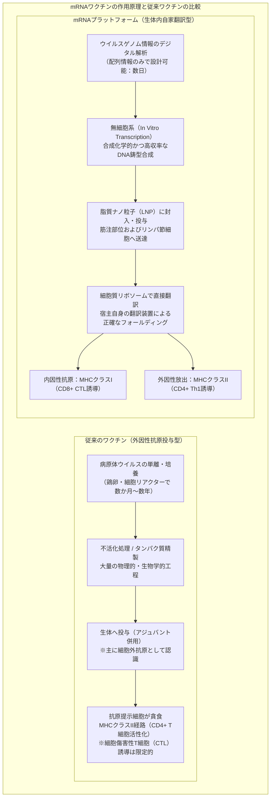
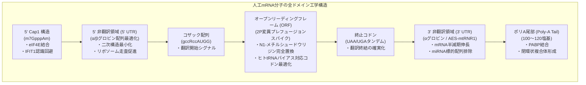
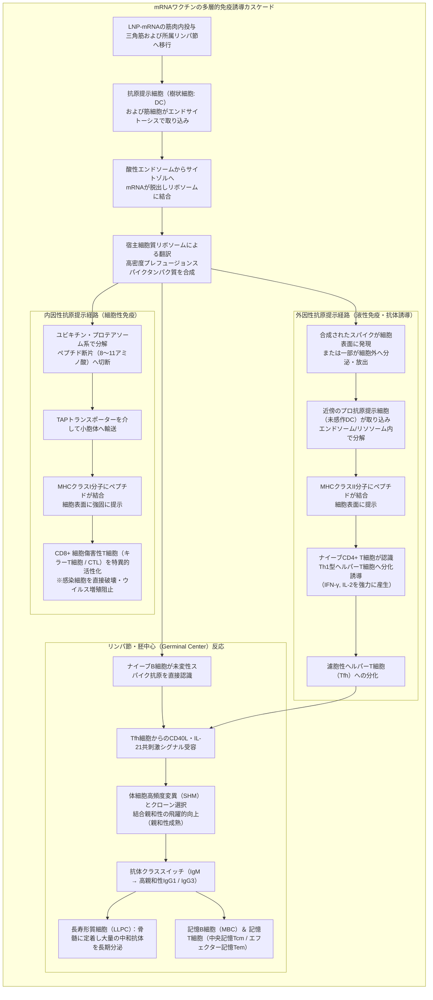
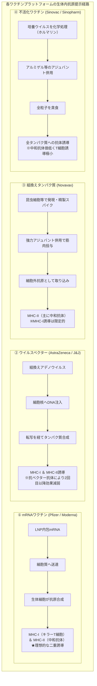

## 序論：mRNA革命 ——「壊れやすい分子」が切り拓いた人類最速のワクチン開発

2020年1月、中国・武漢で発生した未知の呼吸器感染症の原因病原体「SARS-CoV-2」の全ゲノム配列（約30,000塩基）がオンライン上に公開された。それからわずか42日後、米モデルナ（Moderna）社は臨床試験用ワクチンバイアル「mRNA-1273」の初期ロットを米国立衛生研究所（NIH）に出荷し、ドイツのバイオンテック（BioNTech）と米ファイザー（Pfizer）の共同開発チーム「BNT162b2」とともに、わずか11か月という人類史上前例のない電光石火のスピードで第III相大規模臨床試験の完了・緊急使用許可（EUA）へと駆け上がった。

従来のワクチン開発 —— 鶏卵培養や巨大バイオリアクターによる細胞培養を伴う生ワクチン、不活化ワクチン、組換えタンパク質ワクチン —— は、ウイルスの分離から株の選定、培養プロセスの最適化、安全性検証に至るまで、通常 **10年から15年** という気の遠くなるような歳月と天文学的なコストを要するのが医薬品開発の「常識」であった。

しかし、mRNA技術はその常識を根底から覆した。この技術の本質は、ワクチンを「抗原タンパク質そのものを外部で培養・精製して投与する工業製品」から、 **「宿主自身の細胞機構に目的タンパク質の設計図（デジタル遺伝コード）を一時的にロードし、生体内を自家製抗原工場へと変えるソフトウェア的プラットフォーム」** へと再定義した点にある。



### セントラルドグマにおけるmRNAの一過性と「ゲノム改変の非可能性」

一部で生じた「mRNAワクチンを接種するとヒトの遺伝子（DNA）が書き換えられるのではないか」という懸念に対し、分子生物学の根本原理である **「セントラルドグマ（Central Dogma）」** は明確な科学的回答を与える。

真核生物において、遺伝情報は **DNA（細胞核） → 転写（Transcription） → mRNA（核外搬出） → 翻訳（Translation） → タンパク質（細胞質）** という不可逆的な一方向の情報の流れを辿る。投与された外因性mRNAは、細胞質内に存在するリボソームによって直接翻訳され、目的とするスパイクタンパク質を産生する。
1. **核移行シグナルの欠如**: 人工mRNAには細胞核の核膜孔を通過するための核移行シグナルが存在せず、細胞質内にとどまる。
2. **逆転写酵素の非存在**: mRNAをDNAへと逆転写するには、レトロウイルスなどが持つ特殊な酵素「逆転写酵素（Reverse Transcriptase）」と、宿主ゲノムへ挿入するための「インテグラーゼ（Integrase）」が必須であるが、健常なヒト細胞内にはこれらが存在しない（内在性レトロトランスポゾンLINE-1による逆転写の可能性を示唆した試験管内極限実験も、生理的条件下の生体内ではゲノム挿入の証拠は得られていない）。
3. **生体内での急速な自然分解**: mRNAは本質的に数時間から数日以内に細胞内リボヌクレアーゼ（RNase）によって完全にヌクレオチドへと加水分解・代謝され、生体内から完全に消失する。

すなわち、mRNAワクチンは **「タンパク質を合成した直後に自壊する時限式の一過性メッセージ」** であり、宿主のゲノムDNAに永続的な改変を加えることは原理的にあり得ない。

---

## 第1章：40年の苦闘とブレイクスルー —— mRNAを医薬に変えた科学者たち

2020年の瞬く間の実用化は、決して突如として湧いて出た奇跡ではない。その背景には、学界から異端視され、研究資金の枯渇に苦しみながらも40年以上にわたって分子の謎に挑み続けた科学者たちの泥臭い基礎研究の積み重ねがあった。2023年、ノーベル生理学・医学賞が **カタリン・カリコ（Katalin Karikó）** 博士と **ドリュー・ワイスマン（Drew Weissman）** 博士に授与されたことは、基礎科学の尊い勝利の象徴である。

### 1.1 初期mRNA研究の絶望的壁：不安定性と致死的自然免疫反応

1961年、フランソワ・ジャコブ（François Jacob）、シドニー・ブレナー（Sydney Brenner）らによってmRNAが同定されて以来、分子生物学者たちは「mRNAを生体に注入すれば、任意の治療用タンパク質を体内で合成できるのではないか」という夢を抱き続けてきた。

しかし、1980年代から1990年代にかけて行われた初期の実験は、いずれも悲惨な失敗に終わった。当時の研究者を阻んだのは、主に2つの巨大な障壁であった。
- **極度の物理化学的不安定性**: 生体組織および空気中、手指の皮膚には、外来のRNAウイルスから生体を防御するための強力な分解酵素 **「リボヌクレアーゼ（RNase）」** が偏在している。裸のmRNA（Naked RNA）は、生体に注射された瞬間にRNaseによって無残にもバラバラに分解され、細胞内に到達することすら叶わなかった。
- **破滅的な自然免疫系の暴走**: 仮に無傷のmRNAを大量に動物へ投与できたとしても、生体はそれを危険な病原体（ウイルスRNA）と認識し、急性の炎症性サイトカインストームを惹起した。動物実験では重篤なショック状態や死亡が相次ぎ、mRNAは「毒性が強すぎて医薬品としては到底使えない欠陥分子」の烙印を押されたのである。

大学での昇進競争から脱落し、グラント（研究助成金）の打ち切りを幾度も通告されながらも、ペンシルベニア大学の片隅で「RNAには未知の可能性がある」と信じ続けたのがハンガリー出身の生化学者カタリン・カリコであった。

### 1.2 カリコとワイスマンの歴史的発見（2005年）：ウリジン修飾によるTLR受容体の回避

1997年、カリコは免疫学者ドリュー・ワイスマンと出会う。ワイスマンはエイズ（HIV）ワクチンの開発を目指して樹状細胞（Dendritic Cells: DC）の抗原提示能を研究していた。二人は意気投合し、mRNAを用いた樹状細胞の活性化共同研究を開始した。

二人が直面した最大の問いは、 **「なぜ生体自身のトランスファーRNA（tRNA）やリボソームRNA（rRNA）は免疫系に攻撃されないのに、試験管内で合成（In Vitro Transcription: IVT）したmRNAだけが樹状細胞を激しく刺激し、炎症を引き起こすのか」** という点であった。

哺乳類の細胞膜やエンドソーム膜には、侵入してきた病原体の核酸パターンを感知する自然免疫センサー **「Toll様受容体（Toll-like Receptors: TLR）」** が配備されている。
- **TLR3**: 二本鎖RNA（dsRNA）を認識。
- **TLR7 / TLR8**: 一本鎖RNA（ssRNA）中のウリジン（U）に富む配列を認識。
- **RIG-I / MDA5**: 細胞質内で外来性の5'三リン酸RNAや長鎖二本鎖RNAを感知し、I型インターフェロン（IFN-α/β）の転写を誘導。

カリコとワイスマンは、哺乳類の内在性RNAに豊富に存在する **「化学修飾塩基」** に着目した。内在性のtRNAやrRNAは、転写後にメチル化や異性化などの多様な修飾を受けている。これに対し、従来のIVT反応で合成されたmRNAは、未修飾の標準的な4種類の塩基（A, C, G, U）だけで構成されていた。

2005年、二人は科学史に残る記念碑的論文を発表した。 **mRNAを構成する「ウリジン（Uracil）」を、転写後修飾体である「シュードウリジン（Pseudouridine: Ψ）」に置換して合成したところ、TLR7やTLR8、さらには細胞内センサーによる認識が劇的に低下し、致死的な炎症反応が完全に消失したのである。**

### 1.3 シュードウリジンから「N1-メチルシュードウリジン（m1Ψ）」への進化

カリコとワイスマンの発見は、免疫反応の抑制にとどまらなかった。驚くべきことに、ウリジンを修飾したmRNAは、リボソームによる翻訳効率が数倍から数十倍へと跳ね上がったのである。

通常のウリジンを含む外因性mRNAが細胞内に侵入すると、自然免疫センサーの活性化によって **PKR（プロテインキナーゼR）** や **2'-5'オリゴアデニル酸合成酵素（OAS）** が誘導される。PKRは翻訳開始因子 **eIF2α** をリン酸化して細胞全体のタンパク質合成を停止させ、OASは **RNase L** を活性化して細胞質内のRNAを無差別に分解する（抗ウイルス防御反応）。

しかし、シュードウリジン修飾によってこれらの細胞内監視酵素の活性化が完全に回避されるため、リボソームは滑らかに、かつ長期間にわたってmRNAを連続翻訳できるようになった。

その後、2010年代にかけてバイオンテックやモデルナなどのバイオベンチャーによってさらなるスクリーニングが進められ、シュードウリジンの1位の窒素原子にメチル基を導入した **「N1-メチルシュードウリジン（m1Ψ: N1-methylpseudouridine）」** が同定された。
- m1Ψは、リボソームのデコーディングセンターにおけるコドン・アンチコドン塩基対形成を阻害することなく、二次構造の過剰な安定化を解きほぐす。
- TLR7/8への親和性を極限まで低下させ、未修飾ウリジンを100%置換することで、生体内での翻訳効率を飛躍的に向上させた。
ファイザー/バイオンテック（BNT162b2）およびモデルナ（mRNA-1273）のCOVID-19ワクチンには、この **m1Ψの100%完全置換技術** が標準採用されている。

### 1.4 スパイクタンパク質安定化の金字塔：バーニー・グラハムとジェイソン・マクレランの「2P変異」

mRNAの免疫回避と翻訳効率の向上と並んで、COVID-19ワクチンの成功を決定づけたもう一つの決定的なノーベル賞級の科学的業績が、 **「2P変異（Two-Proline Substitution）」によるプレフュージョン（融合前）スパイクタンパク質の立体構造安定化** である。

SARS-CoV-2の表面に突き出ている **スパイク（S）糖タンパク質** は、ヒト細胞のACE2受容体に結合して感染を成立させる鍵である。このスパイクタンパク質は、宿主細胞膜と融合する前と後で、その立体構造を劇的に変化させる極めて不安定な「分子バネ」のような動的構造物である。
- **融合前構造（Prefusion Conformation）**: 3量体の先端に受容体結合ドメイン（RBD: Receptor-Binding Domain）が露出し、ウイルスを効果的に無力化する **「強力な中和抗体」** が結合しやすい標的エピトープが豊富に存在する。
- **融合後構造（Postfusion Conformation）**: 標的細胞膜と融合した後の構造であり、細長い針のような形状に不可逆的に変形している。この状態のエピトープに対して誘導された抗体は、ウイルスの中和能が著しく低い。

米国立アレルギー・感染症研究所（NIAID）の **バーニー・グラハム（Barney Graham）** とテキサス大学オースティン校の **ジェイソン・マクレラン（Jason McLellan）** らは、2012年のMERS（中東呼吸器症候群）やSARS-CoV-1の構造生物学的研究（クライオ電子顕微鏡解析）を通じて、コロナウイルスのスパイクタンパク質のヒンジ領域（中央ヘリックスの上部、アミノ酸残基986位と987位のリジンとバリン）を **2つの連続した「プロリン（Proline: P）」** に人工的に置換すると、タンパク質が融合後構造へと崩壊するのを物理的に阻止し、 **融合前（Prefusion）の立体構造のまま強固に固定（フリーズ）できること** を突き止めていた。

2020年1月にSARS-CoV-2の塩基配列が公開された瞬間、研究チームはこの「2P変異」の知見を即座に適用した。
mRNAによって生体内で産生されるスパイクタンパク質を2P変異体（K986P、V987P）として設計することで、 **「もっとも感染力が高く、中和抗体の標的となりやすい立体構造」** を生体免疫系に高密度かつ安定して提示することに成功したのである。

---

## 第2章：mRNA分子の精密アーキテクチャ —— 人工mRNAの設計工学

治療用mRNAは、単にウイルスの遺伝暗号をコピーしただけの代物ではない。リボソームによる翻訳効率を極限まで高め、細胞内での分解速度を精密に制御するために、各構成ドメインに高度な分子工学的チューニングが施された **「人工生体高分子（Engineered Biopolymer）」** である。



### 2.1 5' キャップ構造（Cap0からCap1へ）：細胞内自己認識と翻訳開始

真核生物のmRNAの5'末端には、特徴的な **「7-メチルグアノシン（m7G）キャップ構造」** が付加されている。人工mRNAにおいて、このキャップ構造の化学的純度とメチル化パターンは死活的な重要性を持つ。
- **Cap0型（m7GpppN）**: 最も単純なキャップ構造であるが、高等脊椎動物の細胞質に存在する抗ウイルス自然免疫センサー **「IFIT1（Interferon-induced protein with tetratricopeptide repeats 1）」** によって「非自己（外来ウイルスRNA）」として感知され、翻訳が即座に遮断される。
- **Cap1型（m7GpppNm）**: キャップに隣接する第1番目のリボースの2'-O位がメチル化された構造（2'-O-methylation）。真核生物の内在性mRNAの標準的な目印であり、IFIT1の認識を完全に回避する。

ファイザーやモデルナのワクチンでは、共転写キャッピング試薬（CleanCap®法）などを用いることで、合成段階で **95%以上の極めて高い効率で正確なCap1構造** を導入している。これにより、翻訳開始因子複合体 **eIF4F（eIF4E, eIF4G, eIF4A）** が強固にリクルートされ、リボソームの40Sサブユニットが5'末端へ迅速に装填される。

### 2.2 5' および 3' 非翻訳領域（UTR）の最適化

タンパク質をコードしない **5' UTR** および **3' UTR** は、mRNAの細胞内局在、リボソームスキャニング速度、およびmRNAの物理的寿命（分解速度）を支配する司令塔である。
- **5' UTRの設計**: 長すぎる配列や、強固な二次構造（ヘアピンループやグアニン四重鎖構造: G-quadruplex）を形成する配列は、リボソームの移動を物理的に阻害する。そのため、二次構造を極限まで排除し、安定かつ高発現を維持するヒト **αグロビン** や **βグロビン** の非翻訳領域がベースとして採用されている。
- **3' UTRの設計**: mRNAの分解経路（デアデニレーションやエンドヌクレアーゼ分解）を遅延させ、かつ内因性マイクロRNA（miRNA）による意図せぬ発現サイレンシングを防ぐため、miRNA結合シード配列を注意深く排除した配列（例：マウスαグロビン配列、あるいはアミノ酸エンハンサー配列AESとミトコンドリアrRNA配列mtRNR1のキメラ複合体など）が組み込まれている。

### 2.3 オープンリーディングフレーム（ORF）とコドン最適化

スパイクタンパク質のアミノ酸配列をコードするORF領域には、最先端のバイオインフォマティクスによる **「コドン最適化（Codon Optimization）」** が施されている。

遺伝暗号の重複性（縮重）により、同じアミノ酸を指定するコドンが複数存在する（同義コドン）。ウイルスゲノム（SARS-CoV-2）は、宿主細胞のヒト細胞質と比較して、使用するコドンの頻度（コドンバイアス）が大きく異なっている。
1. **tRNA存在比との調和**: ヒト細胞質内で豊富に存在する高頻度tRNAに対応するコドンへと同義置換することで、リボソームのデコーディング待ち時間を最小化し、翻訳伸長速度（Elongation rate）を極大化する。
2. **GC含量の増加**: RNA配列中のグアニン（G）およびシトシン（C）の比率を戦略的に引き上げることで、mRNAの熱力学的安定性を高めるとともに、不要なスプライス部位や時期尚早なポリアデニル化シグナルを排除する。
3. **二本鎖RNA（dsRNA）副産物の低減**: IVT（試験管内転写）工程におけるT7 RNAポリメラーゼのバックトラッキング等によって生じる微量のdsRNA副産物は、強烈な自然免疫反応を惹起するため、配列設計とHPLC（高速液体クロマトグラフィー）精製によって限界まで除去されている。

### 2.4 ポリA尾部（Poly-A Tail）と「閉環状モデル」

3'末端に連なるアデニン残基の連続配列 **「ポリA尾部」** は、mRNAの生体内寿命を決定づける時計の役割を果たす。
- 生体内において、mRNAは **ポリA結合タンパク質（PABP）** と結合する。
- 5'末端のキャップに結合したeIF4Gと、3'末端のPABPが相互作用することにより、mRNAは **「閉環状（Closed-Loop Model）」** の環状複合体を形成する。
- この閉環状構造により、リボソームは終止コドンに達した後、速やかに再び5'末端の開始コドンへとリサイクルされ、同一のmRNA分子から何千回ものスパイクタンパク質が反復合成される。
- また、閉環構造はエキソヌクレアーゼによる両末端からの攻撃を立体的に阻害し、分解を防ぐ。モデルナやファイザーの製剤では、約100〜120塩基の厳密な長さのポリA尾部が組み込まれている。

---

## 第3章：生体防御壁を突破する輸送船 —— 脂質ナノ粒子（LNP）工学

いくら完璧に設計されたmRNAであっても、それを標的細胞の内部へと安全に送り届ける「デリバリーシステム」が存在しなければ、薬物としては1ミリグラムも機能しない。mRNA医薬の実用化を可能にした工学の主役こそが、直径約80〜100ナノメートルの **「脂質ナノ粒子（Lipid Nanoparticles: LNP）」** である。

### 3.1 なぜ裸のmRNA（Naked RNA）は投与できないのか

裸のmRNAを直接生体に筋肉注射しても、ワクチンとしての効果はほぼゼロである。その理由は2つの強固な物理・生化学的障壁にある。
1. **負電荷の静電的反発**: mRNAの骨格（ホスホジエステル結合）は強い負電荷（アニオン）を帯びている。一方、ヒトの細胞表面を覆うリン脂質二重膜の親水性頭部や糖鎖も負電荷を帯びており、両者はクーロン力によって強く反発し合う。
2. **生体液中のRNaseによる瞬時分解**: 血液や間質液中には遍在するRNaseが存在し、裸のmRNAの半減期はわずか数分に過ぎない。

したがって、mRNAを負電荷から遮蔽して保護し、細胞膜を通過させて細胞質へと脱出させる「ナノサイズのトロイの木馬」が不可欠であった。

### 3.2 LNPを構成する「黄金の4脂質」の役割と化学構造

COVID-19ワクチン（ファイザー製およびモデルナ製）のLNPは、それぞれ綿密に計算されたモル比で配合された **4種類の脂質分子** から構成されている。

```
【LNPの4大構成脂質】
1. イオン化可能脂質 (Ionizable Cationic Lipid) 〜 約46-50 mol%
2. ヘルパーリン脂質 (Helper Lipid: DSPC) 〜 約10 mol%
3. コレステロール (Cholesterol) 〜 約38-43 mol%
4. PEG化脂質 (PEGylated Lipid) 〜 約1.5-1.7 mol%
```

| 脂質成分 | 主な採用分子（ファイザー / モデルナ） | 配合比率 (mol%) | 物理化学的特性 | 生体内における必須機能 |
| :--- | :--- | :--- | :--- | :--- |
| **イオン化可能脂質<br/>(Ionizable Lipid)** | **ALC-0315** (Pfizer)<br/>**SM-102** (Moderna) | **約 46 〜 50%** | 見かけのpKaが **6.0〜6.8** 。酸性環境で正電荷、中性環境で電荷中性。三級アミンと生分解性エステル結合を有する。 | ① 酸性pH下で負電荷mRNAと静電結合し内核に凝集封入。<br/>② 生理的pH（7.4）の血中では中性化し細胞毒性・溶血を回避。<br/>③ エンドソーム内（酸性）で再プロトン化し膜を破壊して脱出。 |
| **ヘルパーリン脂質<br/>(Helper Lipid)** | **DSPC**<br/>(1,2-ジステアロイル-sn-グリセロ-3-ホスホコリン) | **約 10%** | 高い相転移温度（約55℃）を持つ飽和リン脂質。円筒形の分子形状。 | LNPの外殻に安定した脂質二重膜（ラメラ構造）を形成し、ナノ粒子の構造的剛性と形態的安定性を保持する。 |
| **コレステロール<br/>(Cholesterol)** | 植物由来精製コレステロール | **約 38 〜 43%** | 剛直なステロイド骨格と小さな親水性ヒドロキシル基。膜のパッキング分子。 | リン脂質二重膜の間隙を埋め、膜の流動性と相転移挙動を最適化。細胞膜融合能を向上させ、粒子の漏れを防ぐ。 |
| **PEG化脂質<br/>(PEGylated Lipid)** | **ALC-0159** (Pfizer)<br/>**PEG2000-DMG** (Moderna) | **約 1.5 〜 1.7%** | 親水性ポリエチレングリコール鎖が脂質アンカー（ジミリスチルグリセロール等）に結合。 | ① 製造・保管時のナノ粒子同士の凝集を防ぎ粒径（約80nm）を均一に制御。<br/>② 血清タンパク質の非特異的吸着（オプソニン化）を防ぎ血中半減期を延長。<br/>③ 生体内で徐々に解離（脱落）し細胞取り込みを促進。 |

### 3.3 エンドサイトーシスとエンドソーム脱出（Endosomal Escape）の驚異

LNPが筋肉内に注射された後、目的のタンパク質が合成されるまでの最大の関門は、細胞質への **「エンドソーム脱出（Endosomal Escape）」** である。

1. **細胞表面への吸着と取り込み**:
   血流や間質液中に露出したLNPは、生体内の **アポリポタンパク質E（ApoE）** などの血清リポタンパク質を表面に吸着する。これにより、抗原提示細胞（樹状細胞やマクロファージ）や筋細胞の表面にある **低密度リポタンパク質受容体（LDLR）** を介した受容体媒介性エンドサイトーシスによって、細胞内へと小胞（エンドソーム）として取り込まれる。
2. **エンドソームの酸性化とプロトン化**:
   初期エンドソームから後期エンドソームへと成熟する過程で、膜上のプロトンポンプ（V-ATPase）の働きにより、内腔のpHは中性（7.4）から酸性（pH 6.5 → 5.5以下）へと急速に低下する。
3. **イオン化脂質の電荷逆転と「プロトンスポンジ効果」**:
   LNPに組み込まれたイオン化可能脂質（pKa約6.0〜6.8）は、この酸性環境で一斉に水素イオン（$H^+$）を受け取り、**中性から強力な正電荷（カチオン）へと劇的に相転移** する。
4. **膜融合とmRNAの細胞質への放出**:
   正電荷を帯びたイオン化脂質は、エンドソーム内膜に豊富に存在する負電荷のリン脂質（ホスファチジルセリンなど）と強力に引き合い、膜のラメラ構造を崩壊させて「逆六角相（Hexagonal II phase: $H_{II}$ 相）」と呼ばれる非二分子膜構造を誘発する。この局所的な膜の亀裂と浸透圧の上昇（プロトンスポンジ効果）により、エンドソーム膜に孔が開き、内包されていたmRNAが傷つくことなく **細胞質（サイトゾル）のリボソームプールへと解き放たれる** のである。

最新のナノバイオロジー研究によれば、エンドソームに取り込まれたmRNAのうち、実際に細胞質へと脱出できる割合はわずか **数%から十数%** に過ぎない。しかし、mRNAは極めて高効率な翻訳鋳型であるため、このわずかな脱出量であっても、生体を強力に感作するのに十分なスパイクタンパク質が爆発的に産生されるのである。

### 3.4 マイクロ流体混合技術（Microfluidic Formulation）

LNPの工業的大量生産を支えたのが、**「マイクロ流体混合（Microfluidics）」** の技術革新である。

従来のビーカーやホモジナイザーによる粗大なエマルション調製法では、ナノ粒子の粒径が不均一（多分散）になり、mRNAの封入効率も低く品質が安定しなかった。
現代のmRNAワクチン製造ラインでは、幅数十マイクロメートルの微小流路内で、**「エタノールに溶解した4種類の脂質溶液」** と **「酸性緩衝液に溶解したmRNA水溶液」** を秒速数メートルの制御された流速比で衝突・急速混合させる。

混合の瞬間にエタノール濃度が希釈され、脂質の溶解度が急激に低下する（自己組織化の誘発）。正電荷を帯びたイオン化脂質がmRNAの負電荷を取り囲みながらナノコアを形成し、その外周をDSPC、コレステロール、PEG脂質が覆うことで、**粒径約80〜100nm、mRNA封入率90%以上、極めて狭い単分散性（PDI < 0.1）** を持つ高品質なLNPがミリ秒単位で連続製造される。

---

## 第4章：多層的免疫カスケード —— 細胞質翻訳から全身免疫の樹立まで

mRNAワクチンが従来の不活化ワクチンや組換えタンパク質ワクチンを圧倒する最大の理由は、その **「生体内抗原提示の多重性（MHCクラスIとクラスIIの同時活性化）」** にある。



### 4.1 局所筋組織および所属リンパ節における取り込みと高発現

三角筋に筋肉注射されたLNPの大部分は、注射部位近傍の間質液を通じて、数時間から数日のうちに所属リンパ節（主に腋窩リンパ節）へと流入する。
- 投与部位の骨格筋細胞もmRNAを取り込みスパイクタンパク質を膜上に発現するが、真に免疫誘導の主役を果たすのは、局所に存在する組織常在性マクロファージ、ならびにリンパ節内に密集する **「プロフェッショナル抗原提示細胞（専門的APC）」である樹状細胞（DC）** である。
- 樹状細胞の細胞質内で合成されたプレフュージョンスパイクは、生体自身の翻訳後修飾（正確なジスルフィド結合形成および糖鎖付加）を受け、本来のウイルス表面と全く同一の立体配置（3量体構造）をとって細胞膜表面に露出する。

### 4.2 MHCクラスI経路による細胞傷害性T細胞（CD8+ CTL）の劇的誘導

従来の不活化ワクチンや組換えタンパク質ワクチンは、細胞の「外側」からタンパク質を投与するため、主に後述のMHCクラスII経路しか活性化できず、**「ウイルスに感染してしまった細胞そのものを殺傷・排除するキラーT細胞（CD8+ CTL）」** を誘導することが極めて困難であった。

しかし、mRNAワクチンは抗原タンパク質を **「細胞の内側（細胞質）」で合成させる** という画期的な特性を持つ。
1. **プロテアソーム分解**: 細胞質内で合成されたスパイクタンパク質の一部は、細胞内のタンパク質品質管理機構によってユビキチン化され、**プロテアソーム** によって8〜11個のアミノ酸ペプチド断片へと切断される。
2. **小胞体への輸送**: ペプチド断片は、抗原プロセシング関連トランスポーター（**TAP**）を介して小胞体（ER）内腔へと能動輸送される。
3. **MHCクラスI分子へのローディング**: 小胞体内で新たに組み立てられた **MHCクラスI（ヒト白血球抗原: HLA-A, B, C）** 分子のペプチド結合溝にスパイクペプチドが結合し、ゴルジ体を経て細胞表面に提示される。
4. **キラーT細胞のプライミング**: リンパ節内のナイーブCD8+ T細胞は、T細胞受容体（TCR）を介してこのMHC-I/ペプチド複合体を認識し、共刺激シグナル（CD80/CD86とCD28の結合）とともに強力に活性化・増殖して **エフェクター細胞傷害性T細胞（CTL）** へと分化する。

この強力なCTL誘導こそが、後に変異株によって中和抗体が突破された際にも、**「重症化や死亡を劇的に防ぎ続ける最後の防壁」** となった生化学的根拠である。

### 4.3 MHCクラスII経路とTh1型ヘルパーT細胞の誘導

同時に、合成されたスパイクタンパク質は細胞死やエキソサイトーシスに伴って細胞外へも放出される。
- これを周囲の未感作樹状細胞がエンドサイトーシスや貪食作用によって取り込み、酸性リソソーム内で分解する。
- 13〜18アミノ酸のペプチド断片が **MHCクラスII（HLA-DR, DQ, DP）** 分子に装填され、細胞表面に提示される。
- ナイーブCD4+ T細胞がこれを認識すると、LNPの持つ微小なアジュバント作用（適度な自然免疫刺激）により、アレルギー性のTh2型ではなく、抗ウイルス防御に最も望ましい **「Th1型（インターフェロン-γやIL-2を大量分泌するヘルパーT細胞）」** へと極性化して分化する。このTh1優位の分化が、後述する重篤な免疫病理（VAED/ADE）の回避に決定的な役割を果たした。

### 4.4 胚中心（Germinal Center）の劇的形成とB細胞の親和性成熟

mRNAワクチンの免疫誘導において最も美しく、劇的な生体反応が、リンパ節内に形成される **「胚中心（Germinal Center: GC）」** の長期維持である。

1. **未変性抗原の認識**: リンパ節の濾胞に局在するナイーブB細胞は、B細胞受容体（BCR）を介して、樹状細胞の表面に露出している未変性の立体的なプレフュージョンスパイク3量体と直接結合する。
2. **濾胞性ヘルパーT細胞（Tfh）の強力な支援**: 抗原を取り込んだB細胞は、胚中心へと移動し、特異的に分化した **Tfh（T follicular helper）細胞** からCD40リガンド（CD40L）やインターロイキン-21（IL-21）などの生存・増殖シグナルを受け取る。
3. **体細胞高頻度変異（SHM）と親和性成熟**:
   - 胚中心の暗帯（Dark Zone）において、B細胞は酵素AID（活性化誘導シチジンデアミナーゼ）の働きにより、抗体の抗原結合部位（可変領域）の遺伝子に通常では考えられない高頻度の点変異（Somatic Hypermutation）を意図的に導入しながら猛烈な勢いで分裂する。
   - 明帯（Light Zone）へと移動した変異B細胞群は、濾胞樹状細胞（FDC）が保持するスパイク抗原をめぐって熾烈な結合競争（Selection）を行う。
   - スパイクに対してより強固に、より精密に結合できる変異を獲得した「エリートB細胞」だけがTfhから生存シグナルを勝ち取り、結合力の弱いB細胞はアポトーシス（細胞死）によって容赦なく淘汰される。
4. **クラススイッチと長寿形質細胞・記憶細胞の分化**:
   - この過程で、抗体定常領域の遺伝子組換え（Class Switch Recombination）が起こり、初期の低親和性IgMから、強力な中和活性と組織浸透性を持つ **高親和性IgG（主にIgG1およびIgG3）** へと進化する。
   - 勝ち残った最高品質のB細胞の一部は、**長寿形質細胞（LLPC: Long-Lived Plasma Cells）** となって骨髄のニッチに定着し、何カ月にもわたって血中に毎秒何千分子もの超高親和性中和抗体を放出し続ける。
   - もう一部は **記憶B細胞（MBC）** となり、将来の変異株の再侵入に備えて全身のリンパ節や脾臓に配備される。

研究によれば、mRNAワクチンの接種によって誘導されたヒトの胚中心反応は、**初回接種から少なくとも半年以上という異例の長期にわたって活発に維持されること** がリンパ節生検研究によって実証されている。

---

## 第5章：臨床エビデンス・有効性の推移・変異株との戦い

### 5.1 第III相大規模臨床試験の成果：発症予防効果95%の衝撃

2020年11月から12月にかけて相次いで学術誌『ニューイングランド・ジャーナル・オブ・メディシン（NEJM）』に発表されたファイザー（Polackら）とモデルナ（Badenら）の第III相臨床試験結果は、医学界に文字通りの衝撃を与えた。
- **ファイザー（BNT162b2: 43,448人参加）**: プラセボ群で162件のCOVID-19発症が確認されたのに対し、ワクチン接種群での発症はわずか8件にとどまり、**発症予防効果 95.0%（95% CI: 90.3–97.6%）** を記録。重症化例もプラセボ群9例に対し接種群1例のみであった。
- **モデルナ（mRNA-1273: 30,420人参加）**: プラセボ群で185件の発症（うち重症30件、死亡1件）に対し、接種群で11件（重症0件）であり、**発症予防効果 94.1%（95% CI: 89.3–96.8%）**、重症化予防効果は100%を達成した。

当初、米食品医薬品局（FDA）や世界保健機関（WHO）が緊急使用許可の基準として設定していたハードルは「発症予防効果50%以上」であった。インフルエンザワクチンの有効率が例年40〜60%前後であることを考慮すれば、未知の新興感染症に対して「95%」という数値は、多くの感染症専門家にとって予想を遥かに超える驚異的な大勝利であった。

### 5.2 相対リスク減少率（RRR）と絶対リスク減少率（ARR）の統計学的解釈

臨床試験データの解釈を巡り、一部で「95%というのは相対リスク減少率（RRR: Relative Risk Reduction）であり、絶対リスク減少率（ARR: Absolute Risk Reduction）はわずか1%程度にすぎないから効果がない」という統計学的誤読が生じた。

この議論の科学的実態を整理する：
- **RRR（相対リスク減少率）**: プラセボ群の発症率 $I_p$ と接種群の発症率 $I_v$ を比較した指標。
  $$RRR = \frac{I_p - I_v}{I_p} \times 100\% = \frac{0.0088 - 0.0004}{0.0088} \approx 95\%$$
  これは **「ワクチンがウイルスの発症力を何割遮断できるか」という生物学的・免疫学的効力** を純粋に示す尺度である。
- **ARR（絶対リスク減少率）**: 臨床試験の限られた観察期間（数カ月間）内に、集団全体の中で感染した人の割合の絶対差。
  $$ARR = I_p - I_v \approx 0.88\% - 0.04\% = 0.84\%$$
- **統計学の本質**:
  ARRは、試験期間中の **「社会全体の感染流行の規模（背景罹患率）」** に完全に依存する。感染者が極めて少ない社会状況で試験を行えば、いかなる万能ワクチンであってもARRは原理的に1%未満となる。しかし、感染爆発が起きて全人口の20%が曝露される状況になれば、ARRは一気に $20\% \times 95\% = 19\%$ へと跳ね上がる。
  したがって、「ARRが小さいからワクチンが無効である」という主張は、生物学的予防効力と疫学的曝露率を混同した統計学的誤認である。

### 5.3 リアルワールドエビデンス（RWE）：国家規模データが示した真実

臨床試験の理想的環境から、現実の雑多な社会（高齢者、基礎疾患保有者、免疫抑制患者を含む数千万人規模）へ接種が展開された際、mRNAワクチンの実効性はどうであったか。

世界に先駆けて全住民への迅速接種を実施した **イスラエル（Clalit Health Servicesによる120万人マッチドコホート研究、Daganら、NEJM 2021）**、ならびに英国（UKHSA）、米国（CDC）の大規模疫学データは、以下の極めて重要な事実を証明した。
1. **初期流行株に対する圧倒的制圧**: 武漢原初株およびアルファ株に対しては、現実社会においても90%以上の感染予防効果、ならびに95%以上の入院・死亡予防効果が完全に再現された。
2. **感染予防効果の経時的減衰**: 接種後4〜6カ月が経過すると、血中の中和抗体価の自然な半減期に伴い、有症候性感染を防ぐ効果（感染予防効果）は60〜70%台へと徐々に低下した。
3. **重症化・死亡予防効果の強固な持続**: 一方で、入院や人工呼吸器装着、死亡を防ぐ「重症化予防効果」は、抗体価が低下した後も85〜90%以上の高水準で長期にわたって維持された。これは、血中抗体が減少しても、骨髄の記憶B細胞が再感染時に数日以内に抗体を再生産すること、および **頑健なCD8+キラーT細胞の細胞性免疫** が肺深部でのウイルス増殖を物理的に制圧し続けたためである。

### 5.4 変異株の波と免疫逃避：中和抗体の低下とT細胞の頑健性

パンデミックの進展とともに、SARS-CoV-2は宿主免疫の選択圧を受けてゲノム変異を急速に蓄積させた。

| 変異株系統 | 主な変異部位（RBD等） | 中和抗体感受性（原初株比） | 2回接種時の感染予防効果 | 2回接種時の重症化予防効果 | ブースター（3回目/更新型）の効果 |
| :--- | :--- | :--- | :--- | :--- | :--- |
| **武漢原初株<br/>(Wuhan-Hu-1)** | 基準（変異なし） | **1.0倍**（基準） | **約 95%** | **約 95% 以上** | 抗体価が基準の数倍〜十数倍へ上昇 |
| **アルファ株<br/>(Alpha: B.1.1.7)** | N501Y, P681H | **約 1.5 〜 2倍 微減** | **約 85 〜 90%** | **約 95%** | 感染・重症化ともに高水準維持 |
| **デルタ株<br/>(Delta: B.1.617.2)** | L452R, T478K, P681R | **約 3 〜 6倍 低下** | **約 60 〜 75%** (時間経過で低下) | **約 90%** | 3回目接種で発症予防が85%以上へ回復 |
| **オミクロン BA.1/BA.2<br/>(Omicron初期)** | RBDに15箇所以上の変異<br/>(K417N, E484A, N501Y等) | **約 20 〜 40倍 激減** | **約 20 〜 40%** (2回接種では顕著に低下) | **約 70 〜 80%** (T細胞免疫により保持) | 3回目ブースターにより発症予防65〜75%、重症化90%以上へ劇的改善 |
| **オミクロン BA.4/BA.5<br/>および XBB/JN.1** | L452R, F486V/P, R346T<br/>受容体親和性と逃避の極限化 | **抗体結合能の大幅喪失** | **2回接種のみではほぼ消失** | **約 60 〜 70%** (基礎免疫により維持) | オミクロン対応2価 / 単価XBB.1.5 / JN.1ワクチンにより中和抗体再誘導・重症化予防70〜80%超 |

オミクロン株の出現は、中和抗体による「ウイルスの侵入そのものを完全にブロックする水際防御（感染予防）」の限界を浮き彫りにした。オミクロン株のスパイクタンパク質には30箇所以上、RBDだけで15箇所ものアミノ酸変異が集積しており、初期ワクチンによって誘導された中和抗体の結合エピトープの多くが構造変化を起こしていた。

しかし、ここで真価を発揮したのが **「T細胞性免疫の多様性」** であった。
- 中和抗体が認識する標的は、スパイク表面の露出したごく一部の立体構造（コンフォメーション・エピトープ）に集中しているため、数箇所のアミノ酸置換で結合力が激減する。
- 対照的に、T細胞が認識するのは、MHC分子によって提示される **線状のペプチド断片（リニア・エピトープ）** であり、スパイクタンパク質全体（1,273アミノ酸）に無数に分散して存在している。
- ヒト集団は個人ごとに異なるMHC（HLA型）を持っているため、ウイルスがT細胞エピトープのすべてを変異させて逃避することは進化生物学的に不可能であった。
- 各国の研究機関による解析の結果、**オミクロン株に対しても、初期ワクチンによって獲得されたT細胞エピトープの80〜90%以上が依然として無傷のまま保存されていること** が証明された。これが、オミクロン株の世界的大流行において感染者数が天文学的に跳ね上がりながらも、先進国での致死率・集中治療室（ICU）収容率が劇的に抑制された免疫学的メカニズムである。

### 5.5 追加免疫（ブースター接種）と抗原更新型ワクチンの設計

抗体価の自然減衰と変異株の出現に対し、mRNAプラットフォームの真の強みである **「機動性（Agility）」** が発揮された。
1. **相同ブースター（3回目接種）**: 原初株ワクチンを追加接種するだけで、胚中心反応が再点火され、既存の記憶B細胞がさらに親和性成熟を進めることで、オミクロン株に対しても交差中和活性を持つ抗体集団が誘導された。
2. **2価ワクチン（Bivalent Vaccines）**: 原初株とオミクロンBA.1またはBA.4/5のmRNAを1:1で等量混合した2価ワクチンが実用化され、抗原のスペクトラムを拡大した。
3. **単価更新型ワクチン（XBB.1.5、JN.1系統）**: 免疫原性の希釈（抗原原罪 / Immune Imprintingの懸念）を避けるため、最新の流行株単一のmRNAを組み込んだワクチンへとアップデートされた。DNA配列のデジタルデータを書き換えるだけで、わずか2〜3カ月で新しい変異株対応バイアルを生産ラインに乗せられる能力は、mRNAプラットフォーム以外の旧来技術では到底不可能な離れ業であった。

---

## 第6章：安全性プロファイル・副反応の病態生理・リスク-ベネフィット論

あらゆる医薬品・ワクチンと同様に、mRNAワクチンも生体に投与される生物学的製剤である以上、ベネフィット（感染症予防・重症化回避）の裏面には必ずリスク（副反応・有害事象）が存在する。科学的誠実さをもって副反応の病態生理を解明し、定量的リスク・ベネフィットを客観的に評価することが不可欠である。

### 6.1 局所・全身の反応原生（Reactogenicity）：免疫作動の生理的コスト

mRNAワクチン接種後に高頻度で観察される局所症状（注射部位の疼痛、腫脹、発赤）および全身症状（38℃以上の発熱、倦怠感、頭痛、悪寒、筋肉痛・関節痛）は、毒性による破壊ではなく、**「生体の自然免疫系が意図通りに作動している生理的サイン」** である。
- LNPを構成する脂質分子や微量の刺激により、局所の樹状細胞やマクロファージから **IL-1β、IL-6、TNF-α、I型インターフェロン（IFN-α/β）** などの炎症性サイトカインが一過性に血中へと放出される。
- これが視床下部の体温調節中枢を刺激して発熱を引き起こし、全身の筋骨格に倦怠感を生じさせる。
- これらの症状の大部分は接種後24〜48時間以内に自然寛解し、アセトアミノフェンやイブプロフェンなどの解熱鎮痛薬によって適切に対症療法が可能である。

### 6.2 心筋炎・心膜炎（Myocarditis / Pericarditis）：疫学と推定病理メカニズム

mRNAワクチンの実用化に伴い、特に **「思春期から若年成人（12〜29歳）の男性」** において、接種後数日以内（主に2回目接種後）に極めて稀に **心筋炎・心膜炎** が発症することが世界規模のファーマコビジランス（安全性監視システム：米VAERS、VSD、イスラエル保健省、日本の副反応疑い報告）によって特定された。

#### ① 疫学的発生頻度
- 全体での発生率は **接種10万回あたり数例（約1〜5人 / 10万人）** 程度と極めて稀である。
- 最もリスクが高い **16〜19歳の男性・2回目接種後** においても、発生率は **10万回あたり約10〜15件（約0.01%）** 前後である。
- モデルナ製（mRNA-1273: 100μg投与）の方が、ファイザー製（BNT162b2: 30μg投与）よりもmRNAおよび脂質用量が多いため、若年男性における心筋炎発現率が統計学的にわずかに高いことが判明し、多くの国で若年層への推奨がファイザー製へと一本化された。

#### ② 推定される分子病理メカニズム
現在の学術界において有力視されている機序は以下の複合要因である：
1. **遊離スパイクタンパク質と免疫複合体**: ハーバード大学のYonkerらの研究（Circulation 2023）によれば、心筋炎を発症した若年者の血中では、抗体と結合していない未中和の「遊離スパイクタンパク質（Free Spike）」が高濃度で検出され、これが心筋組織の自然免疫受容体を過剰刺激した可能性が示唆されている。
2. **性ホルモン（テストステロン）の関与**: なぜ思春期・若年男性に圧倒的に偏るのか。男性ホルモンであるテストステロンはTh1型免疫応答や炎症性マクロファージの活性化を促進する一方、女性ホルモン（エストロゲン）は炎症抑制作用を持つため、ホルモン環境の差異が感受性を規定していると考えられている。
3. **自己抗体の誘導**: 心筋の収縮装置であるα-ミオシンなどの自己抗原に対する自己免疫交差反応が一過性に誘発されたとする仮説。

#### ③ 臨床経過と「感染との比較」
重要な点は、**ワクチン起因の心筋炎の大部分（90%以上）は軽症であり、入院しても非ステロイド性抗炎症薬（NSAIDs）等の保存的治療により数日から1週間程度で心機能が完全回復する良好な転帰を辿る** という点である（重症心不全や死亡に至る例は極めて例外的に限られる）。
さらに決定的なのは、**「SARS-CoV-2ウイルスに実際に感染したことによって生じる心筋炎の発生リスク（および重症度・致死率）は、ワクチン接種によるリスクよりも数倍から数十倍も高い」** という定量的医学エビデンスである。CDCや英国の大規模コホート解析により、若年男性層であっても、感染による多臓器障害、心筋炎、血栓症、Long COVID（後遺症）を防ぐベネフィットがワクチンの稀な副反応リスクを統計学的に大きく上回ることが繰り返し確認されている。

### 6.3 アナフィラキシーとPEGアレルギー

接種後数分から30分以内に発症する急性アレルギー反応「アナフィラキシー」の頻度は、**接種100万回あたり約2〜5件** であり、通常のインフルエンザワクチン（100万回あたり約1件）よりやや高いものの、極めて稀である。
- **原因物質**: 主にLNPの表面を覆う **PEG2000（ポリエチレングリコール）** に対する既存の抗PEG IgE抗体、あるいは補体活性化関連偽アレルギー（CARPA）による肥満細胞の脱顆粒が原因と考えられている。
- 日常生活で化粧品、シャンプー、医薬品（大腸内視鏡用下剤など）を通じてPEGに感作されていたごく一部の人が発症する。
- 接種会場での15〜30分間の待機観察と、アドレナリン筋肉注射（エピペン等）の迅速な投与プロトコルにより、死亡例はほぼ完全に回避された。

### 6.4 アデノウイルスベクターワクチン（TTS/VITT）との機序の相違

アストラゼネカ製（ChAdOx1-S）やジョンソン・エンド・ジョンソン製（Ad26.COV2.S）などの **ウイルスベクターワクチン** では、極めて深刻な **「血小板減少症を伴う血栓症（TTS: Thrombosis with Thrombocytopenia Syndrome / VITT）」** が若年女性を中心に発生し、問題となった。
- **VITTの機序**: ウイルスベクター（アデノウイルスキャプシド）のタンパク質が血小板第4因子（PF4）と結合して巨大な複合体を形成し、ヘパリン起因性血小板減少症（HIT）と類似した自己抗体が産生されて血小板が全身で凝集、脳静脈洞血栓症や内臓静脈血栓症を引き起こす。
- **mRNAワクチンの安全性**: mRNAワクチン（ファイザー・モデルナ）では、PF4複合体を形成するようなウイルスタンパク質キャプシドを一切含まないため、**このVITT/TTSの発生リスクは認められていない**。

### 6.5 ADE（抗体依存性感染増強）およびVAED（ワクチン関連疾患増悪）の検証

過去のデング熱ワクチンや1960年代のRSウイルス不活化ワクチン（FI-RSV）の臨床開発では、ワクチンによって誘導された不十分な抗体がウイルスと結合し、Fc受容体を介してマクロファージ内へのウイルス侵入をかえって助けて重篤化させる **「ADE（Antibody-Dependent Enhancement）」**、あるいはアレルギー性炎症を悪化させる **「VAED（Vaccine-Associated Enhanced Disease）」** が発生した悲劇的歴史があった。

COVID-19ワクチンの開発初期にもADE/VAEDの発生が理論的リスクとして激しく懸念されたが、**全世界で数十億回投与された臨床試験およびリアルワールドにおいて、mRNAワクチンによるADE/VAEDの発生は一切観察されなかった**。
その理由は分子生物学的に解明されている：
1. **2P変異による高親和性中和抗体の独占的誘導**: プレフュージョン安定化スパイクにより、誘導される抗体の大部分がウイルスを瞬時に無力化する「強力な中和抗体」であり、中和能を持たない感染増強抗体の産生が最小化された。
2. **Th1極性化の徹底**: mRNAとLNPの組み合わせがCD4+ T細胞を強力にTh1型（細胞性免疫優位）へと誘導し、好酸球浸潤や免疫複合体沈着を引き起こすTh2型アレルギー反応（VAEDの本態）を完全に遮断した。

| 副反応・有害事象 | 発現頻度 | 発症好発時期 | 主な病態生理学的機序 | 臨床的転帰と対処法 |
| :--- | :--- | :--- | :--- | :--- |
| **注射部位局所反応**（疼痛・発赤・硬結） | **70 〜 85%**（極めて高頻度） | 接種当日〜翌日 | 局所筋膜・皮下組織における炎症性サイトカイン（IL-1, TNF）の放出と好中球浸潤 | 1〜3日で自然軽快。局所冷却、対症療法。 |
| **全身性反応原生**（発熱・倦怠感・頭痛） | **50 〜 70%**（高頻度、2回目多） | 接種翌日（12〜24時間後） | 循環血中へのIL-6、IFN-α/β流入による視床下部体温中枢刺激 | 1〜2日で消失。アセトアミノフェン等の解熱鎮痛剤。 |
| **心筋炎・心膜炎** | **1〜10万回に1〜5件**（極めて稀、10-20代男性好発） | 接種後2〜4日以内 | 遊離スパイクによる過剰刺激、テストステロン依存性の炎症増幅、一過性自己免疫反応 | **大半（>90%）が軽症**。NSAIDs等の保存的治療で速やかに完治。 |
| **アナフィラキシー** | **100万回に2〜5件**（極めて稀） | 接種直後〜30分以内 | LNP外殻のPEG化脂質に対する既存抗体または補体活性化（CARPA）による肥満細胞脱顆粒 | 即座のアドレナリン（エピペン）筋注により後遺症なく回復。 |
| **ギラン・バレー症候群** | **mRNAワクチンでは背景発生率と同等** | 接種後数週間 | 末梢神経髄鞘に対する自己抗体産生（ウイルスベクターでは微増報告あるもmRNAでは関連性否定） | 免疫グロブリン大量静注療法（IVIg）等。 |

---

## 第7章：ワクチン技術プラットフォームの徹底比較

COVID-19パンデミックは、人類が保有するあらゆるバイオテクノロジーのプラットフォームが一堂に会し、その性能を競い合った未曾有の実験場でもあった。



### 7.1 mRNA vs ウイルスベクター（DNA型プラットフォーム）

ウイルスベクターワクチンは、毒性を弱めたアデノウイルスのゲノムにスパイク遺伝子（DNA）を組み込んだものである。
- **利点**: DNAは化学的に安定しているため、通常の冷蔵温度（2〜8℃）で長期保存・輸送が可能であり、開発途上国での配布に適していた。
- **決定的な弱点（抗ベクター免疫）**: 最大の欠点は、生体が「スパイクタンパク質」だけでなく「運び屋であるアデノウイルスの外殻」に対しても中和抗体を作ってしまう点である。このため、2回目以降の接種（ブースター）ではベクター自体が生体内で排除されてしまい、効果が急速に減衰する。また、前述の重篤なVITT（血栓性血小板減少症）のリスクも影を落とした。
- 対してmRNAワクチンは、LNPが人工合成脂質でありタンパク質抗原性を持たないため、**何度ブースター接種を繰り返しても抗体によってキャリアが排除されることがない**。

### 7.2 mRNA vs 組換えタンパク質ワクチン

ノババックス（Novavax / Nuvaxovid）に代表される組換えタンパク質ワクチンは、昆虫細胞リアクターを用いて人工的にスパイクタンパク質を合成・精製し、特殊なサポニン系アジュバント（Matrix-M™）とともに投与する。
- **利点**: 従来のB型肝炎ワクチンなどで数十年間の使用実績がある「枯れた技術」であり、発熱などの反応原生がmRNAワクチンに比べて極めてマイルドである。
- **弱点**: 生きた細胞を培養してタンパク質を精製・リフォールディング（立体構造再生）させる必要があるため、製造期間が数カ月単位と長く、変異株が出現した際の迅速な抗原更新が極めて困難である。

### 7.3 mRNA vs 不活化ワクチン

中国のシノバック（CoronaVac）やシノファーム（BBIBP-CorV）に代表される不活化ワクチンは、ウイルスを大量培養した後に化学薬品（β-プロピオラクトンなど）で感染性を完全に失活させたものである。
- **利点**: スパイクだけでなくヌクレオカプシド（Nタンパク質）などウイルス全構成要素を含む。
- **弱点**: 中和抗体の誘導能がmRNAワクチンに比べて著しく低く、細胞傷害性T細胞（CTL）の誘導能はほぼ皆無である。オミクロン株に対する発症予防効果は早期に失われ、変異株対策としての有効性は大きく制限された。また、製造にあたって高度なバイオセーフティレベル3（BSL-3）の巨大培養施設が必要であり、生物学的汚染のリスクを伴う。

### 7.4 製造プロセス・サプライチェーン・コールドチェーンの熱力学的制約

mRNAワクチンの製造と流通における最大のボトルネックは、初期に課された **「超低温コールドチェーン（-80℃〜-20℃保管）」** であった。
- **物理化学的背景**: mRNAのホスホジエステル結合は、水分が存在する液中環境下において、リボース2'位のヒドロキシル基（-OH）が隣接するリン酸基を分子内攻撃する「自己加水分解（Autohydrolysis）」を起こしやすい。さらに、LNP内の脂質も酸化や加水分解を受け、粒子同士の凝集（フュージョン）が進行する。
- **急速な凍結保存の必然性**: これらの熱力学的な分解反応を完全に停止させるため、ファイザー製初期ロットではドライアイスを用いた **-80℃〜-60℃**、モデルナ製では **-20℃** の厳格な冷凍管理が必須であった。
- **工業的製造の劇的メリット**: しかし、製造工程自体は「無細胞合成系（In Vitro Transcription）」であるため、数千リットルのバイオリアクターで何カ月も細胞を培養する必要がなく、わずか数リットルの試験管内酵素反応器から数億回分のmRNAを一挙に合成できる。この **「製造フットプリントの小ささとスケーラビリティ」** こそが、全世界へ数十億回分を即時供給できた最大の勝因であった。

| 比較項目 | ① mRNAワクチン | ② ウイルスベクター | ③ 組換えタンパク質 | ④ 不活化ワクチン |
| :--- | :--- | :--- | :--- | :--- |
| **代表製品** | **ファイザー (BNT162b2)<br/>モデルナ (mRNA-1273)** | アストラゼネカ (ChAdOx1)<br/>J&J (Ad26.COV2.S) | ノババックス (NVX-CoV2373)<br/>第一三共 (ダイチロナ) | シノバック (CoronaVac)<br/>シノファーム (BBIBP) |
| **抗原形態** | 脂質ナノ粒子内包mRNA | 非増殖型アデノウイルスDNA | 精製ナノ粒子タンパク質 | ホルマリン処理全粒子ウイルス |
| **抗原産生場所** | **生体の細胞質（内因性）** | 生体の細胞核・細胞質 | 体外リアクター（昆虫/CHO細胞） | 体外リアクター（Vero細胞） |
| **中和抗体誘導能** | **極めて強力（最高水準）** | 強力〜中等度 | 強力 | 中等度〜微弱 |
| **CD8+ CTL誘導能** | **極めて強力（MHC-I提示）** | 強力 | 限定的（交差提示のみ） | ほぼ皆無 |
| **変異株対応速度** | **最速（数週間〜2カ月）** | 中程度（2〜4カ月） | 遅い（6カ月〜1年） | 極めて遅い（半年以上） |
| **主な有害事象** | 発熱・疼痛、稀に心筋炎 | 発熱、稀に血栓症(TTS/VITT) | 局所疼痛、倦怠感（軽微） | 局所反応（極めて軽微） |
| **保管・流通温度** | **-80℃ 〜 -20℃（冷凍）** | 2℃ 〜 8℃（通常冷蔵） | 2℃ 〜 8℃（通常冷蔵） | 2℃ 〜 8℃（通常冷蔵） |
| **反復接種適性** | **極めて高い（制限なし）** | 低い（抗ベクター抗体形成） | 高い | 高い |

---

## 第8章：mRNA技術のフロンティア —— がん免疫療法から個別化医療の未来へ

COVID-19パンデミックへの緊急対応によって実証されたmRNAの真価は、感染症ワクチンの枠組みを遥かに超えて、**「21世紀のバイオ医療全体の基盤アーキテクチャ」** を書き換えようとしている。

### 8.1 がん個別化ネオアンチゲンワクチン（Personalized Cancer Vaccines）

もともとバイオンテックやモデルナが創業以来目指していた本来の主戦場は、感染症ではなく **「がん治療（Oncology）」** であった。

がん細胞は無数の遺伝子変異を蓄積しており、正常細胞には存在しない異常なアミノ酸配列 **「ネオアンチゲン（Neoantigen）」** を発現している。しかし、がん細胞は免疫チェックポイント分子（PD-L1等）を悪用してT細胞の攻撃から巧妙に逃れている。
- **個別化mRNA治療のワークフロー**:
  1. 患者の切除腫瘍組織と正常細胞のDNAを次世代シーケンサー（NGS）で網羅的解読。
  2. バイオインフォマティクスとAIアルゴリズムにより、患者特有のHLA型に強固に結合し、最もキラーT細胞を励起しやすいネオアンチゲン候補（10〜34個の変異）を選定。
  3. これらの変異配列を一本のmRNAカセットに直列に連結し、オーダーメイドのmRNAワクチンを患者ごとに数週間で製造。
  4. 患者に投与することで、患者自身の体内で「自分のがん細胞だけを狙い撃ちにするエリートキラーT細胞（CD8+ CTL）」の大軍団を劇的に動員。
- **画期的治験成果**:
  2023年、モデルナと米メルク（MSD）は、悪性黒色腫（メラノーマ）の完全切除後高リスク患者を対象とした第IIb相試験において、個別化mRNAワクチン（mRNA-4157 / V940）と免疫チェックポイント阻害薬（キイトルーダ）の併用が、キイトルーダ単独療法と比較して **再発または死亡のリスクを44%劇的に減少させた** と発表した（Lancet 2024）。現在、膵臓がん、非小細胞肺がん等への第III相国際共同治験が急速に進展している。

### 8.2 感染症領域の全方位展開：多価インフルエンザ・RSV・HIV・マラリア

mRNAプラットフォームの多重性（Multiplexing）を活かし、1本のバイアルに複数の異なる病原体や変異株のmRNAを同時に充填する「多価混合ワクチン」の開発が加速している。
- **季節性インフルエンザ＋COVID-19混合ワクチン**: A型（H1N1, H3N2）およびB型の4系統にコロナを加えた5価コンビネーションワクチン。
- **汎コロナウイルスワクチン（Pan-Coronavirus Vaccine）**: 変異の少ない保存領域（S2ドメインやコアエピトープ）を標的とし、将来出現し得る未知の変異株や新興コロナウイルスに普遍的に効くワクチンの設計。
- **難治性感染症への挑戦**: 従来の抗原製造が極めて困難であった **HIV（ヒト免疫不全ウイルス）**、**マラリア（熱帯熱マラリア原虫）**、**結核** に対しても、広範中和抗体（bNAbs）を誘導する複雑な三量体mRNAワクチンの臨床試験が進行中である。

### 8.3 生体内タンパク質補充療法と遺伝的希少疾患

mRNAの用途は、免疫を誘導する「抗原」の合成にとどまらない。**「生体内（体内組織）で欠損している酵素や機能タンパク質そのものを直接補充する治療薬」** としての展開である。
- **メチルマロン酸血症（MMA）やプロピオン酸血症（PA）**: 肝細胞内の必須代謝酵素が先天的遺伝子変異によって欠損する難病に対し、正常な酵素をコードするmRNAを封入したLNPを定期的に点滴投与し、肝臓内で正常酵素を持続的に合成させる臨床治験（Moderna mRNA-3705等）が画期的な有効性を示している。
- 抗体そのものをmRNAでコードし、体内の肝細胞に「治療用モノクローナル抗体」を自前で血中へ大量分泌させる **mRNAコード抗体療法（mRNA-encoded antibodies）** も実用化段階に入っている。

### 8.4 in vivo CAR-T細胞療法：体内でT細胞を直接遺伝子改変する革命

白血病や悪性リンパ腫の治療において劇的な効果を上げている **CAR-T（キメラ抗原受容体T細胞）療法** は、現在、患者の血液からT細胞を体外に取り出し、クリーンルーム内でウイルスベクターを用いて遺伝子導入した後に再び体内に戻すという、数千万円の費用と数週間の時間を要する複雑なプロセスを必要とする。

最先端のmRNA研究は、これを **「体外培養なしで、注射1本で生体内（in vivo）でCAR-Tを直接作り出す技術」** へと進化させつつある。
- T細胞の表面受容体（CD4やCD5）に対する抗体を標識した特殊なLNP（Targeted LNP: tLNP）に、抗がんCARをコードするmRNAを封入して静脈注射する。
- ナノ粒子は血中のT細胞特異的に結合・取り込まれ、T細胞の細胞質内で一過性にCARを発現させる。
- ペンシルベニア大学のRurikらは、線維化心筋症のマウスモデルにおいて、このin vivo mRNA CAR-T技術を用いて心臓の病的線維芽細胞を殺傷し、心機能を劇的に回復させることに成功した（Science 2022）。一過性のmRNA発現であるため、永続的なDNA改変に伴う二次性がん化のリスクがないという絶大な安全上の利点を持つ。

### 8.5 mRNA医療の次世代工学課題

1. **自己増幅型mRNA（saRNA / レプリコンワクチン）**:
   アルファウイルスのRNA依存性RNAポリメラーゼ（RdRp）の遺伝暗号を組み込むことで、細胞質内で自律的に自らのmRNAを増幅・複製する設計。従来のmRNAワクチンの **10分の1から100分の1の極微量用量（数マイクログラム）** で同等以上の抗原を長期にわたって産生でき、コストと副反応の低減、日本発の技術（VLP Therapeutics等）としての承認（コスタイベ®等）が注目を集めている。
2. **凍結乾燥（Lyophilization）と常温安定化**:
   トレハロースやスクロースなどの糖類を用いた凍結乾燥技術の改良により、**通常の冷蔵（2〜8℃）や室温（25℃）で数カ月以上安定に保存できる乾燥粉末製剤** の開発が進んでおり、発展途上国へのコールドチェーン不要の供給体制が現実のものとなりつつある。
3. **組織特異的送達（SORT工学）**:
   従来のLNPは、血中投与されるとアポリポタンパク質E（ApoE）を介してその8割以上が肝臓へと集積してしまう（肝指向性）。現在、第5の脂質分子を添加して電荷と組成を微調整することで、肝臓を迂回し、**肺、脾臓、骨髄、脳、あるいはがん組織特異的にmRNAを選択配送する「SORT（Selective Organ Targeting）技術」** が確立されつつある。

---

## 第9章：結語 —— 基礎科学の勝利とバイオ新世紀の夜明け

### 9.1 好奇心に基づく基礎研究の数十年の蓄積

COVID-19パンデミックという人類未曾有の危機において、mRNAワクチンがわずか数カ月で人類の手にもたらされた事実は、「科学が突如として生み出した魔法」ではない。

それは、1961年のmRNAの構造解明から始まり、脂質の熱力学や自己組織化を追究した物理化学者たち、Toll様受容体による自己と非自己の識別を探求した免疫学者たち、そして何十年も日の目を見ず冷遇されながらもRNAの可能性を信じ続けたカタリン・カリコやドリュー・ワイスマンらの不屈の基礎研究の糸が、危機の瞬間に一本の強靭なロープとなって結実した奇跡である。

応用を急ぎ、短期的な経済リターンばかりを求める現代社会において、mRNAワクチンの成功は、**「何の役に立つのかすぐには分からない知的好奇心駆動型の基礎科学」こそが、人類の存亡を賭けた最大の安全保障であること** を雄弁に物語っている。

### 9.2 科学的リテラシーと不確実性に立ち向かう社会

いかなる医学的介入も「100%のリスクゼロ」は存在しない。科学の本質は、絶対のドグマではなく、厳密な客観的データに基づく「リスクとベネフィットの定量的な比較衡量」にある。

ソーシャルメディア時代における真偽不明の言説や極端な陰謀論を乗り越え、分子生物学が明らかにした客観的事実と、世界中の疫学者たちが積み上げた膨大なエビデンスを正しく理解し、冷静に評価する市民社会のリテラシーこそが、次のパンデミックに立ち向かう最大の武器となる。

### 9.3 mRNA医療開発史マイルストーン年表（1961年〜現在）

| 年代 | 科学的出来事・マイルストーン | 主要な貢献者・機関 | 医学・生化学的意義 |
| :--- | :--- | :--- | :--- |
| **1961年** | **mRNA（メッセンジャーRNA）の発見** | F. Jacob, S. Brenner, J. Monodら | DNAからタンパク質への遺伝情報の仲介物質としてmRNAを同定。セントラルドグマの確立。 |
| **1978年** | **リポソームを用いたmRNAの細胞内送達実験** | D. Dimitriadisら | 人工リン脂質膜小胞を用いてウサギ網赤血球mRNAをマウス脾臓リンパ球へ導入し発現に成功。 |
| **1989年** | **陽イオン性脂質を用いたmRNAトランスフェクション** | R. Malone, P. Felgnerら | 合成カチオン性脂質（DOTMA）を用いて細胞内へmRNAを導入・タンパク質発現に成功。 |
| **1990年** | **マウス骨格筋へのmRNA直接投与による発現確認** | J. Wolffら（ウィスコンシン大） | 裸のmRNAをマウス筋肉内に注射し、目的タンパク質の一過性発現を確認。mRNA医薬の概念誕生。 |
| **1997年** | **カタリン・カリコとドリュー・ワイスマンの邂逅** | K. Karikó, D. Weissman（ペンシルベニア大） | コピー機の前での偶然の出会いから、樹状細胞とmRNAを用いた共同研究がスタート。 |
| **2005年** | **ウリジン修飾による自然免疫回避の歴史的発見** | K. Karikó, D. Weissman | **シュードウリジン（Ψ）修飾** によりTLR7/8認識を遮断し、炎症を抑えつつ翻訳効率を向上。ノーベル賞の主業績。 |
| **2008年** | **BioNTech（バイオンテック）社設立** | U. Şahin, Ö. Türeci, C. Huber（独マインツ） | がん個別化免疫療法の開発を目指し、mRNAプラットフォーム企業として創業。 |
| **2010年** | **Moderna（モデルナ）社設立** | D. Rossi, R. Langer, T. Springerら（米ボストン） | 改変mRNA技術を用いた幹細胞誘導および治療薬開発を目指して創業。 |
| **2015年** | **N1-メチルシュードウリジン（m1Ψ）の同定** | 各国研究機関 / BioNTech / Moderna | シュードウリジンを上回る免疫沈静化と翻訳活性の極大化を実現。現代ワクチンの基盤。 |
| **2017年** | **コロナウイルス・プレフュージョンスパイク（2P変異）特定** | J. McLellan, B. Grahamら（NIAID / テキサス大） | MERS研究を通じて、2つのプロリン置換により中和抗体標的構造を強固に固定する技術を発見。 |
| **2018年** | **初のLNP内包RNA医薬（パティシラン）がFDA承認** | Alnylam Pharmaceuticals | 遺伝性ATTRアミロイドーシス治療薬（siRNA）。LNPの生体内安全性と肝送達技術の確立。 |
| **2020年1月** | **SARS-CoV-2ゲノム配列の公開** | 中国CDC / 復旦大学（張永振教授ら） | デジタル配列情報公開からわずか数日でmRNA-1273およびBNT162b2の配列設計が完了。 |
| **2020年11月** | **第III相臨床試験結果発表（発症予防95%）** | Pfizer/BioNTech, Moderna | 4万人規模の治験で94〜95%の圧倒的予防効果を実証。NEJM誌に掲載。 |
| **2020年12月** | **人類初のmRNAワクチン緊急使用許可（EUA）** | 英国MHRA, 米国FDA | 英国、米国を皮切りに全世界規模での史上最大規模のワクチン接種キャンペーンが開始。 |
| **2022年** | **オミクロン対応2価ブースターワクチンの迅速投入** | Pfizer/BioNTech, Moderna | 流行株の変化に即応し、原初株＋オミクロンBA.4/5のmRNAを数カ月で実用化。 |
| **2023年10月** | **ノーベル生理学・医学賞がカリコとワイスマンに授与** | カロリンスカ研究所ノーベル賞会議 | 「COVID-19に対する効果的なmRNAワクチンの開発を可能にしたヌクレオシド塩基修飾に関する発見」を讃える。 |
| **2023年〜** | **個別化がんmRNAワクチン・レプリコン等の新展開** | BioNTech, Moderna, 各国研究機関 | メラノーマ第IIb相成功、自己増幅型mRNA（saRNA）承認、次世代バイオ医療の主軸へ。 |

mRNAという、かつて「あまりに壊れやすく、医薬品には決してなり得ない」と見捨てられた分子は、幾世代にもわたる科学者たちの執念と英知によって、人類の歴史上もっとも多くの生命を救った技術の一つへと昇華した。
その真価は、未曾有のパンデミックの終息をもたらしたにとどまらず、がんの根絶や遺伝難病の克服という、医学の究極の地平へと向かって今なお力強く鼓動を続けている。
