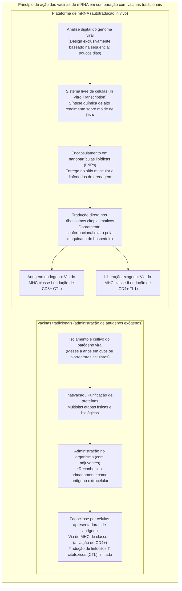
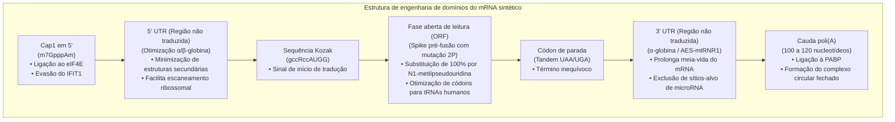
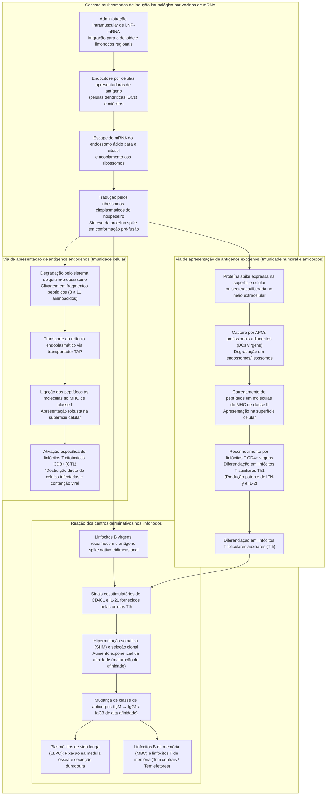
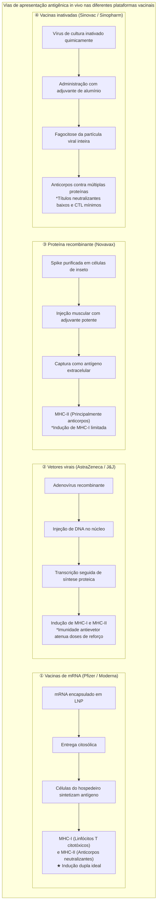

## Introdução: A revolução do mRNA —— Como uma «molécula frágil» abriu caminho para o desenvolvimento vacinal mais veloz da história humana

Em janeiro de 2020, foi publicada na internet a sequência genômica completa (aproximadamente 30.000 nucleotídeos) do SARS-CoV-2, o patógeno causador de um surto de infecção respiratória até então desconhecido em Wuhan, na China. Apenas 42 dias depois, a empresa de biotecnologia norte-americana Moderna despachava o primeiro lote clínico de sua candidata vacinal «mRNA-1273» para os Institutos Nacionais de Saúde (NIH). Concomitantemente, a parceria entre a alemã BioNTech e a norte-americana Pfizer, com a vacina «BNT162b2», concluiu os ensaios clínicos de fase III em larga escala e obteve a Autorização de Uso Emergencial (EUA) em meros 11 meses — uma celeridade sem paralelos em toda a história da medicina.

O desenvolvimento tradicional de vacinas — envolvendo o cultivo do vírus em ovos embrionados de galinha ou em gigantescos biorreatores celulares para a produção de vacinas de vírus atenuado, vírus inativado ou subunidades proteicas recombinantes — exigia rotineiramente entre **10 e 15 anos** de pesquisa e custos financeiros astronômicos. Esse compasso moroso constituía o dogma inquestionável da indústria farmacêutica.

A tecnologia de mRNA demoliu esses paradigmas. Sua essência reside na redefinição do conceito de vacina: ela deixa de ser um «produto industrial manufaturado pela cultura e purificação externa de proteínas antigênicas» para se tornar uma **«plataforma biotecnológica de software que transfere temporariamente a planta de montagem do antígeno (o código genético digital) para as células do hospedeiro, convertendo o próprio organismo em uma fábrica celular endógena de antígenos»**.



### O caráter transitório do mRNA no Dogma Central e a «impossibilidade de alteração genômica»

Diante das preocupações infundadas de que «as vacinas de mRNA poderiam alterar ou se integrar ao genoma humano (DNA)», o princípio fundante da biologia molecular — o **Dogma Central** — oferece uma resposta científica categórica.

Nas células eucarióticas, a informação genética transita em um fluxo estritamente unidirecional e irreversível: **DNA (núcleo celular) → Transcrição → mRNA (exportação para o citosol) → Tradução → Proteína (citoplasma)**. O mRNA sintético exógeno administrado entra no citoplasma e é diretamente capturado pelos ribossomos livres, sintetizando a proteína spike sem jamais se aproximar do envoltório nuclear.
1. **Ausência de sinal de localização nuclear (NLS)**: O mRNA terapêutico não possui sequências-guia para transpor os poros da membrana nuclear, permanecendo retido exclusivamente no citoplasma.
2. **Ausência de transcriptase reversa e integrase**: Para converter RNA em DNA e inseri-lo no genoma, seriam necessárias enzimas retrovirais especializadas (transcriptase reversa e integrase), que só existem em vírus como o HIV e estão totalmente ausentes em células humanas somáticas saudáveis (estudos laboratoriais forçados in vitro com o retrotransposon endógeno LINE-1 não demonstraram nenhuma evidência de integração in vivo sob condições fisiológicas).
3. **Degradação enzimática veloz no organismo**: O mRNA é biologicamente programado para ser efêmero; em questão de horas ou poucos dias, ele é clivado integralmente em nucleotídeos comuns pelas ribonucleases (RNases) citoplasmáticas e metabolizado pelas vias celulares rotineiras.

Dessa forma, a vacina de mRNA atua como uma **«mensagem temporária autodestrutiva com contagem regressiva após a produção proteica»**, sendo biologicamente impossível qualquer modificação permanente no DNA do hospedeiro.

---

## Capítulo 1: Quarenta anos de persistência e descobertas fundamentais —— Os cientistas que transformaram o mRNA em medicamento

A rápida disponibilização das vacinas em 2020 não foi fruto de um improviso afortunado. Foi o resultado de mais de quatro décadas de pesquisa básica persistente por pesquisadores que resistiram ao ceticismo acadêmico e ao corte crônico de investimentos. A outorga do Prêmio Nobel de Fisiologia ou Medicina de 2023 à Dra. **Katalin Karikó** e ao Dr. **Drew Weissman** consagrou essa formidável jornada da ciência fundamental.

### 1.1 O labirinto dos estudos pioneiros: instabilidade extrema e tempestades imunes letais

Desde a identificação do mRNA em 1961 por François Jacob, Sydney Brenner e colaboradores, os biólogos sonhavam com a possibilidade de introduzir mRNA no organismo para induzir a produção direcionada de qualquer proteína terapêutica.

Contudo, os primeiros experimentos realizados nas décadas de 1980 e 1990 depararam-se com dois obstáculos monumentais:
- **Instabilidade físico-química radical**: Os tecidos vivos, o ar e a pele humana contêm concentrações massivas de **ribonucleases (RNases)**, enzimas evolutivas destinadas a destruir vírus de RNA. O mRNA nu (*naked RNA*) injetado era hidrolisado em milissegundos antes mesmo de se aproximar da membrana celular.
- **Ativação destrutiva da imunidade inata**: Quando quantidades apreciáveis de mRNA sintético eram introduzidas em animais, o sistema imunológico o reconhecia como uma invasão viral hostil, desencadeando uma tempestade inflamatória avassaladora de citocinas. Os animais entravam em choque anafilactoide com alta taxa de mortalidade, levando a comunidade científica a rotular o mRNA como uma «molécula inviável e tóxica demais para a medicina».

Mesmo sofrendo rebaixamentos acadêmicos na Universidade da Pensilvânia e tendo pedidos de financiamento sucessivamente negados, a bioquímica húngara Katalin Karikó manteve sua convicção inabalável no potencial transformador do RNA.

### 1.2 A descoberta histórica de Karikó e Weissman (2005): a evasão dos receptores TLR via modificação de uridinas

Em 1997, Karikó conheceu o imunologista Drew Weissman, que investigava o desenvolvimento de vacinas contra o HIV com foco na capacidade de apresentação de antígenos das células dendríticas (DCs). Ambos iniciaram uma parceria científica para desvendar a interação entre o mRNA e as células do sistema imune.

A pergunta central era: **«Por que o RNA de transferência (tRNA) e o RNA ribossômico (rRNA) do próprio mamífero não provocam inflamação, enquanto o mRNA produzido por transcrição in vitro (IVT) estimula agressivamente as células dendríticas?»**.

As células dos mamíferos contam com sensores de ácidos nucleicos exógenos denominados **receptores do tipo Toll (Toll-like Receptors: TLRs)**:
- **TLR3**: Detecta RNA de fita dupla (dsRNA).
- **TLR7 / TLR8**: Reconhecem sequências ricas em uridina (U) em RNA de fita simples (ssRNA).
- **RIG-I / MDA5**: Detectam no citosol RNAs portadores de trifosfato na extremidade 5' ou longas fitas duplas, induzindo a transcrição de interferons do tipo I (IFN-α/β).

Karikó e Weissman atentaram para as **bases químicas modificadas** amplamente presentes no RNA eucariótico celular. O tRNA e o rRNA naturais passam por diversas metilações e isomerizações pós-transcricionais. Em contraste, o mRNA sintetizado por IVT tradicional continha apenas as quatro bases normais não modificadas (A, C, G, U).

Em 2005, a dupla publicou um marco na história da bioquímica: **ao substituir a uridina (Uracila) por seu isômero natural, a pseudouridina (Ψ: pseudouridine), na síntese do mRNA, o reconhecimento pelos receptores TLR7, TLR8 e sensores citoplasmáticos despencou, eliminando por completo a reação inflamatória letal.**

### 1.3 Da pseudouridina à «N1-metilpseudouridina (m1Ψ)»

O achado de Karikó e Weissman revelou outra surpresa decisiva: o mRNA modificado não apenas silenciava a inflamação indesejada, mas sua taxa de tradução proteica nos ribossomos aumentava exponencialmente.

Em condições normais, a entrada de mRNA contendo uridina não modificada ativa a **proteína quinase R (PKR)** e a **2'-5'-oligoadenilato sintetase (OAS)**. A PKR fosforila o fator de iniciação **eIF2α**, paralisando toda a tradução de proteínas na célula, enquanto a OAS aciona a **RNase L** para degradar indiscriminadamente o RNA celular.

A presença de pseudouridina impede o disparo dessas enzimas de defesa, permitindo que os ribossomos leiam o mRNA de forma fluida, contínua e prolongada.

Na década de 2010, pesquisas promovidas pela BioNTech e Moderna levaram ao desenvolvimento da **«N1-metilpseudouridina (m1Ψ: N1-methylpseudouridine)»**, portadora de um grupo metila no nitrogênio N1 do anel de pseudouridina.
- A m1Ψ atenua o enrijecimento das estruturas secundárias sem prejudicar o pareamento códon-anticódon no centro de decodificação ribossômico.
- Reduz a afinidade com os TLRs a níveis basais e, ao substituir 100% das uridinas, maximiza o rendimento de síntese proteica in vivo.
Essa **substituição integral (100%) por N1-metilpseudouridina** foi adotada como padrão ouro na formulação da BNT162b2 (Pfizer/BioNTech) e da mRNA-1273 (Moderna).

### 1.4 A consagração da estabilização da proteína spike: a «mutação 2P» de Barney Graham e Jason McLellan

Somando-se à engenharia de nucleosídeos e aos carreadores lipídicos, o terceiro pilar do sucesso vacinal foi a fixação da conformação tridimensional da proteína spike por meio da **«mutação 2P» (substituição por duas prolinas)**.

A **glicoproteína da espícula (Spike / S)** do SARS-CoV-2 projeta-se na superfície viral e conecta-se ao receptor ACE2 humano para mediar a infecção. Ela constitui uma estrutura molecular dinâmica e instável que alterna entre duas geometrias distintas:
- **Conformação pré-fusão (Prefusion Conformation)**: A estrutura tridimensional original do trímero antes da fusão com a célula hospedeira. Nela, o domínio de ligação ao receptor (RBD) encontra-se exposto de maneira ideal para o reconhecimento por **anticorpos neutralizantes altamente potentes**.
- **Conformação pós-fusão (Postfusion Conformation)**: A estrutura colapsada e alongada assumida após a fusão de membranas. Os anticorpos induzidos contra esse estado apresentam eficácia neutralizante muito baixa.

O Dr. **Barney Graham** (VRC do NIAID) e o Dr. **Jason McLellan** (Universidade do Texas em Austin) descobriram, através de estudos estruturais de crio-microscopia eletrônica com os vírus MERS-CoV e SARS-CoV-1, que a troca de dois resíduos de aminoácidos na região de articulação da hélice central (posições 986 e 987, lisina e valina) por **duas prolinas consecutivas (K986P e V987P)** impede fisicamente a distorção da molécula, **congelando-a de forma permanente na conformação de pré-fusão**.

Assim que a sequência do SARS-CoV-2 foi revelada em janeiro de 2020, os cientistas inseriram a mutação 2P no desenho do mRNA. Isso assegurou que as células vacinadas expressassem a spike com a exata arquitetura conformacional necessária para gerar os anticorpos neutralizantes mais efetivos.

---

## Capítulo 2: Arquitetura de precisão da molécula de mRNA —— Engenharia de desenho do mRNA sintético

O mRNA terapêutico é muito mais do que uma transcrição passiva de genes virais. Trata-se de um **biopolímero sintético de engenharia molecular (Engineered Biopolymer)**, concebido para maximizar a compatibilidade ribossômica e governar com precisão cirúrgica sua cinética de degradação.



### 2.1 A estrutura do cap 5' (De Cap0 a Cap1): Autorreconhecimento celular e início da tradução

Na terminação 5' do mRNA celular reside o clássico **casquete de 7-metilguanosina (m7G Cap)**. Na terapêutica com mRNA, a pureza química e o padrão de metilação dessa terminação são capitais:
- **Estrutura Cap0 (m7GpppN)**: Casquete básico que é detectado no citoplasma pelo sensor antiviral **IFIT1 (Interferon-induced protein with tetratricopeptide repeats 1)** como RNA exógeno, provocando a interrupção da tradução.
- **Estrutura Cap1 (m7GpppNm)**: Apresenta uma metilação na posição 2'-O da ribose do primeiro nucleotídeo (2'-O-metilação). Essa é a marcação fisiológica do mRNA maduro de mamíferos, que elude a detecção pelo IFIT1.

As vacinas aprovadas utilizam reagentes cotranscricionais de alta especificidade (como CleanCap®), obtendo uma **pureza de estrutura Cap1 superior a 95%**. Esse arranjo recruta com alta afinidade o complexo **eIF4F (eIF4E, eIF4G, eIF4A)**, conduzindo à montagem imediata da subunidade ribossômica 40S.

### 2.2 Otimização das regiões não traduzidas 5' e 3' (UTR)

As porções laterais não codificantes, a **5' UTR** e a **3' UTR**, governam a estabilidade estrutural do mRNA e a cadência de trânsito dos ribossomos.
- **Desenho da 5' UTR**: Dobramentos secundários acentuados (alças em grampo ou quartetos de guanina G-quadruplex) atuam como obstáculos mecânicos ao ribossomo. Por isso, são selecionadas sequências com baixa energia de pareamento, derivadas de genes humanos com altíssima taxa de expressão, como as **α-globina e β-globina**.
- **Desenho da 3' UTR**: Para retardar a desadenilação e prevenir o silenciamento gênico por microRNAs (miRNAs) teciduais, a sequência da 3' UTR é refinada para não conter sítios de ancoragem de miRNAs endógenos (empregando-se híbridos de α-globina murina e fragmentos do rRNA mitocondrial mtRNR1 com sequências intensificadoras AES).

### 2.3 Fase aberta de leitura (ORF) e otimização de códons

A região codificadora da proteína spike passa por uma intensa **otimização de códons (Codon Optimization)** bioinformática.

Como o código genético é degenerado, múltiplos códons sinônimos determinam o mesmo aminoácido. A distribuição de códons no vírus original difere substancialmente do perfil ideal das células humanas:
1. **Harmonização com o repertório de tRNAs humanos**: A substituição de códons raros por códons correspondentes aos tRNAs mais abundantes nas células humanas elimina pausas no ribossomo e acelera a taxa de elongação da cadeia polipeptídica.
2. **Elevação do conteúdo de GC**: O aumento estratégico dos pares guanina-citosina confere maior estabilidade termodinâmica à fita e remove pontos crípticos de clivagem ou sinais precoces de poliadenilação.
3. **Erradicação de resíduos de fita dupla (dsRNA)**: A transcrição in vitro com RNA polimerase T7 pode gerar traços residuais de dsRNA altamente inflamatórios. O redesenho de sequência aliado à purificação por HPLC elimina essas impurezas de maneira rigorosa.

### 2.4 A cauda poli(A) (Poly-A Tail) e o «modelo de alça fechada»

A sucessão linear de adeninas na terminação 3' atua como o marcador cronológico da vida útil da molécula.
- No citoplasma, a cauda poli(A) é ocupada pela **proteína de ligação a poli(A) (PABP)**.
- A interação física entre a PABP na extremidade 3' e o fator eIF4G ancorado ao cap 5' força o mRNA a adotar uma configuração circular, o **«modelo de alça fechada (Closed-Loop Model)»**.
- Essa conformação em anel preserva as terminações contra o ataque de exonucleases e faz com que os ribossomos que concluem a leitura no códon de parada sejam imediatamente reinseridos no início da fita. Um único transcrito de mRNA pode assim produzir milhares de proteínas spike em série. O comprimento da cauda poli(A) nas vacinas é estritamente fixado entre 100 e 120 bases.

---

## Capítulo 3: Vetores de transposição das barreiras biológicas —— Engenharia de nanopartículas lipídicas (LNPs)

Por mais impecável que seja o desenho do mRNA, ele seria completamente inerte no organismo sem um sistema que o entregue íntegro no citosol celular. O avanço biotecnológico fundamental que viabilizou o uso do mRNA na medicina foi o desenvolvimento das **nanopartículas lipídicas (Lipid Nanoparticles: LNPs)**, vesículas de 80 a 100 nanômetros de diâmetro.

### 3.1 Por que o mRNA nu (Naked RNA) não pode ser administrado diretamente

A injeção de mRNA desprotegido no tecido muscular produz quase zero imunização, bloqueada por duas barreiras intransponíveis:
1. **Repulsão eletrostática de cargas negativas**: O arcabouço de fosfodiéster do mRNA possui forte densidade de carga negativa. A membrana celular humana, repleta de cabeças polares fosfolipídicas e glicocálix, também é eletronegativa, repelindo vigorosamente o ácido nucleico por forças coulombianas.
2. **Degradação imediata por RNases teciduais**: Os fluidos orgânicos contêm RNases ativas capazes de destruir o mRNA livre em escassos minutos.

Fazia-se indispensável um «cavalo de Troia nanométrico» que mascarasse a carga do mRNA, superasse a membrana celular e o libertasse intacto no citosol.

### 3.2 O papel e a estrutura química dos «quatro lipídios fundamentais» das LNPs

As nanopartículas lipídicas das vacinas da Pfizer/BioNTech e da Moderna são montadas a partir de proporções molares minuciosamente calculadas de **quatro tipos de lipídios**:

```
【Os 4 lipídios componentes das LNPs】
1. Lipídio catiônico ionizável (Ionizable Cationic Lipid) 〜 46-50 mol%
2. Fosfolipídio auxiliar (Helper Lipid: DSPC) 〜 10 mol%
3. Colesterol (Cholesterol) 〜 38-43 mol%
4. Lipídio PEGuilado (PEGylated Lipid) 〜 1,5-1,7 mol%
```

| Componente lipídico | Molécula utilizada (Pfizer / Moderna) | Proporção (mol%) | Características físico-químicas | Função fisiológica essencial in vivo |
| :--- | :--- | :--- | :--- | :--- |
| **Lipídio ionizável<br/>(Ionizable Lipid)** | **ALC-0315** (Pfizer)<br/>**SM-102** (Moderna) | **~ 46 a 50%** | pKa aparente de **6,0 a 6,8**. Catiônico em meio ácido, neutro em pH fisiológico. Contém aminas terciárias e ligações éster biodegradáveis. | ① Em pH ácido, liga-se eletrostaticamente ao mRNA aniônico, condensando-o no núcleo da partícula.<br/>② No pH fisiológico do sangue (7,4), neutraliza sua carga, prevenindo citotoxicidade e hemólise.<br/>③ No endossomo ácido, protona-se novamente, rompendo a membrana vesicular para liberar o mRNA. |
| **Fosfolipídio auxiliar<br/>(Helper Lipid)** | **DSPC**<br/>(1,2-diestearoil-sn-glicero-3-fosfocolina) | **~ 10%** | Fosfolipídio saturado com alta temperatura de transição de fase (~55 °C). Formato cilíndrico. | Forma uma bicamada lamelar estável na casca da LNP, assegurando rigidez mecânica e estabilidade morfológica à nanopartícula. |
| **Colesterol<br/>(Cholesterol)** | Colesterol vegetal purificado | **~ 38 a 43%** | Núcleo esteroide rígido com pequeno grupo hidroxila. Agente de empacotamento de membrana. | Preenche os espaços vazios entre fosfolipídios, modulando fluidez e transição de fase. Facilita a fusão com membranas celulares e impede vazamentos. |
| **Lipídio PEGuilado<br/>(PEGylated Lipid)** | **ALC-0159** (Pfizer)<br/>**PEG2000-DMG** (Moderna) | **~ 1,5 a 1,7%** | Cadeia hidrofílica de polietilenoglicol ligada a uma âncora lipídica (dimiristilglicerol). | ① Impede a agregação das partículas durante fabricação e estocagem, mantendo o tamanho (~80 nm).<br/>② Bloqueia a opsonização inespecífica por proteínas do soro, aumentando a meia-vida.<br/>③ Destaca-se gradativamente in vivo para permitir a captação celular. |

### 3.3 A endocitose e a proeza do escape endossômico (Endosomal Escape)

Após a aplicação intramuscular, o fator limitante para o êxito da tradução reside no **escape endossômico (Endosomal Escape)** para o citosol:

1. **Adsorção de apolipoproteínas e endocitose**:
   Em contato com os fluidos intersticiais, as LNPs absorvem em sua superfície a **apolipoproteína E (ApoE)** do hospedeiro. Isso propicia seu reconhecimento pelos **receptores de lipoproteínas de baixa densidade (LDLR)** em células dendríticas, macrófagos e miócitos, promovendo a internalização vesicular por endocitose.
2. **Acidificação do endossomo**:
   Ao longo da transição de endossomo inicial para endossomo tardio, bombas protônicas V-ATPase injetam íons $H^+$, reduzindo o pH interno de 7,4 para menos de 5,5.
3. **Inversão de carga e efeito esponja de prótons**:
   Ao ficarem abaixo de seu pKa (6,0-6,8), os lipídios ionizáveis capturam prótons em abundância, convertendo-se de espécies neutras em **estruturas fortemente policatiônicas**.
4. **Fusão de membrana e liberação citoplasmática**:
   Os lipídios agora catiônicos interagem fortemente com os lipídios aniônicos da membrana endossômica interna (como fosfatidilserina), induzindo a formação de estruturas não lamelares conhecidas como **fase hexagonal invertida ($H_{II}$)**. Essa alteração gera microporos na membrana que, somados ao estresse osmótico, permitem que o **mRNA intacto escape para o citosol**, ficando imediatamente disponível para os ribossomos.

Estudos nanobiológicos demonstram que apenas **2% a 15%** do mRNA internalizado consegue escapar dos endossomos. Contudo, em virtude da alta eficiência catalítica dos ribossomos ao traduzir sequências otimizadas, essa fração modesta é suficiente para disparar uma produção proteica massiva e ativar plenamente o sistema imune.

### 3.4 Tecnologia de formulação microfluídica (Microfluidic Formulation)

A fabricação em larga escala de nanopartículas com tamanho monodisperso foi viabilizada pelo avanço da **microfluídica (Microfluidics)**.

Métodos antigos de homogeneização mecânica resultavam em suspensões heterogêneas e baixo aprisionamento de material genético. Nas linhas modernas de produção, canais micrométricos fazem colidir uma **solução lipídica em etanol** (os quatro lipídios dissolvidos) e uma **solução aquosa ácida de mRNA** (em tampão citrato) a velocidades de vários metros por segundo.

O encontro instantâneo dilui o etanol de modo fulminante, provocando a precipitação e a auto-organização espontânea dos lipídios. Os lipídios ionizáveis condensam-se com o mRNA formando o miolo da partícula, envolto por DSPC, colesterol e lipídio PEGuilado. O processo gera continuamente, em milissegundos, LNPs uniformes de 80 a 100 nm, com **taxas de encapsulamento superiores a 90%** e índice de polidispersão extremamente baixo (PDI < 0,1).

---

## Capítulo 4: A cascata imunológica multicamadas —— Da tradução citoplasmática ao estabelecimento da imunidade sistêmica

A primazia imunológica das vacinas de mRNA frente às vacinas convencionais reside na **apresentação antigênica dual simultânea (ativação conjugada das vias do MHC classe I e classe II)**.



### 4.1 Captação no músculo e trânsito para linfonodos axilares

Injetadas no músculo deltoide, as nanopartículas drenam progressivamente pelos vasos linfáticos até alcançarem os linfonodos regionais de drenagem.
- Embora as células musculares esqueléticas locais captem mRNA e passem a expressar a spike na sua membrana celular, as grandes regentes da imunogênese adaptativa são as **células apresentadoras de antígeno profissionais (APCs)**: as células dendríticas (DCs) e os macrófagos residentes nos linfonodos.
- No interior dessas células imunológicas, a proteína spike é processada com todas as modificações pós-traducionais autênticas do hospedeiro humano (glicosilação e pontes dissulfeto), expondo trímeros nativos tridimensionais idênticos aos do vírus selvagem.

### 4.2 A via do MHC de classe I e a indução contundente de linfócitos T citotóxicos (CD8+ CTL)

As vacinas proteicas recombinantes clássicas introduzem os antígenos a partir do meio extracelular. Por essa razão, ativam prioritariamente a via do MHC-II e possuem enorme dificuldade em gerar **linfócitos T citotóxicos (CD8+ CTL)**, cuja função primordial é eliminar células já infectadas.

O mRNA suprime essa limitação biológica, pois o antígeno é **sintetizado diretamente no interior do citoplasma**:
1. **Degradação proteassômica**: Parte das proteínas spike recém-produzidas é ubiquitinada e processada pelo complexo do **proteassomo** em pequenos fragmentos de 8 a 11 aminoácidos.
2. **Translocação por TAP**: Os peptídeos são conduzidos ao retículo endoplasmático pelo transportador associado ao processamento de antígenos (**TAP**).
3. **Carregamento no MHC de classe I**: Esses peptídeos acomodam-se na fenda de ligação das moléculas do **MHC de classe I (HLA-A, B, C)** e migram via complexo de Golgi até a superfície da membrana plasmática.
4. **Sensibilização de linfócitos T citotóxicos**: Linfócitos T CD8+ virgens reconhecem esses complexos através de seu receptor TCR. Em combinação com sinais coestimuladores (CD80/CD86 associados a CD28), eles proliferam vigorosamente e diferenciam-se em **linfócitos T citotóxicos efetores (CTL)**.

Essa potente resposta de linfócitos T CD8+ constituiu a muralha biológica fundamental que conteve hospitalizações e mortes quando o vírus acumulou mutações de escape contra anticorpos neutralizantes.

### 4.3 A via do MHC de classe II e o direcionamento para linfócitos Th1

Concomitantemente, porções da proteína spike são exteriorizadas por exocitose ou dispersas após apoptose celular:
- Células dendríticas virgens vizinhas capturam esses fragmentos proteicos por endocitose e os clivam no interior de lisossomos ácidos em peptídeos de 13 a 18 aminoácidos.
- Os fragmentos são acoplados às moléculas do **MHC de classe II (HLA-DR, DQ, DP)** e exibidos aos linfócitos T CD4+ virgens.
- A estimulação inata moderada provocada pelas próprias LNPs polariza essas células rumo ao perfil **Th1 (linfócitos T auxiliares tipo 1)**, produtores de IFN-γ e IL-2. Essa polarização Th1 pura foi o fator determinante que extinguiu o risco de respostas Th2 alérgicas e eosinofílicas adversas.

### 4.4 Formação notável dos centros germinativos (Germinal Centers) e maturação de afinidade de células B

O ápice da resposta imune suscitada pelo mRNA é a ativação prolongada e estruturada dos **centros germinativos (Germinal Centers: GC)** nos linfonodos:
1. **Ligação ao antígeno nativo**: Linfócitos B virgens nos folículos linfoides ancoram-se diretamente às spikes triméricas não desnaturadas por meio do seu receptor de célula B (BCR).
2. **Auxílio das células T foliculares auxiliares (Tfh)**: Os linfócitos B migram para o centro germinativo e recebem sinais de sobrevivência e seleção (CD40L e IL-21) emitidos pelas células Tfh.
3. **Hipermutação somática (SHM) e seleção clonal**:
   - Na zona escura (Dark Zone), a enzima AID (*Activation-Induced Cytidine Deaminase*) introduz mutações pontuais em alta frequência nos genes das regiões variáveis dos anticorpos.
   - Na zona clara (Light Zone), os clones mutados competem para se ligar aos antígenos expostos pelas células dendríticas foliculares (FDCs).
   - Somente os linfócitos B cujas mutações amplificam dramaticamente a afinidade química pela spike recebem sinais de sobrevida das células Tfh; os clones de baixa afinidade sucumbem à apoptose.
4. **Mudança de classe e plasmócitos de vida longa (LLPC)**:
   - Os clones aprovados realizam recombinação para mudar de classe (*Class Switch*), evoluindo da IgM inicial para **anticorpos IgG de altíssima afinidade (especialmente IgG1 e IgG3)** com elevado poder neutralizante.
   - Os clones de melhor desempenho diferenciam-se em **plasmócitos de vida longa (LLPC: Long-Lived Plasma Cells)**, que se fixam na medula óssea produzindo continuamente anticorpos por meses.
   - Outra linhagem forma o contingente de **células B de memória (MBC)** distribuídas pelo baço e linfonodos.

Biópsias de linfonodos em humanos comprovaram que os centros germinativos originados pela vacina de mRNA **permaneceram ativamente funcionais por mais de seis meses após a vacinação**, uma persistência temporal extraordinária para imunizantes não replicativos.

---

## Capítulo 5: Evidências clínicas, dinâmica da eficácia e confronto com as variantes

### 5.1 Resultados dos ensaios clínicos de fase III: o impacto do desfecho de 95% de eficácia

No final de 2020, as publicações no *New England Journal of Medicine (NEJM)* dos ensaios de fase III da Pfizer/BioNTech (Polack et al.) e da Moderna (Baden et al.) surpreenderam o meio científico global:
- **BNT162b2 (Pfizer/BioNTech, 43.448 voluntários)**: Registrou-se 162 casos sintomáticos de COVID-19 no grupo placebo contra somente 8 casos no grupo vacinado, conferindo uma **eficácia vacinal de 95,0% (IC 95%: 90,3–97,6%)**. Nos quadros graves, ocorreram 9 casos sob placebo e apenas 1 entre os imunizados.
- **mRNA-1273 (Moderna, 30.420 voluntários)**: Observou-se 185 infecções sintomáticas no grupo placebo (30 casos graves e 1 óbito) contra 11 infecções no grupo vacinado (0 caso grave), confirmando uma **eficácia protetora de 94,1% (IC 95%: 89,3–96,8%)** e 100% de prevenção contra formas graves e óbitos.

Considerando que a OMS e a FDA estipulavam um patamar mínimo de 50% para aprovação emergencial e que os imunizantes contra a gripe comumente oscilam entre 40% e 60%, atingir 95% de eficácia representou uma façanha científica histórica.

### 5.2 Interpretação bioestatística: Redução do Risco Relativo (RRR) vs. Redução do Risco Absoluto (ARR)

Surgiram questionamentos públicos afirmando que «o índice de 95% representava apenas uma redução de risco relativo (RRR), ao passo que a redução do risco absoluto (ARR) situava-se abaixo de 1%, o que supostamente indicaria ineficácia».

Faz-se mister elucidar os conceitos matemáticos:
- **RRR (Redução do Risco Relativo)**: Coteja a taxa de adoecimento no grupo controle ($I_p$) com a do grupo vacinado ($I_v$).
  $$RRR = \frac{I_p - I_v}{I_p} \times 100\% = \frac{0,0088 - 0,0004}{0,0088} \approx 95\%$$
  Esse índice traduz com precisão a **potência biológica e imunológica intrínseca** da vacina para neutralizar a infecção diante da exposição.
- **ARR (Redução do Risco Absoluto)**: Expressa a diferença aritmética bruta de incidência na coorte ao longo do recorte temporal do ensaio.
  $$ARR = I_p - I_v \approx 0,88\% - 0,04\% = 0,84\%$$
- **Realidade epidemiológica**:
  A ARR está intrinsecamente amarrada à **incidência de base da infecção na sociedade** durante o estudo. Se uma vacina 100% perfeita for testada em um local sem circulação viral, a ARR será forçosamente inferior a 1%. Havendo uma onda epidêmica em que 20% da população seja exposta, a ARR sobe imediatamente para $20\% \times 95\% = 19\%$. Rejeitar a eficácia vacinal alegando uma baixa ARR inicial é um equívoco conceitual que confunde eficácia biológica com prevalência instantânea de contágio.

### 5.3 Dados de vida real (Real-World Evidence, RWE): a confirmação em escala populacional

A expansão da vacinação para centenas de milhões de cidadãos de perfis heterogêneos em países pioneiros como **Israel (coorte de 1,2 milhão pareados da Clalit Health Services, Dagan et al., NEJM 2021)**, Reino Unido (UKHSA) e Estados Unidos (CDC) demonstrou três postulados fundamentais:
1. **Contenção absoluta das linhagens inaugurais**: Diante da cepa de Wuhan e da variante Alfa, a efetividade real excedeu 90% contra infecção sintomática e 95% contra hospitalização e óbito.
2. **Queda gradual da proteção contra contágio leve**: Transcorridos de 4 a 6 meses da segunda dose, a meia-vida natural dos anticorpos séricos levou a uma redução da proteção contra formas leves para a faixa de 60-70%.
3. **Preservação sólida da proteção contra desfechos severos**: A proteção contra internações, ventilação mecânica e mortes sustentou-se acima de 85-90% em longo prazo. Isso decorre da capacidade dos linfócitos B de memória de reativar a síntese de anticorpos e da ação incisiva dos **linfócitos T citotóxicos CD8+**, que barram a colonização viral pulmonar.

### 5.4 A evolução das variantes e a fuga imune: queda humoral vs. robustez celular T

A disseminação do vírus em escala planetária catalisou o surgimento de mutações pontuais que reduziram a ligação dos anticorpos neutralizantes.

| Linhagem de variante | Mutações preponderantes (RBD e spike) | Sensibilidade a anticorpos neutralizantes | Proteção contra infecção (2 doses) | Proteção contra forma grave (2 doses) | Efeito de doses de reforço (Booster) |
| :--- | :--- | :--- | :--- | :--- | :--- |
| **Cepa ancestral de Wuhan<br/>(Wuhan-Hu-1)** | Padrão basal (sem mutações) | **1,0x** (referência) | **~ 95%** | **> 95%** | Títulos de anticorpos elevados muito acima do patamar basal |
| **Variante Alfa<br/>(Alpha: B.1.1.7)** | N501Y, P681H | **Leve redução (1,5 a 2x)** | **~ 85 a 90%** | **~ 95%** | Proteção de altíssimo nível preservada em todos os desfechos |
| **Variante Delta<br/>(Delta: B.1.617.2)** | L452R, T478K, P681R | **Redução de 3 a 6x** | **~ 60 a 75%** (decaimento com o tempo) | **~ 90%** | O reforço recupera a prevenção sintomática para >85% |
| **Ômicron BA.1 / BA.2<br/>(Ômicron inicial)** | >15 mutações no RBD<br/>(K417N, E484A, N501Y etc.) | **Queda acentuada (20 a 40x)** | **~ 20 a 40%** (queda substancial com 2 doses) | **~ 70 a 80%** (sustentada pelos linfócitos T) | O reforço eleva a proteção sintomática para 65-75% e desfechos graves para >90% |
| **Ômicron BA.4 / BA.5<br/>e linhagens XBB / JN.1** | L452R, F486V/P, R346T<br/>Escape humoral extremo | **Perda expressiva de neutralização inicial** | **Quase nula contra contágio** | **~ 60 a 70%** (sustentada por imunidade celular) | Vacinas atualizadas bivalentes ou monovalentes (XBB.1.5/JN.1) recuperam anticorpos e elevam proteção severa a >80% |

O surgimento da linhagem Ômicron acentuou a separação entre a profilaxia do contágio leve e a prevenção do desfecho fatal. Portando mais de 30 mutações na spike, das quais 15 localizadas no RBD, a Ômicron conseguiu escapar de parte considerável dos anticorpos neutralizantes preexistentes.

No entanto, consolidou-se a **extraordinária resiliência da imunidade celular mediada por linfócitos T**:
- Os anticorpos dependem de sítios conformacionais estreitos na superfície do RBD; alterações discretas de conformação abalam sua união estérica.
- Por outro lado, os linfócitos T reconhecem **fragmentos peptídicos lineares** distribuídos pela totalidade dos 1.273 aminoácidos da spike.
- Dada a polimórfica diversidade alélica do complexo HLA na população humana, o vírus não possui viabilidade biológica para eludir simultaneamente todos os epítopos T.
- Consórcios de pesquisa internacionais demonstraram que **entre 80% e 90% dos epítopos reconhecidos por linfócitos T CD4+ e CD8+ permaneceram completamente intactos nas sublinhagens da Ômicron**. Foi essa estabilidade celular que preveniu o colapso dos sistemas de terapia intensiva nos países amplamente imunizados durante as ondas da Ômicron.

### 5.5 Doses de reforço (Boosters) e vacinas atualizadas

Diante da evolução do vírus, a tecnologia de mRNA demonstrou sua característica mais proeminente: a **agilidade modular**:
1. **Reforço homólogo (3.ª dose)**: Uma dose adicional com a fórmula ancestral restabeleceu os centros germinativos, deflagrando nova rodada de maturação de afinidade que sintetizou anticorpos com neutralização cruzada contra a Ômicron.
2. **Vacinas bivalentes**: Formulações equilibradas (1:1) contendo mRNA da cepa original associado ao de sublinhagens da Ômicron (BA.1 ou BA.4/BA.5) ampliaram a diversidade protetora.
3. **Vacinas monovalentes atualizadas (XBB.1.5, JN.1)**: Para contornar os efeitos de *imprinting* imune (pecado original antigênico), os imunizantes subsequentes abandonaram a sequência original, codificando apenas a linhagem então circulante. A facilidade de alterar apenas o arquivo digital de DNA permitiu a produção industrial de novas formulações em meros dois meses.

---

## Capítulo 6: Perfil de segurança, fisiopatologia de eventos adversos e correlação risco-benefício

Como toda tecnologia farmacológica empregada em escala massiva, as vacinas de mRNA acarretam um espectro de eventos adversos conhecidos, os quais devem ser confrontados de forma transparente com seus benefícios epidemiológicos.

### 6.1 Reatogenicidade local e sistêmica: o tributo fisiológico do disparo imunitário

Sintomas locais frequentes (dor, rubor e edema no sítio de injeção) e manifestações sistêmicas (febre ≥38 °C, astenia, cefaleia, mialgia e calafrios) não decorrem de toxicidade tecidual, mas sim do **desencadeamento fisiológico das cascatas imunes inatas**:
- Os constituintes das LNPs e os primeiros antígenos formados levam macrófagos e células dendríticas locais a secretar transitoriamente citocinas como **IL-1β, IL-6, TNF-α e interferons do tipo I**.
- Essas substâncias atingem a circulação e estimulam o centro termorregulador no hipotálamo, gerando febre reflexa e sensação de prostração muscular.
- Esse quadro regride espontaneamente em 24 a 48 horas, sendo prontamente aliviado por analgésicos e antipiréticos usuais, como paracetamol ou ibuprofeno.

### 6.2 Miocardite e pericardite: perfil epidemiológico e mecanismos fisiopatológicos

Os sistemas globais de vigilância pós-comercialização (VAERS e VSD nos EUA, dados do Ministério da Saúde de Israel e comitês europeus) detectaram um sinal de risco raro de **miocardite e pericardite**, com marcada concentração em **homens jovens e adolescentes (12 a 29 anos)**, predominantemente nos 2 a 4 dias seguintes à segunda dose.

#### ① Incidência populacional
- A incidência agregada é residual: **1 a 5 episódios para cada 100.000 doses administradas**.
- No grupo de maior incidência (**rapazes de 16 a 19 anos após a segunda dose**), a frequência situa-se em torno de **10 a 15 casos a cada 100.000 aplicações (0,01%)**.
- Foi constatada incidência ligeiramente maior com a vacina da Moderna (100 µg de mRNA) em relação à da Pfizer (30 µg), o que motivou diversos países a priorizarem a formulação da Pfizer para indivíduos masculinos abaixo de 30 anos.

#### ② Mecanismos fisiopatológicos postulados
A literatura científica aponta para uma convergência de hipóteses:
1. **Spike livre circulante e imunocomplexos**: Pesquisas conduzidas por Yonker et al. (*Circulation* 2023) detectaram proteína spike livre no plasma de jovens com miocardite pós-vacinal, a qual pode interagir com receptores endoteliais e cardíacos.
2. **Influência hormonal androgênica**: A testosterona estimula o perfil inflamatório Th1 e macrófagos teciduais, enquanto os estrogênios conferem proteção anti-inflamatória ao miocárdio.
3. **Mimetismo ou autoimunidade transitória**: Indução temporária de autoanticorpos contra proteínas do sarcômero cardíaco, como a α-miosina.

#### ③ Desfecho clínico e comparação com a infecção por SARS-CoV-2
Dois pontos são clinicamente inquestionáveis:
- **Mais de 90% dos casos de miocardite vacinal manifestam evolução clínica benigna**, com rápida remissão sintomática em poucos dias mediante repouso e anti-inflamatórios não esteroides (AINEs), sem declínio persistente da fração de ejeção cardíaca.
- **O risco de lesão cardíaca, miocardite, infarto e arritmias decorrente da infecção natural pelo SARS-CoV-2 é de 5 a 15 vezes superior ao risco vacinal**, inclusive em jovens do sexo masculino. Todas as agências internacionais (CDC, EMA, Anvisa) confirmaram que o balanço risco-benefício permanece amplamente favorável à vacinação, ao evitar sequelas orgânicas severas da fase aguda e da COVID longa.

### 6.3 Anafilaxia e hipersensibilidade ao polietilenoglicol (PEG)

A ocorrência de reações anafiláticas imediatas é da ordem de **2 a 5 casos por milhão de doses**, incidência discretamente maior que a da vacina da gripe (~1 por milhão), porém extraordinariamente rara.
- O componente desencadeante é o **PEG2000** na camada externa das LNPs, provocando desgranulação de mastócitos por meio de anticorpos prévios anti-PEG (IgE) ou ativação do sistema complemento (CARPA).
- Essa sensibilização prévia se deve ao uso generalizado de PEG em produtos dermatológicos, xampus e medicamentos laxantes.
- O acompanhamento presencial de 15 a 30 minutos pós-vacinação e a administração precoce de adrenalina intramuscular garantiram recuperação plena sem sequelas registradas.

### 6.4 Diferença mecanística em relação aos vetores adenovirais (TTS/VITT)

As vacinas de vetor adenoviral (AstraZeneca e Johnson & Johnson) foram correlacionadas a episódios graves de **síndrome de trombose com trombocitopenia (TTS / VITT)**, caracterizados por tromboses atípicas em seios venosos cerebrais associadas a queda de plaquetas em mulheres jovens.
- **Mecanismo da VITT**: Proteínas do capsídeo do adenovírus conectam-se ao fator plaquetário 4 (PF4), formando imunocomplexos que disparam autoanticorpos semelhantes aos da trombocitopenia induzida por heparina (HIT), ativando tromboses generalizadas.
- **Segurança diferencial do mRNA**: As formulações de mRNA utilizam nanopartículas lipídicas puramente sintéticas sem capsídeos virais e não apresentam reatividade cruzada com o PF4. Logo, **o risco de VITT/TTS é inexistente nas vacinas de mRNA**.

### 6.5 Avaliação sobre ADE (amplificação dependente de anticorpos) e VAED

O histórico do desenvolvimento de vacinas para dengue e de formulações inativadas contra o vírus sincicial respiratório (FI-RSV) nos anos 1960 foi marcado por fenômenos de **ADE** ou **VAED (Vaccine-Associated Enhanced Disease)**: anticorpos subneutralizantes facilitavam a internalização viral em macrófagos ou deflagravam pneumonias alérgicas do tipo Th2.

Com os imunizantes de mRNA contra a COVID-19, **nenhum quadro de ADE ou VAED foi identificado em bilhões de aplicações pelo mundo**. As explicações moleculares são:
1. **Alta afinidade conformacional da mutação 2P**: A spike estabilizada na forma pré-fusão direciona a resposta para anticorpos puramente neutralizantes.
2. **Polarização celular estrita para Th1**: O adjuvante intrínseco das LNPs estimula a diferenciação em células Th1 (produtoras de IFN-γ), anulando as cascatas Th2 que originavam os processos patológicos de VAED.

| Evento adverso | Incidência estimada | Início característico | Mecanismo fisiopatológico central | Evolução e conduta clínica |
| :--- | :--- | :--- | :--- | :--- |
| **Reação local** (dor, rubor, edema) | **70 a 85%** (muito comum) | Dia 0 ao Dia 2 | Citocinas inflamatórias locais (IL-1, TNF) e quimiotaxia de neutrófilos | Regressão em 1 a 3 dias. Compressas frias e analgésicos. |
| **Reatogenicidade sistêmica** (febre, astenia, cefaleia) | **50 a 70%** (frequente, maior na dose 2) | 12 a 24 h pós-aplicação | Disparo termorregulador hipotalâmico por IL-6 e interferons tipo I | Desaparecimento em 24 a 48 horas. Paracetamol ou AINEs. |
| **Miocardite / Pericardite** | **1 a 5 por 100.000** (10-15/100.000 em homens jovens) | 2 a 4 dias pós-dose 2 | Spike livre circulante, modulação por testosterona, autoimunidade efêmera | **Evolução benigna em >90%**. Resolução rápida com AINEs e repouso. |
| **Anafilaxia** | **2 a 5 por milhão** (muito rara) | Primeiros minutos a 30 min | Hipersensibilidade imediata a lipídios PEGuilados (IgE ou CARPA) | Aplicação precoce de adrenalina i.m.; reversão completa sem sequelas. |
| **Síndrome de Guillain-Barré** | **Equivalente à taxa basal da população** | Semanas subsequentes | Autoanticorpos antimielina (associado a vetores adenovirais, refutado para mRNA) | Imunoglobulina intravenosa (IVIg) ou plasmaférese. |

---

## Capítulo 7: Comparativo minucioso das plataformas biotecnológicas de imunização

A crise pandêmica configurou um cenário sem precedentes em que as principais tecnologias de vacinas foram avaliadas de modo simultâneo.



### 7.1 mRNA vs. Vetores virais (Plataformas baseadas em DNA)

As vacinas de vetor viral empregam um adenovírus geneticamente inativado para carregar o gene da spike (em DNA) até o núcleo da célula hospedeira:
- **Aspectos favoráveis**: O DNA possui estabilidade que viabiliza a estocagem em refrigeradores convencionais (2 °C a 8 °C).
- **Vulnerabilidade estrutural (imunidade antivetor)**: O organismo produz anticorpos não apenas contra a spike, mas contra a cápside proteica do adenovírus. Desse modo, aplicações subsequentes sofrem neutralização precoce pelo sistema imune, reduzindo a eficácia de reforços sucessivos. Além disso, houve a ocorrência de tromboses VITT.
- Por outro lado, as LNPs das vacinas de mRNA são partículas lipídicas sintéticas desprovidas de proteínas antigênicas: **doses de reforço podem ser repetidas sem perda de potência por bloqueio do carreador**.

### 7.2 mRNA vs. Vacinas de subunidades proteicas recombinantes

Exemplificadas pela Novavax (NVX-CoV2373), essas vacinas produzem a proteína spike em células de inseto, purificam-na e a administram junto a adjuvantes de saponina (Matrix-M™).
- **Aspectos favoráveis**: Fundamentam-se em uma rota industrial consagrada com excelente perfil de tolerabilidade.
- **Inconvenientes**: A produção de proteínas completas em culturas celulares e sua purificação demandam meses. Esse ciclo estendido retarda significativamente a resposta a novas variantes virais.

### 7.3 mRNA vs. Vacinas de vírus inativado

Desenvolvidas a partir do cultivo do patógeno em células Vero com inativação por β-propiolactona (como CoronaVac e Sinopharm).
- **Aspectos favoráveis**: Contêm todos os antígenos estruturais do vírion original.
- **Inconvenientes**: Induzem títulos moderados de anticorpos neutralizantes com rápida atenuação. Não estimulam expressivamente linfócitos T citotóxicos CD8+. A proteção contra variantes com escape caiu de modo acentuado, além de requerer plantas de contenção BSL-3 de alta complexidade.

### 7.4 Cadeia produtiva, logística e restrições termodinâmicas de ultracongelamento

A limitação operacional mais sensível do mRNA foi a necessidade da **cadeia de frio em temperaturas negativas extremas (-80 °C a -20 °C)**:
- **Razão físico-química**: Em meio aquoso, a ligação fosfodiéster do RNA é vulnerável à autoidrólise decorrente do ataque nucleofílico do grupo 2'-OH da ribose. Ademais, os lipídios das LNPs podem sofrer oxidação ou coalescência se mantidos em temperatura ambiente.
- Isso exigiu ultracongeladores a **-80 °C a -60 °C** (Pfizer) e freezers a **-20 °C** (Moderna).
- **Vantagem produtiva inigualável**: Por ser sintetizado em processo livre de células (*cell-free*), o mRNA dispensa reatores de fermentação microbiológica de grande volume. Em tanques reduzidos de laboratório, produzem-se centenas de milhões de doses em dias, conferindo uma escalabilidade fabril jamais vista.

| Parâmetro analítico | ① Vacinas de mRNA | ② Vetores virais | ③ Proteínas recombinantes | ④ Vacinas inativadas |
| :--- | :--- | :--- | :--- | :--- |
| **Exemplos clínicos** | **Pfizer (BNT162b2)<br/>Moderna (mRNA-1273)** | AstraZeneca (ChAdOx1)<br/>J&J (Ad26.COV2.S) | Novavax (NVX-CoV2373)<br/>Daiichi Sankyo (Daichirona) | Sinovac (CoronaVac)<br/>Sinopharm (BBIBP) |
| **Formato antigênico** | mRNA encapsulado em LNPs | DNA em adenovírus não replicativo | Nanopartículas proteicas purificadas | Vírions integrais inativados por formol |
| **Sítio de síntese** | **Citosol do hospedeiro (endógeno)** | Núcleo e citoplasma do hospedeiro | Biorreatores celulares (inseto/CHO) | Biorreatores celulares (Vero) |
| **Títulos neutralizantes** | **Extraordinariamente altos (topo)** | Moderados a altos | Altos | Baixos a moderados |
| **Indução de CD8+ CTL** | **Muito potente (via MHC-I)** | Potente | Muito restrita (apenas via cruzada) | Praticamente nula |
| **Tempo de adaptação** | **Mais rápido (semanas a 2 meses)** | Intermediário (2 a 4 meses) | Longo (6 meses a 1 ano) | Muito longo (>6 meses) |
| **Eventos adversos-chave** | Febre, dor local, rara miocardite | Febre, risco raro de TTS/VITT | Dor local, astenia leve | Reações locais muito suaves |
| **Cadeia de estocagem** | **-80 °C a -20 °C (congelado)** | 2 °C a 8 °C (refrigerado) | 2 °C a 8 °C (refrigerado) | 2 °C a 8 °C (refrigerado) |
| **Doses sucessivas** | **Excelente (sem anticorpos anticarreador)** | Prejudicada (imunidade antivetor) | Alta | Alta |

---

## Capítulo 8: As novas fronteiras do mRNA —— Da imunoterapia oncológica ao futuro da medicina individualizada

A validação do mRNA em escala global transcende os limites das infecções respiratórias: consolida-se como a **nova arquitetura tecnológica da medicina do século XXI**.

### 8.1 Vacinas de neoantígenos personalizadas contra o câncer (Personalized Cancer Vaccines)

Vale registrar que o propósito original que motivou a criação da BioNTech e da Moderna foi o **tratamento oncológico**.

As células malignas acumulam alterações genéticas somáticas que originam sequências de aminoácidos anômalas ausentes nos tecidos sadios: os chamados **neoantígenos (Neoantigens)**. Todavia, os tumores silenciam a resposta imune explorando receptores de ponto de checagem, como o PD-L1.
- **Etapas da imunoterapia personalizada de mRNA**:
  1. Sequenciamento de nova geração (NGS) do DNA e RNA da biópsia tumoral comparado com células saudáveis do indivíduo.
  2. Mapeamento computacional por algoritmos de inteligência artificial de 10 a 34 neoantígenos com maior poder de acoplamento aos alelos HLA do paciente e capacidade de estimular linfócitos T CD8+.
  3. Síntese ágil de uma fita de mRNA que agrupa esses alvos em série, encapsulada em LNPs.
  4. Inoculação no paciente para mobilizar um batalhão de linfócitos T citotóxicos voltados unicamente contra as células cancerígenas.
- **Sucesso clínico comprovado**:
  Em ensaio de fase IIb conduzido pela Moderna e Merck (MSD) em pacientes com melanoma de alto risco pós-cirurgia, a vacina personalizada de mRNA (mRNA-4157 / V940) associada ao pembrolizumab (Keytruda) **reduziu em 44% o risco de recorrência da doença ou óbito** em relação ao pembrolizumab isolado (*Lancet* 2024). Estudos clínicos de fase III encontram-se em pleno andamento para melanoma, câncer de pulmão não pequenas células e neoplasias pancreáticas.

### 8.2 Expansão integral em doenças infecciosas: vacinas polivalentes, VSR, HIV e malária

A modularidade da síntese facilita a coadministração de diferentes sequências em uma única vacina:
- **Vacinas associadas (Gripe + COVID-19)**: Formulação combinada pentavalente direcionada contra quatro linhagens de influenza (H1N1, H3N2 e duas cepas B) juntamente com a variante predominante do coronavírus.
- **Vacinas pan-coronavírus**: Focadas na haste S2 conservada da spike para proteção ampla contra potenciais variantes e coronavírus zoonóticos emergentes.
- **Patógenos complexos desafiadores**: Ensaios clínicos contra o **HIV-1** com trimeros complexos para estimular anticorpos amplamente neutralizantes (bNAbs), além de protótipos avançados contra a **malária** (*Plasmodium falciparum*) e a **tuberculose**.

### 8.3 Terapias de reposição proteica in vivo e patologias genéticas raras

O mRNA não se limita à expressão de antígenos externos: é capaz de **repor diretamente enzimas ou fatores metabólicos ausentes no próprio organismo**.
- **Acidemia metilmalônica (MMA) e acidemia propiônica (PA)**: Doenças metabólicas hereditárias graves associadas a déficits enzimáticos nas mitocôndrias hepáticas. A infusão intravenosa periódica de LNPs com mRNA codificador da enzima funcional (ex.: Moderna mRNA-3705) possibilita a restauração da função fisiológica dos hepatócitos.
- **Anticorpos codificados por mRNA (mRNA-encoded antibodies)**: Infusão de transcritos de mRNA para instruir as células hepáticas a secretarem diretamente no sangue anticorpos monoclonais terapêuticos de alto custo.

### 8.4 Terapia celular CAR-T in vivo: reprogramando linfócitos T no interior do próprio organismo

A terapia com **linfócitos T portadores de receptores quiméricos de antígeno (CAR-T)** transformou a onco-hematologia, mas depende de um processo artesanal: colheita das células do paciente, reprogramação genética ex vivo com vetores lentivirais em salas limpas por semanas e reinfusão a custos de centenas de milhares de dólares.

A vanguarda biotecnológica persegue a **geração de células CAR-T diretamente in vivo mediante uma simples injeção intravenosa**:
- LNPs vetorizadas (*Targeted LNPs: tLNPs*) conjugadas com anticorpos anti-CD4 ou anti-CD5 acoplam-se seletivamente aos linfócitos T no sangue.
- As nanopartículas entregam o mRNA que codifica o CAR antitumoral, desencadeando sua expressão temporária na membrana das células T do paciente.
- O grupo de Rurik et al. da Universidade da Pensilvânia (*Science* 2022) comprovou essa viabilidade em modelo murino de cardiomiopatia fibrótica: uma aplicação intravenosa de tLNP reprogramou linfócitos T in vivo para destruir miofibroblastos doentes, revertendo o quadro fibrótico. Por decorrer de expressão temporária de mRNA, descarta-se o risco de mutagênese insercional e malignização genômica definitiva.

### 8.5 Próximos desafios da bioengenharia de mRNA

1. **mRNA autoamplificável (saRNA / Vacinas de réplicon)**:
   Ao introduzir genes da RNA polimerase dependente de RNA (RdRp) de alfavírus, a molécula replica-se de modo autônomo no citoplasma. Com isso, é possível **reduzir a dose administrada em 10 a 100 vezes (apenas alguns microgramas)**, reduzindo custos e atenuando a reatogenicidade. O Japão pioneiramente aprovou essa tecnologia com a vacina Kostaive® (VLP Therapeutics).
2. **Liofilização e estabilização em temperatura ambiente**:
   Matrizes aprimoradas de liofilização contendo carboidratos protetores (trealose, sacarose) visam formular pós secos viáveis sob **temperatura ambiente (25 °C) ou refrigeração comum (2 °C a 8 °C)**, eliminando o entrave logístico das cadeias de frio ultracongeladas.
3. **Distribuição tecidual seletiva (Engenharia SORT)**:
   As LNPs convencionais migram massivamente para o fígado (>80%) via ApoE quando injetadas na veia. A metodologia SORT (*Selective Organ Targeting*) incorpora um quinto lipídio que ajusta a carga de superfície da nanopartícula, redirecionando o tropismo de forma específica para os **pulmões, o baço, a medula óssea, tumores ou o sistema nervoso central**.

---

## Capítulo 9: Considerações finais —— O triunfo da ciência fundamental e o amanhecer do novo século biomédico

### 9.1 O legado cumulativo de décadas de ciência despretensiosa e perseverante

O fato de a humanidade dispor de imunizantes formidáveis em poucos meses diante de uma das maiores pandemias modernas não resultou de nenhum ato mágico fortuito.

Foi o desfecho vitorioso de seis décadas de ciência perseverante: desde o isolamento do mRNA em 1961 até os estudos de biofísica sobre o autoarranjo lipídico, as investigações de imunologia inata em receptores TLR e a tenacidade de cientistas como Katalin Karikó e Drew Weissman, que persistiram quando poucos acreditavam na viabilidade da molécula.

Em uma sociedade habituada a exigir rentabilidade financeira imediata, a revolução do mRNA atesta com clareza: **a pesquisa de base conduzida pela genuína curiosidade intelectual é a garantia de sobrevivência mais indispensável da espécie humana.**

### 9.2 Letramento científico e maturidade cívica frente à incerteza

Nenhuma abordagem médica é estritamente isenta de riscos. A atividade científica não se rege por dogmas absolutos; ela se legitima pela avaliação criteriosa e estatística da correlação entre benefícios e eventos adversos.

Diante do obscurantismo e de narrativas desinformativas, uma sociedade alicerçada no entendimento da biologia molecular e em dados epidemiológicos robustos consolida sua melhor salvaguarda para as tempestades biológicas do porvir.

### 9.3 Cronologia histórica dos marcos do desenvolvimento do mRNA (1961 - presente)

| Ano | Evento científico / Marco | Pesquisadores / Instituições | Relevância biomédica e mecanística |
| :--- | :--- | :--- | :--- |
| **1961** | **Descoberta do RNA mensageiro (mRNA)** | F. Jacob, S. Brenner, J. Monod et al. | Identificação do elo informativo intermediário entre o DNA e as proteínas; formulação do Dogma Central. |
| **1978** | **Entrega de mRNA mediada por lipossomos** | D. Dimitriadis et al. | Encapsulamento de mRNA de coelho em vesículas lipídicas e demonstração de tradução ativa em linfócitos murinos. |
| **1989** | **Transfecção de mRNA com lipídios catiônicos** | R. Malone, P. Felgner et al. | Emprego de formulações de lipídios sintéticos catiônicos (DOTMA) para transfectar mRNA em células de mamíferos. |
| **1990** | **Expressão direta in vivo em músculo de camundongo** | J. Wolff et al. (Univ. de Wisconsin) | Injeção de mRNA nu em músculo esquelético murino resulta em expressão proteica mensurável. Nascimento das terapias de mRNA. |
| **1997** | **Início da colaboração Karikó-Weissman** | K. Karikó, D. Weissman (Univ. da Pensilvânia) | Encontro fortuito diante de uma fotocopiadora da universidade; início das investigações conjuntas sobre DCs e mRNA. |
| **2005** | **Descoberta da supressão imune via modificação de uridinas** | K. Karikó, D. Weissman | A incorporação de **pseudouridina (Ψ)** impede o disparo de TLR7/8, eliminando a toxicidade inflamatória. Base do Nobel. |
| **2008** | **Fundação da BioNTech** | U. Şahin, Ö. Türeci, C. Huber (Mainz, Alemanha) | Criação da empresa com o escopo de viabilizar imunoterapias personalizadas de mRNA voltadas para o câncer. |
| **2010** | **Fundação da Moderna** | D. Rossi, R. Langer, T. Springer et al. (Boston, EUA) | Constituição da empresa focada em terapias com mRNA modificado para medicina regenerativa e vacinas. |
| **2015** | **Identificação da N1-metilpseudouridina (m1Ψ)** | Consórcios de pesquisa / BioNTech / Moderna | Demonstração empírica de que a m1Ψ supera a pseudouridina na supressão inflamatória inata e eleva a tradução proteica. |
| **2017** | **Desenho da mutação 2P na spike pré-fusão** | J. McLellan, B. Graham et al. (NIAID / Univ. do Texas) | Inserção de duas prolinas consecutivas para travar a spike na conformação pré-fusão estável, validada com o MERS-CoV. |
| **2018** | **Aprovação do primeiro medicamento em LNP (Patisiran)** | Alnylam Pharmaceuticals | A FDA aprova terapia de siRNA carreada por LNPs para amiloidose hereditária ATTR, atestando a segurança das LNPs in vivo. |
| **Janeiro 2020** | **Publicação da sequência genômica do SARS-CoV-2** | CDC da China / Univ. Fudan (Prof. Zhang) | A disponibilização digital e pública da sequência viabilizou o desenho de mRNA-1273 e BNT162b2 em poucos dias. |
| **Novembro 2020** | **Resultados dos ensaios clínicos de fase III (95% eficácia)** | Pfizer/BioNTech, Moderna | Ensaios com mais de 70.000 voluntários comprovam 94-95% de eficácia contra infecção sintomática (*NEJM*). |
| **Dezembro 2020** | **Primeiras autorizações de uso emergencial (EUA)** | MHRA (Reino Unido), FDA (EUA) | Liberação emergencial da BNT162b2 e mRNA-1273, deflagrando a maior mobilização vacinal da história global. |
| **2022** | **Implementação de vacinas bivalentes para Ômicron** | Pfizer/BioNTech, Moderna | Atualização adaptada da sequência combinando a cepa de Wuhan com as sublinhagens BA.4/BA.5 em tempo recorde. |
| **Outubro 2023** | **Prêmio Nobel de Medicina outorgado a Karikó e Weissman** | Comitê Nobel do Instituto Karolinska | Premiação concedida «por suas descobertas sobre modificações de bases nucleosídicas que possibilitaram vacinas de mRNA eficazes». |
| **A partir de 2023** | **Avanços em vacinas oncológicas e plataformas saRNA** | BioNTech, Moderna, centros globais | Sucesso de fase IIb em melanoma, licenciamento da primeira saRNA (Kostaive®) e evolução das terapias celulares in vivo. |

O mRNA — outrora rotulado como uma molécula demasiado frágil e imprevisível para aspirar à condição de terapêutico — ergueu-se como um dos maiores legados biomédicos em favor da preservação da vida.

Sua história não se esgota no encerramento da emergência sanitária. Ele desponta, com pleno vigor, como o vetor mais promissor para a erradicação do câncer, o tratamento de doenças genéticas raras e o escudo definitivo contra as emergências infectológicas do futuro.
