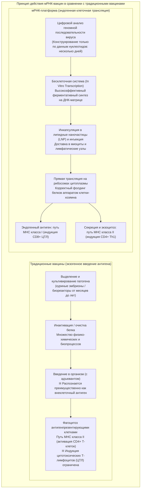
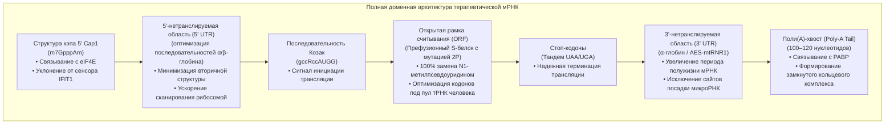
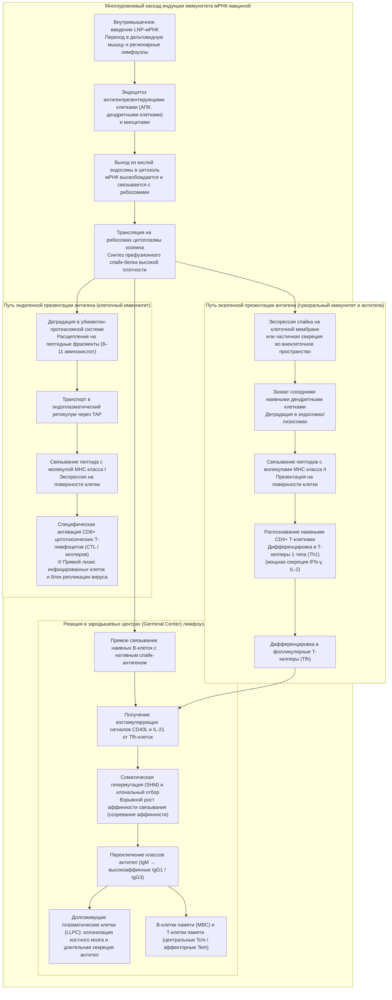
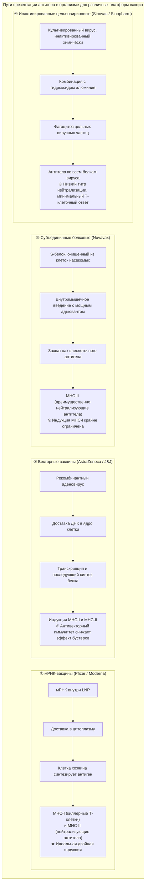

## Введение: мРНК-революция —— как «хрупкая молекула» обеспечила быстрейшую разработку вакцин в истории человечества

В январе 2020 года полная геномная последовательность (около 30 000 нуклеотидов) неизвестного возбудителя тяжелого респираторного синдрома — коронавируса SARS-CoV-2, вспышка которого произошла в китайском городе Ухань, — была опубликована в открытом доступе в интернете. Спустя всего 42 дня американская биотехнологическая компания Moderna отгрузила первую партию клинических флаконов вакцины «mRNA-1273» в Национальные институты здравоохранения США (NIH). Одновременно совместная исследовательская группа немецкой BioNTech и американской Pfizer с кандидатом «BNT162b2» стремительно преодолела путь до завершения крупномасштабных клинических испытаний фазы III и получения разрешения на экстренное использование (EUA). На весь процесс ушло беспрецедентные 11 месяцев — скорость, не имеющая аналогов за всю историю биомедицины.

Традиционный цикл создания вакцин — будь то живые аттенуированные, инактивированные или рекомбинантные субъединичные белковые препараты, требующие размножения вируса в куриных эмбрионах или колоссальных клеточных биореакторах — в рамках фармацевтической догмы неизменно требовал от **10 до 15 лет** кропотливой работы и астрономических финансовых затрат: от изоляции штамма и адаптации условий культивирования до сложнейшей многоступенчатой очистки и валидации безопасности.

мРНК-технология в корне перевернула эти фундаментальные представления. Ее суть заключается в радикальном переосмыслении парадигмы: вакцина перестала быть «промышленно синтезированным и очищенным in vitro антигенным белком» и превратилась в **«программную платформу, которая временно загружает цифровую генетическую матрицу белка-мишени непосредственно в трансляционный аппарат клеток хозяина, превращая сам живой организм в высокоточную фабрику по производству антигена»**.



### Транзиторность мРНК в центральной догме и «невозможность модификации генома человека»

В ответ на периодически возникавшие в обществе спекуляции о том, что «вакцинация мРНК может привести к изменению или интеграции в человеческую ДНК», основополагающий постулат молекулярной биологии — **«Центральная догма»** — дает исчерпывающий и однозначный научный ответ.

В клетках эукариот передача генетической информации представляет собой строго однонаправленный векторный процесс: **ДНК (клеточное ядро) → Транскрипция (Transcription) → мРНК (экспорт в цитоплазму) → Трансляция (Translation) → Белок (цитоплазма)**. Экзогенная мРНК вакцины, попадая в цитозоль, напрямую связывается с рибосомами и транслирует целевой спайк-белок.
1. **Отсутствие сигналов ядерной локализации (NLS)**: Синтетическая мРНК не содержит пептидных или структурных меток ядерного импорта, что делает проникновение через ядерные поровые комплексы в кариоплазму физически невозможным. мРНК строго локализована в цитоплазме.
2. **Отсутствие ферментов обратной транскрипции**: Для конверсии мРНК в комплементарную ДНК (кДНК) необходим фермент обратная транскриптаза (Reverse Transcriptase), а для встраивания в хромосому — интеграза (Integrase). Здоровые соматические клетки человека лишены эндогенной экспрессии этих вирусных ферментов. Эксперименты in vitro с гиперэкспрессией эндогенных ретротранспозонов LINE-1 представляли собой искусственные экстремальные условия и не продемонстрировали никакой геномной интеграции в физиологических условиях in vivo.
3. **Быстрая естественная деградация в организме**: мРНК является лабильной органической молекулой: в течение нескольких часов или суток она полностью гидролизуется клеточными рибонуклеазами (РНКазами) до естественных мононуклеотидов, которые утилизируются клеточным метаболизмом.

Таким образом, терапевтическая мРНК представляет собой **«строго ограниченное во времени программное сообщение с механизмом самоликвидации после трансляции»**, принципиально не способное перманентно изменить генетический код человека.

---

## Глава 1: Сорок лет упорной борьбы и прорыв —— ученые, превратившие мРНК в лекарство

Триумфальное внедрение технологии в 2020 году не было внезапным озарением. За этим успехом стояли четыре десятилетия самоотверженных фундаментальных поисков ученых, зачастую сталкивавшихся со скептицизмом научного сообщества, потерей академических позиций и хроническим дефицитом грантового финансирования. Присуждение в 2023 году Нобелевской премии по физиологии и медицине доктору **Каталин Карико (Katalin Karikó)** и доктору **Дрю Вайсману (Drew Weissman)** стало заслуженным признанием этой многолетней научной эпопеи.

### 1.1 Непреодолимая стена ранних исследований мРНК: нестабильность и фатальный врожденный иммунный ответ

С момента идентификации матричной РНК Франсуа Жакобом (François Jacob) и Сиднеем Бреннером (Sydney Brenner) в 1961 году исследователи грезили идеей: если ввести мРНК в живой организм, можно заставить его клетки вырабатывать абсолютно любой терапевтический белок.

Однако ранние эксперименты 1980–1990-х годов неизменно терпели сокрушительный крах. Перед первопроходцами стояли две непреодолимые преграды:
- **Экстремальная физико-химическая лабильность**: В живых тканях, в окружающем воздухе и на поверхности кожи человека повсеместно присутствуют сверхстабильные ферменты **рибонуклеазы (РНКазы / RNase)**, эволюционно предназначенные для защиты организма от РНК-вирусов. «Голая» мРНК (Naked RNA) мгновенно расщеплялась РНКазами в момент инъекции, не успевая даже приблизиться к клеточным мембранам.
- **Катастрофическая гиперактивация врожденного иммунитета**: Если исследователям и удавалось ввести интактную синтетическую РНК лабораторным животным, иммунная система млекопитающих мгновенно распознавала ее как опасный патогенный сигнал вирусного вторжения. Это провоцировало острый цитокиновый шторм с выбросом интерферонов и воспалительных факторов, приводя к системному шоку и гибели подопытных животных. мРНК получила негласное клеймо «молекулы, непригодной для создания лекарств из-за фатальной токсичности».

Несмотря на понижение в академической должности и регулярные отказы в финансировании, венгерский биохимик Каталин Карико в стенах Пенсильванского университета продолжала непоколебимо верить в скрытый терапевтический потенциал РНК.

### 1.2 Историческое открытие Карико и Вайсмана (2005): обход рецепторов TLR с помощью модификации уридина

В 1997 году Карико познакомилась с иммунологом Дрю Вайсманом, исследовавшим биологию дендритных клеток (Dendritic Cells, DC) с целью создания вакцины против ВИЧ. Объединив усилия, они сосредоточились на изучении иммунного ответа дендритных клеток на экзогенную РНК.

Ключевой вопрос, который они перед собой поставили, звучал так: **«Почему эндогенная транспортная РНК (тРНК) и рибосомная РНК (рРНК) клеток млекопитающих не вызывают иммунной атаки, тогда как синтезированная in vitro (In Vitro Transcription, IVT) мРНК провоцирует бурную воспалительную реакцию дендритных клеток?»**

На мембранах клеток и эндосом млекопитающих сосредоточены сенсоры врожденного иммунитета — **Toll-подобные рецепторы (Toll-like Receptors, TLR)**:
- **TLR3**: распознает двухцепочечную РНК (дцРНК / dsRNA).
- **TLR7 / TLR8**: детектируют уридин-богатые участки одноцепочечной РНК (оцРНК / ssRNA).
- **RIG-I / MDA5**: цитоплазматические хеликазы, распознающие экзогенные 5'-трифосфатные концы и протяженные двухцепочечные РНК, индуцируя продукцию интерферонов I типа (IFN-α/β).

Карико и Вайсман обратили внимание на фундаментальное различие: эндогенные РНК млекопитающих подвергаются обширным посттранскрипционным модификациям (метилированию, псевдоуридилированию и т.д.), тогда как стандартная транскрибируемая in vitro мРНК собиралась исключительно из четырех канонических немодифицированных нуклеотидов (А, Ц, Г, У).

В 2005 году они опубликовали эпохальное исследование: **замена природного уридина (Uracil) на его природный изомер — псевдоуридин (Pseudouridine, Ψ) — привела к тому, что синтетическая мРНК перестала распознаваться TLR7, TLR8 и внутриклеточными РНК-сенсорами, а фатальная воспалительная реакция полностью исчезла.**

### 1.3 От псевдоуридина к «N1-метилпсевдоуридину (m1Ψ)»

Открытие ученых не ограничилось подавлением воспаления. Неожиданно выяснилось, что модифицированная псевдоуридином мРНК транслируется рибосомами в разы и десятки раз эффективнее немодифицированной.

При проникновении обычной уридин-содержащей экзогенной РНК сенсоры активируют клеточные ферменты защиты: **протеинкиназу R (PKR)** и **2'-5'-олигоаденилатсинтетазу (OAS)**. Фосфорилирование фактора инициации **eIF2α** киназой PKR полностью блокирует синтез всех белков в клетке, а путь OAS/РНКаза L недискриминативно уничтожает клеточные РНК.

Модификация псевдоуридином предотвращает активацию PKR и OAS. Рибосомы получают возможность непрерывно и плавно считывать генетический код на протяжении длительного времени.

В 2010-х годах компании BioNTech и Moderna провели масштабный скрининг аналогов и открыли химическую модификацию следующего поколения — **N1-метилпсевдоуридин (m1Ψ / N1-methylpseudouridine)**:
- Метильная группа в положении N1 ослабляет избыточную жесткость вторичных структур РНК, не нарушая правильности спаривания кодон-антикодон в декодирующем центре рибосомы.
- Аффинность к рецепторам TLR7/8 снижается практически до нуля, а 100% замена уридина на m1Ψ обеспечивает колоссальное увеличение выхода целевого белка in vivo.
Вакцины BNT162b2 (Pfizer/BioNTech) и mRNA-1273 (Moderna) стандартизированы именно на базе **полного 100%-го замещения уридина молекулами m1Ψ**.

### 1.4 Триумф структурной стабилизации: «2P-мутация» Барни Грэма и Джейсона Маклеллана

Вторым фундаментальным столпом успеха вакцин стала **стабилизация спайк-белка в конформации до слияния (Prefusion) с помощью замены двух аминокислот на пролин — «2P-мутация» (Two-Proline Substitution)**.

Шиповидный гликопротеин (S-белок) коронавируса SARS-CoV-2 связывается с рецептором ACE2 клеток человека. Будучи метастабильной молекулярной «пружиной», S-белок претерпевает драматическую структурную перестройку:
- **Префузионная конформация (Prefusion)**: Тримерная форма, на вершине которой открыт рецептор-связывающий домен (RBD). Именно здесь экспонированы критические эпитопы для выработки высокоэффективных **вируснейтрализующих антител**.
- **Постфузионная конформация (Postfusion)**: После слияния мембран белок необратимо вытягивается в жесткую стержневидную структуру. Антитела против постфузионной формы обладают крайне слабой способностью нейтрализовать живой вирус.

Команда исследователей под руководством **Барни Грэма (Barney Graham)** из Национального института аллергии и инфекционных заболеваний США (NIAID) и **Джейсона Маклеллана (Jason McLellan)** из Техасского университета в Остине, изучая MERS-CoV и SARS-CoV-1 методом криоэлектронной микроскопии, обнаружили, что введение **двух последовательных остатков пролина (Proline, P)** в шарнирную область между центральной спиралью и вершиной шипа (позиции K986P и V987P) механически блокирует распрямление полипептидной цепи, **намертво фиксируя белок в префузионной форме**.

Когда в январе 2020 года стал известен геном SARS-CoV-2, авторы мгновенно интегрировали 2P-мутацию в последовательность матричной РНК. Благодаря этому иммунной системе человека был презентирован именно тот конформационный антиген, нейтрализация которого предотвращает инфицирование клеток с максимальной эффективностью.

---

## Глава 2: Высокоточная архитектура молекулы мРНК —— инженерия синтетических транскриптов

Терапевтическая мРНК — это не просто копия вирусного гена, а высокотехнологичный **биополимерный наномеханизм**, в котором каждый регуляторный элемент оптимизирован методами синтетической биологии для достижения максимальной трансляционной активности и контролируемого периода полужизни.



### 2.1 Структура 5'-кэпа (эволюция от Cap0 к Cap1): распознавание «своего» и инициация трансляции

На 5'-конце эукариотической мРНК располагается **7-метилгуанозиновый кэп (m7G)**. Молекулярный тип кэпа имеет критическое значение для судьбы молекулы:
- **Кэп Cap0 (m7GpppN)**: Простейшая структура, которая в цитоплазме клеток позвоночных немедленно связывается белком **IFIT1 (Interferon-induced protein with tetratricopeptide repeats 1)**. IFIT1 распознает Cap0 как вирусный маркер и блокирует трансляцию.
- **Кэп Cap1 (m7GpppNm)**: Содержит дополнительное 2'-O-метилирование первого рибозного остатка за кэпом. Это эволюционный маркер собственной клеточной мРНК высших эукариот, делающий транскрипт невидимым для сенсора IFIT1.

В промышленных вакцинах ко-транскрипционная ферментативная методика (технология CleanCap®) гарантирует получение **более 95% молекул с аутентичной структурой Cap1**. Это обеспечивает стабильный рекрутинг фактора инициации **eIF4E** (в составе комплекса eIF4F: eIF4E, eIF4G, eIF4A) и оперативную посадку малой 40S субъединицы рибосомы.

### 2.2 Оптимизация 5'- и 3'-нетранслируемых областей (UTR)

Нетранслируемые области управляют скоростью рибосомного сканирования и физическим временем жизни молекулы:
- **Дизайн 5' UTR**: Протяженные шпильки и структуры G-квадруплексов создают стерические барьеры для сканирующей рибосомы. В вакцинах используются искусственно облегченные последовательности на основе 5' UTR генов **α- и β-глобина человека**, практически лишенные вторичных структур.
- **Дизайн 3' UTR**: Направлен на замедление деаденилирования поли(А)-хвоста и эндонуклеазного распада. В структуру встраиваются стабильные элементы (например, химерные конструкции из 3' UTR мышиного альфа-глобина или комбинации энхансера аминокислот AES и митохондриальной рРНК mtRNR1), в которых методами биоинформатики полностью устранены сайты связывания микроРНК (miRNA seed matches), способных вызвать сайленсинг.

### 2.3 Открытая рамка считывания (ORF) и кодонная оптимизация

Кодирующая область S-белка подвергается глубокому редизайну с помощью специализированных биоинформатических алгоритмов. В силу вырожденности генетического кода одну и ту же аминокислоту кодируют несколько синонимичных триплетов:
1. **Синхронизация с пулом тРНК человека**: Вирусные кодоны заменяются на синонимичные кодоны, наиболее распространенные в клетках человека. Это исключает задержки рибосомы при декодировании редких тРНК и увеличивает скорость элонгации пептидной цепи.
2. **Обогащение GC-состава**: Стратегическое повышение доли гуанина и цитозина (GC-content) разрушает внутримолекулярные дестабилизирующие мотивы, предотвращает преждевременный полиаденилирующий сплайсинг и термодинамически стабилизирует молекулу.
3. **Минимизация побочных дцРНК-продуктов**: Побочные продукты абортивной транскрипции Т7-РНК-полимеразы (двухцепочечные шпильки дцРНК) удаляются методами высокоэффективной жидкостной хроматографии (HPLC) и оптимизацией условий синтеза.

### 2.4 Поли(А)-хвост и «модель замкнутого кольца» (Closed-Loop Model)

Полиадениловый тракт на 3'-конце выполняет функцию таймера биохимической жизни мРНК:
- Молекула связывается с белками **PABP (Poly(A)-binding protein)**.
- Взаимодействие PABP на 3'-конце с фактором eIF4G на 5'-кэпе замыкает мРНК в **стабильное кольцо (Closed-Loop complex)**.
- Рибосома, дойдя до тандемного стоп-кодона (UAA-UGA), не диссоциирует в цитозоль, а немедленно рекрутируется обратно на 5'-кэп, обеспечивая многократные циклы трансляции одного и того же транскрипта.
- Длина поли(А)-хвоста строго откалибрована на уровне **100–120 нуклеотидов**, что оптимизирует баланс между трансляционной активностью и устойчивостью к экзонуклеазам.

---

## Глава 3: Транспортный челнок через защитные барьеры —— инженерия липидных наночастиц (LNP)

Даже безупречно спроектированная молекула мРНК не способна проявить терапевтическую активность без системы адресной доставки. Спасительным ключом к созданию вакцин стали сферические супрамолекулярные структуры диаметром 80–100 нанометров — **липидные наночастицы (Lipid Nanoparticles, LNP)**.

### 3.1 Почему «голая» мРНК не может служить вакциной

Прямая внутримышечная инъекция голой мРНК имеет практически нулевую эффективность по двум физико-химическим причинам:
1. **Электростатическое отталкивание**: Рибозофосфатный остов РНК несет плотный отрицательный заряд (полианион). Внешний монослой клеточных мембран человека также заряжен отрицательно за счет полярных головок фосфолипидов и остатков сиаловых кислот гликокаликса. Кулоновские силы отталкивания делают спонтанное проникновение макромолекулы невозможным.
2. **Уничтожение интерстициальными РНКазами**: Время полужизни незащищенной РНК во внеклеточной жидкости исчисляется минутами.

Возникла необходимость в создании «наноразмерного троянского коня», маскирующего отрицательный заряд и преодолевающего гидрофобный барьер мембраны.

### 3.2 «Золотая четверка липидов» LNP: функции и химическая архитектура

Липидные наночастицы вакцин Pfizer/BioNTech и Moderna состоят из **четырех специализированных липидных компонентов**, смешанных в строго выверенном молярном соотношении:

```
【Четыре ключевых липида LNP】
1. Ионизируемый катионный липид (Ionizable Lipid) 〜 46–50 мол.%
2. Вспомогательный фосфолипид (Helper Lipid: DSPC) 〜 10 мол.%
3. Холестерин (Cholesterol) 〜 38–43 мол.%
4. ПЭГилированный липид (PEGylated Lipid) 〜 1.5–1.7 мол.%
```

| Липидный компонент | Применяемая молекула (Pfizer / Moderna) | Доля (мол.%) | Физико-химические свойства | Ключевая биологическая функция |
| :--- | :--- | :--- | :--- | :--- |
| **Ионизируемый липид<br/>(Ionizable Lipid)** | **ALC-0315** (Pfizer)<br/>**SM-102** (Moderna) | **~46–50%** | Кажущаяся pKa **6.0–6.8**. Положительный заряд в кислой среде, нейтральный — при физиологическом pH. Содержит третичный амин и биодеградируемые сложноэфирные связи. | ① При кислом pH электростатически связывает мРНК при сборке ядра наночастицы.<br/>② В крови (pH 7.4) нейтрален: не проявляет мембранотоксичности и не вызывает гемолиза.<br/>③ В кислых эндосомах повторно протонируется, вызывая дестабилизацию мембраны и выход мРНК. |
| **Вспомогательный фосфолипид<br/>(Helper Lipid)** | **DSPC**<br/>(1,2-дистеароил-sn-глицеро-3-фосфохолин) | **~10%** | Цилиндрическая форма молекулы, высокая температура фазового перехода (~55 °C), насыщенные жирнокислотные хвосты. | Формирует стабильный липидный бислой во внешней оболочке LNP, поддерживая структурную целостность и жесткость наночастицы. |
| **Холестерин<br/>(Cholesterol)** | Высокоочищенный растительный холестерин | **~38–43%** | Жесткое стероидное кольцо с небольшой гидрофильной ОН-группой; регулятор упаковки мембраны. | Заполняет пустоты между фосфолипидами, оптимизируя микровязкость и текучесть бислоя. Препятствует утечке мРНК и облегчает слияние с мембранами. |
| **ПЭГилированный липид<br/>(PEGylated Lipid)** | **ALC-0159** (Pfizer)<br/>**PEG2000-DMG** (Moderna) | **~1.5–1.7%** | Гидрофильная цепь полиэтиленгликоля (мол. масса 2000 Да), соединенная с липидным якорем (димиристилглицерол). | ① Предотвращает агрегацию наночастиц при хранении, фиксируя размер на уровне ~80 нм.<br/>② Защищает от опсонизации белками плазмы, продлевая циркуляцию.<br/>③ Постепенно диссоциирует («сбрасывается») in vivo, делая частицу доступной для клеточного поглощения. |

### 3.3 Чудо эндоцитоза и эндосомального выхода (Endosomal Escape)

После внутримышечной инъекции ключевое событие на пути к трансляции белка разворачивается внутри клетки:
1. **Опсонизация аполипопротеином E и эндоцитоз**: Попадая в интерстиций и кровоток, LNP адсорбируют эндогенный **аполипопротеин E (ApoE)** на своей поверхности. Это позволяет им связываться с рецепторами липопротеинов низкой плотности (**LDLR**) на мембранах дендритных клеток, макрофагов и миоцитов, запуская опосредованный рецепторами эндоцитоз с образованием эндосом.
2. **Закисление эндосомы**: По мере созревания ранней эндосомы в позднюю протонная помпа V-ATPase закачивает ионы $H^+$, снижая внутренний pH с 7.4 до 6.5–5.0.
3. **Инверсия заряда и «эффект протонной губки»**: Ионизируемый липид с pKa 6.0–6.8 мгновенно захватывает протоны, приобретая **мощный положительный заряд**.
4. **Формирование инвертированной гексагональной фазы ($H_{II}$)**: Катионные липиды LNP вступают в сильное электростатическое взаимодействие с анионными фосфолипидами эндосомальной мембраны (в частности, фосфатидилсерином). Это индуцирует разрушение плоского бислоя и переход в неламеллярную инвертированную гексагональную фазу ($H_{II}$). Мембрана теряет барьерную функцию, формируются поры, через которые невредимая мРНК **выбрасывается в цитоплазматический пул рибосом**.

Современные нанобиологические исследования показывают, что доля успешно вышедшей в цитозоль мРНК составляет всего **от нескольких процентов до 10–15%**. Однако колоссальная трансляционная емкость молекулы гарантирует, что даже этого количества достаточно для мощнейшей продукции спайк-белка.

### 3.4 Технология микрофлюидного смешивания (Microfluidic Formulation)

Промышленное масштабирование производства LNP стало возможным благодаря внедрению **микрофлюидных технологий**:
В микроканалах микронного сечения этанольный раствор четырех липидов сталкивается с водным кислым буфером, содержащим мРНК, с контролируемой высокой скоростью.
В точке контакта этанол мгновенно разбавляется водой, вызывая резкое падение растворимости липидов и их **нанопреципитацию (самосборку)**: катионные липиды конденсируют полианионную мРНК в ядро, а гидрофильные цепи ПЭГ и DSPC покрывают частицу снаружи. Это позволяет непрерывно получать монодисперсные LNP с **эффективностью включения мРНК более 90% и узким распределением по размеру (PDI < 0.1)**.

---

## Глава 4: Многоуровневый иммунный каскад —— от цитоплазматической трансляции к формированию системной защиты

Превосходство мРНК-вакцин над субъединичными и инактивированными аналогами обусловлено их уникальной способностью **одновременно запускать презентацию антигена как по пути MHC класса I, так и по пути MHC класса II**.



### 4.1 Локальное поглощение в мышечной ткани и дренирующих лимфоузлах

После введения в дельтовидную мышцу значительная часть LNP с током интерстициальной жидкости в течение первых часов мигрирует в регионарные лимфатические узлы (подмышечные лимфоузлы).
- Хотя мышечные клетки (миоциты) экспрессируют спайк-белок на мембране, главными дирижерами иммунного оркестра выступают профессиональные антигенпрезентирующие клетки — **дендритные клетки (DC)** и субкапсулярные синусоидальные макрофаги лимфоузлов.
- В цитоплазме DC спайк-белок транслируется, подвергается нативному гликозилированию и правильному формированию дисульфидных связей, встраиваясь в клеточную мембрану в аутентичной тримерной префузионной форме.

### 4.2 Презентация по пути MHC класса I и мощная индукция CD8+ цитотоксических T-лимфоцитов

Традиционные субъединичные и инактивированные вакцины доставляют белок снаружи клетки, поэтому они не способны эффективно индуцировать **CD8+ цитотоксические Т-лимфоциты (киллеры / CTL)**, уничтожающие инфицированные вирусом клетки.

мРНК-вакцины синтезируют антиген **внутри цитоплазмы**, задействуя классический эндогенный путь:
1. **Протеасомное расщепление**: Часть синтезированного спайка размечается убиквитином и расщепляется **протеасомой** на короткие пептиды длиной 8–11 аминокислот.
2. **Транспорт через TAP**: Пептиды переносятся транспортером **TAP** в просвет эндоплазматического ретикулума.
3. **Загрузка на комплекс MHC-I**: Пептиды садятся в бороздку новообразованных молекул **MHC класса I (HLA-A, HLA-B, HLA-C)** и через комплекс Гольджи выносятся на внешнюю мембрану.
4. **Прайминг киллерных Т-клеток**: Наивные CD8+ Т-клетки распознают комплекс MHC-I/пептид Т-клеточным рецептором (TCR), получают костимуляцию (CD28–CD80/86) и превращаются в армию **эффекторных цитотоксических лимфоцитов**.

Именно сильный клеточный ответ CD8+ CTL послужил несокрушимым барьером против тяжелого течения болезни и смерти даже при появлении вариантов вируса, ускользающих от антител.

### 4.3 Презентация по пути MHC класса II и Th1-поляризация CD4+ T-клеток

Параллельно синтезированный спайк-белок выходит во внеклеточную среду при микросекреции или гибели клеток:
- Экзогенный антиген захватывается наивными дендритными клетками и расщепляется в эндолизосомах на пептиды длиной 13–18 аминокислот.
- Пептиды загружаются на молекулы **MHC класса II (HLA-DR, DP, DQ)** и презентируются наивным CD4+ Т-клеткам.
- Умеренная адьювантная активность компонентов LNP стимулирует дифференцировку CD4+ клеток строго по пути **Th1 (Т-хелперы 1 типа)** с выработкой интерферона-гамма (IFN-γ) и ИЛ-2, полностью предотвращая патологический аллергический Th2-ответ.

### 4.4 Зародышевые центры (Germinal Centers) и созревание аффинности B-клеток

Кульминация гуморального иммунитета — формирование и долгосрочное функционирование **зародышевых центров (Germinal Centers, GC)** в фолликулах лимфоузлов:
1. **Распознавание нативного антигена**: Наивные B-клетки своими рецепторами (BCR) напрямую связываются с трехмерными шипами на поверхности дендритных клеток.
2. **Поддержка Tfh-клеток**: B-клетки привлекаются в зародышевые центры и получают сигналы выживания от **фолликулярных Т-хелперов (Tfh)** через ось CD40L–CD40 и интерлейкин-21 (IL-21).
3. **Соматическая гипермутация (SHM) и клональная селекция**: В темной зоне зародышевого центра фермент AID индуцирует точечные мутации в генах вариабельных областей антител. В светлой зоне B-клетки конкурируют за связывание с антигеном: только клоны с высочайшей аффинностью получают сигнал выживания, остальные гибнут путем апоптоза.
4. **Переключение классов и выход долгоживущих клеток**: Происходит переключение с низкоаффинных IgM на **высокоаффинные нейтрализующие IgG1 и IgG3**. Часть клонов трансформируется в **долгоживущие плазматические клетки (LLPC)**, заселяющие костный мозг и непрерывно синтезирующие антитела, а часть формирует пул **B-клеток памяти (MBC)**.

Клинические исследования с биопсией лимфоузлов подтвердили, что зародышевые центры после мРНК-вакцинации **сохраняют высокую активность на протяжении более шести месяцев**, обеспечивая непревзойденное созревание качества антител.

---

## Глава 5: Клинические доказательства, динамика эффективности и битва со штаммами

### 5.1 Результаты масштабных клинических испытаний фазы III: шок от 95% эффективности

Результаты клинических испытаний фазы III вакцин от Pfizer (Polack et al.) и Moderna (Baden et al.), опубликованные в конце 2020 года в журнале *The New England Journal of Medicine (NEJM)*, ошеломили мировое медицинское сообщество:
- **Pfizer/BioNTech (BNT162b2: 43 448 участников)**: В группе плацебо было зафиксировано 162 случая симптомного COVID-19, тогда как в группе вакцинации — всего 8 случаев. Эффективность предотвращения симптоматического заболевания составила **95.0% (95% ДИ: 90.3–97.6%)**. Тяжелое течение развилось у 9 пациентов в группе плацебо и лишь у 1 в группе вакцины.
- **Moderna (mRNA-1273: 30 420 участников)**: 185 случаев COVID-19 в группе плацебо (из них 30 тяжелых и 1 летальный исход) против 11 случаев в вакцинированной группе (0 тяжелых). Эффективность составила **94.1% (95% ДИ: 89.3–96.8%)**, а защита от тяжелых форм достигла 100%.

Изначально Управление по санитарному надзору за качеством пищевых продуктов и медикаментов США (FDA) и ВОЗ установили минимальный порог эффективности для экстренного одобрения на уровне 50%. На фоне противогриппозных вакцин, чья сезонная эффективность колеблется в пределах 40–60%, результат в 95% против абсолютно нового патогена стал грандиозным триумфом молекулярной медицины.

### 5.2 Статистическая интерпретация: относительное (RRR) и абсолютное (ARR) снижение риска

В ходе общественных дискуссий возникло распространенное заблуждение: утверждалось, что показатель «95%» отражает лишь относительное снижение риска (Relative Risk Reduction, RRR), тогда как абсолютное снижение риска (Absolute Risk Reduction, ARR) составляет менее 1%, якобы свидетельствуя о низкой полезности вакцины.

Разберем математическую и эпидемиологическую суть этих показателей:
- **RRR (Относительное снижение риска)**: Сравнивает заболеваемость в группе плацебо ($I_p$) и вакцинированной группе ($I_v$):
  $$RRR = \frac{I_p - I_v}{I_p} \times 100\% = \frac{0.0088 - 0.0004}{0.0088} \approx 95\%$$
  Этот показатель отражает **биологическую и иммунологическую способность вакцины нейтрализовать патоген**.
- **ARR (Абсолютное снижение риска)**: Абсолютная разница долей заболевших в конкретной когорте за ограниченный период наблюдения:
  $$ARR = I_p - I_v \approx 0.88\% - 0.04\% = 0.84\%$$
- **Суть проблемы**:
  Величина ARR напрямую привязана к **фоновой распространенности вируса в популяции** за время испытания. Если исследование проводится в условиях низкой циркуляции патогена, ARR математически не может превысить фоновый уровень заболеваемости (всегда будет < 1%). Однако при возникновении эпидемической волны, когда воздействию вируса подвергаются, например, 20% населения, абсолютная польза вакцины взлетает до $20\% \times 95\% = 19\%$.
  Таким образом, противопоставление ARR и RRR без учета популяционной экспозиции является грубой методологической ошибкой.

### 5.3 Реальные популяционные данные (Real-World Evidence): доказательства на уровне государств

При выходе из контролируемых рамок КИ в реальную популяцию со всеми ее сложностями (пожилые люди, коморбидные патологии, пациенты на иммуносупрессии) вакцины подтвердили свою высочайшую силу.

Крупнейшие когортные исследования в **Израиле (Clalit Health Services, 1.2 млн человек, Dagan et al., NEJM 2021)**, а также национальные регистры Великобритании (UKHSA) и США (CDC) выявили три ключевые закономерности:
1. **Подавление исходных штаммов**: Против уханьского и альфа-вариантов эффективность защиты от инфицирования превышала 90%, а предотвращение госпитализаций и смерти достигало 95%.
2. **Естественное угасание защиты от заражения**: Через 4–6 месяцев после вакцинации вследствие закономерного снижения титра циркулирующих антител защита от легкого симптомного течения опускалась до 60–70%.
3. **Стойкая защита от тяжелых исходов**: Защита от критического течения, ИВЛ и летального исхода стойко держалась на уровне 85–90% и выше. Это объясняется способностью B-клеток памяти стремительно реактивироваться при встрече с вирусом, а также непреодолимым барьером **Т-клеточного иммунитета (CD8+ CTL)** в тканях легких.

### 5.4 Эволюция штаммов и ускользание от иммунитета: нейтрализующие антитела против устойчивости T-клеток

Под давлением популяционного иммунитета SARS-CoV-2 начал стремительно накапливать мутации в спайк-белке.

| Линейка штаммов | Ключевые мутации (RBD и др.) | Чувствительность к нейтрализации (отн. исх.) | Защита от заражения (2 дозы) | Защита от тяжелого течения (2 дозы) | Эффект бустерной дозы |
| :--- | :--- | :--- | :--- | :--- | :--- |
| **Уханьский исходный<br/>(Wuhan-Hu-1)** | Исходный референс | **1.0x** (базовый) | **~95%** | **>95%** | Титр антител возрастает в десятки раз выше базового |
| **Альфа<br/>(Alpha: B.1.1.7)** | N501Y, P681H | **Снижение в 1.5–2 раза** | **~85–90%** | **~95%** | Восстановление максимальной защиты от всех форм |
| **Дельта<br/>(Delta: B.1.617.2)** | L452R, T478K, P681R | **Снижение в 3–6 раз** | **~60–75%** (угасание со временем) | **~90%** | Третья доза возвращает защиту от симптомов до >85% |
| **Омикрон BA.1/BA.2<br/>(Ранний Omicron)** | >15 мутаций в RBD<br/>(K417N, E484A, N501Y и др.) | **Падение в 20–40 раз** | **~20–40%** (резкое падение после 2 доз) | **~70–80%** (сохранение Т-клеточного ответа) | Бустер повышает защиту от симптомов до 65–75%, от тяжелого течения — >90% |
| **Омикрон BA.4/BA.5<br/>и XBB/JN.1** | L452R, F486V/P, R346T<br/>экстремальное ускользание | **Выраженная потеря связывания антител** | **Практически отсутствует** (при старых 2 дозах) | **~60–70%** (за счет базисной Т-памяти) | Адаптированные бивалентные и моновалентные вакцины XBB.1.5/JN.1 восстанавливают нейтрализацию и защиту от госпитализации до 70–80%+ |

Появление Омикрона показало границы возможностей нейтрализующих антител: свыше 30 аминокислотных замен в спайк-белке деформировали поверхностные конформационные эпитопы.

Однако здесь во всей мощи проявился **Т-клеточный иммунитет**:
- Антитела метят строго ограниченные выпуклые трехмерные участки RBD.
- В противоположность этому, рецепторы Т-клеток распознают короткие **линейные пептидные последовательности**, распределенные по всей длине спайка (1273 аминокислоты).
- Из-за колоссального генетического полиморфизма HLA у людей вирус не способен мутировать во всех пептидных позициях одновременно.
- Международные консорциумы доказали: **более 80–90% Т-клеточных эпитопов спайк-белка Омикрона остались полностью идентичными исходному штамму**. Именно сохранность Т-клеточной защиты предотвратила коллапс систем здравоохранения и удержала летальность на низком уровне при взрывной волне Омикрона.

### 5.5 Бустерная вакцинация и разработка обновленных вакцин

мРНК-платформа продемонстрировала непревзойденную гибкость при адаптации к эволюции патогена:
1. **Гомологичные бустеры (3-я доза)**: Введение третьей дозы исходной вакцины реактивировало зародышевые центры, стимулируя дальнейшее соматическое гипермутирование В-клеток и расширяя спектр перекрестно-нейтрализующих антител.
2. **Бивалентные вакцины**: Смесь в равных долях мРНК исходного штамма и вариантов Омикрон BA.1 или BA.4/5 позволила расширить репертуар иммунного ответа.
3. **Моновалентные обновленные составы (XBB.1.5, JN.1)**: Во избежание эффекта антигенного импринтинга («антигенного первородного греха») платформы перешли на моновалентные формулы новейших вариантов. С момента цифрового определения последовательности до выпуска готовых флаконов проходило всего **2–3 месяца** — недостижимая скорость для любых классических вакцинных технологий.

---

## Глава 6: Профиль безопасности, патофизиология побочных эффектов и анализ пользы и риска

Как и любые высокоэффективные биологические препараты, мРНК-вакцины обладают определенным спектром реактогенности и потенциальных редких рисков. Научная объективность требует детального патофизиологического анализа этих явлений.

### 6.1 Местная и системная реактогенность: физиологическая плата за иммунный ответ

Часто наблюдаемые реакции — боль и отек в месте укола, повышение температуры тела, озноб, слабость, миалгия и головная боль — обусловлены не токсическим поражением тканей, а **штатным включением сигнальных путей врожденного иммунитета**:
- Липидные компоненты LNP и единичные молекулы РНК стимулируют локальные макрофаги к транзиторной секреции интерлейкинов **IL-1β, IL-6, TNF-α и интерферонов I типа**.
- Попадая в системный кровоток, IL-6 и интерфероны воздействуют на терморегуляторный центр гипоталамуса, индуцируя физиологическую пирогенную реакцию.
- В подавляющем большинстве случаев симптомы спонтанно купируются в течение 24–48 часов и легко контролируются приемом парацетамола или ибупрофена.

### 6.2 Миокардит и перикардит: эпидемиология и молекулярные механизмы

Системы фармаконадзора (VAERS, VSD в США, регистры Израиля и Европы) выявили крайне редкую связь между мРНК-вакцинацией и развитием воспаления миокарда и перикарда, преимущественно у **молодых мужчин в возрасте 12–29 лет** после второй дозы.

#### ① Эпидемиологическая частота
- Общая популяционная частота крайне мала: **1–5 случаев на 100 000 доз**.
- В группе наивысшего риска (юноши 16–19 лет после второй дозы) частота достигает **10–15 случаев на 100 000 доз (~0.01%)**.
- Вакцина от Moderna (100 мкг мРНК) ассоциировалась с несколько более высокой частотой миокардитов, чем вакцина от Pfizer (30 мкг), в связи с чем во многих странах молодым людям рекомендовали препарат Pfizer.

#### ② Патогенетические гипотезы
1. **Свободный циркулирующий спайк-белок**: Исследования гарвардской группы (Yonker et al., Circulation 2023) показали, что у предрасположенных молодых людей в крови кратковременно выявлялся несвязанный свободный спайк-белок, способный провоцировать локальную активацию эндотелия и кардиомиоцитов.
2. **Гормональный статус (тестостерон)**: Мужские половые гормоны усиливают провоспалительную активность макрофагов и поляризацию Th1, тогда как эстрогены обладают защитным противовоспалительным действием.
3. **Транзиторная аутоиммунная реакция**: Временное появление антител к сократительным белкам миокарда (например, альфа-миозину).

#### ③ Клинический прогноз и сопоставление с риском инфекции
- **Более 90% поствакцинальных миокардитов протекают в легкой форме**: пациенты полностью выздоравливают в течение нескольких дней на фоне терапии НПВП без долгосрочных кардиальных нарушений.
- **Риск от самого вируса несравнимо выше**: Риск тяжелого миокардита, аритмий, тромбозов и кардиогенного шока при инфицировании вирусом SARS-CoV-2 в разы и десятки раз превышает поствакцинальный риск для всех возрастных групп, включая молодых мужчин.

### 6.3 Анафилаксия и аллергия на полиэтиленгликоль (ПЭГ)

Тяжелая аллергическая реакция немедленного типа (анафилаксия) регистрируется с частотой **2–5 случаев на 1 миллион доз**:
- Основным триггером выступает **ПЭГ-2000 (полиэтиленгликоль)** в составе LNP, к которому у отдельных лиц уже сформированы антитела из-за широкого использования ПЭГ в косметике и лекарствах, либо активация тучных клеток по механизму CARPA (псевдоаллергия, опосредованная комплементом).
- Организация наблюдения в течение 15–30 минут после инъекции и немедленное введение эпинефрина (адреналина) полностью нивелируют жизнеугрожающие последствия.

### 6.4 Отсутствие риска тромбоза с тромбоцитопенией (TTS / VITT)

Векторные вакцины на основе аденовирусов (AstraZeneca, Johnson & Johnson) вызвали редкий, но крайне опасный синдром **TTS/VITT (синдром тромбоза с тромбоцитопенией)**:
- Механизм VITT связан со связыванием белков аденовирусного капсида с тромбоцитарным фактором 4 (PF4), что запускает выработку аутоантител и генерализованное свертывание крови.
- **мРНК-вакцины не содержат вирусных белковых капсидов**: они не формируют комплексов с PF4, и для них риск развития VITT полностью отсутствует.

### 6.5 Исключение феноменов ADE (антителозависимого усиления инфекции) и VAED

Исторические прецеденты с вакцинами против вируса денге и экспериментальной инактивированной вакциной против RSV в 1960-х годах породили теоретические опасения феноменов **ADE** (облегчение проникновения вируса в макрофаги неполноценными антителами) и **VAED** (утяжеление болезни с эозинофилией легких):
- На триллионах примененных доз мРНК-вакцин **ни в клинике, ни в популяции феномены ADE/VAED не были зарегистрированы**.
- Молекулярная причина надежности: 2P-мутация направляет синтез строго на высокоаффинные нейтрализующие антитела, а LNP-инженерия индуцирует мощный Th1-ответ, полностью исключая патологический Th2-иммунопатогенез.

| Нежелательное явление / реакция | Частота возникновения | Типичное время проявления | Ведущие патофизиологические механизмы | Клинический исход и ведение |
| :--- | :--- | :--- | :--- | :--- |
| **Местные реакции** (боль, отек, эритема) | **70–85%** (очень часто) | День инъекции — следующие сутки | Выброс цитокинов (IL-1, TNF) в мышце, миграция нейтрофилов | Купируются за 1–3 дня. Холодные компрессы, покой. |
| **Системная реактогенность** (температура, слабость, головная боль) | **50–70%** (часто, сильнее после 2 дозы) | Через 12–24 часа после укола | Системный выброс IL-6 и IFN-α/β, стимуляция терморегуляции мозга | Спонтанный регресс за 1–2 дня. Парацетамол, НПВП. |
| **Миокардит и перикардит** | **1–5 на 100 000 доз** (крайне редко, юноши 12–29 лет) | В течение 2–4 суток | Свободный спайк-белок, гормональная модуляция тестостероном, аутоиммунные триггеры | **В 90%+ легкое течение**. Полное восстановление на фоне НПВП. |
| **Анафилаксия** | **2–5 на 1 000 000 доз** (крайне редко) | В первые 15–30 минут | IgE к ПЭГ-2000 или не-IgE дегрануляция тучных клеток через комплемент (CARPA) | Полное купирование ранним введением эпинефрина (адреналина). |
| **Синдром Гийена — Барре** | **На уровне спонтанной популяционной частоты** | Спустя недели | Аутоантитела к миелину (характерно для векторных вакцин, связь с мРНК опровергнута) | Внутривенный иммуноглобулин (ВВИГ), плазмаферез. |

---

## Глава 7: Всестороннее сравнение технологических вакцинных платформ

Пандемия COVID-19 стала крупнейшим полигоном прямого сравнения всех существующих биотехнологических платформ создания вакцин.



### 7.1 мРНК против вирусных векторов (ДНК-платформы)

Векторные вакцины используют генетически модифицированный аденовирус для доставки гена спайк-белка в ядро клетки.
- **Преимущество**: ДНК стабильнее РНК, что позволяет хранить препарат при температуре 2–8 °C.
- **Критический дефект (антивекторный иммунитет)**: Иммунитет вырабатывает антитела не только к спайку, но и к самому аденовирусному носителю. Поэтому повторные бустерные дозы быстро нейтрализуются организмом до того, как успеют сработать. Кроме того, сохраняется риск редкого VITT.
- В отличие от них, синтетические липидные наночастицы мРНК-вакцин не обладают белковой иммуногенностью, что позволяет **вводить бустеры неограниченное число раз**.

### 7.2 мРНК против рекомбинантных белковых вакцин

Препараты вроде Novavax доставляют готовый рекомбинантный белок с адъювантом на основе сапонина (Matrix-M™).
- **Преимущество**: Мягкая реактогенность и многолетний опыт применения субъединичных вакцин.
- **Недостаток**: Сложный цикл культивирования в клетках насекомых и длительная очистка белка (производство занимает месяцы). Быстро обновить антиген под новые мутации технически невозможно.

### 7.3 мРНК против инактивированных цельновирионных вакцин

Вакцины Sinovac и Sinopharm содержат химически убитый вирус.
- **Преимущество**: Включают весь спектр структурных белков (включая нуклеокапсид).
- **Недостаток**: Крайне слабая индукция вируснейтрализующих антител и практически полное отсутствие ответа CD8+ киллерных Т-клеток. Защита быстро сошла на нет с приходом штамма Омикрон. Требуют громоздких производств высочайшего уровня биологической безопасности (BSL-3).

### 7.4 Производственные процессы и термодинамика «холодовой цепи»

Главной логистической трудностью внедрения мРНК-вакцин стали сверхнизкие температуры хранения:
- **Физико-химическая природа**: В водном растворе рибоза РНК склонна к автогидролизу из-за нуклеофильной атаки 2'-OH группы на фосфодиэфирную связь. Кроме того, липиды LNP подвержены окислению и слиянию частиц.
- **Ультрахолодовая цепь**: Чтобы заблокировать гидролиз, первым сериям требовалось хранение при **-80...-60 °C** (Pfizer) или **-20 °C** (Moderna).
- **Промышленное масштабирование**: Несмотря на холодовую цепь, бесклеточный синтез (IVT) обладает непревзойденной производительностью: в небольшом биореакторе объемом в несколько литров можно за считанные дни наработать сотни миллионов доз мРНК, что и обеспечило глобальную доступность препарата.

| Параметр сравнения | ① мРНК-вакцины | ② Векторные вакцины | ③ Субъединичные белковые | ④ Инактивированные вакцины |
| :--- | :--- | :--- | :--- | :--- |
| **Примеры препаратов** | **Pfizer (BNT162b2)<br/>Moderna (mRNA-1273)** | AstraZeneca (ChAdOx1)<br/>J&J (Ad26.COV2.S) | Novavax (NVX-CoV2373) | Sinovac (CoronaVac)<br/>Sinopharm (BBIBP) |
| **Форма антигена** | мРНК внутри липидных наночастиц | ДНК в рекомбинантном аденовирусе | Очищенный тример белка в наночастицах | Убитый вирион целиком |
| **Локализация сборки антигена** | **Эндогенно в цитозоле клетки хозяина** | В ядре и цитозоле клетки хозяина | Вне организма (биореакторы насекомых/CHO) | Вне организма (культура клеток Vero) |
| **Титр нейтрализующих антител** | **Наивысший (эталонный)** | От высокого до умеренного | Высокий | От умеренного до низкого |
| **Индукция CD8+ CTL** | **Очень мощная (через MHC-I)** | Высокая | Минимальная (кросс-презентация) | Практически отсутствует |
| **Скорость смены антигена** | **Рекордная (2–3 месяца)** | Средняя (2–4 месяца) | Низкая (6–12 месяцев) | Очень низкая (>6 месяцев) |
| **Ведущие побочные реакции** | Лихорадка, миалгия, редкий миокардит | Лихорадка, редкий тромбоз (TTS/VITT) | Локальная болезненность (умеренно) | Слабые местные реакции |
| **Температура хранения** | **-80 °C ... -20 °C (заморозка)** | 2 °C ... 8 °C (стандартный холод) | 2 °C ... 8 °C (стандартный холод) | 2 °C ... 8 °C (стандартный холод) |
| **Пригодность для ревакцинаций** | **Идеальная (нет белкового вектора)** | Ограниченная (антитела к вектору) | Высокая | Высокая |

---

## Глава 8: Фронтир мРНК-технологий —— от противоопухолевой иммунотерапии до персонализированной медицины

Успех в борьбе с COVID-19 окончательно утвердил мРНК в роли **универсальной технологической платформы биомедицины XXI века**.

### 8.1 Персонализированные противоопухолевые неоантигенные вакцины

Изначальной целью основателей BioNTech и Moderna была именно **онкология**.

Опухолевые клетки накапливают сотни соматических мутаций, экспрессируя мутантные белковые структуры — **неоантигены (Neoantigens)**, отсутствующие в здоровых тканях:
- **Алгоритм создания индивидуальной вакцины**:
  1. Секвенирование генома (NGS) биоптата опухоли и здоровых клеток пациента.
  2. Искусственный интеллект прогнозирует, какие из мутантных пептидов (10–34 неоантигена) будут сильнее всего связываться с индивидуальными молекулами HLA пациента.
  3. Синтез единой индивидуализированной полиэпитопной цепи мРНК за несколько недель.
  4. Инъекция мобилизует направленный пул цитотоксических Т-лимфоцитов, избирательно атакующих опухолевые очаги.
- **Прорывные клинические данные**: В исследовании фазы IIb (Moderna и Merck/MSD) комбинация неоантигенной вакцины mRNA-4157 (V940) с пембролизумабом (Keytruda) у пациентов с резецированной меланомой высокого риска снизила **риск рецидива или смерти на 44%** по сравнению с монотерапией (Lancet 2024). Идут фазы III при раке легкого и поджелудочной железы.

### 8.2 Экспансия в инфектологии: комбинированные вакцины против гриппа, РСВ, ВИЧ и малярии

- **Комбинированные поливалентные вакцины**: Разрабатываются единые препараты, защищающие сразу от сезонного гриппа (четыре штамма A и B) и COVID-19.
- **Панкоронавирусная вакцина**: Конструирование иммуногенов на основе консервативного стеблевого домена S2 для превентивной защиты от будущих зоонозных пандемий.
- **Тяжелые хронические инфекции**: Клинические испытания сложных многокомпонентных мРНК-вакцин против ВИЧ (индукция широко нейтрализующих антител bNAbs), малярии и туберкулеза.

### 8.3 Заместительная белковая терапия и редкие генетические заболевания

мРНК позволяет не только вырабатывать иммунитет, но и синтезировать недостающие белки в организме:
- **Метилмалоновая (MMA) и пропионовая (PA) ацидемии**: Клинические испытания (Moderna mRNA-3705) внутривенного введения LNP с мРНК дефицитных ферментов в гепатоциты восстанавливают метаболизм у детей с врожденными ферментопатиями.
- **мРНК-кодируемые моноклональные антитела**: Клетки печени пациента превращаются в биореактор, непрерывно секретирующий терапевтические антитела прямо в кровь.

### 8.4 In vivo CAR-T-клеточная терапия: перепрограммирование иммунных клеток внутри организма

Классическая CAR-T терапия требует забора лимфоцитов пациента, их модификации вирусными векторами in vitro в стерильных условиях и реинфузии, что стоит сотни тысяч долларов и занимает недели.
- Новейшие разработки используют **таргетные LNP (tLNP)**, конъюгированные с антителами к маркерам Т-клеток (CD4 или CD5).
- После внутривенного введения такие наночастицы специфично поглощаются цитотоксическими Т-лимфоцитами в кровотоке, временно экспрессируя химерный антигенный рецептор (CAR).
- Группа исследователей из Пенсильванского университета (Rurik et al., Science 2022) с помощью in vivo мРНК-CAR-T успешно уничтожила патологические фибробласты при фиброзе сердца у мышей, восстановив функцию миокарда.

### 8.5 Инженерные вызовы следующего поколения

1. **Самоамплифицирующаяся мРНК (saRNA / репликонные вакцины)**: Включение в состав гена репликазы (RdRp) альфавирусов позволяет молекуле автономно копировать себя в цитоплазме. Это снижает необходимую терапевтическую дозу в **10–100 раз** (до единиц микрограммов), сокращая побочные реакции и себестоимость (одобрены препараты в Японии, Kostaive®).
2. **Лиофилизация и термостабилизация**: Разработка сухих порошковых форм с сахарами (трегалоза, сахароза) позволяет хранить вакцины при **2–8 °C и комнатной температуре (25 °C)** месяцами, снимая зависимость от ультрахолода.
3. **Органоспецифическая доставка (SORT-технология)**: Добавление специального пятого липида модулирует поверхностный заряд LNP, позволяя направлять частицы в обход печени избирательно в легкие, селезенку, костный мозг или опухолевую ткань (**Selective Organ Targeting**).

---

## Глава 9: Заключение —— триумф фундаментальной науки и рассвет новой биомедицинской эры

### 9.1 Десятилетия накопления знаний, движимого любопытством

Появление мРНК-вакцин в критический момент пандемии не было счастливой случайностью или сиюминутным озарением.
Это результат слияния множества фундаментальных дисциплин: расшифровки трансляции в 1961 году, изучения физической химии липидных бислоев, раскрытия путей презентации антигенов через MHC и Toll-подобные рецепторы, а также непоколебимой веры ученых уровня Каталин Карико и Дрю Вайсмана.
Фундаментальная поисковая наука, движимая чистым познанием без мгновенной коммерческой выгоды, доказала, что является **главным гарантом биологической безопасности человечества**.

### 9.2 Научная грамотность общества перед лицом неопределенности

В медицине не существует понятий «нулевого риска». Суть научного мышления состоит в постоянном объективном сопоставлении документированной пользы и доказанных рисков на основе терабайтов эпидемиологических данных. Рациональное научное просвещение гражданского общества — лучшая защита от конспирологии и залог победы над будущими эпидемиями.

### 9.3 Хронологическая таблица вех развития мРНК-медицины (1961–настоящее время)

| Год / период | Научное событие и рубеж | Ключевые авторы и институты | Биомедицинское значение |
| :--- | :--- | :--- | :--- |
| **1961** | **Открытие матричной РНК (мРНК)** | Ф. Жакоб, С. Бреннер, Ж. Моно | Идентификация молекулярного посредника между ДНК и белком. Формулирование Центральной догмы. |
| **1978** | **Доставка мРНК в клетки с помощью липосом** | Д. Димитриадис и соавт. | Успешная трансляция мРНК гемоглобина кролика в лимфоцитах мыши с использованием фосфолипидных везикул. |
| **1989** | **Трансфекция с катионными липидами** | Р. Мэлоун, Ф. Фелгнер и соавт. | Применение синтетического липида DOTMA для внедрения мРНК в клетки in vitro. |
| **1990** | **Прямая экспрессия мРНК в мышцах мышей** | Дж. Вольфф и соавт. (Ун-т Висконсина) | Экспрессия белка после прямой инъекции голой мРНК in vivo. Рождение концепции РНК-терапии. |
| **1997** | **Знакомство Каталин Карико и Дрю Вайсмана** | К. Карико, Д. Вайсман (Ун-т Пенсильвании) | Начало исторического сотрудничества по исследованию реакции дендритных клеток на мРНК. |
| **2005** | **Открытие модификации нуклеозидов (Ψ)** | К. Карико, Д. Вайсман | **Замена уридина на псевдоуридин** снимает активацию TLR7/8 и снимает воспаление. Фундамент Нобелевской премии. |
| **2008** | **Основание компании BioNTech** | У. Сахин, О. Тюреджи, К. Хубер (Майнц) | Старт разработки индивидуализированных неоантигенных противоопухолевых вакцин на базе мРНК. |
| **2010** | **Основание компании Moderna** | Д. Росси, Р. Лангер, Т. Спрингер (Бостон) | Развитие модифицированных мРНК-технологий для регенеративной медицины и вакцинопрофилактики. |
| **2015** | **Идентификация N1-метилпсевдоуридина (m1Ψ)** | BioNTech, Moderna, академические лаборатории | Максимизация трансляционной активности при абсолютном иммунном ускользании. Основа вакцин против COVID-19. |
| **2017** | **Открытие 2P-мутации спайк-белка** | Дж. Маклеллан, Б. Грэм (NIAID / Ун-т Техаса) | Фиксация префузионной конформации шипа коронавирусов заменой двух аминокислот на пролин. |
| **2018** | **Первое одобрение FDA препарата на базе LNP (Patisiran)** | Alnylam Pharmaceuticals | Терапия транстиретинового амилоидоза (siRNA). Доказательство безопасности и эффективности LNP у человека. |
| **Январь 2020** | **Публикация генома SARS-CoV-2** | Китайский CDC / Ун-т Фудань (проф. Чжан Юнчжэнь) | Открытый цифровой доступ к коду. Дизайн последовательностей мРНК-вакцин за считанные дни. |
| **Ноябрь 2020** | **Публикация данных фазы III (эффективность 95%)** | Pfizer/BioNTech, Moderna | Беспрецедентная демонстрация 94–95% защиты в КИ на десятках тысяч участников (публикации в NEJM). |
| **Декабрь 2020** | **Первые разрешения на экстренное использование (EUA)** | MHRA (Великобритания), FDA (США) | Старт глобальной кампании иммунизации человечества спасшей десятки миллионов жизней. |
| **2022** | **Внедрение бивалентных бустеров Омикрон** | Pfizer/BioNTech, Moderna | Быстрое включение последовательностей сублиний BA.4/5 в ответ на эволюцию патогена. |
| **Октябрь 2023** | **Нобелевская премия Карико и Вайсману** | Нобелевская ассамблея Каролинского института | Официальное признание открытия модификаций нуклеозидов, сделавшего возможным создание вакцин против COVID-19. |
| **2023–н.в.** | **Взлет онковакцин и одобрение saRNA** | BioNTech, Moderna, VLP Therapeutics | Триумф индивидуализированных вакцин против меланомы (фаза IIb), одобрение самоамплифицирующейся мРНК. |

Молекула мРНК, которую еще недавно считали чересчур нестабильной и абсолютно непригодной для клинического применения, благодаря интеллектуальной отваге ученых превратилась в одну из мощнейших медицинских технологий в летописи человечества.
Ее спасительная роль при ликвидации острой фазы глобальной пандемии — это лишь первая глава огромной книги, в которой уже пишутся страницы побед над онкологическими заболеваниями и генетическими патологиями грядущего века.
