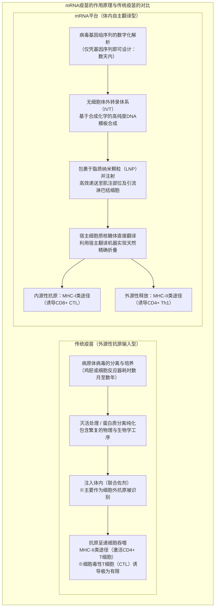
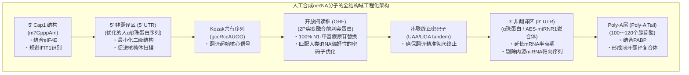
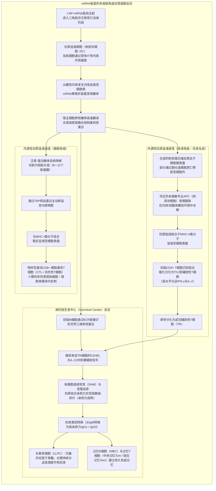
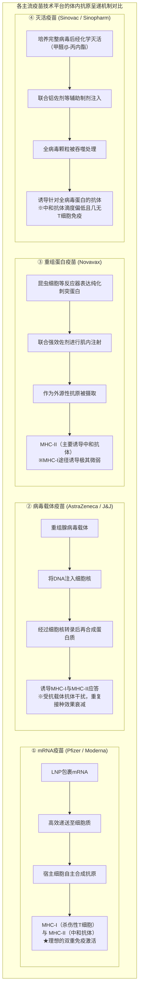

## 引言：mRNA革命 —— “脆弱分子”开创的人类史上最快疫苗研发

2020年1月，在中国武汉暴发的一种未知呼吸道传染病的病原体“SARS-CoV-2”的全基因组序列（约30,000个碱基）在网络上公开。仅仅42天后，美国莫德纳（Moderna）公司便将首批临床试验用疫苗小瓶“mRNA-1273”交付美国国家卫生研究院（NIH）；随后，与德国拜恩泰科（BioNTech）及美国辉瑞（Pfizer）联合研发团队的“BNT162b2”一起，以人类历史上前所未有的雷霆速度，在短短11个月内完成了大规模III期临床试验并获得了紧急使用授权（EUA）。

传统疫苗研发 —— 无论是依赖鸡蛋培养或巨型生物反应器细胞培养的减毒活疫苗、灭活疫苗，还是重组蛋白疫苗 —— 从病毒分离、毒株筛选、培养工艺优化到安全性验证，通常需要 **10年至15年** 的漫长时间和天文数字般的研发成本，这曾是医药界不可动摇的“铁律”。

然而，mRNA技术从根本上颠覆了这一定律。该技术的本质在于，将疫苗从“在体外耗时培养、分离纯化抗原蛋白后再注入人体的工业制品”，重新定义为 **“将目标抗原蛋白的设计图纸（数字化遗传代码）临时载入宿主细胞自身系统，把活体组织转变为自体抗原制造工厂的软件化生物平台”** 。



### 中心法则中mRNA的一过性与“基因组修饰的不可行性”

针对社会上曾出现的“接种mRNA疫苗是否会改变人体遗传基因（DNA）”的疑虑，分子生物学的基石原理 **“中心法则（Central Dogma）”** 给出了清晰而确凿的科学结论。

在真核生物中，遗传信息的流动遵循 **DNA（细胞核） → 转录（Transcription） → mRNA（转运出核） → 翻译（Translation） → 蛋白质（细胞质）** 这一不可逆的单向路径。外源输入的mRNA直接在细胞质中的核糖体上完成翻译，合成目标刺突蛋白。
1. **缺失核定位信号**: 人工合成的mRNA不含穿透细胞核核孔复合物所需的核定位信号，只能滞留在细胞质中。
2. **缺乏逆转录酶与整合酶**: 将单链RNA逆转录为双链DNA需要逆转录病毒等特有的“逆转录酶（Reverse Transcriptase）”，而整合进宿主基因组则必须依赖“整合酶（Integrase）”。健康的人体细胞内根本不存在这些酶（即使在实验室极端过表达条件下探讨内源性逆转录转座子LINE-1逆转录可能性的试管实验，在生理条件下的活体内也从未发现任何插入宿主基因组的证据）。
3. **体内的快速自然降解机制**: mRNA本质上属于高度不稳定的分子，会在数小时至数天内被细胞内的核糖核酸酶（RNase）彻底水解为普通的核苷酸并参与机体正常代谢，完全从体内清除。

换言之，mRNA疫苗宛如 **“在指导合成蛋白质后便自行销毁的限时一过性密码指令”** ，从根本原理上完全不可能对宿主的基因组DNA造成任何持久性修饰。

---

## 第1章：40年的艰苦求索与突破 —— 将mRNA转化为药物的科学家们

2020年mRNA疫苗的闪电问世，绝非一朝一夕偶然降临的奇迹。其背后凝聚着数代科学家在饱受学界质疑、科研经费屡遭削减的逆境中，长达40余年对RNA分子机制不懈钻研的基础研究积累。2023年诺贝尔生理学或医学奖授予 **卡塔琳·考里科（Katalin Karikó）** 博士与 **德鲁·韦斯曼（Drew Weissman）** 博士，正是对这一伟大基础科学长征的至高致敬。

### 1.1 早期mRNA研究的绝望壁垒：极度不稳定性与致死性固有免疫反应

自1961年弗朗索瓦·雅各布（François Jacob）与悉尼·布伦纳（Sydney Brenner）等人首次发现并鉴定mRNA以来，分子生物学家们便一直怀揣着一个宏大构想：“若能将人工合成的mRNA引入体内，是否就能随心所欲地合成任何治疗性蛋白质？”

然而，20世纪80至90年代开展的早期动物试验几乎全部以惨败告终。横亘在早期研究者面前的有两座难以逾越的险峰：
- **极度的物理化学不稳定性**: 在生物组织中、空气中以及人类皮肤表面，广泛分布着用于防御外来RNA病毒入侵的强力降解酶 —— **“核糖核酸酶（RNase）”** 。未受保护的裸露mRNA（Naked RNA）在注入体内的瞬间，便会被无所不在的RNase撕得粉碎，根本无法触及细胞内部。
- **灾难性的固有免疫风暴**: 即使侥幸将完整的体外转录RNA导入动物体内，宿主免疫系统也会立即将其判定为致命的病毒入侵，从而触发暴发性炎症细胞因子风暴。动物实验中频发严重休克甚至死亡，使mRNA长期被主流学界贴上“毒性剧烈、绝无可能成药的缺陷分子”的标签。

在大学晋升机制中屡屡受挫、科研资助多次面临中断的艰难岁月里，匈牙利裔生物化学家卡塔琳·考里科在宾夕法尼亚大学简陋的实验室里，始终坚信“RNA中潜藏着重塑医学的巨大未知力量”。

### 1.2 考里科与韦斯曼的历史性发现（2005年）：通过尿苷修饰规避TLR受体

1997年，考里科在复印机旁偶然结识了免疫学家德鲁·韦斯曼。韦斯曼当时致力于通过研究树突状细胞（Dendritic Cells, DC）的抗原呈递功能来开发艾滋病（HIV）疫苗。两人一拍即合，随即展开了利用mRNA激活树突状细胞的联合攻关。

他们所面对的核心谜题是： **“为什么机体自身的转运RNA（tRNA）和核糖体RNA（rRNA）不会招致免疫系统的疯狂攻击，而体外转录（In Vitro Transcription, IVT）合成的mRNA却会剧烈刺激树突状细胞并诱发毁灭性炎症？”**

在哺乳动物的细胞膜表面与内体膜上，分布着专门识别外源病原体核酸模式的天然固有免疫传感器 —— **“Toll样受体（Toll-like Receptors, TLR）”** ：
- **TLR3**: 专职识别双链RNA（dsRNA）。
- **TLR7 / TLR8**: 识别富含未修饰尿苷（U）的单链RNA（ssRNA）。
- **RIG-I / MDA5**: 在细胞质中监测外源性5'三磷酸RNA及长链双链RNA，激活下游信号通路并强力诱导I型干扰素（IFN-α/β）转录。

考里科与韦斯曼敏锐地注意到，哺乳动物细胞内的内源性RNA普遍富含 **“化学修饰碱基”** 。生物体内的tRNA和rRNA在转录后经历了极为多样的甲基化、异构化等修饰；而以往IVT反应合成的mRNA，仅由未修饰的四种标准碱基（A、C、G、U）机械组成。

2005年，两人发表了载入生命科学史册的里程碑论文： **当将体外转录mRNA中的“尿嘧啶核苷（Uridine）”完全替换为转录后天然修饰核苷“假尿苷（Pseudouridine, Ψ）”后，其对TLR7、TLR8及细胞内RNA传感器的激活被彻底阻断，原本致命的剧烈炎症反应奇迹般地完全消失！**

### 1.3 从假尿苷到“N1-甲基假尿苷（m1Ψ）”的进化

考里科与韦斯曼的突破远不止于平息免疫风暴。令人惊叹的是，经过修饰的mRNA在进入细胞质后，核糖体对其的翻译效率竟然实现了数倍乃至数十倍的爆发式增长。

当含有未修饰尿苷的外源mRNA侵入细胞时，细胞内免疫传感器的激活会诱发 **PKR（蛋白激酶R）** 与 **2'-5'寡腺苷酸合成酶（OAS）** 的活化。PKR会使翻译起始因子 **eIF2α** 发生磷酸化，全面抑制细胞内的整体蛋白质合成；OAS则会激活 **RNase L** ，无差别降解细胞质内的RNA分子（典型的细胞抗病毒自我防卫反应）。

然而，假尿苷修饰彻底躲避了这些细胞防御哨兵的雷达，使得核糖体能够稳定、平滑且持久地对进入细胞质的mRNA模板进行连续高效翻译。

进入2010年代后，以BioNTech和Moderna为代表的生物技术新锐团队对化学修饰展开了更深层次的高通量筛选，最终锁定了在假尿苷1号位氮原子上引入甲基的全新衍生物 —— **“N1-甲基假尿苷（m1Ψ: N1-methylpseudouridine）”** ：
- m1Ψ在不干扰核糖体解码中心密码子-反密码子碱基配对的前提下，能有效消除RNA过度紧密的有害二级结构。
- 它将对TLR7/8的亲和力压制到极限，在全序列实现未修饰尿苷100%完全替代后，能够使活体组织内的蛋白质表达量达到空前的高度。
辉瑞/BioNTech的BNT162b2与莫德纳的mRNA-1273，均毫无保留地将这一 **100%全序列m1Ψ替代技术** 确立为核心工业标准。

### 1.4 刺突蛋白稳定化的里程碑：巴尼·格雷厄姆与杰森·麦克莱伦的“2P突变”

与mRNA免疫逃逸及翻译增强并驾齐驱、共同奠定COVID-19疫苗奇迹的另一项诺贝尔级结构生物学重大贡献，当属 **通过“2P突变（Two-Proline Substitution）”将刺突蛋白刚性锁定于融合前构象（Prefusion Conformation）** 。

冠状病毒表面凸起的 **刺突糖蛋白（Spike Protein, S蛋白）** ，是病毒精准结合宿主细胞ACE2受体并侵入细胞的“关键钥匙”。刺突蛋白是一种高度动态的分子弹簧结构，在与宿主细胞膜发生融合前后会经历剧烈的不可逆构象重塑：
- **融合前构象（Prefusion Conformation）**: 呈紧凑的三聚体形态，其顶部的受体结合域（Receptor-Binding Domain, RBD）完全暴露，呈现出大量能诱导 **“高效强效中和抗体”** 的关键构象表位。
- **融合后构象（Postfusion Conformation）**: 与细胞膜发生融合后发生的不可逆构象崩塌，转变为细长针状形态。针对此构象诱导产生的抗体，其中和病毒感染的能力极其低下。

美国国家过敏和传染病研究所（NIAID）的 **巴尼·格雷厄姆（Barney Graham）** 与德克萨斯大学奥斯汀分校的 **杰森·麦克莱伦（Jason McLellan）** 团队，早在对MERS（中东呼吸综合征）和SARS-CoV-1的长期冷冻电镜（Cryo-EM）结构生物学解析中发现：只要在冠状病毒刺突蛋白S2亚基铰链区（中央螺旋顶部，第986位和987位的赖氨酸与缬氨酸）人工引入 **两个连续的“脯氨酸（Proline: P）”突变** ，就能从物理立体构象上强行卡死该分子弹簧， **将整个刺突蛋白永久冻结在极其稳定的融合前构象** 。

2020年1月SARS-CoV-2全基因组序列公开的瞬间，研究人员在数小时内便将成熟的“2P突变”设计公式迁移到新病毒的基因中。
通过让mRNA在人体细胞内翻译表达稳定的2P刺突蛋白突变体（K986P、V987P），成功以最完美的立体三维构象、最高密度地向宿主免疫系统呈递了最具保护价值的中和抗原靶点。

---

## 第2章：mRNA分子的精密构架 —— 人工合成mRNA的分子设计工程

医用级治疗性mRNA绝非简单机械地复制天然病毒序列，而是经过了精密的分子生物工程优化，旨在最大限度提高核糖体翻译速率并精准控制细胞内降解周期的 **“人工工程化生物大分子（Engineered Biopolymer）”** 。



### 2.1 5' 帽子结构（从Cap0到Cap1）：细胞内自我识别与翻译起始

真核生物成熟mRNA的5'端拥有一处特征性的 **“7-甲基鸟苷（m7G）帽子结构”** 。在人工mRNA工程中，该帽子结构的化学纯度与甲基化位点具有决定生死的战略意义：
- **Cap0型（m7GpppN）**: 属于最基础的帽子结构。高等脊椎动物细胞质中配备有严密的抗病毒模式识别传感器 —— **“IFIT1（带有十四肽重复序列的干扰素诱导蛋白1）”** ，它能敏锐识别Cap0并将其判定为外来病毒RNA，从而立即锁死翻译过程。
- **Cap1型（m7GpppNm）**: 在紧邻帽子的第1位核糖2'-O位完成甲基化修饰（2'-O-methylation）。这是真核生物识别“自体mRNA”的天然分子身份证，能彻底规避IFIT1的监视阻截。

辉瑞/BioNTech与Moderna疫苗在合成中均全面采用了共转录加帽类似物技术（如CleanCap®技术），在体外转录阶段即可实现 **超过95%的高纯度、高均一性Cap1结构** 。这一结构能够强力招募真核翻译起始复合体 **eIF4F（由eIF4E、eIF4G、eIF4A构成）** ，引导核糖体40S小亚基以极快速度装载至5'端。

### 2.2 5' 与 3' 非翻译区（UTR）的优化

不编码蛋白质序列的 **5' UTR** 与 **3' UTR** ，实际上是决定mRNA在细胞内空间定位、核糖体扫描滑动速度以及mRNA物理降解半衰期的精密控制中心：
- **5' UTR工程化设计**: 过长的序列或极易形成紧密发夹环、G-四联体（G-quadruplex）等高级二级结构的片段，会在物理上阻滞核糖体的沿链扫描。因此，设计中普遍采用高度解聚、无障碍扫描的人源 **α-珠蛋白** 或 **β-珠蛋白** 的天然高表达UTR作为骨架基础。
- **3' UTR工程化设计**: 为了最大限度延缓胞内脱腺苷酸酶与核酸内切酶的进攻，同时防止宿主内源性微小RNA（miRNA）造成不可预期的翻译抑制，研发人员深入筛除了所有潜在的miRNA种子结合位点，并融入了人源α-珠蛋白UTR或AES（氨基酸增强子）与线粒体mtRNR1构建的嵌合稳定序列。

### 2.3 开放阅读框（ORF）与密码子优化

承载完整刺突蛋白氨基酸编码序列的ORF区域，融合了前沿计算生物学与生物信息学的 **“密码子优化（Codon Optimization）”** 算法。

由于遗传密码的简并性，同一种氨基酸可由多个不同的同义密码子编码。SARS-CoV-2野生型病毒基因组所偏好的密码子使用频率，与人体成熟细胞质的密码子环境（Codon Bias）存在显著差异：
1. **适配人类高丰度tRNA池**: 将病毒序列中的稀有密码子全局替换为对应于人类细胞质中丰度最高的tRNA密码子，极大消除了核糖体解码时的停顿等待，使翻译延伸速率（Elongation Rate）最大化。
2. **战略性提高GC含量**: 大幅调高RNA序列中的鸟嘌呤（G）和胞嘧啶（C）百分比，在增强mRNA热力学稳定性的同时，有效清除了潜在的隐蔽剪接位点与提前多聚腺苷酸化信号。
3. **消除双链RNA（dsRNA）副产物**: 体外转录（IVT）过程中，T7 RNA聚合酶的回退转录会产生微量免疫原性极强的dsRNA杂质。除从序列算法层面削减发夹互补倾向外，工业化纯化环节还必须引入严苛的高效液相色谱（HPLC）或纤维素纯化工艺予以彻底剥离。

### 2.4 Poly-A尾与“闭环模型”

连接在3'末端的长串腺苷酸残基序列 **“Poly-A尾（Poly-A Tail）”** ，承担着调控mRNA胞内寿命的分子沙漏角色：
- 在细胞质中，Poly-A尾被 **多聚腺苷酸结合蛋白（PABP）** 紧密结合包裹。
- 结合在5'端帽子的eIF4G与结合在3'端Poly-A尾的PABP通过强力蛋白相互作用，驱动单链mRNA形成空间上的 **“闭环模型（Closed-Loop Model）”** 环状翻译机器。
- 在这种闭环拓扑结构下，核糖体在ORF末端完成翻译释放多肽链后，能立即就近跳转回5'端起始位点开启下一轮循环，使同一条mRNA分子被高频重复翻译数千次。
- 此外，闭环构造还在空间上物理屏蔽了外切核酸酶的进攻。在辉瑞与Moderna的工业设计中，Poly-A尾的长度均被严格锁定在约100至120个核苷酸的最佳功能区间。

---

## 第3章：突破生理屏障的纳米运输载体 —— 脂质纳米颗粒（LNP）工程学

哪怕设计出世间最完美的mRNA分子，若没有可靠的运载载体将其毫发无损地送入靶细胞内部，其在生物体内也发挥不出一微克的作用。将mRNA从实验室构想推进为现实临床药物的真正工业基石，正是直径约80至100纳米的 **“脂质纳米颗粒（Lipid Nanoparticles, LNP）”** 。

### 3.1 为什么无法直接注射裸mRNA（Naked RNA）

如果将裸露的未包裹mRNA直接注入人体肌肉组织，其免疫防护效益几乎为零。这源于人体固有的两道坚不可摧的理化生物屏障：
1. **强烈的静电同电荷排斥**: mRNA的磷酸二酯骨架带有密集的强负电荷（多聚阴离子）。与此同时，人体所有细胞膜表面的磷脂双分子层亲水头部及糖萼基质同样带有净负电荷，二者在库仑静电力作用下产生强大的物理排斥。
2. **体液中RNase的毫秒级绞杀**: 无论是血液还是细胞间质液，都充斥着高活性的内源RNase，裸露mRNA在体内的消除半衰期往往不足数分钟。

因此，研发出一种既能对mRNA负电荷提供屏蔽保护、又能顺利跨越细胞膜并最终释放至细胞质的“纳米级特洛伊木马”，是整个领域的关键突破点。

### 3.2 构成LNP的“四大黄金脂质”的角色与化学结构

获批上市的辉瑞/BioNTech与Moderna疫苗所采用的LNP配方，均由四种经过极为严密微积分摩尔比计算的 **功能性脂质分子** 精准组装而成。

```
【LNP的四大核心脂质组成】
1. 可电离阳离子脂质 (Ionizable Cationic Lipid) 〜 约46-50 mol%
2. 辅助磷脂 (Helper Lipid: DSPC) 〜 约10 mol%
3. 胆固醇 (Cholesterol) 〜 约38-43 mol%
4. PEG化脂质 (PEGylated Lipid) 〜 约1.5-1.7 mol%
```

| 脂质成分 | 代表性分子（辉瑞 / 莫德纳） | 配比摩尔百分比 (mol%) | 物理化学核心特性 | 在体内的决定性生物学功能 |
| :--- | :--- | :--- | :--- | :--- |
| **可电离阳离子脂质<br/>(Ionizable Lipid)** | **ALC-0315** (Pfizer)<br/>**SM-102** (Moderna) | **约 46 〜 50%** | 表观pKa严格控制在 **6.0〜6.8** 。在酸性环境中带正电，在生理中性环境中呈电中性。具备叔胺头基与易于体内水解代谢的生物可降解酯键骨架。 | ① 在酸性配制环境下带强正电，通过静电压缩将带负电的mRNA严密包封在纳米内核中。<br/>② 进入生理pH（7.4）体液环境后转变为电中性，消除传统永久正电荷脂质的溶血性与细胞膜剧烈毒性。<br/>③ 在细胞内体酸性腔内重新质子化，破坏内体膜并介导mRNA逃逸。 |
| **辅助中性磷脂<br/>(Helper Lipid)** | **DSPC**<br/>(1,2-二硬脂酰-sn-甘油-3-磷酸胆碱) | **约 10%** | 具有极高相变温度（约55℃）的饱和双尾对称磷脂分子，呈现刚性圆柱状立体构型。 | 构建并加固LNP外周的稳定脂质双分子层（层状相结构），赋予纳米颗粒坚韧的机械刚性与长期胶体物理稳定性。 |
| **胆固醇<br/>(Cholesterol)** | 高纯度植物来源精制胆固醇 | **约 38 〜 43%** | 刚性平面的稠环类固醇结构，伴随极小的亲水性羟基头部，是经典的膜结构填充调节剂。 | 填充于辅助磷脂分子间隙，精细调控脂质双层的流动性与相变状态；促进颗粒与靶细胞膜的融合，防止包封成分渗漏。 |
| **PEG化脂质<br/>(PEGylated Lipid)** | **ALC-0159** (Pfizer)<br/>**PEG2000-DMG** (Moderna) | **约 1.5 〜 1.7%** | 亲水性聚乙二醇（PEG2000）高分子链通过亲水端共价结合于短链疏水脂质锚（如二肉豆蔻酰甘油）。 | ① 凭借亲水空间位阻效应，在生产、浓缩及冷冻保存期阻止颗粒聚集融合，精确控制粒径（约80nm）均匀单分散。<br/>② 在血液与组织液中屏蔽调理素蛋白的非特异性吸附，防止被单核-巨噬细胞系统瞬间清除。<br/>③ 短链脂质锚可在进入体内后缓慢从颗粒表面解离脱落，解除空间位阻以允许靶细胞内吞。 |

### 3.3 内吞作用与内体逃逸（Endosomal Escape）的生物物理学奇迹

肌肉注射LNP后，从进入组织间隙到最终指导蛋白质翻译，其整个递送链条中最关键也是技术壁垒最高的环节，就是胞内 **“内体逃逸（Endosomal Escape）”** 。

1. **组织吸附与受体介导内吞**:
   注射至肌肉间隙后，LNP表面的PEG化脂质开始部分脱落，暴露出的疏水表面自发吸附体液内源性 **载脂蛋白E（ApoE）** 。这一伪装使得LNP能够完美模拟天然低密度脂蛋白，通过与抗原呈递细胞（树突状细胞、巨噬细胞）及肌细胞膜表面的 **低密度脂蛋白受体（LDLR）** 特异性结合，以受体介导的内吞作用被包裹进入细胞，形成早期内体（Early Endosome）。
2. **内体酸化与质子泵驱动**:
   随着内体从早期内体向晚期内体逐渐成熟并向溶酶体方向演变，内体膜上的液泡型质子泵（V-ATPase）不断向腔内泵入氢离子，导致内腔pH从生理中性（7.4）迅速骤降至酸性（pH 6.5 → 5.5甚至更低）。
3. **可电离脂质的电荷反转与“质子海绵效应”**:
   由于LNP中可电离脂质的表观pKa精准设计在6.0〜6.8之间，在内体的酸性环境中，分子头部的叔胺基团迅速结合大量质子（$H^+$），整个颗粒表面发生戏剧性的相转变 —— **从电中性瞬间翻转为密集的强正电荷状态** 。
4. **膜融合相变诱导与mRNA释放**:
   质子化带强正电的可电离脂质，与内体膜内侧天然富集的负电荷锥形磷脂（如磷脂酰丝氨酸、磷脂酸等）发生剧烈的静电结合与空间挤压。这一过程强行瓦解了内体膜原本稳定的双层层状结构，诱导出致命的非双层结构 —— **“反六角相（Hexagonal II phase: $H_{II}$ 相）”** 。伴随着局部膜结构的瓦解以及质子大量涌入引起的渗透压失衡（质子海绵效应），内体膜破裂开辟出纳米级通道，被包裹的完整mRNA分子得以毫发无损地 **逃逸进入细胞质（Cytosol）的核糖体池中** 。

现代前沿纳米生物学研究表明，尽管被内吞的LNP中只有 **数个百分点至十几个百分点** 的mRNA能够成功完成逃逸，绝大多数最终仍被转运至溶酶体降解；但鉴于mRNA极其惊人的翻译倍增效能，这极小一部分成功突围的mRNA分子，已足以在胞质内爆发性合成数以百万计的刺突蛋白，爆发出极其强烈的免疫致敏效应。

### 3.4 微流控混合技术（Microfluidic Formulation）

支撑数十亿剂LNP高质量标准化连续制造的工业底座，是 **“微流控流体对撞技术（Microfluidic Formulation）”** 的成熟。

在过去，利用传统烧杯机械搅拌或高压均质乳化等粗放方式制备的脂质体，存在粒径分布极宽（多分散系数过高）、包封率低下且批次间差异巨大的致命缺陷。
现代mRNA疫苗的生产管线全面采用了精密微流控芯片：在仅数十微米宽的工程流道（如交错人字形微混合器）内，将 **“溶解有四大脂质的高纯度无水乙醇相”** 与 **“溶解有精制mRNA的酸性柠檬酸盐水相缓冲液”** ，以毫秒级的精确流速比（通常为1:3）高速对撞。

在微米尺度下极度剧烈的受控对流扩散混合中，乙醇在毫秒内被水相稀释，脂质溶解度骤降引发瞬间自组装成核。带正电的可电离脂质以闪电般的速度捕获并压缩带负电的mRNA骨架形成疏水致密内核，外周则自发包覆形成以DSPC、胆固醇和PEG脂质构成的保护壳层。这一工艺能够在毫秒级别内实现 **平均粒径严格控制在80〜100nm、mRNA包封率突破90%、多分散系数极窄（PDI < 0.1）** 的顶尖批次质量一致性。

---

## 第4章：多层级免疫级联反应 —— 从细胞质翻译到全身系统性免疫的建立

mRNA疫苗之所以在保护效力上彻底超越传统灭活疫苗与重组亚单位疫苗，其最根本的免疫学精髓在于： **“在活体内实现了内源性抗原与外源性抗原的双重呈递，同时引爆了MHC-I类与MHC-II类两条免疫通路的协同激活”** 。



### 4.1 局部肌肉组织与引流淋巴结中的高效摄取与高水平表达

经三角肌肌肉注射后，绝大多数LNP颗粒会通过肌间隙组织液流动，在数小时至数天内迅速引流汇集至区域所属淋巴结（主要为腋窝淋巴结群）。
- 虽然局部的骨骼肌细胞也会内吞部分LNP并在肌纤维膜上短暂表达刺突蛋白，但真正承担启动免疫应答历史使命的核心力量，是驻留于局部组织的组织巨噬细胞以及密集驻扎在引流淋巴结中的 **“专业抗原呈递细胞（Professional APCs）” —— 树突状细胞（DC）** 。
- 树突状细胞直接在自身的胞质中利用宿主核糖体翻译新生的2P刺突蛋白。新合成的多肽链经历宿主内质网和高尔基体极其严格天然的翻译后修饰（精确的双硫键配对与复杂糖基化），以与天然真实病毒表面完全一致的三聚体立体形态跨膜锚定表达。

### 4.2 MHC-I途径对细胞毒性T细胞（CD8+ CTL）的显著诱导

传统灭活疫苗或重组蛋白疫苗是从细胞“外部”注入外源蛋白质抗原，因此几乎只能低效率地激活下文所述的MHC-II类途径， **极难诱导出能够直接搜索、精准狙杀已被病毒感染细胞的特异性杀伤性T细胞（CD8+ CTL）** 。

而mRNA疫苗最无可比拟的绝招，就在于它让抗原在 **“细胞内部（细胞质）”** 本土化合成：
1. **泛素-蛋白酶体途径水解**: 细胞质中合成的新生刺突蛋白，一部分因细胞自身质量监控机制而被泛素化标记，随后送入 **蛋白酶体（Proteasome）** 降解机器，被精确切割为长度为8至11个氨基酸的短肽核心表位。
2. **TAP主动跨膜转运**: 这些短肽片段被抗原加工相关转运蛋白（ **TAP** ）逆浓度梯度主动泵入内质网（ER）腔内。
3. **装配并呈递于MHC-I类分子**: 在内质网中，抗原多肽被嵌入新合成装配完成的 **MHC-I类分子（人类白细胞抗原HLA-A、B、C）** 的抗原结合沟槽中，形成稳定的MHC-I/抗原肽复合体，经高尔基体分泌小泡转运并牢固锚定在细胞外膜表面。
4. **强效初次免疫启动（Priming）CD8+ CTL**: 淋巴结中游弋的初始CD8+ T细胞通过其表面的T细胞受体（TCR）高度特异性识别这一复合体，并在共刺激分子（CD80/CD86结合CD28）的强力驱动下全面苏醒，发生爆发性克隆扩增，分化为凶猛的 **效应性细胞毒性T淋巴细胞（CTL）** 。

这一强大且无可替代的CTL细胞免疫防御壁垒，正是日后面对变异株突变导致中和抗体大部分失效时， **“依然能坚不可摧地守护人体、阻断重症与死亡的最后战略防线”** 的免疫学核心支柱。

### 4.3 MHC-II途径与Th1型辅助性T细胞的极化

在启动细胞免疫的同时，细胞质内合成的刺突蛋白在细胞经历生理性凋亡或胞吐释放过程中散逸至细胞外。
- 邻近尚未被mRNA转染的专业树突状细胞通过巨胞饮或受体介导吞噬将其摄入胞内，在酸性内体/溶酶体腔内被组织蛋白酶等水解为长度为13至18个氨基酸的长肽片段。
- 这些长肽片段与 **MHC-II类分子（HLA-DR、DQ、DP）** 结合，呈递至细胞外表面。
- 初始CD4+ T细胞识别此复合物后，由于LNP脂质骨架自带轻微温和的天然佐剂效应（适度诱导微量固有免疫微环境），被引导分化为具有高度抗病毒防御效能的 **“Th1型辅助性T细胞”** （能够强力分泌干扰素-γ和白细胞介素-2），而非介导过敏反应的Th2型。这种严格偏向Th1的免疫极化，彻底避免了下文将要论述的灾难性疫苗相关疾病加重（VAED）风险。

### 4.4 生发中心（Germinal Center）的长期维持与B细胞亲和力成熟

在整个mRNA疫苗激发的免疫画卷中，最精妙且极具持久生命力的篇章，发生于引流淋巴结皮质深处所诱导生成的 **“生发中心（Germinal Center, GC）”** 反应。

1. **天然三维表位的直接识别**: 驻留在淋巴结滤泡区的初始B细胞，利用其细胞表面的B细胞受体（BCR），能够直接牢牢结合滤泡树突状细胞表面呈递的未变性、天然三维融合前刺突蛋白三聚体。
2. **滤泡辅助性T细胞（Tfh）的保驾护航**: 摄取抗原后的B细胞迅速迁移至生发中心，接受已完成特化分化的 **Tfh细胞（滤泡辅助性T细胞）** 通过CD40L配体与白细胞介素-21（IL-21）传递的强力存活及增殖分化信号。
3. **体细胞高频突变（SHM）与残酷克隆演变**:
   - 在生发中心的暗区（Dark Zone），B细胞在活化诱导胞苷脱氨酶（AID）的作用下，以极其罕见的频率在其抗体可变区基因中主动引入密集的随机点突变（ **体细胞高频突变，SHM** ），同时以极高的分裂速率呈指数扩增。
   - 随后变异的B细胞克隆转移至明区（Light Zone），围绕有限的刺突蛋白抗原展开极其残酷的竞争性“抢食测试”（Selection）。
   - 唯有那些因突变获得了对刺突蛋白更强、更精准物理结合力（亲和力成熟，Affinity Maturation）的“精英B细胞”，才能成功争夺到来自Tfh细胞的存活信号；结合力弱或结合失败的B细胞则被立即启动细胞凋亡淘汰清除。
4. **类别转换与终末分化为长寿浆细胞及记忆细胞**:
   - 优胜劣汰的B细胞经历抗体恒定区的基因重排（类别转换，Class Switching），从最初低亲和力的IgM进化为具备极强组织渗透力与病毒中和能力的 **超高亲和力IgG（以IgG1与IgG3亚型为主）** 。
   - 胜出的最顶级B细胞一部分终末分化为 **长寿浆细胞（LLPC: Long-Lived Plasma Cells）** ，归巢并长期驻留在骨髓微环境中，数月至数年如一日地以每秒数千个分子的速率向循环血液中源源不断喷射高浓度中和抗体。
   - 另一部分分化为驻留于脾脏和全身淋巴结的 **记忆B细胞（MBC）** ，长期严阵以待，随时准备在未来遇到变异病毒侵袭的瞬间重新复苏并快速生产针对突变株的多样化抗体。

人类引流淋巴结细针穿刺活检（Fine-Needle Aspiration）临床研究证实，接种mRNA疫苗所诱发的生发中心反应活跃期，能够 **在初次免疫后异乎寻常地持续维系长达6个月以上** ，为机体提供了传统疫苗难以企及的高质量抗体进化培育温床。

---

## 第5章：临床循证医学证据、保护效力演变与变异株阻击战

### 5.1 III期大规模临床试验结果：95%保护效力的震撼

2020年11月至12月，国际权威医学顶级期刊《新英格兰医学杂志（NEJM）》先后重磅发表了辉瑞/BioNTech（Polack等人）与Moderna（Baden等人）的全球多中心III期随机对照临床试验报告，在整个国际医学界掀起了滔天巨浪：
- **辉瑞/BioNTech（BNT162b2: 43,448名受试者）**: 在安慰剂对照组出现162例有症状COVID-19确诊病例时，疫苗接种组仅出现8例，实现了 **发病预防有效率 95.0%（95% CI: 90.3–97.6%）** 的惊世战绩；重症病例在安慰剂组为9例，接种组仅1例。
- **Moderna（mRNA-1273: 30,420名受试者）**: 安慰剂组共录得185例确诊（其中30例重症，1例死亡），疫苗组仅发生11例（重症0例）， **发病预防有效率高达 94.1%（95% CI: 89.3–96.8%）** ，重症保护率达到100%。

在此之前，美国食品药品监督管理局（FDA）与世界卫生组织（WHO）设定的紧急使用许可门槛仅为“保护率达到50%以上”。考虑到常规季节性流感疫苗的平均保护率通常徘徊在40%至60%之间，mRNA疫苗面对一种全新突发致命病毒所斩获的“95%”效力，是一场远远超越国际所有顶尖传染病专家的预期的历史性伟大胜利。

### 5.2 相对危险度降低率（RRR）与绝对危险度降低率（ARR）的统计学辨析

在临床试验数据公布后，社会舆论中一度出现了统计学误读与曲解，宣称“95%只是所谓的相对危险度降低率（RRR），而绝对危险度降低率（ARR）只有微不足道的1%左右，因此疫苗根本没有用处”。

有必要从循证流行病学统计学原理上予以彻底澄清：
- **RRR（相对危险度降低率，Relative Risk Reduction）**: 安慰剂组的发病率 $I_p$ 与接种组发病率 $I_v$ 之间相对下降的幅度：
  $$RRR = \frac{I_p - I_v}{I_p} \times 100\% = \frac{0.0088 - 0.0004}{0.0088} \approx 95\%$$
  该指标纯粹反映了 **“该生物制剂能够削减病原体致病力与发病概率的生物学/免疫学内在效能”** 。
- **ARR（绝对危险度降低率，Absolute Risk Reduction）**: 在临床试验特定的短暂观察期内（通常为2至3个月），全人群中发病百分比的绝对数值差：
  $$ARR = I_p - I_v \approx 0.88\% - 0.04\% = 0.84\%$$
- **流行病学统计学真谛**:
  ARR的大小高度依赖于试验期内 **“全社会人群所处的感染流行强度与暴露基线率（背景发病率）”** 。若在一个社会面极其清零、人人居家隔离、病毒传播几近停滞的环境中开展试验，哪怕研制出一款100%能够绝对阻断感染的“上帝疫苗”，测得的ARR也注定会低于0.1%。相反，当病毒大面积流行暴发、全社会有20%的人口遭受实质暴露时，该疫苗带来的ARR将瞬间暴增至 $20\% \times 95\% = 19\%$ （即每接种约5个人就能直接挽救1人免于患病）。
  因此，拿试验观察窗口内的微小ARR来否定疫苗的生物学保护力，是混淆了“内在生物保护力”与“外界环境暴露率”的典型流行病学认知谬误。

### 5.3 真实世界研究证据（RWE）：国家级大规模数据揭示的客观事实

当疫苗从临床试验理想严密的象牙塔走向现实中纷繁复杂的千万级真实社会（涵盖高龄衰弱老人、多重严重基础疾病患者以及器官移植免疫抑制人群）时，其实际表现究竟如何？

全球最早依托国家医疗网络推行全民接种的 **以色列（基于Clalit Health Services涵盖120万人的大型配对队列研究，Dagan等人，NEJM 2021）** ，联合英国卫生安全局（UKHSA）以及美国CDC发布的超大规模真实世界追踪数据，确立了如下几大决定性定论：
1. **对早期毒株具有极高的临床防护效果**: 面对野生型原始株及随后的Alpha变异株，真实世界中针对有症状感染的防护率依然稳固在90%以上，对住院和死亡的保护效力超越95%。
2. **感染防护率存在随时间减弱的生理规律**: 接种后4至6个月，伴随循环血液中特异性中和抗体的正常生理衰减半衰期，针对有症状轻症感染的阻断效能逐渐下行滑落至60%至70%区间。
3. **针对重症与死亡的防护构筑起固若金汤的坚实长城**: 与轻症防线的退缩形成鲜明对比的是，预防重症住院、气管插管及死亡的重症防护效能，在抗体滴度明显下降后依然长达数月保持在85%至90%以上的卓越高位。这背后的免疫学机制在于：即便血液表层抗体浓度下降，一旦病毒突破上呼吸道黏膜，骨髓与淋巴结内的特异性记忆B细胞可在数日内被迅速激活并重新分泌海量中和抗体；更重要的是， **深层浸润的CD8+ CTL细胞毒性T细胞能够对肺泡深部受感染细胞展开定点清除** ，有效封锁病毒向全身恶化扩散的致命路径。

### 5.4 变异株浪潮与免疫逃逸：中和抗体的低下与T细胞的稳健性

随着全球大流行的持续肆虐，SARS-CoV-2在宿主免疫选择压力的驱赶下，展现出了惊人的基因变异演化速度。

| 变异株谱系 | 关键核心突变位点（RBD等区域） | 体外中和抗体敏感性（相对原始株） | 完成两剂接种时的感染预防效力 | 完成两剂接种时的重症预防效力 | 加强针（第3剂/更新株）接种效能 |
| :--- | :--- | :--- | :--- | :--- | :--- |
| **武汉原始株<br/>(Wuhan-Hu-1)** | 参考基准（无变异） | **1.0倍** （基准） | **约 95%** | **约 95% 以上** | 抗体滴度爆发式飙升数倍至十几倍 |
| **阿尔法株<br/>(Alpha: B.1.1.7)** | N501Y, P681H | **轻微下降约 1.5 〜 2倍** | **约 85 〜 90%** | **约 95%** | 针对感染及重症保护均维持极高水准 |
| **德尔塔株<br/>(Delta: B.1.617.2)** | L452R, T478K, P681R | **显著下降约 3 〜 6倍** | **约 60 〜 75%** (随时间衰减) | **约 90%** | 接种第3针后发病保护力迅速回升至85%以上 |
| **奥密克戎早期<br/>(Omicron BA.1/BA.2)** | RBD聚集超15处氨基酸突变<br/>(K417N, E484A, N501Y等) | **断崖式暴跌 20 〜 40倍** | **约 20 〜 40%** (2剂对感染防线基本失守) | **约 70 〜 80%** (T细胞免疫牢牢托底) | 接种第3剂同源加强针后，发病防护回升至65〜75%，重症防护重返90%以上高位 |
| **奥密克戎分支<br/>(BA.4/BA.5 / XBB / JN.1)** | L452R, F486V/P, R346T<br/>受体结合亲和力与免疫逃避极致化 | **既往血清抗体中和活性大面积丧失** | **仅靠初始2剂接种几无防感染力** | **约 60 〜 70%** (基础免疫防线维持) | 接种奥密克戎二价疫苗 / 单价XBB.1.5或JN.1疫苗后，重新拉高中和抗体，重症防护率稳超70〜80% |

奥密克戎（Omicron）毒株的横空出世，彻底击穿了完全依靠体循环中和抗体“御病毒于国门之外（彻底阻断感染）”的神话。奥密克戎刺突蛋白上密密麻麻分布着30余处突变，仅RBD核心区域就多达15处，这使得针对原始毒株诱导的大部分中和抗体因表位结构巨变而失去了锚定结合点。

然而，在重症防线力挽狂澜的，正是 **“T细胞免疫应答的广谱多样性”** ：
- 体液中和抗体所识别的靶标，高度局限于刺突蛋白表面暴露的少数三维立体构象（构象表位，Conformational Epitopes），一旦少数几个关键氨基酸发生空间突变，抗体亲和力就会遭遇断崖式下跌。
- 相比之下，T细胞所识别的，是MHC分子加工后呈递的 **线性氨基酸短肽表位（Linear Epitopes）** ，这些表位多达数百个，均匀分散于刺突蛋白全长（1,273个氨基酸）的每一个角落。
- 人类群体的HLA（MHC）基因型具有极高的多态性，病毒在进化生物学上绝无可能同时突变掉每个人体内全部的T细胞表位。
- 国际多个顶级团队的深度实验证实： **即使面对突变极多的奥密克戎毒株，初始mRNA疫苗在人体内建立的T细胞表位库中，仍有80%至90%以上的表位完好无损地被完整识别** 。这就是为什么在奥密克戎感染人数呈海啸式爆发的背景下，全球接种过疫苗人群的重症率与重症监护病房（ICU）收治率得以大幅降低的深层免疫学解密。

### 5.5 追加免疫（加强针接种）与抗原更新型疫苗的研发与部署

面对中和抗体的自然衰减与病毒的突变抗原漂移，mRNA平台展现出了任何传统疫苗平台无可比拟的 **“敏捷迭代机动性（Agility）”** ：
1. **同源加强免疫（第3针接种）**: 仅需再次注射一剂针对原始株的mRNA，便能重新引燃淋巴结生发中心反应，迫使既往建立的记忆B细胞克隆重新进行新一轮亲和力成熟突变，意外衍生筛选出对奥密克戎株兼具强效交叉中和能力的新抗体群。
2. **双价二价疫苗（Bivalent Vaccines）**: 将原始株与奥密克戎BA.1或BA.4/5的mRNA按照1:1等摩尔浓度同时包裹，成功拓宽了免疫应答的交叉覆盖谱系。
3. **单价抗原更新疫苗（XBB.1.5、JN.1谱系）**: 为规避可能引发的“抗原原罪（Immune Imprinting）”干扰，后续疫苗全面转向淘汰原始株序列、仅采用最新流行株单价mRNA的设计。仅仅在电脑端修改数字化DNA碱基编码，在2至3个月内即可让适应新毒株的临床级疫苗走下生产线，这种软件代码般的敏捷性，是需要漫长细胞传代驯化的传统制药工业根本无法企及的技术跃迁。

---

## 第6章：安全性特征、不良反应的病理生理学与风险收益权衡

如同任何注入人体的生物活性制剂一样，mRNA疫苗在为机体构筑起抵御烈性传染病堤坝（临床获益）的同时，也必然伴随着一定的生理反应与潜在罕见风险（不良反应/不良事件）。唯有秉持崇高的科学诚实精神，全面揭示不良反应的病理生理学机制，并基于大数据进行严谨客观的定性定量风险-收益评估，才是理性医学的基石。

### 6.1 局部与全身反应原性（Reactogenicity）：免疫系统激活的生理代价

接种mRNA疫苗后高比例出现的局部反应（注射部位红肿、剧烈酸痛、硬结）以及全身反应（38℃以上发热、极度疲倦、剧烈头痛、寒战、肌肉关节酸痛），并非某种组织中毒坏死性病变，而是 **“机体固有免疫系统被有效激发并高速运转的典型生理性信号”** 。
- LNP中的微观脂质组分及其微弱刺激作用，迅速调动了局部的树突状细胞和巨噬细胞，促使 **IL-1β、IL-6、TNF-α及I型干扰素（IFN-α/β）** 等致热与趋化性炎症细胞因子一过性大量释放入血。
- 这些细胞因子顺血流刺激下丘脑体温调节中枢，重置机体调定点引发发热，并在全身骨骼肌与关节组织中引发弥漫性酸痛反应。
- 绝大多数上述反应具有明确的自限性，于接种后24至48小时内自然消退，且可使用对乙酰氨基酚（扑热息痛）或布洛芬等非甾体抗炎药进行对症处理。

### 6.2 心肌炎与心包炎（Myocarditis / Pericarditis）：流行病学与推测病理机制

伴随数十亿剂次的大规模接种，全球药物警戒监控网络（如美国VAERS、VSD系统，以色列卫生部数据库，以及日本厚生劳动省不良反应报告系统）逐步甄别出一项具有特定人口学特征的罕见严重不良事件 —— 在 **“青春期至青年男性（尤其是12至29岁男性）”** 中，接种后数天内（主要见于第2针后）存在极低概率诱发 **急性心肌炎/心包炎** 的风险。

#### ① 流行病学发病率
- 在全人群总体背景下，发病率极低，约为 **每接种10万剂次发生1至5例（约0.001%〜0.005%）** 。
- 在风险最高的亚群 —— **16至19岁年轻男性接种第2剂后** ，报告发生率约为 **每10万剂次10至15例（约0.01%）** 。
- 临床流行病学数据显示，Moderna（mRNA-1273，单剂含100μg mRNA）由于其mRNA及脂质剂量高于辉瑞（BNT162b2，单剂含30μg mRNA），青年男性的心肌炎报告率在统计学上略高；为此，多数国家随之调整指南，建议30岁以下年轻男性优先选用辉瑞疫苗。

#### ② 推测的分子病理机制
目前国际心脏病学界与免疫学界普遍认可由多重病理因素交织诱发的假说：
1. **未结合游离刺突蛋白的直接刺激**: 哈佛大学Yonker等人在《Circulation》（2023年）上发表的研究揭示，发生疫苗相关心肌炎的年轻患者血浆中，检测到了异常高水平、未与中和抗体结合的“游离完整刺突蛋白（Free Spike）”，提示其可能过度结合并刺激了心肌细胞表面的固有免疫受体。
2. **雄性激素（睾酮）的免疫放大作用**: 为何该病症具有对年轻男性的极端偏好性？实验表明，雄激素（睾酮）能够显著促进Th1型炎症因子的释放并抑制抗炎调节细胞，而雌激素则普遍具备心脏保护及抑制炎症风暴的作用，内分泌激素微环境的巨大落差被认为是关键易感因素。
3. **短暂的自身免疫交叉反应**: 极少数特异性体质个体可能因分子模拟机制，一过性诱导产生了针对心肌自身结构蛋白（如α-肌球蛋白重链）的微量自身抗体。

#### ③ 临床病程与“感染风险对比”
必须向公众阐明的一个决定性医学事实是： **绝大多数（90%以上）疫苗相关性心肌炎患者临床表现轻微，仅需使用NSAIDs（非甾体类抗炎药）等常规保守治疗，在入院后数天至一周内心功能即可完全恢复，预后极为良好** （进展为爆发性严重心力衰竭或死亡者属极其罕见的极端个例）。
更为关键的是，大规模前瞻性对照队列数据无可辩驳地表明： **“未接种疫苗的人体在实际感染SARS-CoV-2病毒后，发生严重心肌损伤、恶性心律失常乃至心力衰竭的绝对风险及死亡率，比接种疫苗诱发心肌炎的风险高出数倍乃至数十倍之多”** 。即便在最高风险的年轻男性群体中，接种疫苗在预防严重多器官衰竭、重症肺炎、微血管血栓形成以及Long COVID（长新冠后遗症）方面的综合临床净获益，在循证医学上依然明显超越了罕见的心肌炎不良反应风险。

### 6.3 过敏性休克与PEG过敏

接种后数分钟至30分钟内暴发的重度急性过敏性休克（Anaphylaxis），发生率仅为 **每接种100万剂次约2至5例** 。尽管略微高于传统流感疫苗（约百万分之一），但依然属于罕见事件。
- **致敏原**: 目前普遍归因于LNP外壳所修饰的 **PEG2000（聚乙二醇）** 。患者体内可能预先存在因接触日常化妆品、日用洗化用品或既往特定药物（如肠镜聚乙二醇电解质散）而产生的抗PEG IgE抗体，亦或是通过补体激活相关假性过敏（CARPA）机制触发了肥大细胞与嗜碱性粒细胞的急性脱颗粒反应。
- 得益于全球普遍推行的“接种后现场必须留观15至30分钟”的标准防疫制度，以及急救箱内肌注肾上腺素（如EpiPen）的标准化快速施救，因过敏性休克导致的人员死亡被近乎百分之百地成功化解。

### 6.4 与腺病毒载体疫苗（TTS/VITT）病理机制的本质区别

在阿斯利康（AstraZeneca: ChAdOx1-S）与强生（Johnson & Johnson: Ad26.COV2.S）等 **重组腺病毒载体疫苗** 的临床推广中，暴露出了令医学界高度戒备的致死性病变 —— **“伴血小板减少的血栓形成综合征（TTS: Thrombosis with Thrombocytopenia Syndrome / VITT: 疫苗诱导的免疫性血栓性血小板减少症）”** ，好发于中青年女性，导致脑静脉窦血栓等恶性后果。
- **VITT的病理机制**: 腺病毒载体衣壳蛋白由于强大的静电引力，与血小板第4因子（PF4）紧密结合形成巨大的免疫复合物，诱发了机制类似于肝素诱导的血小板减少症（HIT）的致命自身抗体，导致全身血小板被急剧消耗、血管内大面积广泛形成致命性血栓。
- **mRNA疫苗的完全免疫**: 由于mRNA疫苗的组装成分仅包含人工纯合成脂质与单链RNA，完全不存在任何复杂的病毒衣壳蛋白，从生物物理学根源上无法形成此类PF4结合大复合物。因此， **权威监管机构彻底排除了mRNA疫苗引发TTS/VITT的风险关联** 。

### 6.5 对ADE（抗体依赖性增强）与VAED（疫苗相关疾病增强）的科学验证

在过往的登革热疫苗（Dengvaxia）研发历史，以及20世纪60年代小儿福尔马林灭活呼吸道合胞病毒（FI-RSV）疫苗试验惨痛教训中，曾出现过诱发的亚中和抗体不仅无法清除病毒，反而充当“特洛伊木马”通过抗体Fc受体协助病毒大肆入侵巨噬细胞的 **“抗体依赖性感染增强（ADE: Antibody-Dependent Enhancement）”** ，或者是因极化出有害的Th2过敏性免疫而导致肺组织大面积实变破坏的 **“疫苗相关呼吸道疾病增强（VAED: Vaccine-Associated Enhanced Disease）”** 。

在新冠mRNA疫苗问世之初，学术界曾将ADE与VAED列为头号潜在理论隐患。然而， **在全球接种数十亿剂次的临床试验随访及全球真实世界大流行海啸中，mRNA疫苗未曾发现一例确凿的ADE或VAED临床或病理证据** 。
这背后的分子生物学决定性支撑为：
1. **2P突变带来了超高亲和力的纯粹中和抗体**: 融合前稳定化技术确保诱导产生的绝大多数抗体为致命性封杀病毒的中和抗体，非中和性或有害的低亲和力结合抗体被降到极低。
2. **纯粹的Th1型免疫导向**: mRNA结合LNP体系强力驱动CD4+ T细胞走向分泌IFN-γ的Th1表型，从源头上彻底切断了介导嗜酸性粒细胞浸润与免疫复合物过度沉积的Th2恶性过敏通路。

| 不良反应 / 临床事件 | 发生频率统计 | 临床发病典型窗口期 | 核心病理生理学发病机制 | 临床转归与标准医学处置对策 |
| :--- | :--- | :--- | :--- | :--- |
| **注射局部反应** （疼痛、红肿、局部硬结） | **70 〜 85%** （极高频） | 接种当天至次日 | 局部筋膜与皮下组织中急性炎症因子（IL-1、TNF）瞬间释放及中性粒细胞趋化浸润 | 1〜3天内自限性好转。局部冷敷，对症物理护理。 |
| **全身反应原性** （发热、乏力、头痛、肌痛） | **50 〜 70%** （高频，第2剂更显著） | 接种后12至24小时 | 循环血液中出现短暂的IL-6、IFN-α/β微峰值，刺激下丘脑体温调节中枢 | 1〜2天内彻底消退。可口服对乙酰氨基酚或布洛芬对症止痛退热。 |
| **心肌炎 / 心包炎** | **每10万剂约1〜5例** （极罕见，10至20多岁男性高发） | 接种后2至4天内 | 游离刺突蛋白过度刺激心肌组织受体、睾酮介导的炎症反应级联放大、短暂自身抗体交叉反应 | **绝大多数（>90%）为轻症** 。经NSAIDs或轻度支持治疗后心功能快速完全恢复。 |
| **严重过敏性休克 (Anaphylaxis)** | **每100万剂约2〜5例** （极罕见） | 接种后数分钟至30分钟内 | 针对LNP外层PEG2000的预存IgE抗体交联，或补体旁路激活（CARPA）引发肥大细胞暴发脱颗粒 | 现场即刻肌肉注射肾上腺素（EpiPen），迅速阻断休克，无任何长期后遗症。 |
| **格林-巴利综合征 (GBS)** | **mRNA疫苗中发生率与自然背景发生率完全一致** | 接种后数周内 | 针对周围神经髓鞘发生自身免疫性脱髓鞘损伤（在腺病毒载体疫苗中有微弱风险信号，但在mRNA疫苗中已被严谨流行病学全面排除关联） | 大剂量静脉注射免疫球蛋白（IVIg）或血浆置换。 |

---

## 第7章：各类主流疫苗技术平台的横向全方位对比

COVID-19全球大流行，演变为人类有史以来所有前沿生物医药技术路线同台竞技的宏大竞技场。



### 7.1 mRNA vs 腺病毒载体（DNA平台）

病毒载体疫苗利用改造后失去复制能力的无害腺病毒外壳，将刺突蛋白的DNA编码基因运送至细胞内。
- **优势**: DNA分子由于双螺旋化学结构极其稳定，可在常规冷藏温度（2至8℃）下长期保存运输，非常适宜缺乏深低温冷链设施的发展中国家。
- **致命弱点（抗载体免疫）**: 该平台最致命的软肋在于，人体在对“刺突蛋白”产生免疫反应的同时，也不可避免地会对“作为货车的腺病毒衣壳本身”产生强大的中和抗体。当需要接种第二针或开展多轮加强免疫时，注入的载体在发挥作用前便会被体内现存的抗载体抗体迅速摧毁，导致有效性随接种轮次递减。此外，前文所述的致死性TTS/VITT血栓风险更是严重受限了其在年轻人群中的推广。
- **mRNA的彻底碾压**: mRNA疫苗的外壳完全由人工合成的无抗原性脂质分子构建，绝不会诱导抗载体中和抗体， **理论上可以终生进行无限次的多剂次加强接种而效力丝毫不衰减** 。

### 7.2 mRNA vs 重组蛋白亚单位疫苗

以诺瓦瓦克斯（Novavax / Nuvaxovid）为代表的重组蛋白疫苗，利用转基因昆虫细胞或CHO细胞生物反应器，在体外耗时数周完成刺突蛋白的工程化表达与纯化，并混合专利级皂苷佐剂（Matrix-M™）协同注射。
- **优势**: 采用在乙肝疫苗、HPV疫苗中历经数十年检验的经典传统技术路径，接种后的发热、头痛等全身反应原性显著低于mRNA疫苗，受试者主观体验温和耐受。
- **劣势**: 依赖体外活细胞反应器漫长的培养、纯化和空间折叠重构过程，不仅生产周期长达数月之久，且在面对新型变异株来袭时，抗原更新换代的响应周期极为迟缓。

### 7.3 mRNA vs 灭活疫苗

以中国科兴（CoronaVac）与国药（BBIBP-CorV）为代表的灭活疫苗，是将大规模细胞培养出的鲜活病毒经化学灭活剂（如β-丙内酯）完全破坏其感染活性后，吸附于氢氧化铝凝胶佐剂制备而成。
- **优势**: 保留了包括刺突蛋白（S）、核衣壳蛋白（N）、膜蛋白（M）在内的全病毒天然颗粒结构。
- **劣势**: 无法激活细胞内部的抗原合成途径，诱导特异性杀伤性CD8+ CTL的能力近乎完全缺失；所激发的中和抗体峰值滴度较mRNA疫苗低一至两个数量级。在奥密克戎变异株席卷全球时，两剂灭活疫苗的防感染屏障近乎全面失守。同时，其生产必须高度依赖昂贵的生物安全三级（BSL-3）高等级防护车间，存在潜在的活病毒生物泄露与不完全灭活风险。

### 7.4 生产工艺、供应链与超低温冷链的物理化学限制

在早期推广阶段，制约mRNA疫苗全球分配的最严苛物理瓶颈，无疑是其所必须依赖的 **“超低温冷链体系（-80℃至-20℃）”** 。
- **理化根源**: mRNA的单链核糖核酸骨架在水相溶液环境下，核糖2'位的羟基（-OH）在热力学扰动下极易对邻近的磷酸二酯键发起亲核攻击，导致“自发水解切断（Autohydrolysis）”。此外，LNP中的脂质成分也会在常温液态下发生不可逆的氧化水解与颗粒自发融合破裂。
- **急速冷冻保存的物理刚性**: 为了彻底冻结并封死这一系列化学反应的分子布朗运动，辉瑞疫苗初期批次必须使用昂贵的干冰运输箱储存于 **-80℃至-60℃** 的极寒深冷环境，Moderna疫苗也必须全程置于 **-20℃** 严苛冷冻。
- **工业生产的颠覆性优势**: 然而与严酷冷链形成鲜明对照的，是其在生产端无与伦比的工业飞跃。由于全过程采用“无细胞酶促体外合成体系（IVT）”，生产不再需要数千升规模、极易遭受细菌支原体污染的细胞培养罐，在几个仅数升大小的精密无细胞酶反应釜中，几天之内就能合成出满足数亿人接种所需的精制高纯mRNA原料药。这种 **“超乎想象的工业微型化与近乎无限的线性放大产能（Scalability）”** ，是人类能够在1年内向全球供给数十亿剂高质量疫苗的关键底盘。

| 核心横向评估维度 | ① mRNA疫苗平台 | ② 重组病毒载体疫苗 | ③ 重组蛋白亚单位疫苗 | ④ 传统全病毒灭活疫苗 |
| :--- | :--- | :--- | :--- | :--- |
| **全球代表性产品** | **辉瑞/BioNTech (BNT162b2)<br/>莫德纳 (mRNA-1273)** | 阿斯利康 (ChAdOx1-S)<br/>强生 (Ad26.COV2.S) | 诺瓦瓦克斯 (NVX-CoV2373)<br/>第一三共 (Daichirona) | 科兴 (CoronaVac)<br/>国药集团 (BBIBP-CorV) |
| **抗原呈现本质形态** | 脂质纳米颗粒包裹合成mRNA | 复制缺陷型腺病毒包载DNA | 纳米颗粒级高纯重组蛋白 | 化学灭活完整死病毒颗粒 |
| **抗原实际合成工厂** | **宿主细胞质原生翻译（内源）** | 宿主细胞核转录+细胞质翻译 | 外部工业反应器（昆虫/CHO细胞） | 外部生物反应器（Vero细胞培养） |
| **中和抗体峰值激发能力** | **极其强悍（全球最高滴度标准）** | 强至中等 | 较强 | 中等至较弱 |
| **CD8+ CTL诱导效能** | **极高水平（MHC-I高效内源呈递）** | 较强 | 极其微弱（仅靠弱交联呈递） | 近乎完全缺失 |
| **变异株序列更新周期** | **神速（仅需数周至2个月）** | 较快（约2至4个月） | 缓慢（耗时6个月至1年） | 极度迟缓（半年以上且需重新驯化毒株） |
| **特征性不良反应谱** | 高频发热疼痛、罕见心肌炎 | 明显发热、罕见致命血栓(TTS/VITT) | 局部酸胀、全身乏力（普遍温和轻微） | 局部轻微疼痛（全身反应发生率最低） |
| **储运保质核心温度** | **-80℃ 〜 -20℃（深低温冷冻）** | 2℃ 〜 8℃（标准常规医药冷藏） | 2℃ 〜 8℃（标准常规医药冷藏） | 2℃ 〜 8℃（标准常规医药冷藏） |
| **多剂次重复接种适用性**| **极高（完全不存在抗载体排斥）** | 低（抗腺病毒衣壳抗体急剧损耗后续效果） | 良好 | 良好 |

---

## 第8章：mRNA技术的前沿探索 —— 从肿瘤免疫治疗到个性化精准医疗的未来

在应对COVID-19的战火洗礼中一战成名的mRNA技术平台，其展现的真正战略价值，绝不仅局限于应对新发急性传染病，而是正在全面重塑 **“21世纪现代生物医学的底层系统架构”** 。

### 8.1 个性化癌症新抗原疫苗（Personalized Cancer Vaccines）

事实上，在新冠暴发前，无论是BioNTech还是Moderna，其创办十余年来始终如一锁定的真正终极目标，是向现代医学的终极堡垒 —— **“恶性肿瘤（Oncology）”** 发起总攻。

肿瘤细胞在不断恶性增殖过程中积累了成百上千的DNA体细胞突变，并随之翻译出正常健康人体细胞中绝不存在的异常氨基酸序列 —— **“新抗原（Neoantigen）”** 。由于肿瘤微环境中PD-L1等免疫检查点分子的狡猾阻遏，宿主免疫细胞往往陷入免疫耐受而无法察觉这些靶点。
- **全定制个性化mRNA肿瘤疫苗全流程方案**:
  1. 利用高通量下一代测序技术（NGS），对患者手术切除的肿瘤活检组织与正常外周血细胞进行全外显子组及转录组平行测序。
  2. 运用人工智能深度学习算法与生物信息学模型，精准预测患者特异性HLA基因型下结合亲和力最强、最能强力激起CD8+ CTL杀伤反应的顶级新抗原突变候选（通常选取10至34个突变位点）。
  3. 将这些挑选出的个性化变异序列以多联串联方式拼接进一条合成mRNA骨架中，在数周内为该特定患者量身定制出专属的mRNA纳米疫苗小瓶。
  4. 注入患者体内后，疫苗在体内全方位唤醒、扩增出能够 **“精准锁定该患者独特肿瘤细胞的专职杀伤性T细胞（CD8+ CTL）精英军团”** 。
- **轰动国际临床医学的重大突破**:
  2023年，Moderna与默沙东（MSD）联合宣布，在针对高危恶性黑色素瘤完全切除术后患者的关键IIb期临床试验中，个性化新抗原mRNA疫苗（mRNA-4157 / V940）联合PD-1单抗药物Keytruda（帕博利珠单抗），相比单用Keytruda对照组， **成功将患者的复发或死亡风险大幅削减了44%** （发表于《柳叶刀（Lancet）》2024）。目前，该路线针对胰腺导管腺癌、非小细胞肺癌等多项恶性癌种的全球多中心大型III期确证性临床试验正在全速狂飙推进。

### 8.2 传染病领域的全方位拓展：多价流感、RSV、HIV与疟疾疫苗

借助mRNA强大的多靶点高通量封装能力（Multiplexing），将针对多种不同病原体或数十种变异亚型的mRNA模块融于单只疫苗注射剂中的“超级复合多价疫苗”正加速落地：
- **流感+新冠呼吸道全联疫苗**: 一针涵盖甲型流感（H1N1、H3N2）、乙型流感两谱系以及最新新冠毒株的五联组合疫苗正处于临床关键攻坚期。
- **广谱通用泛冠状病毒疫苗（Pan-Coronavirus Vaccine）**: 跨越易变异的RBD表位，转而强力靶向高度保守的S2茎部核心融合区，研发能够从根本上终结未来任何未知新发冠状病毒跨物种传播的终极疫苗。
- **攻克医学史上的“未破堡垒”**: 针对传统结构生物学难以制备稳定中和抗原的 **人类免疫缺陷病毒（HIV）** 、 **疟疾（恶性疟原虫）** 以及 **结核分枝杆菌** ，利用mRNA高保真呈现极其复杂的天然多聚体跨膜抗原构象，多款前沿在研候选疫苗已全面进入早期人体临床试验。

### 8.3 体内蛋白质补充疗法与遗传性罕见病治疗

mRNA的用途远不仅局限于刺激免疫系统的“外源抗原”，更颠覆性的蓝海在于： **“直接将其作为活体组织内缺失功能性酶或重要生理蛋白的内源性工厂（体内蛋白替代药物）”** 。
- **甲基丙二酸血症（MMA）与丙酸血症（PA）**: 这类由于肝细胞内单种先天关键代谢酶基因突变缺失导致的致命性罕见遗传代谢病，过去只能通过肝移植勉强续命。如今，通过静脉规律滴注包封有正常人类代谢酶mRNA的靶向LNP，直接引导患者自体肝脏持续合成出结构健全的功能酶（如Moderna的mRNA-3705），在早期临床试验中已展现出彻底逆转病情的惊艳疗效。
- **体内自产单克隆抗体疗法（mRNA-encoded antibodies）**: 不再依赖体外生物工程耗费天价纯化生产注射用抗体，而是直接注射编码靶向治疗性单抗的mRNA，让患者自身肝细胞源源不断地向血液循环中“泵出”高浓度抗体药物。

### 8.4 体内CAR-T细胞疗法（in vivo CAR-T）：在体内直接重编程T细胞的革命

在白血病、淋巴瘤及多发性骨髓瘤救治中展现出摧枯拉朽般疗效的 **CAR-T（嵌合抗原受体T细胞）疗法** ，受限于现行的极其复杂的体外自体改造流程 —— 必须采集患者外周血分离T细胞，送入GMP无菌洁净车间耗时数周利用逆转录病毒进行基因工程改造扩增后再回输，单个疗程耗费数百万且极易因病情恶化错过治疗窗口。

全球顶尖的mRNA跨界团队正将这一极其繁复的流程推进至不可思议的崭新境界 —— **“免除体外细胞培养、通过单次直接静脉注射在活体内（in vivo）现场生成CAR-T”** ：
- 利用表面缀合有针对T细胞特异性受体（如CD4或CD5）靶向抗体分子的特制工程化LNP（Targeted LNP: tLNP），包裹编码抗肿瘤CAR分子的mRNA进行静脉注射。
- 纳米载体精准定向结合并仅被循环血液中的T细胞吞噬，在其细胞质中一过性高效翻译出CAR受体，现场赋予其精准扑杀肿瘤细胞的超强作战能力。
- 宾夕法尼亚大学Rurik等人在《Science》（2022）上发表震撼突破：在心脏纤维化的小鼠模型中，通过单次注射靶向性mRNA-LNP，在体内成功重编程生成了针对激活态成纤维细胞的瞬时CAR-T，彻底清除了心肌病理性瘢痕纤维化，重塑了正常心脏舒缩功能。最关键的是，由于mRNA天然具备一过性降解特性， **这种瞬时体内CAR-T完全消除了传统逆转录病毒永久性整合所伴随的基因突变甚至二次致癌等灾难性长期隐患** 。

### 8.5 mRNA医学下一代工程学瓶颈与突破

1. **自增殖/自扩增型mRNA（saRNA / 复制子疫苗，Replicon Vaccines）**:
   将甲病毒（Alphavirus）的RNA依赖性RNA聚合酶（RdRp）复制引擎基因巧妙编织入mRNA中，使其进入胞质后能利用该酶自主复制扩增该mRNA模板。这种技术将常规mRNA疫苗的所需剂量 **骤降至原有的十分之一乃至百分之一（仅需微克级别）** ，便可维持同等水平甚至更持久的抗原高水平表达，对于平抑全球生产成本、大幅降低不良反应原性具有战略意义（日本已率先批准全球首款该类疫苗Kostaive®上市）。
2. **冻干制剂（Lyophilization）与终结超低温冷链**:
   通过优化添加海藻糖、蔗糖等天然多元糖基保护剂的先进冻干升华干燥工艺， **能够在常规冷藏（2至8℃）甚至室温（25℃）下长期稳定保存数月以上的固态mRNA冻干粉制剂** 已逐步通过稳定性验证，为彻底消除发展中国家严苛冷链障碍铺平了道路。
3. **精准组织器官靶向性送达（SORT纳米工程学）**:
   现有的常规LNP在静脉注射入血后，由于ApoE蛋白吸附效应，超过80%的载荷都会非特异性地滞留蓄积于肝脏网状内皮系统（即强烈的天然“嗜肝性”）。目前，通过在经典的四大脂质配方中创新性掺入特异性“第5种调控脂质”以精确调整纳米颗粒表面电荷与构象拓扑的 **“SORT（Selective Organ Targeting，选择性器官靶向）技术”** 已取得决定性进展，实现了无需依赖复杂抗体偶联即可绕开肝脏、精准将mRNA投递至 **肺泡上皮、脾脏免疫区、骨髓造血干细胞巢、脑组织乃至实体肿瘤病灶内部** 的靶向空间飞跃。

---

## 第9章：结语 —— 基础科学的胜利与生物科技新纪元的黎明

### 9.1 纯粹好奇心驱动的数十年基础研究沉淀

在面对COVID-19这场人类百年不遇的全球公共卫生浩劫时，mRNA疫苗之所以能以看似“违背常规”的雷霆速度横空出世并拯救千百万人的生命，绝不是某一天天才灵光一闪的魔法降临。

它是自1961年发现mRNA基础结构起，由无数追寻脂质物理化学自组装相变的热力学家、探寻TLR模式识别受体自我与非自我界限的细胞免疫学家、绘制冠状病毒超微立体构象的冷冻电镜结构生物学家，以及像卡塔琳·考里科和德鲁·韦斯曼这样在阴暗角落历经数十年冷落嘲弄却始终对RNA抱有绝对信仰的基础科学家们，共同用执着与汗水编织出的科学织锦。在全人类陷入生死存亡的关键转折点，千百条原本看似互不相干的纯理论长线，骤然收紧并绽放出足以改写文明进程的璀璨华彩。

在急功近利、过度追求短期商业变现与立竿见影回报的浮躁当代社会，mRNA疫苗的伟大史诗以无比铿锵的事实告诉世界： **“那些在最初看似‘毫无实际用处’、纯粹由人类好奇心所驱动的扎实基础科学探索，才是人类文明在至暗时刻面临灭顶之灾时最坚不可摧的终极国家安全保障”** 。

### 9.2 科学素养与从容应对不确定性的理性社会

在循证医学的客观世界里，从来不存在“100%绝对零风险”的医学神话。科学最深沉的真谛，不是故步自封的教条崇拜，而是建立在严谨、客观、开放的数据证据之上的 **“量化风险与获益的理性动态权衡”** 。

在信息纷乱、真伪莫辨的互联网社交媒体时代，唯有跨越充斥着情绪煽动与极化阴谋论的认知迷雾，真正去理解现代分子生物学用精密实验揭示的客观微观规律，去读懂全球流行病学专家用海量真实数据铸就的循证铁证，公众才能沉着冷静地直面未来的生物医学抉择。全社会普遍具备的科学素养与理性精神，才是全人类抵御下一次不可预知的“疾病X（Disease X）”最强大的免疫抗体。

### 9.3 mRNA医疗发展史里程碑年表（1961年至今）

| 历史年代 | 标志性科学事件与重大研发里程碑 | 关键奠基贡献者 / 核心研究机构 | 在生命科学与医学史上的深远意义 |
| :--- | :--- | :--- | :--- |
| **1961年** | **发现信使核糖核酸（mRNA）** | F. Jacob, S. Brenner, J. Monod 等 | 首次确立mRNA是承载DNA遗传信息流向核糖体合成蛋白质的中介信使，奠定分子生物学中心法则。 |
| **1978年** | **利用人工脂质体介导mRNA向细胞内递送成功** | D. Dimitriadis 等 | 首次利用人工合成的单层中性磷脂双分子囊泡，成功将兔网织红细胞mRNA送入小鼠脾脏淋巴细胞并指导蛋白质表达。 |
| **1989年** | **阳离子脂质介导的体外转录mRNA转染技术** | R. Malone, P. Felgner 等 | 首次合成专有阳离子脂质（DOTMA），显著突破了体外转染mRNA并高效表达目的蛋白的物理屏障。 |
| **1990年** | **直接向小鼠肌肉注射裸露mRNA实现活体蛋白质表达** | J. Wolff 等（威斯康星大学） | 首次将裸露的报告基因mRNA直接注入活体小鼠骨骼肌组织并成功检测到蛋白短暂表达，诞生“mRNA药物”临床假想。 |
| **1997年** | **卡塔琳·考里科与德鲁·韦斯曼的命运邂逅** | K. Karikó, D. Weissman（宾夕法尼亚大学） | 在宾大复印机旁的偶遇促成了两位科学家的世纪联手，正式启动针对树突状细胞与mRNA免疫学的系统性研究。 |
| **2005年** | **修饰假尿苷抑制天然免疫激活的划时代历史发现** | K. Karikó, D. Weissman | **发现假尿苷（Ψ）修饰** 能够彻底规避TLR7/8受体识别，在平息致死性炎症的同时大幅跃升翻译效力。诺奖核心基石。 |
| **2008年** | **BioNTech（拜恩泰科）公司正式创立** | U. Şahin, Ö. Türeci, C. Huber（德国美因茨） | 旨在彻底攻克实体肿瘤，确立了以定制化mRNA技术为底盘的全球先锋生物科技战略。 |
| **2010年** | **Moderna（莫德纳）公司在美国波士顿正式创立** | D. Rossi, R. Langer, T. Springer 等 | 旨在运用化学修饰mRNA技术推动多能干细胞重编程及全新蛋白替代疗法的大规模产业化。 |
| **2015年** | **全序列N1-甲基假尿苷（m1Ψ）替代方案正式确立** | 多国学者联合团队 / BioNTech / Moderna | 发现m1Ψ在规避胞内免疫传感器与提高核糖体延伸速率上彻底超越初代假尿苷，奠定现代mRNA疫苗技术标准。 |
| **2017年** | **破解冠状病毒融合前构象“2P突变”通用结构锁定法** | J. McLellan, B. Graham 等（NIAID / 德州大学） | 在MERS结构生物学解析中发现双脯氨酸突变能够刚性冻结刺突蛋白融合前抗原形态，为新冠疫苗奠定最强抗原靶标。 |
| **2018年** | **全球首款LNP包载RNA靶向治疗药物（Patisiran）获批** | Alnylam Pharmaceuticals | 治疗遗传性ATTR淀粉样变性的siRNA药物获FDA批准上市，从全工业尺度彻底验证了LNP纳米制剂的人体安全性与有效性。 |
| **2020年1月** | **SARS-CoV-2全基因组数字序列全球公开发布** | 中国疾病预防控制中心 / 复旦大学（张永振团队） | 数字序列公开数天内即完成mRNA-1273与BNT162b2的工程化编码序列终版设计，开启光速研发赛跑。 |
| **2020年11月** | **双双公布全球III期临床试验结果（保护率高达95%）** | Pfizer/BioNTech, Moderna | 经全球数万人双盲临床试验证明展现出94〜95%的防发病保护率与近乎100%的重症防线，成果发表于NEJM。 |
| **2020年12月** | **全球首批COVID-19 mRNA疫苗获紧急使用授权（EUA）** | 英国MHRA, 美国FDA, 欧洲EMA | 英国与美国率先向医护与高危人群开打，人类拉开了有史以来最大规模的全球免疫防御反击战帷幕。 |
| **2022年** | **针对奥密克戎变异株的二价双抗原更新疫苗闪电上市** | Pfizer/BioNTech, Moderna | 依靠数字代码切换特性，在极短时间内完成包含原始株与Omicron BA.4/5的二价双联疫苗量产投入应用。 |
| **2023年10月** | **诺贝尔生理学或医学奖隆重授予考里科与韦斯曼** | 瑞典卡罗林斯卡学院诺贝尔奖评委会 | 表彰他们在“核苷碱基修饰方面的开创性发现，使得针对COVID-19的强效mRNA疫苗的成功开发成为可能”。 |
| **2023年至今**| **个性化癌症疫苗、自增殖mRNA与体内CAR-T全面爆发** | BioNTech, Moderna, 宾大等顶级机构 | 恶性黑色素瘤IIb期试验斩获44%复发骤降奇迹，saRNA获批上市，mRNA技术正式确立为未来现代医学的核心基石。 |

mRNA —— 这个曾经在半个多世纪里被主流医药界无数次判定为“过于脆弱、易于降解、绝无可能做成药物”的失宠分子，最终在几代科学家坚若磐石的信念与惊世智慧的浇灌下，化羽成蝶，蜕变为人类对抗疾疫历史上拯救生命最多的巅峰科技之一。
它的壮丽航程，不仅在于在波澜壮阔中终结了一场改变人类历史进程的全球大流行浩劫，更在于其正承载着彻底征服癌症恶疾与罕见遗传绝症的宏大夙愿，以不可阻挡之势，昂首驶向现代医学终极救赎的璀璨星辰大海。
