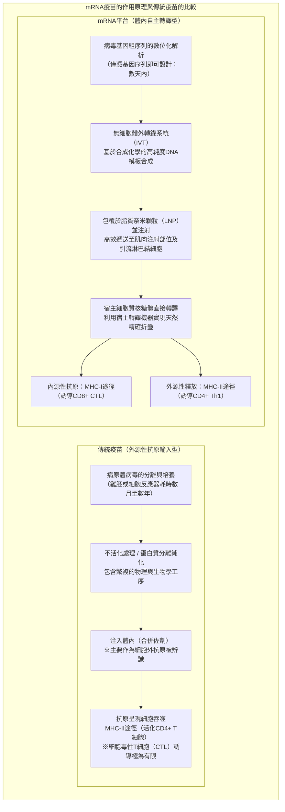
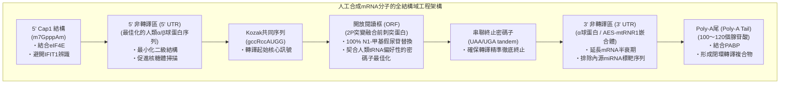
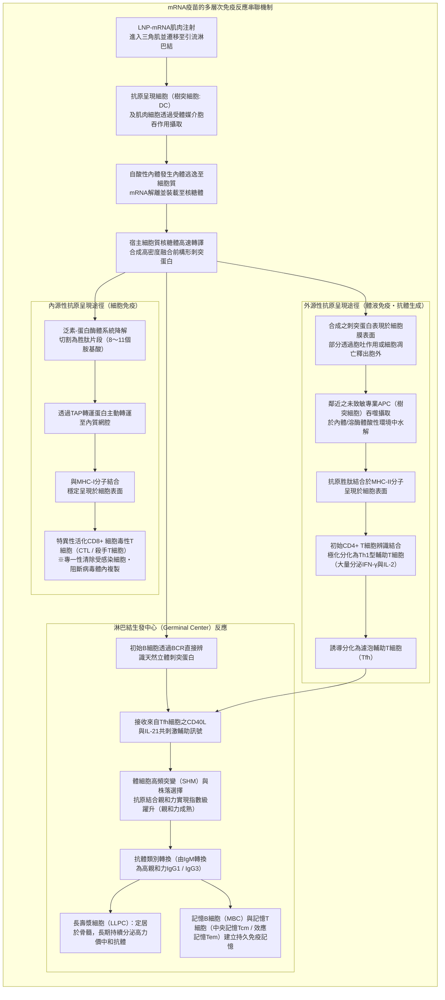
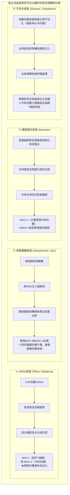

## 引言：mRNA革命 ——「脆弱分子」開創的人類史上最快疫苗研發

2020年1月，在中國武漢爆發的一種未知呼吸道傳染病的病原體「SARS-CoV-2」的全基因組序列（約30,000個鹼基）在網路上公佈。僅僅42天後，美國莫德納（Moderna）公司便將首批臨床試驗用疫苗小瓶「mRNA-1273」交付美國國家衛生研究院（NIH）；隨後，與德國BioNTech及美國輝瑞（Pfizer）聯合研發團隊的「BNT162b2」攜手，以人類歷史上前所未有的雷霆速度，在短短11個月內完成了大規模III期臨床試驗並獲得緊急使用授權（EUA）。

傳統疫苗研發 —— 無論是依賴雞胚培養或巨型生物反應器細胞培養的減毒活疫苗、不活化疫苗，還是重組蛋白疫苗 —— 從病毒分離、病毒株篩選、培養製程最佳化到安全性驗證，通常需要 **10年至15年** 的漫長時間和天文數字般的研發成本，這曾是醫藥界不可動搖的「常識」。

然而，mRNA技術從根本上顛覆了這一常識。該技術的本質在於，將疫苗從「在體外耗時培養、純化抗原蛋白後再注入人體的工業製品」，重新定義為 **「將目標抗原蛋白的設計藍圖（數位化遺傳代碼）暫時性載入宿主細胞自身系統，把活體組織轉變為自製抗原工廠的軟體化生物平台」** 。



### 中心法則中mRNA的暫時性與「基因組修飾的不可行性」

針對社會上曾出現的「接種mRNA疫苗是否會改變人體遺傳基因（DNA）」的疑慮，分子生物學的基石原理 **「中心法則（Central Dogma）」** 給出了清晰而確鑿的科學解答。

在真核生物中，遺傳資訊的流動遵循 **DNA（細胞核） → 轉錄（Transcription） → mRNA（運出細胞核） → 轉譯（Translation） → 蛋白質（細胞質）** 這一不可逆的單向路徑。外源輸入的mRNA直接在細胞質中的核糖體上完成轉譯，合成目標刺突蛋白。
1. **缺乏核定位訊號**: 人工合成的mRNA不含穿透細胞核核孔複合物所需的核定位訊號，只能停留於細胞質中。
2. **缺乏反轉錄酶與嵌合酶**: 將單股RNA反轉錄為雙股DNA需要反轉錄病毒特有的「反轉錄酶（Reverse Transcriptase）」，而嵌入宿主基因組則必須依賴「嵌合酶（Integrase）」。健康的人體細胞內根本不存在這些酵素（即便在實驗室極端過度表現條件下探討內源性反轉錄轉座子LINE-1反轉錄可能性的試管實驗，在生理條件下的活體內也從未發現任何嵌入宿主基因組的證據）。
3. **體內的快速自然降解機制**: mRNA本質上屬於高度不穩定的分子，會在數小時至數天內被細胞內的核糖核酸酶（RNase）徹底水解為普通的核苷酸並參與機體正常代謝，完全從體內清除。

換言之，mRNA疫苗宛如 **「在指導合成蛋白質後便自行銷毀的限時暫時性密碼指令」** ，從根本原理上完全不可能對宿主的基因組DNA造成任何永久性修飾。

---

## 第1章：40年的艱苦求索與突破 —— 將mRNA轉化為藥物的科學家們

2020年mRNA疫苗的閃電問世，絕非一朝一夕偶然降臨的奇蹟。其背後凝聚著數代科學家在飽受學界質疑、研究經費屢遭削減的逆境中，長達40餘年對RNA分子機制不懈鑽研的基礎研究累積。2023年諾貝爾生理學或醫學獎授予 **卡塔琳·考里科（Katalin Karikó）** 博士與 **德魯·魏斯曼（Drew Weissman）** 博士，正是對這一偉大基礎科學長征的至高致敬。

### 1.1 早期mRNA研究的絕望壁壘：極度不穩定性與致死性先天免疫反應

自1961年弗朗索瓦·雅各布（François Jacob）與西德尼·布倫納（Sydney Brenner）等人首次發現並鑑定mRNA以來，分子生物學家們便一直懷抱著一個宏大構想：「若能將人工合成的mRNA引入體內，是否就能隨心所欲地合成任何治療性蛋白質？」

然而，20世紀80至90年代開展的早期動物試驗幾乎全以慘敗告終。橫亙在早期研究者面前的有兩座難以跨越的險峰：
- **極度的物理化學不穩定性**: 在生物組織中、空氣中以及人類皮膚表面，廣泛分佈著用於防禦外來RNA病毒入侵的強力降解酶 —— **「核糖核酸酶（RNase）」** 。未受保護的裸露mRNA（Naked RNA）在注入體內的瞬間，便會被無所不在的RNase撕得粉碎，根本無法抵達細胞內部。
- **災難性的先天免疫風暴**: 即使僥倖將完整的體外轉錄RNA導入動物體內，宿主免疫系統也會立即將其判定為致命的病毒入侵，從而觸發猛烈的發炎細胞激素風暴。動物實驗中頻發嚴重休克甚至死亡，使mRNA長期被主流學界貼上「毒性劇烈、絕無可能成藥的缺陷分子」的標籤。

在大學升遷機制中屢屢受挫、研究資助多次面臨中斷的艱難歲月裡，匈牙利裔生物化學家卡塔琳·考里科在賓州大學簡陋的實驗室中，始終堅信「RNA中潛藏著重構醫學的巨大未知力量」。

### 1.2 考里科與魏斯曼的歷史性發現（2005年）：透過尿苷修飾規避TLR受體

1997年，考里科在影印機旁偶然結識了免疫學家德魯·魏斯曼。魏斯曼當時致力於透過研究樹突細胞（Dendritic Cells, DC）的抗原呈現功能來研發愛滋病（HIV）疫苗。兩人一拍即合，隨即展開了利用mRNA活化樹突細胞的聯合攻關。

他們所面對的核心謎題是： **「為什麼機體自身的轉運RNA（tRNA）和核糖體RNA（rRNA）不會招致免疫系統的瘋狂攻擊，而體外轉錄（In Vitro Transcription, IVT）合成的mRNA卻會劇烈刺激樹突細胞並誘發毀滅性發炎？」**

在哺乳動物的細胞膜表面與內體膜上，分佈著專門辨識外源病原體核酸模式的天然先天免疫感測器 —— **「類鐸受體（Toll-like Receptors, TLR）」** ：
- **TLR3**: 專門辨識雙股RNA（dsRNA）。
- **TLR7 / TLR8**: 辨識富含未修飾尿苷（U）的單股RNA（ssRNA）。
- **RIG-I / MDA5**: 在細胞質中監測外源性5'三磷酸RNA及長鏈雙股RNA，活化下游訊號傳遞路徑並強力誘導I型干擾素（IFN-α/β）轉錄。

考里科與魏斯曼敏銳地注意到，哺乳動物細胞內的內源性RNA普遍富含 **「化學修飾鹼基」** 。生物體內的tRNA和rRNA在轉錄後經歷了極為多樣的甲基化、異構化等修飾；而以往IVT反應合成的mRNA，僅由未修飾的四種標準鹼基（A、C、G、U）機械組成。

2005年，兩人發表了載入生命科學史冊的劃時代論文： **當將體外轉錄mRNA中的「尿嘧啶核苷（Uridine）」完全替換為轉錄後天然修飾核苷「假尿苷（Pseudouridine, Ψ）」後，其對TLR7、TLR8及細胞內RNA感測器的活化被徹底阻斷，原本致命的劇烈發炎反應奇蹟般地完全消失！**

### 1.3 從假尿苷到「N1-甲基假尿苷（m1Ψ）」的進化

考里科與魏斯曼的突破遠不止於平息免疫風暴。令人驚嘆的是，經過修飾的mRNA在進入細胞質後，核糖體對其的轉譯效率竟然實現了數倍乃至數十倍的爆炸式增長。

當含有未修飾尿苷的外源mRNA侵入細胞時，細胞內免疫感測器的活化會誘發 **PKR（蛋白激酶R）** 與 **2'-5'寡腺苷酸合成酶（OAS）** 的活化。PKR會使轉譯起始因子 **eIF2α** 發生磷酸化，全面抑制細胞內的整體蛋白質合成；OAS則會活化 **RNase L** ，無差別降解細胞質內的RNA分子（典型的細胞抗病毒自我防衛反應）。

然而，假尿苷修飾徹底避開了這些細胞防禦哨兵的雷達，使得核糖體能夠穩定、平滑且持久地對進入細胞質的mRNA模板進行連續高效轉譯。

進入2010年代後，以BioNTech和Moderna為代表的生技新銳團隊對化學修飾展開了更深層次的高通量篩選，最終鎖定了在假尿苷1號位氮原子上引入甲基的全新衍生物 —— **「N1-甲基假尿苷（m1Ψ: N1-methylpseudouridine）」** ：
- m1Ψ在不干擾核糖體解碼中心密碼子-反密碼子鹼基配對的前提下，能有效消除RNA過度緊密的有害二級結構。
- 它將對TLR7/8的親和力壓制到極致，在全序列實現未修飾尿苷100%完全替代後，能夠使活體組織內的蛋白質表現量達到空前的高度。
輝瑞/BioNTech的BNT162b2與莫德納的mRNA-1273，均毫無保留地將這一 **100%全序列m1Ψ替代技術** 確立為核心工業標準。

### 1.4 刺突蛋白穩定化的里程碑：巴尼·格雷厄姆與傑森·麥克萊倫的「2P突變」

與mRNA免疫逃避及轉譯增強並駕齊驅、共同奠定COVID-19疫苗奇蹟的另一項諾貝爾級結構生物學重大貢獻，當屬 **透過「2P突變（Two-Proline Substitution）」將刺突蛋白剛性鎖定於融合前構形（Prefusion Conformation）** 。

冠狀病毒表面突出的 **刺突糖蛋白（Spike Protein, S蛋白）** ，是病毒精準結合宿主細胞ACE2受體並侵入細胞的「關鍵鑰匙」。刺突蛋白是一種高度動態的分子彈簧結構，在與宿主細胞膜發生融合前後會經歷劇烈的不可逆構形重塑：
- **融合前構形（Prefusion Conformation）**: 呈緊湊的三聚體形態，其頂部的受體結合域（Receptor-Binding Domain, RBD）完全暴露，呈現出大量能誘導 **「高效強效中和抗體」** 的關鍵構形表位。
- **融合後構形（Postfusion Conformation）**: 與細胞膜發生融合後發生的不可逆構形崩塌，轉變為細長針狀形態。針對此構形誘導產生的抗體，其中和病毒感染的能力極其低下。

美國國家過敏和傳染病研究所（NIAID）的 **巴尼·格雷厄姆（Barney Graham）** 與德克薩斯大學奧斯汀分校的 **傑森·麥克萊倫（Jason McLellan）** 團隊，早在對MERS（中東呼吸症候群）和SARS-CoV-1的長期冷凍電鏡（Cryo-EM）結構生物學解析中發現：只要在冠狀病毒刺突蛋白S2亞基鉸鏈區（中央螺旋頂部，第986位和987位的離胺酸與纈胺酸）人工引入 **兩個連續的「脯胺酸（Proline: P）」突變** ，就能從物理立體構形上強行卡死該分子彈簧， **將整個刺突蛋白永久凍結在極其穩定的融合前構形** 。

2020年1月SARS-CoV-2全基因組序列公開的瞬間，研究人員在數小時內便將成熟的「2P突變」設計公式遷移到新病毒的基因中。
透過讓mRNA在人體細胞內轉譯表現穩定的2P刺突蛋白突變體（K986P、V987P），成功以最完美的立體三維構形、最高密度地向宿主免疫系統呈現了最具保護價值的中和抗原標靶。

---

## 第2章：mRNA分子的精密構架 —— 人工合成mRNA的分子設計工程

醫用級治療性mRNA絕非簡單機械地複製天然病毒序列，而是經過了精密的分子生物工程最佳化，旨在最大限度提高核糖體轉譯速率並精準控制細胞內降解週期的 **「人工工程化生物大分子（Engineered Biopolymer）」** 。



### 2.1 5' 帽子結構（從Cap0到Cap1）：細胞內自我辨識與轉譯起始

真核生物成熟mRNA的5'端擁有一處特徵性的 **「7-甲基鳥苷（m7G）帽子結構」** 。在人工mRNA工程中，該帽子結構的化學純度與甲基化位點具有決定生死的戰略意義：
- **Cap0型（m7GpppN）**: 屬於最基礎的帽子結構。高等脊椎動物細胞質中配備有嚴密的抗病毒模式辨識感測器 —— **「IFIT1（帶有十四肽重複序列的干擾素誘導蛋白1）」** ，它能敏銳辨識Cap0並將其判定為外來病毒RNA，從而立即鎖死轉譯過程。
- **Cap1型（m7GpppNm）**: 在緊鄰帽子的第1位核糖2'-O位完成甲基化修飾（2'-O-methylation）。這是真核生物辨識「自體mRNA」的天然分子身分證，能徹底規避IFIT1的監視阻截。

輝瑞/BioNTech與Moderna疫苗在合成中均全面採用了共轉錄加帽類似物技術（如CleanCap®技術），在體外轉錄階段即可實現 **超過95%的高純度、高均一性Cap1結構** 。這一結構能夠強力招募真核轉譯起始複合體 **eIF4F（由eIF4E、eIF4G、eIF4A構成）** ，引導核糖體40S小亞基以極快速度裝載至5'端。

### 2.2 5' 與 3' 非轉譯區（UTR）的最佳化

不編碼蛋白質序列的 **5' UTR** 與 **3' UTR** ，實際上是決定mRNA在細胞內空間定位、核糖體掃描滑動速度以及mRNA物理降解半衰期的精密控制中心：
- **5' UTR工程化設計**: 過長的序列或極易形成緊密髮夾環、G-四聯體（G-quadruplex）等高級二級結構的片段，會在物理上阻滯核糖體的沿鏈掃描。因此，設計中普遍採用高度解聚、無障礙掃描的人源 **α-球蛋白** 或 **β-球蛋白** 的天然高表現UTR作為骨架基礎。
- **3' UTR工程化設計**: 為了最大限度延緩胞內脫腺苷酸酶與核酸內切酶的進攻，同時防止宿主內源性微小RNA（miRNA）造成不可預期的轉譯抑制，研發人員深入篩除了所有潛在的miRNA種子結合位點，並融入了人源α-球蛋白UTR或AES（胺基酸增強子）與粒線體mtRNR1構建的嵌合穩定序列。

### 2.3 開放閱讀框（ORF）與密碼子最佳化

承載完整刺突蛋白胺基酸編碼序列的ORF區域，融合了前沿計算生物學與生物資訊學的 **「密碼子最佳化（Codon Optimization）」** 演算法。

由於遺傳密碼的簡併性，同一種胺基酸可由多個不同的同義密碼子編碼。SARS-CoV-2野生型病毒基因組所偏好的密碼子使用頻率，與人體成熟細胞質的密碼子環境（Codon Bias）存在顯著差異：
1. **契合人類高豐度tRNA庫**: 將病毒序列中的稀有密碼子全局替換為對應於人類細胞質中豐度最高的tRNA密碼子，極大消除了核糖體解碼時的停頓等待，使轉譯延伸速率（Elongation Rate）最大化。
2. **戰略性提高GC含量**: 大幅調高RNA序列中的鳥嘌呤（G）和胞嘧啶（C）百分比，在增強mRNA熱力學穩定性的同時，有效清除了潛在的隱蔽剪接位點與提前多聚腺苷酸化訊號。
3. **消除雙股RNA（dsRNA）副產物**: 體外轉錄（IVT）過程中，T7 RNA聚合酶的回退轉錄會產生微量免疫原性極強的dsRNA雜質。除從序列演算法層面削減髮夾互補傾向外，工業化純化環節還必須引入嚴苛的高效液相層析（HPLC）或纖維素純化製程予以徹底剝離。

### 2.4 Poly-A尾與「閉環模型」

連接在3'末端的長串腺苷酸殘基序列 **「Poly-A尾（Poly-A Tail）」** ，承擔著調控mRNA胞內壽命的分子沙漏角色：
- 在細胞質中，Poly-A尾被 **多聚腺苷酸結合蛋白（PABP）** 緊密結合包覆。
- 結合在5'端帽子的eIF4G與結合在3'端Poly-A尾的PABP透過強力蛋白交互作用，驅動單股mRNA形成空間上的 **「閉環模型（Closed-Loop Model）」** 環狀轉譯機器。
- 在這種閉環拓撲結構下，核糖體在ORF末端完成轉譯釋放多肽鏈後，能立即就近跳轉回5'端起始位點開啟下一輪循環，使同一條mRNA分子被高頻重複轉譯數千次。
- 此外，閉環構造還在空間上物理屏蔽了外切核酸酶的進攻。在輝瑞與Moderna的工業設計中，Poly-A尾的長度均被嚴格鎖定在約100至120個核苷酸的最佳功能區間。

---

## 第3章：突破生理屏障的奈米運輸載體 —— 脂質奈米顆粒（LNP）工程學

哪怕設計出世間最完美的mRNA分子，若沒有可靠的運載載體將其毫髮無損地送入標靶細胞內部，其在生物體內也發揮不出一微克的作用。將mRNA從實驗室構想推進為現實臨床藥物的真正工業基石，正是直徑約80至100奈米的 **「脂質奈米顆粒（Lipid Nanoparticles, LNP）」** 。

### 3.1 為什麼無法直接注射裸mRNA（Naked RNA）

如果將裸露的未包覆mRNA直接注入人體肌肉組織，其免疫防護效益幾乎為零。這源於人體固有的兩道堅不可摧的理化生物屏障：
1. **強烈的同電荷靜電排斥**: mRNA的磷酸二酯骨架帶有密集的強負電荷（多聚陰離子）。與此同時，人體所有細胞膜表面的磷脂雙分子層親水頭部及糖萼基質同樣帶有淨負電荷，二者在庫侖靜電力作用下產生強大的物理排斥。
2. **體液中RNase的毫秒級絞殺**: 無論是血液還是細胞間質液，都充斥著高活性的內源RNase，裸露mRNA在體內的消除半衰期往往不足數分鐘。

因此，研發出一種既能對mRNA負電荷提供屏蔽保護、又能順利跨越細胞膜並最終釋放至細胞質的「奈米級特洛伊木馬」，是整個領域的關鍵突破點。

### 3.2 構成LNP的「四大黃金脂質」的角色與化學結構

獲准上市的輝瑞/BioNTech與Moderna疫苗所採用的LNP配方，均由四種經過極為嚴密微積分莫耳比計算的 **功能性脂質分子** 精準組裝而成。

```
【LNP的四大核心脂質組成】
1. 可游離陽離子脂質 (Ionizable Cationic Lipid) 〜 約46-50 mol%
2. 輔助磷脂 (Helper Lipid: DSPC) 〜 約10 mol%
3. 膽固醇 (Cholesterol) 〜 約38-43 mol%
4. PEG化脂質 (PEGylated Lipid) 〜 約1.5-1.7 mol%
```

| 脂質成分 | 代表性分子（輝瑞 / 莫德納） | 配比莫耳百分比 (mol%) | 物理化學核心特性 | 在體內的決定性生物學功能 |
| :--- | :--- | :--- | :--- | :--- |
| **可游離陽離子脂質<br/>(Ionizable Lipid)** | **ALC-0315** (Pfizer)<br/>**SM-102** (Moderna) | **約 46 〜 50%** | 表觀pKa嚴格控制在 **6.0〜6.8** 。在酸性環境中帶正電，在生理中性環境中呈電中性。具備三級胺頭基與易於體內水解代謝的生物可降解酯鍵骨架。 | ① 在酸性配製環境下帶強正電，透過靜電壓縮將帶負電的mRNA嚴密包封在奈米核心中。<br/>② 進入生理pH（7.4）體液環境後轉變為電中性，消除傳統永久正電荷脂質的溶血性與細胞膜劇烈毒性。<br/>③ 在細胞內體酸性腔內重新質子化，破壞內體膜並媒介mRNA逃逸。 |
| **輔助中性磷脂<br/>(Helper Lipid)** | **DSPC**<br/>(1,2-二硬脂醯-sn-甘油-3-磷酸膽鹼) | **約 10%** | 具有極高相變溫度（約55℃）的飽和雙尾對稱磷脂分子，呈現剛性圓柱狀立體構型。 | 構建並加固LNP外周的穩定脂質雙分子層（層狀相結構），賦予奈米顆粒堅韌的機械剛性與長期膠體物理穩定性。 |
| **膽固醇<br/>(Cholesterol)** | 高純度植物來源精製膽固醇 | **約 38 〜 43%** | 剛性平面的稠環類固醇結構，伴隨極小的親水性羥基頭部，是經典的膜結構填充調節劑。 | 填充於輔助磷脂分子間隙，精細調控脂質雙層的流動性與相變狀態；促進顆粒與標靶細胞膜的融合，防止包封成分滲漏。 |
| **PEG化脂質<br/>(PEGylated Lipid)** | **ALC-0159** (Pfizer)<br/>**PEG2000-DMG** (Moderna) | **約 1.5 〜 1.7%** | 親水性聚乙二醇（PEG2000）高分子鏈透過親水端共價結合於短鏈疏水脂質錨（如二肉豆蔻醯甘油）。 | ① 憑藉親水空間位阻效應，在生產、濃縮及冷凍保存期阻止顆粒聚集融合，精確控制粒徑（約80nm）均勻單分散。<br/>② 在血液與組織液中屏蔽調理素蛋白的非特異性吸附，防止被單核-巨噬細胞系統瞬間清除。<br/>③ 短鏈脂質錨可在進入體內後緩慢從顆粒表面解離脫落，解除空間位阻以允許標靶細胞內吞。 |

### 3.3 胞吞作用與內體逃逸（Endosomal Escape）的生物物理學奇蹟

肌肉注射LNP後，從進入組織間隙到最終指導蛋白質轉譯，其整個遞送鏈條中最關鍵也是技術壁壘最高的環節，就是胞內 **「內體逃逸（Endosomal Escape）」** 。

1. **組織吸附與受體媒介胞吞**:
   注射至肌肉間隙後，LNP表面的PEG化脂質開始部分脫落，暴露出的疏水表面自發吸附體液內源性 **載脂蛋白E（ApoE）** 。這一偽裝使得LNP能夠完美模擬天然低密度脂蛋白，透過與抗原呈現細胞（樹突細胞、巨噬細胞）及肌肉細胞膜表面的 **低密度脂蛋白受體（LDLR）** 特異性結合，以受體媒介的胞吞作用被包裹進入細胞，形成早期內體（Early Endosome）。
2. **內體酸化與質子泵驅動**:
   隨著內體從早期內體向晚期內體逐漸成熟並向溶酶體方向演變，內體膜上的液泡型質子泵（V-ATPase）不斷向腔內泵入氫離子，導致內腔pH從生理中性（7.4）迅速驟降至酸性（pH 6.5 → 5.5甚至更低）。
3. **可游離脂質的電荷反轉與「質子海綿效應」**:
   由於LNP中可游離脂質的表觀pKa精準設計在6.0〜6.8之間，在內體的酸性環境中，分子頭部的三級胺基團迅速結合大量質子（$H^+$），整個顆粒表面發生戲劇性的相轉變 —— **從電中性瞬間翻轉為密集的強正電荷狀態** 。
4. **膜融合相變誘導與mRNA釋放**:
   質子化帶強正電的可游離脂質，與內體膜內側天然富集的負電荷錐形磷脂（如磷脂醯絲胺酸、磷脂酸等）發生劇烈的靜電結合與空間擠壓。這一過程強行瓦解了內體膜原本穩定的雙層層狀結構，誘導出致命的非雙層結構 —— **「反六角相（Hexagonal II phase: $H_{II}$ 相）」** 。伴隨著局部膜結構的瓦解以及質子大量湧入引起的滲透壓失衡（質子海綿效應），內體膜破裂開闢出奈米級通道，被包覆的完整mRNA分子得以毫髮無損地 **逃逸進入細胞質（Cytosol）的核糖體庫中** 。

現代前沿奈米生物學研究表明，儘管被胞吞的LNP中只有 **數個百分點至十幾個百分點** 的mRNA能夠成功完成逃逸，絕大多數最終仍被轉運至溶酶體降解；但鑑於mRNA極其驚人的轉譯倍增效能，這極小一部分成功突圍的mRNA分子，已足以在胞質內爆發性合成數以百萬計的刺突蛋白，爆發出極其強烈的免疫致敏效應。

### 3.4 微流體混合技術（Microfluidic Formulation）

支撐數十億劑LNP高品質標準化連續製造的工業底座，是 **「微流體對撞技術（Microfluidics）」** 的成熟。

在過去，利用傳統燒杯機械攪拌或高壓均質乳化等粗放方式製備的微脂體，存在粒徑分佈極寬（多分散指數過高）、包封率低下且批次間差異巨大的致命缺陷。
現代mRNA疫苗的生產管線全面採用了精密微流體晶片：在僅數十微米寬的工程流道（如交錯人字形微混合器）內，將 **「溶解有四大脂質的高純度無水乙醇相」** 與 **「溶解有精製mRNA的酸性檸檬酸鹽水相緩衝液」** ，以毫秒級的精確流速比（通常為1:3）高速對撞。

在微米尺度下極度劇烈的受控對流擴散混合中，乙醇在毫秒內被水相稀釋，脂質溶解度驟降引發瞬間自組裝成核。帶正電的可游離脂質以閃電般的速度捕獲並壓縮帶負電的mRNA骨架形成疏水緻密核心，外周則自發包覆形成以DSPC、膽固醇和PEG脂質構成的保護殼層。這一製程能夠在毫秒級別內實現 **平均粒徑嚴格控制在80〜100nm、mRNA包封率突破90%、多分散指數極窄（PDI < 0.1）** 的頂尖批次品質一致性。

---

## 第4章：多層次免疫反應串聯機制 —— 從細胞質轉譯到全身系統性免疫的建立

mRNA疫苗之所以在保護效力上徹底超越傳統不活化疫苗與重組次單位疫苗，其最根本的免疫學精髓在於： **「在活體內實現了內源性抗原與外源性抗原的雙重呈現，同時引爆了MHC-I與MHC-II兩條免疫路徑的協同活化」** 。



### 4.1 局部肌肉組織與引流淋巴結中的高效攝取與高水準表現

經三角肌肌肉注射後，絕大多數LNP顆粒會透過肌間隙組織液流動，在數小時至數天內迅速引流匯集至區域所屬淋巴結（主要為腋下淋巴結群）。
- 雖然局部的骨骼肌細胞也會內吞部分LNP並在肌纖維膜上短暫表現刺突蛋白，但真正承擔啟動免疫反應歷史使命的核心力量，是駐留於局部組織的組織巨噬細胞以及密集駐紮在引流淋巴結中的 **「專業抗原呈現細胞（Professional APCs）」 —— 樹突細胞（DC）** 。
- 樹突細胞直接在自身的胞質中利用宿主核糖體轉譯新生的2P刺突蛋白。新合成的多肽鏈經歷宿主內質網和高基氏體極其嚴格天然的轉譯後修飾（精確的雙硫鍵配對與複雜糖基化），以與天然真實病毒表面完全一致的三聚體立體形態跨膜錨定表現。

### 4.2 MHC-I途徑對細胞毒性T細胞（CD8+ CTL）的顯著誘導

傳統不活化疫苗或重組蛋白疫苗是從細胞「外部」注入外源蛋白質抗原，因此幾乎只能低效率地活化下文所述的MHC-II途徑， **極難誘導出能夠直接搜索、精準殺滅已被病毒感染細胞的專一性殺手T細胞（CD8+ CTL）** 。

而mRNA疫苗最無可比擬的絕招，就在於它讓抗原在 **「細胞內部（細胞質）」** 本地化合成：
1. **泛素-蛋白酶體途徑水解**: 細胞質中合成的新生刺突蛋白，一部分因細胞自身品質監控機制而被泛素化標記，隨後送入 **蛋白酶體（Proteasome）** 降解機器，被精確切割為長度為8至11個胺基酸的短肽核心表位。
2. **TAP主動跨膜轉運**: 這些短肽片段被抗原處理相關轉運蛋白（ **TAP** ）逆濃度梯度主動泵入內質網（ER）腔內。
3. **裝配並呈現於MHC-I分子**: 在內質網中，抗原多肽被嵌入新合成裝配完成的 **MHC-I分子（人類白血球抗原HLA-A、B、C）** 的抗原結合溝槽中，形成穩定的MHC-I/抗原肽複合物，經高基氏體分泌小泡轉運並牢固錨定在細胞外膜表面。
4. **強效初次免疫啟動（Priming）CD8+ CTL**: 淋巴結中遊弋的初始CD8+ T細胞透過其表面的T細胞受體（TCR）高度專一性辨識這一複合物，並在共刺激分子（CD80/CD86結合CD28）的強力驅動下全面甦醒，發生爆發性株落擴增，分化為凶猛的 **效應性細胞毒性T淋巴細胞（CTL）** 。

這一強大且無可替代的CTL細胞免疫防禦壁壘，正是日後面對變異株突變導致中和抗體大部分失效時， **「依然能堅不可摧地守護人體、阻斷重症與死亡的最後戰略防線」** 的免疫學核心支柱。

### 4.3 MHC-II途徑與Th1型輔助T細胞的極化

在啟動細胞免疫的同時，細胞質內合成的刺突蛋白在細胞經歷生理性凋亡或胞吐釋放過程中散逸至細胞外。
- 鄰近尚未被mRNA轉染的專業樹突細胞透過巨胞飲或受體媒介吞噬將其攝入胞內，在酸性內體/溶酶體腔內被組織蛋白酶等水解為長度為13至18個胺基酸的長肽片段。
- 這些長肽片段與 **MHC-II分子（HLA-DR、DQ、DP）** 結合，呈現至細胞外表面。
- 初始CD4+ T細胞辨識此複合物後，由於LNP脂質骨架自帶輕微溫和的天然佐劑效應（適度誘導微量先天免疫微環境），被引導分化為具有高度抗病毒防禦效能的 **「Th1型輔助T細胞」** （能夠強力分泌干擾素-γ和介白素-2），而非媒介過敏反應的Th2型。這種嚴格偏向Th1的免疫極化，徹底避免了下文將要論述的災難性疫苗相關疾病加重（VAED）風險。

### 4.4 生發中心（Germinal Center）的長期維持與B細胞親和力成熟

在整個mRNA疫苗激發的免疫畫卷中，最精妙且極具持久生命力的篇章，發生於引流淋巴結皮質深處所誘導生成的 **「生發中心（Germinal Center, GC）」** 反應。

1. **天然三維表位的直接辨識**: 駐留在淋巴結濾泡區的初始B細胞，利用其細胞表面的B細胞受體（BCR），能夠直接牢牢結合濾泡樹突細胞表面呈現的未變性、天然立體融合前刺突蛋白三聚體。
2. **濾泡輔助T細胞（Tfh）的強力奧援**: 攝取抗原後的B細胞迅速遷移至生發中心，接受已完成特化分化的 **Tfh細胞（濾泡輔助T細胞）** 透過CD40L配體與介白素-21（IL-21）傳遞的強力存活及增殖分化訊號。
3. **體細胞高頻突變（SHM）與嚴酷株落演變**:
   - 在生發中心的暗區（Dark Zone），B細胞在活化誘導胞苷脫氨酶（AID）的作用下，以極其罕見的頻率在其抗體可變區基因中主動引入密集的隨機點突變（ **體細胞高頻突變，SHM** ），同時以極高的分裂速率呈指數擴增。
   - 隨後變異的B細胞株落轉移至明區（Light Zone），圍繞有限的刺突蛋白抗原展開極其殘酷的競爭性「掠食測試」（Selection）。
   - 唯有那些因突變獲得了對刺突蛋白更強、更精準物理結合力（親和力成熟，Affinity Maturation）的「菁英B細胞」，才能成功爭奪到來自Tfh細胞的存活訊號；結合力弱或結合失敗的B細胞則被立即啟動細胞凋亡淘汰清除。
4. **類別轉換與終末分化為長壽漿細胞及記憶細胞**:
   - 優勝劣汰的B細胞經歷抗體恆定區的基因重組（類別轉換，Class Switching），從最初低親和力的IgM進化為具備極強組織滲透力與病毒中和能力的 **超高親和力IgG（以IgG1與IgG3亞型為主）** 。
   - 勝出的最頂級B細胞一部分終末分化為 **長壽漿細胞（LLPC: Long-Lived Plasma Cells）** ，歸巢並長期駐留在骨髓微環境中，數月至數年如一日地以每秒數千個分子的速率向循環血液中源源不絕噴射高濃度中和抗體。
   - 另一部分分化為駐留於脾臟和全身淋巴結的 **記憶B細胞（MBC）** ，長期嚴陣以待，隨時準備在未來遇到變異病毒侵襲的瞬間重新甦醒並快速生產針對突變株的多樣化抗體。

人類引流淋巴結細針抽吸活檢（Fine-Needle Aspiration）臨床研究證實，接種mRNA疫苗所誘發的生發中心反應活躍期，能夠 **在初次免疫後異乎尋常地持續維繫長達6個月以上** ，為機體提供了傳統疫苗難以企及的高品質抗體進化培育溫床。

---

## 第5章：臨床實證醫學證據、保護效力演變與變異株阻擊戰

### 5.1 III期大規模臨床試驗結果：95%保護效力的震撼

2020年11月至12月，國際權威醫學頂尖期刊《新英格蘭醫學雜誌（NEJM）》先後重量級發表了輝瑞/BioNTech（Polack等人）與Moderna（Baden等人）的全球多中心III期隨機對照臨床試驗報告，在整個國際醫學界掀起了滔天巨浪：
- **輝瑞/BioNTech（BNT162b2: 43,448名受試者）**: 在安慰劑對照組出現162例有症狀COVID-19確診病例時，疫苗接種組僅出現8例，實現了 **發病預防有效率 95.0%（95% CI: 90.3–97.6%）** 的驚世戰績；重症病例在安慰劑組為9例，接種組僅1例。
- **Moderna（mRNA-1273: 30,420名受試者）**: 安慰劑組共錄得185例確診（其中30例重症，1例死亡），疫苗組僅發生11例（重症0例）， **發病預防有效率高達 94.1%（95% CI: 89.3–96.8%）** ，重症保護率達到100%。

在此之前，美國食品藥物管理局（FDA）與世界衛生組織（WHO）設定的緊急使用許可門檻僅為「保護率達到50%以上」。考慮到常規季節性流感疫苗的平均保護率通常徘徊在40%至60%之間，mRNA疫苗面對一種全新突發致命病毒所斬獲的「95%」效力，是一場遠遠超越國際所有頂尖傳染病專家預期的歷史性偉大勝利。

### 5.2 相對危險度降低率（RRR）與絕對危險度降低率（ARR）的統計學辨析

在臨床試驗數據公佈後，社會輿論中一度出現了統計學誤讀與曲解，宣稱「95%只是所謂的相對危險度降低率（RRR），而絕對危險度降低率（ARR）只有微不足道的1%左右，因此疫苗根本沒有用處」。

有必要從實證流行病學統計學原理上予以徹底澄清：
- **RRR（相對危險度降低率，Relative Risk Reduction）**: 安慰劑組的發病率 $I_p$ 與接種組發病率 $I_v$ 之間相對下降的幅度：
  $$RRR = \frac{I_p - I_v}{I_p} \times 100\% = \frac{0.0088 - 0.0004}{0.0088} \approx 95\%$$
  該指標純粹反映了 **「該生物製劑能夠削減病原體致病力與發病機率的生物學/免疫學內在效能」** 。
- **ARR（絕對危險度降低率，Absolute Risk Reduction）**: 在臨床試驗特定的短暫觀察期內（通常為2至3個月），全人群中發病百分比的絕對數值差：
  $$ARR = I_p - I_v \approx 0.88\% - 0.04\% = 0.84\%$$
- **流行病學統計學真諦**:
  ARR的大小高度依賴於試驗期內 **「全社會人群所處的感染流行強度與暴露基線率（背景發病率）」** 。若在一個社會面極度清零、人人居家隔離、病毒傳播幾近停滯的環境中開展試驗，哪怕研製出一款100%能夠絕對阻斷感染的「上帝疫苗」，測得的ARR也注定會低於0.1%。相反，當病毒大面積流行爆發、全社會有20%的人口遭受實質暴露時，該疫苗帶來的ARR將瞬間暴增至 $20\% \times 95\% = 19\%$ （即每接種約5個人就能直接挽救1人免於罹病）。
  因此，拿試驗觀察窗口內的微小ARR來否定疫苗的生物學保護力，是混淆了「內在生物保護力」與「外界環境暴露率」的典型流行病學認知謬誤。

### 5.3 真實世界研究證據（RWE）：國家級大規模數據揭示的客觀事實

當疫苗從臨床試驗理想嚴密的象牙塔走向現實中紛繁複雜的千萬級真實社會（涵蓋高齡衰弱老人、多重嚴重慢性病患者以及器官移植免疫抑制人群）時，其實際表現究竟如何？

全球最早依託國家醫療網絡推行全民接種的 **以色列（基於Clalit Health Services涵蓋120萬人的大型配對世代研究，Dagan等人，NEJM 2021）** ，聯合英國衛生安全局（UKHSA）以及美國CDC發布的超大規模真實世界追蹤數據，確立了如下幾大決定性定論：
1. **對早期病毒株具有極高的臨床防護效果**: 面對野生型原始株及隨後的Alpha變異株，真實世界中針對有症狀感染的防護率依然穩固在90%以上，對住院和死亡的保護效力超越95%。
2. **感染防護率存在隨時間減弱的生理規律**: 接種後4至6個月，伴隨循環血液中特異性中和抗體的正常生理衰減半衰期，針對有症狀輕症感染的阻斷效能逐漸下行滑落至60%至70%區間。
3. **針對重症與死亡的防護構築起固若金湯的堅實長城**: 與輕症防線的退縮形成鮮明對比的是，預防重症住院、氣管插管及死亡的重症防護效能，在抗體力價明顯下降後依然長達數月保持在85%至90%以上的卓越高位。這背後的免疫學機制在於：即便血液表層抗體濃度下降，一旦病毒突破上呼吸道黏膜，骨髓與淋巴結內的特異性記憶B細胞可在數日內被迅速活化並重新分泌海量中和抗體；更重要的是， **深層浸潤的CD8+ CTL細胞毒性T細胞能夠對肺泡深部受感染細胞展開定點清除** ，有效封鎖病毒向全身惡化擴散的致命路徑。

### 5.4 變異株浪潮與免疫逃避：中和抗體的低下與T細胞的穩健性

隨著全球大流行的持續肆虐，SARS-CoV-2在宿主免疫選擇壓力的驅趕下，展現出了驚人的基因變異演化速度。

| 變異株譜系 | 關鍵核心突變位點（RBD等區域） | 體外中和抗體敏感性（相對原始株） | 完成兩劑接種時的感染預防效力 | 完成兩劑接種時的重症預防效力 | 追加劑（第3劑/更新株）接種效能 |
| :--- | :--- | :--- | :--- | :--- | :--- |
| **武漢原始株<br/>(Wuhan-Hu-1)** | 參考基準（無變異） | **1.0倍** （基準） | **約 95%** | **約 95% 以上** | 抗體力價爆發式飆升數倍至十幾倍 |
| **Alpha株<br/>(Alpha: B.1.1.7)** | N501Y, P681H | **輕微下降約 1.5 〜 2倍** | **約 85 〜 90%** | **約 95%** | 針對感染及重症保護均維持極高水準 |
| **Delta株<br/>(Delta: B.1.617.2)** | L452R, T478K, P681R | **顯著下降約 3 〜 6倍** | **約 60 〜 75%** (隨時間衰減) | **約 90%** | 接種第3劑後發病保護力迅速回升至85%以上 |
| **Omicron早期<br/>(Omicron BA.1/BA.2)** | RBD聚集超15處胺基酸突變<br/>(K417N, E484A, N501Y等) | **斷崖式暴跌 20 〜 40倍** | **約 20 〜 40%** (2劑對感染防線基本失守) | **約 70 〜 80%** (T細胞免疫牢牢托底) | 接種第3劑同源追加劑後，發病防護回升至65〜75%，重症防護重返90%以上高位 |
| **Omicron分支<br/>(BA.4/BA.5 / XBB / JN.1)** | L452R, F486V/P, R346T<br/>受體結合親和力與免疫逃避極致化 | **既往血清抗體中和活性大面積喪失** | **僅靠初始2劑接種幾無防感染力** | **約 60 〜 70%** (基礎免疫防線維持) | 接種Omicron次世代雙價疫苗 / 單價XBB.1.5或JN.1疫苗後，重新拉高中和抗體，重症防護率穩超70〜80% |

Omicron毒株的橫空出世，徹底擊穿了完全依靠體循環中和抗體「禦病毒於國門之外（徹底阻斷感染）」的神話。Omicron刺突蛋白上密密麻麻分佈著30餘處突變，僅RBD核心區域就多達15處，這使得針對原始毒株誘導的大部分中和抗體因表位結構巨變而失去了結合點。

然而，在重症防線力挽狂瀾的，正是 **「T細胞免疫反應的廣譜多樣性」** ：
- 體液中和抗體所辨識的標靶，高度局限於刺突蛋白表面暴露的少數立體構形（構形表位，Conformational Epitopes），一旦少數幾個關鍵胺基酸發生空間突變，抗體親和力就會遭遇斷崖式下跌。
- 相比之下，T細胞所辨識的，是MHC分子加工後呈現的 **線性胺基酸短肽表位（Linear Epitopes）** ，這些表位多達數百個，均勻分散於刺突蛋白全長（1,273個胺基酸）的每一個角落。
- 人類群體的HLA（MHC）基因型具有極高的多態性，病毒在演化生物學上絕無可能同時突變掉每個人體內全部的T細胞表位。
- 國際多個頂尖團隊的深度實驗證實： **即使面對突變極多的Omicron毒株，初始mRNA疫苗在人體內建立的T細胞表位庫中，仍有80%至90%以上的表位完好無損地被完整辨識** 。這就是為什麼在Omicron感染人數呈海嘯式爆發的背景下，全球接種過疫苗人群的重症率與加護病房（ICU）收治率得以大幅降低的深層免疫學解密。

### 5.5 追加免疫（追加劑接種）與抗原更新型疫苗的研發與部署

面對中和抗體的自然衰減與病毒的突變抗原漂移，mRNA平台展現出了任何傳統疫苗平台無可比擬的 **「敏捷迭代機動性（Agility）」** ：
1. **同源追加免疫（第3劑接種）**: 僅需再次注射一劑針對原始株的mRNA，便能重新引燃淋巴結生發中心反應，迫使既往建立的記憶B細胞株落重新進行新一輪親和力成熟突變，意外衍生篩選出對Omicron株兼具強效交叉中和能力的新抗體群。
2. **雙價次世代疫苗（Bivalent Vaccines）**: 將原始株與Omicron BA.1或BA.4/5的mRNA按照1:1等莫耳濃度同時包覆，成功拓寬了免疫反應的交叉覆蓋譜系。
3. **單價抗原更新疫苗（XBB.1.5、JN.1譜系）**: 為規避可能引發的「抗原原罪（Immune Imprinting）」干擾，後續疫苗全面轉向淘汰原始株序列、僅採用最新流行株單價mRNA的設計。僅僅在電腦端修改數位化DNA鹼基編碼，在2至3個月內即可讓適應新病毒株的臨床級疫苗走下生產線，這種軟體代碼般的敏捷性，是需要漫長細胞傳代馴化的傳統製藥工業根本無法企及的技術躍遷。

---

## 第6章：安全性特徵、不良反應的病理生理學與風險效益權衡

如同任何注入人體的生物活性製劑一樣，mRNA疫苗在為機體構築起抵禦烈性傳染病堤壩（臨床獲益）的同時，也必然伴隨著一定的生理反應與潛在罕見風險（不良反應/不良事件）。唯有秉持崇高的科學誠實精神，全面揭示不良反應的病理生理學機制，並基於大數據進行嚴謹客觀的定性定量風險-效益評估，才是理性醫學的基石。

### 6.1 局部與全身反應原性（Reactogenicity）：免疫系統活化的生理代價

接種mRNA疫苗後高比例出現的局部反應（注射部位紅腫、劇烈酸痛、硬結）以及全身反應（38℃以上發燒、極度倦怠、劇烈頭痛、畏寒、肌肉關節酸痛），並非某種組織中毒壞死性病變，而是 **「機體先天免疫系統被有效激發並高速運轉的典型生理性訊號」** 。
- LNP中的微觀脂質組分及其微弱刺激作用，迅速調動了局部的樹突細胞和巨噬細胞，促使 **IL-1β、IL-6、TNF-α及I型干擾素（IFN-α/β）** 等致熱與趨化性發炎細胞激素暫時性大量釋放入血。
- 這些細胞激素順血流刺激下視丘體溫調節中樞，重置機體調定點引發發燒，並在全身骨骼肌與關節組織中引發瀰漫性酸痛反應。
- 絕大多數上述反應具有明確的自限性，於接種後24至48小時內自然緩解，且可使用乙醯胺酚（Acetaminophen）或布洛芬（Ibuprofen）等非類固醇消炎止痛藥進行對症處理。

### 6.2 心肌炎與心包膜炎（Myocarditis / Pericarditis）：流行病學與推測病理機制

伴隨數十億劑次的大規模接種，全球藥物警戒監控網絡（如美國VAERS、VSD系統，以色列衛生部資料庫，以及台灣與日本的不良反應通報系統）逐步甄別出一項具有特定人口學特徵的罕見嚴重不良事件 —— 在 **「青春期至青年男性（尤其是12至29歲男性）」** 中，接種後數天內（主要見於第2劑後）存在極低機率誘發 **急性心肌炎/心包膜炎** 的風險。

#### ① 流行病學發生率
- 在全人群總體背景下，發生率極低，約為 **每接種10萬劑次發生1至5例（約0.001%〜0.005%）** 。
- 在風險最高的亞群 —— **16至19歲年輕男性接種第2劑後** ，通報發生率約為 **每10萬劑次10至15例（約0.01%）** 。
- 臨床流行病學數據顯示，Moderna（mRNA-1273，單劑含100μg mRNA）由於其mRNA及脂質劑量高於輝瑞（BNT162b2，單劑含30μg mRNA），青年男性的心肌炎通報率在統計學上略高；為此，多數國家隨之調整指引，建議30歲以下年輕男性優先選用輝瑞BNT疫苗。

#### ② 推測的分子病理機制
目前國際心臟病學界與免疫學界普遍認可由多重病理因素交織誘發的假說：
1. **未結合游離刺突蛋白的直接刺激**: 哈佛大學Yonker等人在《Circulation》（2023年）上發表的研究揭示，發生疫苗相關心肌炎的年輕患者血漿中，檢測到了異常高水準、未與中和抗體結合的「游離完整刺突蛋白（Free Spike）」，提示其可能過度結合並刺激了心肌細胞表面的先天免疫受體。
2. **雄性素（睪固酮）的免疫放大作用**: 為何該病症具有對年輕男性的極端偏好性？實驗表明，雄激素（睪固酮）能夠顯著促進Th1型發炎因子的釋放並抑制抗炎調節細胞，而雌激素則普遍具備心臟保護及抑制發炎風暴的作用，內分泌荷爾蒙微環境的巨大落差被認為是關鍵易感因素。
3. **短暫的自體免疫交叉反應**: 極少數特異體質個體可能因分子模擬機制，短暫誘導產生了針對心肌自身結構蛋白（如α-肌球蛋白重鏈）的微量自體抗體。

#### ③ 臨床病程與「感染風險對比」
必須向公眾闡明的一個決定性醫學事實是： **絕大多數（90%以上）疫苗相關性心肌炎患者臨床表現輕微，僅需使用NSAIDs（非類固醇抗發炎藥）等常規保守治療，在入院後數天至一週內心功能即可完全恢復，預後極為良好** （進展為猛爆性嚴重急性心臟衰竭或死亡者屬極其罕見的極端個例）。
更為關鍵的是，大規模前瞻性對照世代數據無可辯駁地表明： **「未接種疫苗的人體在實際感染SARS-CoV-2病毒後，發生嚴重併發心肌受損、心律不整乃至心臟衰竭的絕對風險及死亡率，比接種疫苗誘發心肌炎的風險高出數倍乃至數十倍之多」** 。即便在最高風險的年輕男性群體中，接種疫苗在預防嚴重多器官衰竭、重症肺炎、微血管血栓形成以及Long COVID（長新冠後遺症）方面的綜合臨床淨效益，在實證醫學上依然明顯超越了罕見的心肌炎不良反應風險。

### 6.3 過敏性休克與PEG過敏

接種後數分鐘至30分鐘內爆發的重度急性過敏性休克（Anaphylaxis），發生率僅為 **每接種100萬劑次約2至5例** 。儘管略微高於傳統流感疫苗（約百萬分之一），但依然屬於極罕見事件。
- **致敏原**: 目前普遍歸因於LNP外殼所修飾的 **PEG2000（聚乙二醇）** 。患者體內可能預先存在因接觸日常化妝品、日用清潔洗劑或既往特定藥物（如大腸鏡聚乙二醇瀉劑）而產生的抗PEG IgE抗體，亦或是透過補體活化相關假性過敏（CARPA）機制觸發了肥大細胞與嗜鹼性球的急性脫顆粒反應。
- 得益於全球普遍推行的「接種後現場必須留觀15至30分鐘」的標準防疫制度，以及急救箱內肌肉注射腎上腺素（如EpiPen）的標準化快速施救，因過敏性休克導致的人員死亡被近乎百分之百地成功化解。

### 6.4 與腺病毒載體疫苗（TTS/VITT）病理機制的本質區別

在阿斯特捷利康（AstraZeneca: ChAdOx1-S）與嬌生（Johnson & Johnson: Ad26.COV2.S）等 **重組腺病毒載體疫苗** 的臨床推廣中，暴露出了令醫學界高度戒備的致死性病變 —— **「血栓併血小板低下症候群（TTS: Thrombosis with Thrombocytopenia Syndrome / VITT: 疫苗誘發型免疫血栓性血小板低下症）」** ，好發於中青年女性，導致大腦靜脈竇栓塞等惡性後果。
- **VITT的病理機制**: 腺病毒載體衣殼蛋白由於強大的靜電引力，與血小板第4因子（PF4）緊密結合形成巨大的免疫複合物，誘發了機制類似於肝素引起之血小板低下症（HIT）的致命自體抗體，導致全身血小板被急劇消耗、血管內大面積廣泛形成致命性血栓。
- **mRNA疫苗的完全免疫**: 由於mRNA疫苗的組裝成分僅包含人工純合成脂質與單股RNA，完全不存在任何複雜的病毒衣殼蛋白，從生物物理學根源上無法形成此類PF4結合大複合物。因此， **權威監管機構徹底排除了mRNA疫苗引發TTS/VITT的風險關聯** 。

### 6.5 對ADE（抗體依賴性增強）與VAED（疫苗相關疾病加重）的科學驗證

在過往的登革熱疫苗（Dengvaxia）研發歷史，以及20世紀60年代小兒福馬林不活化呼吸道融合病毒（FI-RSV）疫苗試驗慘痛教訓中，曾出現過誘導的次中和抗體不僅無法清除病毒，反而充當「特洛伊木馬」透過抗體Fc受體協助病毒大肆入侵巨噬細胞的 **「抗體依賴性感染增強（ADE: Antibody-Dependent Enhancement）」** ，或者是因極化出有害的Th2過敏性免疫而導致肺組織大面積實變破壞的 **「疫苗相關呼吸道疾病加重（VAED: Vaccine-Associated Enhanced Disease）」** 。

在新冠mRNA疫苗問世之初，學術界曾將ADE與VAED列為頭號潛在理論隱憂。然而， **在全球接種數十億劑次的臨床試驗追蹤及全球真實世界大流行海嘯中，mRNA疫苗未曾發現一例確鑿的ADE或VAED臨床或病理證據** 。
這背後的分子生物學決定性支撐為：
1. **2P突變帶來了超高親和力的純粹中和抗體**: 融合前穩定化技術確保誘導產生的絕大多數抗體為致命性封殺病毒的中和抗體，非中和性或有害的低親和力結合抗體被降到極低。
2. **純粹的Th1型免疫導向**: mRNA結合LNP體系強力驅動CD4+ T細胞走向分泌IFN-γ的Th1表現型，從源頭上徹底切斷了媒介嗜酸性球浸潤與免疫複合物過度沉積的Th2惡性過敏途徑。

| 不良反應 / 臨床事件 | 發生頻率統計 | 臨床發病典型窗口期 | 核心病理生理學發病機制 | 臨床轉歸與標準醫學處置對策 |
| :--- | :--- | :--- | :--- | :--- |
| **注射局部反應** （疼痛、紅腫、局部硬結） | **70 〜 85%** （極高頻） | 接種當天至隔日 | 局部筋膜與皮下組織中急性發炎因子（IL-1、TNF）瞬間釋放及嗜中性球趨化浸潤 | 1〜3天內自限性好轉。局部冰敷，對症物理護理。 |
| **全身反應原性** （發燒、倦怠、頭痛、肌痛） | **50 〜 70%** （高頻，第2劑更顯著） | 接種後12至24小時 | 循環血液中出現短暫的IL-6、IFN-α/β微峰值，刺激下視丘體溫調節中樞 | 1〜2天內徹底消退。可口服乙醯胺酚或布洛芬對症止痛退燒。 |
| **心肌炎 / 心包膜炎** | **每10萬劑約1〜5例** （極罕見，10至20多歲男性好發） | 接種後2至4天內 | 游離刺突蛋白過度刺激心肌組織受體、睪固酮媒介的發炎反應級聯放大、短暫自體抗體交叉反應 | **絕大多數（>90%）為輕症** 。經NSAIDs或常規支持治療後心功能快速完全恢復。 |
| **嚴重過敏性休克 (Anaphylaxis)** | **每100萬劑約2〜5例** （極罕見） | 接種後數分鐘至30分鐘內 | 針對LNP外層PEG2000的預存IgE抗體交聯，或補體旁路活化（CARPA）引發肥大細胞暴發脫顆粒 | 現場即刻肌肉注射腎上腺素（EpiPen），迅速阻斷休克，無任何長期後遺症。 |
| **格林-巴利症候群 (GBS)** | **mRNA疫苗中發生率與自然背景發生率完全一致** | 接種後數週內 | 針對周邊神經髓鞘發生自體免疫性脫髓鞘損傷（在腺病毒載體疫苗中有微弱風險訊號，但在mRNA疫苗中已被嚴謹流行病學全面排除關聯） | 大劑量靜脈注射免疫球蛋白（IVIg）或血漿置換。 |

---

## 第7章：各類主流疫苗技術平台的橫向全方位對比

COVID-19全球大流行，演變為人類有史以來所有尖端生醫科技路線同台競技的宏大競技場。



### 7.1 mRNA vs 腺病毒載體（DNA平台）

病毒載體疫苗利用改造後失去複製能力的無害腺病毒外殼，將刺突蛋白的DNA編碼基因運送至細胞內。
- **優勢**: DNA分子由於雙螺旋化學結構極其穩定，可在常規冷藏溫度（2至8℃）下長期保存運輸，非常適合缺乏極低溫冷鏈設施的開發中國家。
- **致命弱點（抗載體免疫）**: 該平台最致命的軟肋在於，人體在對「刺突蛋白」產生免疫反應的同時，也不可避免地會對「作為貨車的腺病毒衣殼本身」產生強大的中和抗體。當需要接種第二劑或開展多輪追加免疫時，注入的載體在發揮作用前便會被體內現存的抗載體抗體迅速摧毀，導致有效性隨接種輪次遞減。此外，前文所述的致死性TTS/VITT血栓風險更是嚴重受限了其在年輕族群中的推廣。
- **mRNA的徹底壓倒**: mRNA疫苗的外殼完全由人工合成的無抗原性脂質分子構建，絕不會誘導抗載體中和抗體， **理論上可以終生進行無限次的多劑次追加接種而效力絲毫不衰減** 。

### 7.2 mRNA vs 重組蛋白次單位疫苗

以諾瓦瓦克斯（Novavax / Nuvaxovid）為代表的重組蛋白疫苗，利用基因改造昆蟲細胞或CHO細胞生物反應器，在體外耗時數週完成刺突蛋白的工程化表現與純化，並混合專利級皂苷佐劑（Matrix-M™）協同注射。
- **優勢**: 採用在B型肝炎疫苗、HPV疫苗中歷經數十年檢驗的經典傳統技術路徑，接種後的發燒、頭痛等全身反應原性顯著低於mRNA疫苗，受試者主觀體驗溫和耐受。
- **劣勢**: 依賴體外活細胞反應器漫長的培養、純化和空間折疊重構過程，不僅生產週期長達數月之久，且在面對新型變異株來襲時，抗原更新換代的響應週期極為遲緩。

### 7.3 mRNA vs 不活化疫苗

以中國科興（CoronaVac）與國藥（BBIBP-CorV）為代表的不活化疫苗，是將大規模細胞培養出的鮮活病毒經化學不活化劑（如β-丙內酯）完全破壞其感染活性後，吸附於氫氧化鋁凝膠佐劑製備而成。
- **優勢**: 保留了包括刺突蛋白（S）、核衣殼蛋白（N）、膜蛋白（M）在內的全病毒天然顆粒結構。
- **劣勢**: 無法活化細胞內部的抗原合成路徑，誘導專一性殺手CD8+ CTL的能力近乎完全缺失；所激發的中和抗體峰值力價較mRNA疫苗低一至兩個數量級。在Omicron變異株席捲全球時，兩劑不活化疫苗的防感染屏障近乎全面失守。同時，其生產必須高度依賴昂貴的生物安全第三等級（BSL-3）高規格防護車間，存在潛在的活病毒生物外洩與不完全不活化風險。

### 7.4 生產製程、供應鏈與超低溫冷鏈的物理化學限制

在早期推廣階段，制約mRNA疫苗全球分配的最嚴苛物理瓶頸，無疑是其所必須依賴的 **「超低溫冷鏈體系（-80℃至-20℃）」** 。
- **理化根源**: mRNA的單股核糖核酸骨架在水相溶液環境下，核糖2'位的羥基（-OH）在熱力學擾動下極易對鄰近的磷酸二酯鍵發起親核性攻擊，導致「自發水解切斷（Autohydrolysis）」。此外，LNP中的脂質成分也會在常溫液態下發生不可逆的氧化水解與顆粒自發融合破裂。
- **急速冷凍保存的物理剛性**: 為了徹底凍結並封死這一系列化學反應的分子布朗運動，輝瑞疫苗初期批次必須使用昂貴的乾冰運輸箱儲存於 **-80℃至-60℃** 的極寒深冷環境，Moderna疫苗也必須全程置於 **-20℃** 嚴苛冷凍。
- **工業生產的顛覆性優勢**: 然而與嚴酷冷鏈形成鮮明對照的，是其在生產端無與倫比的工業飛躍。由於全過程採用「無細胞酵素促成體外合成系統（IVT）」，生產不再需要數千公升規模、極易遭受細菌黴漿菌污染的細胞培養槽，在幾個僅數公升大小的精密無細胞酵素反應槽中，幾天之內就能合成出滿足數億人接種所需的精製高純度mRNA原料藥。這種 **「超乎想像的工業微型化與近乎無限的線性放大產能（Scalability）」** ，是人類能夠在1年內向全球供給數十億劑高品質疫苗的關鍵底牌。

| 核心橫向評估維度 | ① mRNA疫苗平台 | ② 重組病毒載體疫苗 | ③ 重組蛋白次單位疫苗 | ④ 傳統全病毒不活化疫苗 |
| :--- | :--- | :--- | :--- | :--- |
| **全球代表性產品** | **輝瑞/BioNTech (BNT162b2)<br/>莫德納 (mRNA-1273)** | 阿斯特捷利康 (ChAdOx1-S)<br/>嬌生 (Ad26.COV2.S) | 諾瓦瓦克斯 (NVX-CoV2373)<br/>第一三共 (Daichirona) | 科興 (CoronaVac)<br/>國藥集團 (BBIBP-CorV) |
| **抗原呈現本質形態** | 脂質奈米顆粒包覆合成mRNA | 複製缺陷型腺病毒包載DNA | 奈米顆粒級高純重組蛋白 | 化學不活化完整死病毒顆粒 |
| **抗原實際合成工廠** | **宿主細胞質原生轉譯（內源）** | 宿主細胞核轉錄+細胞質轉譯 | 外部工業反應器（昆蟲/CHO細胞） | 外部生物反應器（Vero細胞培養） |
| **中和抗體峰值激發能力** | **極其強悍（全球最高力價標準）** | 強至中等 | 較強 | 中等至較弱 |
| **CD8+ CTL誘導效能** | **極高水準（MHC-I高效內源呈現）** | 較強 | 極其微弱（僅靠弱交聯呈現） | 近乎完全缺失 |
| **變異株序列更新週期** | **神速（僅需數週至2個月）** | 較快（約2至4個月） | 緩慢（耗時6個月至1年） | 極度遲緩（半年以上且需重新馴化毒株） |
| **特徵性不良反應譜** | 高頻發燒疼痛、罕見心肌炎 | 明顯發燒、罕見致命血栓(TTS/VITT) | 局部酸脹、全身倦怠（普遍溫和輕微） | 局部輕微疼痛（全身反應發生率最低） |
| **儲運保質核心溫度** | **-80℃ 〜 -20℃（深低溫冷凍）** | 2℃ 〜 8℃（標準常規醫藥冷藏） | 2℃ 〜 8℃（標準常規醫藥冷藏） | 2℃ 〜 8℃（標準常規醫藥冷藏） |
| **多劑次重複接種適用性**| **極高（完全不存在抗載體排斥）** | 低（抗腺病毒衣殼抗體急劇損耗後續效果） | 良好 | 良好 |

---

## 第8章：mRNA技術的前沿探索 —— 從腫瘤免疫治療到個人化精準醫療的未來

在應對COVID-19的戰火洗禮中一戰成名的mRNA技術平台，其展現的真正戰略價值，絕不僅局限於應對新發急性傳染病，而是正在全面重構 **「21世紀現代生物醫學的底層系統架構」** 。

### 8.1 個人化癌症新抗原疫苗（Personalized Cancer Vaccines）

事實上，在新冠爆發前，無論是BioNTech還是Moderna，其創辦十餘年來始終如一鎖定的真正終極目標，是向現代醫學的終極堡壘 —— **「惡性腫瘤（Oncology）」** 發起總攻。

腫瘤細胞在不斷惡性增殖過程中累積了成百上千的DNA體細胞突變，並隨之轉譯出正常健康人體細胞中絕不存在的異常胺基酸序列 —— **「新抗原（Neoantigen）」** 。由於腫瘤微環境中PD-L1等免疫檢查點分子的狡猾阻遏，宿主免疫細胞往往陷入免疫耐受而無法察覺這些標靶。
- **全客製個人化mRNA腫瘤疫苗全流程方案**:
  1. 利用高通量次世代定序技術（NGS），對患者手術切除的腫瘤切片組織與正常周邊血細胞進行全外顯子組及轉錄組平行定序。
  2. 運用人工智慧深度學習演算法與生物資訊學模型，精準預測患者特異性HLA基因型下結合親和力最強、最能強力激起CD8+ CTL殺傷反應的頂級新抗原突變候選（通常選取10至34個突變位點）。
  3. 將這些挑選出的個人化變異序列以多聯串聯方式拼接進一條合成mRNA骨架中，在數週內為該特定患者量身客製出專屬的mRNA奈米疫苗小瓶。
  4. 注入患者體內後，疫苗在體內全方位喚醒、擴增出能夠 **「精準鎖定該患者獨特腫瘤細胞的專職殺手T細胞（CD8+ CTL）菁英軍團」** 。
- **轟動國際臨床醫學的重大突破**:
  2023年，Moderna與默沙東（MSD）聯合宣布，在針對高危險群惡性黑色素瘤完全切除術後患者的關鍵IIb期臨床試驗中，個人化新抗原mRNA疫苗（mRNA-4157 / V940）聯合PD-1單株抗體藥物Keytruda（吉舒達/帕博利珠單抗），相比單用Keytruda對照組， **成功將患者的復發或死亡風險大幅削減了44%** （發表於《刺胳針（Lancet）》2024）。目前，該路線針對胰臟導管腺癌、非小細胞肺癌等多項惡性癌種的全球多中心大型III期確證性臨床試驗正在全速狂飆推進。

### 8.2 傳染病領域的全方位拓展：多價流感、RSV、HIV與瘧疾疫苗

借助mRNA強大的多標靶高通量封裝能力（Multiplexing），將針對多種不同病原體或數十種變異亞型的mRNA模組融於單支疫苗注射劑中的「超級複合多價疫苗」正加速落地：
- **流感+新冠呼吸道混合聯手疫苗**: 一針涵蓋A型流感（H1N1、H3N2）、B型流感兩譜系以及最新新冠病毒株的五聯組合疫苗正處於臨床關鍵攻堅期。
- **廣效通用泛冠狀病毒疫苗（Pan-Coronavirus Vaccine）**: 跨越易變異的RBD表位，轉而強力標靶高度保守的S2莖部核心融合區，研發能夠從根本上終結未來任何未知新發冠狀病毒跨物種傳播的終極疫苗。
- **攻克醫學史上的「未破堡壘」**: 針對傳統結構生物學難以製備穩定中和抗原的 **人類免疫缺乏病毒（HIV）** 、 **瘧疾（熱帶瘧原蟲）** 以及 **結核分枝桿菌** ，利用mRNA高保真呈現極其複雜的天然多聚體跨膜抗原構形，多款前沿研發候選疫苗已全面進入早期人體臨床試驗。

### 8.3 體內蛋白質補充療法與遺傳性罕見疾病治療

mRNA的用途遠不僅局限於刺激免疫系統的「外源抗原」，更顛覆性的藍海在於： **「直接將其作為活體組織內缺失功能性酵素或重要生理蛋白質的內源性工廠（體內蛋白替代藥物）」** 。
- **甲基丙二酸血症（MMA）與丙酸血症（PA）**: 這類由於肝細胞內單種先天關鍵代謝酵素基因突變缺失導致的致命性罕見遺傳代謝疾病，過去只能透過肝臟移植勉強維持生命。如今，透過靜脈規律滴注包覆有正常人類代謝酵素mRNA的標靶LNP，直接引導患者自體肝臟持續合成出結構健全的功能酵素（如Moderna的mRNA-3705），在早期臨床試驗中已展現出徹底扭轉病情的驚艷療效。
- **體內自產單株抗體療法（mRNA-encoded antibodies）**: 不再依賴體外生物工程耗費天價純化生產注射用抗體，而是直接注射編碼標靶治療性單抗的mRNA，讓患者自身肝細胞源源不絕地向血液循環中「泵出」高濃度抗體藥物。

### 8.4 體內CAR-T細胞療法（in vivo CAR-T）：在體內直接重編程T細胞的革命

在白血病、淋巴瘤及多發性骨髓瘤救治中展現出摧枯拉朽般療效的 **CAR-T（嵌合抗原受體T細胞）療法** ，受限於現行的極其複雜的體外自體改造流程 —— 必須採集患者周邊血分離T細胞，送入GMP無菌無塵清淨室耗時數週利用反轉錄病毒進行基因工程改造擴增後再回輸，單個療程耗費數百萬至千萬且極易因病情惡化錯過治療窗口。

全球頂尖的mRNA跨界團隊正將這一極其繁複的流程推進至不可思議的嶄新境界 —— **「免除體外細胞培養、透過單次直接靜脈注射在活體內（in vivo）現場生成CAR-T」** ：
- 利用表面接枝有針對T細胞專一性受體（如CD4或CD5）標靶抗體分子的特製工程化LNP（Targeted LNP: tLNP），包覆編碼抗腫瘤CAR分子的mRNA進行靜脈注射。
- 奈米載體精準定向結合並僅被循環血液中的T細胞吞噬，在其細胞質中短暫高效轉譯出CAR受體，現場賦予其精準撲殺腫瘤細胞的超強作戰能力。
- 賓州大學Rurik等人在《Science》（2022）上發表震撼突破：在心臟纖維化的小鼠模型中，透過單次注射標靶性mRNA-LNP，在體內成功重編程生成了針對活化態成纖維細胞的短暫CAR-T，徹底清除了心肌病理性瘢痕纖維化，重塑了正常心臟舒縮功能。最關鍵的是，由於mRNA天然具備短暫降解特性， **這種短暫體內CAR-T完全消除了傳統反轉錄病毒永久性整合所伴隨的基因突變甚至二次致癌等災難性長期隱憂** 。

### 8.5 mRNA醫學下一代工程學瓶頸與突破

1. **自我複製/自我放大型mRNA（saRNA / 複製子疫苗，Replicon Vaccines）**:
   將甲病毒（Alphavirus）的RNA依賴性RNA聚合酶（RdRp）複製引擎基因巧妙編織入mRNA中，使其進入胞質後能利用該酵素自主複製擴增該mRNA模板。這種技術將常規mRNA疫苗的所需劑量 **驟降至原有的十分之一乃至百分之一（僅需微克級別）** ，便可維持同等水準甚至更持久的抗原高水準表現，對於降低全球生產成本、大幅降低不良反應原性具有戰略意義（日本已率先核准全球首款該類疫苗Kostaive®上市）。
2. **冷凍乾燥（Lyophilization）與終結超低溫冷鏈**:
   透過最佳化添加海藻糖、蔗糖等天然多元糖基保護劑的先進冷凍乾燥昇華乾燥製程， **能夠在常規冷藏（2至8℃）甚至室溫（25℃）下長期穩定保存數月以上的固態mRNA凍乾粉製劑** 已逐步通過穩定性驗證，為徹底消除開發中國家嚴苛冷鏈障礙鋪平了道路。
3. **精準組織器官標靶性遞送（SORT奈米工程學）**:
   現有的常規LNP在靜脈注射入血後，由於ApoE蛋白吸附效應，超過80%的載荷都會非特異性地滯留蓄積於肝臟網狀內皮系統（即強烈的天然「嗜肝性」）。目前，透過在經典的四大脂質配方中創新性摻入特異性「第5種調控脂質」以精確調整奈米顆粒表面電荷與構形拓撲的 **「SORT（Selective Organ Targeting，選擇性器官標靶）技術」** 已取得決定性進展，實現了無需依賴複雜抗體偶聯即可繞過肝臟、精準將mRNA投遞至 **肺泡上皮、脾臟免疫區、骨髓造血幹細胞巢、腦組織乃至實體腫瘤病灶內部** 的標靶空間飛躍。

---

## 第9章：結語 —— 基礎科學的勝利與生技新紀元的黎明

### 9.1 純粹好奇心驅動的數十年基礎研究沉澱

在面對COVID-19這場人類百年不遇的全球公共衛生浩劫時，mRNA疫苗之所以能以看似「違背常規」的雷霆速度橫空出世並拯救千百萬人的生命，絕不是某一天天才靈光一閃的魔法降臨。

它是自1961年發現mRNA基礎結構起，由無數追尋脂質物理化學自組裝相變的熱力學家、探尋TLR模式辨識受體自我與非自我界限的細胞免疫學家、繪製冠狀病毒超微立體構形的冷凍電鏡結構生物學家，以及像卡塔琳·考里科和德魯·魏斯曼這樣在陰暗角落歷經數十年冷落嘲弄卻始終對RNA抱有絕對信仰的基礎科學家們，共同用執著與汗水編織出的科學織錦。在全人類陷入生死存亡的關鍵轉折點，千百條原本看似互不相干的純理論長線，驟然收緊並綻放出足以改寫文明進程的璀璨華彩。

在急功近利、過度追求短期商業變現與立竿見影回報的浮躁當代社會，mRNA疫苗的偉大史詩以無比鏗鏘的事實告訴世界： **「那些在最初看似『毫無實際用處』、純粹由人類好奇心所驅動的扎實基礎科學探索，才是人類文明在至暗時刻面臨滅頂之災時最堅不可摧的終極國家安全保障」** 。

### 9.2 科學素養與從容應對不確定性的理性社會

在實證醫學的客觀世界裡，從來不存在「100%絕對零風險」的醫學神話。科學最深沉的真諦，不是故步自封的教條崇拜，而是建立在嚴謹、客觀、開放的數據證據之上的 **「量化風險與效益的理性動態權衡」** 。

在資訊紛亂、真偽莫辨的網際網路社群媒體時代，唯有跨越充斥著情緒煽動與極端陰謀論的認知迷霧，真正去理解現代分子生物學用精密實驗揭示的客觀微觀規律，去讀懂全球流行病學專家用海量真實數據鑄就的實證鐵證，公眾才能沉著冷靜地面對未來的生物醫學抉擇。全社會普遍具備的科學素養與理性精神，才是全人類抵禦下一次不可預知的「疾病X（Disease X）」最強大的免疫抗體。

### 9.3 mRNA醫療發展史里程碑年表（1961年至今）

| 歷史年代 | 標誌性科學事件與重大研發里程碑 | 關鍵奠基貢獻者 / 核心研究機構 | 在生命科學與醫學史上的深遠意義 |
| :--- | :--- | :--- | :--- |
| **1961年** | **發現傳訊核糖核酸（mRNA）** | F. Jacob, S. Brenner, J. Monod 等 | 首次確立mRNA是承載DNA遺傳資訊流向核糖體合成蛋白質的中介信使，奠定分子生物學中心法則。 |
| **1978年** | **利用人工微脂體媒介mRNA向細胞內遞送成功** | D. Dimitriadis 等 | 首次利用人工合成的單層中性磷脂雙分子囊泡，成功將兔網狀紅血球mRNA送入小鼠脾臟淋巴細胞並指導蛋白質表現。 |
| **1989年** | **陽離子脂質媒介的體外轉錄mRNA轉染技術** | R. Malone, P. Felgner 等 | 首次合成專有陽離子脂質（DOTMA），顯著突破了體外轉染mRNA並高效表現目的蛋白的物理屏障。 |
| **1990年** | **直接向小鼠肌肉注射裸露mRNA實現活體蛋白質表現** | J. Wolff 等（威斯康辛大學） | 首次將裸露的報導基因mRNA直接注入活體小鼠骨骼肌組織並成功檢測到蛋白短暫表現，誕生「mRNA藥物」臨床假想。 |
| **1997年** | **卡塔琳·考里科與德魯·魏斯曼的命運邂逅** | K. Karikó, D. Weissman（賓州大學） | 在賓大影印機旁的偶遇促成了兩位科學家的世紀聯手，正式啟動針對樹突細胞與mRNA免疫學的系統性研究。 |
| **2005年** | **修飾假尿苷抑制先天免疫活化的劃時代歷史發現** | K. Karikó, D. Weissman | **發現假尿苷（Ψ）修飾** 能夠徹底規避TLR7/8受體辨識，在平息致死性發炎的同時大幅躍升轉譯效力。諾貝爾獎核心基石。 |
| **2008年** | **BioNTech公司正式創立** | U. Şahin, Ö. Türeci, C. Huber（德國美茵茲） | 旨在徹底攻克實體腫瘤，確立了以客製化mRNA技術為底盤的全球先鋒生物科技戰略。 |
| **2010年** | **Moderna公司在美國波士頓正式創立** | D. Rossi, R. Langer, T. Springer 等 | 旨在運用化學修飾mRNA技術推動多能幹細胞重編程及全新蛋白替代療法的大規模產業化。 |
| **2015年** | **全序列N1-甲基假尿苷（m1Ψ）替代方案正式確立** | 多國學者聯合團隊 / BioNTech / Moderna | 發現m1Ψ在規避胞內免疫感測器與提高核糖體延伸速率上徹底超越初代假尿苷，奠定現代mRNA疫苗技術標準。 |
| **2017年** | **破解冠狀病毒融合前構形「2P突變」通用結構鎖定法** | J. McLellan, B. Graham 等（NIAID / 德州大學） | 在MERS結構生物學解析中發現雙脯胺酸突變能夠剛性凍結刺突蛋白融合前抗原形態，為新冠疫苗奠定最強抗原標靶。 |
| **2018年** | **全球首款LNP包載RNA標靶治療藥物（Patisiran）獲准** | Alnylam Pharmaceuticals | 治療遺傳性ATTR澱粉樣變性的siRNA藥物獲FDA批准上市，從全工業尺度徹底驗證了LNP奈米製劑的人體安全性與有效性。 |
| **2020年1月** | **SARS-CoV-2全基因組數位序列全球公開發布** | 中國疾病預防控制中心 / 復旦大學（張永振團隊） | 數位序列公開數天內即完成mRNA-1273與BNT162b2的工程化編碼序列終版設計，開啟光速研發賽跑。 |
| **2020年11月** | **雙雙公佈全球III期臨床試驗結果（保護率高達95%）** | Pfizer/BioNTech, Moderna | 經全球數萬人雙盲臨床試驗證明展現出94〜95%的防發病保護率與近乎100%的重症防線，成果發表於NEJM。 |
| **2020年12月** | **全球首批COVID-19 mRNA疫苗獲緊急使用授權（EUA）** | 英國MHRA, 美國FDA, 歐洲EMA | 英國與美國率先向醫護與高危險族群開打，人類拉開了有史以來最大規模的全球免疫防禦反擊戰帷幕。 |
| **2022年** | **針對Omicron變異株的二價雙抗原更新疫苗閃電上市** | Pfizer/BioNTech, Moderna | 依靠數位代碼切換特性，在極短時間內完成包含原始株與Omicron BA.4/5的二價雙聯疫苗量產投入應用。 |
| **2023年10月** | **諾貝爾生理學或醫學獎隆重授予考里科與魏斯曼** | 瑞典卡羅林斯卡學院諾貝爾獎評委會 | 表彰他們在「核苷鹼基修飾方面的開創性發現，使得針對COVID-19的強效mRNA疫苗的成功開發成為可能」。 |
| **2023年至今**| **個人化癌症疫苗、自擴增mRNA與體內CAR-T全面爆發** | BioNTech, Moderna, 賓大等頂尖機構 | 惡性黑色素瘤IIb期試驗斬獲44%復發驟降奇蹟，saRNA獲准上市，mRNA技術正式確立為未來現代醫學的核心基石。 |

mRNA —— 這個曾經在半個多世紀裡被主流醫藥界無數次判定為「過於脆弱、易於降解、絕無可能做成藥物」的失寵分子，最終在幾代科學家堅若磐石的信念與驚世智慧的澆灌下，化羽成蝶，蛻變為人類對抗疾疫歷史上拯救生命最多的顛峰科技之一。
它的壯麗航程，不僅在於在波瀾壯闊中終結了一場改變人類歷史進程的全球大流行浩劫，更在於其正承載著徹底征服癌症惡疾與罕見遺傳絕症的宏大夙願，以不可阻擋之勢，昂首駛向現代醫學終極救贖的璀璨星辰大海。
