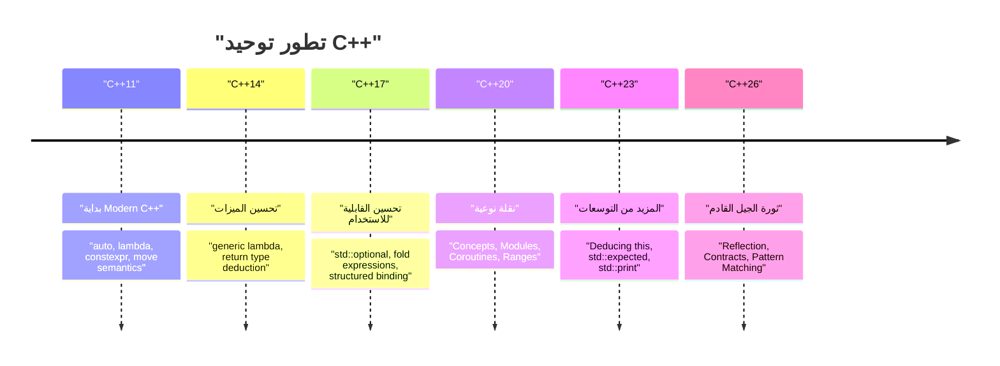
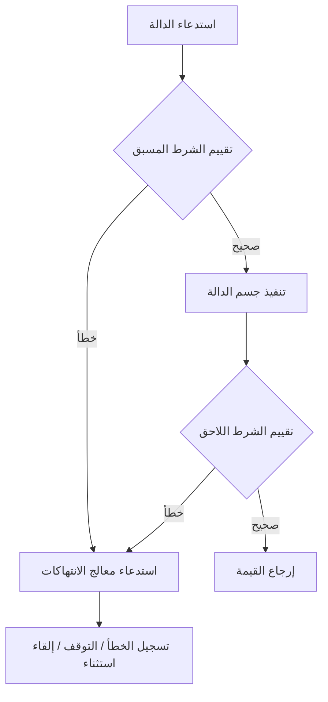

# مقدمة: نماذج البرمجة من الجيل التالي التي يقدمها C++26

في عام 2026، تم توحيد **C++26** رسميًا، والذي يُعد معلمًا هامًا للغاية في تاريخ C++. منذ ظهور مفهوم "Modern C++" في C++11، تطورت اللغة بثبات عبر C++14 و C++17 و C++20 و C++23. لكن C++26 يُحدث نقلة نوعية قوية تقلب مفاهيم البرمجة الوصفية (Metaprogramming)، ومعالجة الأخطاء (Error handling)، والمعالجة المتزامنة (Concurrency) رأسًا على عقب، سواء من حيث ميزات اللغة أو المكتبة القياسية.

في هذه المقالة، سنشرح بشكل شامل الميزات الجديدة الرئيسية التي تم إدخالها في C++26، والتفاصيل التقنية، وتحسينات الأداء في وقت الترجمة (Compile-time)، والمقارنة مع التعليمات البرمجية الحالية حتى C++23، بالإضافة إلى الاستخدامات العملية. وبحجم يتجاوز 10,000 حرف، سنغطي مجموعة واسعة من المواضيع، بما في ذلك الانعكاس (Reflection)، وبرمجة العقود (Contracts)، ومطابقة الأنماط (Pattern Matching)، وفهرسة الحزم (Pack Indexing)، وامتدادات الربط الهيكلي (Structured Bindings)، وتطور المكتبة القياسية مع التركيز على المرسلين/المستقبلين (Senders/Receivers).

أولاً، دعونا نلقي نظرة مرئية على تاريخ توحيد C++ ومكانة C++26.



يهدف C++26 إلى زيادة **قدرة الكود على الوصف الذاتي (الانعكاس)** و**المتانة (برمجة العقود)** إلى أقصى حد، بناءً على الميزات واسعة النطاق مثل Concepts و Modules التي تم تقديمها في C++20. دعونا نتعمق في تفاصيل كل ميزة.

---

# 1. الانعكاس الثابت (Static Reflection): ثورة حقيقية في البرمجة الوصفية

الميزة الأبرز في C++26 بلا شك هي **الانعكاس الثابت (Static Reflection)** (بناءً على مقترحات مثل P2996). في السابق، للحصول على معلومات حول بنية النوع أو المتغيرات الأعضاء من داخل البرنامج في C++، كان لزامًا علينا استخدام برمجة القوالب الوصفية (TMP) المعقدة أو وحدات الماكرو. ومع ذلك، مع آلية الانعكاس في C++26، أصبح من الممكن الوصول إلى بنية البرنامج نفسه (AST: شجرة البنية المجردة) بشكل آمن وبديهي في وقت الترجمة.

## 1.1 تحديات C++23 وما قبلها

لنفترض أننا نريد تحويل جميع المتغيرات الأعضاء لهيكل معين إلى تسلسل JSON في C++23 وما قبلها. نظرًا لعدم وجود ميزة قياسية في اللغة لسرد أعضاء الهيكل، كان لزامًا علينا استخدام مكتبات خارجية مثل Boost.Describe و Boost.Pfr، أو تعريف وحدات ماكرو مخصصة لتسجيل الأعضاء.

أدى ذلك إلى زيادة أوقات الترجمة وجعل رسائل الخطأ معقدة وغير مفهومة. من وجهة نظر رياضية، كانت عملية تحليل معلومات النوع السابقة التي تستخدم إنشاء مثيلات القوالب التكرارية تتطلب تعقيدًا حسابيًا في وقت الترجمة يبلغ $O(N)$ لعدد $N$ من العناصر، وفي الدوال الوصفية المعقدة، كان يتطلب إنشاء مثيلات أسوأ حالة $O(N^2)$.

$$
T_{\text{compile}}(N) \approx O(N^2) \quad \text{(Recursive Template Metaprogramming)}
$$

## 1.2 بناء جملة الانعكاس والنهج في C++26

يستخدم الانعكاس في C++26 المعامل `^` (معامل الانعكاس) وصيغة `[: ... :]` (مقسم). يتم الحصول على "المعلومات الوصفية" للنوع أو المتغير بواسطة `^T`، ويتم التعامل معها ككائن ثابت في وقت الترجمة من النوع `std::meta::info`.

```cpp
#include <iostream>
#include <string>
#include <meta>

struct User {
    int id;
    std::string name;
    std::string email;
};

// مُسلسل (Serializer) عام باستخدام الانعكاس الثابت في C++26
template <typename T>
void print_json(const T& obj) {
    constexpr auto type_info = ^T;
    
    std::cout << "{\n";
    // الحصول على معلومات العضو للهيكل والتكرار عبرها
    template for (constexpr auto member : std::meta::nonstatic_data_members_of(type_info)) {
        // فك الرمز الأصلي باستخدام [: member :]، والحصول على المعرف (الاسم) كسلسلة
        std::cout << "  \"" << std::meta::identifier_of(member) << "\": " 
                  << obj.[:member:] << ",\n";
    }
    std::cout << "}\n";
}

int main() {
    User u{1, "Alice", "alice@example.com"};
    print_json(u);
    return 0;
}
```

في هذا الكود، يتم استخدام `template for` (توسيع الحلقة في وقت الترجمة) لسرد كافة أعضاء الهيكل `User`.

## 1.3 الأداء وتعقيد وقت الترجمة

أكبر فائدة لهذه الميزة الجديدة هي **تقليل وقت الترجمة**. نظرًا لأنه يتم معالجة المعلومات الوصفية بشكل مباشر داخل المترجم، تتم معالجة الوصول إلى العناصر والتكرار بعبء إضافي يبلغ $O(1)$. نظرًا لأنه يتم تقييمه فورًا كتعبير ثابت، يتحسن تعقيد وقت الترجمة بشكل جذري.

$$
T_{\text{compile\_new}}(N) = O(N) \quad \text{(Direct AST Traversal)}
$$

ستتخلص من مشكلات استنفاد ذاكرة المترجم بسبب تداخل القوالب، ورسائل الخطأ الطويلة (بحر من أخطاء القوالب).

```mermaid
graph TD
    A["النوع: User"] -->| "^User" | B["std::meta::info"]
    B -->| "nonstatic_data_members_of" | C["نطاق meta::info"]
    C -->| "[: member :]" | D["وصول مباشر للعضو (obj.id, obj.name)"]
    D --> E["الكود المولد (بدون عبء إضافي)"]
```

---

# 2. برمجة العقود (Contracts): تصميم برمجي متين

بعد أن تم تأجيل إضافتها في C++20، تم أخيرًا تقديم ميزة **العقود (Contracts)** التي طالما تمت مناقشتها في C++26 (مثل مقترح P2900). تدعم الآن اللغة بشكل مدمج نموذج "التصميم بالعقد" (Design by Contract)، مما يسمح بتعريف الشروط المسبقة للدالة (Pre-condition)، والشروط اللاحقة (Post-condition)، والتأكيدات (Assertion) بطريقة تصريحية.

## 2.1 البنية الأساسية للعقود

في C++26، يتم إرفاق سمات العقد بتصريحات الدالة.

*   `pre` : شرط يجب استيفاؤه قبل استدعاء الدالة.
*   `post` : شرط يجب استيفاؤه عند انتهاء الدالة وإرجاع قيمة.
*   `assert` : شرط يجب استيفاؤه عند نقطة معينة داخل الدالة.

```cpp
#include <vector>
#include <numeric>

// حساب آمن للمتوسط باستخدام برمجة العقود
// شرط مسبق: لا ينبغي أن يكون المتجه المُمرر فارغاً
// شرط لاحق: القيمة المتوسطة المحسوبة يجب أن تكون أكبر من أو تساوي القيمة الصغرى وأقل من أو تساوي القيمة الكبرى في المتجه
double calculate_average(const std::vector<double>& v)
    pre (!v.empty())
    post (r : r >= *std::min_element(v.begin(), v.end()) && 
              r <= *std::max_element(v.begin(), v.end()))
{
    double sum = std::accumulate(v.begin(), v.end(), 0.0);
    double avg = sum / v.size();
    
    // تأكيد أثناء المعالجة
    assert(avg == avg); // التحقق من NaN وغيرها
    
    return avg; // يرتبط بالمتغير 'r' في الشرط اللاحق
}
```

## 2.2 معالجة انتهاكات العقد والتقييم في وقت التشغيل

العقود ليست مجرد تعليقات أو ماكرو `assert()` القديم. بناءً على وضع البناء (بناء التطوير، بناء الإنتاج، إلخ)، يمكنك إرشاد المترجم بخصوص **السلوك عند حدوث انتهاك**. على سبيل المثال، أثناء التطوير، يمكن إجبار البرنامج على التوقف الفوري (abort) عند الانتهاك، بينما في بيئة الإنتاج، يمكن استدعاء معالج انتهاكات مخصص لتسجيل الخطأ والاستمرار بمرونة.



باستخدام العقود، لا يتم توثيق مواصفات واجهة برمجة التطبيقات (API) ذاتيًا فحسب، بل يمكن إيقاف البرنامج والتحكم فيه بأمان قبل التسبب في سلوك غير محدد (UB). لذا يُتوقع تقليل أخطاء تلف الذاكرة والأخطاء المنطقية الخاصة بلغة C++ بشكل كبير.

---

# 3. مطابقة الأنماط (Pattern Matching): تحسين التفريغ

منذ تقديم `std::variant` و `std::any` في C++17، تم استخدام `std::visit` لتوزيع المتغيرات التي تحمل أنواعًا مختلفة. ومع ذلك، كان الجمع بين `std::visit` ونمط التحميل الزائد (ما يسمى باختراق الهيكل `overloaded`) مطولًا للغاية وصعب القراءة.

في C++26، تم دمج **مطابقة الأنماط (Pattern Matching)** كميزة لغوية (متوافق مع P2688). يتيح ذلك مطابقة بديهية مشابهة للغات الوظيفية (مثل Rust و Haskell).

## 3.1 معاناة `std::visit` حتى C++23

```cpp
// كتابة الأكواد حتى C++23
template<class... Ts> struct overloaded : Ts... { using Ts::operator()...; };
template<class... Ts> overloaded(Ts...) -> overloaded<Ts...>;

std::variant<int, std::string, double> v = "Hello";

std::visit(overloaded {
    [](int i) { std::cout << "Int: " << i << '\n'; },
    [](const std::string& s) { std::cout << "String: " << s << '\n'; },
    [](double d) { std::cout << "Double: " << d << '\n'; }
}, v);
```

## 3.2 تحسن جذري بواسطة البنية `inspect` في C++26

باستخدام الكلمة الأساسية الجديدة `inspect`، يصبح من الممكن كتابة الكود بشكل أكثر ترتيبًا كما يلي:

```cpp
// مطابقة الأنماط في C++26
std::variant<int, std::string, double> v = "Hello";

inspect (v) {
    int i => std::cout << "Int: " << i << '\n';
    std::string s => std::cout << "String: " << s << '\n';
    double d => std::cout << "Double: " << d << '\n';
    _ => std::cout << "Unknown type\n"; // حرف بدل (Wildcard)
};
```

لا تقتصر مطابقة الأنماط هذه على توزيع الأنواع فحسب، بل تدعم أيضًا **التفكيك الهيكلي (Destructuring)** للهياكل و**شروط الحماية (Guard conditions)** (يتم المطابقة فقط إذا تم استيفاء شرط معين).

```cpp
struct Point { int x, y; };
std::variant<Point, int> var = Point{10, 20};

inspect (var) {
    // ربط عناصر الهيكل مع إضافة شرط حماية (if)
    [x, y] as Point if (x == y) => { std::cout << "Diagonal: " << x << '\n'; }
    [x, y] as Point => { std::cout << "Point: " << x << ", " << y << '\n'; }
    int i => { std::cout << "Scalar: " << i << '\n'; }
};
```

يقوم المترجم بإجراء فحص الشمولية (Exhaustiveness checking) لبيان `inspect` هذا، لذا سيتم الإبلاغ عن خطأ في الترجمة إذا كان هناك أي حالات مفقودة في معالجة النوع `enum` أو `std::variant`. هذا أمر بالغ الأهمية لتحسين قابلية الصيانة.

---

# 4. فهرسة الحزم (Pack Indexing): إنقاذ حزم وسائط القوالب

القوالب متغيرة الطول (Variadic Templates) المتوفرة منذ C++11 قوية للغاية، ولكن عملية استخراج النوع أو القيمة ذات الرقم $N$ من حزمة الوسائط لم تكن بديهية. في السابق، كان لزامًا علينا استخدام `std::tuple_element` أو القوالب التكرارية لاستخراجها.

في C++26، تم تقديم ميزة **Pack Indexing** (الفهرسة للحزم) (P2662)، مما يسمح بالكتابة بشكل أكثر طبيعية يشبه الوصول إلى فهرس المصفوفات.

## 4.1 أساسيات فهرسة الحزم

بناء الجملة بسيط للغاية، حيث يتم كتابته كالتالي: `Types...[I]`.

```cpp
#include <iostream>
#include <type_traits>

// دالة لاستخراج النوع ذي الرقم N
template <std::size_t N, typename... Types>
constexpr auto get_nth_type() {
    // الوصول المباشر للنوع رقم N باستخدام Types...[N]
    return Types...[N]{};
}

// دالة لاستخراج القيمة ذات الرقم N من الوسائط متغيرة الطول
template <std::size_t N, typename... Args>
constexpr decltype(auto) get_nth_value(Args&&... args) {
    // الوصول للفهرس متاح أيضًا لحزمة الوسائط args
    return std::forward<Args...[N]>(args...[N]);
}

int main() {
    // الوصول إلى الأنواع
    using SecondType = decltype(get_nth_type<1, int, double, char>());
    static_assert(std::is_same_v<SecondType, double>);

    // الوصول إلى القيم
    auto val = get_nth_value<2>(10, 3.14, "Hello C++26", 'c');
    std::cout << val << std::endl; // سيطبع "Hello C++26"
}
```

يمكن للمترجم الآن معالجة فهرس الحزمة في وقت ثابت $O(1)$، مما يقلل من وقت الترجمة الطويل الذي كان يسببه تداخل الدوال الوصفية.

---

# 5. امتداد الربط الهيكلي (Structured Bindings)

يعتبر الربط الهيكلي المُقدم في C++17 مفيدًا للغاية عند تلقي قيم الإرجاع المتعددة من الدالة، ولكن إذا كنت ترغب في استخدام بعض المتغيرات وتجاهل الأخرى، كان عليك تعريف متغير وهمي، وكان تجنب تحذير "المتغير غير المستخدم" (unused variable) يتطلب مجهودًا إضافيًا.

في C++26، سُمح رسميًا باستخدام `_` (الشرطة السفلية) كعنصر نائب (Placeholder).

```cpp
#include <map>
#include <string>
#include <iostream>

std::map<int, std::string> get_data() {
    return {{1, "One"}, {2, "Two"}, {3, "Three"}};
}

int main() {
    auto data = get_data();
    
    for (const auto& [id, _] : data) {
        // تجاهل القيمة (السلسلة) واستخدام المفتاح (المعرف) فقط
        std::cout << "ID: " << id << '\n';
    }
}
```

بفضل هذا الامتداد الصغير، تصبح نية الكود أكثر وضوحًا، مما يمنع الاستخدام المفرط لتوجيهات `#pragma` أو سمات `[[maybe_unused]]` لمنع التحذيرات غير الضرورية.

---

# 6. تطور المكتبة القياسية: إعادة تعريف المعالجة المتزامنة وغير المتزامنة

إلى جانب ميزات اللغة، شهدت المكتبة القياسية لـ C++ (STL) تطورًا هائلاً في C++26. وخاصة في مجالات المعالجة غير المتزامنة وإدارة الذاكرة، تم تقديم مكونات متقدمة لتلبية متطلبات الشركات وبرمجة الأنظمة.

## 6.1 المرسلين / المستقبلين (Senders / Receivers) عبر (std::execution)

لقد توج مقترح التوحيد القياسي (P2300)، الذي يعيد بناء نموذج المعالجة غير المتزامنة في C++ من الأساس، بالنجاح في C++26. لحل مشكلات الأداء (تخصيص الذاكرة المفرط وعدم كفاءة الجدولة) التي كانت تعاني منها `std::async` و `std::future`، تم إدخال نموذج **Senders/Receivers**.


المرسلين (Senders) عبارة عن مخطط خفيف الوزن يصف "ما يجب القيام به"، وهو منفصل عن سياق التنفيذ (الجدولة). هذا يسمح بوصف تفريغ المهام إلى تجمع الخيوط (ThreadPool) الخاص بوحدة المعالجة المركزية أو وحدة معالجة الرسومات بكفاءة عبر واجهة موحدة.

```cpp
#include <execution>
#include <iostream>
#include <syncstream>

using namespace std::execution;

int main() {
    auto scheduler = get_system_thread_pool().scheduler();

    // مسار معالجة المهام (لا يُنفذ في هذه المرحلة: تقييم مؤجل)
    auto task = schedule(scheduler)
              | then([] { return 42; })
              | then([](int val) { return val * 2; })
              | upon_error([](std::exception_ptr e) { return 0; });

    // انتظار النتيجة بشكل متزامن باستخدام sync_wait
    auto [result] = sync_wait(task).value();
    
    std::osyncstream(std::cout) << "Result: " << result << std::endl;
}
```

## 6.2 مؤشرات الخطر (Hazard Pointers) و RCU (التحديث بالنسخ عند القراءة)

كميزات قياسية تدعم تنفيذ هياكل البيانات الخالية من الأقفال (Lock-free)، تم توحيد **مؤشرات الخطر (Hazard Pointers)** (`std::hazard_pointer`) و **RCU** (`std::rcu`). وقد أدى ذلك إلى خفض كبير في العقبات المتمثلة في تنفيذ هياكل بيانات متزامنة وعالية الأداء في C++.

يتيح نظام RCU (التحديث بالنسخ عند القراءة) خصوصًا في أعباء العمل التي تكثر فيها القراءات، التخلص من تعارض خط التخزين المؤقت، وتحقيق قابلية التوسع الخطي. وبصيغة رياضية، بالنسبة لعدد الخيوط $T$، تُظهر إنتاجية القراءة زيادة مثالية تبلغ $O(T)$.

$$
\text{Throughput}_{\text{RCU}} \propto T \quad \text{(Read-heavy Workloads)}
$$

---

# 7. دليل الانتقال العملي وفوائد الاعتماد

يتطلب الانتقال إلى C++26 نقلة نوعية ضخمة مشابهة لتلك التي حدثت مع C++11، ولكنه يجلب معه فوائد تحسين سلامة الشيفرة ووقت الترجمة بشكل ملحوظ.

1.  **تجديد البرمجة الوصفية**: يمكن إعادة كتابة مكتبات التسلسل أو أطر عمل ORM (التي تعتمد على الربط الكائني العلائقي) المكونة من تداخلات `template` أو `constexpr if` المعقدة باستخدام ميزة الانعكاس في C++26، مما سيؤدي إلى تحسين قابلية الصيانة بشكل هائل، ومن المحتمل أن يقلل وقت الترجمة إلى كسر من الوقت السابق.
2.  **تصميم واجهة برمجة التطبيقات (API) بواسطة العقود**: يجب على مصممي مكتبات الفئات استخدام العقود (`pre` / `post`) لتوضيح المواصفات على مستوى اللغة بدلاً من الاعتماد على تعليقات التوثيق مثل Doxygen. يتيح ذلك الاكتشاف المبكر للاستدعاءات غير الصالحة من جانب المستخدم.
3.  **تحديث المعالجة غير المتزامنة**: من خلال نقل المعالجة غير المتزامنة التي كانت تعتمد على التنفيذ المستقل أو Boost.Asio إلى `std::execution` (المرسلين/المستقبلين)، يمكنك بناء بنية معالجة متزامنة قياسية عبر منصات وأجهزة مختلفة.

## ملاحظات عند الانتقال: استقرار واجهة التطبيق الثنائية (ABI) ودعم المترجم

نظرًا لأن ميزات اللغة الجديدة، وخاصة العقود، يمكن أن تؤثر على توقيعات الدوال و ABI (واجهة التطبيق الثنائية)، يجب التأكد تمامًا عند استخدامها عبر حدود المكتبات المشتركة (DLL / .so) أنها مترجمة بنفس المترجم وإصدار المكتبة القياسية (GCC, Clang, MSVC).

---

# الخلاصة

يعتبر C++26 إصدارًا تاريخيًا بكل معنى الكلمة، حيث جلب دفعة واحدة "ميزات الأحلام" التي كان ينتظرها مبرمجو C++ منذ فترة طويلة.

*   بفضل **الانعكاس (Reflection)**، تمت إزالة صعوبة البرمجة الوصفية وتم تحقيق وصول AST بوقت $O(1)$.
*   بفضل **برمجة العقود (Contracts)**، أصبح من الممكن تحديد الشروط المسبقة واللاحقة للدالة بوضوح، وبناء برامج متينة.
*   بفضل **مطابقة الأنماط (Pattern Matching)**، أمكن كتابة التفرعات والانتقالات الحالية المعقدة بشكل بديهي وآمن.
*   بفضل **المرسلين/المستقبلين (Senders/Receivers)** و **RCU / مؤشرات الخطر (Hazard Pointers)**، تم توحيد المعالجة المتزامنة التي تستخرج أقصى درجات الأداء.

من خلال الاستفادة السليمة من هذه الميزات، سيصبح من الممكن تحقيق أكبر قوة لـ C++، وهي "التجريد بدون تكلفة إضافية (Zero-overhead Abstraction)" على مستوى أعلى بكثير، وبتعليمات برمجية نظيفة بشكل مدهش.

المُضي قُدُماً، ونحن نراقب حالة تنفيذ ميزات C++26 بواسطة بائعي المترجمات المختلفة (مثل وحدات ماكرو اختبار الميزات)، نوصي بدمج هذه النماذج الجديدة بفعالية في المشاريع الجديدة وتطوير المكتبات. لم تكن C++ أبدًا لغة قديمة؛ بل من المؤكد أنها ستستمر في التربع على قمة برمجة الأنظمة بينما تستوعب بنهم أحدث النظريات اللغوية.

---
*كُتب هذا المقال استنادًا إلى حالة التوحيد القياسي لـ C++26 اعتبارًا من عام 2026. يرجى ملاحظة أن بعض بنى الجمل قد تتغير اعتمادًا على حالة تنفيذ كل مترجم.*
