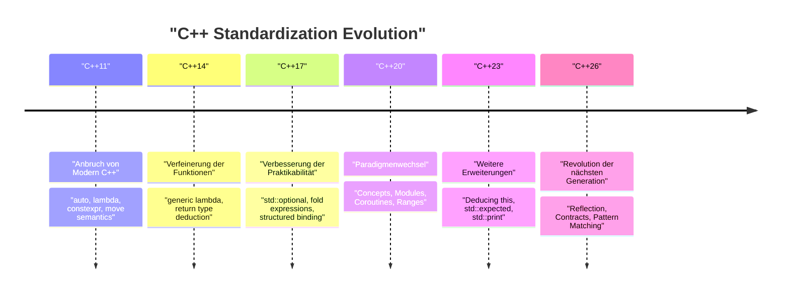
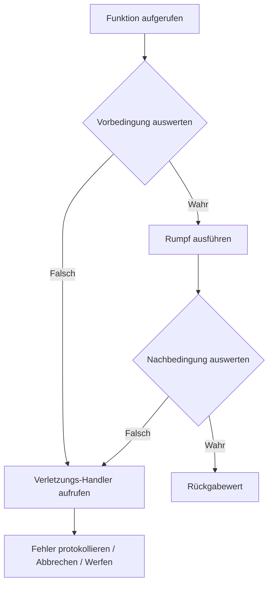
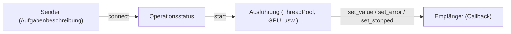

# Einführung: Das Programmierparadigma der nächsten Generation durch C++26

Im Jahr 2026 wurde **C++26** offiziell standardisiert und markiert einen äußerst wichtigen Meilenstein in der Geschichte von C++. Seit der Einführung des Konzepts „Modern C++“ mit C++11 hat es sich mit C++14, C++17, C++20 und C++23 stetig weiterentwickelt. C++26 bringt jedoch einen so starken Paradigmenwechsel mit sich, dass es die bisherigen Konventionen in Bezug auf Metaprogrammierung, Fehlerbehandlung und Nebenläufigkeit (Concurrency) sowohl auf der Ebene der Sprachfunktionen als auch der Standardbibliothek völlig auf den Kopf stellt.

In diesem Artikel werden die wichtigsten neuen Funktionen, die mit C++26 eingeführt wurden, ausführlich erläutert: technische Details, Verbesserungen der Kompilierzeit-Performance, Vergleiche mit vorhandenem Code bis hin zu C++23 und praktische Anwendungsmöglichkeiten. Mit einem Umfang von über 10.000 Zeichen deckt er ein breites Spektrum ab, darunter Reflection, Design by Contract (Contracts), Pattern Matching, Pack Indexing, erweiterte Structured Bindings und die Weiterentwicklung der Standardbibliothek, beginnend mit Senders/Receivers.

Lassen Sie uns zunächst die Geschichte der C++-Standardisierung und die Positionierung von C++26 visuell betrachten.



C++26 baut auf den groß angelegten Funktionsgruppen wie Concepts und Modules auf, die in C++20 eingeführt wurden, und zielt darauf ab, die **Selbstbeschreibungsfähigkeit des Codes (Reflection)** und die **Robustheit (Design by Contract)** zu maximieren. Lassen Sie uns nun auf die Details der einzelnen Funktionen eingehen.

---

# 1. Reflection (Static Reflection): Die wahre Revolution der Metaprogrammierung

Man kann ohne Übertreibung sagen, dass die **statische Reflection (Static Reflection)** die wichtigste Neuerung in C++26 ist (hauptsächlich basierend auf Vorschlägen wie P2996). Um in C++ bisher Informationen über die Struktur eines Typs oder seiner Member-Variablen aus dem Programm heraus abzurufen, musste man komplexe Template-Metaprogrammierung (TMP) oder Makros verwenden. Dank der Reflection-Mechanismen von C++26 ist es nun jedoch möglich, zur Kompilierzeit sicher und intuitiv auf die Struktur des Programms selbst (AST: Informationen des abstrakten Syntaxbaums) zuzugreifen.

## 1.1 Die bisherigen Herausforderungen bis C++23

Stellen Sie sich vor, Sie möchten vor C++23 alle Member-Variablen einer Struktur (Struct) in JSON serialisieren. Da es keine Standard-Sprachfunktion gab, um die Member einer Struktur aufzuzählen, musste man Drittanbieter-Bibliotheken wie Boost.Describe oder Boost.Pfr verwenden oder eigene Makros definieren, um die Member zu registrieren.

Dies führte zu längeren Kompilierzeiten und schwer verständlichen Fehlermeldungen. Aus mathematischer Sicht erforderte die herkömmliche rekursive Template-Instanziierung zur Analyse von Typinformationen eine Kompilierzeit-Komplexität von $O(N)$ für $N$ Elemente und im schlimmsten Fall $O(N^2)$ Instanziierungen für komplexe Meta-Funktionen.

$$
T_{\text{compile}}(N) \approx O(N^2) \quad \text{(Recursive Template Metaprogramming)}
$$

## 1.2 Reflection-Syntax und -Ansatz in C++26

Die Reflection in C++26 verwendet den Operator `^` (Reflection-Operator) und die Syntax `[: ... :]` (Splicer). Mit `^T` ruft man die "Meta-Informationen" eines Typs oder einer Variablen ab, die als Objekt des Typs `std::meta::info`, einer Kompilierzeit-Konstante, behandelt werden.

```cpp
#include <iostream>
#include <string>
#include <meta>

struct User {
    int id;
    std::string name;
    std::string email;
};

// Generischer Serialisierer unter Verwendung statischer Reflection aus C++26
template <typename T>
void print_json(const T& obj) {
    constexpr auto type_info = ^T;
    
    std::cout << "{\n";
    // Abrufen und Iterieren der Member-Informationen der Struktur
    template for (constexpr auto member : std::meta::nonstatic_data_members_of(type_info)) {
        // Entpacken in das ursprüngliche Symbol mit [: member :] und Abrufen des Identifikators (Namens) als String
        std::cout << "  \"" << std::meta::identifier_of(member) << "\": " 
                  << obj.[:member:] << ",\n";
    }
    std::cout << "}\n";
}

int main() {
    User u{1, "Alice", "alice@example.com"};
    print_json(u);
    return 0;
}
```

In diesem Code wird `template for` (Schleifenentrollung zur Kompilierzeit) verwendet, um alle Member der Struktur `User` aufzuzählen.

## 1.3 Performance und Komplexität zur Kompilierzeit

Der größte Vorteil dieser neuen Funktion ist die **Verkürzung der Kompilierzeit**. Da die Metadaten direkt innerhalb des Compilers manipuliert werden, erfolgen der Zugriff auf Elemente und die Iteration mit einem Overhead von $O(1)$. Da sie sofort als konstanter Ausdruck ausgewertet werden, wird die Komplexität der Kompilierzeit drastisch verbessert.

$$
T_{\text{compile\_new}}(N) = O(N) \quad \text{(Direct AST Traversal)}
$$

Man hat nichts mehr mit Speichererschöpfung des Compilers durch verschachtelte Templates oder endlosen Fehlermeldungen (einem Meer von Template-Fehlern) zu tun.

```mermaid
graph TD
    A["Typ: User"] -->| "^User" | B["std::meta::info"]
    B -->| "nonstatic_data_members_of" | C["Bereich von meta::info"]
    C -->| "[: member :]" | D["Direkter Member-Zugriff (obj.id, obj.name)"]
    D --> E["Generierter Code (Zero Overhead)"]
```

---

# 2. Design by Contract (Contracts): Robustes Software-Design

Nachdem sie in C++20 abgelehnt worden waren, wurden **Contracts (Vertragsbasierte Programmierung)**, über die lange diskutiert wurde, endlich in C++26 eingeführt (P2900 usw.). Das Paradigma des „Design by Contract“ wird nun nativ von der Sprache unterstützt, wodurch Vorbedingungen (Pre-condition), Nachbedingungen (Post-condition) und Zusicherungen (Assertion) für Funktionen deklarativ beschrieben werden können.

## 2.1 Grundlegende Syntax von Contracts

In C++26 fügt man Funktionsdeklarationen Vertragsattribute hinzu.

*   `pre` : Bedingung, die erfüllt sein muss, bevor die Funktion aufgerufen wird
*   `post` : Bedingung, die erfüllt sein muss, wenn die Funktion beendet wird und einen Wert zurückgibt
*   `assert` : Bedingung, die an einem bestimmten Punkt innerhalb der Funktion erfüllt sein muss

```cpp
#include <vector>
#include <numeric>

// Sichere Durchschnittsberechnung durch Design by Contract
// Vorbedingung: Der übergebene Vektor darf nicht leer sein
// Nachbedingung: Der berechnete Durchschnitt ist größer oder gleich dem Minimum und kleiner oder gleich dem Maximum des Vektors
double calculate_average(const std::vector<double>& v)
    pre (!v.empty())
    post (r : r >= *std::min_element(v.begin(), v.end()) && 
              r <= *std::max_element(v.begin(), v.end()))
{
    double sum = std::accumulate(v.begin(), v.end(), 0.0);
    double avg = sum / v.size();
    
    // Zusicherung während der Verarbeitung
    assert(avg == avg); // Überprüfung auf NaN usw.
    
    return avg; // Wird an 'r' in der Nachbedingung gebunden
}
```

## 2.2 Behandlung von Vertragsverletzungen und Auswertung zur Laufzeit

Contracts sind nicht nur einfache Kommentare oder alte `assert()`-Makros. Je nach Build-Modus (Entwicklungs-Build, Produktions-Build usw.) können Sie dem Compiler anweisen, wie er sich bei **Verletzungen verhalten soll**. Beispielsweise ist ein flexibler Betrieb möglich, wie etwa ein sofortiger Absturz (Abort) bei einer Verletzung während der Entwicklung oder der Aufruf eines benutzerdefinierten Verletzungs-Handlers in einer Produktionsumgebung, um ein Protokoll aufzuzeichnen und fortzufahren.



Durch die Verwendung von Contracts dokumentiert sich die API-Spezifikation nicht nur selbst, sondern ermöglicht auch das sichere Stoppen und Kontrollieren des Programms, bevor ein undefiniertes Verhalten (Undefined Behavior, UB) auftritt. Dies verspricht eine erhebliche Reduzierung von C++-spezifischen Speicherbeschädigungsfehlern und Logikfehlern.

---

# 3. Pattern Matching: Verfeinerung der Verzweigungen

Seit der Einführung von `std::variant` und `std::any` in C++17 wurde `std::visit` zum Verteilen (Dispatching) von Variablen verwendet, die verschiedene Typen enthalten. Die Kombination von `std::visit` und dem Overload-Muster (der sogenannte `overloaded` Struct-Hack) war jedoch sehr ausführlich und schwer lesbar.

Mit C++26 wurde **Pattern Matching** als Sprachfunktion integriert (konform zu P2688). Dies ermöglicht ein intuitives Matching, das funktionalen Sprachen (wie Rust oder Haskell) ähnelt.

## 3.1 Die Mühen mit `std::visit` bis C++23

```cpp
// Syntax bis C++23
template<class... Ts> struct overloaded : Ts... { using Ts::operator()...; };
template<class... Ts> overloaded(Ts...) -> overloaded<Ts...>;

std::variant<int, std::string, double> v = "Hello";

std::visit(overloaded {
    [](int i) { std::cout << "Int: " << i << '\n'; },
    [](const std::string& s) { std::cout << "String: " << s << '\n'; },
    [](double d) { std::cout << "Double: " << d << '\n'; }
}, v);
```

## 3.2 Dramatische Verbesserung durch die `inspect`-Syntax in C++26

Durch die Verwendung des neuen Schlüsselworts `inspect` kann dies, wie unten gezeigt, sehr übersichtlich geschrieben werden.

```cpp
// Pattern Matching in C++26
std::variant<int, std::string, double> v = "Hello";

inspect (v) {
    int i => std::cout << "Int: " << i << '\n';
    std::string s => std::cout << "String: " << s << '\n';
    double d => std::cout << "Double: " << d << '\n';
    _ => std::cout << "Unknown type\n"; // Platzhalter (Wildcard)
};
```

Dieses Pattern Matching beschränkt sich nicht nur auf das Dispatching von Typen, sondern unterstützt auch **Struktur-Destrukturierung** (Zerlegung) und **Wächterbedingungen (Guards)** (Matching nur bei Erfüllung einer bestimmten Bedingung).

```cpp
struct Point { int x, y; };
std::variant<Point, int> var = Point{10, 20};

inspect (var) {
    // Bindung von Struktur-Elementen bei gleichzeitiger Hinzufügung einer Wächterbedingung (if)
    [x, y] as Point if (x == y) => { std::cout << "Diagonal: " << x << '\n'; }
    [x, y] as Point => { std::cout << "Point: " << x << ", " << y << '\n'; }
    int i => { std::cout << "Scalar: " << i << '\n'; }
};
```

Da der Compiler eine Vollständigkeitsprüfung (Exhaustiveness checking) für diese `inspect`-Anweisung durchführt, meldet er fehlende Fälle bei der Verarbeitung von Aufzählungen (enum) oder `std::variant` als Kompilierungsfehler. Dies ist äußerst wichtig für die Verbesserung der Wartbarkeit.

---

# 4. Pack Indexing: Rettung für Template Parameter Packs

Variadische Templates (Variadic Templates) seit C++11 sind extrem mächtig, aber die Operation, den $N$-ten Typ oder Wert aus einem Parameter-Pack zu extrahieren, war nicht intuitiv. Bisher musste man dazu auf `std::tuple_element` oder rekursive Templates zurückgreifen.

In C++26 wurde die Funktion **Pack Indexing** (P2662) eingeführt, wodurch es natürlicher geschrieben werden kann, ähnlich dem Indexzugriff bei Arrays.

## 4.1 Grundlagen von Pack Indexing

Die Syntax ist sehr einfach und wird als `Types...[I]` geschrieben.

```cpp
#include <iostream>
#include <type_traits>

// Funktion zum Abrufen des N-ten Typs
template <std::size_t N, typename... Types>
constexpr auto get_nth_type() {
    // Direkter Zugriff auf den N-ten Typ mit Types...[N]
    return Types...[N]{};
}

// Funktion zum Abrufen des N-ten Werts aus variadischen Argumenten
template <std::size_t N, typename... Args>
constexpr decltype(auto) get_nth_value(Args&&... args) {
    // Indexzugriff ist auch für das Parameter-Pack 'args' möglich
    return std::forward<Args...[N]>(args...[N]);
}

int main() {
    // Zugriff auf Typen
    using SecondType = decltype(get_nth_type<1, int, double, char>());
    static_assert(std::is_same_v<SecondType, double>);

    // Zugriff auf Werte
    auto val = get_nth_value<2>(10, 3.14, "Hello C++26", 'c');
    std::cout << val << std::endl; // Gibt "Hello C++26" aus
}
```

Der Compiler kann Pack-Indizes nun in konstanter Zeit $O(1)$ verarbeiten, was die langen Kompilierzeiten reduziert, die bisher durch verschachtelte Meta-Funktionen verursacht wurden.

---

# 5. Erweiterung von Structured Bindings

Die in C++17 eingeführten Structured Bindings sind sehr praktisch, um mehrere Rückgabewerte einer Funktion zu empfangen. Wenn Sie jedoch nur einige Variablen verwenden und andere ignorieren wollten, mussten Sie Dummy-Variablen definieren, und es war mühsam, Warnungen zu „nicht verwendeten Variablen (unused variable)“ zu vermeiden.

In C++26 ist die Verwendung von `_` (Unterstrich) als Platzhalter nun offiziell erlaubt.

```cpp
#include <map>
#include <string>
#include <iostream>

std::map<int, std::string> get_data() {
    return {{1, "One"}, {2, "Two"}, {3, "Three"}};
}

int main() {
    auto data = get_data();
    
    for (const auto& [id, _] : data) {
        // Den Wert (String) ignorieren und nur den Schlüssel (ID) verwenden
        std::cout << "ID: " << id << '\n';
    }
}
```

Durch diese kleine Erweiterung wird die Absicht des Codes klarer und der Missbrauch von `#pragma` oder `[[maybe_unused]]`-Attributen zur Unterdrückung unnötiger Warnungen kann vermieden werden.

---

# 6. Weiterentwicklung der Standardbibliothek: Neudefinition von Nebenläufigkeit und Asynchronität

Nicht nur die Sprachfunktionen, sondern auch die Standardbibliothek (STL) von C++26 hat eine dramatische Entwicklung durchgemacht. Insbesondere in den Bereichen der asynchronen Verarbeitung und der Speicherverwaltung wurden fortschrittliche Komponenten eingeführt, die den Anforderungen der Enterprise- und Systemprogrammierung gerecht werden.

## 6.1 Senders / Receivers (std::execution)

Der Standardisierungsvorschlag (P2300), der das asynchrone Verarbeitungsmodell von C++ von Grund auf neu gestaltet, wurde in C++26 endlich realisiert. Um die Performance-Probleme (übermäßige Speicherzuweisung und Ineffizienz bei der Planung), mit denen `std::async` und `std::future` zu kämpfen hatten, zu lösen, wurde das **Senders/Receivers**-Modell eingeführt.



Senders sind ein schlanker Bauplan, der beschreibt, "was zu tun ist", und der vom Ausführungskontext (Scheduler) getrennt ist. Dadurch können Aufgaben für ThreadPools der CPU oder die Auslagerung (Offloading) auf die GPU effizient mit einer einheitlichen Schnittstelle beschrieben werden.

```cpp
#include <execution>
#include <iostream>
#include <syncstream>

using namespace std::execution;

int main() {
    auto scheduler = get_system_thread_pool().scheduler();

    // Pipeline von Aufgaben (wird zu diesem Zeitpunkt nicht ausgeführt: Lazy Evaluation)
    auto task = schedule(scheduler)
              | then([] { return 42; })
              | then([](int val) { return val * 2; })
              | upon_error([](std::exception_ptr e) { return 0; });

    // Mit sync_wait synchron auf das Ergebnis warten
    auto [result] = sync_wait(task).value();
    
    std::osyncstream(std::cout) << "Result: " << result << std::endl;
}
```

## 6.2 Hazard Pointers und RCU (Read-Copy Update)

**Hazard Pointers** (`std::hazard_pointer`) und **RCU** (`std::rcu`) wurden als Standardfunktionen standardisiert, um die Implementierung von lock-freien Datenstrukturen zu unterstützen. Dies senkt die Hürde für die Implementierung hochleistungsfähiger nebenläufiger Datenstrukturen in C++ erheblich.

Insbesondere bei Workloads, bei denen Lesevorgänge (Reads) überwältigend häufiger vorkommen, eliminiert RCU Cache-Line-Konflikte und ermöglicht eine lineare Skalierbarkeit. Mathematisch ausgedrückt, zeigt der Lese-Durchsatz einen idealen $O(T)$-Anstieg in Bezug auf die Anzahl der Threads $T$.

$$
\text{Throughput}_{\text{RCU}} \propto T \quad \text{(Read-heavy Workloads)}
$$

---

# 7. Praktischer Migrationsleitfaden und Vorteile der Einführung

Die Migration zu C++26 erfordert zwar einen massiven Paradigmenwechsel, wie es bei C++11 der Fall war, bietet aber den Vorteil, die Sicherheit und die Kompilierzeiten der Codebasis drastisch zu verbessern.

1.  **Erneuerung der Metaprogrammierung**: Serialisierer oder ORM-Frameworks (Object-Relational Mapping), die aus komplexen `template`- und `constexpr if`-Verschachtelungen bestehen, können durch eine Neuschreibung mit C++26-Reflection eine drastisch verbesserte Wartbarkeit aufweisen. Kompilierzeiten können sich möglicherweise auf einen Bruchteil reduzieren.
2.  **API-Design mit Contracts**: Designer von Klassenbibliotheken sollten sich nicht auf Dokumentationskommentare wie Doxygen verlassen, sondern Contracts (`pre` / `post`) verwenden, um die Spezifikationen auf Sprachebene festzulegen. Dadurch können fehlerhafte Aufrufe seitens der Benutzer frühzeitig erkannt werden.
3.  **Modernisierung der asynchronen Verarbeitung**: Durch die Migration von benutzerdefinierten Implementierungen oder asynchronen Verarbeitungen, die von Boost.Asio abhingen, zu `std::execution` (Senders/Receivers), kann eine standardisierte Nebenläufigkeitsinfrastruktur aufgebaut werden, die plattform- und hardwareübergreifend ist.

## Zu beachten bei der Migration: ABI-Stabilität und Compiler-Unterstützung

Da neue Sprachfunktionen, insbesondere Contracts, Funktionssignaturen und die ABI (Application Binary Interface) beeinflussen können, müssen Sie bei deren Verwendung über die Grenzen gemeinsam genutzter Bibliotheken (DLL / .so) hinweg dringend sicherstellen, dass sie mit demselben Compiler und derselben Version der Standardbibliothek (GCC, Clang, MSVC) kompiliert werden.

---

# Fazit

C++26 ist in der Tat eine historische Version, in der die von C++-Programmierern lang ersehnten "Traumfunktionen" auf einen Schlag eingeführt wurden.

*   Durch **Reflection** wird die Komplexität der Metaprogrammierung beseitigt und ein AST-Zugriff in $O(1)$ erreicht.
*   Durch **Design by Contract** können Vor- und Nachbedingungen von Funktionen explizit gemacht und robuste Programme erstellt werden.
*   Durch **Pattern Matching** können komplexe Verzweigungen und Zustandsübergänge intuitiv und sicher geschrieben werden.
*   Durch **Senders/Receivers** und **RCU / Hazard Pointers** wird die asynchrone Verarbeitung standardisiert, wodurch maximale Performance erzielt werden kann.

Diese Funktionen richtig einzusetzen bedeutet, dass die größte Stärke von C++ – die "Zero-overhead Abstraction" – auf einem weitaus höheren Niveau und mit erstaunlich sauberem Code realisiert werden kann.

Es wird empfohlen, die Implementierungsstatus der C++26-Funktionen (z. B. Feature Test Macros) der einzelnen Compiler-Anbieter im Auge zu behalten und diese neuen Paradigmen proaktiv in neuen Projekten und bei der Bibliotheksentwicklung einzuführen. C++ ist keineswegs eine veraltete Sprache, und es wird weiterhin an der Spitze der Systemprogrammierung stehen, während es modernste Sprachtheorien eifrig integriert.

---
*Dieser Artikel basiert auf dem Status der Standardisierung von C++26 im Jahr 2026. Bitte beachten Sie, dass sich einige Syntaxelemente je nach Implementierungsstatus der einzelnen Compiler ändern können.*
