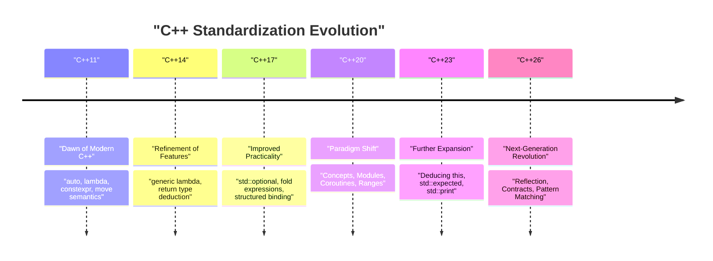
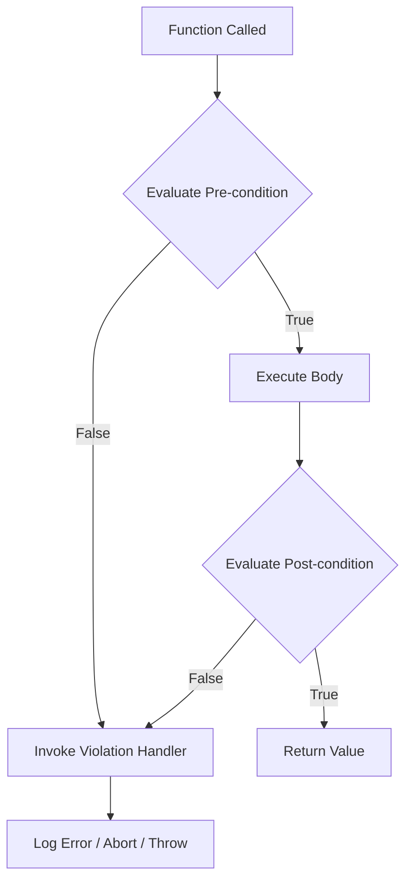

# Introduction: The Next-Generation Programming Paradigm Brought by C++26

In 2026, a very important milestone in the history of C++, **C++26**, has been officially standardized. Since the concept of "Modern C++" was born in C++11, it has steadily evolved through C++14, C++17, C++20, and C++23. C++26, however, brings a powerful paradigm shift that overturns common sense in metaprogramming, error handling, and concurrent processing in both language features and the standard library.

This article thoroughly explains the major new features introduced in C++26, covering technical details, compile-time performance improvements, comparisons with existing code up to C++23, and practical usage. With a volume of over 10,000 characters, it comprehensively covers reflection, contract programming (Contracts), pattern matching, Pack Indexing, expansion of structured bindings, and the evolution of the standard library, including Senders/Receivers.

First, let's visually confirm the history of C++ standardization and the positioning of C++26.



C++26 aims to maximize the **self-descriptiveness of code (reflection)** and **robustness (contract programming)** on top of the large-scale feature groups like Concepts and Modules introduced in C++20. Now, let's delve into the details of each feature.

---

# 1. Reflection (Static Reflection): The True Revolution of Metaprogramming

It is no exaggeration to say that the biggest highlight of C++26 is **Static Reflection** (based mainly on proposals like P2996). Previously in C++, to obtain information about the structure of a type or member variables from within a program, it was necessary to use complex template metaprogramming (TMP) or macros. However, with the reflection mechanism of C++26, it is now possible to safely and intuitively access the program's own structure (AST: Abstract Syntax Tree information) at compile time.

## 1.1 Challenges up to C++23

Consider the case where you want to serialize all member variables of a struct to JSON prior to C++23. Since there was no standard language feature to enumerate the members of a struct, you had to use third-party libraries like Boost.Describe or Boost.Pfr, or define custom macros to register the members.

This led to increased compile times and difficult-to-understand error messages. From a mathematical perspective, parsing type information using traditional recursive template instantiation required $O(N)$ compile-time complexity for $N$ elements, and in the worst case, $O(N^2)$ instantiations for complex metafunctions.

$$
T_{\text{compile}}(N) \approx O(N^2) \quad \text{(Recursive Template Metaprogramming)}
$$

## 1.2 Reflection Syntax and Approach in C++26

Reflection in C++26 uses the `^` operator (reflection operator) and the `[: ... :]` syntax (splicer). `^T` retrieves the "meta-information" of a type or variable, which is treated as a compile-time constant object of type `std::meta::info`.

```cpp
#include <iostream>
#include <string>
#include <meta>

struct User {
    int id;
    std::string name;
    std::string email;
};

// Generic serializer using C++26 static reflection
template <typename T>
void print_json(const T& obj) {
    constexpr auto type_info = ^T;
    
    std::cout << "{\n";
    // Iterate by retrieving struct member information
    template for (constexpr auto member : std::meta::nonstatic_data_members_of(type_info)) {
        // Expand to the original symbol using [: member :], and get the identifier (name) as a string
        std::cout << "  \"" << std::meta::identifier_of(member) << "\": " 
                  << obj.[:member:] << ",\n";
    }
    std::cout << "}\n";
}

int main() {
    User u{1, "Alice", "alice@example.com"};
    print_json(u);
    return 0;
}
```

In this code, `template for` (compile-time loop unrolling) is used to enumerate all members of the `User` struct.

## 1.3 Performance and Compile-Time Complexity

The greatest benefit of this new feature is the **reduction in compile time**. Because meta-information is manipulated directly inside the compiler, element access and iteration are processed with $O(1)$ overhead. Since they are evaluated immediately as constant expressions, the complexity of compile time is dramatically improved.

$$
T_{\text{compile\_new}}(N) = O(N) \quad \text{(Direct AST Traversal)}
$$

This eliminates issues like compiler memory exhaustion due to template nesting and lengthy error messages (a sea of template errors).

```mermaid
graph TD
    A["Type: User"] -->| "^User" | B["std::meta::info"]
    B -->| "nonstatic_data_members_of" | C["Range of meta::info"]
    C -->| "[: member :]" | D["Direct Member Access (obj.id, obj.name)"]
    D --> E["Generated Code (Zero Overhead)"]
```

---

# 2. Contract Programming (Contracts): Robust Software Design

**Contracts (Contract Programming)**, which has been long debated since its introduction was deferred in C++20, has finally been introduced in C++26 (compliant with P2900, etc.). It supports the "Design by Contract" paradigm as a built-in language feature, allowing declarative writing of function pre-conditions, post-conditions, and assertions.

## 2.1 Basic Syntax of Contracts

In C++26, contract attributes are attached to function declarations.

*   `pre` : Conditions that must be satisfied before the function is called
*   `post` : Conditions that must be satisfied when the function finishes and returns a value
*   `assert` : Conditions that must be satisfied at specific points within the function

```cpp
#include <vector>
#include <numeric>

// Safe average calculation using contract programming
// Pre-condition: The passed vector must not be empty
// Post-condition: The calculated average must be greater than or equal to the minimum value and less than or equal to the maximum value of the vector
double calculate_average(const std::vector<double>& v)
    pre (!v.empty())
    post (r : r >= *std::min_element(v.begin(), v.end()) && 
              r <= *std::max_element(v.begin(), v.end()))
{
    double sum = std::accumulate(v.begin(), v.end(), 0.0);
    double avg = sum / v.size();
    
    // Assertion during processing
    assert(avg == avg); // Check for NaN, etc.
    
    return avg; // Bound to 'r' in the post-condition
}
```

## 2.2 Contract Violation Handling and Runtime Evaluation

Contracts are not just comments or the old `assert()` macros. Depending on the build mode (development build, production build, etc.), you can instruct the compiler on the **behavior upon violation**. For example, you can implement flexible operations such as crashing (aborting) immediately upon a violation during development, or calling a custom violation handler to log and continue in a production environment.



By utilizing Contracts, API specifications not only become self-documenting but also allow programs to be safely stopped or controlled before triggering undefined behavior (UB), which is expected to significantly reduce memory corruption bugs and logic bugs unique to C++.

---

# 3. Pattern Matching: Refinement of Branching

Since `std::variant` and `std::any` were introduced in C++17, `std::visit` has been used to dispatch variables holding various types. However, the combination of `std::visit` and the overload pattern (the so-called `overloaded` struct hack) was highly verbose and hard to read.

In C++26, **Pattern Matching** is integrated as a language feature (compliant with P2688). This enables intuitive matching, much closer to functional languages (like Rust or Haskell).

## 3.1 The Struggle with `std::visit` up to C++23

```cpp
// Syntax up to C++23
template<class... Ts> struct overloaded : Ts... { using Ts::operator()...; };
template<class... Ts> overloaded(Ts...) -> overloaded<Ts...>;

std::variant<int, std::string, double> v = "Hello";

std::visit(overloaded {
    [](int i) { std::cout << "Int: " << i << '\n'; },
    [](const std::string& s) { std::cout << "String: " << s << '\n'; },
    [](double d) { std::cout << "Double: " << d << '\n'; }
}, v);
```

## 3.2 Dramatic Improvement with C++26's `inspect` Syntax

By using the new `inspect` keyword, you can write this much more cleanly as follows.

```cpp
// Pattern matching in C++26
std::variant<int, std::string, double> v = "Hello";

inspect (v) {
    int i => std::cout << "Int: " << i << '\n';
    std::string s => std::cout << "String: " << s << '\n';
    double d => std::cout << "Double: " << d << '\n';
    _ => std::cout << "Unknown type\n"; // Wildcard
};
```

This pattern matching goes beyond simple type dispatching; it also supports **struct destructuring** (decomposition) and **guard conditions** (matching only when specific conditions are met).

```cpp
struct Point { int x, y; };
std::variant<Point, int> var = Point{10, 20};

inspect (var) {
    // Adding a guard condition (if) while binding struct elements
    [x, y] as Point if (x == y) => { std::cout << "Diagonal: " << x << '\n'; }
    [x, y] as Point => { std::cout << "Point: " << x << ", " << y << '\n'; }
    int i => { std::cout << "Scalar: " << i << '\n'; }
};
```

Because the compiler performs exhaustiveness checking on this `inspect` statement, any missed cases in handling enumerations (enums) or `std::variant` will be reported as compile errors. This is extremely important for improving maintainability.

---

# 4. Pack Indexing: Salvation for Template Parameter Packs

Variadic Templates, introduced since C++11, are very powerful, but extracting the $N$-th type or value from a parameter pack was unintuitive. Previously, there was no choice but to use `std::tuple_element` or recursive templates to extract them.

In C++26, the **Pack Indexing** feature (P2662) has been introduced, allowing it to be written more naturally like an array index access.

## 4.1 Basics of Pack Indexing

The syntax is very simple, written as `Types...[I]`.

```cpp
#include <iostream>
#include <type_traits>

// Function to get the N-th type
template <std::size_t N, typename... Types>
constexpr auto get_nth_type() {
    // Direct access to the N-th type using Types...[N]
    return Types...[N]{};
}

// Function to get the N-th value from variadic arguments
template <std::size_t N, typename... Args>
constexpr decltype(auto) get_nth_value(Args&&... args) {
    // Index access is also possible for the parameter pack args
    return std::forward<Args...[N]>(args...[N]);
}

int main() {
    // Accessing a type
    using SecondType = decltype(get_nth_type<1, int, double, char>());
    static_assert(std::is_same_v<SecondType, double>);

    // Accessing a value
    auto val = get_nth_value<2>(10, 3.14, "Hello C++26", 'c');
    std::cout << val << std::endl; // Output: "Hello C++26"
}
```

The compiler can now process pack indices in constant time $O(1)$, reducing the lengthy compile times that were previously caused by nesting metafunctions.

---

# 5. Expansion of Structured Bindings

Structured bindings, introduced in C++17, are very convenient when receiving multiple return values from a function. However, when you only want to use some variables and ignore others, you had to define dummy variables, taking extra effort to avoid "unused variable" warnings.

In C++26, using `_` (underscore) as a placeholder has been officially permitted.

```cpp
#include <map>
#include <string>
#include <iostream>

std::map<int, std::string> get_data() {
    return {{1, "One"}, {2, "Two"}, {3, "Three"}};
}

int main() {
    auto data = get_data();
    
    for (const auto& [id, _] : data) {
        // Only use the key (ID), ignoring the value (string)
        std::cout << "ID: " << id << '\n';
    }
}
```

This minor extension makes the code's intent clearer and prevents the abuse of `#pragma` or `[[maybe_unused]]` attributes to suppress unnecessary warnings.

---

# 6. Evolution of the Standard Library: Redefining Concurrency and Asynchrony

Beyond language features, the C++26 standard library (STL) has also undergone dramatic evolution. Especially in the areas of asynchronous processing and memory management, advanced components that meet the demands of enterprise and systems programming have been introduced.

## 6.1 Senders / Receivers (std::execution)

The standardization proposal (P2300), which completely rebuilds the C++ asynchronous processing model, has finally come to fruition in C++26. To resolve the performance issues (excessive memory allocation and scheduling inefficiencies) associated with `std::async` and `std::future`, the **Senders/Receivers** model was introduced.


Senders are lightweight blueprints that describe "what to do" and are separated from the execution context (Scheduler). This allows you to efficiently describe the offloading of tasks to a CPU ThreadPool or GPU through a unified interface.

```cpp
#include <execution>
#include <iostream>
#include <syncstream>

using namespace std::execution;

int main() {
    auto scheduler = get_system_thread_pool().scheduler();

    // Task pipeline (not executed at this point: lazy evaluation)
    auto task = schedule(scheduler)
              | then([] { return 42; })
              | then([](int val) { return val * 2; })
              | upon_error([](std::exception_ptr e) { return 0; });

    // Wait for the result synchronously with sync_wait
    auto [result] = sync_wait(task).value();
    
    std::osyncstream(std::cout) << "Result: " << result << std::endl;
}
```

## 6.2 Hazard Pointers and RCU (Read-Copy Update)

**Hazard Pointers** (`std::hazard_pointer`) and **RCU** (`std::rcu`) have been standardized as standard features supporting the implementation of lock-free data structures. This significantly lowers the barrier for implementing high-performance concurrent data structures in C++.

RCU eliminates cache line contention, especially in workloads where reads are overwhelmingly frequent, achieving linear scalability. Expressed mathematically, the read throughput shows an ideal $O(T)$ increase with respect to the number of threads $T$.

$$
\text{Throughput}_{\text{RCU}} \propto T \quad \text{(Read-heavy Workloads)}
$$

---

# 7. Practical Transition Guide and Benefits of Adoption

Transitioning to C++26 requires a massive paradigm shift, similar to C++11, but it offers the benefit of greatly improving the safety and compile times of the codebase.

1.  **Revamping Metaprogramming**: By rewriting serializers and ORM (Object-Relational Mapping) frameworks composed of complex `template` and nested `constexpr if` with C++26 reflection, maintainability can be dramatically improved, and compile times could potentially be reduced to a fraction of their current length.
2.  **API Design with Contracts**: Class library designers should explicitly state specifications at the language level using Contracts (`pre` / `post`) rather than relying on documentation comments like Doxygen. This allows for early detection of invalid calls by the user.
3.  **Modernizing Asynchronous Processing**: By migrating custom implementations or asynchronous processing that depended on Boost.Asio to `std::execution` (Senders/Receivers), you can build a standardized concurrent processing foundation that transcends platforms and hardware.

## Cautions During Transition: ABI Stability and Compiler Support

Since new language features, particularly Contracts, can affect function signatures and ABI (Application Binary Interface), you must strongly verify that everything is compiled with the same compiler and standard library versions (GCC, Clang, MSVC) when crossing shared library (DLL / .so) boundaries.

---

# Conclusion

C++26 is truly a historic release, where the "dream features" that C++ programmers have long awaited are introduced all at once.

*   **Reflection** dispels the difficulty of metaprogramming and achieves $O(1)$ AST access.
*   **Contract Programming** allows building robust programs by explicitly declaring function pre- and post-conditions.
*   **Pattern Matching** allows intuitive and safe description of complex branches and state transitions.
*   **Senders/Receivers** and **RCU / Hazard Pointers** standardize concurrent processing that draws out ultimate performance.

By appropriately utilizing these features, the greatest strength of C++, "Zero-overhead Abstraction", can be achieved at a higher level, and with surprisingly clean code.

Going forward, we recommend actively adopting these new paradigms in new projects and library development while closely monitoring the implementation status of C++26 features by each compiler vendor (e.g., Feature Test Macros). C++ is by no means an old language; eagerly incorporating cutting-edge language theory, it will undoubtedly continue to reign supreme in systems programming.

---
*This article is written based on the C++26 standardization status as of 2026. Please be aware that some syntax may change depending on the implementation status of each compiler.*
