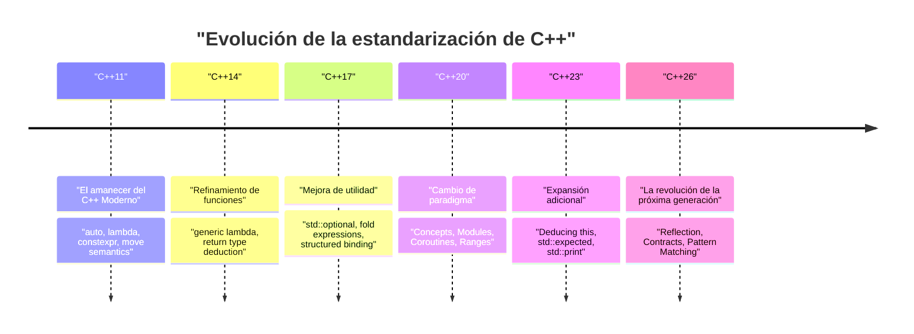
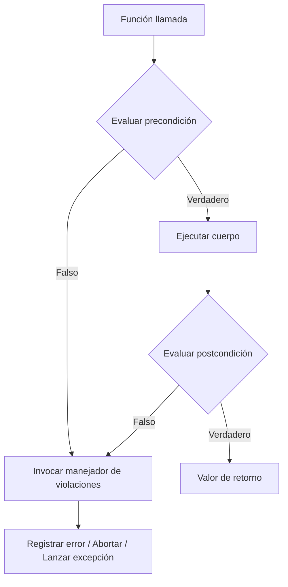
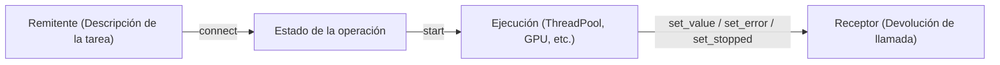

# Introducción: El paradigma de programación de próxima generación que trae C++26

En 2026, **C++26** fue estandarizado oficialmente, marcando un hito muy importante en la historia de C++. Desde que nació el concepto de "C++ Moderno" en C++11, el lenguaje ha evolucionado constantemente a través de C++14, C++17, C++20 y C++23. Sin embargo, C++26 aporta un poderoso cambio de paradigma que desafía el sentido común convencional de la metaprogramación, el manejo de errores y el procesamiento concurrente, tanto en términos de características del lenguaje como de la biblioteca estándar.

En este artículo, explicaremos en profundidad las principales novedades introducidas en C++26, incluyendo detalles técnicos, mejoras de rendimiento en tiempo de compilación, comparaciones con el código existente hasta C++23 y guías de uso práctico. Con un volumen que supera las 10,000 palabras, cubrimos de manera integral Reflection (Reflexión), Contracts (Programación por contratos), Pattern Matching (Coincidencia de patrones), Pack Indexing, expansión de Structured Bindings (Vinculaciones estructuradas) y la evolución de la biblioteca estándar incluyendo Senders/Receivers.

En primer lugar, confirmemos visualmente la historia de la estandarización de C++ y la posición de C++26.



C++26 tiene como objetivo maximizar la **autodescripción del código (Reflection)** y la **robustez (Programación por contratos)** sobre el conjunto de características a gran escala como Concepts y Modules introducidos en C++20. Ahora, profundicemos en los detalles de cada característica.

---

# 1. Reflexión (Static Reflection): La verdadera revolución de la metaprogramación

No es exagerado decir que la característica más destacada de C++26 es la **reflexión estática (Static Reflection)** (basada principalmente en propuestas como P2996). Hasta ahora, para obtener información sobre la estructura de los tipos y las variables miembro dentro de un programa C++, era necesario utilizar macros o metaprogramación de plantillas (TMP) complejas. Sin embargo, con el mecanismo de reflexión de C++26, ahora es posible acceder de forma segura e intuitiva a la estructura del programa mismo (información del AST: Árbol de Sintaxis Abstracta) en tiempo de compilación.

## 1.1 Desafíos previos hasta C++23

Consideremos el caso en el que queremos serializar todas las variables miembro de una estructura a JSON en C++23 o anterior. Como no existía un método en las características estándar del lenguaje para enumerar los miembros de una estructura, era necesario usar bibliotecas de terceros como Boost.Describe o Boost.Pfr, o definir macros personalizadas para registrar los miembros.

Esto provocaba un aumento en el tiempo de compilación y mensajes de error incomprensibles. Desde una perspectiva matemática, el análisis de la información de tipos usando la instanciación de plantillas recursiva convencional requería una complejidad computacional en tiempo de compilación de $O(N)$ para $N$ elementos, e instanciaciones de $O(N^2)$ en el peor de los casos para metafunciones complejas.

$$
T_{\text{compile}}(N) \approx O(N^2) \quad \text{(Recursive Template Metaprogramming)}
$$

## 1.2 Sintaxis y enfoque de la reflexión en C++26

La reflexión en C++26 usa el operador `^` (operador de reflexión) y la sintaxis `[: ... :]` (empalmador o splicer). Con `^T`, se obtiene la "metainformación" de tipos y variables, la cual se trata como un objeto constante de tipo `std::meta::info` en tiempo de compilación.

```cpp
#include <iostream>
#include <string>
#include <meta>

struct User {
    int id;
    std::string name;
    std::string email;
};

// Serializador genérico utilizando la reflexión estática de C++26
template <typename T>
void print_json(const T& obj) {
    constexpr auto type_info = ^T;
    
    std::cout << "{\n";
    // Obtener información de los miembros de la estructura e iterar
    template for (constexpr auto member : std::meta::nonstatic_data_members_of(type_info)) {
        // [: member :] se expande al símbolo original, y se obtiene el identificador (nombre) como cadena
        std::cout << "  \"" << std::meta::identifier_of(member) << "\": " 
                  << obj.[:member:] << ",\n";
    }
    std::cout << "}\n";
}

int main() {
    User u{1, "Alice", "alice@example.com"};
    print_json(u);
    return 0;
}
```

En este código, se utiliza `template for` (desenrollado de bucles en tiempo de compilación) para enumerar todos los miembros de la estructura `User`.

## 1.3 Rendimiento y complejidad en tiempo de compilación

El mayor beneficio de esta nueva característica es la **reducción del tiempo de compilación**. Dado que la metainformación se manipula directamente dentro del compilador, el acceso a los elementos y la iteración se procesan con una sobrecarga de $O(1)$. Debido a que se evalúa inmediatamente como una expresión constante, la complejidad del tiempo de compilación mejora drásticamente.

$$
T_{\text{compile\_new}}(N) = O(N) \quad \text{(Direct AST Traversal)}
$$

Te librarás del agotamiento de memoria del compilador causado por el anidamiento de plantillas y de los interminables mensajes de error (el mar de errores de plantillas).

```mermaid
graph TD
    A["Tipo: User"] -->| "^User" | B["std::meta::info"]
    B -->| "nonstatic_data_members_of" | C["Rango de meta::info"]
    C -->| "[: member :]" | D["Acceso directo a miembros (obj.id, obj.name)"]
    D --> E["Código generado (Cero sobrecarga)"]
```

---

# 2. Programación por contratos (Contracts): Diseño de software robusto

Después de una larga discusión desde que se pospuso su introducción en C++20, **Contracts (Programación por contratos)** finalmente se ha introducido en C++26 (P2900, etc.). El paradigma "Design by Contract" ahora es compatible de forma nativa en el lenguaje, permitiendo escribir precondiciones (Pre-condition), postcondiciones (Post-condition) y aserciones (Assertion) de funciones de manera declarativa.

## 2.1 Sintaxis básica de Contracts

En C++26, se asignan atributos de contrato a las declaraciones de funciones.

*   `pre` : Condiciones que deben cumplirse antes de llamar a la función.
*   `post` : Condiciones que deben cumplirse al finalizar la función y devolver un valor.
*   `assert` : Condiciones que deben cumplirse en un punto específico dentro de la función.

```cpp
#include <vector>
#include <numeric>

// Cálculo seguro del promedio mediante programación por contratos
// Precondición: El vector pasado no debe estar vacío
// Postcondición: El promedio calculado es mayor o igual al mínimo del vector y menor o igual al máximo
double calculate_average(const std::vector<double>& v)
    pre (!v.empty())
    post (r : r >= *std::min_element(v.begin(), v.end()) && 
              r <= *std::max_element(v.begin(), v.end()))
{
    double sum = std::accumulate(v.begin(), v.end(), 0.0);
    double avg = sum / v.size();
    
    // Aserción durante el proceso
    assert(avg == avg); // Comprobación de NaN, etc.
    
    return avg; // Vinculado a la postcondición 'r'
}
```

## 2.2 Manejo de violaciones de contrato y evaluación en tiempo de ejecución

Contracts es diferente a los simples comentarios o la antigua macro `assert()`. Dependiendo del modo de compilación (compilación de desarrollo, compilación de producción, etc.), se puede indicar al compilador el **comportamiento en caso de violación**. Por ejemplo, permite operaciones flexibles como bloquear (abortar) el programa inmediatamente ante una violación durante el desarrollo, o llamar a un manejador de violaciones personalizado para registrar el error y continuar en un entorno de producción.



Al utilizar Contracts, no solo las especificaciones de la API se autodocumentan, sino que también es posible detener y controlar el programa de manera segura antes de causar comportamientos indefinidos (Undefined Behavior, UB). Por lo tanto, se espera una reducción significativa de errores de corrupción de memoria y errores lógicos peculiares de C++.

---

# 3. Coincidencia de patrones (Pattern Matching): Refinamiento de las ramificaciones

Desde la introducción de `std::variant` y `std::any` en C++17, se ha utilizado `std::visit` para despachar variables que contienen varios tipos. Sin embargo, la combinación de `std::visit` y el patrón de sobrecarga (el llamado hack de la estructura `overloaded`) era extremadamente redundante y de poca legibilidad.

En C++26, se incorporó la **coincidencia de patrones (Pattern Matching)** como una característica del lenguaje (conforme a P2688). Esto permite una coincidencia intuitiva similar a la de los lenguajes funcionales (como Rust o Haskell).

## 3.1 La lucha con `std::visit` hasta C++23

```cpp
// Código hasta C++23
template<class... Ts> struct overloaded : Ts... { using Ts::operator()...; };
template<class... Ts> overloaded(Ts...) -> overloaded<Ts...>;

std::variant<int, std::string, double> v = "Hello";

std::visit(overloaded {
    [](int i) { std::cout << "Int: " << i << '\n'; },
    [](const std::string& s) { std::cout << "String: " << s << '\n'; },
    [](double d) { std::cout << "Double: " << d << '\n'; }
}, v);
```

## 3.2 Mejora drástica con la sintaxis `inspect` de C++26

Al utilizar la nueva palabra clave `inspect`, ahora se puede escribir de forma muy elegante de la siguiente manera.

```cpp
// Coincidencia de patrones en C++26
std::variant<int, std::string, double> v = "Hello";

inspect (v) {
    int i => std::cout << "Int: " << i << '\n';
    std::string s => std::cout << "String: " << s << '\n';
    double d => std::cout << "Double: " << d << '\n';
    _ => std::cout << "Unknown type\n"; // Comodín (Wildcard)
};
```

Esta coincidencia de patrones no se limita simplemente al despacho de tipos, sino que también admite la **desestructuración de estructuras** (descomposición) y **condiciones de guarda** (coincidencia solo si se cumple una condición específica).

```cpp
struct Point { int x, y; };
std::variant<Point, int> var = Point{10, 20};

inspect (var) {
    // Vincular los elementos de la estructura y aplicar una condición de guarda (if)
    [x, y] as Point if (x == y) => { std::cout << "Diagonal: " << x << '\n'; }
    [x, y] as Point => { std::cout << "Point: " << x << ", " << y << '\n'; }
    int i => { std::cout << "Scalar: " << i << '\n'; }
};
```

El compilador realiza una comprobación de exhaustividad (Exhaustiveness checking) para esta declaración `inspect`, de modo que, si falta algún caso en el procesamiento de enumeraciones (enum) o `std::variant`, se informará como un error de compilación. Esto es extremadamente importante para mejorar la mantenibilidad.

---

# 4. Pack Indexing: Salvación para los paquetes de parámetros de plantillas

Las plantillas variádicas (Variadic Templates) desde C++11 son muy potentes, pero la operación de extraer el $N$-ésimo tipo o valor de un paquete de parámetros no era intuitiva. Hasta ahora, la única forma de extraerlo era haciendo un uso extensivo de `std::tuple_element` o de plantillas recursivas.

En C++26, se introdujo la función de **Pack Indexing** (Indexación de paquetes, P2662), lo que permite escribir de forma mucho más natural, como si se tratara del acceso al índice de una matriz.

## 4.1 Conceptos básicos de Pack Indexing

La sintaxis es muy sencilla y se escribe como `Types...[I]`.

```cpp
#include <iostream>
#include <type_traits>

// Función para obtener el enésimo tipo
template <std::size_t N, typename... Types>
constexpr auto get_nth_type() {
    // Acceso directo al enésimo tipo con Types...[N]
    return Types...[N]{};
}

// Función para obtener el enésimo valor de argumentos variádicos
template <std::size_t N, typename... Args>
constexpr decltype(auto) get_nth_value(Args&&... args) {
    // El acceso por índice también es posible para el paquete de parámetros args
    return std::forward<Args...[N]>(args...[N]);
}

int main() {
    // Acceso a tipos
    using SecondType = decltype(get_nth_type<1, int, double, char>());
    static_assert(std::is_same_v<SecondType, double>);

    // Acceso a valores
    auto val = get_nth_value<2>(10, 3.14, "Hello C++26", 'c');
    std::cout << val << std::endl; // Imprime "Hello C++26"
}
```

El compilador ahora puede procesar índices de paquetes en un tiempo constante $O(1)$, reduciendo los largos tiempos de compilación causados previamente por el anidamiento de metafunciones.

---

# 5. Expansión de las vinculaciones estructuradas (Structured Bindings)

Las vinculaciones estructuradas introducidas en C++17 son muy útiles para recibir múltiples valores de retorno de una función. Sin embargo, al usar solo algunas variables y querer ignorar otras, era necesario definir variables ficticias, lo que dificultaba evitar las advertencias de "variable no utilizada (unused variable)".

En C++26, ahora está oficialmente permitido usar `_` (guión bajo) como marcador de posición.

```cpp
#include <map>
#include <string>
#include <iostream>

std::map<int, std::string> get_data() {
    return {{1, "One"}, {2, "Two"}, {3, "Three"}};
}

int main() {
    auto data = get_data();
    
    for (const auto& [id, _] : data) {
        // Ignora el valor (cadena) y utiliza solo la clave (ID)
        std::cout << "ID: " << id << '\n';
    }
}
```

Con esta pequeña expansión, la intención del código se vuelve más clara y evita el uso abusivo de directivas `#pragma` o atributos `[[maybe_unused]]` para suprimir advertencias innecesarias.

---

# 6. Evolución de la biblioteca estándar: Redefinición del procesamiento concurrente y asíncrono

No solo las funciones del lenguaje, sino también la biblioteca estándar de C++ (STL) ha experimentado una evolución dramática en C++26. Especialmente en las áreas de procesamiento asíncrono y gestión de memoria, se han introducido componentes avanzados que satisfacen las demandas de la programación de sistemas y aplicaciones empresariales.

## 6.1 Senders / Receivers (std::execution)

La propuesta de estandarización (P2300) que reconstruye fundamentalmente el modelo de procesamiento asíncrono de C++ finalmente ha dado sus frutos en C++26. Para resolver los problemas de rendimiento (asignación excesiva de memoria e ineficiencia de programación) de `std::async` y `std::future`, se ha introducido el modelo **Senders/Receivers**.



Los Senders son planos ligeros que describen "qué se debe hacer" y están separados del contexto de ejecución (Scheduler). Esto permite describir de manera eficiente la descarga de tareas al ThreadPool de la CPU o la GPU utilizando una interfaz unificada.

```cpp
#include <execution>
#include <iostream>
#include <syncstream>

using namespace std::execution;

int main() {
    auto scheduler = get_system_thread_pool().scheduler();

    // Tubería de tareas (no se ejecuta en este punto: evaluación perezosa)
    auto task = schedule(scheduler)
              | then([] { return 42; })
              | then([](int val) { return val * 2; })
              | upon_error([](std::exception_ptr e) { return 0; });

    // Esperar de forma síncrona el resultado con sync_wait
    auto [result] = sync_wait(task).value();
    
    std::osyncstream(std::cout) << "Result: " << result << std::endl;
}
```

## 6.2 Punteros de peligro (Hazard Pointers) y RCU (Read-Copy Update)

Como características estándar que apoyan la implementación de estructuras de datos libres de bloqueos (lock-free), se han estandarizado **Hazard Pointers** (`std::hazard_pointer`) y **RCU** (`std::rcu`). Como resultado, la barrera de entrada para implementar estructuras de datos concurrentes de alto rendimiento en C++ ha disminuido considerablemente.

RCU elimina la contención de las líneas de caché y logra una escalabilidad lineal, especialmente en cargas de trabajo donde las lecturas (reads) son abrumadoramente frecuentes. Expresado matemáticamente, para $T$ hilos, el rendimiento de lectura muestra un incremento ideal de $O(T)$.

$$
\text{Throughput}_{\text{RCU}} \propto T \quad \text{(Read-heavy Workloads)}
$$

---

# 7. Guía de transición práctica y beneficios de su adopción

La transición a C++26 requiere un cambio de paradigma a gran escala similar al de C++11, pero tiene la ventaja de mejorar significativamente la seguridad y el tiempo de compilación del código base.

1.  **Renovación de la metaprogramación**: Los frameworks de serialización o ORM (Object-Relational Mapping) construidos con anidamientos complejos de `template` o `constexpr if` pueden reescribirse utilizando la reflexión de C++26, lo que mejora drásticamente la mantenibilidad y puede reducir el tiempo de compilación a una fracción de su duración original.
2.  **Diseño de API con Contracts**: Los diseñadores de bibliotecas de clases no deben depender de comentarios de documentación como Doxygen, sino que deben especificar claramente el comportamiento utilizando Contracts (`pre` / `post`) a nivel del lenguaje. Esto permite detectar de forma temprana las llamadas inválidas por parte de los usuarios de la biblioteca.
3.  **Modernización del procesamiento asíncrono**: Al migrar el procesamiento asíncrono que dependía de implementaciones propias o Boost.Asio a `std::execution` (Senders/Receivers), es posible construir una base de procesamiento concurrente estandarizada que trascienda plataformas y hardware.

## Puntos a tener en cuenta durante la transición: Estabilidad de la ABI y soporte del compilador

Dado que las nuevas características del lenguaje, especialmente Contracts, pueden afectar las firmas de las funciones y la ABI (Application Binary Interface), si se utilizan a través de los límites de bibliotecas compartidas (DLL / .so), es estrictamente necesario asegurarse de que estén compiladas con la misma versión del compilador y la biblioteca estándar (GCC, Clang, MSVC).

---

# Conclusión

C++26 es una versión verdaderamente histórica en la que se introducen de golpe las "características de los sueños" que los programadores de C++ han estado esperando durante años.

*   Con **Reflection (Reflexión)**, la complejidad de la metaprogramación se elimina y se logra un acceso al AST de $O(1)$.
*   Con **Contracts (Programación por contratos)**, se pueden establecer explícitamente precondiciones y postcondiciones de funciones para construir programas robustos.
*   Con **Pattern Matching (Coincidencia de patrones)**, las ramificaciones complejas y transiciones de estado se pueden describir de forma intuitiva y segura.
*   Con **Senders/Receivers** y **RCU / Hazard Pointers**, se estandariza el procesamiento concurrente para maximizar el rendimiento extremo.

Al utilizar adecuadamente estas características, la mayor ventaja de C++, la "abstracción sin sobrecarga" (Zero-overhead Abstraction), se podrá lograr a un nivel superior y con un código sorprendentemente limpio.

En el futuro, recomendamos encarecidamente adoptar de manera proactiva estos nuevos paradigmas en el desarrollo de nuevos proyectos y bibliotecas, prestando atención al estado de implementación de las funciones de C++26 por parte de cada proveedor de compiladores (como Feature Test Macros). C++ no es de ninguna manera un lenguaje antiguo, e incorporando ávidamente las teorías de lenguaje más avanzadas, seguirá reinando en la cima de la programación de sistemas.

---
*Este artículo se escribió en función del estado de estandarización de C++26 a partir del año 2026. Tenga en cuenta que parte de la sintaxis puede cambiar según el estado de implementación de cada compilador.*
