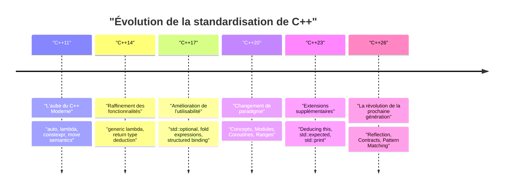
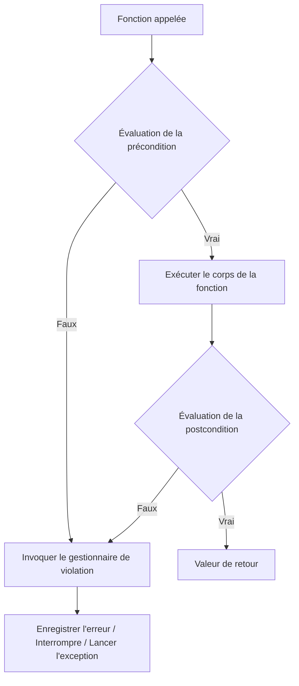
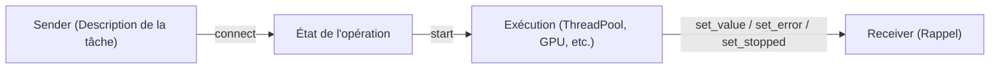

# Introduction : Le paradigme de programmation de la prochaine génération apporté par C++26

En 2026, **C++26**, une étape extrêmement importante dans l'histoire de C++, a été officiellement standardisée. Depuis l'émergence du concept de "Modern C++" avec C++11, le langage a évolué de manière constante avec C++14, C++17, C++20 et C++23. Cependant, C++26 apporte un changement de paradigme puissant qui bouleverse le sens commun en matière de métaprogrammation, de gestion des erreurs et de traitement concurrent, tant au niveau des fonctionnalités du langage que de la bibliothèque standard.

Cet article explique en détail les principales nouveautés introduites par C++26 : les détails techniques, l'amélioration des performances à la compilation, la comparaison avec le code existant jusqu'à C++23, et leur utilisation pratique. Avec un volume dépassant les 10 000 caractères, il couvre un large éventail de sujets, allant de la réflexion (Reflection) à la programmation par contrat (Contracts), au filtrage par motif (Pattern Matching), à l'indexation de packs (Pack Indexing) et à l'extension des liaisons structurées (Structured Bindings), jusqu'à l'évolution de la bibliothèque standard incluant les Senders/Receivers.

Commençons par examiner visuellement l'historique de la standardisation de C++ et le positionnement de C++26.



C++26 s'appuie sur des groupes de fonctionnalités majeurs tels que les Concepts et les Modules, introduits dans C++20, et vise à maximiser **l'auto-description du code (réflexion)** et **la robustesse (programmation par contrat)**. Plongeons maintenant dans les détails de chaque fonctionnalité.

---

# 1. Réflexion (Static Reflection) : La véritable révolution de la métaprogrammation

Il n'est pas exagéré de dire que la fonctionnalité phare de C++26 est la **réflexion statique (Static Reflection)** (principalement basée sur des propositions comme P2996). Jusqu'à présent en C++, pour obtenir des informations sur la structure d'un type ou de ses variables membres depuis le programme, il était nécessaire d'utiliser une métaprogrammation par templates (TMP) complexe ou des macros. Cependant, grâce au mécanisme de réflexion de C++26, il est désormais possible d'accéder de manière sûre et intuitive à la structure même du programme (les informations de l'AST : arbre syntaxique abstrait) au moment de la compilation.

## 1.1 Les défis jusqu'à C++23

Considérons le cas où, avant C++23, nous voulions sérialiser toutes les variables membres d'une structure en JSON. Comme il n'existait aucun moyen standard d'énumérer les membres d'une structure au niveau du langage, il fallait soit utiliser des bibliothèques tierces comme Boost.Describe ou Boost.Pfr, soit définir ses propres macros pour enregistrer les membres.

Cela entraînait une augmentation du temps de compilation et rendait les messages d'erreur très difficiles à comprendre. D'un point de vue mathématique, l'analyse des informations de type à l'aide de l'instanciation de modèles récursifs nécessitait une complexité de compilation de $O(N)$ pour $N$ éléments, et dans le pire des cas, $O(N^2)$ instanciations pour des métafonctions complexes.

$$
T_{\text{compile}}(N) \approx O(N^2) \quad \text{(Recursive Template Metaprogramming)}
$$

## 1.2 Syntaxe et approche de la réflexion en C++26

La réflexion en C++26 utilise l'opérateur `^` (opérateur de réflexion) et la syntaxe `[: ... :]` (splicer). `^T` permet de récupérer les "méta-informations" d'un type ou d'une variable, et celles-ci sont manipulées comme des objets constants à la compilation de type `std::meta::info`.

```cpp
#include <iostream>
#include <string>
#include <meta>

struct User {
    int id;
    std::string name;
    std::string email;
};

// Sérialiseur générique utilisant la réflexion statique de C++26
template <typename T>
void print_json(const T& obj) {
    constexpr auto type_info = ^T;
    
    std::cout << "{\n";
    // Récupérer et itérer sur les informations des membres de la structure
    template for (constexpr auto member : std::meta::nonstatic_data_members_of(type_info)) {
        // Déplier dans le symbole d'origine avec [: member :] et récupérer l'identifiant (nom) sous forme de chaîne
        std::cout << "  \"" << std::meta::identifier_of(member) << "\": " 
                  << obj.[:member:] << ",\n";
    }
    std::cout << "}\n";
}
```

Dans ce code, on utilise `template for` (déploiement de boucle à la compilation) pour énumérer tous les membres de la structure `User`.

## 1.3 Performances et complexité à la compilation

Le plus grand avantage de cette nouvelle fonctionnalité est **la réduction du temps de compilation**. Étant donné que le compilateur manipule directement les méta-informations en interne, l'accès aux éléments et l'itération sont traités avec un surcoût de $O(1)$. Comme cela est évalué immédiatement en tant qu'expression constante, la complexité du temps de compilation est considérablement améliorée.

$$
T_{\text{compile\_new}}(N) = O(N) \quad \text{(Direct AST Traversal)}
$$

Vous n'aurez plus affaire à l'épuisement de la mémoire du compilateur dû à l'imbrication de modèles, ni aux messages d'erreur interminables (la mer d'erreurs de modèles).

```mermaid
graph TD
    A["Type: User"] -->| "^User" | B["std::meta::info"]
    B -->| "nonstatic_data_members_of" | C["Plage de meta::info"]
    C -->| "[: member :]" | D["Accès direct aux membres (obj.id, obj.name)"]
    D --> E["Code généré (Zéro surcoût)"]
```

---

# 2. Programmation par contrat (Contracts) : Conception logicielle robuste

Reportés depuis C++20 et discutés depuis longtemps, les **Contracts (Programmation par contrat)** ont finalement été introduits dans C++26 (P2900 etc.). Le paradigme du "Design by Contract" est désormais pris en charge de manière intégrée au langage, ce qui permet de décrire de manière déclarative les préconditions (Pre-condition), les postconditions (Post-condition) et les assertions (Assertion) d'une fonction.

## 2.1 Syntaxe de base des contrats

En C++26, des attributs de contrat sont appliqués aux déclarations de fonctions.

*   `pre` : Condition qui doit être remplie avant l'appel de la fonction.
*   `post` : Condition qui doit être remplie lorsque la fonction se termine et renvoie une valeur.
*   `assert` : Condition qui doit être remplie à un point spécifique à l'intérieur de la fonction.

```cpp
#include <vector>
#include <numeric>

// Calcul sécurisé d'une moyenne via la programmation par contrat
// Précondition : le vecteur passé ne doit pas être vide
// Postcondition : la moyenne calculée est supérieure ou égale à la valeur minimale du vecteur et inférieure ou égale à sa valeur maximale
double calculate_average(const std::vector<double>& v)
    pre (!v.empty())
    post (r : r >= *std::min_element(v.begin(), v.end()) && 
              r <= *std::max_element(v.begin(), v.end()))
{
    double sum = std::accumulate(v.begin(), v.end(), 0.0);
    double avg = sum / v.size();
    
    // Assertion en cours de traitement
    assert(avg == avg); // Vérification de NaN etc.
    
    return avg; // Lié à la variable 'r' de la postcondition
}
```

## 2.2 Gestion des violations de contrat et évaluation à l'exécution

Les contrats diffèrent de simples commentaires ou de l'ancienne macro `assert()`. Selon le mode de compilation (développement, production, etc.), vous pouvez indiquer au compilateur le **comportement à adopter en cas de violation**. Par exemple, vous pouvez provoquer un plantage (abandon) immédiat lors d'une violation en développement, ou appeler un gestionnaire de violation personnalisé dans l'environnement de production pour enregistrer un journal et continuer, offrant ainsi une exploitation très flexible.



L'utilisation des contrats non seulement auto-documente les spécifications de l'API, mais permet également d'arrêter et de contrôler le programme en toute sécurité avant de provoquer un comportement non défini (UB), ce qui laisse présager une réduction drastique des bugs de destruction de mémoire et de logique propres à C++.

---

# 3. Filtrage par motif (Pattern Matching) : Le raffinement des branchements

Depuis l'introduction de `std::variant` et `std::any` en C++17, `std::visit` a été utilisé pour distribuer les variables contenant différents types. Cependant, la combinaison de `std::visit` et du motif de surcharge (le fameux hack de la structure `overloaded`) était extrêmement verbeuse et peu lisible.

Dans C++26, le **filtrage par motif (Pattern Matching)** a été intégré en tant que fonctionnalité du langage (conforme à P2688). Cela permet un appariement intuitif, proche de celui des langages fonctionnels (comme Rust ou Haskell).

## 3.1 Les difficultés avec `std::visit` jusqu'à C++23

```cpp
// Écriture jusqu'à C++23
template<class... Ts> struct overloaded : Ts... { using Ts::operator()...; };
template<class... Ts> overloaded(Ts...) -> overloaded<Ts...>;

std::variant<int, std::string, double> v = "Hello";

std::visit(overloaded {
    [](int i) { std::cout << "Int: " << i << '\n'; },
    [](const std::string& s) { std::cout << "String: " << s << '\n'; },
    [](double d) { std::cout << "Double: " << d << '\n'; }
}, v);
```

## 3.2 L'amélioration spectaculaire via la syntaxe `inspect` de C++26

Grâce au nouveau mot-clé `inspect`, il est possible d'écrire le code de manière beaucoup plus claire.

```cpp
// Filtrage par motif en C++26
std::variant<int, std::string, double> v = "Hello";

inspect (v) {
    int i => std::cout << "Int: " << i << '\n';
    std::string s => std::cout << "String: " << s << '\n';
    double d => std::cout << "Double: " << d << '\n';
    _ => std::cout << "Type inconnu\n"; // Caractère générique (wildcard)
};
```

Ce filtrage par motif ne se limite pas à la simple distribution des types, mais supporte également la **déstructuration de structures** (décomposition) et les **conditions de garde** (ne correspond que si une condition spécifique est remplie).

```cpp
struct Point { int x, y; };
std::variant<Point, int> var = Point{10, 20};

inspect (var) {
    // Lier les éléments de la structure tout en ajoutant une condition de garde (if)
    [x, y] as Point if (x == y) => { std::cout << "Diagonal: " << x << '\n'; }
    [x, y] as Point => { std::cout << "Point: " << x << ", " << y << '\n'; }
    int i => { std::cout << "Scalar: " << i << '\n'; }
};
```

Le compilateur effectue une vérification d'exhaustivité (Exhaustiveness checking) sur cette instruction `inspect`, de sorte que s'il y a un cas manquant dans le traitement des énumérations (enum) ou de `std::variant`, il sera signalé comme erreur de compilation. Ceci est extrêmement important pour améliorer la maintenabilité.

---

# 4. Indexation de packs (Pack Indexing) : Le salut pour les packs de paramètres de modèles

Les modèles variadiques (Variadic Templates) introduits depuis C++11 sont très puissants, mais l'opération consistant à extraire le $N$-ième type ou valeur d'un pack de paramètres n'était pas intuitive. Jusqu'à présent, il n'y avait pas d'autre choix que d'utiliser `std::tuple_element` ou des modèles récursifs pour les extraire.

En C++26, la fonctionnalité de **Pack Indexing** (P2662) a été introduite, permettant une écriture plus naturelle, similaire à l'accès par index à un tableau.

## 4.1 Les bases de l'Indexation de Packs

La syntaxe est très simple et s'écrit `Types...[I]`.

```cpp
#include <iostream>
#include <type_traits>

// Fonction pour récupérer le N-ième type
template <std::size_t N, typename... Types>
constexpr auto get_nth_type() {
    // Accès direct au N-ième type avec Types...[N]
    return Types...[N]{};
}

// Fonction pour récupérer la N-ième valeur d'un nombre variable d'arguments
template <std::size_t N, typename... Args>
constexpr decltype(auto) get_nth_value(Args&&... args) {
    // L'accès par index est également possible pour le pack de paramètres args
    return std::forward<Args...[N]>(args...[N]);
}

int main() {
    // Accès au type
    using SecondType = decltype(get_nth_type<1, int, double, char>());
    static_assert(std::is_same_v<SecondType, double>);

    // Accès à la valeur
    auto val = get_nth_value<2>(10, 3.14, "Hello C++26", 'c');
    std::cout << val << std::endl; // Affiche "Hello C++26"
}
```

Le compilateur peut désormais traiter l'index de pack en temps constant $O(1)$, ce qui réduit les longs temps de compilation causés auparavant par l'imbrication de métafonctions.

---

# 5. Extension des liaisons structurées (Structured Bindings)

Les liaisons structurées, introduites dans C++17, sont très pratiques pour recevoir les valeurs de retour multiples d'une fonction, mais lorsque l'on souhaite utiliser seulement certaines variables et ignorer les autres, il était nécessaire de définir des variables factices. Éviter l'avertissement de "variable inutilisée (unused variable)" demandait des efforts.

En C++26, l'utilisation de `_` (trait de soulignement) en tant que substitut (placeholder) a été officiellement autorisée.

```cpp
#include <map>
#include <string>
#include <iostream>

std::map<int, std::string> get_data() {
    return {{1, "One"}, {2, "Two"}, {3, "Three"}};
}

int main() {
    auto data = get_data();
    
    for (const auto& [id, _] : data) {
        // On ignore la valeur (chaîne) et on n'utilise que la clé (ID)
        std::cout << "ID: " << id << '\n';
    }
}
```

Grâce à cette petite extension, l'intention du code devient plus claire, ce qui évite l'abus des `#pragma` et de l'attribut `[[maybe_unused]]` pour supprimer les avertissements inutiles.

---

# 6. L'évolution de la bibliothèque standard : Redéfinition du traitement concurrent et asynchrone

Outre les fonctionnalités du langage, la bibliothèque standard (STL) de C++26 a également subi une évolution spectaculaire. En particulier dans les domaines du traitement asynchrone et de la gestion de la mémoire, des composants avancés ont été introduits pour répondre aux exigences des environnements d'entreprise et de la programmation système.

## 6.1 Senders / Receivers (std::execution)

La proposition de standardisation (P2300) visant à reconstruire de fond en comble le modèle de traitement asynchrone de C++ a finalement abouti dans C++26. Afin de résoudre les problèmes de performances (allocations de mémoire excessives et inefficacité de l'ordonnancement) dont souffraient `std::async` et `std::future`, le modèle **Senders/Receivers** a été introduit.



Les Senders sont des plans de conception légers qui décrivent "ce qui doit être fait", et ils sont séparés du contexte d'exécution (Scheduler). Cela permet de décrire efficacement la décharge de tâches (offload) vers un pool de threads CPU ou vers un GPU à l'aide d'une interface unifiée.

```cpp
#include <execution>
#include <iostream>
#include <syncstream>

using namespace std::execution;

int main() {
    auto scheduler = get_system_thread_pool().scheduler();

    // Pipeline de tâches (n'est pas exécuté à ce stade : évaluation différée)
    auto task = schedule(scheduler)
              | then([] { return 42; })
              | then([](int val) { return val * 2; })
              | upon_error([](std::exception_ptr e) { return 0; });

    // Attente synchrone du résultat avec sync_wait
    auto [result] = sync_wait(task).value();
    
    std::osyncstream(std::cout) << "Result: " << result << std::endl;
}
```

## 6.2 Hazard Pointers et RCU (Read-Copy Update)

En tant que fonctionnalités standard soutenant l'implémentation de structures de données non bloquantes (lock-free), les **Hazard Pointers** (`std::hazard_pointer`) et le **RCU** (`std::rcu`) ont été standardisés. Cela a considérablement abaissé la barrière pour l'implémentation de structures de données concurrentes à hautes performances en C++.

Le RCU élimine les conflits de ligne de cache (cache line) en particulier pour les charges de travail où les lectures (read) sont majoritaires, et permet une scalabilité linéaire. Mathématiquement parlant, pour un nombre de threads $T$, le débit de lecture présente une augmentation idéale de $O(T)$.

$$
\text{Throughput}_{\text{RCU}} \propto T \quad \text{(Read-heavy Workloads)}
$$

---

# 7. Guide de transition pratique et avantages de l'adoption

La transition vers C++26 nécessite un changement de paradigme majeur, similaire à celui de C++11, mais offre l'avantage d'améliorer considérablement la sécurité de la base de code et les temps de compilation.

1.  **Refonte de la métaprogrammation** : Les sérialiseurs et les frameworks ORM (Object-Relational Mapping) constitués d'imbrications complexes de `template` et de `constexpr if` peuvent voir leur maintenabilité augmenter de manière spectaculaire et leur temps de compilation se réduire à une fraction de ce qu'ils étaient s'ils sont réécrits en utilisant la réflexion de C++26.
2.  **Conception d'API avec les contrats** : Les concepteurs de bibliothèques de classes devraient cesser de s'appuyer sur des commentaires de documentation tels que Doxygen, et utiliser les contrats (`pre` / `post`) pour spécifier explicitement le comportement au niveau du langage. Cela permet de détecter au plus tôt les appels non valides du côté de l'utilisateur.
3.  **Modernisation du traitement asynchrone** : En migrant le traitement asynchrone basé sur des implémentations personnalisées ou Boost.Asio vers `std::execution` (Senders/Receivers), il est possible de construire une infrastructure de traitement concurrent standardisée transcendante des plateformes et du matériel.

## Points d'attention lors de la transition : Stabilité de l'ABI et support des compilateurs

Les nouvelles fonctionnalités du langage, en particulier les contrats, pouvant affecter les signatures de fonctions et l'ABI (Application Binary Interface), il est impératif de s'assurer, lors de leur utilisation au-delà des limites de bibliothèques partagées (DLL / .so), qu'elles soient compilées avec la même version du compilateur et de la bibliothèque standard (GCC, Clang, MSVC).

---

# Conclusion

C++26 est véritablement une version historique où les "fonctionnalités de rêve" tant attendues par les programmeurs C++ depuis de nombreuses années ont été introduites d'un seul coup.

*   Grâce à la **réflexion**, la complexité de la métaprogrammation est dissipée et un accès à l'AST en $O(1)$ est réalisé.
*   Grâce à la **programmation par contrat**, les préconditions et postconditions des fonctions peuvent être explicites, permettant de construire des programmes robustes.
*   Grâce au **filtrage par motif**, les branchements complexes et les transitions d'état s'écrivent de manière intuitive et sécurisée.
*   Grâce aux **Senders/Receivers** et aux **RCU / Hazard Pointers**, le traitement concurrent exploitant les performances extrêmes devient standard.

En utilisant ces fonctionnalités de manière appropriée, il devient possible de réaliser la "Zero-overhead Abstraction", qui est la plus grande force de C++, à un niveau encore plus élevé et avec un code incroyablement propre.

À l'avenir, tout en gardant un œil sur l'état d'implémentation des fonctionnalités C++26 par chaque fournisseur de compilateurs (Feature Test Macros, etc.), nous vous recommandons d'intégrer activement ces nouveaux paradigmes dans vos nouveaux projets et le développement de vos bibliothèques. Loin d'être un vieux langage, C++ continue d'incorporer avidement les théories de langage de pointe et restera probablement encore longtemps au sommet de la programmation système.

---
*Cet article a été rédigé en fonction de l'état de la standardisation de C++26 en 2026. Veuillez noter que certaines syntaxes peuvent changer en fonction de l'état d'implémentation des différents compilateurs.*
