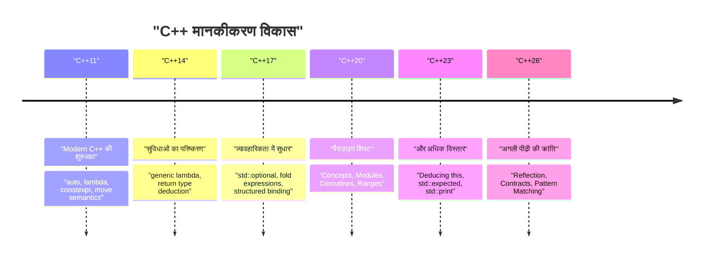
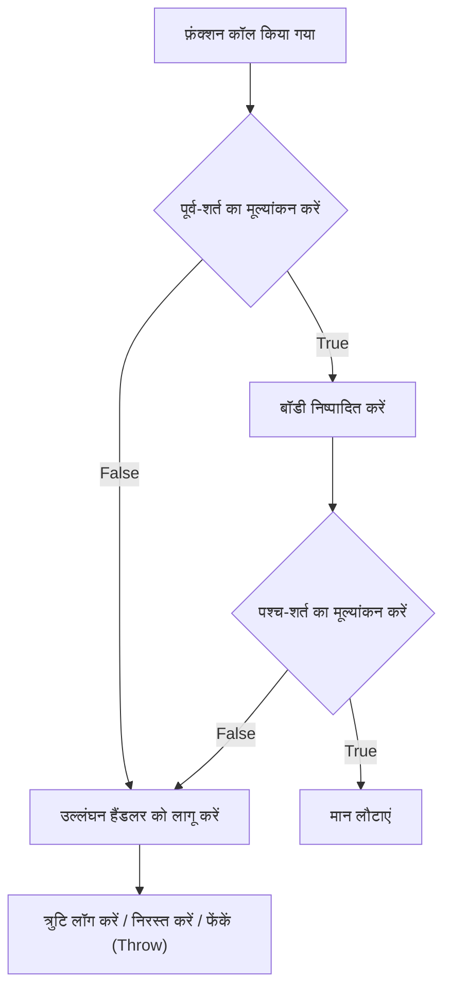
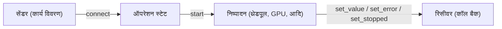

# परिचय: C++26 द्वारा लाया गया अगली पीढ़ी का प्रोग्रामिंग पैराडाइम (Paradigm)

2026 में, **C++26** को आधिकारिक तौर पर मानकीकृत किया गया है, जो C++ के इतिहास में एक बहुत ही महत्वपूर्ण मील का पत्थर है। C++11 में "Modern C++" की अवधारणा के जन्म के बाद से, C++14, C++17, C++20 और C++23 के साथ इसका निरंतर विकास हुआ है, लेकिन C++26 भाषा सुविधाओं और मानक लाइब्रेरी दोनों में मेटाप्रोग्रामिंग (metaprogramming), त्रुटि प्रबंधन (error handling), और समवर्ती प्रसंस्करण (concurrent processing) के पारंपरिक ज्ञान को पूरी तरह से बदलकर एक शक्तिशाली पैराडाइम शिफ्ट (paradigm shift) लाता है।

इस लेख में, हम C++26 में पेश की गई प्रमुख नई सुविधाओं, उनके तकनीकी विवरणों, संकलन (compile) समय के प्रदर्शन में सुधार, C++23 तक के मौजूदा कोड के साथ तुलना, और उनके व्यावहारिक उपयोगों के बारे में विस्तार से बताएंगे। यह 10,000 से अधिक वर्णों (characters) का एक व्यापक लेख है जो रिफ्लेक्शन (Reflection), कॉन्ट्रैक्ट प्रोग्रामिंग (Contracts), पैटर्न मैचिंग (Pattern Matching), पैक इंडेक्सिंग (Pack Indexing), स्ट्रक्चर्ड बाइंडिंग (Structured Bindings) के विस्तार, और Senders/Receivers सहित मानक लाइब्रेरी (standard library) के विकास को कवर करता है।

सबसे पहले, आइए C++ के मानकीकरण के इतिहास और C++26 की स्थिति को दृष्टिगत रूप से देखें।



C++26 का उद्देश्य C++20 में पेश किए गए Concepts और Modules जैसी बड़े पैमाने की सुविधाओं के शीर्ष पर **कोड की स्व-वर्णनात्मकता (reflection)** और **मज़बूती (contract programming)** को उनकी सीमा तक बढ़ाना है। आइए प्रत्येक सुविधा के विवरण में गोता लगाएँ।

---

# 1. रिफ्लेक्शन (Static Reflection): मेटाप्रोग्रामिंग की सच्ची क्रांति

यह कहना अतिशयोक्ति नहीं होगी कि C++26 की सबसे बड़ी विशेषता **स्टेटिक रिफ्लेक्शन (Static Reflection)** है (मुख्य रूप से P2996 जैसे प्रस्तावों पर आधारित)। अब तक, C++ में प्रोग्राम के भीतर से किसी प्रकार (type) की संरचना या सदस्य चर (member variables) के बारे में जानकारी प्राप्त करने के लिए जटिल टेम्पलेट मेटाप्रोग्रामिंग (TMP) या मैक्रोज़ का भारी उपयोग करने की आवश्यकता होती थी। हालाँकि, C++26 के रिफ्लेक्शन तंत्र के साथ, अब संकलन (compile) समय पर प्रोग्राम की अपनी संरचना (AST: Abstract Syntax Tree की जानकारी) को सुरक्षित और सहज रूप से एक्सेस करना संभव है।

## 1.1 C++23 तक की चुनौतियाँ

मान लीजिए कि आप C++23 या उससे पहले के संस्करण में किसी संरचना (struct) के सभी सदस्य चरों को JSON में क्रमित (serialize) करना चाहते हैं। चूँकि एक मानक भाषा सुविधा के रूप में संरचना के सदस्यों को सूचीबद्ध करने का कोई तरीका नहीं था, इसलिए आपको Boost.Describe या Boost.Pfr जैसी थर्ड-पार्टी लाइब्रेरीज़ का उपयोग करना पड़ता था, या सदस्यों को पंजीकृत करने के लिए अपने स्वयं के मैक्रोज़ को परिभाषित करना पड़ता था।

इसके कारण संकलन समय (compile time) में वृद्धि हुई और त्रुटि संदेश (error messages) समझने में कठिन हो गए। गणितीय दृष्टिकोण से, पारंपरिक पुनरावर्ती (recursive) टेम्पलेट इंस्टेंटिएशन (instantiation) का उपयोग करके प्रकार की जानकारी का विश्लेषण करने पर, तत्वों की संख्या $N$ के लिए संकलन-समय की जटिलता (complexity) $O(N)$ होती थी, और जटिल मेटा-फ़ंक्शंस के लिए सबसे खराब स्थिति में $O(N^2)$ इंस्टेंटिएशन की आवश्यकता होती थी।

$$
T_{\text{compile}}(N) \approx O(N^2) \quad \text{(Recursive Template Metaprogramming)}
$$

## 1.2 C++26 रिफ्लेक्शन सिंटैक्स और दृष्टिकोण

C++26 रिफ्लेक्शन `^` ऑपरेटर (रिफ्लेक्शन ऑपरेटर) और `[: ... :]` सिंटैक्स (स्प्लिसर) का उपयोग करता है। `^T` का उपयोग प्रकारों (types) या चरों (variables) की "मेटा-जानकारी" प्राप्त करने के लिए किया जाता है, और इसे संकलन-समय के स्थिरांक (compile-time constant) `std::meta::info` प्रकार के ऑब्जेक्ट के रूप में माना जाता है।

```cpp
#include <iostream>
#include <string>
#include <meta>

struct User {
    int id;
    std::string name;
    std::string email;
};

// C++26 के स्टेटिक रिफ्लेक्शन का उपयोग करके जेनेरिक सीरियलाइज़र
template <typename T>
void print_json(const T& obj) {
    constexpr auto type_info = ^T;
    
    std::cout << "{\n";
    // संरचना के सदस्य की जानकारी प्राप्त करें और पुनरावृत्ति (iterate) करें
    template for (constexpr auto member : std::meta::nonstatic_data_members_of(type_info)) {
        // [: member :] के साथ मूल प्रतीक (symbol) में विस्तार करें, और पहचानकर्ता (नाम) को स्ट्रिंग के रूप में प्राप्त करें
        std::cout << "  \"" << std::meta::identifier_of(member) << "\": " 
                  << obj.[:member:] << ",\n";
    }
    std::cout << "}\n";
}

int main() {
    User u{1, "Alice", "alice@example.com"};
    print_json(u);
    return 0;
}
```

इस कोड में, `User` संरचना के सभी सदस्यों को सूचीबद्ध करने के लिए `template for` (संकलन-समय लूप अनरोलिंग) का उपयोग किया जाता है।

## 1.3 प्रदर्शन और संकलन-समय जटिलता

इस नई सुविधा का सबसे बड़ा लाभ **संकलन समय में कमी** है। चूँकि मेटा-जानकारी को सीधे कंपाइलर के भीतर हेरफेर किया जाता है, इसलिए तत्व का एक्सेस और पुनरावृत्ति $O(1)$ ओवरहेड के साथ संसाधित होती है। चूँकि इसका मूल्यांकन तुरंत एक स्थिर अभिव्यक्ति (constant expression) के रूप में किया जाता है, संकलन-समय की जटिलता में नाटकीय रूप से सुधार होता है।

$$
T_{\text{compile\_new}}(N) = O(N) \quad \text{(Direct AST Traversal)}
$$

यह आपको नेस्टेड टेम्पलेट्स के कारण होने वाली कंपाइलर मेमोरी थकावट (memory exhaustion) और लंबे त्रुटि संदेशों (टेम्पलेट त्रुटियों का समुद्र) से मुक्त करता है।

```mermaid
graph TD
    A["प्रकार (Type): User"] -->| "^User" | B["std::meta::info"]
    B -->| "nonstatic_data_members_of" | C["meta::info की रेंज"]
    C -->| "[: member :]" | D["सीधा सदस्य एक्सेस (obj.id, obj.name)"]
    D --> E["उत्पन्न कोड (ज़ीरो ओवरहेड)"]
```

---

# 2. कॉन्ट्रैक्ट प्रोग्रामिंग (Contracts): मजबूत सॉफ्टवेयर डिज़ाइन

लंबे समय से चर्चा में रही **Contracts (कॉन्ट्रैक्ट प्रोग्रामिंग)**, जिसे C++20 में शामिल करने से छोड़ दिया गया था, आखिरकार C++26 में पेश कर दी गई है (P2900 आदि के अनुसार)। "Design by Contract" पैराडाइम अब भाषा में अंतर्निहित रूप से समर्थित है, जिससे आप घोषणात्मक रूप से फ़ंक्शन की पूर्व-शर्तें (pre-conditions), पश्च-शर्तें (post-conditions) और दावे (assertions) लिख सकते हैं।

## 2.1 Contracts का मूल सिंटैक्स

C++26 में, फ़ंक्शन घोषणाओं में अनुबंध विशेषताएँ (contract attributes) जोड़ी जाती हैं।

*   `pre` : वह शर्त जो फ़ंक्शन के कॉल होने से पहले पूरी होनी चाहिए
*   `post` : वह शर्त जो फ़ंक्शन के समाप्त होने और मान वापस करने पर पूरी होनी चाहिए
*   `assert` : वह शर्त जो फ़ंक्शन के भीतर एक विशिष्ट बिंदु पर पूरी होनी चाहिए

```cpp
#include <vector>
#include <numeric>

// कॉन्ट्रैक्ट प्रोग्रामिंग के माध्यम से सुरक्षित औसत गणना
// पूर्व-शर्त: पास किया गया वेक्टर खाली नहीं होना चाहिए
// पश्च-शर्त: गणना किया गया औसत वेक्टर के न्यूनतम मान से अधिक या उसके बराबर और अधिकतम मान से कम या उसके बराबर होना चाहिए
double calculate_average(const std::vector<double>& v)
    pre (!v.empty())
    post (r : r >= *std::min_element(v.begin(), v.end()) && 
              r <= *std::max_element(v.begin(), v.end()))
{
    double sum = std::accumulate(v.begin(), v.end(), 0.0);
    double avg = sum / v.size();
    
    // प्रोसेसिंग के दौरान दावा (assertion)
    assert(avg == avg); // NaN की जाँच आदि
    
    return avg; // पश्च-शर्त के 'r' से बँधा हुआ (bound) है
}
```

## 2.2 कॉन्ट्रैक्ट उल्लंघन को संभालना और रनटाइम मूल्यांकन

Contracts केवल टिप्पणियाँ (comments) या पुराने `assert()` मैक्रोज़ नहीं हैं। बिल्ड मोड (जैसे, विकास बिल्ड, उत्पादन बिल्ड) के आधार पर, आप कंपाइलर को निर्देश दे सकते हैं कि **उल्लंघन होने पर कैसे व्यवहार करें**। उदाहरण के लिए, विकास (development) के दौरान, आप उल्लंघन पर तुरंत क्रैश (abort) कर सकते हैं, जबकि उत्पादन (production) वातावरण में, आप एक कस्टम उल्लंघन हैंडलर को कॉल कर सकते हैं जो त्रुटि को लॉग करता है और निष्पादन जारी रखता है।



Contracts का उपयोग करने से न केवल API के विनिर्देश (specifications) का स्व-दस्तावेजीकरण होता है, बल्कि अपरिभाषित व्यवहार (Undefined Behavior, UB) होने से पहले प्रोग्राम को सुरक्षित रूप से रोका और नियंत्रित किया जा सकता है, जिससे C++ के विशिष्ट मेमोरी भ्रष्टाचार (memory corruption) बग और तार्किक (logical) बग में भारी कमी आने की उम्मीद है।

---

# 3. पैटर्न मैचिंग (Pattern Matching): शाखाओं (Branching) का परिष्करण

चूँकि C++17 में `std::variant` और `std::any` पेश किए गए थे, `std::visit` का उपयोग विभिन्न प्रकार रखने वाले चरों को डिस्पैच करने के लिए किया जाता रहा है। हालाँकि, `std::visit` और ओवरलोड पैटर्न (तथाकथित `overloaded` स्ट्रक्चर हैक) का संयोजन बहुत ही जटिल और पढ़ने में कठिन था।

C++26 में, **पैटर्न मैचिंग (Pattern Matching)** को भाषा की सुविधा के रूप में बनाया गया है (P2688 के अनुसार)। यह फ़ंक्शनल भाषाओं (जैसे Rust और Haskell) के समान सहज मैचिंग की अनुमति देता है।

## 3.1 C++23 तक `std::visit` का संघर्ष

```cpp
// C++23 तक सिंटैक्स
template<class... Ts> struct overloaded : Ts... { using Ts::operator()...; };
template<class... Ts> overloaded(Ts...) -> overloaded<Ts...>;

std::variant<int, std::string, double> v = "Hello";

std::visit(overloaded {
    [](int i) { std::cout << "Int: " << i << '\n'; },
    [](const std::string& s) { std::cout << "String: " << s << '\n'; },
    [](double d) { std::cout << "Double: " << d << '\n'; }
}, v);
```

## 3.2 C++26 के `inspect` सिंटैक्स के साथ नाटकीय सुधार

नए `inspect` कीवर्ड का उपयोग करके, आप इसे बहुत ही साफ तरीके से लिख सकते हैं, जैसा कि नीचे दिखाया गया है।

```cpp
// C++26 पैटर्न मैचिंग
std::variant<int, std::string, double> v = "Hello";

inspect (v) {
    int i => std::cout << "Int: " << i << '\n';
    std::string s => std::cout << "String: " << s << '\n';
    double d => std::cout << "Double: " << d << '\n';
    _ => std::cout << "Unknown type\n"; // वाइल्डकार्ड (Wildcard)
};
```

यह पैटर्न मैचिंग न केवल प्रकार के प्रेषण (type dispatching) तक सीमित है, बल्कि **संरचनाओं के डीस्ट्रक्चरिंग (destructuring)** और **गार्ड शर्तों** (केवल तभी मेल खाता है जब कोई विशिष्ट शर्त पूरी होती है) का भी समर्थन करता है।

```cpp
struct Point { int x, y; };
std::variant<Point, int> var = Point{10, 20};

inspect (var) {
    // संरचना के तत्वों को बांधते हुए गार्ड शर्त (if) जोड़ें
    [x, y] as Point if (x == y) => { std::cout << "Diagonal: " << x << '\n'; }
    [x, y] as Point => { std::cout << "Point: " << x << ", " << y << '\n'; }
    int i => { std::cout << "Scalar: " << i << '\n'; }
};
```

कंपाइलर इस `inspect` कथन के लिए संपूर्णता जाँच (exhaustiveness checking) करता है, इसलिए यदि एनम (enum) या `std::variant` को संसाधित करते समय कोई भी स्थिति (case) छूट जाती है, तो इसे संकलन त्रुटि (compile error) के रूप में रिपोर्ट किया जाएगा। रखरखाव (maintainability) में सुधार के लिए यह अत्यंत महत्वपूर्ण है।

---

# 4. पैक इंडेक्सिंग (Pack Indexing): टेम्पलेट पैरामीटर पैक का बचाव

C++11 के बाद से वैराडिक टेम्पलेट्स (Variadic Templates) बहुत शक्तिशाली रहे हैं, लेकिन पैरामीटर पैक से $N$ वां प्रकार या मान निकालने का कार्य सहज नहीं था। अब तक, आपके पास `std::tuple_element` या पुनरावर्ती (recursive) टेम्पलेट्स का उपयोग करके उन्हें निकालने के अलावा कोई विकल्प नहीं था।

C++26 में, **पैक इंडेक्सिंग** सुविधा (P2662) पेश की गई है, जो आपको सरणी अनुक्रमणिका (array index) पहुँच की तरह इसे अधिक स्वाभाविक रूप से लिखने की अनुमति देती है।

## 4.1 पैक इंडेक्सिंग के मूल तत्व

सिंटैक्स बहुत सरल है, इसे `Types...[I]` के रूप में लिखा जाता है।

```cpp
#include <iostream>
#include <type_traits>

// Nवां प्रकार (type) प्राप्त करने का फ़ंक्शन
template <std::size_t N, typename... Types>
constexpr auto get_nth_type() {
    // Types...[N] के साथ Nवें प्रकार तक सीधे पहुँचें
    return Types...[N]{};
}

// वैराडिक तर्कों (arguments) का Nवां मान प्राप्त करने का फ़ंक्शन
template <std::size_t N, typename... Args>
constexpr decltype(auto) get_nth_value(Args&&... args) {
    // पैरामीटर पैक args के लिए भी इंडेक्स एक्सेस संभव है
    return std::forward<Args...[N]>(args...[N]);
}

int main() {
    // प्रकार (type) तक पहुँचना
    using SecondType = decltype(get_nth_type<1, int, double, char>());
    static_assert(std::is_same_v<SecondType, double>);

    // मान (value) तक पहुँचना
    auto val = get_nth_value<2>(10, 3.14, "Hello C++26", 'c');
    std::cout << val << std::endl; // आउटपुट होगा "Hello C++26"
}
```

कंपाइलर अब स्थिर समय $O(1)$ में पैक अनुक्रमणिका को संसाधित कर सकता है, जिससे पहले नेस्टेड मेटा-फ़ंक्शंस के कारण होने वाले लंबे संकलन समय को कम किया जा सकता है।

---

# 5. स्ट्रक्चर्ड बाइंडिंग (Structured Bindings) का विस्तार

C++17 में पेश की गई स्ट्रक्चर्ड बाइंडिंग फ़ंक्शन से एकाधिक रिटर्न मान (return values) प्राप्त करते समय बहुत उपयोगी होती है। हालाँकि, यदि आप केवल कुछ चरों का उपयोग करना चाहते थे और अन्य को अनदेखा करना चाहते थे, तो आपको डमी चर (dummy variables) परिभाषित करने की आवश्यकता थी, और "अप्रयुक्त चर (unused variable)" चेतावनी से बचने में परेशानी होती थी।

C++26 में, प्लेसहোল्डर के रूप में `_` (अंडरस्कोर) का उपयोग करने की आधिकारिक अनुमति दी गई है।

```cpp
#include <map>
#include <string>
#include <iostream>

std::map<int, std::string> get_data() {
    return {{1, "One"}, {2, "Two"}, {3, "Three"}};
}

int main() {
    auto data = get_data();
    
    for (const auto& [id, _] : data) {
        // मानों (स्ट्रिंग) को अनदेखा करें और केवल कुंजियों (ID) का उपयोग करें
        std::cout << "ID: " << id << '\n';
    }
}
```

यह छोटा सा विस्तार कोड के इरादे को स्पष्ट करता है और `#pragma` या `[[maybe_unused]]` विशेषताओं के अत्यधिक उपयोग को रोकता है जो अनावश्यक चेतावनियों को दबाने के लिए इस्तेमाल होते हैं।

---

# 6. मानक लाइब्रेरी (Standard Library) का विकास: समवर्ती प्रसंस्करण और अतुल्यकालिक (Asynchronous) की पुनर्रचना

केवल भाषा सुविधाएँ ही नहीं, बल्कि C++26 की मानक लाइब्रेरी (STL) भी नाटकीय रूप से विकसित हुई है। विशेष रूप से अतुल्यकालिक प्रसंस्करण (asynchronous processing) और मेमोरी प्रबंधन के क्षेत्र में, उद्यम और सिस्टम प्रोग्रामिंग की मांगों को पूरा करने के लिए उन्नत घटक पेश किए गए हैं।

## 6.1 Senders / Receivers (std::execution)

C++ के अतुल्यकालिक प्रसंस्करण मॉडल को पूरी तरह से फिर से बनाने का मानकीकरण प्रस्ताव (P2300) आखिरकार C++26 में फलीभूत हुआ। `std::async` और `std::future` के प्रदर्शन संबंधी मुद्दों (अत्यधिक मेमोरी आवंटन और शेड्यूलिंग अकुशलता) को हल करने के लिए **Senders/Receivers** मॉडल पेश किया गया है।



Senders हल्के ब्लूप्रिंट (blueprint) होते हैं जो वर्णन करते हैं कि "क्या करना है" और निष्पादन संदर्भ (Scheduler) से अलग होते हैं। यह सीपीयू (CPU) के थ्रेडपूल (ThreadPool) या जीपीयू (GPU) पर कार्यों को ऑफलोड करने को एक एकीकृत इंटरफ़ेस के साथ कुशलतापूर्वक वर्णित करने की अनुमति देता है।

```cpp
#include <execution>
#include <iostream>
#include <syncstream>

using namespace std::execution;

int main() {
    auto scheduler = get_system_thread_pool().scheduler();

    // टास्क पाइपलाइन (इस बिंदु पर निष्पादित नहीं होता है: लेज़ी इवैल्यूएशन)
    auto task = schedule(scheduler)
              | then([] { return 42; })
              | then([](int val) { return val * 2; })
              | upon_error([](std::exception_ptr e) { return 0; });

    // sync_wait के साथ समकालिक (synchronously) रूप से परिणाम की प्रतीक्षा करें
    auto [result] = sync_wait(task).value();
    
    std::osyncstream(std::cout) << "Result: " << result << std::endl;
}
```

## 6.2 Hazard Pointers और RCU (Read-Copy Update)

**Hazard Pointers** (`std::hazard_pointer`) और **RCU** (`std::rcu`) को लॉक-फ्री (lock-free) डेटा संरचनाओं के कार्यान्वयन का समर्थन करने के लिए मानक सुविधाओं के रूप में मानकीकृत किया गया है। इसने C++ में उच्च-प्रदर्शन समवर्ती डेटा संरचनाओं (concurrent data structures) को लागू करने की बाधा को काफी कम कर दिया है।

RCU विशेष रूप से उन वर्कलोड में जहाँ रीड्स (पढ़ना) भारी मात्रा में होते हैं, कैश-लाइन विवाद को समाप्त करता है और एक रैखिक स्केलेबिलिटी (linear scalability) प्राप्त करता है। गणितीय रूप से, थ्रेड्स की संख्या $T$ के लिए रीड थ्रूपुट (read throughput) आदर्श रूप से $O(T)$ की वृद्धि को दर्शाता है।

$$
\text{Throughput}_{\text{RCU}} \propto T \quad \text{(Read-heavy Workloads)}
$$

---

# 7. व्यावहारिक प्रवासन मार्गदर्शिका (Practical Migration Guide) और इसे अपनाने के लाभ

C++26 में प्रवासन (migration) के लिए C++11 के समान बड़े पैमाने पर पैराडाइम शिफ्ट की आवश्यकता होती है, लेकिन इसके लाभों में कोडबेस सुरक्षा और संकलन समय में महत्वपूर्ण सुधार शामिल हैं।

1.  **मेटाप्रोग्रामिंग का नवीनीकरण**: जटिल `template` और `constexpr if` के नेस्टिंग से बने सीरियलाइज़र या ORM (Object-Relational Mapping) फ्रेमवर्क को C++26 रिफ्लेक्शन के साथ फिर से लिखा जा सकता है, जिससे रखरखाव में नाटकीय रूप से सुधार हो सकता है और संकलन समय दसियों गुना कम हो सकता है।
2.  **Contracts के साथ API डिज़ाइन**: क्लास लाइब्रेरी के डिज़ाइनरों को Doxygen जैसी दस्तावेज़ीकरण टिप्पणियों (documentation comments) पर निर्भर रहने के बजाय भाषा स्तर पर विनिर्देशों (specifications) को स्पष्ट करने के लिए Contracts (`pre` / `post`) का उपयोग करना चाहिए। यह उपयोगकर्ताओं द्वारा अमान्य कॉल्स का शीघ्र पता लगाने की अनुमति देता है।
3.  **अतुल्यकालिक प्रसंस्करण (Asynchronous processing) का आधुनिकीकरण**: कस्टम कार्यान्वयन या Boost.Asio पर निर्भर अतुल्यकालिक प्रसंस्करण को `std::execution` (Senders/Receivers) में स्थानांतरित करने से आप एक मानकीकृत समवर्ती प्रसंस्करण आधार (concurrent processing foundation) का निर्माण कर सकते हैं जो प्लेटफ़ॉर्म और हार्डवेयर के पार काम करता है।

## प्रवासन करते समय ध्यान देने योग्य बातें: ABI स्थिरता और कंपाइलर समर्थन

नई भाषा सुविधाएँ, विशेष रूप से Contracts, फ़ंक्शन हस्ताक्षर (function signatures) और ABI (Application Binary Interface) को प्रभावित कर सकती हैं। इसलिए, यदि आप उन्हें साझा पुस्तकालयों (shared libraries - DLL / .so) की सीमाओं के पार उपयोग करते हैं, तो आपको यह सुनिश्चित करने के लिए दृढ़ता से जांच करने की आवश्यकता है कि वे एक ही कंपाइलर और मानक लाइब्रेरी संस्करण (GCC, Clang, MSVC) के साथ संकलित (compiled) किए गए हैं।

---

# निष्कर्ष

C++26 वास्तव में एक ऐतिहासिक संस्करण है जहाँ उन सभी "सपनों की सुविधाओं" को एक साथ पेश किया गया है जिनका C++ प्रोग्रामर लंबे समय से इंतजार कर रहे थे।

*   **रिफ्लेक्शन** मेटाप्रोग्रामिंग की जटिलता को दूर करता है और $O(1)$ AST एक्सेस को सक्षम बनाता है।
*   **कॉन्ट्रैक्ट प्रोग्रामिंग** आपको फ़ंक्शन की पूर्व-शर्तों और पश्च-शर्तों को स्पष्ट करके मज़बूत प्रोग्राम बनाने की अनुमति देती है।
*   **पैटर्न मैचिंग** जटिल शाखाओं (branching) और राज्य संक्रमण (state transitions) को सहज और सुरक्षित रूप से वर्णित करने में मदद करती है।
*   **Senders/Receivers** और **RCU / Hazard Pointers** समवर्ती प्रसंस्करण (concurrent processing) का मानकीकरण करते हैं जो चरम प्रदर्शन को प्राप्त करता है।

इन सुविधाओं का उचित रूप से उपयोग करके, आप C++ की सबसे बड़ी ताकत, "शून्य-ओवरहेड अमूर्तता (Zero-overhead Abstraction)" को उच्च स्तर पर और आश्चर्यजनक रूप से साफ कोड के साथ प्राप्त कर सकते हैं।

भविष्य में, हम प्रत्येक कंपाइलर वेंडर की C++26 सुविधा कार्यान्वयन स्थिति (फ़ीचर टेस्ट मैक्रोज़, आदि) पर कड़ी नज़र रखते हुए नए प्रोजेक्ट्स और लाइब्रेरी के विकास में इन नए पैराडाइम को सक्रिय रूप से शामिल करने की सलाह देते हैं। C++ कभी भी पुरानी भाषा नहीं है, और यह अपनी सबसे उन्नत भाषा सिद्धांतों को अपनाते हुए सिस्टम प्रोग्रामिंग के शीर्ष पर राज करना जारी रखेगी।

---
*यह लेख 2026 तक C++26 के मानकीकरण की स्थिति पर आधारित है। कृपया ध्यान दें कि प्रत्येक कंपाइलर की कार्यान्वयन स्थिति के आधार पर कुछ सिंटैक्स बदल सकते हैं*
