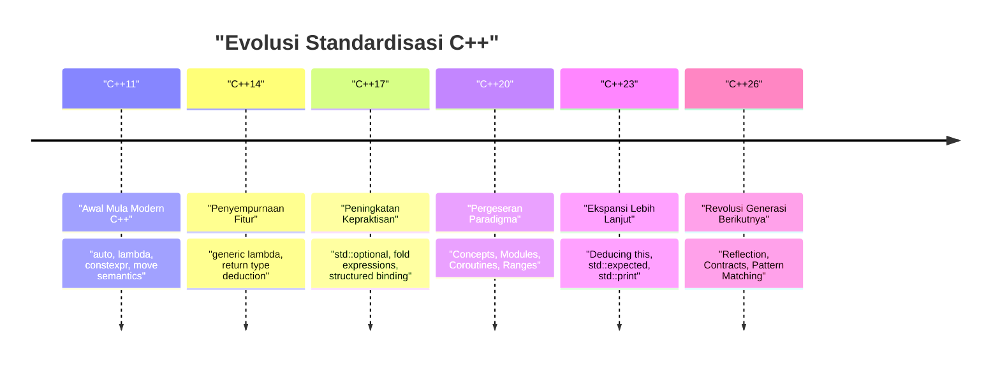
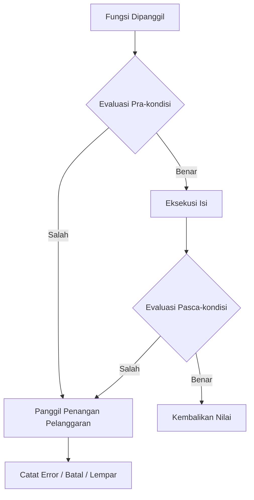
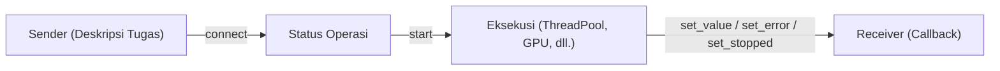

# Pendahuluan: Paradigma Pemrograman Generasi Berikutnya yang Dibawa oleh C++26

Pada tahun 2026, **C++26**, yang merupakan tonggak sejarah yang sangat penting dalam sejarah C++, telah secara resmi distandardisasi. Sejak konsep "Modern C++" lahir pada C++11, bahasa ini terus berkembang melalui C++14, C++17, C++20, dan C++23. Namun, C++26 membawa pergeseran paradigma yang sangat kuat, membalikkan akal sehat tentang metaprogramming, penanganan error, dan pemrosesan konkuren sejauh ini, baik dalam fungsionalitas bahasa maupun standar pustaka.

Dalam artikel ini, kami akan menjelaskan secara menyeluruh fitur-fitur baru utama yang diperkenalkan pada C++26, perincian teknis, peningkatan performa waktu kompilasi, perbandingan dengan kode hingga C++23 yang sudah ada, serta panduan praktis penggunaannya. Dengan total volume artikel yang panjang, artikel ini mencakup berbagai topik secara komprehensif, mulai dari Reflection, Contract Programming (Contracts), Pattern Matching, Pack Indexing, perluasan Structured Bindings, hingga evolusi standar pustaka termasuk Senders/Receivers.

Pertama, mari kita lihat sejarah standardisasi C++ dan posisi C++26 secara visual.



C++26 dibangun di atas kelompok fitur berskala besar seperti Concepts dan Modules yang diperkenalkan pada C++20, dan bertujuan untuk memaksimalkan **kemampuan kode mendeskripsikan dirinya sendiri (Reflection)** dan **kekokohan (Contract Programming)** hingga batas akhir. Sekarang, mari kita selami detail dari masing-masing fitur.

---

# 1. Reflection (Static Reflection): Revolusi Sejati Metaprogramming

Bisa dibilang fitur unggulan terbesar di C++26 adalah **Static Reflection (Refleksi Statis)** (terutama didasarkan pada proposal seperti P2996). Sebelumnya di C++, untuk mendapatkan informasi mengenai struktur tipe atau variabel anggota dari dalam program, diperlukan penggunaan Template Metaprogramming (TMP) yang kompleks atau makro. Namun, berkat mekanisme Reflection C++26, kini kita dapat mengakses struktur program itu sendiri (AST: Abstrak Syntax Tree) secara aman dan intuitif saat proses kompilasi.

## 1.1 Tantangan pada C++23 dan Sebelumnya

Mari kita pertimbangkan kasus di mana kita ingin melakukan serialisasi semua variabel anggota dari sebuah struct ke dalam JSON pada versi sebelum C++23. Karena tidak ada fungsi bahasa standar untuk me-list anggota sebuah struct, kita harus menggunakan pustaka pihak ketiga seperti Boost.Describe atau Boost.Pfr, atau mendefinisikan makro kustom untuk mendaftarkan anggota tersebut.

Hal ini menyebabkan peningkatan waktu kompilasi dan pesan error yang sulit dipahami. Dari sudut pandang matematis, analisis informasi tipe menggunakan instansiasi template rekursif tradisional memerlukan kompleksitas waktu kompilasi $O(N)$ terhadap jumlah elemen $N$, dan pada fungsi meta yang rumit, instansiasi terburuknya adalah $O(N^2)$.

$$
T_{\text{compile}}(N) \approx O(N^2) \quad \text{(Recursive Template Metaprogramming)}
$$

## 1.2 Sintaks dan Pendekatan Reflection C++26

Reflection C++26 menggunakan operator `^` (operator refleksi) dan sintaks `[: ... :]` (splicer). Dengan `^T`, kita dapat mengambil "informasi meta" dari sebuah tipe atau variabel, dan itu diperlakukan sebagai konstanta waktu-kompilasi dari objek tipe `std::meta::info`.

```cpp
#include <iostream>
#include <string>
#include <meta>

struct User {
    int id;
    std::string name;
    std::string email;
};

// Serializer generik menggunakan Static Reflection C++26
template <typename T>
void print_json(const T& obj) {
    constexpr auto type_info = ^T;
    
    std::cout << "{\n";
    // Mengambil dan mengiterasi informasi anggota struct
    template for (constexpr auto member : std::meta::nonstatic_data_members_of(type_info)) {
        // Ekspansi ke simbol asli dengan [: member :], dan dapatkan identifier (nama) sebagai string
        std::cout << "  \"" << std::meta::identifier_of(member) << "\": " 
                  << obj.[:member:] << ",\n";
    }
    std::cout << "}\n";
}

int main() {
    User u{1, "Alice", "alice@example.com"};
    print_json(u);
    return 0;
}
```

Pada kode ini, `template for` (ekspansi perulangan waktu-kompilasi) digunakan untuk me-list semua anggota dari struct `User`.

## 1.3 Performa dan Kompleksitas Waktu-Kompilasi

Manfaat terbesar dari fitur baru ini adalah **pengurangan waktu kompilasi**. Karena informasi meta dimanipulasi langsung di dalam kompiler, akses elemen atau iterasi diproses dengan overhead $O(1)$. Karena langsung dievaluasi sebagai ekspresi konstan, kompleksitas waktu kompilasi meningkat secara dramatis (berkurang drastis).

$$
T_{\text{compile\_new}}(N) = O(N) \quad \text{(Direct AST Traversal)}
$$

Kita dapat terbebas dari kehabisan memori kompiler akibat template yang bersarang atau pesan error yang sangat panjang (lautan error template).

```mermaid
graph TD
    A["Tipe: User"] -->| "^User" | B["std::meta::info"]
    B -->| "nonstatic_data_members_of" | C["Rentang meta::info"]
    C -->| "[: member :]" | D["Akses Anggota Langsung (obj.id, obj.name)"]
    D --> E["Kode yang Dihasilkan (Nol Overhead)"]
```

---

# 2. Contract Programming (Contracts): Desain Perangkat Lunak yang Kokoh

Setelah lama diperdebatkan sejak penerapannya ditunda di C++20, **Contracts (Contract Programming)** akhirnya diperkenalkan di C++26 (berdasarkan P2900, dsb.). Paradigma "Design by Contract" sekarang didukung secara bawaan oleh bahasa, memungkinkan kita untuk menuliskan pra-kondisi (Pre-condition), pasca-kondisi (Post-condition), dan asersi (Assertion) secara deklaratif untuk suatu fungsi.

## 2.1 Sintaks Dasar Contracts

Pada C++26, atribut kontrak dilampirkan pada deklarasi fungsi.

*   `pre` : Kondisi yang harus dipenuhi sebelum fungsi dipanggil
*   `post` : Kondisi yang harus dipenuhi saat fungsi berakhir dan mengembalikan nilai
*   `assert` : Kondisi yang harus dipenuhi pada titik tertentu di dalam fungsi

```cpp
#include <vector>
#include <numeric>

// Perhitungan rata-rata yang aman menggunakan Contract Programming
// Pra-kondisi: Vektor yang dilewatkan tidak boleh kosong
// Pasca-kondisi: Rata-rata yang dihitung harus lebih besar dari atau sama dengan nilai minimum dan kurang dari atau sama dengan nilai maksimum vektor
double calculate_average(const std::vector<double>& v)
    pre (!v.empty())
    post (r : r >= *std::min_element(v.begin(), v.end()) && 
              r <= *std::max_element(v.begin(), v.end()))
{
    double sum = std::accumulate(v.begin(), v.end(), 0.0);
    double avg = sum / v.size();
    
    // Asersi selama proses berlangsung
    assert(avg == avg); // Pengecekan NaN, dll.
    
    return avg; // Akan diikat ke 'r' di pasca-kondisi
}
```

## 2.2 Penanganan Pelanggaran Kontrak dan Evaluasi Saat Runtime

Contracts bukan sekadar komentar atau makro `assert()` kuno. Bergantung pada mode build (build pengembangan, build produksi, dll.), Anda dapat menginstruksikan kepada kompiler tentang **perilaku saat terjadi pelanggaran**. Contohnya, selama masa pengembangan, pelanggaran akan memicu crash langsung (abort), sementara di lingkungan produksi, Anda dapat secara fleksibel memanggil penangan pelanggaran kustom yang mencatat log kemudian melanjutkan proses.



Dengan menggunakan Contracts, spesifikasi API tidak hanya terdokumentasi sendiri (self-documenting), tetapi Anda juga dapat menghentikan dan mengontrol program dengan aman sebelum menyebabkan Undefined Behavior (UB), sehingga diharapkan dapat mengurangi secara drastis kerusakan memori dan bug logika yang khas pada C++.

---

# 3. Pattern Matching: Percabangan yang Lebih Elegan

Sejak perkenalan `std::variant` dan `std::any` di C++17, `std::visit` telah digunakan untuk dispatch tipe yang bervariasi pada suatu variabel. Namun, kombinasi dari `std::visit` dan pola overload (sering disebut sebagai hack struktur `overloaded`) sangat bertele-tele dan sulit dibaca.

Di C++26, **Pattern Matching (Pencocokan Pola)** telah dimasukkan sebagai fitur bahasa (sesuai standar P2688). Ini memungkinkan pencocokan yang intuitif, mirip dengan apa yang ada di bahasa fungsional (seperti Rust atau Haskell).

## 3.1 Penderitaan `std::visit` Sebelum C++23

```cpp
// Penulisan kode hingga C++23
template<class... Ts> struct overloaded : Ts... { using Ts::operator()...; };
template<class... Ts> overloaded(Ts...) -> overloaded<Ts...>;

std::variant<int, std::string, double> v = "Hello";

std::visit(overloaded {
    [](int i) { std::cout << "Int: " << i << '\n'; },
    [](const std::string& s) { std::cout << "String: " << s << '\n'; },
    [](double d) { std::cout << "Double: " << d << '\n'; }
}, v);
```

## 3.2 Peningkatan Dramatis Melalui Sintaks `inspect` di C++26

Dengan menggunakan keyword baru `inspect`, kita dapat menuliskannya secara jauh lebih ringkas seperti di bawah ini.

```cpp
// Pattern Matching di C++26
std::variant<int, std::string, double> v = "Hello";

inspect (v) {
    int i => std::cout << "Int: " << i << '\n';
    std::string s => std::cout << "String: " << s << '\n';
    double d => std::cout << "Double: " << d << '\n';
    _ => std::cout << "Tipe tidak diketahui\n"; // Wildcard
};
```

Pencocokan pola ini tidak hanya sebatas fungsi tipe dispatching, tetapi juga mendukung **destrukturisasi (pemecahan) struktur** dan **kondisi guard** (hanya cocok jika memenuhi kondisi tertentu).

```cpp
struct Point { int x, y; };
std::variant<Point, int> var = Point{10, 20};

inspect (var) {
    // Mengikat elemen struktur sekaligus memberikan kondisi guard (if)
    [x, y] as Point if (x == y) => { std::cout << "Diagonal: " << x << '\n'; }
    [x, y] as Point => { std::cout << "Titik: " << x << ", " << y << '\n'; }
    int i => { std::cout << "Skalar: " << i << '\n'; }
};
```

Kompiler melakukan pengecekan kelengkapan (Exhaustiveness checking) pada pernyataan `inspect` ini, sehingga apabila ada kasus yang terlewat dalam menangani tipe enumerasi (enum) atau `std::variant`, hal ini akan dilaporkan sebagai error kompilasi. Fitur ini sangat penting untuk meningkatkan kemampuan pemeliharaan (maintainability).

---

# 4. Pack Indexing: Penyelamat Variadic Templates

Sejak C++11, Variadic Templates (Template Variabel) sangatlah tangguh (powerful), namun operasi untuk mengekstrak tipe atau nilai ke-$N$ dari sebuah parameter pack tidaklah intuitif. Sebelumnya, kita hanya bisa mengeluarkannya menggunakan `std::tuple_element` atau template rekursif.

Di C++26, fitur **Pack Indexing** (P2662) diperkenalkan, memungkinkan penulisan dengan cara yang lebih alami, mirip dengan mengakses indeks pada sebuah array.

## 4.1 Dasar-dasar Pack Indexing

Sintaksnya sangat sederhana, dituliskan sebagai `Types...[I]`.

```cpp
#include <iostream>
#include <type_traits>

// Fungsi untuk mendapatkan tipe ke-N
template <std::size_t N, typename... Types>
constexpr auto get_nth_type() {
    // Akses langsung tipe ke-N dengan Types...[N]
    return Types...[N]{};
}

// Fungsi untuk mendapatkan nilai ke-N dari argumen variadic
template <std::size_t N, typename... Args>
constexpr decltype(auto) get_nth_value(Args&&... args) {
    // Akses indeks pada parameter pack args juga dimungkinkan
    return std::forward<Args...[N]>(args...[N]);
}

int main() {
    // Akses tipe
    using SecondType = decltype(get_nth_type<1, int, double, char>());
    static_assert(std::is_same_v<SecondType, double>);

    // Akses nilai
    auto val = get_nth_value<2>(10, 3.14, "Hello C++26", 'c');
    std::cout << val << std::endl; // Mencetak "Hello C++26"
}
```

Kompiler kini dapat memproses pack index dalam waktu konstan $O(1)$, yang akan mengurangi waktu kompilasi panjang yang sebelumnya disebabkan oleh fungsi meta bersarang.

---

# 5. Perluasan Structured Bindings

Structured Bindings yang diperkenalkan pada C++17 sangat berguna saat menerima banyak nilai kembalian dari suatu fungsi, tetapi apabila kita hanya ingin menggunakan beberapa variabel dan mengabaikan yang lain, kita perlu mendefinisikan variabel tiruan (dummy). Hal ini cukup merepotkan guna menghindari peringatan "unused variable" (variabel yang tidak digunakan).

Di C++26, penggunaan `_` (garis bawah/underscore) sebagai tempat penampung (placeholder) kini secara resmi diizinkan.

```cpp
#include <map>
#include <string>
#include <iostream>

std::map<int, std::string> get_data() {
    return {{1, "One"}, {2, "Two"}, {3, "Three"}};
}

int main() {
    auto data = get_data();
    
    for (const auto& [id, _] : data) {
        // Mengabaikan nilai (string) dan hanya menggunakan kunci (ID)
        std::cout << "ID: " << id << '\n';
    }
}
```

Ekstensi kecil ini memperjelas maksud/tujuan kode dan mencegah penyalahgunaan `#pragma` atau atribut `[[maybe_unused]]` yang bertujuan untuk menekan peringatan yang tidak perlu.

---

# 6. Evolusi Standar Pustaka: Redefinisi Pemrosesan Konkuren dan Asinkron

Tidak hanya fitur bahasanya saja, Standar Pustaka C++26 (STL) juga telah mengalami evolusi yang dramatis. Khususnya di area pemrograman asinkron dan manajemen memori, komponen canggih yang memenuhi kebutuhan pemrograman kelas perusahaan dan sistem telah diperkenalkan.

## 6.1 Senders / Receivers (std::execution)

Proposal standardisasi (P2300) yang merombak model pemrosesan asinkron C++ dari bawah ke atas pada akhirnya membuahkan hasil di C++26. Model **Senders/Receivers** diperkenalkan untuk mengatasi masalah performa yang dimiliki `std::async` atau `std::future` (pengalokasian memori berlebihan dan inefisiensi penjadwalan).



Senders adalah cetak biru ringan yang mendeskripsikan "apa yang harus dilakukan", dipisahkan dari konteks eksekusi (Scheduler). Hal ini memungkinkan kita mendeskripsikan pemindahan tugas ke ThreadPool CPU atau GPU dengan efisien melalui antarmuka yang seragam.

```cpp
#include <execution>
#include <iostream>
#include <syncstream>

using namespace std::execution;

int main() {
    auto scheduler = get_system_thread_pool().scheduler();

    // Jalur tugas (belum dieksekusi pada saat ini: evaluasi tertunda)
    auto task = schedule(scheduler)
              | then([] { return 42; })
              | then([](int val) { return val * 2; })
              | upon_error([](std::exception_ptr e) { return 0; });

    // Tunggu hasil secara sinkron dengan sync_wait
    auto [result] = sync_wait(task).value();
    
    std::osyncstream(std::cout) << "Hasil: " << result << std::endl;
}
```

## 6.2 Hazard Pointers dan RCU (Read-Copy Update)

Sebagai standar pendukung implementasi struktur data bebas-kunci, **Hazard Pointers** (`std::hazard_pointer`) dan **RCU** (`std::rcu`) telah distandardisasi. Hal ini sangat menurunkan rintangan untuk mengimplementasikan struktur data konkuren berperforma tinggi dalam C++.

RCU menghilangkan persaingan cache line dan mencapai skalabilitas linear, terutama dalam beban kerja dengan proses baca yang sangat banyak. Secara matematis, throughput baca menunjukkan peningkatan yang ideal dari $O(T)$ sehubungan dengan jumlah thread $T$.

$$
\text{Throughput}_{\text{RCU}} \propto T \quad \text{(Read-heavy Workloads)}
$$

---

# 7. Panduan Transisi Praktis dan Manfaat Pengenalan

Migrasi ke C++26 memerlukan pergeseran paradigma skala besar seperti pada saat C++11, namun memiliki keuntungan nyata dalam meningkatkan keamanan basis kode dan mempercepat waktu kompilasi secara signifikan.

1.  **Pembaruan Metaprogramming**: Kerangka kerja serializer atau ORM (Object-Relational Mapping) yang tersusun dari fungsi `template` dan `constexpr if` bersarang yang rumit dapat ditulis ulang menggunakan Reflection dari C++26. Hal ini berpotensi meningkatkan kemampuan pemeliharaan secara drastis, serta memangkas waktu kompilasi menjadi sepersekian puluh dari sebelumnya.
2.  **Desain API Menggunakan Contracts**: Para desainer class library tidak boleh bergantung pada komentar dokumentasi layaknya Doxygen, melainkan harus menentukan spesifikasi secara eksplisit pada tingkat bahasa menggunakan Contracts (`pre` / `post`). Ini memungkinan sistem mendeteksi panggilan ilegal dari pengguna di awal.
3.  **Memodernisasi Pemrosesan Asinkron**: Dengan memindahkan pemrosesan asinkron yang tadinya mengandalkan implementasi custom maupun Boost.Asio ke dalam `std::execution` (Senders/Receivers), Anda dapat membangun fondasi pemrosesan konkuren berstandar yang melintasi batas-batas antarmuka perangkat keras dan platform.

## Peringatan Migrasi: Stabilitas ABI dan Dukungan Kompiler

Fungsionalitas bahasa yang baru, terutama Contracts, mungkin berdampak pada function signatures maupun ABI (Application Binary Interface). Oleh karena itu, jika ingin menggunakannya melintasi batas-batas shared libraries (DLL / .so), Anda harus memverifikasi terlebih dahulu bahwa aplikasi sudah di-compile dengan versi standar pustaka dan kompiler yang identik (GCC, Clang, MSVC).

---

# Kesimpulan

C++26 adalah sebuah rilis bersejarah, dengan "fitur impian" yang telah lama dinanti oleh para programer C++ akhirnya diperkenalkan secara keseluruhan.

*   Melalui **Reflection**, kompleksitas metaprogramming telah dihilangkan dan akses AST dengan kompleksitas $O(1)$ pun terwujud.
*   Melalui **Contract Programming**, kita dapat menentukan secara eksplisit kondisi sebelum dan sesudah berjalannya fungsi, sehingga mampu menghasilkan program yang kokoh.
*   Melalui **Pattern Matching**, percabangan kompleks serta transisi status dapat ditulis secara logis, aman, dan intuitif.
*   Melalui **Senders/Receivers** dan **RCU / Hazard Pointers**, standarisasi pada pemrosesan paralel dirilis, guna menarik kinerja setinggi-tingginya.

Dengan memanfaatkan beragam fitur ini dengan baik, abstraksi tanpa tambahan kinerja ("Zero-overhead Abstraction"), yang merupakan kekuatan utama pada C++, dapat diraih ke level yang lebih tinggi dengan menghasilkan kode yang sangat bersih secara menakjubkan.

Kedepannya, kami sangat menyarankan untuk secara aktif mengadopsi berbagai paradigma baru ini ke dalam proyek dan pengembangan library terbaru milik Anda, sambil mengawasi progres dan penerapan fungsi di C++26 dari tiap vendor kompiler (seperti Feature Test Macros). Bahasa C++ bukanlah sebuah bahasa yang telah usang. Melalui penerapan aktif mengenai teori-teori bahasa paling mutakhir, C++ jelas akan terus memuncaki kedudukan di dunia pemrograman sistem di masa mendatang.

---
*Artikel ini ditulis berdasarkan status pada standar C++26 di tahun 2026. Harap diperhatikan bahwa beberapa jenis sintaks mungkin dapat diubah bergantung dari progres dan situasi penerapan di tiap kompiler.*
