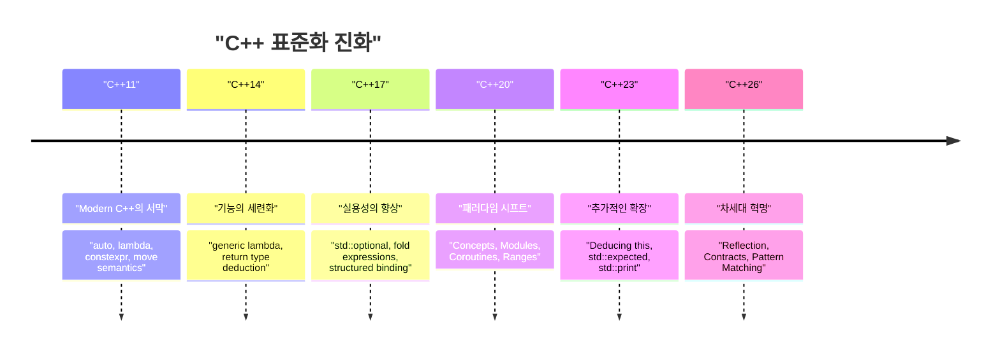
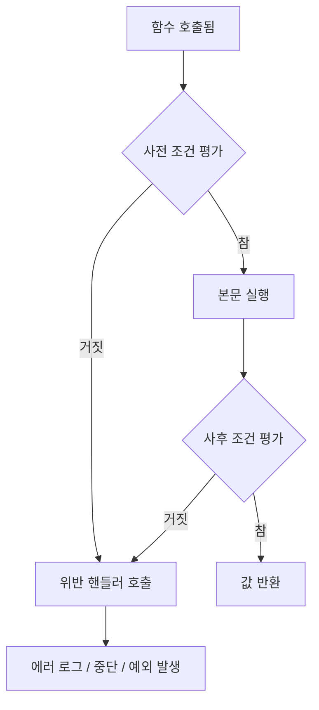

# 시작하며: C++26이 가져올 차세대 프로그래밍 패러다임

2026년, C++ 역사상 매우 중요한 이정표가 될 **C++26**이 정식으로 표준화되었습니다. C++11에서 'Modern C++'이라는 개념이 탄생한 이래, C++14, C++17, C++20, C++23으로 꾸준히 진화를 거듭해 왔습니다만, C++26은 언어 기능과 표준 라이브러리 양면에서 지금까지의 메타프로그래밍, 에러 핸들링, 동시성 처리의 상식을 뒤엎을 만큼 강력한 패러다임 시프트를 가져옵니다.

이 글에서는 C++26에 도입된 주요 신기능에 대해 기술적인 세부 사항, 컴파일 타임의 성능 향상, 기존 C++23까지의 코드와의 비교, 그리고 실전적인 사용법을 철저하게 해설합니다. 총 글자 수 1만 자가 넘는 분량으로, 리플렉션, 계약 프로그래밍(Contracts), 패턴 매칭, Pack Indexing, 구조화된 바인딩의 확장, 그리고 Senders/Receivers를 비롯한 표준 라이브러리의 진화까지 폭넓게 다룹니다.

먼저, C++ 표준화의 역사와 C++26의 위치를 시각적으로 확인해 봅시다.



C++26은 C++20에서 도입된 Concepts나 Modules 같은 대규모 기능군 위에서, **코드의 자기 기술성(리플렉션)**이나 **견고성(계약 프로그래밍)**을 극한까지 높이는 것을 목적으로 하고 있습니다. 그러면 각 기능의 세부 사항을 파헤쳐 보겠습니다.

---

# 1. 리플렉션 (Static Reflection): 메타프로그래밍의 진정한 혁명

C++26 최대의 핵심 기능이라고 해도 과언이 아닌 것이 **정적 리플렉션(Static Reflection)**입니다(주로 P2996 등의 제안에 기반). 지금까지 C++에서 타입의 구조나 멤버 변수 정보를 프로그램 내에서 얻으려면 복잡한 템플릿 메타프로그래밍(TMP)이나 매크로를 구사해야 했습니다. 하지만 C++26의 리플렉션 메커니즘을 통해 컴파일 타임에 프로그램 자신의 구조(AST: 추상 구문 트리의 정보)에 안전하고 직관적으로 접근할 수 있게 되었습니다.

## 1.1 기존 C++23까지의 과제

C++23 이전에서 특정 구조체의 모든 멤버 변수를 JSON으로 직렬화(Serialize)하고 싶은 경우를 생각해 봅시다. 표준적인 언어 기능으로는 구조체의 멤버를 나열하는 방법이 존재하지 않았기 때문에, Boost.Describe나 Boost.Pfr 같은 서드파티 라이브러리를 사용하거나 독자적인 매크로를 정의하여 멤버를 등록해야 했습니다.

이는 컴파일 시간의 증가나 에러 메시지의 난해함을 초래했습니다. 수학적인 관점에서 보면, 기존의 재귀적인 템플릿 인스턴스화를 사용한 타입 정보 분석은 요소 수 $N$ 에 대해 컴파일 타임의 계산량이 $O(N)$, 복잡한 메타 함수에서는 최악의 경우 $O(N^2)$ 의 인스턴스화를 필요로 했습니다.

$$
T_{\text{compile}}(N) \approx O(N^2) \quad \text{(Recursive Template Metaprogramming)}
$$

## 1.2 C++26의 리플렉션 구문과 접근 방식

C++26의 리플렉션은 `^` 연산자(리플렉션 연산자)와 `[: ... :]` 구문(스플라이서)을 사용합니다. `^T` 로 타입이나 변수의 '메타 정보'를 취득하며, 이는 컴파일 타임 상수인 `std::meta::info` 타입의 객체로 다루어집니다.

```cpp
#include <iostream>
#include <string>
#include <meta>

struct User {
    int id;
    std::string name;
    std::string email;
};

// C++26의 정적 리플렉션을 사용한 제네릭 직렬화기
template <typename T>
void print_json(const T& obj) {
    constexpr auto type_info = ^T;
    
    std::cout << "{\n";
    // 구조체의 멤버 정보를 취득하여 순회
    template for (constexpr auto member : std::meta::nonstatic_data_members_of(type_info)) {
        // [: member :] 로 원래의 심볼로 전개하고, 식별자(이름)를 문자열로 취득
        std::cout << "  \"" << std::meta::identifier_of(member) << "\": " 
                  << obj.[:member:] << ",\n";
    }
    std::cout << "}\n";
}

int main() {
    User u{1, "Alice", "alice@example.com"};
    print_json(u);
    return 0;
}
```

이 코드에서는 `template for`(컴파일 타임 루프 전개)를 사용하여, `User` 구조체의 모든 멤버를 나열하고 있습니다.

## 1.3 성능과 컴파일 타임의 복잡성

이 신기능이 주는 가장 큰 혜택은 **컴파일 시간 단축**입니다. 컴파일러 내부에서 직접 메타 정보를 조작하기 때문에 요소에 대한 접근이나 순회는 $O(1)$ 의 오버헤드로 처리됩니다. 상수식으로서 즉시 평가되므로 컴파일 타임의 복잡성은 극적으로 개선됩니다.

$$
T_{\text{compile\_new}}(N) = O(N) \quad \text{(Direct AST Traversal)}
$$

템플릿의 중첩에 의한 컴파일러 메모리 고갈이나 장황한 에러 메시지(템플릿 에러의 바다)와는 무관해집니다.

```mermaid
graph TD
    A["타입: User"] -->| "^User" | B["std::meta::info"]
    B -->| "nonstatic_data_members_of" | C["meta::info의 범위"]
    C -->| "[: member :]" | D["직접적인 멤버 접근 (obj.id, obj.name)"]
    D --> E["생성된 코드 (제로 오버헤드)"]
```

---

# 2. 계약 프로그래밍 (Contracts): 견고한 소프트웨어 설계

C++20에서 도입이 보류된 이래 오랫동안 논의되어 온 **Contracts(계약 프로그래밍)**가 마침내 C++26에서 도입되었습니다(P2900 등). 'Design by Contract'의 패러다임을 언어 내장 기능으로 지원하여, 함수의 사전 조건(Pre-condition), 사후 조건(Post-condition), 그리고 단언(Assertion)을 선언적으로 기술할 수 있게 되었습니다.

## 2.1 Contracts의 기본 구문

C++26에서는 함수의 선언에 대해 계약 속성을 부여합니다.

*   `pre` : 함수가 호출되기 전에 만족해야 할 조건
*   `post` : 함수가 종료되고 반환값을 반환할 때 만족해야 할 조건
*   `assert` : 함수 내부의 특정 지점에서 만족해야 할 조건

```cpp
#include <vector>
#include <numeric>

// 계약 프로그래밍을 통한 안전한 평균값 계산
// 사전 조건: 전달되는 벡터는 비어있어서는 안 됨
// 사후 조건: 계산된 평균값은 벡터의 최솟값 이상, 최댓값 이하이다
double calculate_average(const std::vector<double>& v)
    pre (!v.empty())
    post (r : r >= *std::min_element(v.begin(), v.end()) && 
              r <= *std::max_element(v.begin(), v.end()))
{
    double sum = std::accumulate(v.begin(), v.end(), 0.0);
    double avg = sum / v.size();
    
    // 처리 중의 단언
    assert(avg == avg); // NaN 체크 등
    
    return avg; // 사후 조건의 'r' 에 바인딩됨
}
```

## 2.2 계약 위반 핸들링과 런타임 평가

Contracts는 단순한 주석이나 오래된 `assert()` 매크로와는 다릅니다. 빌드 모드(개발 빌드, 프로덕션 빌드 등)에 따라 컴파일러에 **위반 시의 동작**을 지시할 수 있습니다. 예를 들어, 개발 시에는 위반 시 즉시 크래시(abort)시키고, 프로덕션 환경에서는 커스텀 위반 핸들러를 호출하여 로그를 기록하고 계속 실행하는 등의 유연한 운용이 가능합니다.



Contracts를 이용함으로써 API의 명세가 스스로 문서화될 뿐만 아니라, 미정의 동작(Undefined Behavior, UB)을 일으키기 전에 안전하게 프로그램을 정지 및 제어할 수 있으므로 C++ 특유의 메모리 파괴 버그나 논리 버그를 대폭 줄일 수 있을 것으로 기대됩니다.

---

# 3. 패턴 매칭 (Pattern Matching): 분기의 세련화

C++17에서 `std::variant` 나 `std::any` 가 도입된 이래, 여러 타입을 유지하는 변수의 디스패치에는 `std::visit` 이 사용되어 왔습니다. 그러나 `std::visit` 과 오버로드 패턴의 조합(이른바 `overloaded` 구조체 핵)은 매우 장황하고 가독성이 낮았습니다.

C++26에서는 **패턴 매칭(Pattern Matching)**이 언어 기능으로 내장되었습니다(P2688 준수). 이로써 함수형 언어(Rust나 Haskell 등)에 가까운 직관적인 매칭이 가능해집니다.

## 3.1 C++23까지의 `std::visit`의 고뇌

```cpp
// C++23까지의 작성법
template<class... Ts> struct overloaded : Ts... { using Ts::operator()...; };
template<class... Ts> overloaded(Ts...) -> overloaded<Ts...>;

std::variant<int, std::string, double> v = "Hello";

std::visit(overloaded {
    [](int i) { std::cout << "Int: " << i << '\n'; },
    [](const std::string& s) { std::cout << "String: " << s << '\n'; },
    [](double d) { std::cout << "Double: " << d << '\n'; }
}, v);
```

## 3.2 C++26의 `inspect` 구문을 통한 극적인 개선

새로운 `inspect` 키워드를 사용함으로써 다음과 같이 매우 깔끔하게 작성할 수 있게 됩니다.

```cpp
// C++26의 패턴 매칭
std::variant<int, std::string, double> v = "Hello";

inspect (v) {
    int i => std::cout << "Int: " << i << '\n';
    std::string s => std::cout << "String: " << s << '\n';
    double d => std::cout << "Double: " << d << '\n';
    _ => std::cout << "Unknown type\n"; // 와일드카드
};
```

이 패턴 매칭은 단순한 타입 디스패치에 머무르지 않고, **구조체의 구조 분해(Destructuring)**나 **가드 조건**(특정 조건을 만족하는 경우에만 매칭)도 지원합니다.

```cpp
struct Point { int x, y; };
std::variant<Point, int> var = Point{10, 20};

inspect (var) {
    // 구조체의 요소를 바인딩하면서 가드 조건 (if) 을 부여
    [x, y] as Point if (x == y) => { std::cout << "Diagonal: " << x << '\n'; }
    [x, y] as Point => { std::cout << "Point: " << x << ", " << y << '\n'; }
    int i => { std::cout << "Scalar: " << i << '\n'; }
};
```

컴파일러는 이 `inspect` 문에 대해 망라성 검사(Exhaustiveness checking)를 수행하므로, 열거형(enum)이나 `std::variant` 의 처리에서 케이스의 누락이 있으면 컴파일 에러로 보고해 줍니다. 이는 유지보수성 향상에 있어 매우 중요합니다.

---

# 4. Pack Indexing: 템플릿 파라미터 팩의 구원

C++11 이후의 가변 인자 템플릿(Variadic Templates)은 매우 강력하지만, 파라미터 팩 안에서 $N$ 번째 타입이나 값을 꺼내는 조작은 직관적이지 않았습니다. 지금까지는 `std::tuple_element` 나 재귀적인 템플릿을 구사하여 꺼낼 수밖에 없었습니다.

C++26에서는 **Pack Indexing** 기능(P2662)이 도입되어, 배열의 인덱스 접근처럼 더 자연스럽게 작성할 수 있게 되었습니다.

## 4.1 Pack Indexing 의 기본

구문은 매우 단순하여 `Types...[I]` 와 같이 작성합니다.

```cpp
#include <iostream>
#include <type_traits>

// N번째 타입을 가져오는 함수
template <std::size_t N, typename... Types>
constexpr auto get_nth_type() {
    // Types...[N] 으로 N 번째 타입에 직접 접근
    return Types...[N]{};
}

// 가변 인자의 N번째 값을 가져오는 함수
template <std::size_t N, typename... Args>
constexpr decltype(auto) get_nth_value(Args&&... args) {
    // 파라미터 팩 args 에 대해서도 인덱스 접근이 가능
    return std::forward<Args...[N]>(args...[N]);
}

int main() {
    // 타입에 대한 접근
    using SecondType = decltype(get_nth_type<1, int, double, char>());
    static_assert(std::is_same_v<SecondType, double>);

    // 값에 대한 접근
    auto val = get_nth_value<2>(10, 3.14, "Hello C++26", 'c');
    std::cout << val << std::endl; // "Hello C++26" 이 출력됨
}
```

컴파일러는 팩 인덱스를 상수 시간 $O(1)$ 에 처리할 수 있게 되어, 지금까지 메타 함수의 중첩으로 인해 발생하던 긴 컴파일 시간을 단축합니다.

---

# 5. 구조화된 바인딩(Structured Bindings)의 확장

C++17에서 도입된 구조화된 바인딩은 함수의 여러 반환값을 받을 때 매우 편리하지만, 일부 변수만 사용하고 나머지를 무시하고 싶은 경우에는 더미 변수를 정의해야 했고, '사용되지 않은 변수(unused variable)' 경고를 피하기 번거로웠습니다.

C++26에서는 플레이스홀더로서 `_` (언더스코어)를 사용하는 것이 정식으로 허용되었습니다.

```cpp
#include <map>
#include <string>
#include <iostream>

std::map<int, std::string> get_data() {
    return {{1, "One"}, {2, "Two"}, {3, "Three"}};
}

int main() {
    auto data = get_data();
    
    for (const auto& [id, _] : data) {
        // 값(문자열)은 무시하고 키(ID)만 이용한다
        std::cout << "ID: " << id << '\n';
    }
}
```

이 작은 확장을 통해 코드의 의도가 더욱 명확해지고, 불필요한 경고를 억제하는 `#pragma` 나 `[[maybe_unused]]` 속성의 남용을 방지할 수 있습니다.

---

# 6. 표준 라이브러리의 진화: 동시성 처리와 비동기의 재정의

언어 기능뿐만 아니라, C++26의 표준 라이브러리(STL)도 극적인 진화를 이뤘습니다. 특히 비동기 처리와 메모리 관리 영역에서 엔터프라이즈 및 시스템 프로그래밍의 요구에 부응하는 고도화된 컴포넌트가 도입되었습니다.

## 6.1 Senders / Receivers (std::execution)

C++의 비동기 처리 모델을 근본부터 다시 만드는 표준화 제안(P2300)이 드디어 C++26에서 결실을 맺었습니다. `std::async` 나 `std::future` 가 안고 있던 성능 문제(과도한 메모리 할당이나 스케줄링의 비효율성)를 해결하기 위해 **Senders/Receivers** 모델이 도입되었습니다.


Senders는 '무엇을 할 것인가'를 기술하는 가벼운 설계도이며, 실행 컨텍스트(Scheduler)와 분리되어 있습니다. 이로써 CPU의 ThreadPool이나 GPU로의 작업 오프로딩을 통일된 인터페이스로 효율적으로 기술할 수 있게 됩니다.

```cpp
#include <execution>
#include <iostream>
#include <syncstream>

using namespace std::execution;

int main() {
    auto scheduler = get_system_thread_pool().scheduler();

    // 작업 파이프라인 (이 시점에서는 실행되지 않음: 지연 평가)
    auto task = schedule(scheduler)
              | then([] { return 42; })
              | then([](int val) { return val * 2; })
              | upon_error([](std::exception_ptr e) { return 0; });

    // sync_wait로 동기적으로 결과를 대기
    auto [result] = sync_wait(task).value();
    
    std::osyncstream(std::cout) << "Result: " << result << std::endl;
}
```

## 6.2 Hazard Pointers 와 RCU (Read-Copy Update)

락 프리(Lock-free) 데이터 구조의 구현을 뒷받침하는 표준 기능으로서 **Hazard Pointers** (`std::hazard_pointer`) 와 **RCU** (`std::rcu`) 가 표준화되었습니다. 이로써 C++에서 고성능 동시성 데이터 구조를 구현할 때의 진입 장벽이 크게 낮아졌습니다.

RCU는 특히 읽기(Read)가 압도적으로 많은 워크로드에서 캐시 라인의 경합을 배제하고 선형적인 확장성을 실현합니다. 수학적으로 표현하면 스레드 수 $T$ 에 대해 읽기 처리량(Throughput)은 이상적인 $O(T)$ 의 증가를 보입니다.

$$
\text{Throughput}_{\text{RCU}} \propto T \quad \text{(Read-heavy Workloads)}
$$

---

# 7. 실전적인 마이그레이션 가이드와 도입의 이점

C++26으로의 전환은 C++11 때와 같은 대규모 패러다임 시프트를 요구하지만, 코드베이스의 안전성과 컴파일 시간을 크게 개선하는 장점이 있습니다.

1.  **메타프로그래밍의 쇄신**: 복잡한 `template` 이나 `constexpr if` 의 중첩으로 구성된 직렬화기(Serializer)나 ORM(Object-Relational Mapping) 프레임워크는 C++26의 리플렉션을 사용하여 다시 작성함으로써 유지보수성이 비약적으로 향상되고, 컴파일 시간이 수십 분의 1로 단축될 가능성이 있습니다.
2.  **Contracts에 의한 API 설계**: 클래스 라이브러리 설계자는 Doxygen과 같은 문서화 주석에 의존하는 대신, Contracts(`pre` / `post`)를 사용하여 사양을 언어 수준에서 명시해야 합니다. 이를 통해 사용 측의 잘못된 호출을 조기에 발견할 수 있습니다.
3.  **비동기 처리의 모던화**: 독자적인 구현이나 Boost.Asio에 의존했던 비동기 처리를 `std::execution` (Senders/Receivers) 으로 전환함으로써 플랫폼이나 하드웨어를 뛰어넘는 표준화된 동시성 처리 기반을 구축할 수 있습니다.

## 전환 시의 주의점: ABI 안정성과 컴파일러 지원

새로운 언어 기능, 특히 Contracts 등은 함수 시그니처나 ABI(Application Binary Interface)에 영향을 줄 가능성이 있으므로 공유 라이브러리(DLL / .so)의 경계를 넘어 사용할 경우에는 동일한 컴파일러와 표준 라이브러리 버전(GCC, Clang, MSVC)으로 컴파일되었는지를 강력하게 확인해야 합니다.

---

# 요약

C++26은 오랫동안 C++ 프로그래머가 기다려온 '꿈의 기능'이 한꺼번에 도입된 그야말로 역사적인 버전입니다.

*   **리플렉션**을 통해 메타프로그래밍의 난해함이 사라지고 $O(1)$ 의 AST 접근이 실현되었습니다.
*   **계약 프로그래밍**을 통해 함수의 사전/사후 조건을 명시하여 견고한 프로그램을 구축할 수 있게 되었습니다.
*   **패턴 매칭**을 통해 복잡한 분기나 상태 전이를 직관적이고 안전하게 기술할 수 있습니다.
*   **Senders/Receivers** 와 **RCU / Hazard Pointers** 를 통해 극한의 성능을 이끌어내는 동시성 처리가 표준화되었습니다.

이러한 기능을 적절히 활용함으로써 C++의 가장 큰 강점인 '제로 오버헤드 추상화(Zero-overhead Abstraction)'를 더 높은 수준에서, 게다가 놀라울 정도로 깔끔한 코드로 실현할 수 있게 됩니다.

앞으로 각 컴파일러 벤더의 C++26 기능 구현 상황(Feature Test Macros 등)을 주시하면서, 신규 프로젝트나 라이브러리 개발에 적극적으로 이러한 새로운 패러다임을 도입해 나갈 것을 권장합니다. C++는 결코 낡은 언어가 아니며 최첨단 언어 이론을 탐욕스럽게 수용하면서 앞으로도 시스템 프로그래밍의 정점에 계속 군림할 것입니다.

---
*이 글은 2026년 시점의 C++26 표준화 상황을 바탕으로 작성되었습니다. 각 컴파일러의 구현 상황에 따라 일부 구문이 변경될 가능성이 있음에 유의해 주십시오.*
