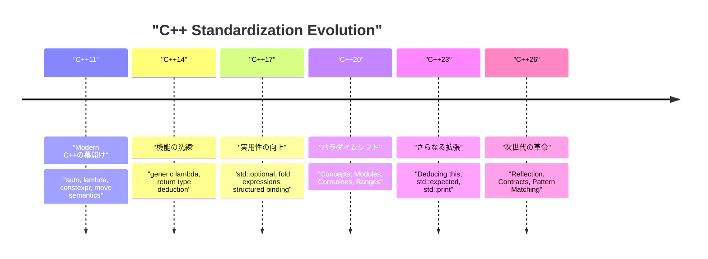
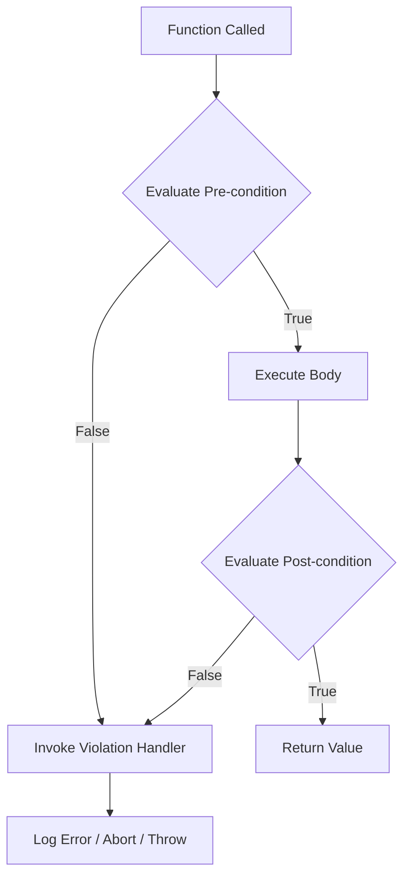

# はじめに：C++26がもたらす次世代のプログラミングパラダイム

2026年、C++の歴史において非常に重要なマイルストーンとなる**C++26**が正式に標準化されました。C++11で「Modern C++」という概念が生まれて以来、C++14、C++17、C++20、C++23と着実に進化を遂げてきましたが、C++26は言語機能と標準ライブラリの両面において、これまでのメタプログラミング、エラーハンドリング、並行処理の常識を覆すほどの強力なパラダイムシフトをもたらします。

この記事では、C++26で導入された主要な新機能について、技術的な詳細、コンパイル時のパフォーマンス向上、既存のC++23までのコードとの比較、そして実践的な使い方を徹底的に解説します。総文字数1万字を超えるボリュームで、リフレクション、契約プログラミング（Contracts）、パターンマッチング、Pack Indexing、構造化束縛の拡張、そしてSenders/Receiversをはじめとする標準ライブラリの進化まで、幅広く網羅しています。

まずは、C++標準化の歴史とC++26の位置づけを視覚的に確認しましょう。



C++26は、C++20で導入されたConceptsやModulesといった大規模機能群の上で、**コードの自己記述性（リフレクション）**や**堅牢性（契約プログラミング）**を極限まで高めることを目的としています。それでは、各機能の詳細に迫りましょう。

---

# 1. リフレクション (Static Reflection)：メタプログラミングの真・革命

C++26最大の目玉機能と言っても過言ではないのが、**静的リフレクション（Static Reflection）**です（主にP2996などの提案に基づきます）。これまでC++で型の構造やメンバ変数の情報をプログラム内から取得するには、複雑なテンプレートメタプログラミング（TMP）やマクロを駆使する必要がありました。しかし、C++26のリフレクション機構により、コンパイル時にプログラム自身の構造（AST：抽象構文木の情報）へ安全かつ直感的にアクセスできるようになりました。

## 1.1 従来のC++23までの課題

C++23以前で、ある構造体の全てのメンバ変数をJSONにシリアライズしたい場合を考えてみましょう。標準的な言語機能としては構造体のメンバを列挙する方法が存在しなかったため、Boost.DescribeやBoost.Pfrといったサードパーティライブラリを使用するか、独自のマクロを定義してメンバを登録する必要がありました。

これはコンパイル時間の増大や、エラーメッセージの難解化を招いていました。数学的な視点で見ると、従来の再帰的なテンプレートインスタンス化を用いた型情報の解析は、要素数 $N$ に対してコンパイル時の計算量が $O(N)$、複雑なメタ関数では最悪の場合 $O(N^2)$ のインスタンス化を必要としていました。

$$
T_{\text{compile}}(N) \approx O(N^2) \quad \text{(Recursive Template Metaprogramming)}
$$

## 1.2 C++26のリフレクション構文とアプローチ

C++26のリフレクションは、`^` 演算子（リフレクション演算子）と `[: ... :]` 構文（スプライサ）を使用します。`^T` で型や変数の「メタ情報」を取得し、それはコンパイル時の定数である `std::meta::info` 型のオブジェクトとして扱われます。

```cpp
#include <iostream>
#include <string>
#include <meta>

struct User {
    int id;
    std::string name;
    std::string email;
};

// C++26の静的リフレクションを用いたジェネリックなシリアライザ
template <typename T>
void print_json(const T& obj) {
    constexpr auto type_info = ^T;
    
    std::cout << "{\n";
    // 構造体のメンバ情報を取得してイテレート
    template for (constexpr auto member : std::meta::nonstatic_data_members_of(type_info)) {
        // [: member :] で元のシンボルに展開し、識別子（名前）を文字列として取得
        std::cout << "  \"" << std::meta::identifier_of(member) << "\": " 
                  << obj.[:member:] << ",\n";
    }
    std::cout << "}\n";
}

int main() {
    User u{1, "Alice", "alice@example.com"};
    print_json(u);
    return 0;
}
```

このコードでは、`template for`（コンパイル時ループ展開）を用いて、`User` 構造体の全てのメンバを列挙しています。

## 1.3 パフォーマンスとコンパイル時の複雑性

この新機能による最大の恩恵は**コンパイル時間の短縮**です。コンパイラ内部で直接メタ情報を操作するため、要素へのアクセスやイテレーションは $O(1)$ のオーバーヘッドで処理されます。定数式として即座に評価されるため、コンパイル時間の複雑性は劇的に改善されます。

$$
T_{\text{compile\_new}}(N) = O(N) \quad \text{(Direct AST Traversal)}
$$

テンプレートのネストによるコンパイラのメモリ枯渇や、長大なエラーメッセージ（テンプレートエラーの海）とは無縁になります。

```mermaid
graph TD
    A["Type: User"] -->| "^User" | B["std::meta::info"]
    B -->| "nonstatic_data_members_of" | C["Range of meta::info"]
    C -->| "[: member :]" | D["Direct Member Access (obj.id, obj.name)"]
    D --> E["Generated Code (Zero Overhead)"]
```

---

# 2. 契約プログラミング (Contracts)：堅牢なソフトウェア設計

C++20での導入が見送られて以来、長らく議論されてきた**Contracts（契約プログラミング）**がついにC++26で導入されました（P2900等）。「Design by Contract」のパラダイムを言語組み込みでサポートし、関数の事前条件（Pre-condition）、事後条件（Post-condition）、そしてアサーション（Assertion）を宣言的に記述できるようになりました。

## 2.1 Contractsの基本構文

C++26では、関数の宣言に対して契約属性を付与します。

*   `pre` : 関数が呼び出される前に満たされているべき条件
*   `post` : 関数が終了し戻り値を返す際に満たされているべき条件
*   `assert` : 関数内部の特定の地点で満たされているべき条件

```cpp
#include <vector>
#include <numeric>

// 契約プログラミングによる安全な平均値計算
// 事前条件: 渡されるベクターは空であってはならない
// 事後条件: 計算された平均値は、ベクターの最小値以上かつ最大値以下である
double calculate_average(const std::vector<double>& v)
    pre (!v.empty())
    post (r : r >= *std::min_element(v.begin(), v.end()) && 
              r <= *std::max_element(v.begin(), v.end()))
{
    double sum = std::accumulate(v.begin(), v.end(), 0.0);
    double avg = sum / v.size();
    
    // 処理中のアサーション
    assert(avg == avg); // NaNのチェック等
    
    return avg; // 事後条件の 'r' にバインドされる
}
```

## 2.2 コントラクト違反のハンドリングと実行時評価

Contractsは単なるコメントや古い `assert()` マクロとは異なります。ビルドモード（開発ビルド、本番ビルドなど）に応じて、コンパイラに**違反時の振る舞い**を指示できます。例えば、開発時には違反で即座にクラッシュ（アボート）させ、本番環境ではカスタム違反ハンドラを呼び出しログを記録して継続するといった柔軟な運用が可能です。



Contractsを利用することで、APIの仕様が自己文書化されるだけでなく、未定義動作（Undefined Behavior, UB）を引き起こす前に安全にプログラムを停止・制御できるため、C++特有のメモリ破壊バグや論理バグの大幅な削減が期待できます。

---

# 3. パターンマッチング (Pattern Matching)：分岐の洗練

C++17で `std::variant` や `std::any` が導入されて以来、様々な型を保持する変数のディスパッチには `std::visit` が用いられてきました。しかし、`std::visit` とオーバーロードパターンの組み合わせ（いわゆる `overloaded` 構造体ハック）は非常に冗長で可読性が低いものでした。

C++26では、**パターンマッチング（Pattern Matching）**が言語機能として組み込まれました（P2688準拠）。これにより、関数型言語（RustやHaskellなど）に近い直感的なマッチングが可能になります。

## 3.1 C++23までの `std::visit` の苦悩

```cpp
// C++23までの記述
template<class... Ts> struct overloaded : Ts... { using Ts::operator()...; };
template<class... Ts> overloaded(Ts...) -> overloaded<Ts...>;

std::variant<int, std::string, double> v = "Hello";

std::visit(overloaded {
    [](int i) { std::cout << "Int: " << i << '\n'; },
    [](const std::string& s) { std::cout << "String: " << s << '\n'; },
    [](double d) { std::cout << "Double: " << d << '\n'; }
}, v);
```

## 3.2 C++26の `inspect` 構文による劇的な改善

新しい `inspect` キーワードを使うことで、以下のように非常にすっきりと書けるようになります。

```cpp
// C++26のパターンマッチング
std::variant<int, std::string, double> v = "Hello";

inspect (v) {
    int i => std::cout << "Int: " << i << '\n';
    std::string s => std::cout << "String: " << s << '\n';
    double d => std::cout << "Double: " << d << '\n';
    _ => std::cout << "Unknown type\n"; // ワイルドカード
};
```

このパターンマッチングは単なる型のディスパッチに留まらず、**構造体のデストラクチャリング**（分解）や**ガード条件**（特定の条件を満たす場合のみマッチ）にも対応しています。

```cpp
struct Point { int x, y; };
std::variant<Point, int> var = Point{10, 20};

inspect (var) {
    // 構造体の要素を束縛しつつ、ガード条件 (if) を付与
    [x, y] as Point if (x == y) => { std::cout << "Diagonal: " << x << '\n'; }
    [x, y] as Point => { std::cout << "Point: " << x << ", " << y << '\n'; }
    int i => { std::cout << "Scalar: " << i << '\n'; }
};
```

コンパイラはこの `inspect` 文に対して網羅性チェック（Exhaustiveness checking）を行うため、列挙型（enum）や `std::variant` の処理においてケースの漏れがあればコンパイルエラーとして報告してくれます。これは保守性の向上において極めて重要です。

---

# 4. Pack Indexing：テンプレートパラメータパックの救済

C++11以降の可変長テンプレート（Variadic Templates）は非常に強力ですが、パラメータパックの中から $N$ 番目の型や値を取り出す操作は直感的ではありませんでした。これまでは `std::tuple_element` や再帰的なテンプレートを駆使して取り出すしかありませんでした。

C++26では **Pack Indexing** 機能（P2662）が導入され、配列のインデックスアクセスのようにより自然に記述できるようになりました。

## 4.1 Pack Indexing の基本

構文は非常にシンプルで、`Types...[I]` のように記述します。

```cpp
#include <iostream>
#include <type_traits>

// N番目の型を取得する関数
template <std::size_t N, typename... Types>
constexpr auto get_nth_type() {
    // Types...[N] で N 番目の型に直接アクセス
    return Types...[N]{};
}

// 可変長引数のN番目の値を取得する関数
template <std::size_t N, typename... Args>
constexpr decltype(auto) get_nth_value(Args&&... args) {
    // パラメータパック args に対してもインデックスアクセスが可能
    return std::forward<Args...[N]>(args...[N]);
}

int main() {
    // 型へのアクセス
    using SecondType = decltype(get_nth_type<1, int, double, char>());
    static_assert(std::is_same_v<SecondType, double>);

    // 値へのアクセス
    auto val = get_nth_value<2>(10, 3.14, "Hello C++26", 'c');
    std::cout << val << std::endl; // "Hello C++26" が出力される
}
```

コンパイラはパックインデックスを定数時間 $O(1)$ で処理できるようになり、これまでメタ関数のネストによって引き起こされていた長大なコンパイル時間が削減されます。

---

# 5. 構造化束縛（Structured Bindings）の拡張

C++17で導入された構造化束縛は、関数の複数の戻り値を受け取る際に非常に便利ですが、一部の変数だけを使用し、他を無視したい場合にはダミー変数を定義する必要があり、「未使用変数（unused variable）」の警告を回避するのに手間がかかりました。

C++26では、プレースホルダーとして `_`（アンダースコア）を使用することが正式に許可されました。

```cpp
#include <map>
#include <string>
#include <iostream>

std::map<int, std::string> get_data() {
    return {{1, "One"}, {2, "Two"}, {3, "Three"}};
}

int main() {
    auto data = get_data();
    
    for (const auto& [id, _] : data) {
        // 値（文字列）は無視してキー（ID）だけを利用する
        std::cout << "ID: " << id << '\n';
    }
}
```

この小さな拡張により、コードの意図がより明確になり、不要な警告を抑制する `#pragma` や `[[maybe_unused]]` 属性の乱用を防ぐことができます。

---

# 6. 標準ライブラリの進化：並行処理と非同期の再定義

言語機能だけでなく、C++26の標準ライブラリ（STL）も劇的な進化を遂げています。特に非同期処理とメモリ管理の領域において、エンタープライズやシステムプログラミングの要求に応える高度なコンポーネントが導入されました。

## 6.1 Senders / Receivers (std::execution)

C++の非同期処理モデルを根底から作り直す標準化提案（P2300）がついにC++26で結実しました。`std::async` や `std::future` が抱えていたパフォーマンスの問題（過度なメモリ割り当てやスケジューリングの非効率性）を解決するため、**Senders/Receivers** モデルが導入されました。


Sendersは「何をすべきか」を記述する軽量な設計図であり、実行コンテキスト（Scheduler）と分離されています。これにより、CPUのThreadPoolやGPUへのタスクのオフロードを統一されたインターフェースで効率的に記述できるようになります。

```cpp
#include <execution>
#include <iostream>
#include <syncstream>

using namespace std::execution;

int main() {
    auto scheduler = get_system_thread_pool().scheduler();

    // タスクのパイプライン（この時点では実行されない：遅延評価）
    auto task = schedule(scheduler)
              | then([] { return 42; })
              | then([](int val) { return val * 2; })
              | upon_error([](std::exception_ptr e) { return 0; });

    // sync_waitで同期的に結果を待機
    auto [result] = sync_wait(task).value();
    
    std::osyncstream(std::cout) << "Result: " << result << std::endl;
}
```

## 6.2 Hazard Pointers と RCU (Read-Copy Update)

ロックフリー・データ構造の実装を支える標準機能として、**Hazard Pointers** (`std::hazard_pointer`) と **RCU** (`std::rcu`) が標準化されました。これにより、C++で高パフォーマンスな並行データ構造を実装する際の敷居が大幅に下がりました。

RCUは特にリード（読み取り）が圧倒的に多いワークロードにおいて、キャッシュラインの競合を排除し、線形なスケーラビリティを実現します。数学的に表現すれば、スレッド数 $T$ に対して読取スループットは理想的な $O(T)$ の増加を示します。

$$
\text{Throughput}_{\text{RCU}} \propto T \quad \text{(Read-heavy Workloads)}
$$

---

# 7. 実践的な移行ガイドと導入のメリット

C++26への移行は、C++11の時のような大規模なパラダイムシフトを要求しますが、コードベースの安全性とコンパイル時間を大幅に改善するメリットがあります。

1.  **メタプログラミングの刷新**: 複雑な `template` や `constexpr if` のネストで構成されたシリアライザやORM（Object-Relational Mapping）フレームワークは、C++26のリフレクションを用いて書き直すことで、保守性が飛躍的に向上し、コンパイル時間が数十分の１に短縮される可能性があります。
2.  **ContractsによるAPI設計**: クラスライブラリの設計者は、Doxygenのようなドキュメントコメントに依存するのではなく、Contracts（`pre` / `post`）を用いて仕様を言語レベルで明記すべきです。これにより、利用側の不正な呼び出しを早期に検知できます。
3.  **非同期処理のモダナイズ**: 独自の実装やBoost.Asioに依存していた非同期処理を `std::execution` (Senders/Receivers) に移行することで、プラットフォームやハードウェアを超えた標準化された並行処理基盤を構築できます。

## 移行時の注意点：ABI安定性とコンパイラのサポート

新しい言語機能、特にContractsなどは関数シグネチャやABI（Application Binary Interface）に影響を与える可能性があるため、共有ライブラリ（DLL / .so）の境界を越えて使用する場合は、同一のコンパイラと標準ライブラリのバージョン（GCC, Clang, MSVC）でコンパイルされていることを強く確認する必要があります。

---

# まとめ

C++26は、長年C++プログラマが待ち望んできた「夢の機能」が一挙に導入された、まさに歴史的なバージョンです。

*   **リフレクション**により、メタプログラミングの難解さが払拭され $O(1)$ のASTアクセスが実現。
*   **契約プログラミング**により、関数の事前・事後条件を明示し堅牢なプログラムが構築可能に。
*   **パターンマッチング**により、複雑な分岐や状態遷移を直感的かつ安全に記述。
*   **Senders/Receivers** と **RCU / Hazard Pointers** により、極限のパフォーマンスを引き出す並行処理が標準化。

これらの機能を適切に活用することで、C++の最大の強みである「ゼロオーバーヘッド抽象化（Zero-overhead Abstraction）」をより高いレベルで、しかも驚くほどクリーンなコードで実現できるようになります。

今後、各コンパイラベンダのC++26機能の実装状況（Feature Test Macros等）を注視しつつ、新規プロジェクトやライブラリ開発において積極的にこれらの新パラダイムを取り入れていくことをお勧めします。C++は決して古い言語ではなく、最先端の言語理論を貪欲に取り込みながら、今後もシステムプログラミングの頂点に君臨し続けることでしょう。

---
*この記事は2026年時点のC++26標準化状況に基づいて執筆されています。各コンパイラの実装状況によっては、一部の構文が変更される可能性があることにご留意ください。*
