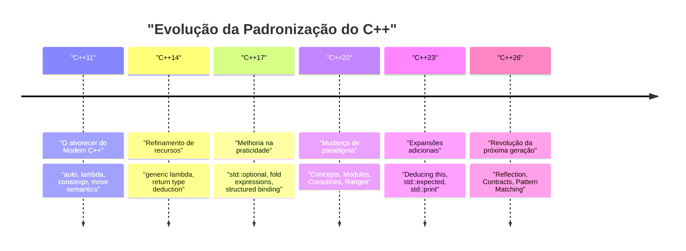
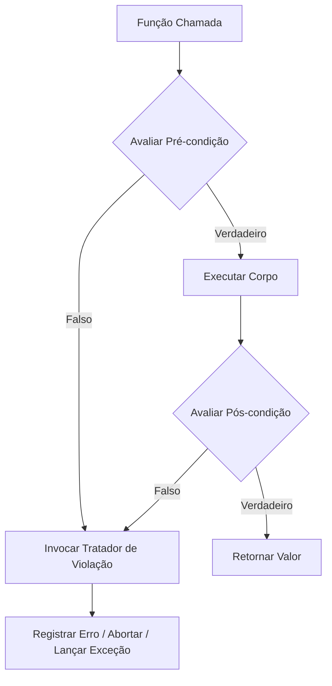

# Introdução: O Paradigma de Programação da Próxima Geração Trazido pelo C++26

Em 2026, o **C++26**, um marco extremamente importante na história do C++, foi oficialmente padronizado. Desde a criação do conceito de "Modern C++" no C++11, houve uma evolução constante através do C++14, C++17, C++20 e C++23. No entanto, o C++26 traz uma poderosa mudança de paradigma, tanto em recursos de linguagem quanto na biblioteca padrão, que derruba o senso comum anterior sobre metaprogramação, tratamento de erros e processamento concorrente.

Neste artigo, explicaremos exaustivamente os principais novos recursos introduzidos no C++26, abordando detalhes técnicos, melhorias de desempenho em tempo de compilação, comparações com o código existente até o C++23 e usos práticos. Com um volume de mais de 10.000 caracteres, abrangemos desde Reflexão (Reflection), Programação por Contratos (Contracts), Correspondência de Padrões (Pattern Matching), Pack Indexing, expansão de Structured Bindings (Ligações Estruturadas), até a evolução da biblioteca padrão, incluindo Senders/Receivers.

Primeiro, vamos visualizar a história da padronização do C++ e o posicionamento do C++26.



O C++26 baseia-se nos conjuntos de recursos de larga escala, como Concepts e Modules introduzidos no C++20, e tem como objetivo maximizar a **autodescrição do código (Reflexão)** e a **robustez (Programação por Contratos)**. Agora, vamos nos aprofundar nos detalhes de cada recurso.

---

# 1. Reflexão (Static Reflection): A Verdadeira Revolução da Metaprogramação

Não é exagero dizer que o maior destaque do C++26 é a **Reflexão Estática (Static Reflection)** (baseada principalmente em propostas como P2996). Até agora, no C++, para obter informações sobre a estrutura de um tipo ou variáveis de membro dentro de um programa, era necessário fazer uso intenso de macros e metaprogramação de templates (TMP) complexa. No entanto, com o mecanismo de reflexão do C++26, agora é possível acessar a estrutura do próprio programa (informações da AST: Árvore Sintática Abstrata) de forma segura e intuitiva em tempo de compilação.

## 1.1 Os Desafios Anteriores até o C++23

Considere o caso em que você deseja serializar todas as variáveis de membro de uma estrutura em JSON antes do C++23. Como não havia um método para enumerar os membros de uma estrutura como um recurso de linguagem padrão, era necessário usar bibliotecas de terceiros como Boost.Describe ou Boost.Pfr, ou definir suas próprias macros para registrar os membros.

Isso causava um aumento no tempo de compilação e mensagens de erro confusas. Do ponto de vista matemático, a análise de informações de tipo usando a instanciação recursiva de templates convencional exigia uma complexidade computacional de tempo de compilação de $O(N)$ para $N$ elementos e, no pior dos casos, para metafunções complexas, exigia instanciações de $O(N^2)$.

$$
T_{\text{compile}}(N) \approx O(N^2) \quad \text{(Recursive Template Metaprogramming)}
$$

## 1.2 A Sintaxe de Reflexão e a Abordagem do C++26

A reflexão no C++26 usa o operador `^` (operador de reflexão) e a sintaxe `[: ... :]` (splicer). Usando `^T`, obtemos as "metainformações" do tipo ou variável, e isso é tratado como um objeto do tipo `std::meta::info` que é uma constante em tempo de compilação.

```cpp
#include <iostream>
#include <string>
#include <meta>

struct User {
    int id;
    std::string name;
    std::string email;
};

// Serializador genérico usando reflexão estática do C++26
template <typename T>
void print_json(const T& obj) {
    constexpr auto type_info = ^T;
    
    std::cout << "{\n";
    // Obter as informações dos membros da estrutura e iterar
    template for (constexpr auto member : std::meta::nonstatic_data_members_of(type_info)) {
        // Expandir para o símbolo original com [: member :] e obter o identificador (nome) como uma string
        std::cout << "  \"" << std::meta::identifier_of(member) << "\": " 
                  << obj.[:member:] << ",\n";
    }
    std::cout << "}\n";
}

int main() {
    User u{1, "Alice", "alice@example.com"};
    print_json(u);
    return 0;
}
```

Neste código, estamos enumerando todos os membros da estrutura `User` usando `template for` (expansão de loop em tempo de compilação).

## 1.3 Desempenho e Complexidade em Tempo de Compilação

O maior benefício deste novo recurso é a **redução no tempo de compilação**. Uma vez que as metainformações são manipuladas diretamente dentro do compilador, o acesso aos elementos e a iteração são processados com uma sobrecarga de $O(1)$. Como é imediatamente avaliado como uma expressão constante, a complexidade do tempo de compilação é melhorada drasticamente.

$$
T_{\text{compile\_new}}(N) = O(N) \quad \text{(Direct AST Traversal)}
$$

Você não terá mais que lidar com o esgotamento da memória do compilador devido ao aninhamento de templates, nem com as longas mensagens de erro (um mar de erros de templates).

```mermaid
graph TD
    A["Tipo: User"] -->| "^User" | B["std::meta::info"]
    B -->| "nonstatic_data_members_of" | C["Intervalo de meta::info"]
    C -->| "[: member :]" | D["Acesso Direto ao Membro (obj.id, obj.name)"]
    D --> E["Código Gerado (Zero Sobrecarga)"]
```

---

# 2. Programação por Contratos (Contracts): Design de Software Robusto

Há muito tempo em discussão desde que sua introdução foi adiada no C++20, **Contracts (Programação por Contratos)** finalmente foram introduzidos no C++26 (P2900, etc.). O paradigma de "Design por Contrato" agora é suportado nativamente pela linguagem, permitindo que as pré-condições (Pre-conditions), pós-condições (Post-conditions) e asserções (Assertions) de uma função sejam escritas de forma declarativa.

## 2.1 A Sintaxe Básica de Contracts

No C++26, atributos de contrato são aplicados às declarações de funções.

*   `pre` : Condições que devem ser atendidas antes da função ser chamada
*   `post` : Condições que devem ser atendidas quando a função terminar e retornar um valor
*   `assert` : Condições que devem ser atendidas em um ponto específico dentro da função

```cpp
#include <vector>
#include <numeric>

// Cálculo de média seguro usando programação por contratos
// Pré-condição: O vetor passado não deve estar vazio
// Pós-condição: A média calculada deve ser maior ou igual ao mínimo e menor ou igual ao máximo do vetor
double calculate_average(const std::vector<double>& v)
    pre (!v.empty())
    post (r : r >= *std::min_element(v.begin(), v.end()) && 
              r <= *std::max_element(v.begin(), v.end()))
{
    double sum = std::accumulate(v.begin(), v.end(), 0.0);
    double avg = sum / v.size();
    
    // Asserção durante o processamento
    assert(avg == avg); // Verificação de NaN, etc.
    
    return avg; // Fica vinculado ao 'r' da pós-condição
}
```

## 2.2 Tratamento de Violações de Contratos e Avaliação em Tempo de Execução

Os Contracts são diferentes de meros comentários ou da antiga macro `assert()`. Dependendo do modo de compilação (compilação de desenvolvimento, compilação de produção, etc.), você pode instruir o compilador sobre o **comportamento em caso de violação**. Por exemplo, é possível ter uma operação flexível onde, durante o desenvolvimento, uma violação causa um travamento imediato (aborto), e em um ambiente de produção, invoca um tratador de violações customizado, registra o log e continua a execução.



Ao utilizar Contracts, a especificação da API não apenas se autodocumenta, mas o programa pode ser interrompido e controlado com segurança antes de causar um Comportamento Indefinido (Undefined Behavior, UB). Assim, espera-se uma redução significativa nos bugs de corrupção de memória e bugs lógicos característicos do C++.

---

# 3. Correspondência de Padrões (Pattern Matching): O Refinamento das Ramificações

Desde que `std::variant` e `std::any` foram introduzidos no C++17, `std::visit` tem sido usado para despachar variáveis que mantêm vários tipos. No entanto, a combinação de `std::visit` com o padrão de sobrecarga (o chamado hack da estrutura `overloaded`) era muito verboso e tinha baixa legibilidade.

No C++26, a **Correspondência de Padrões (Pattern Matching)** foi incorporada como um recurso da linguagem (conforme P2688). Com isso, uma correspondência intuitiva próxima a de linguagens funcionais (como Rust ou Haskell) torna-se possível.

## 3.1 O Sofrimento com o `std::visit` até o C++23

```cpp
// Escrita até o C++23
template<class... Ts> struct overloaded : Ts... { using Ts::operator()...; };
template<class... Ts> overloaded(Ts...) -> overloaded<Ts...>;

std::variant<int, std::string, double> v = "Hello";

std::visit(overloaded {
    [](int i) { std::cout << "Int: " << i << '\n'; },
    [](const std::string& s) { std::cout << "String: " << s << '\n'; },
    [](double d) { std::cout << "Double: " << d << '\n'; }
}, v);
```

## 3.2 Melhoria Dramática com a Sintaxe `inspect` do C++26

Usando a nova palavra-chave `inspect`, você pode escrever de forma muito mais limpa da seguinte maneira.

```cpp
// Correspondência de Padrões no C++26
std::variant<int, std::string, double> v = "Hello";

inspect (v) {
    int i => std::cout << "Int: " << i << '\n';
    std::string s => std::cout << "String: " << s << '\n';
    double d => std::cout << "Double: " << d << '\n';
    _ => std::cout << "Unknown type\n"; // Curinga
};
```

Esta correspondência de padrões não se limita apenas ao despacho de tipos; ela também suporta a **desestruturação de estruturas** (decomposição) e **condições de guarda** (corresponde apenas se certas condições forem atendidas).

```cpp
struct Point { int x, y; };
std::variant<Point, int> var = Point{10, 20};

inspect (var) {
    // Vincula os elementos da estrutura adicionando uma condição de guarda (if)
    [x, y] as Point if (x == y) => { std::cout << "Diagonal: " << x << '\n'; }
    [x, y] as Point => { std::cout << "Point: " << x << ", " << y << '\n'; }
    int i => { std::cout << "Scalar: " << i << '\n'; }
};
```

Como o compilador realiza verificações de exaustividade (Exhaustiveness checking) nesta instrução `inspect`, se houver alguma omissão de casos no processamento de enumerações (enum) ou `std::variant`, ele relatará isso como um erro de compilação. Isso é extremamente importante para melhorar a manutenibilidade.

---

# 4. Pack Indexing: A Salvação dos Pacotes de Parâmetros de Template

Os templates variádicos (Variadic Templates) introduzidos desde o C++11 são extremamente poderosos, mas a operação de extrair o enésimo ($N$) tipo ou valor de um pacote de parâmetros não era intuitiva. Até agora, a única maneira de extraí-los era através do uso intenso de `std::tuple_element` e templates recursivos.

No C++26, foi introduzido o recurso de **Pack Indexing** (P2662), permitindo que isso seja escrito de forma mais natural, como o acesso ao índice de um array.

## 4.1 O Básico do Pack Indexing

A sintaxe é muito simples, escrita como `Types...[I]`.

```cpp
#include <iostream>
#include <type_traits>

// Função para obter o enésimo tipo
template <std::size_t N, typename... Types>
constexpr auto get_nth_type() {
    // Acessa diretamente o enésimo tipo usando Types...[N]
    return Types...[N]{};
}

// Função para obter o enésimo valor de argumentos variádicos
template <std::size_t N, typename... Args>
constexpr decltype(auto) get_nth_value(Args&&... args) {
    // Acesso por índice também é possível para o pacote de parâmetros args
    return std::forward<Args...[N]>(args...[N]);
}

int main() {
    // Acesso ao tipo
    using SecondType = decltype(get_nth_type<1, int, double, char>());
    static_assert(std::is_same_v<SecondType, double>);

    // Acesso ao valor
    auto val = get_nth_value<2>(10, 3.14, "Hello C++26", 'c');
    std::cout << val << std::endl; // Será exibido "Hello C++26"
}
```

O compilador agora pode processar índices de pacote em tempo constante $O(1)$, reduzindo os longos tempos de compilação que antes eram causados pelo aninhamento de metafunções.

---

# 5. Expansão das Ligações Estruturadas (Structured Bindings)

As ligações estruturadas introduzidas no C++17 são muito convenientes ao receber múltiplos valores de retorno de uma função. Contudo, se você quisesse usar apenas algumas variáveis e ignorar as outras, era necessário definir variáveis fictícias (dummy), dando trabalho para evitar o aviso de "variável não utilizada (unused variable)".

No C++26, o uso de `_` (sublinhado) como espaço reservado (placeholder) foi oficialmente permitido.

```cpp
#include <map>
#include <string>
#include <iostream>

std::map<int, std::string> get_data() {
    return {{1, "One"}, {2, "Two"}, {3, "Three"}};
}

int main() {
    auto data = get_data();
    
    for (const auto& [id, _] : data) {
        // Ignora o valor (string) e usa apenas a chave (ID)
        std::cout << "ID: " << id << '\n';
    }
}
```

Esta pequena expansão torna a intenção do código mais clara e previne o uso excessivo de `#pragma` ou atributos `[[maybe_unused]]` para suprimir avisos desnecessários.

---

# 6. Evolução da Biblioteca Padrão: Redefinindo a Concorrência e o Assincronismo

Não apenas os recursos da linguagem, mas a Biblioteca Padrão do C++ (STL) também passou por evoluções dramáticas no C++26. Especialmente nas áreas de processamento assíncrono e gerenciamento de memória, foram introduzidos componentes avançados para atender às demandas de programação de sistemas e corporativas.

## 6.1 Senders / Receivers (std::execution)

A proposta de padronização para reconstruir fundamentalmente o modelo de processamento assíncrono do C++ (P2300) finalmente se concretizou no C++26. O modelo **Senders/Receivers** foi introduzido para resolver os problemas de desempenho associados a `std::async` e `std::future` (como a alocação excessiva de memória e a ineficiência no agendamento).


Os Senders são projetos leves que descrevem "o que deve ser feito" e são separados do contexto de execução (Scheduler). Isso permite que você escreva de maneira eficiente, com uma interface unificada, o descarregamento (offloading) de tarefas para o ThreadPool da CPU ou GPU.

```cpp
#include <execution>
#include <iostream>
#include <syncstream>

using namespace std::execution;

int main() {
    auto scheduler = get_system_thread_pool().scheduler();

    // Pipeline da tarefa (não executada neste ponto: avaliação preguiçosa)
    auto task = schedule(scheduler)
              | then([] { return 42; })
              | then([](int val) { return val * 2; })
              | upon_error([](std::exception_ptr e) { return 0; });

    // Aguarda o resultado de forma síncrona com sync_wait
    auto [result] = sync_wait(task).value();
    
    std::osyncstream(std::cout) << "Result: " << result << std::endl;
}
```

## 6.2 Hazard Pointers e RCU (Read-Copy Update)

Como recursos padrão de suporte à implementação de estruturas de dados lock-free (livres de bloqueio), os **Hazard Pointers** (`std::hazard_pointer`) e o **RCU** (`std::rcu`) foram padronizados. Isso reduziu drasticamente a barreira de entrada para a implementação de estruturas de dados concorrentes de alto desempenho em C++.

O RCU elimina a contenção das linhas de cache e alcança escalabilidade linear, especialmente em cargas de trabalho onde as leituras (reads) são esmagadoramente dominantes. Expresso matematicamente, a taxa de transferência de leitura mostra um aumento ideal de $O(T)$ em relação ao número de threads $T$.

$$
\text{Throughput}_{\text{RCU}} \propto T \quad \text{(Read-heavy Workloads)}
$$

---

# 7. Guia Prático de Migração e Benefícios de sua Adoção

A migração para o C++26 requer uma grande mudança de paradigma, semelhante à que ocorreu no C++11, mas oferece os benefícios de melhorar drasticamente a segurança da base de código e os tempos de compilação.

1.  **Renovação da Metaprogramação**: Serializadores e frameworks ORM (Mapeamento Objeto-Relacional) compostos por um aninhamento complexo de `template` e `constexpr if` podem ter a sua manutenibilidade melhorada significativamente e os tempos de compilação reduzidos a frações ao serem reescritos utilizando a reflexão do C++26.
2.  **Design de APIs com Contracts**: Os criadores de bibliotecas de classes devem usar Contracts (`pre` / `post`) para especificar declarações ao nível da linguagem, em vez de depender de comentários de documentação como os do Doxygen. Isso permite a detecção precoce de chamadas inválidas por parte dos usuários.
3.  **Modernização do Processamento Assíncrono**: Ao migrar processos assíncronos que dependiam de implementações próprias ou do Boost.Asio para o `std::execution` (Senders/Receivers), pode-se construir uma base de processamento concorrente padronizada além das plataformas e hardwares.

## Considerações na Migração: Estabilidade da ABI e Suporte do Compilador

Os novos recursos da linguagem, especialmente Contracts e similares, podem afetar as assinaturas das funções e a ABI (Application Binary Interface). Portanto, ao utilizá-los entre fronteiras de bibliotecas compartilhadas (DLL / .so), é altamente necessário garantir que eles sejam compilados com o mesmo compilador e versão da biblioteca padrão (GCC, Clang, MSVC).

---

# Resumo

O C++26 é, sem dúvida, uma versão histórica na qual os "recursos dos sonhos" aguardados pelos programadores C++ por muitos anos foram introduzidos de uma só vez.

*   A **Reflexão** acaba com a complexidade da metaprogramação, alcançando acesso à AST em $O(1)$.
*   A **Programação por Contratos** permite a construção de programas robustos, especificando claramente as pré e pós-condições das funções.
*   A **Correspondência de Padrões** permite a escrita intuitiva e segura de ramificações complexas e transições de estado.
*   **Senders/Receivers** e **RCU / Hazard Pointers** padronizam o processamento concorrente para extrair o máximo de desempenho.

Utilizando adequadamente esses recursos, o maior ponto forte do C++, a "Abstração com Sobrecarga Zero (Zero-overhead Abstraction)", pode ser alcançado em um nível superior e com um código surpreendentemente limpo.

Daqui em diante, recomendamos incorporar ativamente esses novos paradigmas no desenvolvimento de novos projetos e bibliotecas, ao mesmo tempo em que se observa atentamente o status de implementação dos recursos do C++26 por cada fornecedor de compilador (Feature Test Macros, etc.). O C++ não é de forma alguma uma linguagem antiga; ao assimilar avidamente a teoria de linguagem mais avançada, continuará a reinar no topo da programação de sistemas no futuro.

---
*Este artigo foi escrito com base na situação de padronização do C++26 a partir do ano de 2026. Lembre-se de que algumas sintaxes podem estar sujeitas a mudanças, dependendo do status de implementação de cada compilador.*
