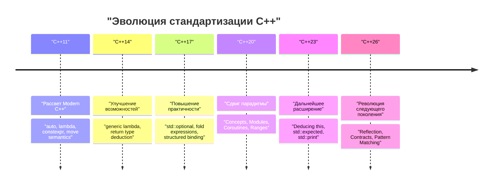
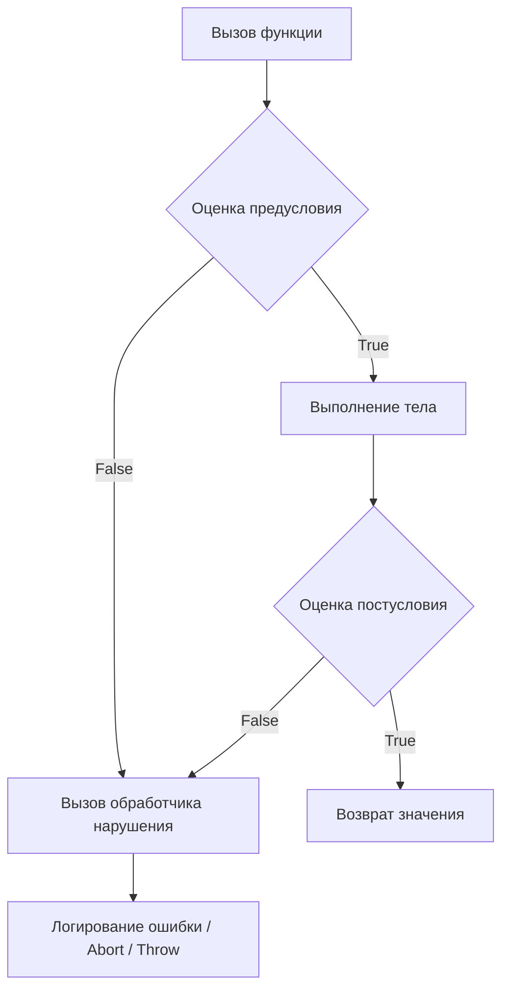

# Введение: C++26 приносит парадигму программирования следующего поколения

В 2026 году был официально стандартизирован **C++26**, ставший очень важной вехой в истории C++. С тех пор как в C++11 зародилась концепция «Modern C++», язык неуклонно развивался через C++14, C++17, C++20 и C++23. Однако C++26 приносит настолько мощный сдвиг парадигмы как в языковых возможностях, так и в стандартной библиотеке, что это переворачивает привычные представления о метапрограммировании, обработке ошибок и параллельных вычислениях.

В этой статье мы подробно рассмотрим основные новые возможности, появившиеся в C++26: их технические детали, улучшение производительности во время компиляции, сравнение с существующим кодом (до C++23) и практическое применение. Это объемное руководство (более 10 тысяч символов) охватывает широкий спектр тем, включая рефлексию, контрактное программирование (Contracts), сопоставление с образцом (Pattern Matching), Pack Indexing, расширение структурированного связывания (Structured Bindings), а также эволюцию стандартной библиотеки во главе с концепцией Senders/Receivers.

Для начала давайте визуально оценим историю стандартизации C++ и место C++26 в ней.



Опираясь на такие масштабные нововведения C++20, как Concepts и Modules, C++26 стремится довести до максимума **самодокументируемость кода (рефлексия)** и **надежность (контрактное программирование)**. Давайте рассмотрим каждую возможность подробно.

---

# 1. Рефлексия (Static Reflection): Истинная революция в метапрограммировании

Без преувеличения можно сказать, что главной особенностью C++26 является **статическая рефлексия (Static Reflection)** (в основном базирующаяся на предложениях вроде P2996). До сих пор в C++ для получения информации о структуре типа или его переменных-членах из программы требовалось использовать сложное шаблонное метапрограммирование (TMP) или макросы. Однако механизм рефлексии в C++26 позволяет интуитивно и безопасно получать доступ к структуре самой программы (AST: абстрактному синтаксическому дереву) во время компиляции.

## 1.1 Проблемы до C++23

Представьте, что до C++23 нам нужно было сериализовать все переменные-члены структуры в JSON. Поскольку стандартных языковых средств для перечисления членов структуры не существовало, приходилось использовать сторонние библиотеки, такие как Boost.Describe или Boost.Pfr, либо определять собственные макросы для их регистрации.

Это приводило к увеличению времени компиляции и усложнению сообщений об ошибках. С математической точки зрения, анализ информации о типах с использованием традиционного рекурсивного инстанцирования шаблонов требовал $O(N)$ вычислительной сложности во время компиляции для $N$ элементов, а в случае сложных метафункций инстанцирование могло занимать $O(N^2)$ в худшем случае.

$$
T_{\text{compile}}(N) \approx O(N^2) \quad \text{(Recursive Template Metaprogramming)}
$$

## 1.2 Синтаксис и подход рефлексии в C++26

Рефлексия в C++26 использует оператор `^` (оператор рефлексии) и синтаксис `[: ... :]` (сплайсер). С помощью `^T` можно получить «метаинформацию» о типе или переменной, которая обрабатывается как константный объект типа `std::meta::info` во время компиляции.

```cpp
#include <iostream>
#include <string>
#include <meta>

struct User {
    int id;
    std::string name;
    std::string email;
};

// Обобщенный сериализатор с использованием статической рефлексии C++26
template <typename T>
void print_json(const T& obj) {
    constexpr auto type_info = ^T;
    
    std::cout << "{\n";
    // Получение информации о членах структуры и итерирование по ним
    template for (constexpr auto member : std::meta::nonstatic_data_members_of(type_info)) {
        // Развертывание в исходный символ с помощью [: member :] и получение идентификатора (имени) в виде строки
        std::cout << "  \"" << std::meta::identifier_of(member) << "\": " 
                  << obj.[:member:] << ",\n";
    }
    std::cout << "}\n";
}

int main() {
    User u{1, "Alice", "alice@example.com"};
    print_json(u);
    return 0;
}
```

В этом коде используется `template for` (развертывание цикла во время компиляции) для перечисления всех членов структуры `User`.

## 1.3 Производительность и сложность во время компиляции

Самым большим преимуществом этой новой функции является **сокращение времени компиляции**. Поскольку метаинформация обрабатывается напрямую внутри компилятора, доступ к элементам и итерация выполняются с накладными расходами $O(1)$. Поскольку они немедленно оцениваются как константные выражения, сложность времени компиляции кардинально улучшается.

$$
T_{\text{compile\_new}}(N) = O(N) \quad \text{(Direct AST Traversal)}
$$

Можно навсегда забыть о нехватке памяти компилятора из-за вложенности шаблонов и длинных сообщениях об ошибках (море ошибок шаблонов).

```mermaid
graph TD
    A["Тип: User"] -->| "^User" | B["std::meta::info"]
    B -->| "nonstatic_data_members_of" | C["Диапазон meta::info"]
    C -->| "[: member :]" | D["Прямой доступ к членам (obj.id, obj.name)"]
    D --> E["Сгенерированный код (Нулевые накладные расходы)"]
```

---

# 2. Контрактное программирование (Contracts): Надежное проектирование ПО

После отсрочки введения в C++20, давно обсуждаемое **контрактное программирование (Contracts)** наконец-то было добавлено в C++26 (например, P2900). Парадигма «Design by Contract» (проектирование по контракту) теперь поддерживается на уровне языка, позволяя декларативно описывать предусловия (Pre-conditions), постусловия (Post-conditions) и утверждения (Assertions) для функций.

## 2.1 Базовый синтаксис Contracts

В C++26 к объявлениям функций добавляются атрибуты контрактов:

*   `pre` : Условие, которое должно выполняться перед вызовом функции
*   `post` : Условие, которое должно выполняться после завершения функции и возврата значения
*   `assert` : Условие, которое должно выполняться в определенной точке внутри функции

```cpp
#include <vector>
#include <numeric>

// Безопасное вычисление среднего значения с помощью контрактного программирования
// Предусловие: Переданный вектор не должен быть пустым
// Постусловие: Вычисленное среднее значение должно быть не меньше минимального и не больше максимального значения в векторе
double calculate_average(const std::vector<double>& v)
    pre (!v.empty())
    post (r : r >= *std::min_element(v.begin(), v.end()) && 
              r <= *std::max_element(v.begin(), v.end()))
{
    double sum = std::accumulate(v.begin(), v.end(), 0.0);
    double avg = sum / v.size();
    
    // Утверждение во время выполнения
    assert(avg == avg); // Проверка на NaN и т.д.
    
    return avg; // Связывается с 'r' в постусловии
}
```

## 2.2 Обработка нарушений контрактов и оценка во время выполнения

Контракты отличаются от простых комментариев или старых макросов `assert()`. В зависимости от режима сборки (для разработки, для продакшена и т.д.) компилятору можно указать **поведение при нарушении контракта**. Например, во время разработки при нарушении программа может немедленно аварийно завершиться (abort), а в производственной среде можно вызвать пользовательский обработчик нарушений, записать ошибку в журнал и продолжить выполнение. Это дает большую гибкость в эксплуатации.



Использование контрактов не только самодокументирует спецификации API, но и позволяет безопасно остановить или контролировать программу до того, как возникнет неопределенное поведение (Undefined Behavior, UB). Ожидается, что это приведет к значительному сокращению ошибок повреждения памяти и логических ошибок, характерных для C++.

---

# 3. Сопоставление с образцом (Pattern Matching): Усовершенствование ветвлений

С момента появления `std::variant` и `std::any` в C++17 для диспетчеризации переменных, содержащих различные типы, использовался `std::visit`. Однако комбинация `std::visit` и паттерна перегрузки (так называемый хак со структурой `overloaded`) была очень громоздкой и трудночитаемой.

В C++26 **сопоставление с образцом (Pattern Matching)** было встроено как языковая возможность (согласно P2688). Это делает сопоставление интуитивно понятным, подобно функциональным языкам (таким как Rust или Haskell).

## 3.1 Трудности с `std::visit` до C++23

```cpp
// Написание до C++23
template<class... Ts> struct overloaded : Ts... { using Ts::operator()...; };
template<class... Ts> overloaded(Ts...) -> overloaded<Ts...>;

std::variant<int, std::string, double> v = "Hello";

std::visit(overloaded {
    [](int i) { std::cout << "Int: " << i << '\n'; },
    [](const std::string& s) { std::cout << "String: " << s << '\n'; },
    [](double d) { std::cout << "Double: " << d << '\n'; }
}, v);
```

## 3.2 Кардинальные улучшения с синтаксисом `inspect` в C++26

Используя новое ключевое слово `inspect`, код становится гораздо более лаконичным:

```cpp
// Сопоставление с образцом в C++26
std::variant<int, std::string, double> v = "Hello";

inspect (v) {
    int i => std::cout << "Int: " << i << '\n';
    std::string s => std::cout << "String: " << s << '\n';
    double d => std::cout << "Double: " << d << '\n';
    _ => std::cout << "Неизвестный тип\n"; // Подстановочный знак
};
```

Это сопоставление с образцом не ограничивается лишь диспетчеризацией типов, оно также поддерживает **деструктуризацию структур** и **условия-охранники (guards)** (сопоставление только при выполнении определенных условий).

```cpp
struct Point { int x, y; };
std::variant<Point, int> var = Point{10, 20};

inspect (var) {
    // Связывание элементов структуры с добавлением условия-охранника (if)
    [x, y] as Point if (x == y) => { std::cout << "Диагональ: " << x << '\n'; }
    [x, y] as Point => { std::cout << "Точка: " << x << ", " << y << '\n'; }
    int i => { std::cout << "Скаляр: " << i << '\n'; }
};
```

Компилятор выполняет проверку на исчерпываемость (exhaustiveness checking) для инструкции `inspect`. Поэтому, если при обработке перечислений (enum) или `std::variant` будет пропущен какой-либо случай, компилятор сообщит об ошибке. Это крайне важно для повышения поддерживаемости кода.

---

# 4. Pack Indexing: Спасение для пакетов параметров шаблонов

Шаблоны с переменным числом аргументов (Variadic Templates), введенные в C++11, очень мощные, но операция извлечения $N$-го типа или значения из пакета параметров была неинтуитивной. Ранее приходилось использовать `std::tuple_element` или рекурсивные шаблоны для их извлечения.

В C++26 была добавлена функция **Pack Indexing** (P2662), что позволило писать код более естественно, подобно доступу по индексу в массивах.

## 4.1 Основы Pack Indexing

Синтаксис очень прост и выглядит как `Types...[I]`.

```cpp
#include <iostream>
#include <type_traits>

// Функция для получения N-го типа
template <std::size_t N, typename... Types>
constexpr auto get_nth_type() {
    // Прямой доступ к N-му типу с помощью Types...[N]
    return Types...[N]{};
}

// Функция для получения N-го значения аргументов переменной длины
template <std::size_t N, typename... Args>
constexpr decltype(auto) get_nth_value(Args&&... args) {
    // Доступ по индексу возможен и для пакета параметров args
    return std::forward<Args...[N]>(args...[N]);
}

int main() {
    // Доступ к типам
    using SecondType = decltype(get_nth_type<1, int, double, char>());
    static_assert(std::is_same_v<SecondType, double>);

    // Доступ к значениям
    auto val = get_nth_value<2>(10, 3.14, "Hello C++26", 'c');
    std::cout << val << std::endl; // Выведет "Hello C++26"
}
```

Теперь компилятор может обрабатывать индексы пакета за константное время $O(1)$, что сокращает долгое время компиляции, ранее вызванное вложенностью метафункций.

---

# 5. Расширение структурированного связывания (Structured Bindings)

Структурированное связывание, введенное в C++17, очень удобно при получении множественных возвращаемых значений из функции. Однако, если нужно было использовать только некоторые переменные, а остальные игнорировать, приходилось определять фиктивные переменные и тратить усилия на предотвращение предупреждений о «неиспользуемых переменных» (unused variable).

В C++26 было официально разрешено использовать `_` (подчеркивание) в качестве заполнителя.

```cpp
#include <map>
#include <string>
#include <iostream>

std::map<int, std::string> get_data() {
    return {{1, "One"}, {2, "Two"}, {3, "Three"}};
}

int main() {
    auto data = get_data();
    
    for (const auto& [id, _] : data) {
        // Игнорируем значение (строку) и используем только ключ (ID)
        std::cout << "ID: " << id << '\n';
    }
}
```

Это небольшое расширение делает намерения в коде более четкими и позволяет избежать злоупотребления прагмами или атрибутом `[[maybe_unused]]` для подавления ненужных предупреждений.

---

# 6. Эволюция стандартной библиотеки: Переосмысление параллелизма и асинхронности

Вместе с языковыми функциями кардинально эволюционировала и стандартная библиотека C++26 (STL). В частности, в областях асинхронной обработки и управления памятью были внедрены передовые компоненты, отвечающие требованиям корпоративного и системного программирования.

## 6.1 Senders / Receivers (std::execution)

Предложение по стандартизации (P2300), которое с нуля перерабатывает модель асинхронной обработки в C++, наконец-то принесло плоды в C++26. Для решения проблем производительности (чрезмерное выделение памяти и неэффективность планирования), присущих `std::async` и `std::future`, была внедрена модель **Senders/Receivers**.


Senders — это легковесные «чертежи», описывающие «что нужно сделать», они отделены от контекста выполнения (Scheduler). Это позволяет описывать передачу задач в пулы потоков CPU или на GPU с использованием унифицированного интерфейса и высокой эффективностью.

```cpp
#include <execution>
#include <iostream>
#include <syncstream>

using namespace std::execution;

int main() {
    auto scheduler = get_system_thread_pool().scheduler();

    // Конвейер задач (на данный момент не выполняется: ленивые вычисления)
    auto task = schedule(scheduler)
              | then([] { return 42; })
              | then([](int val) { return val * 2; })
              | upon_error([](std::exception_ptr e) { return 0; });

    // Синхронное ожидание результата с помощью sync_wait
    auto [result] = sync_wait(task).value();
    
    std::osyncstream(std::cout) << "Результат: " << result << std::endl;
}
```

## 6.2 Hazard Pointers и RCU (Read-Copy Update)

В качестве стандартных функций, поддерживающих реализацию безблокировочных (lock-free) структур данных, были стандартизированы **Hazard Pointers** (`std::hazard_pointer`) и **RCU** (`std::rcu`). Это значительно снижает порог входа для реализации высокопроизводительных параллельных структур данных в C++.

RCU особенно полезен в рабочих нагрузках с подавляющим преобладанием чтения (read-heavy), поскольку он устраняет конфликты строк кэша и обеспечивает линейную масштабируемость. Выражаясь математически, для $T$ потоков пропускная способность чтения демонстрирует идеальный рост $O(T)$.

$$
\text{Throughput}_{\text{RCU}} \propto T \quad \text{(Read-heavy Workloads)}
$$

---

# 7. Практическое руководство по переходу и преимущества внедрения

Переход на C++26 требует масштабного сдвига парадигмы, как это было в случае с C++11, но дает преимущества в виде значительного улучшения безопасности кодовой базы и сокращения времени компиляции.

1.  **Обновление метапрограммирования**: Сериализаторы или фреймворки ORM (Object-Relational Mapping), построенные на сложных вложенных `template` или `constexpr if`, могут быть переписаны с использованием рефлексии C++26. Это кардинально повысит поддерживаемость кода и может сократить время компиляции до нескольких долей от прежнего.
2.  **Проектирование API с помощью Contracts**: Разработчики библиотек классов должны не полагаться на комментарии в духе Doxygen, а использовать Contracts (`pre` / `post`) для явного указания спецификаций на уровне языка. Это позволит на ранних стадиях обнаруживать некорректные вызовы со стороны пользователей.
3.  **Модернизация асинхронной обработки**: Перенос асинхронной обработки, зависящей от пользовательских реализаций или Boost.Asio, на `std::execution` (Senders/Receivers) позволит создать стандартизированную базу параллелизма, работающую на разных платформах и аппаратном обеспечении.

## На что обратить внимание при переходе: стабильность ABI и поддержка компиляторов

Новые языковые функции, особенно Contracts, могут влиять на сигнатуры функций и ABI (Application Binary Interface). Поэтому при использовании их через границы разделяемых библиотек (DLL / .so) необходимо строго убедиться, что они скомпилированы одной и той же версией компилятора и стандартной библиотеки (GCC, Clang, MSVC).

---

# Заключение

C++26 — это поистине историческая версия, в которой разом реализованы «функции мечты», которых программисты на C++ ждали долгие годы.

*   Благодаря **рефлексии** устранена сложность метапрограммирования и реализован доступ к AST за $O(1)$.
*   **Контрактное программирование** позволяет создавать надежные программы, явно указывая предусловия и постусловия функций.
*   **Сопоставление с образцом** позволяет интуитивно и безопасно описывать сложные ветвления и переходы между состояниями.
*   Благодаря **Senders/Receivers** и **RCU / Hazard Pointers** стандартизирована параллельная обработка, выжимающая максимальную производительность.

Правильное использование этих функций позволит достичь главного преимущества C++ — «абстракций с нулевыми накладными расходами» (Zero-overhead Abstraction) — на еще более высоком уровне и с удивительно чистым кодом.

В будущем, внимательно следя за статусом реализации функций C++26 различными поставщиками компиляторов (например, через Feature Test Macros), мы рекомендуем активно внедрять эти новые парадигмы в новые проекты и разработку библиотек. C++ отнюдь не устаревший язык; жадно впитывая передовые теории языков программирования, он и впредь будет оставаться на вершине системного программирования.

---
*Эта статья была написана на основе статуса стандартизации C++26 по состоянию на 2026 год. Обратите внимание, что некоторый синтаксис может быть изменен в зависимости от статуса реализации конкретными компиляторами.*
