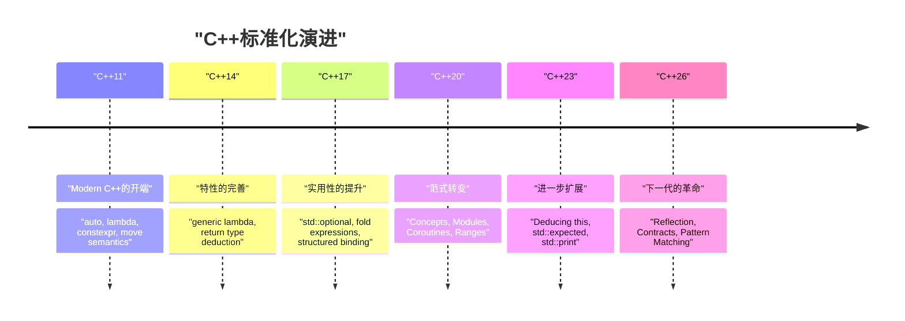
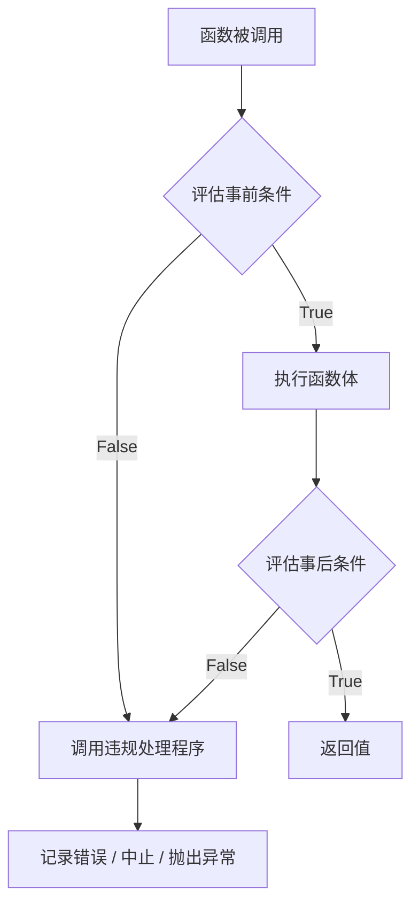
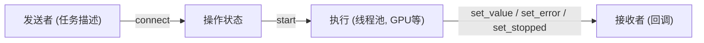

# 引言：C++26带来的下一代编程范式

2026年，在C++的历史上具有极其重要里程碑意义的**C++26**已正式标准化。自从C++11诞生“Modern C++”这一概念以来，C++14、C++17、C++20、C++23稳步演进，而C++26在语言特性和标准库两个方面，带来了足以颠覆以往元编程、错误处理以及并发处理常识的强大范式转变。

本文将针对C++26中引入的主要新特性，深入讲解其技术细节、编译时性能提升、与现有C++23及以前代码的对比，以及在实战中的应用方法。全文超过一万字，内容广泛涵盖反射、契约编程（Contracts）、模式匹配、包索引（Pack Indexing）、结构化绑定的扩展，以及以Senders/Receivers为首的标准库演进。

首先，让我们通过可视化的方式回顾C++标准化的历史以及C++26的定位。



C++26旨在基于C++20引入的Concepts和Modules等大规模功能群之上，将**代码的自描述性（反射）**和**健壮性（契约编程）**提升至极限。接下来，让我们深入了解各项特性的细节。

---

# 1. 反射 (Static Reflection)：元编程的真正革命

毫不夸张地说，C++26最大的亮点功能便是**静态反射（Static Reflection）**（主要基于P2996等提案）。以往在C++中，要想在程序内部获取类型的结构或成员变量的信息，必须充分利用复杂的模板元编程（TMP）或宏。然而，借助C++26的反射机制，如今在编译时能够以安全且直观的方式访问程序自身的结构（AST：抽象语法树信息）。

## 1.1 C++23及以前面临的挑战

考虑在C++23及以前，如果我们想要将某个结构体的所有成员变量序列化为JSON。由于作为标准语言特性不存在枚举结构体成员的方法，我们必须使用Boost.Describe或Boost.Pfr等第三方库，或者定义专有的宏来注册成员。

这会导致编译时间增加，并使错误信息变得晦涩难懂。从数学的角度来看，过去使用递归的模板实例化来解析类型信息，对于元素数量 $N$，需要编译时计算复杂度为 $O(N)$，而在复杂的元函数中，最坏情况下需要 $O(N^2)$ 的实例化。

$$
T_{\text{compile}}(N) \approx O(N^2) \quad \text{(Recursive Template Metaprogramming)}
$$

## 1.2 C++26的反射语法与方法

C++26的反射使用 `^` 运算符（反射运算符）和 `[: ... :]` 语法（拼接器）。通过 `^T` 获取类型或变量的“元信息”，它会被作为编译时常量 `std::meta::info` 类型的对象来处理。

```cpp
#include <iostream>
#include <string>
#include <meta>

struct User {
    int id;
    std::string name;
    std::string email;
};

// 使用C++26静态反射的通用序列化器
template <typename T>
void print_json(const T& obj) {
    constexpr auto type_info = ^T;
    
    std::cout << "{\n";
    // 获取结构体的成员信息并迭代
    template for (constexpr auto member : std::meta::nonstatic_data_members_of(type_info)) {
        // 使用 [: member :] 展开为原始符号，并将标识符（名称）作为字符串获取
        std::cout << "  \"" << std::meta::identifier_of(member) << "\": " 
                  << obj.[:member:] << ",\n";
    }
    std::cout << "}\n";
}

int main() {
    User u{1, "Alice", "alice@example.com"};
    print_json(u);
    return 0;
}
```

在这段代码中，使用了 `template for`（编译时循环展开）来枚举 `User` 结构体的所有成员。

## 1.3 性能与编译时的复杂性

这项新特性带来的最大好处是**编译时间的缩短**。由于在编译器内部直接操作元信息，访问元素或迭代能以 $O(1)$ 的开销进行处理。因为会立即作为常量表达式求值，编译时的复杂性得到了显著改善。

$$
T_{\text{compile\_new}}(N) = O(N) \quad \text{(Direct AST Traversal)}
$$

因为模板嵌套而导致编译器内存耗尽，以及冗长的错误信息（模板错误之海）都将成为历史。

```mermaid
graph TD
    A["类型: User"] -->| "^User" | B["std::meta::info"]
    B -->| "nonstatic_data_members_of" | C["meta::info的范围"]
    C -->| "[: member :]" | D["直接成员访问 (obj.id, obj.name)"]
    D --> E["生成的代码 (零开销)"]
```

---

# 2. 契约编程 (Contracts)：健壮的软件设计

自C++20中被推迟以来，被长期讨论的**契约编程（Contracts）**终于在C++26中被引入（如P2900等）。它在语言内置层面支持了“按契约设计（Design by Contract）”的范式，使得能够以声明式的方式编写函数的事前条件（Pre-condition）、事后条件（Post-condition）以及断言（Assertion）。

## 2.1 Contracts的基础语法

在C++26中，可以向函数声明添加契约属性。

*   `pre` : 函数被调用前必须满足的条件
*   `post` : 函数结束并返回值时必须满足的条件
*   `assert` : 函数内部特定位置必须满足的条件

```cpp
#include <vector>
#include <numeric>

// 使用契约编程安全计算平均值
// 事前条件: 传入的向量不能为空
// 事后条件: 计算出的平均值必须大于等于向量的最小值且小于等于最大值
double calculate_average(const std::vector<double>& v)
    pre (!v.empty())
    post (r : r >= *std::min_element(v.begin(), v.end()) && 
              r <= *std::max_element(v.begin(), v.end()))
{
    double sum = std::accumulate(v.begin(), v.end(), 0.0);
    double avg = sum / v.size();
    
    // 处理过程中的断言
    assert(avg == avg); // NaN检查等
    
    return avg; // 绑定到事后条件中的 'r'
}
```

## 2.2 契约违规的处理与运行时评估

Contracts不同于简单的注释或旧的 `assert()` 宏。根据构建模式（开发构建、生产构建等），可以向编译器指示**发生违规时的行为**。例如，可以进行灵活的运维，在开发时遇到违规就立即崩溃（中止），而在生产环境中则调用自定义违规处理程序记录日志并继续运行。



通过使用Contracts，不仅能使API规范自文档化，还能在引发未定义行为（Undefined Behavior, UB）之前安全地停止或控制程序，因此有望大幅减少C++特有的内存破坏漏洞和逻辑缺陷。

---

# 3. 模式匹配 (Pattern Matching)：分支的洗练

自从C++17引入 `std::variant` 和 `std::any` 以来，对保存各种类型的变量进行分派一直使用 `std::visit`。然而，`std::visit` 与重载模式的组合（即所谓的 `overloaded` 结构体技巧）非常冗长且可读性较差。

在C++26中，**模式匹配（Pattern Matching）**作为语言特性被引入（遵循P2688）。这使得类似于函数式语言（如Rust、Haskell等）的直观匹配成为可能。

## 3.1 C++23及以前 `std::visit` 的困境

```cpp
// C++23及以前的写法
template<class... Ts> struct overloaded : Ts... { using Ts::operator()...; };
template<class... Ts> overloaded(Ts...) -> overloaded<Ts...>;

std::variant<int, std::string, double> v = "Hello";

std::visit(overloaded {
    [](int i) { std::cout << "Int: " << i << '\n'; },
    [](const std::string& s) { std::cout << "String: " << s << '\n'; },
    [](double d) { std::cout << "Double: " << d << '\n'; }
}, v);
```

## 3.2 使用C++26 `inspect` 语法的剧烈改善

通过使用新的 `inspect` 关键字，可以非常简洁地编写如下代码：

```cpp
// C++26的模式匹配
std::variant<int, std::string, double> v = "Hello";

inspect (v) {
    int i => std::cout << "Int: " << i << '\n';
    std::string s => std::cout << "String: " << s << '\n';
    double d => std::cout << "Double: " << d << '\n';
    _ => std::cout << "Unknown type\n"; // 通配符
};
```

这种模式匹配不仅限于类型分派，还支持**结构体解构**（分解）和**守卫条件**（仅在满足特定条件时匹配）。

```cpp
struct Point { int x, y; };
std::variant<Point, int> var = Point{10, 20};

inspect (var) {
    // 绑定结构体元素的同时，附加守卫条件 (if)
    [x, y] as Point if (x == y) => { std::cout << "Diagonal: " << x << '\n'; }
    [x, y] as Point => { std::cout << "Point: " << x << ", " << y << '\n'; }
    int i => { std::cout << "Scalar: " << i << '\n'; }
};
```

编译器会对 `inspect` 语句执行详尽性检查（Exhaustiveness checking），因此在处理枚举（enum）或 `std::variant` 时，如果存在遗漏的情况，它将作为编译错误报错。这在提高代码可维护性方面极其重要。

---

# 4. 包索引 (Pack Indexing)：模板参数包的救赎

C++11之后引入的可变参数模板（Variadic Templates）非常强大，但是从参数包中提取第 $N$ 个类型或值的操作不够直观。在此之前，我们只能依靠 `std::tuple_element` 或是递归模板来提取。

C++26引入了 **包索引（Pack Indexing）** 功能（P2662），使得可以像数组索引访问一样更自然地进行编写。

## 4.1 包索引的基础

语法非常简单，以 `Types...[I]` 的形式编写。

```cpp
#include <iostream>
#include <type_traits>

// 获取第N个类型的函数
template <std::size_t N, typename... Types>
constexpr auto get_nth_type() {
    // 使用 Types...[N] 直接访问第 N 个类型
    return Types...[N]{};
}

// 获取可变参数中第N个值的函数
template <std::size_t N, typename... Args>
constexpr decltype(auto) get_nth_value(Args&&... args) {
    // 也能对参数包 args 进行索引访问
    return std::forward<Args...[N]>(args...[N]);
}

int main() {
    // 访问类型
    using SecondType = decltype(get_nth_type<1, int, double, char>());
    static_assert(std::is_same_v<SecondType, double>);

    // 访问值
    auto val = get_nth_value<2>(10, 3.14, "Hello C++26", 'c');
    std::cout << val << std::endl; // 输出 "Hello C++26"
}
```

编译器现在能以 $O(1)$ 常量时间处理包索引，从而减少了以往由元函数嵌套导致的漫长编译时间。

---

# 5. 结构化绑定（Structured Bindings）的扩展

C++17引入的结构化绑定在接收函数多个返回值时非常方便，但在只使用部分变量而想忽略其他变量时，必须定义虚拟变量，而且为了避免“未使用变量（unused variable）”警告需要花费一些精力。

C++26正式允许使用 `_`（下划线）作为占位符。

```cpp
#include <map>
#include <string>
#include <iostream>

std::map<int, std::string> get_data() {
    return {{1, "One"}, {2, "Two"}, {3, "Three"}};
}

int main() {
    auto data = get_data();
    
    for (const auto& [id, _] : data) {
        // 忽略值（字符串），仅使用键（ID）
        std::cout << "ID: " << id << '\n';
    }
}
```

这一小幅扩展使代码意图更加清晰，可防止滥用 `#pragma` 或 `[[maybe_unused]]` 属性来抑制不必要的警告。

---

# 6. 标准库的演进：并发处理与异步的重新定义

除了语言特性，C++26的标准库（STL）也实现了巨大进化。特别是在异步处理和内存管理领域，引入了能够满足企业和系统编程需求的高级组件。

## 6.1 Senders / Receivers (std::execution)

从根本上重塑C++异步处理模型的标准化提案（P2300）终于在C++26中结出硕果。为了解决 `std::async` 和 `std::future` 面临的性能问题（过多的内存分配以及调度低效），引入了 **Senders/Receivers** 模型。



Senders是描述“要做什么”的轻量级蓝图，并与执行上下文（Scheduler）相分离。这使得能够以统一的接口高效编写向CPU线程池或GPU卸载（Offload）任务的代码。

```cpp
#include <execution>
#include <iostream>
#include <syncstream>

using namespace std::execution;

int main() {
    auto scheduler = get_system_thread_pool().scheduler();

    // 任务流水线（此时不会执行：延迟求值）
    auto task = schedule(scheduler)
              | then([] { return 42; })
              | then([](int val) { return val * 2; })
              | upon_error([](std::exception_ptr e) { return 0; });

    // 使用sync_wait同步等待结果
    auto [result] = sync_wait(task).value();
    
    std::osyncstream(std::cout) << "Result: " << result << std::endl;
}
```

## 6.2 Hazard Pointers 与 RCU (Read-Copy Update)

作为支持无锁数据结构实现的基石，**Hazard Pointers** (`std::hazard_pointer`) 和 **RCU** (`std::rcu`) 被纳入标准。这大大降低了在C++中实现高性能并发数据结构的门槛。

RCU在以读取操作占绝大多数的工作负载中，排除了缓存行争用，并实现了线性的可扩展性。用数学公式表达的话，对于线程数 $T$，读取吞吐量呈现理想的 $O(T)$ 级增长。

$$
\text{Throughput}_{\text{RCU}} \propto T \quad \text{(Read-heavy Workloads)}
$$

---

# 7. 实战迁移指南与引入优势

向C++26迁移虽然需要像C++11时那样的大规模范式转变，但它具有显著改善代码库安全性和编译时间的优势。

1.  **元编程的革新**: 对于由复杂的 `template` 或 `constexpr if` 嵌套组成的序列化器或ORM（对象关系映射）框架，通过使用C++26的反射进行重写，可维护性将实现飞跃性提升，编译时间也有望缩短至几十分之一。
2.  **基于Contracts的API设计**: 类库设计者不应依赖类似Doxygen的文档注释，而应该使用Contracts（`pre` / `post`）在语言层面上阐明规范。这使得能够在早期检测出调用方的不合法调用。
3.  **异步处理的现代化**: 将依赖专属实现或Boost.Asio的异步处理迁移到 `std::execution` (Senders/Receivers)，可构建超越平台和硬件的标准化并发处理基础设施。

## 迁移注意事项：ABI稳定性与编译器支持

由于新的语言特性（尤其是Contracts等）可能会影响函数签名和ABI（应用二进制接口），在跨越共享库（DLL / .so）边界使用时，必须强烈确保使用相同的编译器和标准库版本（GCC、Clang、MSVC）进行编译。

---

# 总结

C++26是一个历史性的版本，长期以来C++程序员梦寐以求的“梦想特性”在此时被一举引入。

*   **反射** 消除了元编程的难解性，实现了 $O(1)$ 的AST访问。
*   **契约编程** 明确了函数的事前与事后条件，使得构建健壮的程序成为可能。
*   **模式匹配** 直观且安全地描述了复杂的分支和状态转移。
*   **Senders/Receivers** 与 **RCU / Hazard Pointers** 标准化了能够榨取极限性能的并发处理。

通过合理运用这些特性，能够以更高的水平，并且令人惊讶地使用极其干净的代码，来实现C++最大的优势——“零开销抽象（Zero-overhead Abstraction）”。

建议今后密切关注各编译器厂商C++26特性的实现状况（如特性测试宏等），在新项目和库开发中积极引入这些新范式。C++绝对不是一门古老的语言，在贪婪吸收最前沿语言理论的同时，它今后也必将继续屹立于系统编程的巅峰。

---
*本文基于2026年C++26标准化的当前情况编写。请注意，根据各编译器的实现进度，部分语法可能会发生变化。*
