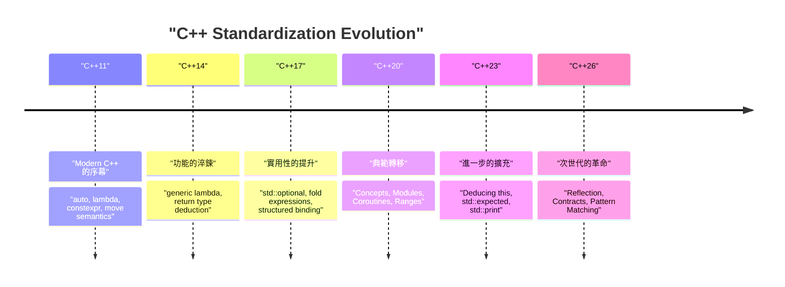
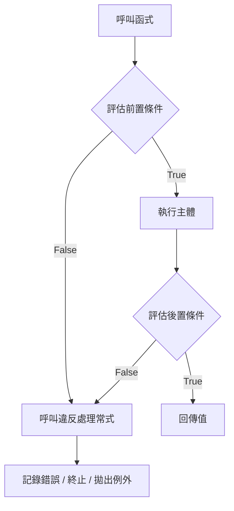
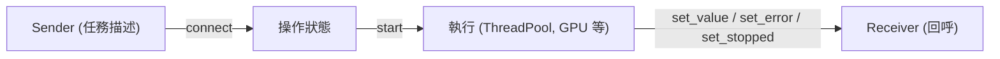

# 前言：C++26 帶來的次世代程式設計典範

在 2026 年，C++ 歷史上極具重要意義的里程碑——**C++26** 正式標準化了。自 C++11 誕生「Modern C++」的概念以來，C++ 經歷了 C++14、C++17、C++20、C++23 的穩步進化，而 C++26 無論在語言功能還是標準函式庫方面，都帶來了足以顛覆過往超編程、錯誤處理與並行處理常識的強大典範轉移。

本文將針對 C++26 所引入的主要新功能，從技術細節、編譯時的效能提升、與 C++23 以前程式碼的比較，到實務上的用法進行徹底解說。這是一篇超過一萬字的豐富文章，廣泛涵蓋了反射（Reflection）、契約編程（Contracts）、模式匹配（Pattern Matching）、參數包索引（Pack Indexing）、結構化綁定（Structured Bindings）的擴充，以及以 Senders/Receivers 為首的標準函式庫進化。

首先，讓我們先透過視覺化圖表來確認 C++ 標準化的歷史與 C++26 的定位。



C++26 的目標是在 C++20 所引入的 Concepts 與 Modules 等大規模功能群之上，將**程式碼的自我描述性（反射）**與**穩健性（契約編程）**提升至極限。接下來，我們將深入探討各項功能的細節。

---

# 1. 反射 (Static Reflection)：超編程的真正革命

說**靜態反射（Static Reflection）**是 C++26 最受矚目的功能也毫不為過（主要基於 P2996 等提案）。過去在 C++ 中，若要從程式內部取得型別結構或成員變數的資訊，必須大量依賴複雜的樣板超編程（TMP）或巨集。然而，透過 C++26 的反射機制，我們現在可以在編譯時期安全且直觀地存取程式本身的結構（AST：抽象語法樹資訊）。

## 1.1 傳統 C++23 以前的課題

思考一下在 C++23 以前，如果想將某個結構的所有成員變數序列化為 JSON 格式的情況。由於標準的語言功能中不存在列舉結構成員的方法，我們必須使用如 Boost.Describe 或 Boost.Pfr 這樣的第三方函式庫，或是定義專用的巨集來註冊成員。

這導致了編譯時間的增加以及錯誤訊息變得難以理解。從數學的角度來看，傳統使用遞迴樣板實例化進行型別資訊解析的方法，對於 $N$ 個元素在編譯時的計算複雜度為 $O(N)$，而在複雜的元函式（Metafunction）中，最糟的情況下甚至需要 $O(N^2)$ 的實例化。

$$
T_{\text{compile}}(N) \approx O(N^2) \quad \text{(Recursive Template Metaprogramming)}
$$

## 1.2 C++26 的反射語法與方法

C++26 的反射使用了 `^` 運算子（反射運算子）與 `[: ... :]` 語法（Splicer）。透過 `^T` 來取得型別或變數的「中介資訊（Meta-information）」，該資訊會被當作編譯時期的常數，也就是 `std::meta::info` 型別的物件來處理。

```cpp
#include <iostream>
#include <string>
#include <meta>

struct User {
    int id;
    std::string name;
    std::string email;
};

// 使用 C++26 靜態反射的泛型序列化器
template <typename T>
void print_json(const T& obj) {
    constexpr auto type_info = ^T;
    
    std::cout << "{\n";
    // 取得結構的成員資訊並進行迭代
    template for (constexpr auto member : std::meta::nonstatic_data_members_of(type_info)) {
        // 使用 [: member :] 展開回原始符號，並將識別字（名稱）作為字串取得
        std::cout << "  \"" << std::meta::identifier_of(member) << "\": " 
                  << obj.[:member:] << ",\n";
    }
    std::cout << "}\n";
}

int main() {
    User u{1, "Alice", "alice@example.com"};
    print_json(u);
    return 0;
}
```

在這段程式碼中，使用了 `template for`（編譯時迴圈展開）來列舉 `User` 結構的所有成員。

## 1.3 效能與編譯時期的複雜度

這項新功能帶來最大的好處就是**縮短編譯時間**。由於在編譯器內部直接操作中介資訊，對元素的存取與迭代能以 $O(1)$ 的額外開銷處理。因為它會立即被評估為常數表達式，編譯時間的複雜度得到了戲劇性的改善。

$$
T_{\text{compile\_new}}(N) = O(N) \quad \text{(Direct AST Traversal)}
$$

從此我們將遠離樣板巢狀所導致的編譯器記憶體耗盡，以及冗長難懂的錯誤訊息（樣板錯誤之海）。

```mermaid
graph TD
    A["型別：User"] -->| "^User" | B["std::meta::info"]
    B -->| "nonstatic_data_members_of" | C["meta::info 的範圍"]
    C -->| "[: member :]" | D["直接存取成員 (obj.id, obj.name)"]
    D --> E["生成的程式碼 (零額外開銷)"]
```

---

# 2. 契約編程 (Contracts)：穩健的軟體設計

自從 C++20 錯失引入的機會以來，經過長期討論的 **Contracts（契約編程）** 終於在 C++26 中被導入（如 P2900 等提案）。它將「Design by Contract（依約設計）」的典範內建於語言中支援，讓我們能夠以宣告式的方式來撰寫函式的前置條件（Pre-condition）、後置條件（Post-condition）以及斷言（Assertion）。

## 2.1 Contracts 的基本語法

在 C++26 中，我們為函式宣告賦予契約屬性。

*   `pre` : 函式被呼叫前應滿足的條件
*   `post` : 函式結束並回傳值時應滿足的條件
*   `assert` : 函式內部特定執行點應滿足的條件

```cpp
#include <vector>
#include <numeric>

// 透過契約編程進行安全的平均值計算
// 前置條件: 傳入的 vector 不能為空
// 後置條件: 計算出的平均值，必須大於等於 vector 的最小值且小於等於最大值
double calculate_average(const std::vector<double>& v)
    pre (!v.empty())
    post (r : r >= *std::min_element(v.begin(), v.end()) && 
              r <= *std::max_element(v.begin(), v.end()))
{
    double sum = std::accumulate(v.begin(), v.end(), 0.0);
    double avg = sum / v.size();
    
    // 處理過程中的斷言
    assert(avg == avg); // 檢查 NaN 等
    
    return avg; // 會被綁定到後置條件的 'r'
}
```

## 2.2 契約違反的處理與執行時期評估

Contracts 並不僅僅是註解或舊有的 `assert()` 巨集。我們可以根據建置模式（開發建置、正式建置等），指示編譯器**違反時的行為**。例如，可以靈活地配置在開發階段遇到違反時立即崩潰（Abort），而在正式環境中則呼叫自訂的違反處理常式來記錄日誌並繼續執行。



透過利用 Contracts，不僅能讓 API 的規格自我文件化，還能在引發未定義行為（Undefined Behavior, UB）之前安全地停止並控制程式，因此可望大幅減少 C++ 特有的記憶體破壞漏洞與邏輯錯誤。

---

# 3. 模式匹配 (Pattern Matching)：分支的淬鍊

自從 C++17 引入 `std::variant` 與 `std::any` 以來，對於持有各種型別變數的派發一直都使用 `std::visit`。然而，`std::visit` 與多載模式的組合（即所謂的 `overloaded` 結構體技巧）非常冗長且可讀性低。

在 C++26 中，**模式匹配（Pattern Matching）**被作為語言功能內建了（依據 P2688）。這使得類似函數式語言（如 Rust 或 Haskell）那種直觀的匹配成為可能。

## 3.1 C++23 以前使用 `std::visit` 的困擾

```cpp
// C++23 以前的寫法
template<class... Ts> struct overloaded : Ts... { using Ts::operator()...; };
template<class... Ts> overloaded(Ts...) -> overloaded<Ts...>;

std::variant<int, std::string, double> v = "Hello";

std::visit(overloaded {
    [](int i) { std::cout << "Int: " << i << '\n'; },
    [](const std::string& s) { std::cout << "String: " << s << '\n'; },
    [](double d) { std::cout << "Double: " << d << '\n'; }
}, v);
```

## 3.2 C++26 使用 `inspect` 語法帶來的戲劇性改善

透過使用新的 `inspect` 關鍵字，我們可以寫出如下非常簡潔的程式碼。

```cpp
// C++26 的模式匹配
std::variant<int, std::string, double> v = "Hello";

inspect (v) {
    int i => std::cout << "Int: " << i << '\n';
    std::string s => std::cout << "String: " << s << '\n';
    double d => std::cout << "Double: " << d << '\n';
    _ => std::cout << "Unknown type\n"; // 萬用字元
};
```

這種模式匹配不僅僅限於型別的派發，還支援**結構的解構（Destructuring）**與**守衛條件（Guard condition）**（僅在滿足特定條件時匹配）。

```cpp
struct Point { int x, y; };
std::variant<Point, int> var = Point{10, 20};

inspect (var) {
    // 綁定結構成員的同時，加上守衛條件 (if)
    [x, y] as Point if (x == y) => { std::cout << "Diagonal: " << x << '\n'; }
    [x, y] as Point => { std::cout << "Point: " << x << ", " << y << '\n'; }
    int i => { std::cout << "Scalar: " << i << '\n'; }
};
```

編譯器會對此 `inspect` 語句進行網羅性檢查（Exhaustiveness checking），因此在處理列舉型別（enum）或 `std::variant` 時，若有遺漏的情況就會回報編譯錯誤。這對提升程式碼的維護性來說極為重要。

---

# 4. 參數包索引 (Pack Indexing)：可變參數樣板的救贖

C++11 之後的可變參數樣板（Variadic Templates）非常強大，但要從參數包（Parameter pack）中取出第 $N$ 個型別或值，其操作並不直觀。過去只能透過 `std::tuple_element` 或遞迴樣板等方式來取得。

C++26 引入了 **Pack Indexing** 功能（P2662），讓我們能像陣列的索引存取一樣，更自然地進行撰寫。

## 4.1 Pack Indexing 的基礎

語法非常簡單，只要寫成如 `Types...[I]` 的形式即可。

```cpp
#include <iostream>
#include <type_traits>

// 取得第 N 個型別的函式
template <std::size_t N, typename... Types>
constexpr auto get_nth_type() {
    // 透過 Types...[N] 直接存取第 N 個型別
    return Types...[N]{};
}

// 取得可變參數中第 N 個值的函式
template <std::size_t N, typename... Args>
constexpr decltype(auto) get_nth_value(Args&&... args) {
    // 對參數包 args 也可以進行索引存取
    return std::forward<Args...[N]>(args...[N]);
}

int main() {
    // 存取型別
    using SecondType = decltype(get_nth_type<1, int, double, char>());
    static_assert(std::is_same_v<SecondType, double>);

    // 存取值
    auto val = get_nth_value<2>(10, 3.14, "Hello C++26", 'c');
    std::cout << val << std::endl; // 將輸出 "Hello C++26"
}
```

編譯器現在能夠以常數時間 $O(1)$ 來處理參數包索引，大幅減少了過去因元函式層層嵌套所導致的冗長編譯時間。

---

# 5. 結構化綁定 (Structured Bindings) 的擴充

C++17 引入的結構化綁定，在接收函式的多個回傳值時非常方便。然而，若只想使用其中部分變數，而打算忽略其他變數時，必須定義虛擬變數（Dummy variables），為了避免出現「未使用變數（unused variable）」的警告，總是要費一番功夫。

在 C++26 中，正式允許使用 `_`（底線）作為佔位符。

```cpp
#include <map>
#include <string>
#include <iostream>

std::map<int, std::string> get_data() {
    return {{1, "One"}, {2, "Two"}, {3, "Three"}};
}

int main() {
    auto data = get_data();
    
    for (const auto& [id, _] : data) {
        // 忽略值（字串），只使用鍵（ID）
        std::cout << "ID: " << id << '\n';
    }
}
```

這個小小的擴充，讓程式碼的意圖變得更加明確，也能防止為了抑制無謂警告而濫用 `#pragma` 或 `[[maybe_unused]]` 屬性的情況。

---

# 6. 標準函式庫的進化：並行處理與非同步的重新定義

除了語言功能，C++26 的標準函式庫（STL）也取得了戲劇性的進化。特別是在非同步處理與記憶體管理的領域，為了滿足企業級與系統程式設計的需求，導入了許多進階的元件。

## 6.1 Senders / Receivers (std::execution)

將 C++ 的非同步處理模型從根本上重新打造的標準化提案（P2300）終於在 C++26 開花結果。為了解決 `std::async` 與 `std::future` 所面臨的效能問題（過度的記憶體配置與排程的低效率），引入了 **Senders/Receivers** 模型。



Senders 是一種描述「該做什麼」的輕量級藍圖，並且與執行環境（Scheduler）分離。這使得我們可以透過統一的介面，高效率地描述 CPU ThreadPool 或卸載至 GPU 的任務。

```cpp
#include <execution>
#include <iostream>
#include <syncstream>

using namespace std::execution;

int main() {
    auto scheduler = get_system_thread_pool().scheduler();

    // 任務的管線（在此時間點尚未執行：延遲評估）
    auto task = schedule(scheduler)
              | then([] { return 42; })
              | then([](int val) { return val * 2; })
              | upon_error([](std::exception_ptr e) { return 0; });

    // 使用 sync_wait 同步等待結果
    auto [result] = sync_wait(task).value();
    
    std::osyncstream(std::cout) << "Result: " << result << std::endl;
}
```

## 6.2 Hazard Pointers 與 RCU (Read-Copy Update)

作為支援無鎖（Lock-free）資料結構實作的標準功能，**Hazard Pointers** (`std::hazard_pointer`) 與 **RCU** (`std::rcu`) 已經標準化。這大幅降低了在 C++ 中實作高效能並行資料結構的門檻。

RCU 特別在讀取（Read）佔絕大多數的工作負載中，能排除快取行（Cache line）的競爭，實現線性的可擴展性（Scalability）。若用數學來表達，對於執行緒數量 $T$，讀取吞吐量呈現出理想的 $O(T)$ 增長。

$$
\text{Throughput}_{\text{RCU}} \propto T \quad \text{(Read-heavy Workloads)}
$$

---

# 7. 實務移轉指南與導入的優勢

儘管轉移到 C++26 需要如同 C++11 當時般大規模的典範轉移，但它在大幅改善程式碼庫的安全性與編譯時間上有著顯著的優勢。

1.  **超編程的革新**: 由複雜的 `template` 與 `constexpr if` 巢狀構成的序列化器或 ORM（Object-Relational Mapping）框架，若使用 C++26 的反射來重寫，不僅維護性會飛躍性地提升，編譯時間也有可能縮短為原本的數十分之一。
2.  **基於 Contracts 的 API 設計**: 類別函式庫的設計者，不應再依賴如 Doxygen 這樣的文件註解，而應該使用 Contracts（`pre` / `post`）在語言層級明訂規格。這樣一來，就能及早發現使用端的不當呼叫。
3.  **非同步處理的現代化**: 將依賴於自訂實作或 Boost.Asio 的非同步處理轉移至 `std::execution` (Senders/Receivers)，就能建構出跨越平台與硬體的標準化並行處理基底。

## 移轉時的注意事項：ABI 穩定性與編譯器的支援

新的語言功能，特別是 Contracts 等可能會影響函式的特徵標記（Signature）或 ABI（Application Binary Interface）。因此，如果需要跨越共享函式庫（DLL / .so）的邊界來使用，必須強烈確認所有模組都是以相同的編譯器及標準函式庫版本（GCC, Clang, MSVC）編譯的。

---

# 總結

C++26 是一次真正具歷史意義的版本更新，長年來 C++ 程式設計師所引頸期盼的「夢幻功能」一口氣全數被引入。

*   **反射**消除了超編程的艱澀難懂，實現了 $O(1)$ 的 AST 存取。
*   **契約編程**能明確地標示函式的前置、後置條件，使得建構穩健的程式成為可能。
*   **模式匹配**讓複雜的分支與狀態轉移得以直觀且安全地撰寫。
*   **Senders/Receivers** 與 **RCU / Hazard Pointers** 則將能發揮極限效能的並行處理給標準化了。

透過適切地運用這些功能，我們將能在更高的層次上，並以令人驚豔的簡潔程式碼，實現 C++ 最大的強項：「零額外開銷抽象化（Zero-overhead Abstraction）」。

未來，建議大家密切關注各家編譯器廠商對 C++26 功能的實作狀況（如 Feature Test Macros 等），並在新的專案或函式庫開發中，積極導入這些新的典範。C++ 絕非一門過時的語言，它將貪婪地吸收最前端的語言理論，在未來持續君臨系統程式設計的頂點。

---
*本文是基於 2026 年當時的 C++26 標準化狀況所撰寫。請注意，根據各編譯器的實作狀況，部分語法仍有變更的可能。*
