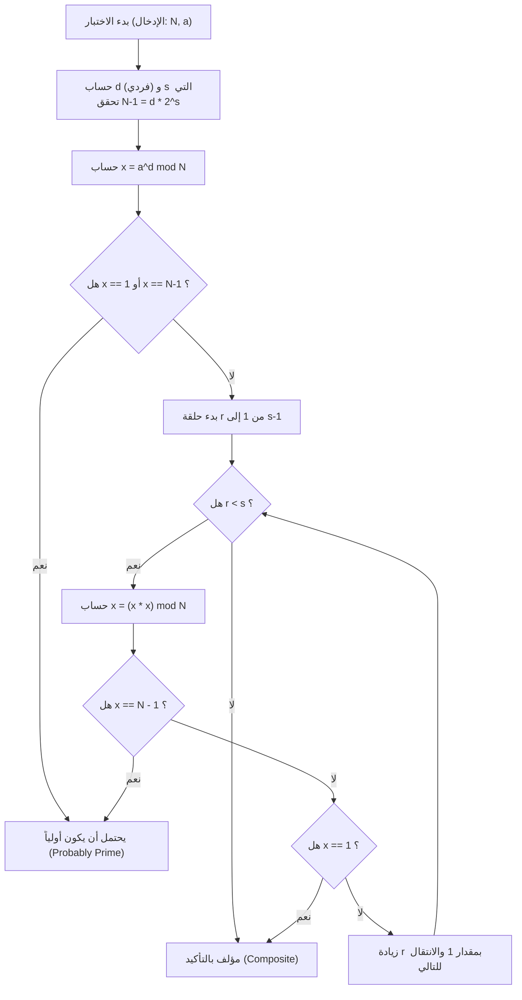
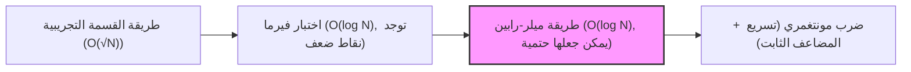

# مقدمة: لماذا نحتاج إلى خوارزمية سريعة لاختبار الأولية؟

في عالم علوم الحاسوب، ونظرية التشفير، أو البرمجة التنافسية، يعتبر التحديد السريع والدقيق لـ "ما إذا كان عدد ما أولياً أم لا" تحدياً أساسياً وهاماً جداً. على سبيل المثال، يعتمد أمان أنظمة تشفير المفتاح العام مثل تشفير RSA - والذي يمثل الأساس الأمني لمجتمع الإنترنت الحديث - على توليد أعداد أولية ضخمة وصعوبة ضربها (صعوبة تحليل العوامل الأولية). لذلك، ليس من المبالغة القول إن تقنية التمييز الفوري لما إذا كان عدد ضخم أولياً أم لا هي تقنية تدعم أساس المجتمع الرقمي.

بالإضافة إلى ذلك، في البرمجة التنافسية (مثل AtCoder و Codeforces)، يعتبر اختبار الأولية موضوعاً متكرراً. بالنسبة للمدخلات الضخمة التي قد تصل إلى $N \le 10^{18}$، في الحالات التي يتم فيها إجراء اختبارات الأولية عشرات الآلاف من المرات في غضون ثانية واحدة، لا يمكن للخوارزميات التقليدية البسيطة أن تلبي متطلبات وقت الحساب وتتسبب في (Time Limit Exceeded: TLE).

في هذا المقال، سنبدأ بخوارزمية اختبار الأولية البسيطة، ثم "اختبار فيرما" وهو اختبار احتمالي، وصولاً إلى الخوارزمية الأسرع والأكثر عملية "طريقة ميلر-رابين لاختبار الأولية (Miller-Rabin Primality Test)" التي تغلبت على نقاط الضعف في الخوارزميات السابقة. سنشرح ذلك بالتفصيل من الخلفية الرياضية إلى التنفيذ عالي التحسين بلغة C++. بشكل خاص، بالنسبة للأعداد الصحيحة بحجم 64 بت ($N < 2^{64}$)، سنشرح بالتفصيل طريقة "تحديد الأولية بنسبة 100% (الاختبار الحتمي)" بدلاً من مجرد التحديد الاحتمالي، وسنوفر كود مصدري بلغة C++ جاهز للاستخدام العملي.

---

# 1. أساسيات اختبار الأولية وطريقة القسمة التجريبية (Trial Division)

العدد الأولي (Prime number) هو عدد طبيعي أكبر من أو يساوي 2، وليس له أي قواسم موجبة سوى 1 والعدد نفسه. باتباع تعريف العدد الأولي بدقة، لتحديد ما إذا كان العدد الصحيح $N$ أولياً، يمكننا محاولة قسمة $N$ على جميع الأعداد الصحيحة من $2$ إلى $N-1$. إذا لم يقبل القسمة على أي منها فهو عدد أولي، وإذا قَبِل القسمة ولو لمرة واحدة فهو عدد مؤلف (ليس أولياً).

ولكن، تعقيد الوقت لهذه الطريقة هو $O(N)$، وإذا كان $N$ عدداً ضخماً مثل $10^{18}$، فسيستغرق الأمر وقتاً هائلاً لحسابه حتى مع أجهزة الكمبيوتر الحديثة.

## تحسين طريقة القسمة التجريبية: البحث حتى $\sqrt{N}$

عندما يتم التعبير عن العدد المؤلف $N$ كـ $a \times b = N$ (حيث $a \le b$)، فمن المؤكد أن $a \le \sqrt{N}$. لذلك، لا توجد حاجة لتكرار حلقة اختبار الأولية حتى $N-1$، ويكفي التحقق حتى $\sqrt{N}$.

```cpp
#include <iostream>

// اختبار الأولية باستخدام طريقة القسمة التجريبية (O(sqrt(N)))
bool is_prime_trial_division(long long n) {
    if (n <= 1) return false;
    if (n == 2 || n == 3) return true;
    if (n % 2 == 0) return false;
    
    // فحص الأعداد الفردية فقط من 3 فصاعداً
    for (long long i = 3; i * i <= n; i += 2) {
        if (n % i == 0) return false;
    }
    return true;
}
```

التعقيد الزمني لهذه الخوارزمية هو $O(\sqrt{N})$. إذا كان $N \le 10^{12}$ تقريباً، فيمكن حسابه في لحظة، ولكن في حالة $N \approx 10^{18}$، يصبح عدد التكرارات حوالي $10^9$ مرة، وحتى مع مترجمات C++، سيستغرق ذلك من مئات الميلي ثانية إلى عدة ثوانٍ، مما يجعله غير مناسب للاختبارات المتعددة.

---

# 2. اختبار فيرما: بداية اختبارات الأولية الاحتمالية

لتجاوز حدود طريقة القسمة التجريبية، تم ابتكار "الخوارزميات الاحتمالية (Probabilistic Algorithm)" باستخدام نظريات من نظرية الأعداد. والمثال النموذجي لذلك هو "اختبار فيرما للأولية (Fermat Primality Test)" الذي يستخدم مبرهنة فيرما الصغرى.

## مبرهنة فيرما الصغرى (Fermat's Little Theorem)

اكتشف بيير دي فيرما (Pierre de Fermat) هذه النظرية، والتي تنص على ما يلي:

> لأي عدد أولي $p$، ولأي عدد صحيح $a$ أولي نسبياً مع $p$ (أي ليس من مضاعفات $p$)، تتحقق معادلة التطابق التالية:
> $$ a^{p-1} \equiv 1 \pmod p $$

إذا أخذنا المعاكس الإيجابي لهذه النظرية، فيمكننا القول: "بالنسبة لعدد صحيح $N$، وعدد صحيح $a$ أولي نسبياً مع $N$، إذا كان $a^{N-1} \not\equiv 1 \pmod N$، فمن المؤكد أن $N$ عدد مؤلف". باستخدام هذه الخاصية، يتم اختيار أساس (base) عشوائي $a$ للعدد المراد اختباره $N$، وحساب $a^{N-1} \pmod N$ للتحقق مما إذا كان يساوي $1$. هذا هو اختبار فيرما.

## الأسس النمطية السريعة (التربيع المتكرر)

لإجراء اختبار فيرما، يجب حساب الأس الضخم $a^{N-1} \pmod N$ بسرعة. لهذا، نستخدم "التربيع المتكرر (Modular Exponentiation / Binary Exponentiation)". التعقيد الزمني هو $O(\log N)$، وهو سريع جداً.

```cpp
// حساب a^b mod m باستخدام التربيع المتكرر
long long mod_pow(long long a, long long b, long long m) {
    long long res = 1;
    a %= m;
    while (b > 0) {
        if (b & 1) res = (__int128_t)res * a % m;
        a = (__int128_t)a * a % m;
        b >>= 1;
    }
    return res;
}
```
※ هنا، لمنع حدوث فيضان الأعداد (Overflow)، نستخدم امتداد GCC/Clang المسمى `__int128_t` (عدد صحيح بحجم 128 بت) للاحتفاظ بالضرب الوسيط.

## الأعداد شبه الأولية وأعداد كارمايكل (Carmichael Numbers)

على الرغم من أن اختبار فيرما قوي للغاية، إلا أن لديه نقطة ضعف قاتلة. وهي وجود أعداد $N$ مؤلفة، ولكنها تحقق $a^{N-1} \equiv 1 \pmod N$ لجميع قيم $a$ (الأولية نسبياً مع $N$).

تسمى هذه الأعداد بـ "الأعداد شبه الأولية المطلقة" أو "أعداد كارمايكل". أصغر عدد كارمايكل هو $561 = 3 \times 11 \times 17$.
نظراً لوجود أعداد كارمايكل، لا يمكن إجراء اختبار حتمي بـ "احتمال 100%" باستخدام اختبار فيرما وحده. بغض النظر عن قيم $a$ المختلفة التي نختبرها، فإن عدداً مثل $561$ سيتظاهر دائماً بأنه عدد أولي (يخدعنا).

---

# 3. طريقة ميلر-رابين لاختبار الأولية (Miller-Rabin Primality Test)

لقد تغلب كل من غاري ميلر (Gary L. Miller) ومايكل رابين (Michael O. Rabin) ببراعة على نقطة ضعف اختبار فيرما (وجود أعداد كارمايكل) من خلال ابتكار "طريقة ميلر-رابين لاختبار الأولية".
حالياً، كخوارزمية عملية وسريعة لاختبار الأولية، تُستخدم على نطاق واسع في المكتبات الداخلية لمختلف لغات البرمجة وتوليد المفاتيح في أنظمة التشفير.

## المبادئ الرياضية

بالإضافة إلى مبرهنة فيرما الصغرى، تستخدم خوارزمية ميلر-رابين الخاصية القائلة بأنه "في حقل البواقي للعدد الأولي ($\mathbb{Z}/p\mathbb{Z}$)، تقتصر حلول $x^2 \equiv 1 \pmod p$ على $x \equiv 1$ أو $x \equiv -1$" (في حالة كان المعامل عدداً مؤلفاً، قد توجد جذور تربيعية غير بديهية أخرى).

العدد الفردي $N$ المراد اختباره مطروحاً منه $1$، أي $N-1$، سيكون بالتأكيد عدداً زوجياً. لذلك، نقوم بقسمة $N-1$ على $2$ قدر الإمكان، ونعبر عنه بالشكل التالي:
$$ N-1 = d \cdot 2^s $$
(حيث $d$ عدد فردي، و $s \ge 1$)

بالنسبة لأي أساس $a$ ($1 < a < N-1$)، نتحقق مما إذا كان $a^{N-1} \equiv 1 \pmod N$ وفقاً لمبرهنة فيرما الصغرى، ولكننا نقوم بهذا الحساب تدريجياً.
على وجه التحديد، نقوم بتكرار التربيع بالترتيب التالي: $a^d, a^{d \cdot 2}, a^{d \cdot 4}, \ldots, a^{d \cdot 2^s}$.

لكي تقرر طريقة ميلر-رابين أن $N$ "عدد أولي (أو عدد أولي باحتمال كبير)"، يجب أن يتحقق **أي** من الشروط التالية:

1. $a^d \equiv 1 \pmod N$
2. يوجد $r$ ($0 \le r < s$) بحيث يتحقق $a^{d \cdot 2^r} \equiv -1 \pmod N$.
   ※ في عملية المعامل (Modulo) بلغة C++، يصبح $-1 \pmod N$ مساوياً لـ $N-1$.

إذا كان $N$ عدداً أولياً، فإن هذا الشرط سيتحقق بالتأكيد لأي $a$. على العكس، إذا كان $N$ عدداً مؤلفاً، فقد تم إثبات رياضياً أن احتمال تحقق هذا الشرط (احتمال الانخداع) عند اختيار $a$ عشوائياً هو أقل من أو يساوي $\frac{1}{4}$.
إذا قمنا بإجراء $k$ اختبارات مستقلة، فإن احتمال الخطأ في التحديد يصبح أقل من أو يساوي $\left(\frac{1}{4}\right)^k$، ويمكن اعتباره عملياً صفراً. لا توجد أعداد "يمكنها الخداع تماماً" مثل أعداد كارمايكل.

## سير خوارزمية ميلر-رابين (مخطط Mermaid)

يوضح الشكل التالي التدفق المنطقي لاختبار واحد في طريقة ميلر-رابين (اختبار لأساس واحد $a$).



---

# 4. الاختبار الحتمي للأعداد الصحيحة بحجم 64 بت

على الرغم من أن طريقة ميلر-رابين هي أساساً خوارزمية "احتمالية"، إلا أنه عندما يكون الحد الأقصى لـ $N$ ثابتاً، يمكننا إجراء اختبار أولية "مؤكد بنسبة 100%" من خلال تجربة مجموعة محددة من قيم $a$ (الأساس).
يسمى هذا **اختبار ميلر-رابين الحتمي (Deterministic Miller-Rabin Test)**.

من خلال بحث Jim Sinclair وآخرين، تبين أنه بالنسبة لجميع الأعداد الصحيحة $N < 2^{64}$ (حوالي $1.8 \times 10^{19}$)، يكفي اختيار الأعداد الأولية السبعة التالية كأساس $a$ واختبارها للحصول على تقييم حتمي وكامل بما فيه الكفاية.

**قائمة الأساس $a$ المراد اختبارها:**
`{2, 325, 9375, 28178, 450775, 9780504, 1795265022}`

أو، كمجموعة أخرى معروفة، يمكن التحديد بشكل مثالي لـ $N < 2^{64}$ باستخدام الأعداد الأولية الـ $12$ التالية:
`{2, 3, 5, 7, 11, 13, 17, 19, 23, 29, 31, 37}`

هذه المرة، من أجل تعزيز بساطة الخوارزمية وموثوقيتها، سنعتمد طريقة تستخدم الأعداد الأولية الـ $12$ الأخيرة كقاعدة (أو القواعد السبعة المحسنة). في تنفيذ C++، نقوم بتحسين يقلل من عدد الاختبارات إلى الحد الأدنى عن طريق تقسيم النطاقات باستخدام التفرع الشرطي.

---

# 5. تنفيذ متقدم بلغة C++ (Highly Optimized C++ Implementation)

الآن، سنقوم بتجميع النظرية الرياضية وتصميم الخوارزمية التي تناولناها حتى الآن، وسنقدم الكود المصدري لتنفيذ دالة اختبار ميلر-رابين للأولية بأعلى مستوى في لغة C++ الحديثة.

## نقاط التنفيذ
1. **تجنب فيضان الضرب للأعداد الصحيحة 64 بت:**
   في حالة $N \approx 10^{18}$، يمكن أن يصل الحد الأقصى لـ $x \times x$ في الضرب النمطي إلى $10^{36}$، مما يتجاوز بسهولة الحد الأقصى للأنواع الصحيحة ذات 64 بت (`uint64_t` أو `long long`) وهو $1.8 \times 10^{19}$.
   لحل هذه المشكلة، نستخدم النوع الممتد لـ GCC و Clang وهو `__int128_t` (أو `unsigned __int128`)، ونحسب المعامل (Modulo) بعد الحساب بدقة 128 بت. هذا يسمح بالضرب النمطي السريع دون استخدام خوارزميات معقدة.

2. **اختيار الأساس الحتمي:**
   عندما تكون قيمة $N$ صغيرة، نقوم بالتحسين بحيث لا نحتاج إلا لاختبار عدد قليل من الأسس (bases).

## كود C++ المصدري الكامل

فيما يلي نعرض الكود المصدري للنسخة النهائية الجاهزة للاستخدام العملي. يمكن نسخ هذا الكود واستخدامه كما هو في بيئات البرمجة التنافسية وغيرها.

```cpp
#include <iostream>
#include <vector>
#include <cstdint>
#include <initializer_list>

using namespace std;

// (a * b) mod m السريع باستخدام أعداد صحيحة 128 بت
inline uint64_t mod_mul(uint64_t a, uint64_t b, uint64_t m) {
    return (uint64_t)((unsigned __int128)a * b % m);
}

// حساب (base^exp) mod m باستخدام التربيع المتكرر
uint64_t mod_pow(uint64_t base, uint64_t exp, uint64_t m) {
    uint64_t res = 1;
    base %= m;
    while (exp > 0) {
        if (exp & 1) res = mod_mul(res, base, m);
        base = mod_mul(base, base, m);
        exp >>= 1;
    }
    return res;
}

// الاختبار الحتمي للأعداد الصحيحة 64-بت باستخدام طريقة ميلر-رابين
bool is_prime_miller_rabin(uint64_t n) {
    // التحقق المسبق من القيم الحدية والأعداد الأولية الصغيرة
    if (n < 2) return false;
    if (n == 2 || n == 3 || n == 5 || n == 7) return true;
    if (n % 2 == 0 || n % 3 == 0 || n % 5 == 0 || n % 7 == 0) return false;

    // تحليل إلى الشكل n-1 = d * 2^s
    uint64_t d = n - 1;
    int s = 0;
    while ((d & 1) == 0) {
        d >>= 1;
        s++;
    }

    // قائمة الأسس (bases) المستخدمة في الاختبار
    // تحسين يقلل من عدد الأسس المختبرة بناءً على حجم N
    vector<uint64_t> bases;
    if (n < 4759123141ULL) {
        bases = {2, 7, 61};
    } else if (n < 1122004669633ULL) {
        bases = {2, 13, 23, 1662803};
    } else {
        // 7 أسس حتمية لجميع الأعداد N < 2^64
        bases = {2, 325, 9375, 28178, 450775, 9780504, 1795265022};
    }

    // تنفيذ الاختبار لكل أساس
    for (uint64_t a : bases) {
        a %= n;
        if (a == 0) continue; // إذا كان a من مضاعفات n فلا يمكن التحديد ولكنه ليس أولياً

        uint64_t x = mod_pow(a, d, n);
        if (x == 1 || x == n - 1) continue; // اجتياز الشرط الأول، الانتقال للأساس التالي

        bool composite = true;
        // حلقة التكرار s-1 مرة (x = x^2 mod n)
        for (int r = 1; r < s; r++) {
            x = mod_mul(x, x, n);
            if (x == n - 1) {
                composite = false; // اجتياز الشرط الثاني، يحتمل أن يكون أولياً
                break;
            }
        }
        
        // إذا لم يستوفِ أي شرط، فهو بالتأكيد عدد مؤلف
        if (composite) return false;
    }

    // إذا اجتاز الشروط لجميع الأسس، فهو أولي بالتأكيد
    return true;
}

int main() {
    // أمثلة للاختبار
    vector<uint64_t> test_cases = {
        1000000007,           // عدد أولي مشهور
        998244353,            // عدد أولي مشهور
        1000000000000000003,  // عدد أولي بالقرب من 10^18
        1000000000000000007,  // عدد مؤلف (10^18 + 7)
        561,                  // عدد كارمايكل (مؤلف)
        18446744073709551557ULL // أحد أكبر الأعداد الأولية بالقرب من 2^64
    };

    for (uint64_t n : test_cases) {
        cout << n << " is " 
             << (is_prime_miller_rabin(n) ? "Prime" : "Composite") 
             << endl;
    }

    return 0;
}
```

---

# 6. تقييم أداء وتعقيد الخوارزمية

سنقوم بدراسة أداء الخوارزمية التي تم تنفيذها.

## التعقيد الزمني (Time Complexity)
* **طريقة القسمة التجريبية:** $O(\sqrt{N})$
* **اختبار فيرما:** حساب الأس $O(\log N) \times k$ ($k$ هو عدد المحاولات)
* **طريقة ميلر-رابين:** حساب الأس والتكرار $O(\log N) \times k$

في بيئة 64 بت ($N \le 2^{64}$)، تتحقق طريقة ميلر-رابين الحتمية المذكورة أعلاه من $7$ أسس كحد أقصى. لذلك، يمكن اعتبار $k \le 7$ كثابت، ويكون التعقيد الزمني الإجمالي هو $O(\log N)$ بدقة.
حتى في الحالة القصوى ($N \approx 10^{19}$)، لا يتجاوز عدد خطوات التنفيذ $7 \times 64 = 448$ خطوة من العمليات الأساسية، ويكون وقت التنفيذ بضعة ميكروثانية ($10^{-6}$ ثانية) أو أقل. مقارنة بـ $O(\sqrt{N})$ لطريقة القسمة التجريبية (عدد التكرارات $\approx 4 \times 10^9$ مرة)، يتم تحقيق **تسريع بملايين المرات**.

## المزيد من التحسين: ضرب مونتغمري (Montgomery Multiplication)

في تنفيذ هذا المقال، نستخدم النوع الممتد 128 بت `__int128_t` لإجراء القسمة (عملية المعامل `%`). حتى في وحدات المعالجة المركزية الحديثة، تُعتبر قسمة الأعداد الصحيحة (تعليمات DIV) أمرًا مكلفًا يتطلب عشرات الدورات مقارنة بالجمع والضرب.

قد يستخدم صانعو المكتبات والمبرمجون التنافسيون الذين يسعون إلى التحسين الأقصى تقنية تُعرف باسم **ضرب مونتغمري (Montgomery Multiplication)**. ضرب مونتغمري هو خوارزمية مذهلة تستبدل عملية المعامل (القسمة) المكلفة بـ "إزاحة البتات (Bit Shifts) والضرب فقط" عن طريق تعيين الأرقام إلى "مساحة مونتغمري" الخاصة.
بدمج هذا في الضرب النمطي لاختبار ميلر-رابين، يمكن زيادة سرعة التنفيذ بمرتين إلى ثلاث مرات. نظراً لأن هذا موضوع عميق جداً، أود أن أشرحه بالتفصيل في مقال آخر.

---

# 7. الخلاصة

في هذا المقال، قمنا بشرح شامل من أساسيات اختبار الأولية إلى المواضيع المتقدمة.
دعونا نراجع النقاط الرئيسية.

1. **طريقة القسمة التجريبية** موثوقة، ولكن نظرًا لتعقيدها الزمني $O(\sqrt{N})$، تفتقر إلى الفائدة العملية عندما يتجاوز $N$ $10^{12}$.
2. **اختبار فيرما** سريع جدًا بـ $O(\log N)$، لكن له نقطة ضعف قاتلة تتمثل في انخداعه بالأعداد شبه الأولية المطلقة مثل أعداد كارمايكل.
3. **طريقة ميلر-رابين لاختبار الأولية** هي الخوارزمية الأكثر عملية وقوة والتي تقضي على نقاط ضعف اختبار فيرما.
4. في تنفيذ C++، يمكن التعامل بأمان مع فيضان ضرب الأعداد الصحيحة 64 بت من خلال الاستفادة من `__int128_t`.
5. ضمن نطاق الأعداد الصحيحة 64 بت ($N < 2^{64}$)، من خلال اختيار $7$ أو $12$ عدداً أولياً محدداً كأساس، **يمكن اختبار الأولية بشكل حتمي (دقيق 100%)** وليس باحتمال.

يعد اختبار الأولية السريع تقنية لا مفر منها في الحسابات التي تتعامل مع أعداد ضخمة. كود المصدر لطريقة ميلر-رابين بـ C++ المقدم في هذا المقال قوي ويمكن استخدامه عملياً كما هو. يرجى الاستفادة منه في مشاريعك الخاصة أو مسابقات الخوارزميات.



عالم الخوارزميات حيث تتقاطع البرمجة والرياضيات هو عالم جميل وعميق جداً. نأمل أن يكون هذا المقال مفيداً لتعلمك المستقبلي.

---
*Reference:*
- *Pomerance, C., Selfridge, J. L., & Wagstaff, S. S. (1980). The pseudoprimes to 25.10^9. Mathematics of Computation.*
- *Sinclair, J. (2011). Deterministic Miller-Rabin primality testing.*
