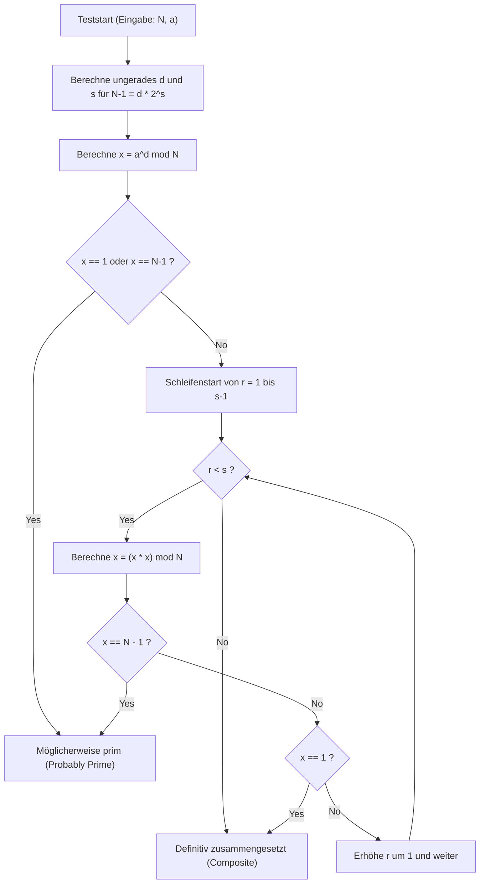
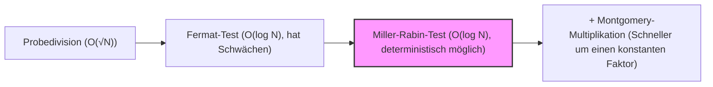

# Einleitung: Warum brauchen wir schnelle Primzahltests?

In der Informatik, der Kryptographie und im Bereich der kompetitiven Programmierung ist die schnelle und genaue Bestimmung, "ob eine gegebene Zahl prim ist", eine sehr wichtige und grundlegende Aufgabe. Zum Beispiel beruht die Sicherheit von Public-Key-Kryptosystemen wie RSA, die die Grundlage der heutigen Internetsicherheit bilden, auf der Erzeugung riesiger Primzahlen und der Schwierigkeit ihrer Multiplikation (bzw. der Schwierigkeit der Primfaktorzerlegung). Daher ist es keine Übertreibung zu sagen, dass die Technologie zur sofortigen Identifizierung riesiger Primzahlen das Rückgrat unserer digitalen Gesellschaft bildet.

Auch beim kompetitiven Programmieren (wie AtCoder oder Codeforces) sind Primzahltests ein häufiges Thema. Wenn für riesige Eingaben mit Beschränkungen wie $N \le 10^{18}$ Zehntausende von Primzahltests in weniger als 1 Sekunde durchgeführt werden müssen, werden traditionelle, naive Algorithmen das Zeitlimit (Time Limit Exceeded: TLE) niemals einhalten.

In diesem Artikel werden wir von naiven Primzahltests über den "Fermat-Test", einen probabilistischen Algorithmus, bis hin zum "Miller-Rabin-Primzahltest", einem Hochgeschwindigkeitsalgorithmus auf praktisch höchstem Niveau, der die Schwächen des Fermat-Tests überwindet, alles ausführlich erklären – vom mathematischen Hintergrund bis hin zu einer hochgradig optimierten Implementierung in C++. Insbesondere für 64-Bit-Ganzzahlen ($N < 2^{64}$) werden wir nicht nur auf probabilistische Tests eingehen, sondern auch "100% sichere Primzahltests (deterministische Tests)" detailliert beschreiben und einen C++-Quellcode bereitstellen, der direkt in der Praxis verwendet werden kann.

---

# 1. Grundlagen der Primzahltests und Probedivision (Trial Division)

Eine Primzahl (Prime number) ist eine natürliche Zahl größer als 1, die außer 1 und sich selbst keine positiven Teiler hat. Folgt man strikt der Definition einer Primzahl, kann man feststellen, ob eine ganze Zahl $N$ eine Primzahl ist, indem man $N$ durch alle ganzen Zahlen von $2$ bis $N-1$ dividiert. Wenn sie durch keine dieser Zahlen teilbar ist, ist sie prim, andernfalls ist sie eine zusammengesetzte Zahl (keine Primzahl).

Diese Methode hat jedoch eine Zeitkomplexität von $O(N)$. Wenn $N$ eine riesige Zahl wie $10^{18}$ ist, würde selbst ein moderner Computer enorm viel Zeit für die Berechnung benötigen.

## Optimierung der Probedivision: Suche bis $\sqrt{N}$

Wenn eine zusammengesetzte Zahl $N$ als $a \times b = N$ (mit $a \le b$) dargestellt wird, gilt immer $a \le \sqrt{N}$. Daher ist es nicht notwendig, die Schleife für den Primzahltest bis $N-1$ laufen zu lassen; es reicht aus, bis $\sqrt{N}$ zu prüfen.

```cpp
#include <iostream>

// Primzahltest durch Probedivision (O(sqrt(N)))
bool is_prime_trial_division(long long n) {
    if (n <= 1) return false;
    if (n == 2 || n == 3) return true;
    if (n % 2 == 0) return false;
    
    // Nur ungerade Zahlen ab 3 prüfen
    for (long long i = 3; i * i <= n; i += 2) {
        if (n % i == 0) return false;
    }
    return true;
}
```

Die Zeitkomplexität dieses Algorithmus beträgt $O(\sqrt{N})$. Für $N \le 10^{12}$ kann die Berechnung im Bruchteil einer Sekunde durchgeführt werden. Bei $N \approx 10^{18}$ beträgt die Anzahl der Schleifendurchläufe jedoch etwa $10^9$, was selbst in C++ Hunderte von Millisekunden bis zu mehreren Sekunden dauert und somit für mehrfache Tests ungeeignet ist.

---

# 2. Fermat-Test: Der Beginn der probabilistischen Primzahltests

Um die Grenzen der Probedivision zu überwinden, wurden "probabilistische Algorithmen (Probabilistic Algorithm)" entwickelt, die zahlentheoretische Theoreme nutzen. Ein typisches Beispiel ist der "Fermat-Primzahltest (Fermat Primality Test)", der den kleinen Fermatschen Satz anwendet.

## Kleiner Fermatscher Satz (Fermat's Little Theorem)

Dieser von Pierre de Fermat entdeckte Satz besagt Folgendes:

> Für jede Primzahl $p$ und jede beliebige ganze Zahl $a$, die teilerfremd zu $p$ ist (kein Vielfaches von $p$), gilt die folgende Kongruenz:
> $$ a^{p-1} \equiv 1 \pmod p $$

Die Kontraposition dieses Satzes besagt: "Wenn für eine ganze Zahl $N$ und eine zu $N$ teilerfremde ganze Zahl $a$ gilt $a^{N-1} \not\equiv 1 \pmod N$, dann ist $N$ definitiv eine zusammengesetzte Zahl." Der Fermat-Test nutzt diese Eigenschaft, indem er für die zu testende Zahl $N$ eine zufällige Basis (base) $a$ wählt und überprüft, ob $a^{N-1} \pmod N$ den Wert $1$ ergibt.

## Schnelle modulare Exponentiation (Binäre Exponentiation)

Um den Fermat-Test durchzuführen, müssen wir die riesige Potenz $a^{N-1} \pmod N$ schnell berechnen. Hierfür wird die "Binäre Exponentiation (Modular Exponentiation / Binary Exponentiation)" verwendet. Die Zeitkomplexität beträgt $O(\log N)$ und ist damit extrem schnell.

```cpp
// Berechnung von a^b mod m mittels binärer Exponentiation
long long mod_pow(long long a, long long b, long long m) {
    long long res = 1;
    a %= m;
    while (b > 0) {
        if (b & 1) res = (__int128_t)res * a % m;
        a = (__int128_t)a * a % m;
        b >>= 1;
    }
    return res;
}
```
* Hier verwenden wir zur Vermeidung von Überläufen `__int128_t` (eine 128-Bit-Ganzzahl), eine Erweiterung von GCC/Clang, um Zwischenprodukte zu speichern.

## Pseudoprimzahlen und Carmichael-Zahlen (Carmichael Numbers)

Der Fermat-Test ist sehr mächtig, hat jedoch eine fatale Schwäche. Es gibt Zahlen $N$, die zusammengesetzt sind, für die aber dennoch $a^{N-1} \equiv 1 \pmod N$ für alle $a$ (die zu $N$ teilerfremd sind) gilt.

Solche Zahlen werden "absolute Pseudoprimzahlen" oder "Carmichael-Zahlen" genannt. Die kleinste Carmichael-Zahl ist $561 = 3 \times 11 \times 17$.
Aufgrund der Existenz von Carmichael-Zahlen kann der Fermat-Test allein keine 100%ige Sicherheit (deterministischer Test) bieten. Egal wie viele verschiedene $a$ man probiert, Zahlen wie $561$ werden immer so tun, als wären sie Primzahlen.

---

# 3. Miller-Rabin-Primzahltest (Miller-Rabin Primality Test)

Die Schwäche des Fermat-Tests (die Existenz von Carmichael-Zahlen) wurde von Gary L. Miller und Michael O. Rabin mit dem "Miller-Rabin-Primzahltest" brillant überwunden.
Heute wird er am häufigsten als praktischer, schneller Primzahltest-Algorithmus in internen Bibliotheken verschiedener Programmiersprachen und bei der Schlüsselgenerierung in Kryptosystemen verwendet.

## Mathematisches Prinzip

Der Miller-Rabin-Algorithmus nutzt zusätzlich zum kleinen Fermatschen Satz die Eigenschaft, dass "in einem Restklassenkörper modulo einer Primzahl ($\mathbb{Z}/p\mathbb{Z}$) die einzigen Lösungen von $x^2 \equiv 1 \pmod p$ die Werte $x \equiv 1$ oder $x \equiv -1$ sind" (bei einer zusammengesetzten Zahl als Modul können auch andere nicht-triviale Quadratwurzeln existieren).

Zieht man $1$ von einer zu testenden ungeraden Zahl $N$ ab, ist $N-1$ immer gerade. Daher teilen wir $N-1$ so oft wie möglich durch $2$ und schreiben es in der folgenden Form:
$$ N-1 = d \cdot 2^s $$
(Wobei $d$ ungerade ist und $s \ge 1$)

Für eine beliebige Basis $a$ ($1 < a < N-1$) prüfen wir gemäß dem kleinen Fermatschen Satz, ob $a^{N-1} \equiv 1 \pmod N$ gilt, führen diese Berechnung jedoch schrittweise durch.
Konkret wiederholen wir die Quadrierung in der Reihenfolge $a^d, a^{d \cdot 2}, a^{d \cdot 4}, \ldots, a^{d \cdot 2^s}$.

Die Bedingung dafür, dass der Miller-Rabin-Test $N$ als "prim (oder mit hoher Wahrscheinlichkeit prim)" einstuft, ist, dass **eine** der folgenden Aussagen wahr ist:

1. $a^d \equiv 1 \pmod N$
2. Es gibt ein $r$ ($0 \le r < s$), für das gilt: $a^{d \cdot 2^r} \equiv -1 \pmod N$.
   * In C++ Modulo-Arithmetik wird $-1 \pmod N$ als $N-1$ dargestellt.

Wenn $N$ eine Primzahl ist, ist diese Bedingung für jedes beliebige $a$ immer erfüllt. Umgekehrt ist mathematisch bewiesen, dass, wenn $N$ eine zusammengesetzte Zahl ist und ein zufälliges $a$ gewählt wird, die Wahrscheinlichkeit, dass diese Bedingung erfüllt ist (die Wahrscheinlichkeit, getäuscht zu werden), höchstens $\frac{1}{4}$ beträgt.
Führt man $k$ unabhängige Tests durch, sinkt die Wahrscheinlichkeit eines falschen Ergebnisses auf höchstens $\left(\frac{1}{4}\right)^k$, was für die Praxis als null betrachtet werden kann. Es gibt keine "absolut täuschenden" Zahlen wie Carmichael-Zahlen mehr.

## Ablauf des Miller-Rabin-Algorithmus (Mermaid-Flussdiagramm)

Das folgende Diagramm zeigt den logischen Ablauf eines einzelnen Miller-Rabin-Primzahltests (für eine Basis $a$).



---

# 4. Deterministischer Test für 64-Bit-Ganzzahlen

Der Miller-Rabin-Primzahltest ist ursprünglich ein "probabilistischer" Algorithmus, aber wenn die Obergrenze von $N$ feststeht, kann man "100% deterministisch" auf eine Primzahl testen, indem man bestimmte Mengen von $a$ (Basen) ausprobiert.
Dies wird als **Deterministischer Miller-Rabin-Test (Deterministic Miller-Rabin Test)** bezeichnet.

Durch Forschungen von Jim Sinclair und anderen wurde herausgefunden, dass für alle ganzen Zahlen $N < 2^{64}$ (ca. $1.8 \times 10^{19}$) ein vollständig deterministischer Test möglich ist, indem man die folgenden $7$ Primzahlen als Basis $a$ wählt und testet.

**Liste der zu testenden Basen $a$:**
`{2, 325, 9375, 28178, 450775, 9780504, 1795265022}`

Alternativ kann man eine andere bekannte Menge von $12$ Primzahlen verwenden, um Zahlen bis $N < 2^{64}$ perfekt zu testen.
`{2, 3, 5, 7, 11, 13, 17, 19, 23, 29, 31, 37}`

Um die Einfachheit und Zuverlässigkeit des Algorithmus zu erhöhen, werden wir diesmal die Methode mit den $12$ Primzahlen (oder die optimierteren $7$ Basen) übernehmen. Bei der C++-Implementierung optimieren wir den Prozess, indem wir die Anzahl der Tests basierend auf Größenbereichen durch Verzweigungen minimieren.

---

# 5. Hochgradig optimierte Implementierung in C++ (Highly Optimized C++ Implementation)

Nun fassen wir die mathematische Theorie und den Entwurf des Algorithmus zusammen und präsentieren den Implementierungscode für eine der stärksten Miller-Rabin-Primzahltest-Funktionen im modernen C++.

## Punkte zur Implementierung
1. **Vermeidung von Überläufen bei der 64-Bit-Ganzzahl-Multiplikation:**
   Wenn $N \approx 10^{18}$, kann $x \times x$ bei der Modulo-Multiplikation bis zu $10^{36}$ erreichen und den Maximalwert einer regulären 64-Bit-Ganzzahl (`uint64_t` oder `long long`) von $1.8 \times 10^{19}$ leicht überlaufen lassen.
   Um dieses Problem zu lösen, verwenden wir `__int128_t` (oder `unsigned __int128`), einen Erweiterungstyp von GCC und Clang, führen die Berechnung mit 128-Bit-Genauigkeit durch und wenden dann Modulo an. So sind schnelle modulare Multiplikationen ohne komplexe Algorithmen möglich.

2. **Auswahl deterministischer Basen:**
   Ist der Wert von $N$ klein, optimieren wir dies, sodass nur wenige Basen getestet werden müssen.

## Vollständiger C++ Quellcode

Hier ist der fertige, praxistaugliche Quellcode. Dieser Code kann für Umgebungen wie kompetitives Programmieren direkt kopiert und verwendet werden.

```cpp
#include <iostream>
#include <vector>
#include <cstdint>
#include <initializer_list>

using namespace std;

// Schnelle Berechnung von (a * b) mod m mit 128-Bit-Ganzzahlen
inline uint64_t mod_mul(uint64_t a, uint64_t b, uint64_t m) {
    return (uint64_t)((unsigned __int128)a * b % m);
}

// Berechnung von (base^exp) mod m mittels binärer Exponentiation
uint64_t mod_pow(uint64_t base, uint64_t exp, uint64_t m) {
    uint64_t res = 1;
    base %= m;
    while (exp > 0) {
        if (exp & 1) res = mod_mul(res, base, m);
        base = mod_mul(base, base, m);
        exp >>= 1;
    }
    return res;
}

// Deterministischer Miller-Rabin-Primzahltest für 64-Bit-Ganzzahlen
bool is_prime_miller_rabin(uint64_t n) {
    // Vorabprüfung von Randwerten und kleinen Primzahlen
    if (n < 2) return false;
    if (n == 2 || n == 3 || n == 5 || n == 7) return true;
    if (n % 2 == 0 || n % 3 == 0 || n % 5 == 0 || n % 7 == 0) return false;

    // Zerlegung in die Form n-1 = d * 2^s
    uint64_t d = n - 1;
    int s = 0;
    while ((d & 1) == 0) {
        d >>= 1;
        s++;
    }

    // Liste der für den Test verwendeten Basen (bases)
    // Optimierung zur Minimierung der Anzahl der zu testenden Basen je nach Größe von N
    vector<uint64_t> bases;
    if (n < 4759123141ULL) {
        bases = {2, 7, 61};
    } else if (n < 1122004669633ULL) {
        bases = {2, 13, 23, 1662803};
    } else {
        // 7 Basen, die für alle Zahlen N < 2^64 deterministisch sind
        bases = {2, 325, 9375, 28178, 450775, 9780504, 1795265022};
    }

    // Test für jede Basis durchführen
    for (uint64_t a : bases) {
        a %= n;
        if (a == 0) continue; // Ist a ein Vielfaches von n, ist der Test nicht anwendbar, aber n keine Primzahl

        uint64_t x = mod_pow(a, d, n);
        if (x == 1 || x == n - 1) continue; // Erste Bedingung erfüllt, zur nächsten Basis

        bool composite = true;
        // Schleife s-1 mal ausführen (x = x^2 mod n)
        for (int r = 1; r < s; r++) {
            x = mod_mul(x, x, n);
            if (x == n - 1) {
                composite = false; // Zweite Bedingung erfüllt, möglicherweise prim
                break;
            }
        }
        
        // Wenn keine Bedingung erfüllt ist, ist sie definitiv zusammengesetzt
        if (composite) return false;
    }

    // Wenn alle Basen die Bedingungen erfüllen, ist die Zahl definitiv eine Primzahl
    return true;
}

int main() {
    // Testbeispiele
    vector<uint64_t> test_cases = {
        1000000007,           // Bekannte Primzahl
        998244353,            // Bekannte Primzahl
        1000000000000000003,  // Primzahl im Bereich von 10^18
        1000000000000000007,  // Zusammengesetzte Zahl (10^18 + 7)
        561,                  // Carmichael-Zahl (zusammengesetzt)
        18446744073709551557ULL // Eine der größten Primzahlen nahe 2^64
    };

    for (uint64_t n : test_cases) {
        cout << n << " is " 
             << (is_prime_miller_rabin(n) ? "Prime" : "Composite") 
             << endl;
    }

    return 0;
}
```

---

# 6. Zeitkomplexität des Algorithmus und Leistungsbewertung

Lassen Sie uns die Leistung des implementierten Algorithmus analysieren.

## Zeitkomplexität (Time Complexity)
* **Probedivision:** $O(\sqrt{N})$
* **Fermat-Test:** Exponentiation $O(\log N) \times k$ (wobei $k$ die Anzahl der Versuche ist)
* **Miller-Rabin-Test:** Exponentiation und Schleife $O(\log N) \times k$

In einer 64-Bit-Umgebung ($N \le 2^{64}$) prüft die oben beschriebene deterministische Miller-Rabin-Methode maximal $7$ Basen. Daher kann $k \le 7$ als Konstante betrachtet werden, und die gesamte Zeitkomplexität ist streng genommen $O(\log N)$.
Selbst im größten Fall ($N \approx 10^{19}$) passt die Anzahl der Ausführungsschritte in höchstens $7 \times 64 = 448$ elementare Operationen, und die Ausführungszeit beträgt wenige Mikrosekunden ($10^{-6}$ Sekunden) oder weniger. Im Vergleich zur Zeitkomplexität der Probedivision von $O(\sqrt{N})$ (Schleifendurchläufe $\approx 4 \times 10^9$) wurde eine **Beschleunigung um das Millionenfache** erreicht.

## Weitere Optimierung: Montgomery-Multiplikation (Montgomery Multiplication)

Die Implementierung in diesem Artikel verwendet den 128-Bit-Erweiterungstyp `__int128_t` für die Division (Modulo-Operation `%`). Selbst auf modernen CPUs ist die Ganzzahldivision (DIV-Befehl) ein teurer Befehl, der dutzende von Zyklen erfordert, weit mehr als Addition oder Multiplikation.

Bibliotheksersteller und wettbewerbsorientierte Programmierer, die nach extremer Optimierung streben, verwenden oft eine Technik namens **Montgomery-Multiplikation (Montgomery Multiplication)**. Die Montgomery-Multiplikation ist ein verblüffender Algorithmus, der Zahlen in einen speziellen "Montgomery-Raum" abbildet und so hochgradig kostspielige Modulo-Operationen (Division) durch "nur Bitverschiebungen und Multiplikationen" ersetzt.
Durch die Integration dieser Technik in die modulare Multiplikation des Miller-Rabin-Tests kann die Ausführungsgeschwindigkeit weiter verdoppelt oder verdreifacht werden. Da dies ein sehr tiefes Thema ist, werde ich es in einem separaten Artikel ausführlich behandeln.

---

# 7. Zusammenfassung

In diesem Artikel haben wir von den Grundlagen der Primzahltests bis hin zu fortgeschrittenen Themen alles behandelt.
Fassen wir die wichtigsten Punkte zusammen:

1. Die **Probedivision** ist zuverlässig, hat aber eine Zeitkomplexität von $O(\sqrt{N})$, was sie für $N > 10^{12}$ unpraktisch macht.
2. Der **Fermat-Test** ist mit $O(\log N)$ sehr schnell, hat aber die fatale Schwäche, von absoluten Pseudoprimzahlen wie Carmichael-Zahlen getäuscht zu werden.
3. Der **Miller-Rabin-Primzahltest** ist ein praktischer, extrem starker Algorithmus, der die Schwäche des Fermat-Tests beseitigt.
4. Bei der C++ Implementierung kann man den Erweiterungstyp `__int128_t` nutzen, um Überläufe bei der Multiplikation von 64-Bit-Ganzzahlen sicher zu handhaben.
5. Im Bereich der 64-Bit-Ganzzahlen ($N < 2^{64}$) können Primzahltests **deterministisch (100% genau)** durchgeführt werden, anstatt nur probabilistisch, indem $7$ oder $12$ spezifische Primzahlen als Basis gewählt werden.

Schnelle Primzahltests sind eine unverzichtbare Technologie beim Rechnen mit riesigen Zahlen. Der hier vorgestellte C++-Quellcode für den Miller-Rabin-Test ist robust und kann direkt in der Praxis eingesetzt werden. Bitte probieren Sie ihn in Ihren eigenen Projekten oder bei Algorithmen-Wettbewerben aus!



Die Welt der Algorithmen, in der sich Programmierung und Mathematik kreuzen, ist unglaublich schön und tiefgründig. Ich hoffe, dieser Artikel hilft Ihnen beim weiteren Lernen.

---
*Reference:*
- *Pomerance, C., Selfridge, J. L., & Wagstaff, S. S. (1980). The pseudoprimes to 25.10^9. Mathematics of Computation.*
- *Sinclair, J. (2011). Deterministic Miller-Rabin primality testing.*
