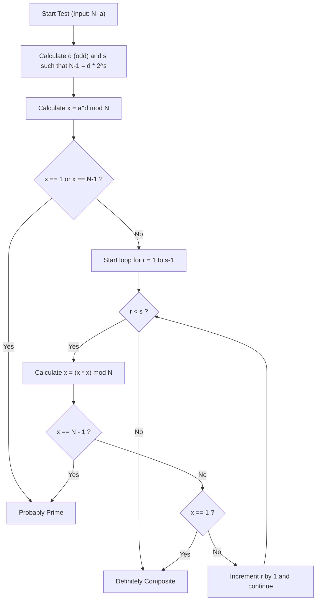
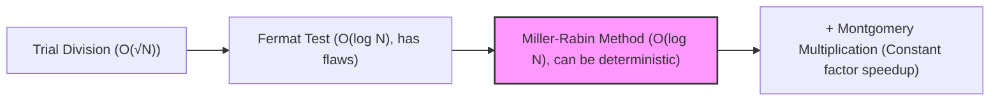

# Introduction: Why Do We Need Fast Primality Testing?

In the worlds of computer science, cryptography, and competitive programming, determining whether a given number is prime quickly and accurately is an extremely important and fundamental task. For example, public-key cryptography such as RSA, which underpins the security of modern internet society, relies on the generation of massive prime numbers and the difficulty of factoring their product as the basis of its security. Therefore, it is no exaggeration to say that the technology to instantly identify whether a massive number is prime is a technology that supports the foundation of digital society.

Also, in competitive programming (such as AtCoder and Codeforces), primality testing is a frequently occurring theme. For massive inputs with constraints like $N \le 10^{18}$, in situations where you need to perform tens of thousands of primality tests within 1 second, traditional, naive algorithms will certainly result in a Time Limit Exceeded (TLE).

In this article, we will thoroughly explain everything from naive primality testing algorithms to the probabilistic primality testing method "Fermat's Primality Test," and the practically strongest fast algorithm that overcomes its weaknesses: the "Miller-Rabin Primality Test." We will cover everything from the mathematical background to a highly optimized implementation in C++. In particular, for 64-bit integers ($N < 2^{64}$), we will explain in detail a method that goes beyond probabilistic testing to "100% deterministic primality testing" and provide C++ source code that you can use directly in practice.

---

# 1. The Basics of Primality Testing and Trial Division

A prime number is a natural number greater than 1 that has no positive divisors other than 1 and itself. According strictly to the definition of a prime number, to determine whether a given integer $N$ is prime, you can try dividing $N$ by all integers from $2$ to $N-1$. If it is never divisible, it is a prime number; if it is divisible even once, it is a composite number (not a prime).

However, the time complexity of this method is $O(N)$. When $N$ is a massive number like $10^{18}$, even modern computers would take an enormous amount of time to calculate it.

## Optimizing Trial Division: Searching up to $\sqrt{N}$

When a composite number $N$ is expressed as $a \times b = N$ ($a \le b$), it is always true that $a \le \sqrt{N}$. Therefore, the primality testing loop does not need to run up to $N-1$; it is sufficient to check up to $\sqrt{N}$.

```cpp
#include <iostream>

// Primality testing by trial division (O(sqrt(N)))
bool is_prime_trial_division(long long n) {
    if (n <= 1) return false;
    if (n == 2 || n == 3) return true;
    if (n % 2 == 0) return false;
    
    // Only check odd numbers from 3 onwards
    for (long long i = 3; i * i <= n; i += 2) {
        if (n % i == 0) return false;
    }
    return true;
}
```

The time complexity of this algorithm is $O(\sqrt{N})$. If $N \le 10^{12}$, it can be computed instantly, but when $N \approx 10^{18}$, the number of loop iterations is about $10^9$. Even with a C++ runtime, this takes hundreds of milliseconds to several seconds, making it unsuitable for multiple tests.

---

# 2. Fermat's Primality Test: The Dawn of Probabilistic Primality Testing

To break through the limitations of trial division, "Probabilistic Algorithms" using theorems from number theory were devised. A prime example is the "Fermat Primality Test," which utilizes Fermat's Little Theorem.

## Fermat's Little Theorem

This theorem, discovered by Pierre de Fermat, states the following:

> For any prime $p$ and any integer $a$ that is coprime to $p$ (not a multiple of $p$), the following congruence holds:
> $$ a^{p-1} \equiv 1 \pmod p $$

Taking the contrapositive of this theorem, we can say, "For a given integer $N$ and an integer $a$ coprime to $N$, if $a^{N-1} \not\equiv 1 \pmod N$, then $N$ is definitely a composite number." The Fermat primality test uses this property by choosing a random base $a$ for the number $N$ to be tested, calculating $a^{N-1} \pmod N$, and checking if it equals $1$.

## Fast Modular Exponentiation (Binary Exponentiation)

To perform the Fermat test, we need to quickly compute the massive exponentiation $a^{N-1} \pmod N$. We use "Modular Exponentiation / Binary Exponentiation" for this. The time complexity is $O(\log N)$, making it extremely fast.

```cpp
// Calculating a^b mod m using binary exponentiation
long long mod_pow(long long a, long long b, long long m) {
    long long res = 1;
    a %= m;
    while (b > 0) {
        if (b & 1) res = (__int128_t)res * a % m;
        a = (__int128_t)a * a % m;
        b >>= 1;
    }
    return res;
}
```
* Note: To prevent overflow here, we use `__int128_t` (a 128-bit integer), which is an extension in GCC/Clang, to hold intermediate products.

## Pseudoprimes and Carmichael Numbers

The Fermat test is very powerful, but it has a fatal flaw. There are numbers $N$ that are composite, yet $a^{N-1} \equiv 1 \pmod N$ holds for all $a$ (where $a$ is coprime to $N$).

Such numbers are called "absolute pseudoprimes" or "Carmichael numbers." The smallest Carmichael number is $561 = 3 \times 11 \times 17$.
Because Carmichael numbers exist, the Fermat test alone cannot provide a "100% probability" deterministic test. No matter how many different $a$'s you try, numbers like $561$ will always pretend to be prime (fooling the test).

---

# 3. Miller-Rabin Primality Test

The "Miller-Rabin Primality Test," devised by Gary L. Miller and Michael O. Rabin, brilliantly overcame the weakness of the Fermat test (the existence of Carmichael numbers).
Currently, it is the most widely used practical fast primality testing algorithm in internal libraries of various programming languages and in key generation for cryptographic systems.

## Mathematical Principles

The Miller-Rabin algorithm uses Fermat's Little Theorem along with the property that "in a residue field modulo a prime ($\mathbb{Z}/p\mathbb{Z}$), the only solutions to $x^2 \equiv 1 \pmod p$ are $x \equiv 1$ or $x \equiv -1$" (if modulo a composite number, other non-trivial square roots may exist).

Subtracting $1$ from the odd number $N$ you want to test always results in an even number, $N-1$. We divide $N-1$ by $2$ as many times as possible and express it in the following form:
$$ N-1 = d \cdot 2^s $$
(Where $d$ is odd and $s \ge 1$)

For any base $a$ ($1 < a < N-1$), we verify whether $a^{N-1} \equiv 1 \pmod N$ according to Fermat's Little Theorem, but we perform the calculation in steps.
Specifically, we repeatedly square it in the order of $a^d, a^{d \cdot 2}, a^{d \cdot 4}, \ldots, a^{d \cdot 2^s}$.

The conditions for the Miller-Rabin test to determine that $N$ is "prime (or probably prime with a high probability)" are that **either** of the following holds true:

1. $a^d \equiv 1 \pmod N$
2. There exists some $r$ ($0 \le r < s$) such that $a^{d \cdot 2^r} \equiv -1 \pmod N$.
   * Note: In C++ modulo arithmetic, $-1 \pmod N$ is $N-1$.

If $N$ is a prime number, this condition will absolutely be satisfied for any $a$. Conversely, it has been mathematically proven that if $N$ is a composite number, the probability of satisfying this condition (the probability of being fooled) when a random $a$ is chosen is $\frac{1}{4}$ or less.
If we perform $k$ independent tests, the probability of a false positive becomes $\left(\frac{1}{4}\right)^k$ or less, which can practically be considered zero. There are no numbers like Carmichael numbers that can "absolutely deceive" the test.

## Algorithm Flow of the Miller-Rabin Method (Mermaid Flowchart)

The following diagram shows the logical flow of a single Miller-Rabin primality test (a test for a single base $a$).



---

# 4. Deterministic Testing for 64-bit Integers

The Miller-Rabin primality test is inherently a "probabilistic" algorithm, but if the upper bound of $N$ is fixed, we can perform a "100% deterministic" primality test by trying a specific set of multiple $a$'s (bases).
This is called the **Deterministic Miller-Rabin Test**.

Research by Jim Sinclair and others has shown that for all integers $N < 2^{64}$ (about $1.8 \times 10^{19}$), testing with the following $7$ prime numbers as bases $a$ is sufficient for a completely deterministic test.

**List of bases $a$ to test:**
`{2, 325, 9375, 28178, 450775, 9780504, 1795265022}`

Alternatively, another well-known set uses the following $12$ prime numbers, which can also perfectly test up to $N < 2^{64}$.
`{2, 3, 5, 7, 11, 13, 17, 19, 23, 29, 31, 37}`

This time, to enhance the simplicity and reliability of the algorithm, we will adopt the method based on the latter $12$ primes (or the more optimized $7$ bases). In our C++ implementation, we will optimize by dividing the range with conditional branches to minimize the number of tests.

---

# 5. Highly Optimized C++ Implementation

Now, let's synthesize the mathematical theory and algorithm design up to this point, and present the implementation code for a Miller-Rabin primality testing function that is at the highest level of performance in modern C++.

## Key Implementation Points
1. **Avoiding Overflow in 64-bit Integer Multiplication:**
   When $N \approx 10^{18}$, $x \times x$ in modular multiplication can be up to $10^{36}$, easily overflowing the maximum value of a standard 64-bit integer (`uint64_t` or `long long`), which is $1.8 \times 10^{19}$.
   To solve this problem, we use the `__int128_t` (or `unsigned __int128`) extension type available in GCC and Clang to perform calculations with 128-bit precision before applying the modulo. This allows for fast modular multiplication without needing complex algorithms.

2. **Selecting Deterministic Bases:**
   When the value of $N$ is small, we optimize it so that we only need to test a few bases.

## Complete C++ Source Code

Below is the complete source code ready for practical use. You can copy and use this code directly in environments like competitive programming.

```cpp
#include <iostream>
#include <vector>
#include <cstdint>
#include <initializer_list>

using namespace std;

// Fast (a * b) mod m using 128-bit integers
inline uint64_t mod_mul(uint64_t a, uint64_t b, uint64_t m) {
    return (uint64_t)((unsigned __int128)a * b % m);
}

// Calculate (base^exp) mod m using binary exponentiation
uint64_t mod_pow(uint64_t base, uint64_t exp, uint64_t m) {
    uint64_t res = 1;
    base %= m;
    while (exp > 0) {
        if (exp & 1) res = mod_mul(res, base, m);
        base = mod_mul(base, base, m);
        exp >>= 1;
    }
    return res;
}

// Deterministic 64-bit integer test using Miller-Rabin primality test
bool is_prime_miller_rabin(uint64_t n) {
    // Pre-checking boundary values and small primes
    if (n < 2) return false;
    if (n == 2 || n == 3 || n == 5 || n == 7) return true;
    if (n % 2 == 0 || n % 3 == 0 || n % 5 == 0 || n % 7 == 0) return false;

    // Decompose into the form n-1 = d * 2^s
    uint64_t d = n - 1;
    int s = 0;
    while ((d & 1) == 0) {
        d >>= 1;
        s++;
    }

    // List of bases to use for testing
    // Optimization to minimize the number of bases tested depending on the size of N
    vector<uint64_t> bases;
    if (n < 4759123141ULL) {
        bases = {2, 7, 61};
    } else if (n < 1122004669633ULL) {
        bases = {2, 13, 23, 1662803};
    } else {
        // 7 bases that make it deterministic for all numbers N < 2^64
        bases = {2, 325, 9375, 28178, 450775, 9780504, 1795265022};
    }

    // Run the test for each base
    for (uint64_t a : bases) {
        a %= n;
        if (a == 0) continue; // If a is a multiple of n, it is untestable but not a prime

        uint64_t x = mod_pow(a, d, n);
        if (x == 1 || x == n - 1) continue; // Passed first condition, move to next base

        bool composite = true;
        // Loop s-1 times (x = x^2 mod n)
        for (int r = 1; r < s; r++) {
            x = mod_mul(x, x, n);
            if (x == n - 1) {
                composite = false; // Passed second condition, possibly prime
                break;
            }
        }
        
        // If it doesn't satisfy any condition, it is definitely a composite number
        if (composite) return false;
    }

    // If it passes the conditions for all bases, it is definitely prime
    return true;
}

int main() {
    // Test samples
    vector<uint64_t> test_cases = {
        1000000007,           // Famous prime number
        998244353,            // Famous prime number
        1000000000000000003,  // Prime number around 10^18
        1000000000000000007,  // Composite number (10^18 + 7)
        561,                  // Carmichael number (composite number)
        18446744073709551557ULL // One of the largest prime numbers near 2^64
    };

    for (uint64_t n : test_cases) {
        cout << n << " is " 
             << (is_prime_miller_rabin(n) ? "Prime" : "Composite") 
             << endl;
    }

    return 0;
}
```

---

# 6. Algorithm Complexity and Performance Evaluation

Let's discuss the performance of the implemented algorithm.

## Time Complexity
* **Trial Division:** $O(\sqrt{N})$
* **Fermat Test:** Exponentiation calculation $O(\log N) \times k$ (where $k$ is the number of trials)
* **Miller-Rabin Method:** Exponentiation calculation and looping $O(\log N) \times k$

In a 64-bit environment ($N \le 2^{64}$), the deterministic Miller-Rabin method above verifies at most $7$ bases. Therefore, we can treat $k \le 7$ as a constant, and the overall time complexity is strictly $O(\log N)$.
Even in the maximum case ($N \approx 10^{19}$), the number of execution steps is at most $7 \times 64 = 448$ basic operations, and the execution time is less than a few microseconds ($10^{-6}$ seconds). Compared to the $O(\sqrt{N})$ of trial division (loop iterations $\approx 4 \times 10^9$), a **speedup of several million times** is achieved.

## Further Optimization: Montgomery Multiplication

In the implementation of this article, division (modulo operation `%`) is performed using the 128-bit integer extension type `__int128_t`. Even on modern CPUs, integer division (DIV instruction) is an expensive instruction that takes tens of cycles compared to addition or multiplication.

Library creators and competitive programmers seeking ultimate optimization sometimes adopt a method called **Montgomery Multiplication**. Montgomery multiplication is an astonishing algorithm that maps numbers to a special "Montgomery space," replacing expensive modulo operations (divisions) with "only bit shifts and multiplications."
By incorporating this into the modular multiplication of the Miller-Rabin test, the execution speed can be further increased by a factor of 2 to 3. This is a very deep topic, so I would like to explain it in detail in another article.

---

# 7. Conclusion

In this article, we covered everything from the basics of primality testing to advanced topics all at once.
Let's review the key points.

1. **Trial Division** is reliable, but its time complexity of $O(\sqrt{N})$ makes it impractical when $N$ exceeds $10^{12}$.
2. **Fermat's Primality Test** is extremely fast at $O(\log N)$, but it has a fatal flaw of being fooled by absolute pseudoprimes like Carmichael numbers.
3. The **Miller-Rabin Primality Test** is a practical and powerful algorithm that eliminates the weaknesses of the Fermat test.
4. In the C++ implementation, leveraging `__int128_t` allows for safe handling of 64-bit integer multiplication overflows.
5. Within the range of 64-bit integers ($N < 2^{64}$), choosing $7$ or $12$ specific primes as bases makes it possible to perform **deterministic (100% accurate) primality testing**, rather than probabilistic.

Fast primality testing is an unavoidable technology in calculations dealing with massive numbers. The C++ Miller-Rabin source code provided in this article is robust enough to be used directly in practice. Please try using it in your own projects and algorithmic competitions.



The world of algorithms, where programming and mathematics intersect, is incredibly beautiful and profound. I hope this helps you in your future studies.

---
*Reference:*
- *Pomerance, C., Selfridge, J. L., & Wagstaff, S. S. (1980). The pseudoprimes to 25.10^9. Mathematics of Computation.*
- *Sinclair, J. (2011). Deterministic Miller-Rabin primality testing.*
