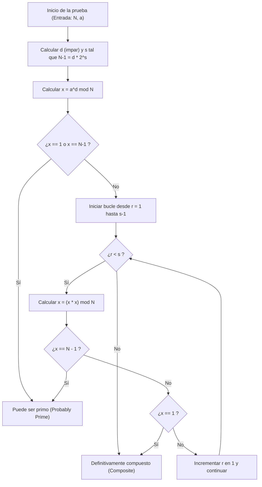
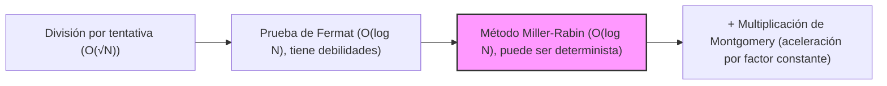

# Introducción: ¿Por qué es necesaria una prueba rápida de primalidad?

En el mundo de las ciencias de la computación, la criptografía y la programación competitiva, determinar rápida y precisamente "si un número es primo o no" es un problema muy importante y fundamental. Por ejemplo, la criptografía de clave pública como el cifrado RSA, que respalda la seguridad de la sociedad de internet moderna, basa su seguridad en la generación de números primos enormes y la dificultad de su multiplicación (la dificultad de la factorización de enteros). Por lo tanto, no es exagerado decir que la tecnología para identificar instantáneamente si un número enorme es primo o no es la tecnología que sostiene los cimientos de la sociedad digital.

Además, en la programación competitiva (como AtCoder o Codeforces), la prueba de primalidad es un tema frecuente. Para una entrada enorme con restricciones como $N \le 10^{18}$, en situaciones donde se deben realizar decenas de miles de pruebas de primalidad en menos de un segundo, los algoritmos tradicionales e ingenuos simplemente no alcanzarían el tiempo de cálculo (Time Limit Exceeded: TLE).

En este artículo, comenzaremos con algoritmos ingenuos de prueba de primalidad, pasaremos a la prueba probabilística de primalidad conocida como "Prueba de Fermat", y luego explicaremos exhaustivamente el "Test de primalidad de Miller-Rabin", un algoritmo de alta velocidad de nivel práctico que supera sus debilidades. Cubriremos todo, desde los antecedentes matemáticos hasta implementaciones altamente optimizadas en C++. En particular, para enteros de 64 bits ($N < 2^{64}$), no solo nos limitaremos a una prueba probabilística, sino que también explicaremos detalladamente un método que "puede determinar la primalidad con 100% de certeza (prueba determinista)" y proporcionaremos un código fuente en C++ listo para usar en la práctica.

---

# 1. Fundamentos de la prueba de primalidad y el método de división por tentativa (Trial Division)

Un número primo (Prime number) es un número natural mayor o igual a 2 que no tiene divisores positivos aparte de 1 y él mismo. Siguiendo estrictamente la definición de número primo, para determinar si un entero $N$ es primo, se puede intentar dividir $N$ por todos los enteros desde $2$ hasta $N-1$. Si no se puede dividir de forma exacta por ninguno, se considera primo; si se divide de forma exacta al menos una vez, es un número compuesto (no primo).

Sin embargo, este método tiene una complejidad computacional de $O(N)$, y cuando $N$ es un número enorme como $10^{18}$, incluso las computadoras modernas tardarían una cantidad enorme de tiempo en calcularlo.

## Optimización de la división por tentativa: Búsqueda hasta $\sqrt{N}$

Cuando un número compuesto $N$ se expresa como $a \times b = N$ (donde $a \le b$), siempre se cumple que $a \le \sqrt{N}$. Por lo tanto, el bucle para la prueba de primalidad no necesita repetirse hasta $N-1$; es suficiente verificar hasta $\sqrt{N}$.

```cpp
#include <iostream>

// Prueba de primalidad usando división por tentativa (O(sqrt(N)))
bool is_prime_trial_division(long long n) {
    if (n <= 1) return false;
    if (n == 2 || n == 3) return true;
    if (n % 2 == 0) return false;
    
    // Solo verificar números impares mayores o iguales a 3
    for (long long i = 3; i * i <= n; i += 2) {
        if (n % i == 0) return false;
    }
    return true;
}
```

La complejidad computacional de este algoritmo es $O(\sqrt{N})$. Si $N \le 10^{12}$, se puede calcular instantáneamente, pero si $N \approx 10^{18}$, el número de iteraciones del bucle será de aproximadamente $10^9$. Incluso en C++, esto puede tomar desde cientos de milisegundos hasta varios segundos, lo que lo hace inadecuado para múltiples pruebas.

---

# 2. Prueba de Fermat: El comienzo de la prueba probabilística de primalidad

Para superar los límites del método de división por tentativa, se idearon "Algoritmos probabilísticos (Probabilistic Algorithm)" utilizando teoremas de la teoría de números. Un ejemplo representativo es la "Prueba de Fermat (Fermat Primality Test)", que utiliza el pequeño teorema de Fermat.

## Pequeño teorema de Fermat (Fermat's Little Theorem)

Este teorema, descubierto por Pierre de Fermat, afirma lo siguiente:

> Para cualquier número primo $p$ y cualquier entero $a$ que sea coprimo con $p$ (que no sea un múltiplo de $p$), se cumple la siguiente congruencia:
> $$ a^{p-1} \equiv 1 \pmod p $$

Tomando la contrapositiva de este teorema, se puede decir que "si para algún entero $N$ y un entero $a$ coprimo con $N$, $a^{N-1} \not\equiv 1 \pmod N$, entonces $N$ es definitivamente un número compuesto". Utilizando esta propiedad, la prueba de Fermat elige una base aleatoria (base) $a$ para el número a probar $N$, y verifica si $a^{N-1} \pmod N$ es igual a $1$.

## Exponenciación modular rápida (Exponenciación binaria)

Para llevar a cabo la prueba de Fermat, es necesario calcular rápidamente potencias enormes como $a^{N-1} \pmod N$. Para esto, se utiliza el método de "exponenciación binaria (Modular Exponentiation / Binary Exponentiation)". La complejidad computacional se convierte en $O(\log N)$, lo cual es muy rápido.

```cpp
// Cálculo de a^b mod m usando exponenciación binaria
long long mod_pow(long long a, long long b, long long m) {
    long long res = 1;
    a %= m;
    while (b > 0) {
        if (b & 1) res = (__int128_t)res * a % m;
        a = (__int128_t)a * a % m;
        b >>= 1;
    }
    return res;
}
```
※ Para evitar el desbordamiento, aquí se usa la extensión GCC/Clang `__int128_t` (entero de 128 bits) para mantener el producto intermedio.

## Pseudoprimos y números de Carmichael (Carmichael Numbers)

La prueba de Fermat es muy poderosa, pero tiene una debilidad fatal. Resulta que existen números $N$ que son compuestos, pero para los cuales $a^{N-1} \equiv 1 \pmod N$ se cumple para todos los $a$ ($a$ coprimos con $N$).

A estos números se les llama "pseudoprimos absolutos" o "números de Carmichael". El número de Carmichael más pequeño es $561 = 3 \times 11 \times 17$.
Debido a la existencia de los números de Carmichael, no se puede realizar una prueba determinista "100% segura" utilizando solo la prueba de Fermat. No importa cuántas $a$ diferentes se prueben, números como el $561$ siempre simularán ser primos (engañarán a la prueba).

---

# 3. Test de primalidad de Miller-Rabin (Miller-Rabin Primality Test)

La debilidad de la prueba de Fermat (la existencia de los números de Carmichael) fue superada brillantemente por el "Test de primalidad de Miller-Rabin", ideado por Gary L. Miller y Michael O. Rabin.
En la actualidad, como un algoritmo rápido y práctico de prueba de primalidad, es el más ampliamente utilizado en las bibliotecas internas de varios lenguajes de programación y en la generación de claves para sistemas criptográficos.

## Principio matemático

El algoritmo de Miller-Rabin, además del pequeño teorema de Fermat, utiliza la propiedad de que "en el cuerpo residual módulo un primo ($\mathbb{Z}/p\mathbb{Z}$), las soluciones de $x^2 \equiv 1 \pmod p$ están restringidas a $x \equiv 1$ o $x \equiv -1$" (si el módulo es un número compuesto, pueden existir otras raíces cuadradas no triviales además de estas).

Para un número impar $N$ a evaluar, restar $1$ da como resultado $N-1$, que siempre es par. Entonces, dividimos $N-1$ por $2$ tantas veces como sea posible y lo expresamos en la siguiente forma:
$$ N-1 = d \cdot 2^s $$
(donde $d$ es impar, $s \ge 1$)

Para cualquier base $a$ ($1 < a < N-1$), verificamos si $a^{N-1} \equiv 1 \pmod N$ según el pequeño teorema de Fermat, pero realizamos ese cálculo paso a paso.
Específicamente, repetimos el cuadrado secuencialmente como $a^d, a^{d \cdot 2}, a^{d \cdot 4}, \ldots, a^{d \cdot 2^s}$.

La condición para que la prueba de Miller-Rabin determine que $N$ es "primo (o muy probablemente primo)" es que se cumpla **al menos una** de las siguientes condiciones:

1. $a^d \equiv 1 \pmod N$
2. Existe algún $r$ ($0 \le r < s$) tal que $a^{d \cdot 2^r} \equiv -1 \pmod N$.
   ※ En la operación módulo de C++, $-1 \pmod N$ se convierte en $N-1$.

Si $N$ es primo, esta condición siempre se cumplirá para cualquier $a$. Por el contrario, si $N$ es compuesto, al elegir un $a$ aleatorio, se ha demostrado matemáticamente que la probabilidad de que se cumpla esta condición (probabilidad de ser engañado) es menor o igual a $\frac{1}{4}$.
Si se realizan $k$ pruebas independientes, la probabilidad de un falso positivo se vuelve $\left(\frac{1}{4}\right)^k$ o menor, lo que en la práctica puede considerarse cero. No existen números que "puedan engañar siempre", como los números de Carmichael.

## Flujo del algoritmo del método Miller-Rabin (Diagrama de flujo Mermaid)

El siguiente diagrama muestra el flujo lógico de una sola prueba del test de primalidad de Miller-Rabin (para una base $a$).



---

# 4. Prueba determinista para enteros de 64 bits

El test de primalidad de Miller-Rabin es inherentemente un algoritmo "probabilístico", pero cuando el límite superior de $N$ es fijo, se puede realizar una prueba "100% determinista" probando un conjunto específico de múltiples bases $a$.
A esto se le llama **Test de Miller-Rabin Determinista (Deterministic Miller-Rabin Test)**.

Investigaciones realizadas por Jim Sinclair y otros han demostrado que, para todos los enteros $N < 2^{64}$ (aproximadamente $1.8 \times 10^{19}$), es posible lograr una determinación suficiente y completamente determinista probando los siguientes $7$ primos como la base $a$.

**Lista de bases $a$ a probar:**
`{2, 325, 9375, 28178, 450775, 9780504, 1795265022}`

Alternativamente, como otro conjunto bien conocido, usando los siguientes $12$ primos también se puede determinar perfectamente para $N < 2^{64}$.
`{2, 3, 5, 7, 11, 13, 17, 19, 23, 29, 31, 37}`

En este caso, para mejorar la simplicidad y confiabilidad del algoritmo, adoptaremos un enfoque basado en los últimos $12$ primos (o bases optimizadas a $7$). En la implementación en C++, optimizaremos para mantener el número de pruebas al mínimo dividiendo el rango con ramificación condicional.

---

# 5. Implementación avanzada en C++ (Highly Optimized C++ Implementation)

Ahora, consolidaremos la teoría matemática y el diseño del algoritmo hasta este punto y presentaremos el código de implementación de una de las funciones de prueba de primalidad de Miller-Rabin más robustas en el C++ moderno.

## Puntos de la implementación
1. **Evitar desbordamientos en la multiplicación de enteros de 64 bits:**
   Cuando $N \approx 10^{18}$, $x \times x$ en la multiplicación modular puede ser hasta $10^{36}$, lo cual desborda fácilmente el valor máximo de $1.8 \times 10^{19}$ de los enteros de 64 bits típicos (`uint64_t` o `long long`).
   Para resolver este problema, utilizamos el tipo extendido `__int128_t` (o `unsigned __int128`) de GCC o Clang para calcular con precisión de 128 bits antes de aplicar el módulo. Esto permite multiplicaciones modulares rápidas sin recurrir a algoritmos complejos.

2. **Selección de base determinista:**
   Optimizamos para que, si el valor de $N$ es pequeño, solo se prueben unas pocas bases.

## Código fuente completo en C++

A continuación, se muestra la versión completa del código fuente lista para usar en la práctica. Este código se puede copiar y usar tal cual en entornos de programación competitiva.

```cpp
#include <iostream>
#include <vector>
#include <cstdint>
#include <initializer_list>

using namespace std;

// (a * b) mod m rápido usando enteros de 128 bits
inline uint64_t mod_mul(uint64_t a, uint64_t b, uint64_t m) {
    return (uint64_t)((unsigned __int128)a * b % m);
}

// Cálculo de (base^exp) mod m mediante exponenciación binaria
uint64_t mod_pow(uint64_t base, uint64_t exp, uint64_t m) {
    uint64_t res = 1;
    base %= m;
    while (exp > 0) {
        if (exp & 1) res = mod_mul(res, base, m);
        base = mod_mul(base, base, m);
        exp >>= 1;
    }
    return res;
}

// Prueba determinista de enteros de 64 bits usando el test de primalidad de Miller-Rabin
bool is_prime_miller_rabin(uint64_t n) {
    // Casos base y comprobaciones previas para números primos pequeños
    if (n < 2) return false;
    if (n == 2 || n == 3 || n == 5 || n == 7) return true;
    if (n % 2 == 0 || n % 3 == 0 || n % 5 == 0 || n % 7 == 0) return false;

    // Descomponer en la forma n-1 = d * 2^s
    uint64_t d = n - 1;
    int s = 0;
    while ((d & 1) == 0) {
        d >>= 1;
        s++;
    }

    // Lista de bases a utilizar para la prueba
    // Optimización para minimizar la cantidad de bases probadas según el tamaño de N
    vector<uint64_t> bases;
    if (n < 4759123141ULL) {
        bases = {2, 7, 61};
    } else if (n < 1122004669633ULL) {
        bases = {2, 13, 23, 1662803};
    } else {
        // 7 bases que hacen que la prueba sea determinista para todo N < 2^64
        bases = {2, 325, 9375, 28178, 450775, 9780504, 1795265022};
    }

    // Ejecutar la prueba para cada base
    for (uint64_t a : bases) {
        a %= n;
        if (a == 0) continue; // Si a es un múltiplo de n, no se puede determinar, pero no es primo

        uint64_t x = mod_pow(a, d, n);
        if (x == 1 || x == n - 1) continue; // Pasa la primera condición, a la siguiente base

        bool composite = true;
        // Bucle de s-1 iteraciones (x = x^2 mod n)
        for (int r = 1; r < s; r++) {
            x = mod_mul(x, x, n);
            if (x == n - 1) {
                composite = false; // Pasa la segunda condición, posible primo
                break;
            }
        }
        
        // Si no cumple ninguna condición, es definitivamente un número compuesto
        if (composite) return false;
    }

    // Si pasa las condiciones para todas las bases, es definitivamente primo
    return true;
}

int main() {
    // Casos de prueba de muestra
    vector<uint64_t> test_cases = {
        1000000007,           // Primo famoso
        998244353,            // Primo famoso
        1000000000000000003,  // Primo alrededor de 10^18
        1000000000000000007,  // Compuesto (10^18 + 7)
        561,                  // Número de Carmichael (compuesto)
        18446744073709551557ULL // Uno de los primos más grandes cerca de 2^64
    };

    for (uint64_t n : test_cases) {
        cout << n << " is " 
             << (is_prime_miller_rabin(n) ? "Prime" : "Composite") 
             << endl;
    }

    return 0;
}
```

---

# 6. Complejidad del algoritmo y evaluación de rendimiento

Consideraremos el rendimiento del algoritmo implementado.

## Complejidad temporal (Time Complexity)
* **División por tentativa:** $O(\sqrt{N})$
* **Prueba de Fermat:** Cálculo de potencia $O(\log N) \times k$ ($k$ es el número de pruebas)
* **Método de Miller-Rabin:** Cálculo de potencia y bucle $O(\log N) \times k$

En un entorno de 64 bits ($N \le 2^{64}$), el método determinista de Miller-Rabin anterior verifica un máximo de $7$ bases. Por lo tanto, $k \le 7$ puede considerarse constante, y la complejidad de tiempo total es estrictamente $O(\log N)$.
Incluso en el peor de los casos ($N \approx 10^{19}$), el número de pasos de ejecución se reduce a un máximo de $7 \times 64 = 448$ operaciones básicas, y el tiempo de ejecución es inferior a unos pocos microsegundos ($10^{-6}$ segundos). Comparado con el método de división por tentativa de $O(\sqrt{N})$ (iteraciones del bucle $\approx 4 \times 10^9$), se logra una **aceleración de millones de veces**.

## Mayor optimización: Multiplicación de Montgomery (Montgomery Multiplication)

En la implementación de este artículo, la división (operación de módulo `%`) se realiza utilizando el tipo extendido de enteros de 128 bits `__int128_t`. Incluso en las CPU modernas, la división de enteros (instrucción DIV) es una operación costosa que requiere decenas de ciclos en comparación con la suma o la multiplicación.

Los creadores de bibliotecas y los programadores competitivos que buscan la optimización extrema a veces adoptan una técnica llamada **Multiplicación de Montgomery (Montgomery Multiplication)**. La multiplicación de Montgomery es un algoritmo asombroso que reemplaza la costosa operación de módulo (división) por "solamente desplazamientos de bits y multiplicaciones" al mapear números en un "espacio de Montgomery" especial.
Al integrar esto en la multiplicación modular de la prueba de Miller-Rabin, es posible aumentar aún más la velocidad de ejecución de dos a tres veces. Como este es un tema muy profundo, me gustaría explicarlo con más detalle en otro artículo.

---

# 7. Resumen

En este artículo, hemos explicado todo sobre las pruebas de primalidad, desde los conceptos básicos hasta el contenido avanzado.
Repasemos los puntos principales.

1. **El método de división por tentativa** es seguro, pero debido a su complejidad computacional $O(\sqrt{N})$, carece de viabilidad práctica cuando $N$ supera $10^{12}$.
2. **La prueba de Fermat** es muy rápida con $O(\log N)$, pero tiene una debilidad fatal, ya que puede ser engañada por pseudoprimos absolutos como los números de Carmichael.
3. **El test de primalidad de Miller-Rabin** es el algoritmo práctico más robusto que resuelve las debilidades de la prueba de Fermat.
4. En la implementación en C++, utilizar `__int128_t` permite manejar de forma segura los desbordamientos de multiplicación de enteros de 64 bits.
5. Dentro del rango de enteros de 64 bits ($N < 2^{64}$), al elegir $7$ o $12$ números primos específicos como base, es posible una **prueba de primalidad determinista (100% precisa)** en lugar de probabilística.

La prueba de primalidad rápida es una tecnología ineludible en el cálculo con números gigantes. El código fuente de C++ de Miller-Rabin proporcionado en este artículo es lo suficientemente robusto como para ser utilizado en la práctica. Asegúrate de usarlo en tus propios proyectos y en competencias algorítmicas.



El mundo de los algoritmos donde se cruzan la programación y las matemáticas es sumamente hermoso y profundo. Espero que este artículo te haya ayudado en tu aprendizaje continuo.

---
*Reference:*
- *Pomerance, C., Selfridge, J. L., & Wagstaff, S. S. (1980). The pseudoprimes to 25.10^9. Mathematics of Computation.*
- *Sinclair, J. (2011). Deterministic Miller-Rabin primality testing.*
