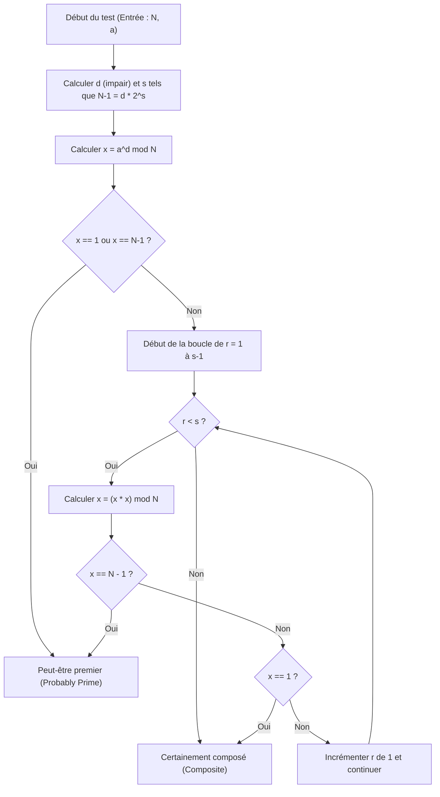
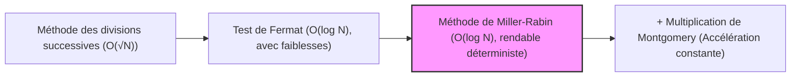

# Introduction : Pourquoi avons-nous besoin de tests de primalité rapides ?

Dans le monde de l'informatique, de la théorie de la cryptographie ou de la programmation compétitive, déterminer rapidement et précisément "si un certain nombre est premier ou non" est un défi fondamental et extrêmement important. Par exemple, la cryptographie à clé publique telle que RSA, qui soutient la sécurité de la société Internet moderne, base sa sécurité sur la génération d'énormes nombres premiers et sur la difficulté de les multiplier (la difficulté de la factorisation en nombres premiers). Par conséquent, il n'est pas exagéré de dire que la technologie capable d'identifier instantanément si un nombre énorme est premier est la technologie qui soutient le fondement de la société numérique.

De plus, en programmation compétitive (comme AtCoder et Codeforces), les tests de primalité sont un thème récurrent. Dans des situations où des dizaines de milliers de tests de primalité doivent être effectués en moins d'une seconde pour des entrées énormes avec des contraintes telles que $N \le 10^{18}$, les algorithmes traditionnels et naïfs ne peuvent absolument pas respecter la limite de temps de calcul (Time Limit Exceeded : TLE).

Dans cet article, nous expliquerons en profondeur, de la base mathématique jusqu'aux implémentations hautement optimisées en C++, en commençant par des algorithmes naïfs de test de primalité, puis le "test de Fermat", qui est un test de primalité probabiliste, et enfin l'algorithme rapide de niveau pratique le plus puissant qui surmonte ses faiblesses : le "test de primalité de Miller-Rabin". En particulier, pour les entiers de 64 bits ($N < 2^{64}$), nous expliquerons en détail la méthode qui ne se limite pas à un test probabiliste mais "peut tester la primalité avec 100% de certitude (test déterministe)", et fournirons un code source en C++ prêt à être utilisé en pratique.

---

# 1. Les bases du test de primalité et la méthode des divisions successives (Trial Division)

Un nombre premier (Prime number) est un entier naturel supérieur ou égal à 2 qui n'a de diviseurs positifs que 1 et lui-même. En suivant fidèlement la définition d'un nombre premier, pour déterminer si un certain entier $N$ est premier, nous pouvons essayer de diviser $N$ par tous les entiers de $2$ à $N-1$ ; s'il n'est jamais divisible, il est premier, et s'il est divisible au moins une fois, il est considéré comme un nombre composé (pas un nombre premier).

Cependant, la complexité temporelle de cette méthode est de $O(N)$, et lorsque $N$ est un nombre énorme comme $10^{18}$, même les ordinateurs modernes prendront énormément de temps pour le calcul.

## Optimisation de la méthode des divisions successives : recherche jusqu'à $\sqrt{N}$

Lorsqu'un nombre composé $N$ est exprimé comme $a \times b = N$ ($a \le b$), il est certain que $a \le \sqrt{N}$. Par conséquent, il n'est pas nécessaire d'exécuter la boucle du test de primalité jusqu'à $N-1$ ; il suffit de vérifier jusqu'à $\sqrt{N}$.

```cpp
#include <iostream>

// Test de primalité par la méthode des divisions successives (O(sqrt(N)))
bool is_prime_trial_division(long long n) {
    if (n <= 1) return false;
    if (n == 2 || n == 3) return true;
    if (n % 2 == 0) return false;
    
    // Vérifier uniquement les nombres impairs supérieurs ou égaux à 3
    for (long long i = 3; i * i <= n; i += 2) {
        if (n % i == 0) return false;
    }
    return true;
}
```

La complexité de cet algorithme est de $O(\sqrt{N})$. Si $N \le 10^{12}$, il peut être calculé en un instant, mais dans le cas de $N \approx 10^{18}$, le nombre de boucles devient d'environ $10^9$ fois, ce qui prend de quelques centaines de millisecondes à quelques secondes même avec un environnement C++, et n'est donc pas adapté pour de multiples évaluations.

---

# 2. Le test de Fermat : L'aube du test de primalité probabiliste

Ce qui a été conçu pour surmonter les limites de la méthode des divisions successives est l'"algorithme probabiliste (Probabilistic Algorithm)" qui utilise des théorèmes de la théorie des nombres. L'exemple typique en est le "test de primalité de Fermat" utilisant le petit théorème de Fermat.

## Le petit théorème de Fermat (Fermat's Little Theorem)

Ce théorème, découvert par Pierre de Fermat, affirme ce qui suit :

> Pour tout nombre premier $p$ et tout entier $a$ qui lui est premier (non multiple de $p$), la congruence suivante est vraie :
> $$ a^{p-1} \equiv 1 \pmod p $$

En prenant la contraposée de ce théorème, on peut dire que "pour un certain entier $N$ et un entier $a$ premier avec $N$, si $a^{N-1} \not\equiv 1 \pmod N$, alors $N$ est définitivement un nombre composé". En utilisant cette propriété, le test de Fermat consiste à choisir une base (base) aléatoire $a$ pour le nombre cible $N$, à calculer $a^{N-1} \pmod N$ et à vérifier s'il devient $1$.

## Exponentiation modulaire rapide (Méthode d'exponentiation binaire)

Pour effectuer le test de Fermat, il est nécessaire de calculer rapidement d'énormes puissances telles que $a^{N-1} \pmod N$. Pour cela, nous utilisons la "méthode d'exponentiation binaire (Modular Exponentiation / Binary Exponentiation)". La complexité est de $O(\log N)$, ce qui est extrêmement rapide.

```cpp
// Calcul de a^b mod m en utilisant la méthode d'exponentiation binaire
long long mod_pow(long long a, long long b, long long m) {
    long long res = 1;
    a %= m;
    while (b > 0) {
        if (b & 1) res = (__int128_t)res * a % m;
        a = (__int128_t)a * a % m;
        b >>= 1;
    }
    return res;
}
```
* Ici, pour éviter les dépassements de capacité, l'extension GCC/Clang `__int128_t` (entier de 128 bits) est utilisée pour conserver les produits intermédiaires.

## Nombres pseudo-premiers et nombres de Carmichael (Carmichael Numbers)

Le test de Fermat est très puissant, mais il a une faiblesse fatale. Il existe des nombres tels que bien que $N$ soit un nombre composé, $a^{N-1} \equiv 1 \pmod N$ reste vrai pour tous les $a$ ($a$ premiers avec $N$).

De tels nombres sont appelés "nombres pseudo-premiers absolus" ou "nombres de Carmichael". Le plus petit nombre de Carmichael est $561 = 3 \times 11 \times 17$.
En raison de la présence de nombres de Carmichael, il n'est pas possible d'effectuer un test déterministe avec une "probabilité de 100%" en utilisant uniquement le test de Fermat. Peu importe le nombre de bases différentes $a$ que vous essayez, un nombre comme $561$ fera toujours semblant d'être premier (une tromperie).

---

# 3. Test de primalité de Miller-Rabin (Miller-Rabin Primality Test)

Le "test de primalité de Miller-Rabin", conçu par Miller (Gary L. Miller) et Rabin (Michael O. Rabin), a brillamment surmonté la faiblesse du test de Fermat (l'existence des nombres de Carmichael).
Aujourd'hui, il est le plus largement utilisé dans la génération de clés des systèmes cryptographiques et des bibliothèques internes de divers langages de programmation en tant algorithme de test de primalité rapide et pratique.

## Principes mathématiques

En plus du petit théorème de Fermat, l'algorithme de Miller-Rabin utilise la propriété selon laquelle "dans un corps fini modulo un nombre premier ($\mathbb{Z}/p\mathbb{Z}$), les seules solutions à $x^2 \equiv 1 \pmod p$ sont $x \equiv 1$ ou $x \equiv -1$" (dans le cas modulo un nombre composé, d'autres racines carrées non triviales peuvent exister).

Si l'on soustrait $1$ au nombre impair $N$ que nous voulons tester, $N-1$ sera toujours un nombre pair. Par conséquent, nous divisons $N-1$ par $2$ autant de fois que possible, et l'exprimons sous la forme suivante :
$$ N-1 = d \cdot 2^s $$
(Ici, $d$ est un nombre impair, $s \ge 1$)

Pour toute base arbitraire $a$ ($1 < a < N-1$), nous vérifions si $a^{N-1} \equiv 1 \pmod N$ selon le petit théorème de Fermat, mais nous effectuons ce calcul par étapes.
Plus précisément, nous répétons la mise au carré dans l'ordre : $a^d, a^{d \cdot 2}, a^{d \cdot 4}, \ldots, a^{d \cdot 2^s}$.

La condition pour que le test de Miller-Rabin détermine que $N$ est "premier (ou probablement premier avec une forte probabilité)" est que l'une des conditions **suivantes** soit remplie.

1. $a^d \equiv 1 \pmod N$
2. Il existe un certain $r$ ($0 \le r < s$) tel que $a^{d \cdot 2^r} \equiv -1 \pmod N$ soit vrai.
   * En arithmétique modulaire en C++, $-1 \pmod N$ devient $N-1$.

Si $N$ est premier, cette condition sera toujours remplie pour n'importe quel $a$. Inversement, si $N$ est un nombre composé, lorsqu'un $a$ aléatoire est choisi, il est prouvé mathématiquement que la probabilité de remplir cette condition (la probabilité d'être trompé) est inférieure ou égale à $\frac{1}{4}$.
En effectuant $k$ tests indépendants, la probabilité d'une fausse identification devient inférieure ou égale à $\left(\frac{1}{4}\right)^k$, ce qui peut être considéré comme pratiquement nul. Il n'existe pas de nombres qui puissent "tromper de manière absolue" comme les nombres de Carmichael.

## Flux de l'algorithme de la méthode de Miller-Rabin (Organigramme Mermaid)

Le diagramme ci-dessous illustre le flux logique d'un seul test (un test pour une base $a$) de la méthode de test de primalité de Miller-Rabin.



---

# 4. Test déterministe pour les entiers de 64 bits

Bien que le test de primalité de Miller-Rabin soit fondamentalement un algorithme "probabiliste", lorsque la limite supérieure de $N$ est fixe, on peut tester la primalité avec "100% de certitude" en essayant toutes les bases spécifiques $a$ (bases).
Ceci est appelé le **test de Miller-Rabin déterministe (Deterministic Miller-Rabin Test)**.

Grâce aux recherches de Jim Sinclair et d'autres, il a été révélé que pour tous les entiers $N < 2^{64}$ (environ $1.8 \times 10^{19}$), un test complètement déterministe et suffisant est possible en choisissant les $7$ nombres premiers suivants comme base $a$.

**Liste des bases $a$ à tester :**
`{2, 325, 9375, 28178, 450775, 9780504, 1795265022}`

Alternativement, en utilisant un autre ensemble bien connu des $12$ nombres premiers suivants, une détermination parfaite peut également être effectuée en dessous de $N < 2^{64}$.
`{2, 3, 5, 7, 11, 13, 17, 19, 23, 29, 31, 37}`

Cette fois, pour améliorer la simplicité et la fiabilité de l'algorithme, nous adopterons la méthode utilisant ces derniers $12$ nombres premiers comme bases (ou les $7$ bases plus optimisées). Dans l'implémentation C++, en divisant la plage avec un branchement conditionnel, nous optimiserons pour minimiser le nombre de tests.

---

# 5. Implémentation avancée en C++ (Highly Optimized C++ Implementation)

Maintenant, en résumant les théories mathématiques et la conception des algorithmes discutées jusqu'à présent, nous présenterons le code d'implémentation de la fonction de test de primalité de Miller-Rabin au niveau le plus fort dans le C++ moderne.

## Points clés de l'implémentation
1. **Éviter le dépassement de capacité de la multiplication des entiers de 64 bits :**
   Dans le cas de $N \approx 10^{18}$, $x \times x$ dans la multiplication modulaire sera au maximum de $10^{36}$, ce qui dépassera facilement la valeur maximale de $1.8 \times 10^{19}$ d'un entier normal de 64 bits (`uint64_t` ou `long long`).
   Pour résoudre ce problème, le type d'extension GCC ou Clang `__int128_t` (ou `unsigned __int128`) est utilisé, et le calcul est effectué avec une précision de 128 bits avant de prendre le modulo. Cela permet une multiplication modulaire à grande vitesse sans l'utilisation d'algorithmes complexes.

2. **Choix de la base déterministe :**
   Si la valeur de $N$ est petite, elle est optimisée de manière à ce qu'un plus petit nombre de bases n'aient besoin d'être testées.

## Code source C++ complet

Voici le code source complet prêt à être utilisé en pratique. Ce code peut être copié et utilisé tel quel dans des environnements tels que la programmation compétitive.

```cpp
#include <iostream>
#include <vector>
#include <cstdint>
#include <initializer_list>

using namespace std;

// (a * b) mod m rapide avec des entiers de 128 bits
inline uint64_t mod_mul(uint64_t a, uint64_t b, uint64_t m) {
    return (uint64_t)((unsigned __int128)a * b % m);
}

// Calcul de (base^exp) mod m par la méthode d'exponentiation binaire
uint64_t mod_pow(uint64_t base, uint64_t exp, uint64_t m) {
    uint64_t res = 1;
    base %= m;
    while (exp > 0) {
        if (exp & 1) res = mod_mul(res, base, m);
        base = mod_mul(base, base, m);
        exp >>= 1;
    }
    return res;
}

// Test déterministe pour les entiers 64 bits par la méthode de Miller-Rabin
bool is_prime_miller_rabin(uint64_t n) {
    // Valeurs limites et évaluation préalable des petits nombres premiers
    if (n < 2) return false;
    if (n == 2 || n == 3 || n == 5 || n == 7) return true;
    if (n % 2 == 0 || n % 3 == 0 || n % 5 == 0 || n % 7 == 0) return false;

    // Décomposer sous la forme n-1 = d * 2^s
    uint64_t d = n - 1;
    int s = 0;
    while ((d & 1) == 0) {
        d >>= 1;
        s++;
    }

    // Liste des bases utilisées pour le test
    // Optimisation pour minimiser le nombre de bases testées selon la taille de N
    vector<uint64_t> bases;
    if (n < 4759123141ULL) {
        bases = {2, 7, 61};
    } else if (n < 1122004669633ULL) {
        bases = {2, 13, 23, 1662803};
    } else {
        // 7 bases qui sont déterministes pour tous les nombres N < 2^64
        bases = {2, 325, 9375, 28178, 450775, 9780504, 1795265022};
    }

    // Exécuter le test pour chaque base
    for (uint64_t a : bases) {
        a %= n;
        if (a == 0) continue; // Si a est un multiple de n, cela ne peut pas être testé, mais ce n'est pas premier

        uint64_t x = mod_pow(a, d, n);
        if (x == 1 || x == n - 1) continue; // Première condition remplie, passer à la base suivante

        bool composite = true;
        // Boucle de s-1 itérations (x = x^2 mod n)
        for (int r = 1; r < s; r++) {
            x = mod_mul(x, x, n);
            if (x == n - 1) {
                composite = false; // Seconde condition remplie, peut-être premier
                break;
            }
        }
        
        // Si aucune condition n'est remplie, il est certainement composé
        if (composite) return false;
    }

    // Si la condition est remplie pour toutes les bases, il est certainement premier
    return true;
}

int main() {
    // Échantillons pour les tests
    vector<uint64_t> test_cases = {
        1000000007,           // Nombre premier célèbre
        998244353,            // Nombre premier célèbre
        1000000000000000003,  // Nombre premier autour de 10^18
        1000000000000000007,  // Nombre composé (10^18 + 7)
        561,                  // Nombre de Carmichael (Composé)
        18446744073709551557ULL // Un des plus grands nombres premiers près de 2^64
    };

    for (uint64_t n : test_cases) {
        cout << n << " is " 
             << (is_prime_miller_rabin(n) ? "Prime" : "Composite") 
             << endl;
    }

    return 0;
}
```

---

# 6. Évaluation de la complexité et des performances de l'algorithme

Examinons les performances de l'algorithme implémenté.

## Complexité temporelle (Time Complexity)
* **Méthode des divisions successives :** $O(\sqrt{N})$
* **Test de Fermat :** Calcul d'exponentiation $O(\log N) \times k$ ($k$ étant le nombre d'essais)
* **Méthode de Miller-Rabin :** Calcul d'exponentiation et boucle $O(\log N) \times k$

Dans un environnement 64 bits ($N \le 2^{64}$), la méthode déterministe de Miller-Rabin ci-dessus vérifie au maximum $7$ bases. Par conséquent, $k$ peut être considéré comme une constante $k \le 7$, et la complexité temporelle globale devient strictement $O(\log N)$.
Même dans le pire des cas ($N \approx 10^{19}$), le nombre d'étapes d'exécution tient dans un maximum de $7 \times 64 = 448$ opérations de base, et le temps d'exécution est inférieur à quelques microsecondes ($10^{-6}$ secondes). Par rapport au $O(\sqrt{N})$ de la méthode des divisions successives (environ $4 \times 10^9$ boucles), une **accélération de plusieurs millions de fois** est atteinte.

## Optimisation supplémentaire : Multiplication de Montgomery (Montgomery Multiplication)

Dans l'implémentation de cet article, le type étendu entier de 128 bits `__int128_t` est utilisé pour la division (opération modulo `%`). Même sur les processeurs modernes, la division entière (instruction DIV) est une instruction coûteuse qui nécessite des dizaines de cycles par rapport à l'addition ou la multiplication.

Les créateurs de bibliothèques et les programmeurs compétitifs cherchant à atteindre les limites de l'optimisation adoptent parfois une méthode appelée **multiplication de Montgomery (Montgomery Multiplication)**. La multiplication de Montgomery est un algorithme remarquable qui remplace les opérations modulo coûteuses (division) par "seulement des décalages de bits et des multiplications" en mappant les nombres dans un "espace de Montgomery" spécial.
En intégrant cela dans la multiplication modulaire du test de Miller-Rabin, la vitesse d'exécution peut encore être augmentée d'environ 2 à 3 fois. Comme c'est un sujet très profond, nous l'expliquerons en détail dans un autre article.

---

# 7. Conclusion

Dans cet article, nous avons expliqué d'un coup de nombreux concepts, des bases aux sujets avancés du test de primalité.
Récapitulons les points clés.

1. **La méthode des divisions successives** est certaine, mais manque d'utilité pratique lorsque $N$ dépasse $10^{12}$ en raison de sa complexité de $O(\sqrt{N})$.
2. **Le test de Fermat** est extrêmement rapide avec $O(\log N)$, mais a une faiblesse fatale en étant trompé par des nombres pseudo-premiers absolus tels que les nombres de Carmichael.
3. **Le test de primalité de Miller-Rabin** est l'algorithme le plus puissant et pratique qui résout les faiblesses du test de Fermat.
4. Dans l'implémentation C++, le dépassement de capacité de multiplication d'entiers 64 bits peut être géré en toute sécurité en utilisant `__int128_t`.
5. Dans la plage des entiers de 64 bits ($N < 2^{64}$), en choisissant $7$ ou $12$ nombres premiers spécifiques comme base, un **test de primalité déterministe (100% précis)** plutôt que probabiliste est possible.

Le test de primalité rapide est une technologie incontournable dans les calculs manipulant de grands nombres. Le code source en C++ de Miller-Rabin fourni dans cet article est robuste et peut être utilisé en pratique tel quel. N'hésitez pas à l'utiliser dans vos propres projets ou compétitions d'algorithmes.



Le monde des algorithmes, où se croisent la programmation et les mathématiques, est extrêmement beau et profond. J'espère que cela vous sera utile dans votre apprentissage futur.

---
*Reference:*
- *Pomerance, C., Selfridge, J. L., & Wagstaff, S. S. (1980). The pseudoprimes to 25.10^9. Mathematics of Computation.*
- *Sinclair, J. (2011). Deterministic Miller-Rabin primality testing.*
