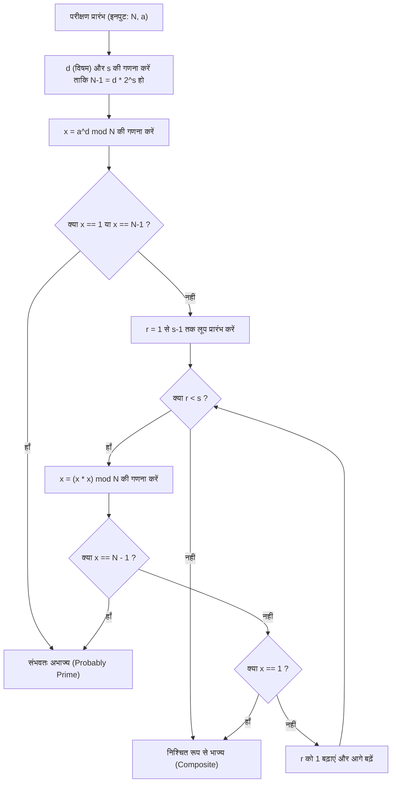
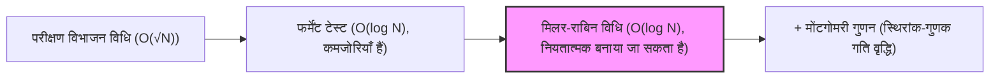

# परिचय: हमें तेज़ अभाज्य संख्या परीक्षण की आवश्यकता क्यों है?

सूचना विज्ञान, क्रिप्टोग्राफी, और प्रतिस्पर्धात्मक प्रोग्रामिंग की दुनिया में, "क्या कोई दी गई संख्या अभाज्य है या नहीं" का तेज़ी से और सटीक रूप से परीक्षण करना एक अत्यंत महत्वपूर्ण और मौलिक कार्य है। उदाहरण के लिए, RSA जैसी सार्वजनिक-कुंजी क्रिप्टोग्राफी, जो आधुनिक इंटरनेट समाज की सुरक्षा को बनाए रखती है, बड़ी अभाज्य संख्याओं के निर्माण और उनके गुणन की कठिनाई (अभाज्य गुणनखंडन की कठिनाई) पर अपनी सुरक्षा के लिए निर्भर करती है। इसलिए, यह कहना अतिशयोक्ति नहीं होगी कि किसी विशाल संख्या के अभाज्य होने की तुरंत पहचान करने की तकनीक हमारी डिजिटल दुनिया की नींव का समर्थन करने वाली तकनीक है।

इसके अलावा, प्रतिस्पर्धात्मक प्रोग्रामिंग (जैसे AtCoder और Codeforces) में अभाज्य संख्या परीक्षण एक लगातार आने वाला विषय है। ऐसे परिदृश्यों में जहाँ आपको 1 सेकंड के भीतर $N \le 10^{18}$ जैसे विशाल इनपुट बाधाओं के लिए हज़ारों बार अभाज्य परीक्षण करने होते हैं, पारंपरिक और सरल एल्गोरिदम पूरी तरह से विफल हो जाएंगे और समय सीमा पार (Time Limit Exceeded: TLE) हो जाएगी।

इस लेख में, हम एक सरल अभाज्य परीक्षण एल्गोरिदम से शुरुआत करेंगे, संभाव्य अभाज्य परीक्षण पद्धति "फर्मेंट टेस्ट (Fermat Primality Test)" पर जाएंगे, और फिर "मिलर-राबिन (Miller-Rabin) अभाज्य परीक्षण पद्धति" को कवर करेंगे, जो एक व्यावहारिक रूप से शक्तिशाली और तेज़ एल्गोरिदम है जिसने फर्मेंट टेस्ट की कमजोरियों को दूर किया है। हम गणितीय पृष्ठभूमि से लेकर C++ में अत्यधिक अनुकूलित कार्यान्वयन तक सब कुछ विस्तार से समझाएंगे। विशेष रूप से, 64-बिट पूर्णांकों ($N < 2^{64}$) के लिए, हम न केवल संभाव्य परीक्षण की व्याख्या करेंगे, बल्कि एक "नियतात्मक परीक्षण (Deterministic Test)" की भी व्याख्या करेंगे जो 100% निश्चितता के साथ अभाज्य परीक्षण कर सकता है, और अभ्यास में उपयोग के लिए तैयार C++ सोर्स कोड प्रदान करेंगे।

---

# 1. अभाज्य परीक्षण की मूल बातें और परीक्षण विभाजन विधि (Trial Division)

अभाज्य संख्या (Prime number) 2 या उससे बड़ी वह प्राकृत संख्या है जिसके 1 और स्वयं के अलावा कोई धनात्मक भाजक नहीं होते हैं। अभाज्य संख्या की परिभाषा का कड़ाई से पालन करते हुए, यह निर्धारित करने के लिए कि कोई पूर्णांक $N$ अभाज्य है या नहीं, हम $N$ को $2$ से $N-1$ तक के सभी पूर्णांकों से विभाजित करने का प्रयास कर सकते हैं। यदि यह किसी से भी विभाज्य नहीं है, तो यह एक अभाज्य संख्या है; यदि यह एक बार भी विभाज्य हो जाता है, तो इसे एक भाज्य संख्या (अभाज्य नहीं) माना जा सकता है।

हालाँकि, इस पद्धति की समय जटिलता $O(N)$ है, और जब $N$ $10^{18}$ जैसी विशाल संख्या होती है, तो आधुनिक कंप्यूटरों को भी इसकी गणना करने में बहुत अधिक समय लगेगा।

## परीक्षण विभाजन का अनुकूलन: $\sqrt{N}$ तक खोजना

जब एक भाज्य संख्या $N$ को $a \times b = N$ ($a \le b$) के रूप में व्यक्त किया जाता है, तो यह हमेशा सत्य होता है कि $a \le \sqrt{N}$। इसलिए, अभाज्य परीक्षण लूप को $N-1$ तक चलाने की कोई आवश्यकता नहीं है; $\sqrt{N}$ तक जाँचना पर्याप्त है।

```cpp
#include <iostream>

// परीक्षण विभाजन विधि द्वारा अभाज्य परीक्षण (O(sqrt(N)))
bool is_prime_trial_division(long long n) {
    if (n <= 1) return false;
    if (n == 2 || n == 3) return true;
    if (n % 2 == 0) return false;
    
    // केवल 3 या उससे बड़ी विषम संख्याओं की जाँच करें
    for (long long i = 3; i * i <= n; i += 2) {
        if (n % i == 0) return false;
    }
    return true;
}
```

इस एल्गोरिदम की समय जटिलता $O(\sqrt{N})$ है। यदि $N \le 10^{12}$ है, तो इसकी गणना तुरंत की जा सकती है। हालाँकि, जब $N \approx 10^{18}$ होता है, तो लूप पुनरावृत्तियों की संख्या लगभग $10^9$ हो जाती है। यहाँ तक कि C++ के साथ भी, इसमें सैकड़ों मिलीसेकंड से लेकर कुछ सेकंड तक का समय लगता है, जो इसे कई परीक्षणों के लिए अनुपयुक्त बनाता है।

---

# 2. फर्मेंट टेस्ट: संभाव्य अभाज्य परीक्षण की शुरुआत

परीक्षण विभाजन विधि की सीमाओं को पार करने के लिए, संख्या सिद्धांत के प्रमेयों का उपयोग करके "संभाव्य एल्गोरिदम (Probabilistic Algorithm)" तैयार किए गए थे। इसका एक प्रमुख उदाहरण "फर्मेंट टेस्ट (Fermat Primality Test)" है, जो फर्मेंट के छोटे प्रमेय (Fermat's Little Theorem) का उपयोग करता है।

## फर्मेंट का छोटा प्रमेय (Fermat's Little Theorem)

पियरे डी फर्मेंट (Pierre de Fermat) द्वारा खोजा गया यह प्रमेय निम्नलिखित बताता है:

> किसी भी अभाज्य संख्या $p$ और किसी भी पूर्णांक $a$ जो कि $p$ का गुणज नहीं है (अर्थात् $a$ और $p$ सह-अभाज्य हैं), के लिए निम्नलिखित सर्वांगसमता (congruence) लागू होती है:
> $$ a^{p-1} \equiv 1 \pmod p $$

इस प्रमेय का प्रतिधनात्मक (contrapositive) लेने पर, हम कह सकते हैं कि "यदि कोई पूर्णांक $N$ और एक पूर्णांक $a$ जो $N$ के साथ सह-अभाज्य है, ऐसा है कि $a^{N-1} \not\equiv 1 \pmod N$, तो $N$ निश्चित रूप से एक भाज्य संख्या है।" इस गुण का उपयोग करते हुए, फर्मेंट टेस्ट परीक्षण की जाने वाली संख्या $N$ के लिए एक यादृच्छिक आधार (base) $a$ चुनता है, $a^{N-1} \pmod N$ की गणना करता है, और जाँचता है कि क्या यह $1$ के बराबर है।

## तेज़ मॉड्यूलर एक्सपोनेंशिएशन (बाइनरी एक्सपोनेंशिएशन)

फर्मेंट टेस्ट करने के लिए, हमें $a^{N-1} \pmod N$ की विशाल घात की तेज़ी से गणना करने की आवश्यकता है। इसके लिए, हम "बाइनरी एक्सपोनेंशिएशन (Modular Exponentiation / Binary Exponentiation)" का उपयोग करते हैं। इसकी समय जटिलता $O(\log N)$ है, जो बहुत तेज़ है।

```cpp
// बाइनरी एक्सपोनेंशिएशन का उपयोग करके a^b mod m की गणना
long long mod_pow(long long a, long long b, long long m) {
    long long res = 1;
    a %= m;
    while (b > 0) {
        if (b & 1) res = (__int128_t)res * a % m;
        a = (__int128_t)a * a % m;
        b >>= 1;
    }
    return res;
}
```
※ यहाँ, अतिप्रवाह (overflow) को रोकने के लिए, हम मध्यवर्ती गुणनफलों को बनाए रखने के लिए GCC/Clang एक्सटेंशन `__int128_t` (128-बिट पूर्णांक) का उपयोग करते हैं।

## छद्म अभाज्य (Pseudoprimes) और कार्माइकल संख्याएँ (Carmichael Numbers)

फर्मेंट टेस्ट बहुत शक्तिशाली है, लेकिन इसकी एक बड़ी कमजोरी है। ऐसी संख्याएँ मौजूद हैं जहाँ $N$ एक भाज्य संख्या है, फिर भी सभी $a$ ($N$ के साथ सह-अभाज्य) के लिए $a^{N-1} \equiv 1 \pmod N$ सत्य होता है।

ऐसी संख्याओं को "निरपेक्ष छद्म अभाज्य (Absolute Pseudoprimes)" या "कार्माइकल संख्याएँ (Carmichael Numbers)" कहा जाता है। सबसे छोटी कार्माइकल संख्या $561 = 3 \times 11 \times 17$ है।
कार्माइकल संख्याओं के अस्तित्व के कारण, अकेले फर्मेंट टेस्ट "100% संभाव्यता" के साथ नियतात्मक परीक्षण नहीं कर सकता है। आप कितने भी अलग-अलग $a$ आज़मा लें, $561$ जैसी संख्या हमेशा अभाज्य संख्या होने का नाटक करके आपको धोखा देगी।

---

# 3. मिलर-राबिन अभाज्य परीक्षण (Miller-Rabin Primality Test)

"मिलर-राबिन अभाज्य परीक्षण", जिसे गैरी एल. मिलर (Gary L. Miller) और माइकल ओ. राबिन (Michael O. Rabin) द्वारा तैयार किया गया था, फर्मेंट टेस्ट की कमजोरी (कार्माइकल संख्याओं का अस्तित्व) को शानदार ढंग से पार करता है।
वर्तमान में, यह विभिन्न प्रोग्रामिंग भाषाओं की आंतरिक लाइब्रेरीज़ और क्रिप्टोग्राफ़िक प्रणालियों में कुंजी निर्माण के लिए एक व्यावहारिक, तेज़ अभाज्य परीक्षण एल्गोरिदम के रूप में सबसे व्यापक रूप से उपयोग किया जाता है।

## गणितीय सिद्धांत

मिलर-राबिन एल्गोरिदम फर्मेंट के छोटे प्रमेय का उपयोग करता है, साथ ही इस गुण का भी कि "एक अभाज्य संख्या पर आधारित परिमित क्षेत्र ($\mathbb{Z}/p\mathbb{Z}$) में, $x^2 \equiv 1 \pmod p$ के समाधान केवल $x \equiv 1$ या $x \equiv -1$ तक ही सीमित हैं" (जब मापांक एक भाज्य संख्या है, तो अन्य गैर-तुच्छ वर्गमूल मौजूद हो सकते हैं)।

जिस विषम संख्या $N$ का हम परीक्षण करना चाहते हैं, उसमें से $1$ घटाने पर $N-1$ हमेशा एक सम संख्या होगी। इसलिए, हम $N-1$ को $2$ से तब तक विभाजित करते हैं जब तक संभव हो, और इसे निम्न रूप में व्यक्त करते हैं:
$$ N-1 = d \cdot 2^s $$
(जहाँ $d$ एक विषम संख्या है, और $s \ge 1$)

किसी भी आधार $a$ ($1 < a < N-1$) के लिए, हम फर्मेंट के छोटे प्रमेय के अनुसार जाँचते हैं कि क्या $a^{N-1} \equiv 1 \pmod N$ है, लेकिन हम इस गणना को चरणों में करते हैं।
विशेष रूप से, हम बार-बार वर्ग करते हैं: $a^d, a^{d \cdot 2}, a^{d \cdot 4}, \ldots, a^{d \cdot 2^s}$ क्रम में।

मिलर-राबिन परीक्षण $N$ को "एक अभाज्य" (या "प्रबल संभावना के साथ एक अभाज्य") मानता है यदि निम्न स्थितियों में से **कोई भी** सत्य है:

1. $a^d \equiv 1 \pmod N$
2. एक ऐसा $r$ ($0 \le r < s$) मौजूद है जिसके लिए $a^{d \cdot 2^r} \equiv -1 \pmod N$ लागू होता है।
   ※ C++ में मॉड्यूलर अंकगणित में, $-1 \pmod N$, $N-1$ के बराबर होता है।

यदि $N$ एक अभाज्य संख्या है, तो यह स्थिति निश्चित रूप से किसी भी $a$ के लिए पूरी होगी। इसके विपरीत, यदि $N$ एक भाज्य संख्या है, तो गणितीय रूप से यह सिद्ध हो चुका है कि जब यादृच्छिक रूप से $a$ चुना जाता है, तो इस स्थिति के पूरा होने (धोखा खाने) की संभावना $\frac{1}{4}$ या उससे कम होती है।
यदि आप $k$ स्वतंत्र परीक्षण करते हैं, तो गलत सकारात्मक (false positive) की संभावना $\left(\frac{1}{4}\right)^k$ या उससे कम हो जाती है, जिसे व्यावहारिक रूप से शून्य माना जा सकता है। कार्माइकल संख्याओं जैसी कोई "ऐसी संख्याएँ नहीं हैं जो हमेशा धोखा दे सकें"।

## मिलर-राबिन एल्गोरिदम का प्रवाह (मर्मेड फ़्लोचार्ट)

नीचे दिया गया आरेख मिलर-राबिन अभाज्य परीक्षण में एक एकल परीक्षण (एक आधार $a$ के लिए परीक्षण) के तार्किक प्रवाह को दर्शाता है।



---

# 4. 64-बिट पूर्णांकों के लिए नियतात्मक परीक्षण (Deterministic Testing)

मिलर-राबिन अभाज्य परीक्षण मूल रूप से एक "संभाव्य" एल्गोरिदम है, लेकिन यदि $N$ की ऊपरी सीमा तय है, तो आप विशिष्ट $a$ (आधार) के सेट का परीक्षण करके "100% निश्चितता" के साथ अभाज्य परीक्षण कर सकते हैं।
इसे **नियतात्मक मिलर-राबिन परीक्षण (Deterministic Miller-Rabin Test)** कहा जाता है।

जिम सिंक्लेयर (Jim Sinclair) और अन्य लोगों के शोध से पता चला है कि $N < 2^{64}$ (लगभग $1.8 \times 10^{19}$) के सभी पूर्णांकों के लिए, आधार $a$ के रूप में निम्नलिखित $7$ अभाज्य संख्याओं का परीक्षण करना एक पूर्ण और पूरी तरह से नियतात्मक निर्णय लेने के लिए पर्याप्त है।

**परीक्षण किए जाने वाले आधार $a$ की सूची:**
`{2, 325, 9375, 28178, 450775, 9780504, 1795265022}`

वैकल्पिक रूप से, एक अन्य प्रसिद्ध सेट के रूप में, निम्नलिखित $12$ अभाज्य संख्याओं का उपयोग करना भी $N < 2^{64}$ से नीचे के परीक्षणों के लिए पूरी तरह से काम करता है।
`{2, 3, 5, 7, 11, 13, 17, 19, 23, 29, 31, 37}`

इस बार, एल्गोरिदम की सादगी और विश्वसनीयता में सुधार करने के लिए, हम एक ऐसा दृष्टिकोण अपनाएंगे जो आधार के रूप में बाद की $12$ अभाज्य संख्याओं (या अधिक अनुकूलित $7$ आधारों) का उपयोग करता है। C++ कार्यान्वयन में, हम सशर्त शाखाओं के साथ श्रेणियों को विभाजित करके परीक्षणों की संख्या को कम करने के लिए इसे अनुकूलित करेंगे।

---

# 5. C++ के साथ अत्यधिक अनुकूलित कार्यान्वयन (Highly Optimized C++ Implementation)

अब, चलिए अब तक के गणितीय सिद्धांत और एल्गोरिदम डिज़ाइन को संकलित करते हैं, और आधुनिक C++ में उच्चतम स्तर के मिलर-राबिन अभाज्य परीक्षण फ़ंक्शन के कार्यान्वयन कोड को प्रस्तुत करते हैं।

## कार्यान्वयन के मुख्य बिंदु
1. **64-बिट पूर्णांक गुणन में अतिप्रवाह से बचना:**
   जब $N \approx 10^{18}$, मॉड्यूलर गुणन में $x \times x$ अधिकतम $10^{36}$ तक पहुँच सकता है, जो सामान्य 64-बिट पूर्णांकों (`uint64_t` या `long long`) के अधिकतम मान $1.8 \times 10^{19}$ को आसानी से पार कर जाएगा।
   इस समस्या को हल करने के लिए, हम GCC और Clang एक्सटेंशन प्रकार `__int128_t` (या `unsigned __int128`) का उपयोग करते हैं ताकि 128-बिट सटीकता के साथ गणना की जा सके और फिर मॉड्यूलो लिया जा सके। यह बिना जटिल एल्गोरिदम के तेज़ मॉड्यूलर गुणन को संभव बनाता है।

2. **नियतात्मक आधारों का चयन:**
   जब $N$ का मान छोटा होता है, तो हम इसे अनुकूलित करते हैं ताकि हमें केवल कुछ आधारों का परीक्षण करना पड़े।

## संपूर्ण C++ सोर्स कोड

नीचे उत्पादन के लिए तैयार संपूर्ण सोर्स कोड दिया गया है। आप इस कोड को सीधे कॉपी करके प्रतिस्पर्धात्मक प्रोग्रामिंग जैसे वातावरण में उपयोग कर सकते हैं।

```cpp
#include <iostream>
#include <vector>
#include <cstdint>
#include <initializer_list>

using namespace std;

// 128-बिट पूर्णांक का उपयोग करके तेज़ (a * b) mod m
inline uint64_t mod_mul(uint64_t a, uint64_t b, uint64_t m) {
    return (uint64_t)((unsigned __int128)a * b % m);
}

// बाइनरी एक्सपोनेंशिएशन द्वारा (base^exp) mod m की गणना
uint64_t mod_pow(uint64_t base, uint64_t exp, uint64_t m) {
    uint64_t res = 1;
    base %= m;
    while (exp > 0) {
        if (exp & 1) res = mod_mul(res, base, m);
        base = mod_mul(base, base, m);
        exp >>= 1;
    }
    return res;
}

// मिलर-राबिन अभाज्य परीक्षण द्वारा 64-बिट पूर्णांकों का नियतात्मक परीक्षण
bool is_prime_miller_rabin(uint64_t n) {
    // सीमा मानों और छोटी अभाज्य संख्याओं की पूर्व-जाँच
    if (n < 2) return false;
    if (n == 2 || n == 3 || n == 5 || n == 7) return true;
    if (n % 2 == 0 || n % 3 == 0 || n % 5 == 0 || n % 7 == 0) return false;

    // n-1 को d * 2^s के रूप में विघटित करें
    uint64_t d = n - 1;
    int s = 0;
    while ((d & 1) == 0) {
        d >>= 1;
        s++;
    }

    // परीक्षण के लिए उपयोग किए जाने वाले आधारों (bases) की सूची
    // N के आकार के अनुसार परीक्षण किए जाने वाले आधारों की संख्या को कम करने के लिए अनुकूलन
    vector<uint64_t> bases;
    if (n < 4759123141ULL) {
        bases = {2, 7, 61};
    } else if (n < 1122004669633ULL) {
        bases = {2, 13, 23, 1662803};
    } else {
        // N < 2^64 की सभी संख्याओं के लिए नियतात्मक होने वाले 7 आधार
        bases = {2, 325, 9375, 28178, 450775, 9780504, 1795265022};
    }

    // प्रत्येक आधार के लिए परीक्षण चलाएँ
    for (uint64_t a : bases) {
        a %= n;
        if (a == 0) continue; // यदि a, n का गुणज है, तो परीक्षण अनिश्चित है, लेकिन यह अभाज्य नहीं है

        uint64_t x = mod_pow(a, d, n);
        if (x == 1 || x == n - 1) continue; // पहली शर्त पूरी हो गई, अगले आधार पर जाएँ

        bool composite = true;
        // s-1 बार लूप करें (x = x^2 mod n)
        for (int r = 1; r < s; r++) {
            x = mod_mul(x, x, n);
            if (x == n - 1) {
                composite = false; // दूसरी शर्त पूरी हो गई, अभाज्य होने की संभावना है
                break;
            }
        }
        
        // यदि कोई भी शर्त पूरी नहीं होती है, तो यह निश्चित रूप से भाज्य है
        if (composite) return false;
    }

    // यदि सभी आधारों के लिए शर्तें पूरी हो जाती हैं, तो यह निश्चित रूप से अभाज्य है
    return true;
}

int main() {
    // परीक्षण के लिए नमूने
    vector<uint64_t> test_cases = {
        1000000007,           // प्रसिद्ध अभाज्य संख्या
        998244353,            // प्रसिद्ध अभाज्य संख्या
        1000000000000000003,  // 10^18 के आसपास अभाज्य संख्या
        1000000000000000007,  // भाज्य संख्या (10^18 + 7)
        561,                  // कार्माइकल संख्या (भाज्य)
        18446744073709551557ULL // 2^64 के आसपास की सबसे बड़ी अभाज्य संख्याओं में से एक
    };

    for (uint64_t n : test_cases) {
        cout << n << " is " 
             << (is_prime_miller_rabin(n) ? "Prime" : "Composite") 
             << endl;
    }

    return 0;
}
```

---

# 6. एल्गोरिदम समय जटिलता और प्रदर्शन मूल्यांकन

आइए हमारे द्वारा कार्यान्वित किए गए एल्गोरिदम के प्रदर्शन पर विचार करें।

## समय जटिलता (Time Complexity)
* **परीक्षण विभाजन विधि:** $O(\sqrt{N})$
* **फर्मेंट टेस्ट:** घातांक की गणना $O(\log N) \times k$ ($k$ परीक्षणों की संख्या है)
* **मिलर-राबिन विधि:** घातांक और लूप की गणना $O(\log N) \times k$

64-बिट वातावरण ($N \le 2^{64}$) में, ऊपर दी गई नियतात्मक मिलर-राबिन विधि अधिकतम केवल $7$ आधारों की पुष्टि करती है। इसलिए, $k \le 7$ को एक स्थिरांक माना जा सकता है, और समग्र समय जटिलता सख्ती से $O(\log N)$ बन जाती है।
यहाँ तक कि अधिकतम मामले ($N \approx 10^{19}$) में भी, निष्पादन के चरणों की संख्या अधिकतम $7 \times 64 = 448$ बुनियादी परिचालनों के भीतर रहती है, और निष्पादन का समय कुछ माइक्रोसेकंड ($10^{-6}$ सेकंड) या उससे कम है। परीक्षण विभाजन विधि की $O(\sqrt{N})$ (लूप पुनरावृत्तियाँ $\approx 4 \times 10^9$ बार) की तुलना में, **लाखों गुना की गति में वृद्धि** प्राप्त की गई है।

## आगे का अनुकूलन: मोंटगोमरी गुणन (Montgomery Multiplication)

इस लेख के कार्यान्वयन में, हम विभाजन (मॉड्यूलो ऑपरेशन `%`) करने के लिए 128-बिट पूर्णांक एक्सटेंशन प्रकार `__int128_t` का उपयोग कर रहे हैं। यहाँ तक कि आधुनिक CPU में भी, पूर्णांक विभाजन (DIV निर्देश) एक महँगा निर्देश है जिसमें जोड़ या गुणा की तुलना में दर्जनों चक्र लगते हैं।

लाइब्रेरी निर्माता और प्रतिस्पर्धी प्रोग्रामर जो और भी अधिक चरम अनुकूलन चाहते हैं, वे कभी-कभी **मोंटगोमरी गुणन (Montgomery Multiplication)** नामक एक तकनीक अपनाते हैं। मोंटगोमरी गुणन एक अद्भुत एल्गोरिदम है जो संख्याओं को एक विशेष "मोंटगोमरी स्पेस" में मैप करके महँगे मॉड्यूलर ऑपरेशन्स (विभाजन) को "केवल बिट शिफ्ट्स और गुणन" से बदल देता है।
इसे मिलर-राबिन परीक्षण के मॉड्यूलर गुणन में शामिल करके, निष्पादन की गति को 2 से 3 गुना और बढ़ाया जा सकता है। चूँकि यह बहुत ही गहरा विषय है, मैं इसे किसी अन्य लेख में विस्तार से समझाना चाहूँगा।

---

# 7. निष्कर्ष

इस लेख में, हमने एक ही बार में अभाज्य परीक्षण की मूल बातों से लेकर उन्नत विषयों तक सब कुछ समझाया है।
आइए मुख्य बिंदुओं को दोहराते हैं:

1. **परीक्षण विभाजन विधि (Trial Division)** निश्चित है, लेकिन इसकी समय जटिलता $O(\sqrt{N})$ है, जो $N$ के $10^{12}$ से अधिक होने पर इसे अव्यावहारिक बना देती है।
2. **फर्मेंट टेस्ट** बहुत तेज़ है, $O(\log N)$, लेकिन इसकी एक बड़ी कमजोरी है कि यह कार्माइकल संख्याओं जैसे निरपेक्ष छद्म अभाज्यों से धोखा खा जाता है।
3. **मिलर-राबिन अभाज्य परीक्षण** एक व्यावहारिक और बहुत शक्तिशाली एल्गोरिदम है जो फर्मेंट टेस्ट की कमजोरी को दूर करता है।
4. C++ कार्यान्वयन में, `__int128_t` का उपयोग 64-बिट पूर्णांक गुणन अतिप्रवाह को सुरक्षित रूप से संभालने की अनुमति देता है।
5. 64-बिट पूर्णांक सीमा ($N < 2^{64}$) के भीतर, आधार के रूप में $7$ या $12$ विशिष्ट अभाज्य संख्याओं का चयन करके, संभाव्य के बजाय **नियतात्मक रूप से (100% सटीक) अभाज्य परीक्षण करना संभव है**।

बड़ी संख्याओं से जुड़ी गणनाओं में तेज़ अभाज्य परीक्षण एक अपरिहार्य तकनीक है। इस लेख में दिया गया C++ मिलर-राबिन सोर्स कोड मज़बूत है और इसे अभ्यास में उसी तरह उपयोग किया जा सकता है। कृपया बेझिझक इसे अपनी स्वयं की परियोजनाओं या एल्गोरिदम प्रतियोगिताओं में उपयोग करें।



एल्गोरिदम की दुनिया, जहाँ प्रोग्रामिंग और गणित प्रतिच्छेद करते हैं, बहुत सुंदर और गहरी है। मुझे आशा है कि यह लेख आपके भविष्य के अध्ययन में मदद करेगा।

---
*Reference:*
- *Pomerance, C., Selfridge, J. L., & Wagstaff, S. S. (1980). The pseudoprimes to 25.10^9. Mathematics of Computation.*
- *Sinclair, J. (2011). Deterministic Miller-Rabin primality testing.*
