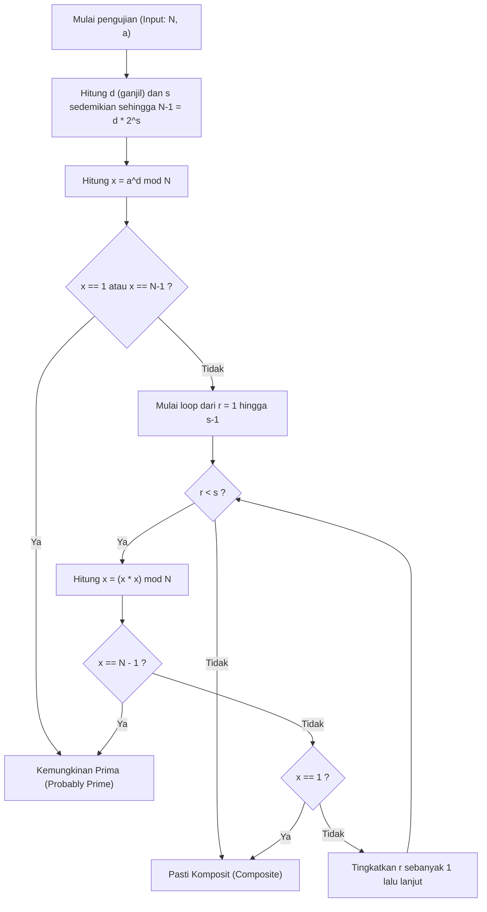
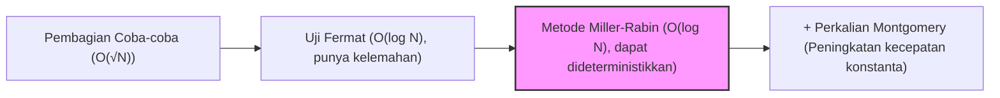

# Pendahuluan: Mengapa Pengujian Keprimaan yang Cepat Diperlukan?

Dalam ilmu komputer, kriptografi, atau pemrograman kompetitif, menentukan secara cepat dan akurat "apakah suatu bilangan adalah bilangan prima" merupakan tugas yang sangat penting dan mendasar. Misalnya, kriptografi kunci publik seperti RSA, yang mendasari keamanan masyarakat internet modern, mendasarkan keamanannya pada pembuatan bilangan prima yang besar dan kesulitan mengalikannya (kesulitan faktorisasi prima). Oleh karena itu, teknologi untuk secara instan membedakan apakah bilangan yang sangat besar adalah bilangan prima atau bukan, bisa dikatakan sebagai teknologi yang menopang fondasi masyarakat digital.

Selain itu, dalam pemrograman kompetitif (seperti AtCoder atau Codeforces), pengujian keprimaan adalah tema yang sering muncul. Untuk input besar dengan batasan seperti $N \le 10^{18}$, dalam situasi di mana puluhan ribu uji keprimaan perlu dilakukan dalam waktu 1 detik, algoritma tradisional dan naif tidak akan pernah bisa memenuhi batas waktu (Time Limit Exceeded: TLE).

Artikel ini akan membahas secara menyeluruh, mulai dari latar belakang matematika hingga implementasi yang sangat dioptimalkan dalam C++, dari algoritma pengujian keprimaan naif, lalu "Uji Fermat" yang merupakan metode pengujian keprimaan probabilistik, dan algoritma pengujian sangat cepat tingkat paling praktis yang mengatasi kelemahannya: "Uji Keprimaan Miller-Rabin". Khususnya untuk bilangan bulat 64-bit ($N < 2^{64}$), artikel ini akan menjelaskan secara rinci bukan hanya pengujian probabilistik tetapi juga metode untuk "100% pasti melakukan pengujian keprimaan (pengujian deterministik)", dan menyediakan kode sumber C++ yang dapat langsung digunakan dalam praktik.

---

# 1. Dasar-dasar Pengujian Keprimaan dan Pembagian Coba-coba (Trial Division)

Bilangan prima (Prime number) adalah bilangan asli lebih besar dari 1 yang tidak memiliki pembagi positif selain 1 dan dirinya sendiri. Mengikuti definisi bilangan prima secara ketat, untuk menguji apakah suatu bilangan bulat $N$ adalah bilangan prima, kita bisa membagi $N$ dengan semua bilangan bulat dari $2$ hingga $N-1$. Jika tidak pernah habis dibagi, maka ia adalah bilangan prima; jika habis dibagi walau hanya sekali, maka ia adalah bilangan komposit (bukan bilangan prima).

Namun, metode ini memiliki kompleksitas waktu $O(N)$. Jika $N$ adalah bilangan besar seperti $10^{18}$, bahkan komputer modern pun akan membutuhkan waktu yang sangat lama untuk menghitungnya.

## Optimasi Pembagian Coba-coba: Pencarian hingga $\sqrt{N}$

Ketika bilangan komposit $N$ dinyatakan sebagai $a \times b = N$ ($a \le b$), maka selalu berlaku $a \le \sqrt{N}$. Oleh karena itu, loop pengujian keprimaan tidak perlu dijalankan hingga $N-1$; cukup memeriksa hingga $\sqrt{N}$ sudah memadai.

```cpp
#include <iostream>

// Uji keprimaan dengan pembagian coba-coba (O(sqrt(N)))
bool is_prime_trial_division(long long n) {
    if (n <= 1) return false;
    if (n == 2 || n == 3) return true;
    if (n % 2 == 0) return false;
    
    // Hanya periksa bilangan ganjil 3 atau lebih
    for (long long i = 3; i * i <= n; i += 2) {
        if (n % i == 0) return false;
    }
    return true;
}
```

Kompleksitas waktu dari algoritma ini adalah $O(\sqrt{N})$. Jika $N \le 10^{12}$, ia dapat dihitung dalam sekejap, tetapi jika $N \approx 10^{18}$, jumlah perulangan menjadi sekitar $10^9$ kali, dan bahkan implementasi C++ membutuhkan waktu ratusan milidetik hingga beberapa detik, membuatnya tidak cocok untuk evaluasi berulang.

---

# 2. Uji Fermat: Awal dari Pengujian Keprimaan Probabilistik

Untuk mengatasi batasan metode pembagian coba-coba, "Algoritma Probabilistik (Probabilistic Algorithm)" menggunakan teorema teori bilangan dirancang. Perwakilan dari ini adalah "Uji Keprimaan Fermat (Fermat Primality Test)", yang menggunakan Teorema Kecil Fermat.

## Teorema Kecil Fermat (Fermat's Little Theorem)

Teorema yang ditemukan oleh Pierre de Fermat ini menyatakan sebagai berikut.

> Untuk sembarang bilangan prima $p$ dan sembarang bilangan bulat $a$ yang koprima dengannya (bukan kelipatan $p$), kongruensi berikut berlaku.
> $$ a^{p-1} \equiv 1 \pmod p $$

Mengambil kontraposisi dari teorema ini, kita dapat mengatakan bahwa "Untuk suatu bilangan bulat $N$ dan bilangan bulat $a$ yang koprima dengan $N$, jika $a^{N-1} \not\equiv 1 \pmod N$, maka $N$ pasti bilangan komposit". Menggunakan properti ini, Uji Fermat memilih basis (base) acak $a$ untuk bilangan $N$ yang akan diuji, lalu menghitung $a^{N-1} \pmod N$ dan memeriksa apakah hasilnya $1$.

## Eksponensiasi Modular Cepat (Exponentiation by Squaring)

Untuk melakukan Uji Fermat, perhitungan eksponensiasi yang besar $a^{N-1} \pmod N$ harus dihitung dengan cepat. "Eksponensiasi Modular (Modular Exponentiation / Binary Exponentiation)" digunakan untuk ini. Kompleksitas waktunya adalah $O(\log N)$, membuatnya sangat cepat.

```cpp
// Menghitung a^b mod m menggunakan eksponensiasi modular
long long mod_pow(long long a, long long b, long long m) {
    long long res = 1;
    a %= m;
    while (b > 0) {
        if (b & 1) res = (__int128_t)res * a % m;
        a = (__int128_t)a * a % m;
        b >>= 1;
    }
    return res;
}
```
* Di sini, untuk mencegah overflow, perkalian perantara dipertahankan menggunakan ekstensi GCC/Clang `__int128_t` (bilangan bulat 128-bit).

## Pseudoprima dan Bilangan Carmichael (Carmichael Numbers)

Uji Fermat sangat kuat, tetapi memiliki kelemahan yang fatal. Artinya, ada bilangan sedemikian rupa sehingga meskipun $N$ adalah komposit, $a^{N-1} \equiv 1 \pmod N$ berlaku untuk semua $a$ ($a$ koprima dengan $N$).

Bilangan semacam itu disebut "pseudoprima absolut (absolute pseudoprimes)" atau "Bilangan Carmichael". Bilangan Carmichael terkecil adalah $561 = 3 \times 11 \times 17$.
Karena adanya bilangan Carmichael, pengujian deterministik dengan "probabilitas 100%" tidak mungkin dilakukan hanya dengan Uji Fermat. Tidak peduli berapa banyak nilai $a$ berbeda yang dicoba, bilangan seperti $561$ akan selalu berpura-pura menjadi bilangan prima.

---

# 3. Uji Keprimaan Miller-Rabin (Miller-Rabin Primality Test)

"Uji Keprimaan Miller-Rabin", yang dirancang oleh Gary L. Miller dan Michael O. Rabin, dengan luar biasa mengatasi kelemahan Uji Fermat (adanya bilangan Carmichael).
Saat ini, ini paling banyak digunakan sebagai algoritma pengujian keprimaan berkecepatan tinggi yang praktis dalam perpustakaan internal berbagai bahasa pemrograman dan pembuatan kunci dalam sistem kriptografi.

## Prinsip Matematika

Selain Teorema Kecil Fermat, algoritma Miller-Rabin menggunakan properti bahwa "dalam bidang sisa (residual field) modulo bilangan prima ($\mathbb{Z}/p\mathbb{Z}$), solusi dari $x^2 \equiv 1 \pmod p$ terbatas pada $x \equiv 1$ atau $x \equiv -1$" (jika modulo bilangan komposit, mungkin ada akar kuadrat non-trivial lainnya).

Jika Anda mengurangi $1$ dari bilangan ganjil $N$ yang akan diuji, $N-1$ selalu menjadi genap. Oleh karena itu, $N-1$ dibagi dengan $2$ sebanyak mungkin, dan dinyatakan dalam bentuk berikut.
$$ N-1 = d \cdot 2^s $$
(Di mana $d$ ganjil dan $s \ge 1$)

Untuk basis acak $a$ ($1 < a < N-1$), diverifikasi apakah $a^{N-1} \equiv 1 \pmod N$ sesuai dengan Teorema Kecil Fermat, tetapi perhitungannya dilakukan secara bertahap.
Secara khusus, ini terus mengkuadratkan dalam urutan: $a^d, a^{d \cdot 2}, a^{d \cdot 4}, \ldots, a^{d \cdot 2^s}$.

Kondisi agar Uji Miller-Rabin menentukan $N$ sebagai "prima (atau kemungkinkan besar prima)" adalah jika **salah satu** dari hal berikut berlaku.

1. $a^d \equiv 1 \pmod N$
2. Terdapat suatu $r$ ($0 \le r < s$) sedemikian rupa sehingga $a^{d \cdot 2^r} \equiv -1 \pmod N$.
   * Dalam aritmatika modulo C++, $-1 \pmod N$ adalah $N-1$.

Jika $N$ adalah bilangan prima, kondisi ini pasti akan dipenuhi untuk sembarang $a$. Sebaliknya, jika $N$ adalah bilangan komposit, secara matematis terbukti bahwa ketika $a$ acak dipilih, probabilitas bahwa kondisi ini terpenuhi (probabilitas tertipu) kurang dari $\frac{1}{4}$.
Dengan $k$ pengujian independen, probabilitas positif palsu menjadi kurang dari $\left(\frac{1}{4}\right)^k$, yang pada praktiknya dapat dianggap nol. Tidak ada bilangan yang "benar-benar bisa menipu" seperti bilangan Carmichael.

## Alur Algoritma Metode Miller-Rabin (Flowchart Mermaid)

Gambar di bawah ini menunjukkan alur logika dari satu uji Miller-Rabin (uji untuk satu basis $a$).



---

# 4. Pengujian Deterministik untuk Bilangan Bulat 64-bit

Meskipun Uji Keprimaan Miller-Rabin pada asalnya adalah algoritma "probabilistik", saat batasan atas $N$ tetap, kita dapat melakukan pengujian keprimaan "100% pasti" dengan mencoba sekumpulan spesifik $a$ (basis).
Ini disebut **Uji Miller-Rabin Deterministik (Deterministic Miller-Rabin Test)**.

Penelitian oleh Jim Sinclair dan lainnya telah menunjukkan bahwa untuk semua bilangan bulat $N < 2^{64}$ (sekitar $1.8 \times 10^{19}$), pengujian yang cukup dan sepenuhnya deterministik dapat dicapai dengan menguji menggunakan $7$ bilangan prima berikut sebagai basis $a$.

**Daftar basis $a$ yang akan diuji:**
`{2, 325, 9375, 28178, 450775, 9780504, 1795265022}`

Sebagai alternatif, pengujian sempurna untuk $N < 2^{64}$ dapat dilakukan dengan kumpulan yang banyak diketahui dengan menggunakan $12$ bilangan prima berikut.
`{2, 3, 5, 7, 11, 13, 17, 19, 23, 29, 31, 37}`

Kali ini, untuk meningkatkan kesederhanaan dan keandalan algoritma, kita akan menggunakan pendekatan yang memakai $12$ bilangan prima tersebut sebagai basis (atau pendekatan $7$ basis yang lebih optimal). Dalam implementasi C++, kita akan melakukan optimasi untuk meminimalkan jumlah tes dengan memisahkan rentang menggunakan pencabangan kondisi.

---

# 5. Implementasi Tingkat Lanjut di C++ (Highly Optimized C++ Implementation)

Sekarang, mari satukan teori matematika dan desain algoritma dari penjelasan di atas, dan menyajikan kode implementasi fungsi pengujian keprimaan Miller-Rabin tingkat paling kuat di C++ modern.

## Poin Penting Implementasi
1. **Menghindari Overflow pada Perkalian Bilangan Bulat 64-bit:**
   Ketika $N \approx 10^{18}$, nilai dari $x \times x$ dalam perkalian modulo dapat mencapai hingga $10^{36}$, yang dengan mudah melewati nilai maksimum dari bilangan bulat 64-bit standar (`uint64_t` atau `long long`), yaitu $1.8 \times 10^{19}$.
   Untuk mengatasi masalah ini, kita menggunakan tipe data diperluas dari GCC dan Clang, yaitu `__int128_t` (atau `unsigned __int128`), dan setelah menghitung dengan akurasi 128-bit, kita akan memodulokannya. Ini memungkinkan perkalian sisa yang cepat tanpa menggunakan algoritma kompleks.

2. **Pemilihan Basis Deterministik:**
   Ketika nilai $N$ kecil, kita mengoptimalkannya sehingga hanya sedikit basis (base) yang perlu diuji.

## Kode Sumber C++ Lengkap

Berikut adalah kode sumber versi lengkap yang siap digunakan dalam praktiknya. Kode ini dapat langsung disalin dan digunakan dalam lingkungan seperti pemrograman kompetitif.

```cpp
#include <iostream>
#include <vector>
#include <cstdint>
#include <initializer_list>

using namespace std;

// (a * b) mod m yang cepat dengan bilangan bulat 128-bit
inline uint64_t mod_mul(uint64_t a, uint64_t b, uint64_t m) {
    return (uint64_t)((unsigned __int128)a * b % m);
}

// Menghitung (base^exp) mod m menggunakan eksponensiasi modular
uint64_t mod_pow(uint64_t base, uint64_t exp, uint64_t m) {
    uint64_t res = 1;
    base %= m;
    while (exp > 0) {
        if (exp & 1) res = mod_mul(res, base, m);
        base = mod_mul(base, base, m);
        exp >>= 1;
    }
    return res;
}

// Pengujian deterministik bilangan bulat 64bit menggunakan metode pengujian keprimaan Miller-Rabin
bool is_prime_miller_rabin(uint64_t n) {
    // Pengecekan awal untuk nilai batas dan bilangan prima kecil
    if (n < 2) return false;
    if (n == 2 || n == 3 || n == 5 || n == 7) return true;
    if (n % 2 == 0 || n % 3 == 0 || n % 5 == 0 || n % 7 == 0) return false;

    // Faktorisasi n-1 menjadi bentuk d * 2^s
    uint64_t d = n - 1;
    int s = 0;
    while ((d & 1) == 0) {
        d >>= 1;
        s++;
    }

    // Daftar basis yang digunakan untuk pengujian
    // Optimasi untuk meminimalkan jumlah basis yang diuji berdasarkan ukuran N
    vector<uint64_t> bases;
    if (n < 4759123141ULL) {
        bases = {2, 7, 61};
    } else if (n < 1122004669633ULL) {
        bases = {2, 13, 23, 1662803};
    } else {
        // 7 basis yang bersifat deterministik untuk semua bilangan N < 2^64
        bases = {2, 325, 9375, 28178, 450775, 9780504, 1795265022};
    }

    // Jalankan pengujian untuk setiap basis
    for (uint64_t a : bases) {
        a %= n;
        if (a == 0) continue; // Jika a kelipatan n, tak bisa diuji tapi ia bukan prima

        uint64_t x = mod_pow(a, d, n);
        if (x == 1 || x == n - 1) continue; // Kondisi 1 terpenuhi, lanjut ke basis berikutnya

        bool composite = true;
        // Loop sebanyak s-1 kali (x = x^2 mod n)
        for (int r = 1; r < s; r++) {
            x = mod_mul(x, x, n);
            if (x == n - 1) {
                composite = false; // Kondisi 2 terpenuhi, kemungkinan prima
                break;
            }
        }
        
        // Pasti komposit jika tak satu pun kondisi yang terpenuhi
        if (composite) return false;
    }

    // Pasti prima jika lolos kondisi di semua basis
    return true;
}

int main() {
    // Sampel uji coba
    vector<uint64_t> test_cases = {
        1000000007,           // Bilangan prima yang terkenal
        998244353,            // Bilangan prima yang terkenal
        1000000000000000003,  // Prima di sekitar 10^18
        1000000000000000007,  // Bilangan komposit (10^18 + 7)
        561,                  // Bilangan Carmichael (Bilangan komposit)
        18446744073709551557ULL // Salah satu bilangan prima terbesar di sekitar 2^64
    };

    for (uint64_t n : test_cases) {
        cout << n << " is " 
             << (is_prime_miller_rabin(n) ? "Prime" : "Composite") 
             << endl;
    }

    return 0;
}
```

---

# 6. Kompleksitas Algoritma dan Evaluasi Performa

Mari bahas performa dari algoritma yang diimplementasikan.

## Kompleksitas Waktu (Time Complexity)
* **Pembagian Coba-coba:** $O(\sqrt{N})$
* **Uji Fermat:** Penghitungan pangkat $O(\log N) \times k$ ($k$ adalah jumlah percobaan)
* **Metode Miller-Rabin:** Penghitungan pangkat dan loop $O(\log N) \times k$

Pada lingkungan 64-bit ($N \le 2^{64}$), metode Miller-Rabin deterministik di atas memeriksa paling banyak hanya $7$ basis. Oleh karena itu, kita dapat menganggap $k \le 7$ sebagai konstanta, dan keseluruhan kompleksitas waktu secara ketat adalah $O(\log N)$.
Bahkan untuk kasus maksimum ($N \approx 10^{19}$), jumlah eksekusi langkah tertahan pada maksimum $7 \times 64 = 448$ operasi dasar, dan waktu eksekusi kurang dari beberapa mikrodetik ($10^{-6}$ detik). Dibandingkan dengan $O(\sqrt{N})$ dari metode pembagian coba-coba (jumlah perulangan $\approx 4 \times 10^9$ kali), peningkatan kecepatannya mencapai **jutaan kali**.

## Optimasi Lebih Lanjut: Perkalian Montgomery (Montgomery Multiplication)

Dalam implementasi artikel ini, kita menggunakan tipe data diperluas `__int128_t` untuk bilangan bulat 128-bit dalam melakukan pembagian (operasi modulo `%`). Bahkan pada CPU modern, operasi pembagian bilangan bulat (instruksi DIV) adalah operasi berbiaya tinggi yang membutuhkan puluhan siklus dibandingkan dengan penambahan atau perkalian.

Pembuat pustaka dan pemrogram kompetitif yang mencari optimasi batas maksimal kadang menerapkan metode yang disebut **Perkalian Montgomery (Montgomery Multiplication)**. Perkalian Montgomery adalah algoritma luar biasa yang menggantikan operasi modulo berbiaya tinggi (pembagian) dengan "hanya pergeseran bit dan perkalian" dengan memetakan angka ke "ruang Montgomery" khusus.
Dengan menyematkan fungsi ini ke dalam perkalian modular uji Miller-Rabin, kecepatan eksekusi dapat ditingkatkan lebih jauh sekitar dua hingga tiga kali lipat. Karena topik ini sangat mendalam, kita akan membahasnya lebih rinci dalam artikel terpisah.

---

# 7. Kesimpulan

Artikel ini telah merangkum penjelasan lengkap mengenai pengujian keprimaan, mulai dari prinsip dasar hingga lanjutan.
Mari kita lihat kembali poin-poin utamanya.

1. **Metode pembagian coba-coba** sangat pasti, tetapi karena kompleksitas perhitungannya adalah $O(\sqrt{N})$, itu tidak praktis ketika $N$ lebih besar dari $10^{12}$.
2. **Uji Fermat** sangat cepat dengan $O(\log N)$, tetapi memiliki kelemahan fatal yaitu bisa tertipu oleh pseudoprima absolut seperti bilangan Carmichael.
3. **Uji Keprimaan Miller-Rabin** memecahkan kelemahan dari Uji Fermat, dan ini adalah algoritma paling kuat dan praktis.
4. Dalam implementasi C++, kita dapat menangani overflow secara aman dalam perkalian 64-bit menggunakan `__int128_t`.
5. Selama bilangan bulat berada dalam rentang 64-bit ($N < 2^{64}$), kita bisa membuat algoritmanya menjadi **deterministik (100% akurat) dan bukan probabilistik** dengan memilih sekumpulan tertentu $7$ atau $12$ bilangan prima sebagai basis.

Pengujian keprimaan berkecepatan tinggi adalah teknik yang tak terhindarkan saat melakukan komputasi yang menangani angka sangat besar. Kode sumber Miller-Rabin di C++ yang disediakan dalam artikel ini terbukti kuat untuk diterapkan langsung di praktik. Silakan gunakan untuk proyek atau kompetisi algoritma Anda sendiri.



Dunia algoritma tempat pemrograman dan matematika saling berpapasan sangat indah dan dalam. Semoga artikel ini bisa membantu proses belajar Anda.

---
*Referensi:*
- *Pomerance, C., Selfridge, J. L., & Wagstaff, S. S. (1980). The pseudoprimes to 25.10^9. Mathematics of Computation.*
- *Sinclair, J. (2011). Deterministic Miller-Rabin primality testing.*
