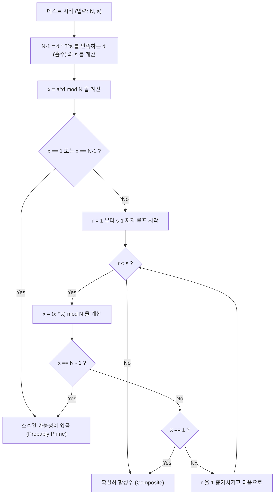

# 머리말：왜 고속 소수 판별이 필요한가

정보 과학이나 암호 이론, 혹은 경쟁 프로그래밍 세계에서 「어떤 수가 소수인지 아닌지」를 빠르고 정확하게 판별하는 것은 매우 중요하고 기초적인 과제입니다. 예를 들어 현대 인터넷 사회의 보안을 지탱하고 있는 RSA 암호 등의 공개키 암호 방식은 거대한 소수의 생성과 그 곱셈의 어려움(소인수 분해의 어려움)을 안전성의 근거로 삼고 있습니다. 따라서 거대한 수가 소수인지 순식간에 구별하는 기술은 디지털 사회의 근간을 지탱하는 기술이라고 해도 과언이 아닙니다.

또한, 경쟁 프로그래밍(AtCoder나 Codeforces 등)에서도 소수 판별은 자주 나오는 주제입니다. 제약이 $N \le 10^{18}$ 과 같은 거대한 입력에 대해 1초 이내에 소수 판별을 수만 번 수행해야 하는 상황에서는, 전통적이고 소박한 알고리즘으로는 도저히 계산 시간(Time Limit Exceeded: TLE)을 맞출 수 없습니다.

본 기사에서는 소박한 소수 판별 알고리즘부터 시작하여, 확률적 소수 판별법인 「페르마 테스트」, 그리고 그 약점을 극복한 실용상 최강 수준의 고속 알고리즘 「밀러-라빈 (Miller-Rabin) 소수 판별법」에 대해 수학적 배경부터 C++를 이용한 고도로 최적화된 구현까지 철저히 해설합니다. 특히, 64비트 정수($N < 2^{64}$)에 대해서는 확률적인 판별에 그치지 않고 「100% 확실하게 소수 판별을 할 수 있는(결정론적 판별)」 기법에 대해서도 자세히 설명하며, 실전에서 그대로 사용할 수 있는 C++ 소스 코드를 제공합니다.

---

# 1. 소수 판별의 기초와 시험 나눗셈 (Trial Division)

소수(Prime number)란 1과 자기 자신 이외에 양의 약수를 가지지 않는 2 이상의 자연수입니다. 소수의 정의를 충실히 따르면, 어떤 정수 $N$ 이 소수인지 판별하려면 $2$ 부터 $N-1$ 까지의 모든 정수로 $N$ 을 나누어 보고, 한 번도 나누어떨어지지 않으면 소수, 한 번이라도 나누어떨어지면 합성수(소수가 아님)라고 판단할 수 있습니다.

그러나 이 방법은 시간 복잡도가 $O(N)$ 이 되어, $N$ 이 $10^{18}$ 등과 같은 거대한 수일 경우 현대의 컴퓨터라도 계산에 방대한 시간이 걸립니다.

## 시험 나눗셈의 최적화：$\sqrt{N}$ 까지의 탐색

합성수 $N$ 이 $a \times b = N$ ($a \le b$)로 표현될 때, 반드시 $a \le \sqrt{N}$ 이 됩니다. 따라서 소수 판별 루프는 $N-1$ 까지 돌릴 필요 없이 $\sqrt{N}$ 까지 검사하면 충분합니다.

```cpp
#include <iostream>

// 시험 나눗셈을 통한 소수 판별 (O(sqrt(N)))
bool is_prime_trial_division(long long n) {
    if (n <= 1) return false;
    if (n == 2 || n == 3) return true;
    if (n % 2 == 0) return false;
    
    // 3 이상의 홀수만 검사
    for (long long i = 3; i * i <= n; i += 2) {
        if (n % i == 0) return false;
    }
    return true;
}
```

이 알고리즘의 시간 복잡도는 $O(\sqrt{N})$ 입니다. $N \le 10^{12}$ 정도라면 순식간에 계산할 수 있지만, $N \approx 10^{18}$ 인 경우 루프 횟수가 약 $10^9$ 번이 되어 C++ 환경이라도 수백 밀리초에서 수 초의 시간이 소요되므로 여러 번의 판별에는 부적합합니다.

---

# 2. 페르마 테스트：확률적 소수 판별의 서막

시험 나눗셈의 한계를 돌파하기 위해 고안된 것이 정수론의 정리를 이용한 「확률적 알고리즘 (Probabilistic Algorithm)」입니다. 그 대표적인 예가 페르마의 소정리를 이용한 「페르마 테스트 (Fermat Primality Test)」입니다.

## 페르마의 소정리 (Fermat's Little Theorem)

피에르 드 페르마(Pierre de Fermat)가 발견한 이 정리는 다음과 같이 주장합니다.

> 임의의 소수 $p$ 와, 서로 소인($p$ 의 배수가 아닌) 임의의 정수 $a$ 에 대해 다음 합동식이 성립한다.
> $$ a^{p-1} \equiv 1 \pmod p $$

이 정리의 대우를 취하면, 「어떤 정수 $N$ 과, $N$ 과 서로 소인 정수 $a$ 에 대해 $a^{N-1} \not\equiv 1 \pmod N$ 이 된다면, $N$ 은 확실히 합성수이다」라고 말할 수 있습니다. 이 성질을 이용하여, 판별 대상인 수 $N$ 에 대해 무작위 밑(base) $a$ 를 선택하고, $a^{N-1} \pmod N$ 을 계산하여 $1$ 이 되는지 확인하는 것이 페르마 테스트입니다.

## 고속 거듭제곱 나머지 (반복 제곱법)

페르마 테스트를 수행하기 위해서는 $a^{N-1} \pmod N$ 이라는 거대한 거듭제곱을 빠르게 계산해야 합니다. 여기에는 「반복 제곱법 (Modular Exponentiation / Binary Exponentiation)」을 사용합니다. 시간 복잡도는 $O(\log N)$ 이 되어 매우 빠릅니다.

```cpp
// 반복 제곱법을 이용한 a^b mod m 계산
long long mod_pow(long long a, long long b, long long m) {
    long long res = 1;
    a %= m;
    while (b > 0) {
        if (b & 1) res = (__int128_t)res * a % m;
        a = (__int128_t)a * a % m;
        b >>= 1;
    }
    return res;
}
```
※ 여기서는 오버플로우를 방지하기 위해 GCC/Clang의 확장인 `__int128_t` (128비트 정수)를 사용하여 중간 곱을 유지하고 있습니다.

## 유사 소수와 카마이클 수 (Carmichael Numbers)

페르마 테스트는 매우 강력하지만 치명적인 약점이 있습니다. 바로 $N$ 이 합성수임에도 불구하고, 모든 $a$ ($N$ 과 서로 소인 $a$)에 대해 $a^{N-1} \equiv 1 \pmod N$ 이 성립해버리는 수가 존재한다는 것입니다.

이러한 수를 「절대 유사 소수」 또는 「카마이클 수」라고 부릅니다. 가장 작은 카마이클 수는 $561 = 3 \times 11 \times 17$ 입니다.
카마이클 수가 존재하기 때문에 페르마 테스트만으로는 「확률 100%」의 결정론적 판별을 할 수 없습니다. 아무리 다른 $a$ 를 시도해도 $561$ 과 같은 수는 항상 소수인 척(속임수)을 합니다.

---

# 3. 밀러-라빈 소수 판별법 (Miller-Rabin Primality Test)

페르마 테스트의 약점(카마이클 수의 존재)을 훌륭하게 극복한 것이 밀러(Gary L. Miller)와 라빈(Michael O. Rabin)이 고안한 「밀러-라빈 소수 판별법」입니다.
현재 실용적인 고속 소수 판별 알고리즘으로서, 다양한 프로그래밍 언어의 내부 라이브러리나 암호 시스템의 키 생성에 가장 널리 사용되고 있습니다.

## 수학적 원리

밀러-라빈 알고리즘은 페르마의 소정리에 더해, 「소수를 법으로 하는 잉여체($\mathbb{Z}/p\mathbb{Z}$)에서는 $x^2 \equiv 1 \pmod p$ 의 해는 $x \equiv 1$ 또는 $x \equiv -1$ 로 제한된다」는 성질을 이용합니다 (합성수를 법으로 하는 경우에는 이외의 비자명한 제곱근이 존재할 수 있습니다).

판별하려는 홀수 $N$ 에서 $1$ 을 뺀 $N-1$ 은 반드시 짝수가 됩니다. 그래서 $N-1$ 을 $2$ 로 나눌 수 있을 때까지 나누어 다음과 같은 형태로 나타냅니다.
$$ N-1 = d \cdot 2^s $$
(여기서 $d$ 는 홀수, $s \ge 1$)

임의의 밑 $a$ ($1 < a < N-1$)에 대해, $a^{N-1} \equiv 1 \pmod N$ 인지를 페르마의 소정리에 따라 검증하되, 그 계산을 단계적으로 수행합니다.
구체적으로는 $a^d, a^{d \cdot 2}, a^{d \cdot 4}, \ldots, a^{d \cdot 2^s}$ 와 같이 순서대로 제곱을 반복해 나갑니다.

밀러-라빈 테스트가 $N$ 을 「소수이다(혹은 강한 확률로 소수이다)」라고 판별하기 위한 조건은 다음 중 **하나**가 성립하는 것입니다.

1. $a^d \equiv 1 \pmod N$
2. 어떤 $r$ ($0 \le r < s$)이 존재하여 $a^{d \cdot 2^r} \equiv -1 \pmod N$ 이 성립한다.
   ※ C++의 모듈로 연산에서 $-1 \pmod N$ 은 $N-1$ 이 됩니다.

만약 $N$ 이 소수라면 임의의 $a$ 에 대해 이 조건이 반드시 만족됩니다. 반대로 $N$ 이 합성수라면 무작위로 $a$ 를 선택했을 때 이 조건을 만족할 확률(속을 확률)은 $\frac{1}{4}$ 이하라는 것이 수학적으로 증명되어 있습니다.
$k$ 번의 독립적인 테스트를 수행하면 오판 확률은 $\left(\frac{1}{4}\right)^k$ 이하가 되어 실용상 0으로 간주할 수 있습니다. 카마이클 수처럼 「절대적으로 속일 수 있는」 수는 존재하지 않습니다.

## 밀러-라빈 법의 알고리즘 흐름 (Mermaid 플로우차트)

아래 그림은 밀러-라빈 소수 판별법의 1회 테스트(하나의 밑 $a$ 에 대한 테스트)의 논리적인 흐름을 보여줍니다.



---

# 4. 64비트 정수에 대한 결정론적 판별

밀러-라빈 소수 판별법은 본래 「확률적」 알고리즘이지만, $N$ 의 상한이 고정되어 있는 경우 특정 여러 개의 $a$ (밑)를 모두 테스트함으로써 「100% 확실하게」 소수 판별을 수행할 수 있습니다.
이를 **결정론적 밀러-라빈 테스트 (Deterministic Miller-Rabin Test)** 라고 부릅니다.

Jim Sinclair 등의 연구에 따르면, $N < 2^{64}$ (약 $1.8 \times 10^{19}$)의 모든 정수에 대해서는 다음 $7$ 개의 소수를 밑 $a$ 로 선택해 테스트하면 충분하고도 완전하게 결정론적인 판별이 가능함이 밝혀졌습니다.

**테스트해야 할 밑 $a$ 의 리스트:**
`{2, 325, 9375, 28178, 450775, 9780504, 1795265022}`

혹은 잘 알려진 다른 세트로서, 다음 $12$ 개의 소수를 사용하는 것으로도 $N < 2^{64}$ 이하에서 완벽하게 판별할 수 있습니다.
`{2, 3, 5, 7, 11, 13, 17, 19, 23, 29, 31, 37}`

이번에는 알고리즘의 간결성과 신뢰성을 높이기 위해 후자인 $12$ 개의 소수를 베이스(혹은 더 최적화된 $7$ 개의 베이스)로 사용하는 기법을 채택합니다. C++ 구현에서는 조건 분기로 범위를 나눔으로써 테스트 횟수를 최소한으로 억제하는 최적화를 수행합니다.

---

# 5. C++를 이용한 고도화된 구현 (Highly Optimized C++ Implementation)

그러면 여기까지의 수학적 이론과 알고리즘 설계를 종합하여, 현대 C++ 환경에서의 최강 수준인 밀러-라빈 소수 판별 함수의 구현 코드를 제시합니다.

## 구현의 포인트
1. **64비트 정수 곱셈의 오버플로우 회피:**
   $N \approx 10^{18}$ 인 경우, 모듈로 곱셈에서의 $x \times x$ 는 최대 $10^{36}$ 이 되어 일반적인 64비트 정수(`uint64_t` 나 `long long`)의 최댓값 $1.8 \times 10^{19}$ 를 가볍게 오버플로우 해버립니다.
   이 문제를 해결하기 위해 GCC나 Clang의 확장형인 `__int128_t` (혹은 `unsigned __int128`)를 사용하여 128비트 정밀도로 계산을 수행한 후 모듈로를 취합니다. 이를 통해 복잡한 알고리즘을 사용하지 않고도 고속으로 나머지 곱셈이 가능합니다.

2. **결정론적 베이스의 선택:**
   $N$ 의 값이 작을 경우에는 적은 수의 밑(base)만 테스트해도 되도록 최적화합니다.

## 완전한 C++ 소스 코드

아래에 실전에 투입 가능한 완성 버전의 소스 코드를 보여줍니다. 이 코드는경쟁 프로그래밍 등의 환경에 그대로 복사하여 사용할 수 있습니다.

```cpp
#include <iostream>
#include <vector>
#include <cstdint>
#include <initializer_list>

using namespace std;

// 128비트 정수에 의한 고속 (a * b) mod m
inline uint64_t mod_mul(uint64_t a, uint64_t b, uint64_t m) {
    return (uint64_t)((unsigned __int128)a * b % m);
}

// 반복 제곱법에 의한 (base^exp) mod m 계산
uint64_t mod_pow(uint64_t base, uint64_t exp, uint64_t m) {
    uint64_t res = 1;
    base %= m;
    while (exp > 0) {
        if (exp & 1) res = mod_mul(res, base, m);
        base = mod_mul(base, base, m);
        exp >>= 1;
    }
    return res;
}

// 밀러-라빈 소수 판별법에 의한 64bit 정수의 결정론적 판별
bool is_prime_miller_rabin(uint64_t n) {
    // 경계값 및 작은 소수의 사전 판별
    if (n < 2) return false;
    if (n == 2 || n == 3 || n == 5 || n == 7) return true;
    if (n % 2 == 0 || n % 3 == 0 || n % 5 == 0 || n % 7 == 0) return false;

    // n-1 = d * 2^s 형태로 분해한다
    uint64_t d = n - 1;
    int s = 0;
    while ((d & 1) == 0) {
        d >>= 1;
        s++;
    }

    // 판별에 사용할 밑 (bases) 리스트
    // N 의 크기에 따라 테스트할 베이스의 수를 최소화하는 최적화
    vector<uint64_t> bases;
    if (n < 4759123141ULL) {
        bases = {2, 7, 61};
    } else if (n < 1122004669633ULL) {
        bases = {2, 13, 23, 1662803};
    } else {
        // N < 2^64 의 모든 수에 대해 결정론적이 되는 7개의 밑
        bases = {2, 325, 9375, 28178, 450775, 9780504, 1795265022};
    }

    // 각 밑에 대해 테스트를 실행
    for (uint64_t a : bases) {
        a %= n;
        if (a == 0) continue; // a 가 n 의 배수인 경우는 판별 불능이나 소수는 아님

        uint64_t x = mod_pow(a, d, n);
        if (x == 1 || x == n - 1) continue; // 첫 번째 조건 통과, 다음 밑으로

        bool composite = true;
        // s-1 번의 루프 (x = x^2 mod n)
        for (int r = 1; r < s; r++) {
            x = mod_mul(x, x, n);
            if (x == n - 1) {
                composite = false; // 두 번째 조건 통과, 소수일 가능성 있음
                break;
            }
        }
        
        // 어떤 조건도 만족하지 않으면 확실히 합성수
        if (composite) return false;
    }

    // 모든 베이스에서 조건을 통과한 경우 확실히 소수
    return true;
}

int main() {
    // 테스트용 샘플
    vector<uint64_t> test_cases = {
        1000000007,           // 유명한 소수
        998244353,            // 유명한 소수
        1000000000000000003,  // 10^18 근처의 소수
        1000000000000000007,  // 합성수 (10^18 + 7)
        561,                  // 카마이클 수 (합성수)
        18446744073709551557ULL // 2^64 근처의 가장 큰 소수 중 하나
    };

    for (uint64_t n : test_cases) {
        cout << n << " is " 
             << (is_prime_miller_rabin(n) ? "Prime" : "Composite") 
             << endl;
    }

    return 0;
}
```

---

# 6. 알고리즘의 시간 복잡도와 성능 평가

구현한 알고리즘의 성능에 대해 고찰해 봅니다.

## 시간 복잡도 (Time Complexity)
* **시험 나눗셈:** $O(\sqrt{N})$
* **페르마 테스트:** 거듭제곱 계산 $O(\log N) \times k$ ($k$ 는 시도 횟수)
* **밀러-라빈 법:** 거듭제곱 계산 및 루프 $O(\log N) \times k$

64비트 환경($N \le 2^{64}$)에서 위의 결정론적 밀러-라빈 법은 최대 $7$ 개의 베이스만을 검증합니다. 따라서 $k \le 7$ 인 상수로 간주할 수 있으며, 전체 시간 복잡도는 엄밀하게 $O(\log N)$ 이 됩니다.
최대 케이스($N \approx 10^{19}$)라고 하더라도 실행 단계 수는 많아 봐야 $7 \times 64 = 448$ 단계의 기본 연산에 수렴하며, 실행 시간은 수 마이크로초($10^{-6}$ 초) 이하입니다. 시험 나눗셈의 $O(\sqrt{N})$ (루프 횟수 $\approx 4 \times 10^9$ 번)과 비교하면 **수백만 배의 고속화**가 달성되었습니다.

## 추가적인 최적화：몽고메리 곱셈 (Montgomery Multiplication)

본 기사의 구현에서는 128비트 정수 확장형 `__int128_t` 를 사용하여 나눗셈(모듈로 연산 `%`)을 수행하고 있습니다. 현대의 CPU라 하더라도 정수 나눗셈(DIV 명령)은 덧셈이나 곱셈에 비해 수십 사이클을 요구하는 비용이 높은 명령입니다.

보다 극한의 최적화를 추구하는 라이브러리 제작자나 경쟁 프로그래머는 **몽고메리 곱셈 (Montgomery Multiplication)** 이라고 불리는 기법을 채택하는 경우가 있습니다. 몽고메리 곱셈은 수치를 특수한 「몽고메리 공간」으로 사상함으로써 비용이 큰 모듈로 연산(나눗셈)을 「비트 시프트와 곱셈만」으로 대체하는 경이로운 알고리즘입니다.
이것을 밀러-라빈 판별의 나머지 곱셈에 편입시킴으로써 실행 속도를 2배에서 3배 정도 더 끌어올리는 것이 가능합니다. 이에 대해서는 매우 심오한 주제가 되므로, 다른 기사에서 자세히 해설하고자 합니다.

---

# 7. 요약

본 기사에서는 소수 판별의 기초부터 발전적인 내용까지 한 번에 해설했습니다.
포인트를 되짚어 봅시다.

1. **시험 나눗셈**은 확실하지만 계산량이 $O(\sqrt{N})$ 이기 때문에 $N$ 이 $10^{12}$ 를 넘으면 실용성이 떨어집니다.
2. **페르마 테스트**는 $O(\log N)$ 으로 매우 빠르지만, 카마이클 수 등 절대 유사 소수에 속는다는 치명적인 약점이 있습니다.
3. **밀러-라빈 소수 판별법**은 페르마 테스트의 약점을 해소한 실용적이고 강력한 알고리즘입니다.
4. C++ 구현에서는 `__int128_t` 를 활용하여 64비트 정수의 곱셈 오버플로우를 안전하게 처리할 수 있습니다.
5. 64비트 정수 범위 내($N < 2^{64}$)라면 $7$ 개 또는 $12$ 개의 특정 소수를 밑으로 선택함으로써 확률적이 아니라 **결정론적(100% 정확하게)으로 소수 판별이 가능**합니다.

고속 소수 판별은 거대한 수를 다루는 계산에서 피할 수 없는 기술입니다. 본 기사에서 제공한 C++ 밀러-라빈 소스 코드는 그대로 실전에 활용할 수 있는 견고한 코드입니다. 부디 여러분의 프로젝트나 알고리즘 대회에서 활용해 보시기 바랍니다.


프로그래밍과 수학이 교차하는 알고리즘의 세계는 매우 아름답고 심오합니다. 앞으로의 학습에 도움이 되기를 바랍니다.

---
*Reference:*
- *Pomerance, C., Selfridge, J. L., & Wagstaff, S. S. (1980). The pseudoprimes to 25.10^9. Mathematics of Computation.*
- *Sinclair, J. (2011). Deterministic Miller-Rabin primality testing.*
