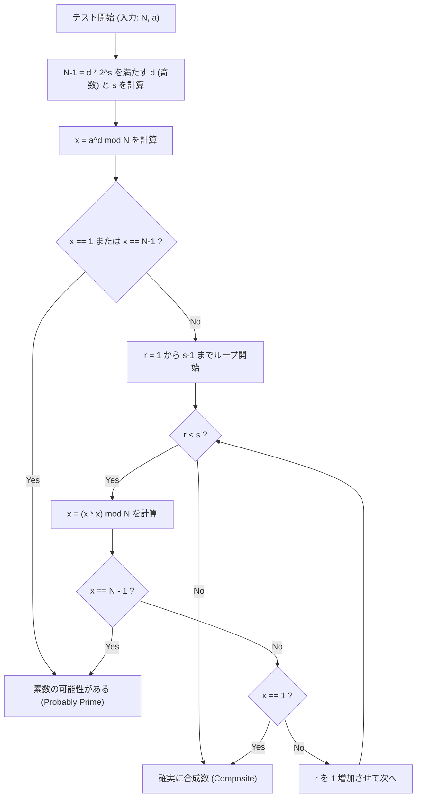

# はじめに：なぜ高速な素数判定が必要なのか

情報科学や暗号理論、あるいは競技プログラミングの世界において、「ある数が素数であるかどうか」を高速かつ正確に判定することは、非常に重要で基礎的な課題です。例えば、現代のインターネット社会のセキュリティを支えているRSA暗号などの公開鍵暗号方式は、巨大な素数の生成とその掛け算の困難性（素因数分解の難しさ）を安全性の根拠としています。したがって、巨大な数が素数であるかを瞬時に見分ける技術は、デジタル社会の根幹を支える技術と言っても過言ではありません。

また、競技プログラミング（AtCoderやCodeforcesなど）においても、素数判定は頻出のテーマです。制約が $N \le 10^{18}$ といった巨大な入力に対して、1秒以内で素数判定を数万回行うようなシチュエーションでは、伝統的で素朴なアルゴリズムでは到底計算時間（Time Limit Exceeded: TLE）に間に合いません。

本記事では、素朴な素数判定アルゴリズムから始まり、確率的素数判定法である「フェルマーテスト」、そしてその弱点を克服した実用上最強レベルの高速アルゴリズム「ミラー・ラビン（Miller-Rabin）素数判定法」について、数学的な背景からC++による高度に最適化された実装まで、徹底的に解説します。特に、64ビット整数（$N < 2^{64}$）に対しては、確率的な判定にとどまらず「100%確実に素数判定ができる（決定論的判定）」手法についても詳しく説明し、実践でそのまま使えるC++のソースコードを提供します。

---

# 1. 素数判定の基礎と試し割り法 (Trial Division)

素数（Prime number）とは、1と自分自身以外に正の約数を持たない、2以上の自然数のことです。素数の定義に忠実に従えば、ある整数 $N$ が素数かどうかを判定するには、$2$ から $N-1$ までのすべての整数で $N$ を割ってみて、一度も割り切れなければ素数、一度でも割り切れれば合成数（素数でない）と判断できます。

しかし、この方法は計算量が $O(N)$ となり、$N$ が $10^{18}$ などの巨大な数の場合、現代のコンピュータでも計算に膨大な時間がかかってしまいます。

## 試し割り法の最適化：$\sqrt{N}$ までの探索

合成数 $N$ が $a \times b = N$ （$a \le b$）と表されるとき、必ず $a \le \sqrt{N}$ となります。したがって、素数判定のループは $N-1$ まで回す必要はなく、$\sqrt{N}$ まで調べれば十分です。

```cpp
#include <iostream>

// 試し割り法による素数判定 (O(sqrt(N)))
bool is_prime_trial_division(long long n) {
    if (n <= 1) return false;
    if (n == 2 || n == 3) return true;
    if (n % 2 == 0) return false;
    
    // 3以上の奇数のみ調べる
    for (long long i = 3; i * i <= n; i += 2) {
        if (n % i == 0) return false;
    }
    return true;
}
```

このアルゴリズムの計算量は $O(\sqrt{N})$ です。$N \le 10^{12}$ 程度であれば一瞬で計算できますが、$N \approx 10^{18}$ の場合、ループ回数が約 $10^9$ 回となり、C++の処理系であっても数百ミリ秒から数秒の時間を要するため、複数回の判定には不向きです。

---

# 2. フェルマーテスト：確率的素数判定の幕開け

試し割り法の限界を突破するために考え出されたのが、数論の定理を用いた「確率的アルゴリズム（Probabilistic Algorithm）」です。その代表例が、フェルマーの小定理を利用した「フェルマーテスト（Fermat Primality Test）」です。

## フェルマーの小定理 (Fermat's Little Theorem)

ピエール・ド・フェルマー（Pierre de Fermat）が発見したこの定理は、次のように主張しています。

> 任意の素数 $p$ と、互いに素な（$p$ の倍数ではない）任意の整数 $a$ について、以下の合同式が成り立つ。
> $$ a^{p-1} \equiv 1 \pmod p $$

この定理の対偶をとると、「ある整数 $N$ と、$N$ と互いに素な整数 $a$ に対して $a^{N-1} \not\equiv 1 \pmod N$ となるならば、$N$ は確実に合成数である」と言えます。この性質を利用して、判定対象の数 $N$ に対してランダムな底（base）$a$ を選び、$a^{N-1} \pmod N$ を計算して $1$ になるか確認するのがフェルマーテストです。

## 高速なべき乗剰余（繰り返し二乗法）

フェルマーテストを行うためには、$a^{N-1} \pmod N$ という巨大なべき乗を高速に計算する必要があります。これには「繰り返し二乗法（Modular Exponentiation / Binary Exponentiation）」を用います。計算量は $O(\log N)$ となり、非常に高速です。

```cpp
// 繰り返し二乗法を用いた a^b mod m の計算
long long mod_pow(long long a, long long b, long long m) {
    long long res = 1;
    a %= m;
    while (b > 0) {
        if (b & 1) res = (__int128_t)res * a % m;
        a = (__int128_t)a * a % m;
        b >>= 1;
    }
    return res;
}
```
※ ここではオーバーフローを防ぐため、GCC/Clangの拡張である `__int128_t`（128ビット整数）を使用して途中の積を保持しています。

## 疑似素数とカーマイケル数 (Carmichael Numbers)

フェルマーテストは非常に強力ですが、致命的な弱点があります。それは、$N$ が合成数であるにもかかわらず、すべての $a$ （$N$ と互いに素な $a$）に対して $a^{N-1} \equiv 1 \pmod N$ が成立してしまうような数が存在するということです。

このような数を「絶対疑似素数」または「カーマイケル数」と呼びます。最小のカーマイケル数は $561 = 3 \times 11 \times 17$ です。
カーマイケル数が存在するため、フェルマーテストだけでは「確率100%」の決定論的判定を行うことができません。いくら異なる $a$ を試しても、$561$ のような数は常に素数のフリ（騙し）をしてしまいます。

---

# 3. ミラー・ラビン素数判定法 (Miller-Rabin Primality Test)

フェルマーテストの弱点（カーマイケル数の存在）を見事に克服したのが、ミラー（Gary L. Miller）とラビン（Michael O. Rabin）によって考案された「ミラー・ラビン素数判定法」です。
現在、実用的な高速素数判定アルゴリズムとして、さまざまなプログラミング言語の内部ライブラリや暗号システムの鍵生成で最も広く使われています。

## 数学的原理

ミラー・ラビンのアルゴリズムは、フェルマーの小定理に加えて、「素数を法とする剰余体（$\mathbb{Z}/p\mathbb{Z}$）においては、$x^2 \equiv 1 \pmod p$ の解は $x \equiv 1$ または $x \equiv -1$ に限られる」という性質を利用します（合成数を法とする場合は、これ以外の非自明な平方根が存在し得ます）。

判定したい奇数 $N$ から $1$ を引いた $N-1$ は必ず偶数になります。そこで、$N-1$ を $2$ で割れるだけ割り、次のような形式で表します。
$$ N-1 = d \cdot 2^s $$
（ここで、$d$ は奇数、$s \ge 1$）

任意の底 $a$ （$1 < a < N-1$）について、$a^{N-1} \equiv 1 \pmod N$ であるかをフェルマーの小定理に従って検証しますが、その計算を段階的に行います。
具体的には、$a^d, a^{d \cdot 2}, a^{d \cdot 4}, \ldots, a^{d \cdot 2^s}$ と順番に2乗を繰り返していきます。

ミラー・ラビンテストが $N$ を「素数である（あるいは強い確率で素数である）」と判定するための条件は、以下の **いずれか** が成立することです。

1. $a^d \equiv 1 \pmod N$
2. ある $r$ （$0 \le r < s$）が存在して、$a^{d \cdot 2^r} \equiv -1 \pmod N$ が成り立つ。
   ※ C++のモジュロ演算では $-1 \pmod N$ は $N-1$ となります。

もし $N$ が素数であれば、任意の $a$ についてこの条件が必ず満たされます。逆に $N$ が合成数であれば、ランダムな $a$ を選んだとき、この条件を満たす確率（騙される確率）は $\frac{1}{4}$ 以下であることが数学的に証明されています。
$k$ 回の独立したテストを行えば、誤判定の確率は $\left(\frac{1}{4}\right)^k$ 以下となり、実用上ゼロとみなすことができます。カーマイケル数のような「絶対にごまかせる」数は存在しません。

## ミラー・ラビン法のアルゴリズムの流れ（Mermaidフローチャート）

以下の図は、ミラー・ラビン素数判定法の1回のテスト（1つの底 $a$ に対するテスト）の論理的なフローを示しています。



---

# 4. 64ビット整数に対する決定論的判定

ミラー・ラビン素数判定法は本来「確率的」アルゴリズムですが、$N$ の上限が固定されている場合、特定の複数の $a$ （底）をすべて試すことで、「100%確実に」素数判定を行うことができます。
これを **決定論的ミラー・ラビンテスト（Deterministic Miller-Rabin Test）** と呼びます。

Jim Sinclairらの研究により、$N < 2^{64}$ （約 $1.8 \times 10^{19}$）のすべての整数に対しては、以下の $7$ つの素数を底 $a$ として選んでテストすれば、十分かつ完全に決定論的な判定が可能であることが判明しています。

**テストすべき底 $a$ のリスト:**
`{2, 325, 9375, 28178, 450775, 9780504, 1795265022}`

あるいは、よく知られた別のセットとして、以下の $12$ 個の素数を使用することでも $N < 2^{64}$ 以下で完璧に判定できます。
`{2, 3, 5, 7, 11, 13, 17, 19, 23, 29, 31, 37}`

今回は、アルゴリズムの簡潔さと信頼性を高めるために、後者の $12$ 個の素数をベース（あるいはより最適化された $7$ つのベース）として用いる手法を採用します。C++の実装では、条件分岐で範囲を分けることで、テスト回数を最小限に抑える最適化を行います。

---

# 5. C++による高度な実装 (Highly Optimized C++ Implementation)

それでは、ここまでの数学的な理論とアルゴリズムの設計をまとめ上げ、現代のC++における最強レベルのミラー・ラビン素数判定関数の実装コードを提示します。

## 実装のポイント
1. **64ビット整数の掛け算のオーバーフロー回避:**
   $N \approx 10^{18}$ の場合、モジュロ乗算における $x \times x$ は最大 $10^{36}$ となり、通常の64ビット整数（`uint64_t` や `long long`）の最大値 $1.8 \times 10^{19}$ を軽々とオーバーフローしてしまいます。
   この問題を解決するため、GCCやClangの拡張型である `__int128_t`（あるいは `unsigned __int128`）を使用し、128ビット精度で計算を行った後にモジュロを取ります。これにより、複雑なアルゴリズムを使わずとも高速に剰余乗算が可能です。

2. **決定論的ベースの選択:**
   $N$ の値が小さい場合は、少しの底（base）をテストするだけで済むように最適化します。

## 完全なC++ソースコード

以下に、実戦投入可能な完成版のソースコードを示します。このコードは競技プログラミング等の環境にそのままコピーして利用可能です。

```cpp
#include <iostream>
#include <vector>
#include <cstdint>
#include <initializer_list>

using namespace std;

// 128ビット整数による高速な (a * b) mod m
inline uint64_t mod_mul(uint64_t a, uint64_t b, uint64_t m) {
    return (uint64_t)((unsigned __int128)a * b % m);
}

// 繰り返し二乗法による (base^exp) mod m の計算
uint64_t mod_pow(uint64_t base, uint64_t exp, uint64_t m) {
    uint64_t res = 1;
    base %= m;
    while (exp > 0) {
        if (exp & 1) res = mod_mul(res, base, m);
        base = mod_mul(base, base, m);
        exp >>= 1;
    }
    return res;
}

// ミラー・ラビン素数判定法による 64bit 整数の決定論的判定
bool is_prime_miller_rabin(uint64_t n) {
    // 境界値と小さな素数の事前判定
    if (n < 2) return false;
    if (n == 2 || n == 3 || n == 5 || n == 7) return true;
    if (n % 2 == 0 || n % 3 == 0 || n % 5 == 0 || n % 7 == 0) return false;

    // n-1 = d * 2^s の形に分解する
    uint64_t d = n - 1;
    int s = 0;
    while ((d & 1) == 0) {
        d >>= 1;
        s++;
    }

    // 判定に使用する底 (bases) のリスト
    // N の大きさに応じてテストするベースの数を最小限に抑える最適化
    vector<uint64_t> bases;
    if (n < 4759123141ULL) {
        bases = {2, 7, 61};
    } else if (n < 1122004669633ULL) {
        bases = {2, 13, 23, 1662803};
    } else {
        // N < 2^64 のすべての数に対して決定論的となる 7 つの底
        bases = {2, 325, 9375, 28178, 450775, 9780504, 1795265022};
    }

    // 各底についてテストを実行
    for (uint64_t a : bases) {
        a %= n;
        if (a == 0) continue; // a が n の倍数の場合は判定不能だが素数ではない

        uint64_t x = mod_pow(a, d, n);
        if (x == 1 || x == n - 1) continue; // 第一条件クリア、次の底へ

        bool composite = true;
        // s-1 回のループ (x = x^2 mod n)
        for (int r = 1; r < s; r++) {
            x = mod_mul(x, x, n);
            if (x == n - 1) {
                composite = false; // 第二条件クリア、素数の可能性あり
                break;
            }
        }
        
        // どの条件も満たさなければ確実に合成数
        if (composite) return false;
    }

    // すべてのベースで条件をクリアした場合は確実に素数
    return true;
}

int main() {
    // テスト用のサンプル
    vector<uint64_t> test_cases = {
        1000000007,           // 有名な素数
        998244353,            // 有名な素数
        1000000000000000003,  // 10^18近辺の素数
        1000000000000000007,  // 合成数 (10^18 + 7)
        561,                  // カーマイケル数 (合成数)
        18446744073709551557ULL // 2^64 近辺の最大の素数の一つ
    };

    for (uint64_t n : test_cases) {
        cout << n << " is " 
             << (is_prime_miller_rabin(n) ? "Prime" : "Composite") 
             << endl;
    }

    return 0;
}
```

---

# 6. アルゴリズムの計算量とパフォーマンス評価

実装したアルゴリズムの性能について考察します。

## 時間計算量 (Time Complexity)
* **試し割り法:** $O(\sqrt{N})$
* **フェルマーテスト:** べき乗計算 $O(\log N) \times k$ （$k$ は試行回数）
* **ミラー・ラビン法:** べき乗計算とループ $O(\log N) \times k$

64ビット環境（$N \le 2^{64}$）において、上記の決定論的ミラー・ラビン法は、最大でも $7$ つのベースしか検証しません。したがって、$k \le 7$ の定数とみなすことができ、全体の時間計算量は厳密に $O(\log N)$ となります。
最大ケース（$N \approx 10^{19}$）であっても、実行ステップ数は高々 $7 \times 64 = 448$ ステップの基本演算に収まり、実行時間は数マイクロ秒（$10^{-6}$ 秒）以下です。試し割り法の $O(\sqrt{N})$ （ループ回数 $\approx 4 \times 10^9$ 回）と比較すると、**数百万倍の高速化** が達成されています。

## さらなる最適化：モンゴメリ乗算 (Montgomery Multiplication)

本記事の実装では、128ビット整数の拡張型 `__int128_t` を用いて除算（モジュロ演算 `%`）を行っています。現代のCPUであっても、整数除算（DIV命令）は加算や乗算に比べて数十サイクルを要するコストの高い命令です。

より極限の最適化を追求するライブラリ作成者や競技プログラマは、**モンゴメリ乗算（Montgomery Multiplication）** と呼ばれる手法を採用することがあります。モンゴメリ乗算は、数値を特殊な「モンゴメリ空間」に写像することで、高コストなモジュロ演算（除算）を「ビットシフトと乗算のみ」に置き換える驚異的なアルゴリズムです。
これをミラー・ラビン判定の剰余乗算に組み込むことで、さらに実行速度を2倍から3倍程度引き上げることが可能です。これについては非常に奥深いテーマとなるため、別の記事で詳細に解説したいと思います。

---

# 7. まとめ

本記事では、素数判定の基礎から発展的な内容までを一挙に解説しました。
ポイントを振り返りましょう。

1. **試し割り法** は確実だが、計算量 $O(\sqrt{N})$ のため $N$ が $10^{12}$ を超えると実用性に欠ける。
2. **フェルマーテスト** は $O(\log N)$ と非常に高速だが、カーマイケル数などの絶対疑似素数に騙されるという致命的な弱点がある。
3. **ミラー・ラビン素数判定法** は、フェルマーテストの弱点を解消した実用的で最強のアルゴリズム。
4. C++による実装では、`__int128_t` を活用することで 64ビット整数の乗算オーバーフローを安全に処理できる。
5. 64ビット整数の範囲内（$N < 2^{64}$）であれば、$7$ 個または $12$ 個の特定の素数を底として選ぶことで、確率的ではなく**決定論的（100%正確）に素数判定が可能**。

高速な素数判定は、巨大な数を扱う計算において避けては通れない技術です。本記事で提供したC++のミラー・ラビンのソースコードは、そのまま実戦で活用できる堅牢なものになっています。ぜひ、ご自身のプロジェクトやアルゴリズム競技で活用してみてください。


プログラミングと数学が交差するアルゴリズムの世界は非常に美しく、奥深いものです。今後の学習の一助となれば幸いです。

---
*Reference:*
- *Pomerance, C., Selfridge, J. L., & Wagstaff, S. S. (1980). The pseudoprimes to 25.10^9. Mathematics of Computation.*
- *Sinclair, J. (2011). Deterministic Miller-Rabin primality testing.*
