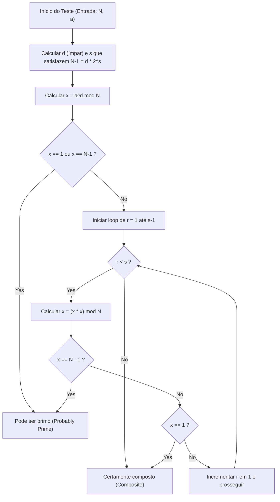
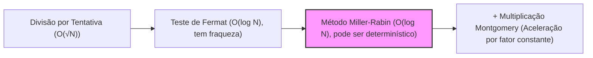

# Introdução: Por que é necessário um teste de primalidade rápido?

No mundo da ciência da computação, teoria da criptografia e programação competitiva, determinar de forma rápida e precisa "se um determinado número é primo" é um problema fundamental e extremamente importante. Por exemplo, a criptografia de chave pública, como a criptografia RSA, que sustenta a segurança da sociedade da internet moderna, baseia-se na geração de números primos gigantescos e na dificuldade de sua multiplicação (a dificuldade da fatoração em números primos) como base de sua segurança. Portanto, a tecnologia para identificar instantaneamente se um número gigante é primo não é exagero dizer que é a tecnologia que sustenta os fundamentos da sociedade digital.

Além disso, na programação competitiva (como AtCoder e Codeforces), o teste de primalidade é um tema frequente. Em situações onde as restrições são para entradas gigantescas como $N \le 10^{18}$, e você precisa realizar dezenas de milhares de testes de primalidade em menos de 1 segundo, algoritmos tradicionais e ingênuos certamente não conseguirão ser executados a tempo (Time Limit Exceeded: TLE).

Neste artigo, começaremos com algoritmos de teste de primalidade ingênuos, passaremos pelo "Teste de Fermat", que é um método de teste de primalidade probabilístico, e explicaremos detalhadamente o algoritmo de altíssima velocidade de nível mais forte na prática, o "Teste de Primalidade de Miller-Rabin", que superou as fraquezas do anterior, desde a base matemática até uma implementação altamente otimizada em C++. Em particular, para inteiros de 64 bits ($N < 2^{64}$), explicaremos em detalhes o método que vai além do teste probabilístico e pode "testar a primalidade com 100% de certeza (teste determinístico)", e forneceremos o código-fonte em C++ que pode ser usado diretamente na prática.

---

# 1. Fundamentos do Teste de Primalidade e Divisão por Tentativa (Trial Division)

Um número primo (Prime number) é um número natural maior ou igual a 2 que não possui divisores positivos além de 1 e ele mesmo. Seguindo estritamente a definição de número primo, para determinar se um inteiro $N$ é primo, podemos tentar dividir $N$ por todos os inteiros de $2$ a $N-1$, e se ele nunca for divisível, podemos julgar que é um número primo; se for divisível mesmo uma vez, é um número composto (não é um número primo).

No entanto, a complexidade de tempo deste método é $O(N)$, e se $N$ for um número gigante como $10^{18}$, até mesmo computadores modernos levariam uma quantidade enorme de tempo para calcular.

## Otimização da Divisão por Tentativa: Busca até $\sqrt{N}$

Quando um número composto $N$ é expresso como $a \times b = N$ ($a \le b$), é certo que $a \le \sqrt{N}$. Portanto, não é necessário iterar o loop de teste de primalidade até $N-1$; é suficiente verificar até $\sqrt{N}$.

```cpp
#include <iostream>

// Teste de primalidade por divisão por tentativa (O(sqrt(N)))
bool is_prime_trial_division(long long n) {
    if (n <= 1) return false;
    if (n == 2 || n == 3) return true;
    if (n % 2 == 0) return false;
    
    // Verificar apenas números ímpares a partir de 3
    for (long long i = 3; i * i <= n; i += 2) {
        if (n % i == 0) return false;
    }
    return true;
}
```

A complexidade de tempo deste algoritmo é $O(\sqrt{N})$. Se for em torno de $N \le 10^{12}$, pode ser calculado instantaneamente, mas se $N \approx 10^{18}$, o número de loops será de cerca de $10^9$ vezes, e mesmo com o compilador C++, levará de centenas de milissegundos a vários segundos, tornando-o inadequado para múltiplos testes.

---

# 2. Teste de Fermat: O Início do Teste de Primalidade Probabilístico

O que foi concebido para superar as limitações do método de divisão por tentativa foi o "Algoritmo Probabilístico" usando teoremas da teoria dos números. Um exemplo representativo é o "Teste de Primalidade de Fermat" que utiliza o Pequeno Teorema de Fermat.

## O Pequeno Teorema de Fermat

Este teorema, descoberto por Pierre de Fermat, afirma o seguinte:

> Para qualquer número primo $p$ e qualquer inteiro $a$ coprimo com $p$ (que não seja um múltiplo de $p$), a seguinte congruência é válida.
> $$ a^{p-1} \equiv 1 \pmod p $$

Tomando a contrapositiva deste teorema, podemos dizer que "Se para um inteiro $N$ e um inteiro $a$ coprimo com $N$, $a^{N-1} \not\equiv 1 \pmod N$, então $N$ é definitivamente um número composto". Usando esta propriedade, o Teste de Fermat seleciona uma base aleatória $a$ para o número $N$ a ser testado e verifica se o cálculo de $a^{N-1} \pmod N$ resulta em $1$.

## Exponenciação Modular Rápida (Exponenciação Binária)

Para realizar o teste de Fermat, é necessário calcular rapidamente a potência gigante $a^{N-1} \pmod N$. Para isso, usamos o método de "Exponenciação Modular / Binária". A complexidade de tempo é $O(\log N)$, tornando-o extremamente rápido.

```cpp
// Cálculo de a^b mod m usando exponenciação binária
long long mod_pow(long long a, long long b, long long m) {
    long long res = 1;
    a %= m;
    while (b > 0) {
        if (b & 1) res = (__int128_t)res * a % m;
        a = (__int128_t)a * a % m;
        b >>= 1;
    }
    return res;
}
```
※ Aqui, para evitar overflow, estamos usando a extensão do GCC/Clang `__int128_t` (inteiro de 128 bits) para manter o produto intermediário.

## Pseudoprimos e Números de Carmichael

O Teste de Fermat é muito poderoso, mas tem uma fraqueza fatal. É a existência de números tais que, mesmo $N$ sendo um número composto, $a^{N-1} \equiv 1 \pmod N$ é válido para todos os $a$ (onde $a$ é coprimo com $N$).

Tais números são chamados de "pseudoprimos absolutos" ou "números de Carmichael". O menor número de Carmichael é $561 = 3 \times 11 \times 17$.
Como os números de Carmichael existem, não é possível realizar um teste determinístico de "100% de probabilidade" apenas com o Teste de Fermat. Não importa quantos $a$ diferentes você tente, números como $561$ sempre se farão passar por primos (enganarão o teste).

---

# 3. Teste de Primalidade de Miller-Rabin

O que superou de forma brilhante a fraqueza do Teste de Fermat (a existência dos números de Carmichael) foi o "Teste de Primalidade de Miller-Rabin" concebido por Gary L. Miller e Michael O. Rabin.
Atualmente, como um algoritmo prático de teste de primalidade de alta velocidade, é o mais amplamente utilizado em bibliotecas internas de várias linguagens de programação e na geração de chaves para sistemas criptográficos.

## Princípio Matemático

O algoritmo de Miller-Rabin, além do Pequeno Teorema de Fermat, utiliza a propriedade de que "em um anel de resíduos módulo um primo ($\mathbb{Z}/p\mathbb{Z}$), as soluções para $x^2 \equiv 1 \pmod p$ limitam-se a $x \equiv 1$ ou $x \equiv -1$" (ao usar um número composto como módulo, outras raízes quadradas não triviais podem existir).

Subtrair $1$ do número ímpar $N$ a ser testado, $N-1$, resultará sempre em um número par. Portanto, dividimos $N-1$ por $2$ o máximo possível e expressamos no seguinte formato:
$$ N-1 = d \cdot 2^s $$
(Onde $d$ é um número ímpar e $s \ge 1$)

Para qualquer base $a$ ($1 < a < N-1$), verificamos se $a^{N-1} \equiv 1 \pmod N$ de acordo com o Pequeno Teorema de Fermat, mas realizamos esse cálculo em etapas.
Especificamente, repetimos a elevação ao quadrado em ordem: $a^d, a^{d \cdot 2}, a^{d \cdot 4}, \ldots, a^{d \cdot 2^s}$.

A condição para o teste de Miller-Rabin julgar $N$ como "sendo primo (ou sendo um primo com forte probabilidade)" é que **qualquer uma** das seguintes afirmações seja verdadeira.

1. $a^d \equiv 1 \pmod N$
2. Existe algum $r$ ($0 \le r < s$) tal que $a^{d \cdot 2^r} \equiv -1 \pmod N$ é satisfeito.
   ※ Na operação de módulo em C++, $-1 \pmod N$ se torna $N-1$.

Se $N$ for um número primo, esta condição será necessariamente satisfeita para qualquer $a$. Por outro lado, foi matematicamente provado que se $N$ for um número composto, a probabilidade de satisfazer essa condição (a probabilidade de ser enganado) ao escolher um $a$ aleatório é de $\frac{1}{4}$ ou menos.
Se você realizar $k$ testes independentes, a probabilidade de um falso positivo será menor ou igual a $\left(\frac{1}{4}\right)^k$, podendo ser praticamente considerada zero. Não há números que possam "enganar absolutamente" como os números de Carmichael.

## Fluxo do Algoritmo de Miller-Rabin (Fluxograma Mermaid)

A figura a seguir mostra o fluxo lógico de uma única rodada do teste de primalidade de Miller-Rabin (teste para uma única base $a$).



---

# 4. Teste Determinístico para Inteiros de 64 Bits

O teste de primalidade de Miller-Rabin é inerentemente um algoritmo "probabilístico", mas se o limite superior de $N$ for fixo, você pode realizar o teste de primalidade com "100% de certeza" testando todos de um conjunto específico de várias bases $a$.
Isso é chamado de **Teste Determinístico de Miller-Rabin (Deterministic Miller-Rabin Test)**.

Pesquisas de Jim Sinclair e outros revelaram que para todos os inteiros de $N < 2^{64}$ (aproximadamente $1.8 \times 10^{19}$), um julgamento determinístico suficiente e completo é possível se você escolher e testar os seguintes $7$ números primos como a base $a$.

**Lista de bases $a$ a serem testadas:**
`{2, 325, 9375, 28178, 450775, 9780504, 1795265022}`

Alternativamente, é bem conhecido que ao usar o seguinte conjunto de $12$ números primos, também é possível determinar perfeitamente para $N < 2^{64}$ e abaixo.
`{2, 3, 5, 7, 11, 13, 17, 19, 23, 29, 31, 37}`

Desta vez, a fim de aumentar a simplicidade e confiabilidade do algoritmo, adotaremos um método que usa os últimos $12$ números primos como base (ou as $7$ bases mais otimizadas). Na implementação em C++, otimizamos dividindo os intervalos com desvios condicionais para manter o número de testes no mínimo.

---

# 5. Implementação Avançada em C++ (Highly Optimized C++ Implementation)

Agora, resumiremos as teorias matemáticas e o design do algoritmo discutidos até agora, e apresentaremos o código de implementação da função de teste de primalidade de Miller-Rabin de nível mais forte em C++ moderno.

## Pontos de Implementação
1. **Evitar o overflow da multiplicação de inteiros de 64 bits:**
   Quando $N \approx 10^{18}$, $x \times x$ na multiplicação modular atinge o máximo de $10^{36}$, ultrapassando facilmente o valor máximo de $1.8 \times 10^{19}$ de um inteiro normal de 64 bits (`uint64_t` ou `long long`).
   Para resolver este problema, usamos a extensão do tipo `__int128_t` (ou `unsigned __int128`) do GCC e Clang e pegamos o módulo após calcular com precisão de 128 bits. Isso permite multiplicações modulares rápidas sem usar algoritmos complexos.

2. **Seleção da base determinística:**
   Se o valor de $N$ for pequeno, otimizamos para que precisemos testar apenas algumas bases.

## Código-Fonte C++ Completo

Abaixo, mostramos o código-fonte finalizado pronto para uso prático. Este código pode ser copiado e usado como está em ambientes como de programação competitiva.

```cpp
#include <iostream>
#include <vector>
#include <cstdint>
#include <initializer_list>

using namespace std;

// Fast (a * b) mod m using 128-bit integers
inline uint64_t mod_mul(uint64_t a, uint64_t b, uint64_t m) {
    return (uint64_t)((unsigned __int128)a * b % m);
}

// Cálculo de (base^exp) mod m por exponenciação binária
uint64_t mod_pow(uint64_t base, uint64_t exp, uint64_t m) {
    uint64_t res = 1;
    base %= m;
    while (exp > 0) {
        if (exp & 1) res = mod_mul(res, base, m);
        base = mod_mul(base, base, m);
        exp >>= 1;
    }
    return res;
}

// Teste determinístico de inteiros de 64 bits pelo Teste de Primalidade de Miller-Rabin
bool is_prime_miller_rabin(uint64_t n) {
    // Pré-julgamento de valores limite e pequenos números primos
    if (n < 2) return false;
    if (n == 2 || n == 3 || n == 5 || n == 7) return true;
    if (n % 2 == 0 || n % 3 == 0 || n % 5 == 0 || n % 7 == 0) return false;

    // Decompor n-1 no formato d * 2^s
    uint64_t d = n - 1;
    int s = 0;
    while ((d & 1) == 0) {
        d >>= 1;
        s++;
    }

    // Lista de bases usadas para determinação
    // Otimização para minimizar o número de bases testadas de acordo com o tamanho de N
    vector<uint64_t> bases;
    if (n < 4759123141ULL) {
        bases = {2, 7, 61};
    } else if (n < 1122004669633ULL) {
        bases = {2, 13, 23, 1662803};
    } else {
        // 7 bases que são determinísticas para todos os números N < 2^64
        bases = {2, 325, 9375, 28178, 450775, 9780504, 1795265022};
    }

    // Executar teste para cada base
    for (uint64_t a : bases) {
        a %= n;
        if (a == 0) continue; // Se a for múltiplo de n, não pode ser julgado, mas não é primo

        uint64_t x = mod_pow(a, d, n);
        if (x == 1 || x == n - 1) continue; // Primeira condição atendida, para a próxima base

        bool composite = true;
        // Loop de s-1 vezes (x = x^2 mod n)
        for (int r = 1; r < s; r++) {
            x = mod_mul(x, x, n);
            if (x == n - 1) {
                composite = false; // Segunda condição atendida, possível primo
                break;
            }
        }
        
        // Se nenhuma condição for atendida, é definitivamente um número composto
        if (composite) return false;
    }

    // Se as condições forem atendidas em todas as bases, definitivamente é primo
    return true;
}

int main() {
    // Casos de teste de exemplo
    vector<uint64_t> test_cases = {
        1000000007,           // Número primo famoso
        998244353,            // Número primo famoso
        1000000000000000003,  // Número primo próximo de 10^18
        1000000000000000007,  // Número composto (10^18 + 7)
        561,                  // Número de Carmichael (Número composto)
        18446744073709551557ULL // Um dos maiores primos perto de 2^64
    };

    for (uint64_t n : test_cases) {
        cout << n << " is " 
             << (is_prime_miller_rabin(n) ? "Prime" : "Composite") 
             << endl;
    }

    return 0;
}
```

---

# 6. Avaliação de Complexidade e Desempenho do Algoritmo

Consideraremos o desempenho do algoritmo implementado.

## Complexidade de Tempo (Time Complexity)
* **Divisão por tentativa:** $O(\sqrt{N})$
* **Teste de Fermat:** Cálculo de potência $O(\log N) \times k$ ($k$ é o número de tentativas)
* **Método de Miller-Rabin:** Cálculo de potência e loop $O(\log N) \times k$

No ambiente de 64 bits ($N \le 2^{64}$), o método determinístico de Miller-Rabin acima verificará no máximo $7$ bases. Portanto, pode-se considerar uma constante $k \le 7$, e a complexidade de tempo total é estritamente $O(\log N)$.
Mesmo no caso máximo ($N \approx 10^{19}$), o número de etapas de execução caberá em não mais que $7 \times 64 = 448$ etapas de operações básicas, e o tempo de execução é menor que alguns microssegundos (segundos $10^{-6}$). Em comparação com o $O(\sqrt{N})$ (cerca de $4 \times 10^9$ loops) do método de divisão por tentativa, uma **aceleração de milhões de vezes** foi alcançada.

## Otimização Adicional: Multiplicação de Montgomery (Montgomery Multiplication)

Na implementação deste artigo, a extensão do tipo `__int128_t` de 128 bits é usada para a divisão (operação de módulo `%`). Mesmo com CPUs modernas, a divisão de inteiros (instrução DIV) é uma instrução de alto custo que requer dezenas de ciclos em comparação com a adição e multiplicação.

Os criadores de bibliotecas e programadores competitivos em busca de otimização extrema ocasionalmente empregarão um método chamado **Multiplicação de Montgomery (Montgomery Multiplication)**. A multiplicação de Montgomery é um algoritmo surpreendente que substitui a operação cara de módulo (divisão) apenas por "deslocamentos de bits e multiplicações", mapeando os números em um "espaço de Montgomery" especial.
Ao incorporar isso na multiplicação modular do teste de Miller-Rabin, é possível aumentar ainda mais a velocidade de execução em cerca de duas a três vezes. Sendo este um tema muito profundo, eu gostaria de explicá-lo em detalhes em outro artigo.

---

# 7. Resumo

Neste artigo, explicamos tudo de uma vez, desde os fundamentos dos testes de primalidade até o conteúdo avançado.
Vamos revisar os pontos principais.

1. **O Método de Divisão por Tentativa** é confiável, mas como a complexidade computacional é $O(\sqrt{N})$, falta praticidade quando $N$ excede $10^{12}$.
2. **O Teste de Fermat** é muito rápido com $O(\log N)$, mas tem uma fraqueza fatal de ser enganado por pseudoprimos absolutos, como os números de Carmichael.
3. **O Teste de Primalidade de Miller-Rabin** é o algoritmo mais prático e mais forte que resolve a fraqueza do Teste de Fermat.
4. Na implementação em C++, o uso de `__int128_t` permite o tratamento seguro do overflow da multiplicação de inteiros de 64 bits.
5. Se estiver dentro do intervalo de inteiros de 64 bits ($N < 2^{64}$), selecionando $7$ ou $12$ números primos específicos como base, é possível **realizar o teste de primalidade deterministicamente (100% preciso)** em vez de probabilisticamente.

Testes rápidos de primalidade são uma técnica inevitável nos cálculos que lidam com números gigantescos. O código-fonte de Miller-Rabin em C++ fornecido neste artigo é robusto e pode ser utilizado como está na prática. Por favor, tente utilizá-lo em seus próprios projetos ou competições de algoritmos.



O mundo dos algoritmos onde a programação e a matemática se cruzam é muito bonito e profundo. Esperamos que isso o ajude em seu aprendizado futuro.

---
*Referência:*
- *Pomerance, C., Selfridge, J. L., & Wagstaff, S. S. (1980). The pseudoprimes to 25.10^9. Mathematics of Computation.*
- *Sinclair, J. (2011). Deterministic Miller-Rabin primality testing.*
