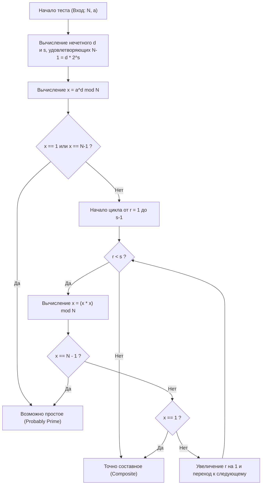

# Введение: Почему нужна быстрая проверка на простоту

В мире информатики, теории криптографии или спортивного программирования, определение того, «является ли число простым», — это очень важная и фундаментальная задача. Например, криптография с открытым ключом, такая как алгоритм RSA, обеспечивающая безопасность современного интернета, основана на генерации огромных простых чисел и сложности их умножения (факторизации). Поэтому способность мгновенно определять, является ли огромное число простым, можно смело назвать технологией, лежащей в основе цифрового общества.

Кроме того, в спортивном программировании (AtCoder, Codeforces и др.) проверка на простоту — часто встречающаяся тема. Для огромных входных данных с ограничениями вида $N \le 10^{18}$, когда требуется десятки тысяч раз проверить числа на простоту за 1 секунду, традиционные наивные алгоритмы не уложатся в лимит времени (Time Limit Exceeded: TLE).

В этой статье мы подробно разберем всё от математических основ до высокооптимизированной реализации на C++: начиная с наивного алгоритма, вероятностного метода проверки простоты «тест Ферма» и заканчивая практичным сверхбыстрым алгоритмом «Тест Миллера-Рабина (Miller-Rabin)», который преодолевает его слабые стороны. В частности, для 64-битных целых чисел ($N < 2^{64}$) мы подробно объясним метод «100% достоверной проверки (детерминированный алгоритм)», выходящий за рамки вероятностной оценки, и предоставим готовый к использованию исходный код на C++.

---

# 1. Основы проверки на простоту и метод пробных делений (Trial Division)

Простое число (Prime number) — это натуральное число больше 1, которое не имеет положительных делителей, кроме 1 и самого себя. Строго следуя определению, чтобы проверить, является ли целое число $N$ простым, можно попробовать разделить $N$ на все целые числа от $2$ до $N-1$. Если оно ни разу не разделится без остатка, то это простое число, а если разделится хотя бы раз — составное число (не простое).

Однако вычислительная сложность этого метода составляет $O(N)$, и если $N$ — огромное число, например $10^{18}$, то даже на современном компьютере вычисления займут колоссальное количество времени.

## Оптимизация метода пробных делений: поиск до $\sqrt{N}$

Если составное число $N$ можно выразить как $a \times b = N$ (где $a \le b$), то обязательно $a \le \sqrt{N}$. Следовательно, цикл проверки не нужно выполнять до $N-1$, достаточно проверить до $\sqrt{N}$.

```cpp
#include <iostream>

// Проверка на простоту методом пробных делений (O(sqrt(N)))
bool is_prime_trial_division(long long n) {
    if (n <= 1) return false;
    if (n == 2 || n == 3) return true;
    if (n % 2 == 0) return false;
    
    // Проверяем только нечетные числа, начиная с 3
    for (long long i = 3; i * i <= n; i += 2) {
        if (n % i == 0) return false;
    }
    return true;
}
```

Вычислительная сложность этого алгоритма — $O(\sqrt{N})$. Для $N \le 10^{12}$ вычисления выполняются мгновенно, но при $N \approx 10^{18}$ количество итераций цикла составит около $10^9$, что даже в C++ потребует от сотен миллисекунд до нескольких секунд. Поэтому этот метод не подходит для многократных проверок.

---

# 2. Тест Ферма: Начало вероятностной проверки на простоту

Чтобы преодолеть ограничения метода пробных делений, были придуманы «вероятностные алгоритмы» (Probabilistic Algorithm), использующие теоремы теории чисел. Ярким примером является «Тест Ферма на простоту» (Fermat Primality Test), основанный на малой теореме Ферма.

## Малая теорема Ферма (Fermat's Little Theorem)

Эта теорема, открытая Пьером де Ферма (Pierre de Fermat), утверждает следующее:

> Для любого простого числа $p$ и любого целого числа $a$, взаимно простого с $p$ (не кратного $p$), выполняется следующее сравнение:
> $$ a^{p-1} \equiv 1 \pmod p $$

Взяв контрапозицию этой теоремы, можно сказать: «Если для некоторого целого числа $N$ и взаимно простого с ним целого числа $a$ выполняется $a^{N-1} \not\equiv 1 \pmod N$, то $N$ гарантированно является составным». Тест Ферма использует это свойство: для проверяемого числа $N$ выбирается случайное основание (base) $a$, вычисляется $a^{N-1} \pmod N$ и проверяется, равно ли оно $1$.

## Быстрое возведение в степень по модулю (Метод бинарного возведения в степень)

Для выполнения теста Ферма необходимо быстро вычислить огромную степень $a^{N-1} \pmod N$. Для этого используется «метод бинарного возведения в степень» (Modular Exponentiation / Binary Exponentiation). Его вычислительная сложность составляет $O(\log N)$, что делает его очень быстрым.

```cpp
// Вычисление a^b mod m с помощью бинарного возведения в степень
long long mod_pow(long long a, long long b, long long m) {
    long long res = 1;
    a %= m;
    while (b > 0) {
        if (b & 1) res = (__int128_t)res * a % m;
        a = (__int128_t)a * a % m;
        b >>= 1;
    }
    return res;
}
```
* Здесь для предотвращения переполнения используется расширение GCC/Clang `__int128_t` (128-битное целое число) для хранения промежуточных произведений.

## Псевдопростые числа и числа Кармайкла (Carmichael Numbers)

Тест Ферма очень мощный, но у него есть фатальный недостаток. Существуют такие составные числа $N$, для которых выполняется $a^{N-1} \equiv 1 \pmod N$ при всех $a$, взаимно простых с $N$.

Такие числа называются «абсолютно псевдопростыми» или «числами Кармайкла». Наименьшее число Кармайкла — $561 = 3 \times 11 \times 17$.
Из-за существования чисел Кармайкла с помощью только теста Ферма невозможно провести детерминированную проверку со «100% вероятностью». Сколько бы различных $a$ мы ни пробовали, такие числа, как $561$, всегда будут притворяться (обманывать) простыми.

---

# 3. Тест простоты Миллера-Рабина (Miller-Rabin Primality Test)

Алгоритм, блестяще преодолевший недостаток теста Ферма (существование чисел Кармайкла), — это «тест простоты Миллера-Рабина», предложенный Миллером (Gary L. Miller) и Рабином (Michael O. Rabin).
В настоящее время он наиболее широко используется как практичный и быстрый алгоритм проверки на простоту во встроенных библиотеках различных языков программирования и при генерации ключей криптографических систем.

## Математический принцип

Алгоритм Миллера-Рабина, помимо малой теоремы Ферма, использует следующее свойство: «В поле вычетов по простому модулю ($\mathbb{Z}/p\mathbb{Z}$) решениями уравнения $x^2 \equiv 1 \pmod p$ могут быть только $x \equiv 1$ или $x \equiv -1$» (в случае составного модуля могут существовать и другие, нетривиальные квадратные корни).

Если из проверяемого нечетного числа $N$ вычесть $1$, то $N-1$ обязательно станет четным. Поэтому мы делим $N-1$ на $2$ столько раз, сколько возможно, и представляем в следующем виде:
$$ N-1 = d \cdot 2^s $$
(где $d$ — нечетное, $s \ge 1$)

Для любого основания $a$ ($1 < a < N-1$) мы проверяем, выполняется ли $a^{N-1} \equiv 1 \pmod N$ согласно малой теореме Ферма, но вычисляем это поэтапно.
Конкретно, мы последовательно возводим в квадрат: $a^d, a^{d \cdot 2}, a^{d \cdot 4}, \ldots, a^{d \cdot 2^s}$.

Условием для того, чтобы тест Миллера-Рабина определил $N$ как «простое (или с высокой вероятностью простое)», является выполнение **любого** из следующих утверждений:

1. $a^d \equiv 1 \pmod N$
2. Существует некоторое $r$ ($0 \le r < s$), такое что $a^{d \cdot 2^r} \equiv -1 \pmod N$.
   * В C++ при вычислении по модулю $-1 \pmod N$ равно $N-1$.

Если $N$ простое, то для любого $a$ это условие обязательно выполняется. Напротив, если $N$ составное, математически доказано, что вероятность выполнения этого условия (вероятность обмана) при выборе случайного $a$ составляет не более $\frac{1}{4}$.
Если провести $k$ независимых тестов, вероятность ошибочной оценки становится меньше или равна $\left(\frac{1}{4}\right)^k$, что на практике можно считать нулем. Не существует чисел, способных «абсолютно обмануть» алгоритм, подобных числам Кармайкла.

## Поток алгоритма метода Миллера-Рабина (Блок-схема Mermaid)

Следующая схема показывает логический поток одного теста Миллера-Рабина (для одного основания $a$).



---

# 4. Детерминированная проверка для 64-битных целых чисел

Тест простоты Миллера-Рабина изначально является «вероятностным» алгоритмом, но если верхняя граница $N$ фиксирована, можно провести проверку со «100% достоверностью», протестировав все основания $a$ из определенного набора.
Это называется **Детерминированным тестом Миллера-Рабина (Deterministic Miller-Rabin Test)**.

Исследования Джима Синклера (Jim Sinclair) и других показали, что для всех целых чисел $N < 2^{64}$ (около $1.8 \times 10^{19}$) достаточно выбрать и проверить следующие $7$ простых чисел в качестве оснований $a$, чтобы получить полностью детерминированный результат.

**Список оснований $a$ для проверки:**
`{2, 325, 9375, 28178, 450775, 9780504, 1795265022}`

Альтернативно, существует другой известный набор из $12$ простых чисел, с помощью которого также можно идеально проверить числа $N < 2^{64}$.
`{2, 3, 5, 7, 11, 13, 17, 19, 23, 29, 31, 37}`

В этот раз, чтобы повысить простоту и надежность алгоритма, мы применим подход с использованием этих $12$ простых чисел (или более оптимизированных $7$ баз). В реализации на C++ мы применим оптимизацию, минимизирующую количество тестов путем разделения диапазонов с помощью условных переходов.

---

# 5. Высокоуровневая реализация на C++ (Highly Optimized C++ Implementation)

Теперь давайте объединим всю математическую теорию и дизайн алгоритма, чтобы представить реализацию функции проверки простоты Миллера-Рабина высочайшего уровня в современном C++.

## Ключевые моменты реализации
1. **Предотвращение переполнения при умножении 64-битных чисел:**
   При $N \approx 10^{18}$ значение $x \times x$ при умножении по модулю может достигать $10^{36}$, что с легкостью переполнит максимальное значение обычных 64-битных целых чисел (`uint64_t` или `long long`), равное $1.8 \times 10^{19}$.
   Чтобы решить эту проблему, мы используем расширенный тип GCC или Clang `__int128_t` (или `unsigned __int128`) для выполнения вычислений с 128-битной точностью перед взятием модуля. Это позволяет быстро выполнять умножение по модулю без использования сложных алгоритмов.

2. **Выбор детерминированных оснований:**
   Когда значение $N$ невелико, мы оптимизируем алгоритм так, чтобы требовалось протестировать лишь небольшое число оснований (bases).

## Полный исходный код на C++

Ниже представлен готовый к практическому применению полный исходный код. Этот код можно напрямую скопировать и использовать в среде спортивного программирования и т.д.

```cpp
#include <iostream>
#include <vector>
#include <cstdint>
#include <initializer_list>

using namespace std;

// Быстрое вычисление (a * b) mod m с помощью 128-битного целого числа
inline uint64_t mod_mul(uint64_t a, uint64_t b, uint64_t m) {
    return (uint64_t)((unsigned __int128)a * b % m);
}

// Вычисление (base^exp) mod m методом бинарного возведения в степень
uint64_t mod_pow(uint64_t base, uint64_t exp, uint64_t m) {
    uint64_t res = 1;
    base %= m;
    while (exp > 0) {
        if (exp & 1) res = mod_mul(res, base, m);
        base = mod_mul(base, base, m);
        exp >>= 1;
    }
    return res;
}

// Детерминированная проверка 64-битных целых чисел тестом Миллера-Рабина
bool is_prime_miller_rabin(uint64_t n) {
    // Предварительная проверка граничных значений и малых простых чисел
    if (n < 2) return false;
    if (n == 2 || n == 3 || n == 5 || n == 7) return true;
    if (n % 2 == 0 || n % 3 == 0 || n % 5 == 0 || n % 7 == 0) return false;

    // Разложение на вид n-1 = d * 2^s
    uint64_t d = n - 1;
    int s = 0;
    while ((d & 1) == 0) {
        d >>= 1;
        s++;
    }

    // Список оснований (bases) для тестирования
    // Оптимизация для минимизации количества проверяемых оснований в зависимости от размера N
    vector<uint64_t> bases;
    if (n < 4759123141ULL) {
        bases = {2, 7, 61};
    } else if (n < 1122004669633ULL) {
        bases = {2, 13, 23, 1662803};
    } else {
        // 7 оснований, дающих детерминированный результат для всех чисел N < 2^64
        bases = {2, 325, 9375, 28178, 450775, 9780504, 1795265022};
    }

    // Выполнение теста для каждого основания
    for (uint64_t a : bases) {
        a %= n;
        if (a == 0) continue; // Если a кратно n, определить невозможно, но n не простое

        uint64_t x = mod_pow(a, d, n);
        if (x == 1 || x == n - 1) continue; // Первое условие выполнено, переход к следующему основанию

        bool composite = true;
        // Цикл s-1 раз (x = x^2 mod n)
        for (int r = 1; r < s; r++) {
            x = mod_mul(x, x, n);
            if (x == n - 1) {
                composite = false; // Второе условие выполнено, возможно простое
                break;
            }
        }
        
        // Если ни одно из условий не выполнено, число гарантированно составное
        if (composite) return false;
    }

    // Если все основания прошли проверку, число гарантированно простое
    return true;
}

int main() {
    // Примеры для тестирования
    vector<uint64_t> test_cases = {
        1000000007,           // Известное простое число
        998244353,            // Известное простое число
        1000000000000000003,  // Простое число в районе 10^18
        1000000000000000007,  // Составное число (10^18 + 7)
        561,                  // Число Кармайкла (составное)
        18446744073709551557ULL // Одно из наибольших простых чисел в районе 2^64
    };

    for (uint64_t n : test_cases) {
        cout << n << " is " 
             << (is_prime_miller_rabin(n) ? "Prime" : "Composite") 
             << endl;
    }

    return 0;
}
```

---

# 6. Временная сложность алгоритма и оценка производительности

Рассмотрим производительность реализованного алгоритма.

## Временная сложность (Time Complexity)
* **Метод пробных делений:** $O(\sqrt{N})$
* **Тест Ферма:** возведение в степень $O(\log N) \times k$ (где $k$ — количество попыток)
* **Метод Миллера-Рабина:** возведение в степень и цикл $O(\log N) \times k$

В 64-битной среде ($N \le 2^{64}$) описанный выше детерминированный алгоритм Миллера-Рабина проверяет максимум $7$ оснований. Следовательно, $k \le 7$ можно считать константой, и общая временная сложность строго равна $O(\log N)$.
Даже в максимальном случае ($N \approx 10^{19}$) количество шагов выполнения укладывается в $7 \times 64 = 448$ базовых операций, а время выполнения составляет менее нескольких микросекунд ($10^{-6}$ секунд). По сравнению с методом пробных делений $O(\sqrt{N})$ (около $4 \times 10^9$ итераций цикла), достигается **ускорение в миллионы раз**.

## Дальнейшая оптимизация: Умножение Монтгомери (Montgomery Multiplication)

В реализации, приведенной в этой статье, используется расширенный 128-битный тип `__int128_t` для операции деления (вычисление остатка `%`). Даже на современных процессорах целочисленное деление (инструкция DIV) — это дорогостоящая операция, занимающая десятки тактов по сравнению со сложением или умножением.

Создатели библиотек и спортивные программисты, стремящиеся к экстремальной оптимизации, иногда применяют метод, называемый **Умножением Монтгомери (Montgomery Multiplication)**. Умножение Монтгомери — это потрясающий алгоритм, который заменяет дорогостоящую операцию взятия модуля (деления) на «только битовые сдвиги и умножения» за счет отображения чисел в специальное «пространство Монтгомери».
Интегрировав этот метод в модульное умножение при тесте Миллера-Рабина, можно увеличить скорость выполнения еще примерно в 2-3 раза. Поскольку это очень глубокая тема, мы подробно рассмотрим её в другой статье.

---

# 7. Заключение

В этой статье мы охватили все аспекты проверки на простоту: от основ до продвинутых концепций.
Давайте вспомним ключевые моменты.

1. **Метод пробных делений** надежен, но из-за вычислительной сложности $O(\sqrt{N})$ он теряет практичность при $N > 10^{12}$.
2. **Тест Ферма** очень быстр — $O(\log N)$, но имеет фатальный недостаток: он ошибается на абсолютно псевдопростых числах, таких как числа Кармайкла.
3. **Тест простоты Миллера-Рабина** — это практичный и мощнейший алгоритм, который устраняет слабость теста Ферма.
4. В реализации на C++ использование `__int128_t` позволяет безопасно обрабатывать переполнения при умножении 64-битных целых чисел.
5. В пределах 64-битных целых чисел ($N < 2^{64}$), выбирая $7$ или $12$ определенных простых чисел в качестве оснований, возможна **детерминированная (со 100% точностью) проверка на простоту**, а не вероятностная.

Быстрая проверка на простоту — это незаменимая технология при вычислениях с огромными числами. Предоставленный в этой статье исходный код алгоритма Миллера-Рабина на C++ достаточно надежен для использования в реальных задачах. Обязательно попробуйте применить его в своих проектах или на соревнованиях по алгоритмике!


Мир алгоритмов, в котором пересекаются программирование и математика, невероятно красив и глубок. Надеемся, что эта статья поможет вам в дальнейшем изучении.

---
*Reference:*
- *Pomerance, C., Selfridge, J. L., & Wagstaff, S. S. (1980). The pseudoprimes to 25.10^9. Mathematics of Computation.*
- *Sinclair, J. (2011). Deterministic Miller-Rabin primality testing.*
