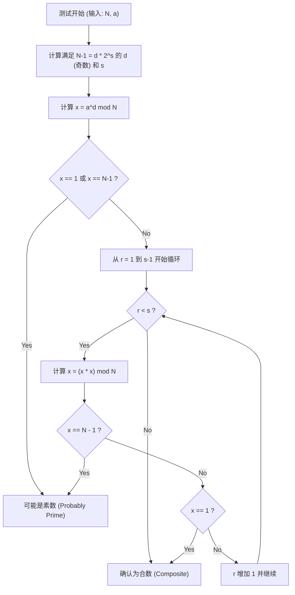

# 前言：为什么需要高速的素数判定

在信息科学、密码学理论以及算法竞赛的世界中，快速且准确地判断“一个数是否为素数”是一个非常重要且基础的课题。例如，支撑现代互联网社会安全的RSA加密等公钥加密体制，其安全性的基础就在于巨大素数的生成及其相乘的困难性（大整数分解的困难性）。因此，能够瞬间辨别出巨大数是否为素数的技术，毫不夸张地说，正是支撑数字社会根基的技术。

此外，在算法竞赛（如AtCoder、Codeforces等）中，素数判定也是一个高频主题。面对限制条件为 $N \le 10^{18}$ 这样巨大的输入，如果要求在1秒内进行数万次素数判定，传统的朴素算法绝对无法在规定时间内完成（会导致超时：Time Limit Exceeded, TLE）。

本文将从朴素的素数判定算法开始，介绍概率性素数判定法“费马测试”，以及克服了其弱点、在实际应用中堪称最强级别的高速算法——“米勒-拉宾（Miller-Rabin）素数判定法”。我们将从数学背景到高度优化的C++实现，进行彻底的讲解。特别是针对64位整数（$N < 2^{64}$），我们不仅停留在概率性判定上，还将详细说明“能够100%确定是否为素数（确定性判定）”的方法，并提供可直接应用于实战的C++源代码。

---

# 1. 素数判定的基础与试除法 (Trial Division)

素数（Prime number）是指在大于1的自然数中，除了1和它本身以外不再有其他正因数的数。如果严格按照素数的定义，要判断一个整数 $N$ 是否为素数，只需用从 $2$ 到 $N-1$ 的所有整数去尝试除 $N$，如果都无法整除，则是素数；如果哪怕有一次能整除，则是合数（非素数）。

然而，这种方法的时间复杂度为 $O(N)$。当 $N$ 是像 $10^{18}$ 这样的巨大数字时，即使是现代计算机也会消耗极其漫长的时间来进行计算。

## 试除法的优化：探索至 $\sqrt{N}$

当合数 $N$ 可以表示为 $a \times b = N$ （$a \le b$）时，必然有 $a \le \sqrt{N}$。因此，素数判定的循环不需要执行到 $N-1$，只需检查到 $\sqrt{N}$ 就足够了。

```cpp
#include <iostream>

// 使用试除法进行素数判定 (O(sqrt(N)))
bool is_prime_trial_division(long long n) {
    if (n <= 1) return false;
    if (n == 2 || n == 3) return true;
    if (n % 2 == 0) return false;
    
    // 只检查3以上的奇数
    for (long long i = 3; i * i <= n; i += 2) {
        if (n % i == 0) return false;
    }
    return true;
}
```

该算法的时间复杂度为 $O(\sqrt{N})$。如果 $N \le 10^{12}$ 左右，可以瞬间计算完成；但如果 $N \approx 10^{18}$，循环次数约为 $10^9$ 次，即使使用C++编译器，也需要数百毫秒到几秒的时间，因此不适合进行多次判定。

---

# 2. 费马测试：概率性素数判定的开端

为了突破试除法的局限性，人们利用数论定理提出了“概率性算法（Probabilistic Algorithm）”。其中最具代表性的就是利用费马小定理的“费马测试（Fermat Primality Test）”。

## 费马小定理 (Fermat's Little Theorem)

皮埃尔·德·费马（Pierre de Fermat）发现的这一定理主张如下：

> 对于任意素数 $p$ 和任意与 $p$ 互质（不是 $p$ 的倍数）的整数 $a$，以下同余式成立：
> $$ a^{p-1} \equiv 1 \pmod p $$

取该定理的逆否命题，可以说：“对于某个整数 $N$ 及与 $N$ 互质的整数 $a$，如果 $a^{N-1} \not\equiv 1 \pmod N$ 成立，那么 $N$ 必定是合数。”费马测试正是利用这一性质，针对待判定的数 $N$ 选择一个随机的底数（base）$a$，计算 $a^{N-1} \pmod N$ 并确认其结果是否为 $1$。

## 快速幂取模（反复平方法）

为了进行费马测试，必须能够高速计算 $a^{N-1} \pmod N$ 这种巨大的幂运算。为此，我们使用“反复平方法（Modular Exponentiation / Binary Exponentiation）”。其时间复杂度为 $O(\log N)$，计算速度非常快。

```cpp
// 使用反复平方法计算 a^b mod m
long long mod_pow(long long a, long long b, long long m) {
    long long res = 1;
    a %= m;
    while (b > 0) {
        if (b & 1) res = (__int128_t)res * a % m;
        a = (__int128_t)a * a % m;
        b >>= 1;
    }
    return res;
}
```
※ 在此代码中，为了防止溢出，我们使用了GCC/Clang的扩展类型 `__int128_t`（128位整数）来保存中间的乘积。

## 伪素数与卡迈克尔数 (Carmichael Numbers)

费马测试虽然非常强大，但存在一个致命的弱点。那就是：存在一些数 $N$，尽管它是合数，但对于所有的 $a$ （与 $N$ 互质的 $a$），$a^{N-1} \equiv 1 \pmod N$ 都能成立。

这种数被称为“绝对伪素数”或“卡迈克尔数”。最小的卡迈克尔数是 $561 = 3 \times 11 \times 17$。
由于卡迈克尔数的存在，仅靠费马测试无法进行“100%概率”的确定性判定。无论你尝试多少个不同的 $a$，像 $561$ 这样的数始终会伪装成素数骗过测试。

---

# 3. 米勒-拉宾素数判定法 (Miller-Rabin Primality Test)

出色地克服了费马测试弱点（卡迈克尔数的存在）的方法，是由加里·米勒（Gary L. Miller）和迈克尔·拉宾（Michael O. Rabin）提出的“米勒-拉宾素数判定法”。
目前，作为实用的高速素数判定算法，它在各种编程语言的内部库以及密码系统的密钥生成中得到了最广泛的应用。

## 数学原理

米勒-拉宾算法除了利用费马小定理外，还利用了这样一个性质：“在以素数为模的剩余系（$\mathbb{Z}/p\mathbb{Z}$）中，方程 $x^2 \equiv 1 \pmod p$ 的解仅限于 $x \equiv 1$ 或 $x \equiv -1$”（当模为合数时，可能存在除此以外的非平凡平方根）。

待判定的奇数 $N$ 减去 $1$ 得到的 $N-1$ 必定是偶数。因此，我们可以将 $N-1$ 尽可能多地除以 $2$，表示为以下形式：
$$ N-1 = d \cdot 2^s $$
（其中，$d$ 为奇数，$s \ge 1$）

对于任意底数 $a$ （$1 < a < N-1$），我们会根据费马小定理验证 $a^{N-1} \equiv 1 \pmod N$ 是否成立，但这个计算是分阶段进行的。
具体来说，就是依次连续进行平方计算：$a^d, a^{d \cdot 2}, a^{d \cdot 4}, \ldots, a^{d \cdot 2^s}$。

米勒-拉宾测试判定 $N$ 为“素数（或者以极高的概率为素数）”的条件是，以下**任意一项**成立：

1. $a^d \equiv 1 \pmod N$
2. 存在某个 $r$ （$0 \le r < s$），使得 $a^{d \cdot 2^r} \equiv -1 \pmod N$ 成立。
   ※ 在C++的取模运算中，$-1 \pmod N$ 相当于 $N-1$。

如果 $N$ 是素数，那么对于任意的 $a$，该条件必定满足。反之，如果 $N$ 是合数，在随机选择 $a$ 时，满足该条件（即被骗过）的概率在数学上被证明为不超过 $\frac{1}{4}$。
只要进行 $k$ 次独立的测试，误判的概率就会小于 $\left(\frac{1}{4}\right)^k$，在实际应用中可以视作零。不存在像卡迈克尔数那样“绝对能蒙混过关”的数。

## 米勒-拉宾法的算法流程（Mermaid流程图）

下图展示了米勒-拉宾素数判定法中一次测试（针对单一底数 $a$ 的测试）的逻辑流程。



---

# 4. 针对64位整数的确定性判定

米勒-拉宾素数判定法本质上是“概率性”算法，但如果 $N$ 的上限是固定的，通过测试特定的一组 $a$ （底数），就能够“100%确切地”进行素数判定。
这被称为 **确定性米勒-拉宾测试（Deterministic Miller-Rabin Test）**。

根据Jim Sinclair等人的研究，对于 $N < 2^{64}$ （约 $1.8 \times 10^{19}$）的所有整数，只要选取以下 $7$ 个素数作为底数 $a$ 进行测试，就足以实现完全确定性的判定。

**需要测试的底数 $a$ 列表:**
`{2, 325, 9375, 28178, 450775, 9780504, 1795265022}`

或者，使用另一组广为人知的 $12$ 个素数，同样能够在 $N < 2^{64}$ 的范围内进行完美判定：
`{2, 3, 5, 7, 11, 13, 17, 19, 23, 29, 31, 37}`

在本次实现中，为了兼顾算法的简洁性与高可靠性，我们采用基于后者 $12$ 个素数（或更为优化的 $7$ 个基底）的方法。在C++的实现中，通过条件分支划分数值范围，进行优化以将测试次数降至最低。

---

# 5. 使用C++的高级实现 (Highly Optimized C++ Implementation)

接下来，我们将结合迄今为止的数学理论与算法设计，展示现代C++中最强级别的米勒-拉宾素数判定函数的实现代码。

## 实现要点
1. **避免64位整数乘法的溢出:**
   当 $N \approx 10^{18}$ 时，取模乘法中的 $x \times x$ 最大可达 $10^{36}$，会轻松超过普通64位整数（`uint64_t` 或 `long long`）的最大值 $1.8 \times 10^{19}$ 导致溢出。
   为了解决这个问题，我们使用GCC和Clang的扩展类型 `__int128_t`（或 `unsigned __int128`），在进行128位精度的计算后再取模。这样一来，无需复杂的算法也能高速完成取模乘法。

2. **确定性基底的选择:**
   当 $N$ 的值较小时，优化代码使得只需测试少量的底数（base）。

## 完整的C++源代码

下面给出可用于实战的最终版源代码。您可以直接将此代码复制到算法竞赛等环境中使用。

```cpp
#include <iostream>
#include <vector>
#include <cstdint>
#include <initializer_list>

using namespace std;

// 使用 128 位整数进行高速的 (a * b) mod m 计算
inline uint64_t mod_mul(uint64_t a, uint64_t b, uint64_t m) {
    return (uint64_t)((unsigned __int128)a * b % m);
}

// 使用反复平方法计算 (base^exp) mod m
uint64_t mod_pow(uint64_t base, uint64_t exp, uint64_t m) {
    uint64_t res = 1;
    base %= m;
    while (exp > 0) {
        if (exp & 1) res = mod_mul(res, base, m);
        base = mod_mul(base, base, m);
        exp >>= 1;
    }
    return res;
}

// 基于米勒-拉宾素数判定法的 64 位整数确定性判定
bool is_prime_miller_rabin(uint64_t n) {
    // 边界值与小素数的提前判定
    if (n < 2) return false;
    if (n == 2 || n == 3 || n == 5 || n == 7) return true;
    if (n % 2 == 0 || n % 3 == 0 || n % 5 == 0 || n % 7 == 0) return false;

    // 分解为 n-1 = d * 2^s 的形式
    uint64_t d = n - 1;
    int s = 0;
    while ((d & 1) == 0) {
        d >>= 1;
        s++;
    }

    // 判定所用的底数 (bases) 列表
    // 根据 N 的大小，将需要测试的基底数量优化到最低限度
    vector<uint64_t> bases;
    if (n < 4759123141ULL) {
        bases = {2, 7, 61};
    } else if (n < 1122004669633ULL) {
        bases = {2, 13, 23, 1662803};
    } else {
        // 对于所有 N < 2^64 的数，都能提供确定性判定的 7 个底数
        bases = {2, 325, 9375, 28178, 450775, 9780504, 1795265022};
    }

    // 对每个底数执行测试
    for (uint64_t a : bases) {
        a %= n;
        if (a == 0) continue; // 当 a 为 n 的倍数时无法判定，但能说明 n 不是素数

        uint64_t x = mod_pow(a, d, n);
        if (x == 1 || x == n - 1) continue; // 满足第一条件，进入下一个底数

        bool composite = true;
        // 循环 s-1 次 (x = x^2 mod n)
        for (int r = 1; r < s; r++) {
            x = mod_mul(x, x, n);
            if (x == n - 1) {
                composite = false; // 满足第二条件，可能是素数
                break;
            }
        }
        
        // 如果所有条件都不满足，则确认为合数
        if (composite) return false;
    }

    // 所有基底都满足条件，则确认为素数
    return true;
}

int main() {
    // 测试用例
    vector<uint64_t> test_cases = {
        1000000007,           // 著名的素数
        998244353,            // 著名的素数
        1000000000000000003,  // 10^18 附近的素数
        1000000000000000007,  // 合数 (10^18 + 7)
        561,                  // 卡迈克尔数 (合数)
        18446744073709551557ULL // 2^64 附近最大的素数之一
    };

    for (uint64_t n : test_cases) {
        cout << n << " is " 
             << (is_prime_miller_rabin(n) ? "Prime" : "Composite") 
             << endl;
    }

    return 0;
}
```

---

# 6. 算法的时间复杂度与性能评估

接下来探讨所实现算法的性能。

## 时间复杂度 (Time Complexity)
* **试除法:** $O(\sqrt{N})$
* **费马测试:** 幂运算 $O(\log N) \times k$ （$k$ 为尝试次数）
* **米勒-拉宾法:** 幂运算及内部循环 $O(\log N) \times k$

在64位环境（$N \le 2^{64}$）下，上述确定性米勒-拉宾法最多只验证 $7$ 个基底。因此，可将 $k \le 7$ 视为常数，整体的时间复杂度严格来说就是 $O(\log N)$。
即使在最坏情况下（$N \approx 10^{19}$），执行步骤也最多只有 $7 \times 64 = 448$ 步基本运算，运行时间在数微秒（$10^{-6}$ 秒）以内。与试除法的 $O(\sqrt{N})$（循环次数 $\approx 4 \times 10^9$ 次）相比，实现了 **数百万倍的性能提升**。

## 进一步优化：蒙哥马利乘法 (Montgomery Multiplication)

在本文的实现中，我们使用了128位整数扩展类型 `__int128_t` 来进行除法（取模运算 `%`）。即使在现代CPU上，整数除法（DIV指令）也是比加法和乘法花费更多周期（数十个周期）的高成本指令。

追求极限优化的代码库作者或竞赛选手，有时会采用被称为 **蒙哥马利乘法（Montgomery Multiplication）** 的技术。蒙哥马利乘法通过将数字映射到特殊的“蒙哥马利空间”，是一种能将高成本的取模运算（除法）替换为“仅需位移和乘法”的惊人算法。
将此技术引入到米勒-拉宾判定的取模乘法中，可将执行速度进一步提升2到3倍左右。由于这是一个极其深奥的主题，我希望能在另一篇文章中对其进行详细讲解。

---

# 7. 总结

本文从素数判定的基础一直讲解到了进阶内容。
让我们回顾一下要点：

1. **试除法** 确切可靠，但由于时间复杂度为 $O(\sqrt{N})$，当 $N$ 超过 $10^{12}$ 时缺乏实用性。
2. **费马测试** 在 $O(\log N)$ 内极其快速，但有着被卡迈克尔数等绝对伪素数欺骗的致命弱点。
3. **米勒-拉宾素数判定法** 解决了费马测试的弱点，是最具实用性且最强的算法。
4. 在使用C++实现时，通过运用 `__int128_t` 可以安全地处理64位整数的乘法溢出。
5. 在64位整数范围（$N < 2^{64}$）内，通过选取 $7$ 个或 $12$ 个特定的素数作为底数，可以进行**确定性（100%准确）而非概率性的素数判定**。

在涉及大数字计算的领域，高速的素数判定是一项不可或缺的技术。本文提供的C++米勒-拉宾源代码健壮可靠，可直接应用于实战。请务必在您的项目或算法竞赛中尝试使用它。


编程与数学交织的算法世界是如此美丽且深奥。希望能为您的学习带来帮助。

---
*参考资料 (Reference):*
- *Pomerance, C., Selfridge, J. L., & Wagstaff, S. S. (1980). The pseudoprimes to 25.10^9. Mathematics of Computation.*
- *Sinclair, J. (2011). Deterministic Miller-Rabin primality testing.*
