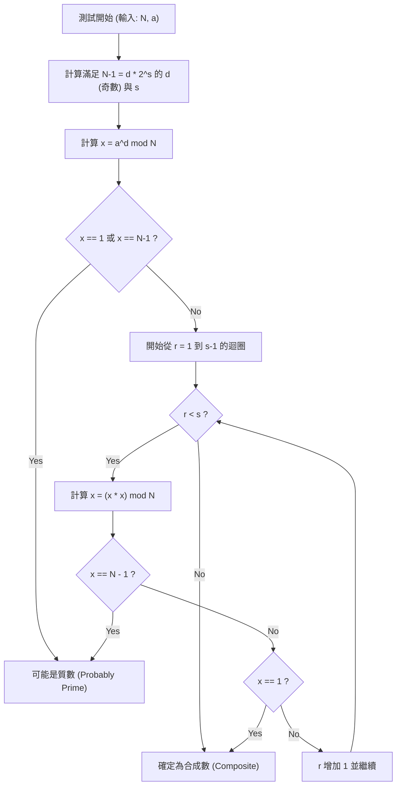

# 前言：為何需要高速的質數判定

在資訊科學、密碼學理論，或是在競技程式設計的世界中，高速且準確地判定「某個數是否為質數」，是一項非常重要且基礎的課題。例如，支撐現代網際網路社會資訊安全的 RSA 加密等公開金鑰密碼系統，就是以生成巨大質數及其乘積的反向計算（質因數分解）的困難度，作為其安全性的基礎。因此，能瞬間分辨巨大數字是否為質數的技術，稱之為支撐數位社會根基的技術也毫不為過。

此外，在競技程式設計（如 AtCoder 或 Codeforces 等）中，質數判定也是經常出現的主題。面對條件限制為 $N \le 10^{18}$ 等巨大的輸入值，且必須在 1 秒內進行數萬次質數判定的情況，傳統且樸素的演算法絕對會超時（Time Limit Exceeded: TLE）。

本文將從樸素的質數判定演算法開始，介紹機率性質數判定法「費馬質數性檢驗（Fermat Primality Test）」，接著探討克服其弱點、在實用上堪稱最強等級的高速演算法「米勒-拉賓（Miller-Rabin）質數判定法」。我們將從數學背景出發，一直到 C++ 中高度最佳化的實作進行徹底解說。特別是針對 64 位元整數（$N < 2^{64}$），不僅止於機率性判定，還會詳細說明能「100% 準確判定質數（決定性判定）」的方法，並提供在實戰中可直接使用的 C++ 原始碼。

---

# 1. 質數判定的基礎與試除法 (Trial Division)

質數（Prime number）是指除了 1 和其本身之外，沒有其他正因數的大於等於 2 的自然數。若忠實地依照質數的定義，要判定某個整數 $N$ 是否為質數，可以將 $N$ 除以從 $2$ 到 $N-1$ 之間的所有整數。如果完全無法被整除，則為質數；只要能被整除一次，則判斷為合成數（非質數）。

然而，這個方法的複雜度為 $O(N)$，當 $N$ 是如 $10^{18}$ 般巨大的數字時，即使是現代的電腦也會耗費龐大的計算時間。

## 試除法的最佳化：探索至 $\sqrt{N}$

當合成數 $N$ 可以表示為 $a \times b = N$ （$a \le b$）時，必然滿足 $a \le \sqrt{N}$。因此，質數判定的迴圈不需要執行到 $N-1$，只需檢查到 $\sqrt{N}$ 就足夠了。

```cpp
#include <iostream>

// 試除法的質數判定 (O(sqrt(N)))
bool is_prime_trial_division(long long n) {
    if (n <= 1) return false;
    if (n == 2 || n == 3) return true;
    if (n % 2 == 0) return false;
    
    // 僅檢查 3 以上的奇數
    for (long long i = 3; i * i <= n; i += 2) {
        if (n % i == 0) return false;
    }
    return true;
}
```

此演算法的複雜度為 $O(\sqrt{N})$。如果 $N \le 10^{12}$ 左右，可以在瞬間計算完成；但當 $N \approx 10^{18}$ 時，迴圈次數約為 $10^9$ 次，即使使用 C++ 環境處理，也會耗費數百毫秒到數秒的時間，因此不適合用於多次判定。

---

# 2. 費馬質數性檢驗：機率性質數判定的開端

為了突破試除法的極限，人們發想出運用數論定理的「機率性演算法（Probabilistic Algorithm）」。其代表性例子便是利用費馬小定理的「費馬質數性檢驗（Fermat Primality Test）」。

## 費馬小定理 (Fermat's Little Theorem)

皮埃爾·德·費馬（Pierre de Fermat）所發現的這個定理，其主張如下：

> 對於任意質數 $p$ 與互質的（非 $p$ 的倍數）任意整數 $a$，下列同餘式成立：
> $$ a^{p-1} \equiv 1 \pmod p $$

取此定理的逆否命題，可以說：「對於某個整數 $N$ 以及與 $N$ 互質的整數 $a$，若 $a^{N-1} \not\equiv 1 \pmod N$，則 $N$ 必定是合成數」。利用這個性質，針對要判定的數字 $N$ 隨機選擇一個底數（base）$a$，並計算 $a^{N-1} \pmod N$ 確認其是否等於 $1$，這就是費馬質數性檢驗。

## 高速的模冪運算（重複平方法）

為了進行費馬質數性檢驗，必須高速計算 $a^{N-1} \pmod N$ 這種巨大的冪次方。為此我們會使用「重複平方法（Modular Exponentiation / Binary Exponentiation）」。其複雜度為 $O(\log N)$，速度非常快。

```cpp
// 使用重複平方法計算 a^b mod m
long long mod_pow(long long a, long long b, long long m) {
    long long res = 1;
    a %= m;
    while (b > 0) {
        if (b & 1) res = (__int128_t)res * a % m;
        a = (__int128_t)a * a % m;
        b >>= 1;
    }
    return res;
}
```
※ 這裡為了防止溢位，使用了 GCC/Clang 的擴充型別 `__int128_t`（128 位元整數）來保存計算過程中的乘積。

## 偽質數與卡邁克爾數 (Carmichael Numbers)

費馬質數性檢驗雖然非常強大，但存在著致命的弱點。那就是，即使 $N$ 是合成數，卻對於所有 $a$（與 $N$ 互質的 $a$）都會成立 $a^{N-1} \equiv 1 \pmod N$ 的數字是存在的。

這樣的數字被稱為「絕對偽質數」或「卡邁克爾數」。最小的卡邁克爾數為 $561 = 3 \times 11 \times 17$。

因為存在卡邁克爾數，單靠費馬質數性檢驗無法進行「100% 機率」的決定性判定。無論嘗試多少個不同的 $a$，像 $561$ 這樣的數字都會一直偽裝成質數（欺騙檢驗）。

---

# 3. 米勒-拉賓質數判定法 (Miller-Rabin Primality Test)

完美克服費馬質數性檢驗弱點（卡邁克爾數的存在）的，是由米勒（Gary L. Miller）與拉賓（Michael O. Rabin）所提出的「米勒-拉賓質數判定法」。
目前，作為實用的高速質數判定演算法，它被最廣泛地應用在各種程式語言的內部函式庫以及密碼系統的金鑰生成中。

## 數學原理

米勒-拉賓演算法除了費馬小定理外，還利用了「在以質數為模的餘數體（$\mathbb{Z}/p\mathbb{Z}$）中，$x^2 \equiv 1 \pmod p$ 的解僅限於 $x \equiv 1$ 或 $x \equiv -1$」的性質（若以合成數為模，則可能存在這兩個解以外的非平凡平方根）。

將想判定的奇數 $N$ 減去 $1$ 得到的 $N-1$ 必然是偶數。因此，將 $N-1$ 不斷除以 $2$ 直到無法整除為止，並以下列形式表示：
$$ N-1 = d \cdot 2^s $$
（其中，$d$ 為奇數，$s \ge 1$）

對於任意底數 $a$（$1 < a < N-1$），我們會依據費馬小定理驗證是否滿足 $a^{N-1} \equiv 1 \pmod N$，但這個計算將分階段進行。
具體來說，我們會依序重複進行平方：$a^d, a^{d \cdot 2}, a^{d \cdot 4}, \ldots, a^{d \cdot 2^s}$。

米勒-拉賓檢驗將 $N$ 判定為「質數（或有極高機率為質數）」的條件是，滿足以下 **任一** 情況：

1. $a^d \equiv 1 \pmod N$
2. 存在某個 $r$（$0 \le r < s$），使得 $a^{d \cdot 2^r} \equiv -1 \pmod N$ 成立。
   ※ 在 C++ 的模運算中，$-1 \pmod N$ 會變成 $N-1$。

如果 $N$ 是質數，對於任意的 $a$ 必然會滿足此條件。反之，如果 $N$ 是合成數，隨機選擇 $a$ 時滿足此條件的機率（被欺騙的機率）在數學上已證明小於等於 $\frac{1}{4}$。
只要進行 $k$ 次獨立的測試，誤判的機率就會降至 $\left(\frac{1}{4}\right)^k$ 以下，在實用上可視為零。因此不存在像卡邁克爾數那樣「絕對能矇混過關」的數字。

## 米勒-拉賓法的演算法流程（Mermaid 流程圖）

下圖展示了米勒-拉賓質數判定法單次測試（針對單一底數 $a$ 的測試）的邏輯流程。



---

# 4. 針對 64 位元整數的決定性判定

米勒-拉賓質數判定法原本是「機率性」的演算法，但如果 $N$ 的上限是固定的，只要測試特定一組 $a$（底數），就可以「100% 準確地」進行質數判定。
這稱為 **決定性米勒-拉賓檢驗（Deterministic Miller-Rabin Test）**。

根據 Jim Sinclair 等人的研究，對於所有 $N < 2^{64}$（約 $1.8 \times 10^{19}$）的整數，只要選擇以下 $7$ 個質數作為底數 $a$ 進行測試，就足以進行完全的決定性判定。

**應測試的底數 $a$ 列表：**
`{2, 325, 9375, 28178, 450775, 9780504, 1795265022}`

或者，使用另一個廣為人知的集合，即以下 $12$ 個質數，也能對 $N < 2^{64}$ 以下的數字進行完美的判定：
`{2, 3, 5, 7, 11, 13, 17, 19, 23, 29, 31, 37}`

本次為了提升演算法的簡潔度與可靠性，我們採用以這 $12$ 個質數作為基礎（或更加最佳化的 $7$ 個基礎）的手法。在 C++ 的實作中，透過條件分支來區分範圍，進行最佳化以將測試次數降至最低。

---

# 5. C++ 的進階實作 (Highly Optimized C++ Implementation)

那麼，我們將統整到目前為止的數學理論與演算法設計，展示在現代 C++ 中堪稱最強等級的米勒-拉賓質數判定函式的實作程式碼。

## 實作重點
1. **避免 64 位元整數乘法的溢位：**
   當 $N \approx 10^{18}$ 時，模乘算中的 $x \times x$ 最大會達到 $10^{36}$，輕易就會超過一般 64 位元整數（`uint64_t` 或 `long long`）的最大值 $1.8 \times 10^{19}$ 發生溢位。
   為了解決這個問題，可以使用 GCC 或 Clang 的擴充型別 `__int128_t`（或 `unsigned __int128`），在 128 位元的精度下進行計算後再取模。如此一來，不需要複雜的演算法就能高速進行模乘算。

2. **選擇決定性的基礎（Base）：**
   當 $N$ 的值較小時，會進行最佳化，使其只需測試少數的底數（base）。

## 完整的 C++ 原始碼

下列展示了可以直接投入實戰的完整版原始碼。這段程式碼可以直接複製到競技程式設計等環境中使用。

```cpp
#include <iostream>
#include <vector>
#include <cstdint>
#include <initializer_list>

using namespace std;

// 使用 128 位元整數的高速 (a * b) mod m
inline uint64_t mod_mul(uint64_t a, uint64_t b, uint64_t m) {
    return (uint64_t)((unsigned __int128)a * b % m);
}

// 使用重複平方法計算 (base^exp) mod m
uint64_t mod_pow(uint64_t base, uint64_t exp, uint64_t m) {
    uint64_t res = 1;
    base %= m;
    while (exp > 0) {
        if (exp & 1) res = mod_mul(res, base, m);
        base = mod_mul(base, base, m);
        exp >>= 1;
    }
    return res;
}

// 針對 64 位元整數，使用米勒-拉賓質數判定法進行決定性判定
bool is_prime_miller_rabin(uint64_t n) {
    // 邊界值與小質數的事前判定
    if (n < 2) return false;
    if (n == 2 || n == 3 || n == 5 || n == 7) return true;
    if (n % 2 == 0 || n % 3 == 0 || n % 5 == 0 || n % 7 == 0) return false;

    // 將 n-1 分解為 d * 2^s 的形式
    uint64_t d = n - 1;
    int s = 0;
    while ((d & 1) == 0) {
        d >>= 1;
        s++;
    }

    // 判定所使用的底數 (bases) 列表
    // 根據 N 的大小進行最佳化，將需要測試的 base 數量降至最低
    vector<uint64_t> bases;
    if (n < 4759123141ULL) {
        bases = {2, 7, 61};
    } else if (n < 1122004669633ULL) {
        bases = {2, 13, 23, 1662803};
    } else {
        // 對所有 N < 2^64 的數字皆具決定性的 7 個底數
        bases = {2, 325, 9375, 28178, 450775, 9780504, 1795265022};
    }

    // 對每個底數執行測試
    for (uint64_t a : bases) {
        a %= n;
        if (a == 0) continue; // 若 a 是 n 的倍數則無法判定，但表示這不是質數

        uint64_t x = mod_pow(a, d, n);
        if (x == 1 || x == n - 1) continue; // 通過第一條件，換下一個底數

        bool composite = true;
        // 執行 s-1 次的迴圈 (x = x^2 mod n)
        for (int r = 1; r < s; r++) {
            x = mod_mul(x, x, n);
            if (x == n - 1) {
                composite = false; // 通過第二條件，有可能是質數
                break;
            }
        }
        
        // 若都不滿足條件，則確實是合成數
        if (composite) return false;
    }

    // 若所有 base 的條件都通過，則確實是質數
    return true;
}

int main() {
    // 測試範例
    vector<uint64_t> test_cases = {
        1000000007,           // 著名的質數
        998244353,            // 著名的質數
        1000000000000000003,  // 接近 10^18 的質數
        1000000000000000007,  // 合成數 (10^18 + 7)
        561,                  // 卡邁克爾數 (合成數)
        18446744073709551557ULL // 接近 2^64 的最大質數之一
    };

    for (uint64_t n : test_cases) {
        cout << n << " is " 
             << (is_prime_miller_rabin(n) ? "Prime" : "Composite") 
             << endl;
    }

    return 0;
}
```

---

# 6. 演算法的複雜度與效能評估

這裡我們探討所實作演算法的效能。

## 時間複雜度 (Time Complexity)
* **試除法：** $O(\sqrt{N})$
* **費馬質數性檢驗：** 冪運算 $O(\log N) \times k$ （$k$ 為測試次數）
* **米勒-拉賓法：** 冪運算與迴圈 $O(\log N) \times k$

在 64 位元環境（$N \le 2^{64}$）下，上述的決定性米勒-拉賓法最多只會驗證 $7$ 個底數。因此，可以將 $k \le 7$ 視為常數，整體的時間複雜度嚴格來說就是 $O(\log N)$。
即使在最極端的情況下（$N \approx 10^{19}$），執行步驟數也只會被控制在最多 $7 \times 64 = 448$ 步的基本運算之內，執行時間低於數微秒（$10^{-6}$ 秒）。與試除法的 $O(\sqrt{N})$ （迴圈次數 $\approx 4 \times 10^9$ 次）相比，達到了 **數百萬倍的高速化**。

## 進一步的最佳化：蒙哥馬利乘模運算 (Montgomery Multiplication)

在本文的實作中，使用了 128 位元整數的擴充型別 `__int128_t` 來進行除法（模運算 `%`）。即使在現代 CPU 中，整數除法（DIV 指令）與加法或乘法相比，依然是需要耗費數十個週期的昂貴指令。

追求更極限最佳化的函式庫開發者或競技程式設計師，有時會採用名為 **蒙哥馬利乘模運算（Montgomery Multiplication）** 的手法。蒙哥馬利乘模運算是一種驚人的演算法，它透過將數值映射到特殊的「蒙哥馬利空間」，將高成本的模運算（除法）替換為「只有位元位移與乘法」。
若將此技術整合進米勒-拉賓判定的模乘算中，可以進一步將執行速度提升 2 到 3 倍。因為這是一個非常深奧的主題，我想在另一篇文章中進行詳細解說。

---

# 7. 總結

本文從質數判定的基礎到進階內容進行了全面性的解說。
讓我們回顧一下重點：

1. **試除法** 雖然準確，但由於複雜度為 $O(\sqrt{N})$，當 $N$ 超過 $10^{12}$ 時就缺乏實用性。
2. **費馬質數性檢驗** 具備 $O(\log N)$ 的極高速度，但有著會被如卡邁克爾數等絕對偽質數欺騙的致命弱點。
3. **米勒-拉賓質數判定法** 是解決了費馬檢驗弱點、兼具實用性與最強大能力的演算法。
4. 在 C++ 實作中，透過活用 `__int128_t`，能安全地處理 64 位元整數的乘法溢位。
5. 只要在 64 位元整數範圍內（$N < 2^{64}$），選擇特定的 $7$ 個或 $12$ 個質數作為底數，就能進行 **決定性（100% 準確）的質數判定**，而非機率性。

在處理巨大數字運算時，高速的質數判定是一項無可避免的技術。本文所提供的 C++ 米勒-拉賓原始碼，可以直接於實戰中發揮穩健的作用。請務必在您自己的專案或演算法競賽中善加利用。


程式設計與數學交會的演算法世界非常優美且深奧。希望這篇文章能對您未來的學習有所幫助。

---
*Reference:*
- *Pomerance, C., Selfridge, J. L., & Wagstaff, S. S. (1980). The pseudoprimes to 25.10^9. Mathematics of Computation.*
- *Sinclair, J. (2011). Deterministic Miller-Rabin primality testing.*
