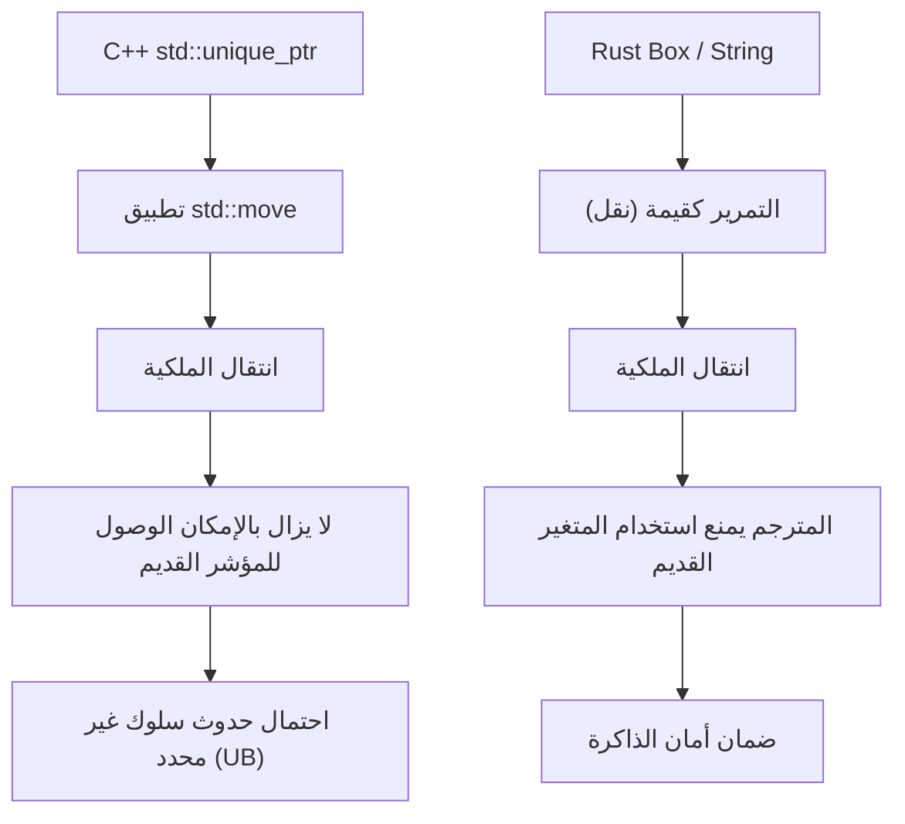
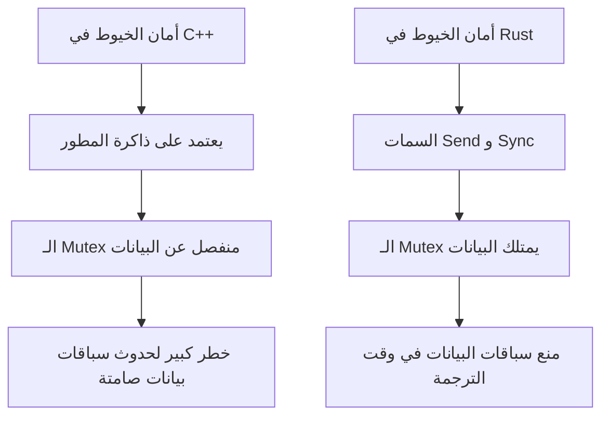
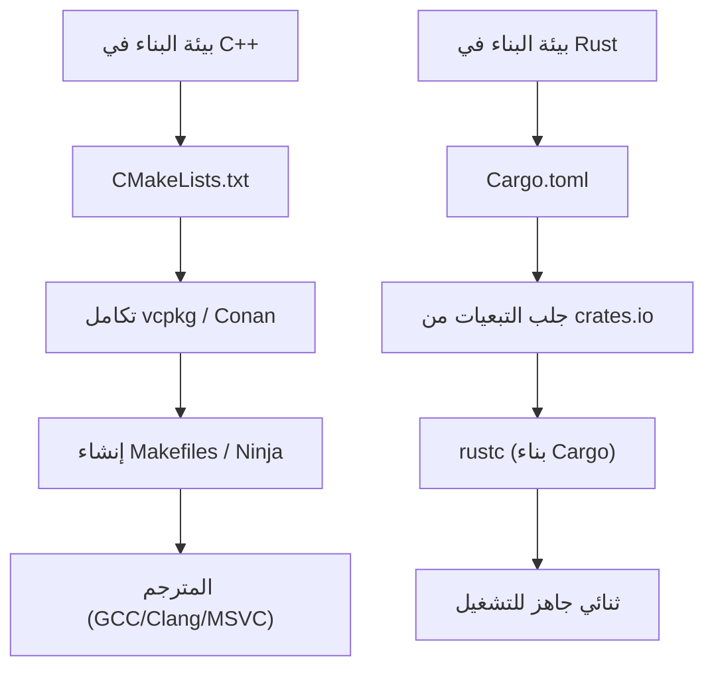

# مقدمة: فجر جديد في برمجة النظم

في هندسة البرمجيات الحديثة، يقف كل من C++ و Rust كعملاقين في طليعة برمجة النظم. لسنوات عديدة، تربعت C++ كملك مطلق في مجالات مثل أنظمة التشغيل، والأجهزة المدمجة، ومحركات الألعاب، وأنظمة التداول عالي التردد (HFT)، حيث يتطلب الأمر استخراج أقصى درجات الأداء من العتاد. بصفتي مهندس C++ أول، بدأت مسيرتي من غابة المؤشرات الخام في حقبة C++98، وواصلت كتابة التعليمات البرمجية بالتزامن مع موجة التحديث التي جلبتها C++11 (إدخال المؤشرات الذكية، وتعبيرات لامدا، و `auto`)، وصولاً إلى التوسع الهائل في المواصفات مع إصدارات C++14/17/20.

ولكن في السنوات الأخيرة، شهدنا صعودًا دراماتيكيًا للغة Rust كحل للمشاكل الهيكلية التي تعاني منها C++ — وتحديدًا "الافتقار إلى أمان الذاكرة" والذي يؤدي إلى ثغرات أمنية (يُقال إن حوالي 70% من ثغرات CVE ناتجة عن أخطاء في الذاكرة) و "المواصفات المعقدة بلا حدود والسلوك غير المحدد (UB)". إن اعتمادها الرسمي في نواة Linux، ومشاريع الانتقال واسعة النطاق إلى Rust من قبل شركات التكنولوجيا العملاقة مثل Microsoft و Google و AWS، لا يعتبر مجرد صيحة عابرة، بل يمثل تحولًا جذريًا في نموذج برمجة النظم.

في هذا المقال، سأقوم بصفتي مهندس C++ متمرس غاص بعمق في تعلم Rust واستخدمها في مشاريع فعلية، بمقارنة وشرح "المزايا" و "العيوب" من منظور تقني أساسي يتعلق بمواصفات اللغة.

---

# 1. التحول النموذجي في إدارة الذاكرة: من RAII إلى الملكية والاستعارة

## حدود RAII في C++ والمؤشرات الذكية

أحد أعظم ابتكارات C++ هو **RAII (اكتساب المورد هو تهيئة)**. هذا المفهوم، الذي يتم فيه تخصيص الموارد في المنشئ (Constructor) وتحريرها تلقائيًا في المدمر (Destructor) عند الخروج من النطاق، قد حرر المطورين من الرعب الناتج عن تسرب الذاكرة بسبب استخدام `new` و `delete` يدويًا. بدءًا من C++11، تمت إضافة `std::unique_ptr` و `std::shared_ptr` إلى المكتبة القياسية، مما جعل مفهوم الملكية (Ownership) قابلًا للتعبير عنه في الشيفرة.

مع ذلك، فإن المؤشرات الذكية ودلالات النقل (Move Semantics) في C++ تعاني من نقطة ضعف قاتلة تتمثل في عدم اكتمال التحقق الثابت (Static Verification) من قبل المترجم (Compiler).

```cpp
#include <iostream>
#include <memory>
#include <string>

void consume(std::unique_ptr<std::string> ptr) {
    std::cout << "Consuming: " << *ptr << std::endl;
}

int main() {
    auto my_ptr = std::make_unique<std::string>("Hello, C++");
    
    // نقل (Move) الملكية إلى الدالة
    consume(std::move(my_ptr));
    
    // خطر: في C++، الوصول إلى كائن بعد نقله لا يؤدي إلى خطأ في الترجمة
    // std::move هو مجرد تحويل إلى مرجع قيمة يمينية (T&&)، والمترجم لا يمنع استخدامه
    if (my_ptr) {
        std::cout << "Pointer is still valid?" << std::endl;
    } else {
        std::cout << "Pointer is null." << std::endl;
    }
    
    // std::cout << *my_ptr << std::endl; // سلوك غير محدد بسبب استخدام الذاكرة بعد تحريرها (Use-After-Free)
    return 0;
}
```

في C++، هناك دائمًا خطر الوصول الخاطئ إلى كائن تم إفراغه (في حالة صالحة ولكن غير محددة) باستخدام `std::move`. يؤدي هذا إلى انهيار البرنامج أثناء التشغيل، أو في أسوأ الحالات، إلى ثغرة أمنية مباشرة.

## الملكية (Ownership) في Rust والدفاع المطلق لمدقق الاستعارة

تدمج Rust مفهوم "الملكية" في التصميم الأساسي للغة، وتُجري تحليلًا ثابتًا صارمًا من خلال ميزة في المترجم تُعرف باسم **مدقق الاستعارة (Borrow Checker)**.

```rust
fn consume(s: String) {
    println!("Consuming: {}", s);
} // هنا يخرج s من النطاق، ويتم تحرير الذاكرة (Drop)

fn main() {
    let my_string = String::from("Hello, Rust");
    
    // نقل الملكية إلى الدالة. في Rust، السلوك الافتراضي هو دلالات النقل.
    consume(my_string);
    
    // خطأ في الترجمة! لا يمكن مطلقًا الوصول إلى المتغير بعد نقله
    // println!("Is it still there? {}", my_string);
}
```

في Rust، بمجرد انتقال ملكية المتغير، يعامله المترجم على أنه في حالة تعادل "غير مهيأ"، ويمنع تمامًا أي وصول لاحق إليه. نتيجة لذلك، فإن الأخطاء مثل "استخدام الذاكرة بعد تحريرها (Use-After-Free)" أو "المؤشر المتدلي (Dangling Pointer)" نظريًا لا يمكنها اجتياز عملية الترجمة.



## الاستعارة (Borrowing) والتحكم في القابلية للتغيير

الأقوى من ذلك هو قواعد "الاستعارة (Borrowing)" التي تشير إلى الموارد. تفرض Rust القواعد التالية:
1. في أي وقت، يمكن أن يوجد **إما** "عدة مراجع غير قابلة للتغيير (`&T`)" **أو** "مرجع واحد قابل للتغيير (`&mut T`)".
2. يجب ألا يعيش المرجع فترة أطول من النطاق الخاص بالبيانات الأصلية (قيود دورة الحياة - Lifetime).

في C++، من السهل إنشاء مراجع أو مؤشرات متعددة قابلة للتغيير (Mutable) لنفس الكائن، مما قد يؤدي إلى تدمير غير متوقع للحالة (مثل إبطال المكرر - Iterator Invalidation). تمنع Rust هذا المزيج من "الأسماء المستعارة (Aliasing) + القابلية للتغيير (Mutability)" على مستوى اللغة، مما يمنع الأخطاء قبل حدوثها.

---

# 2. تخطيط الذاكرة والنفقات الرياضية للمؤشرات الذكية

في برمجة النظم، الفهم الدقيق لتخطيط الذاكرة أمر لا غنى عنه. دعونا نقارن بين `std::shared_ptr` في C++ و `std::rc::Rc` / `std::sync::Arc` في Rust.

يدير `std::shared_ptr` في C++ الموارد عن طريق حساب المراجع، لكنه يستخدم افتراضيًا عمليات ذرية آمنة خيطيًا (`std::atomic`) لزيادة أو تقليل عدد المراجع. يمكن صياغة النفقات العامة على الذاكرة على النحو التالي:

$$ Overhead_{C++} = sizeof(T) + sizeof(ControlBlock) $$

هنا، تتضمن $ControlBlock$ "عداد المراجع القوية (Strong Ref Count)"، و "عداد المراجع الضعيفة (Weak Ref Count)"، و "المحذف المخصص (Custom Deleter)". تكمن المشكلة في أنه حتى في الحالات التي يتم فيها استخدامه في خيط واحد (Single-thread)، فإن النفقات العامة للتعليمات الذرية (مثل قفل خط ذاكرة التخزين المؤقت) تحدث دون قيد أو شرط.

في المقابل، تفصل Rust بصرامة المؤشرات الذكية حسب الغرض:

- **لخيط واحد**: `Rc<T>` (Reference Counted)
- **لخيوط متعددة**: `Arc<T>` (Atomic Reference Counted)

$$ Overhead_{Rc} = sizeof(T) + 2 \times sizeof(usize) $$
$$ Overhead_{Arc} = sizeof(T) + 2 \times sizeof(AtomicUsize) $$

في Rust، إذا استخدمت `Rc<T>` المخصص للخيط الواحد، يمكنك تجنب عقوبة العمليات الذرية بالكامل (تجريد بتكلفة صفرية - Zero-cost abstraction). ومن خلال آلية أمان الخيوط التي سيتم مناقشتها لاحقًا، يتم منع تمرير `Rc<T>` عن طريق الخطأ إلى خيط آخر تمامًا بواسطة نظام الأنواع.

---

# 3. أمان الخيوط: صدمة "التزامن بلا خوف"

لطالما كانت البرمجة متعددة الخيوط في C++ محفوفة دائمًا بخطر سباقات البيانات (Data Races) وحالات الجمود (Deadlocks).

## مخاطر الكائنات المتبادلة (Mutex) وفصل البيانات في C++

`std::mutex` في C++ هو مجرد أداة للتحكم الحصري في "كتلة معينة من التعليمات البرمجية (Critical Section)"، ولا يوجد رابط لغوي بين "البيانات المراد حمايتها" و "الكائن المتبادل (Mutex)".

```cpp
#include <iostream>
#include <thread>
#include <mutex>
#include <vector>

std::vector<int> shared_data;
std::mutex mtx;

void worker() {
    // حتى إذا نسي المطور الحصول على القفل، فسيتم الترجمة بشكل طبيعي
    // std::lock_guard<std::mutex> lock(mtx);
    shared_data.push_back(1); // سباق بيانات قاتل!
}

int main() {
    std::thread t1(worker);
    std::thread t2(worker);
    t1.join();
    t2.join();
    return 0;
}
```

## الكائنات المتبادلة (Mutex) في Rust "تمتلك" البيانات

في Rust، **تغلف (تمتلك)** `Mutex<T>` نوع البيانات المحمي `T` باستخدام الأنواع العامة (Generics). للوصول إلى البيانات، يجب عليك استدعاء `lock()` للحصول على كائن الحارس (Guard). من المستحيل نحويًا لمس البيانات دون الحصول على القفل.

```rust
use std::sync::{Arc, Mutex};
use std::thread;

fn main() {
    // البيانات مغلفة بالكامل داخل Mutex
    let shared_data = Arc::new(Mutex::new(Vec::new()));
    let mut handles = vec![];

    for _ in 0..2 {
        // استنساخ Arc (حساب المراجع الآمن خيطيًا) لمشاركته بين الخيوط
        let data_clone = Arc::clone(&shared_data);
        let handle = thread::spawn(move || {
            // لا يمكنك الوصول إلى Vec الداخلي إذا لم تحصل على القفل
            let mut data = data_clone.lock().unwrap();
            data.push(1);
        });
        handles.push(handle);
    }

    for handle in handles {
        handle.join().unwrap();
    }
}
```

علاوة على ذلك، تمتلك Rust سمتين أساسيتين (Traits) تضمنان أمان المعالجة المتزامنة:
- `Send`: الأنواع التي يمكن نقل ملكيتها بأمان بين الخيوط
- `Sync`: الأنواع التي يكون من الآمن الإشارة إليها (استعارتها) من عدة خيوط في نفس الوقت

على سبيل المثال، لا ينفذ `Rc<T>` غير الآمن خيطيًا السمة `Send`. لذلك، إذا حاولت تمريره إلى `thread::spawn`، فسيؤدي ذلك فورًا إلى خطأ في الترجمة. بفضل "التزامن بلا خوف (Fearless Concurrency)" هذا، يتم تحرير المطورين من الخوف من الأخطاء، مما يسمح لهم بدفع عملية الموازاة بقوة أكبر.

وفقًا لقانون أمدال (Amdahl's Law)، يتم التعبير عن الحد الأقصى للإنتاجية النظرية عند وجود جزء قابل للموازاة $P$ ودرجة التوازي $N$ على النحو التالي:

$$ S(N) = \frac{1}{(1 - P) + \frac{P}{N}} $$

تسمح Rust بإجراء عمليات إعادة الهيكلة (Refactoring) لتعظيم قيمة $P$ بأمان تام بالاعتماد على نظام الأنواع.



---

# 4. معالجة الأخطاء: الاستثناءات مقابل أنواع البيانات الجبرية

المعيار لمعالجة الأخطاء في C++ هو "الاستثناءات (Exceptions)". ومع ذلك، فإن الاستثناءات تجعل تدفق التحكم غير شفاف، وتسبب عقوبات في الأداء (فك المكدس - Stack Unwinding - وتضخم RTTI). في الأنظمة المدمجة ومحركات الألعاب، غالبًا ما يتم تعطيل الاستثناءات تمامًا (`-fno-exceptions`) واعتماد تصميم يعيد رموز الخطأ الكلاسيكية. في C++23، تم إدخال `std::expected`، لكن سيستغرق الأمر وقتًا حتى ينتشر في جميع أنحاء النظام البيئي.

لا يوجد مفهوم للاستثناءات في Rust. يتم إرجاع الأخطاء كـ "قيم" بحتة، ويتم التعبير عنها بواسطة النوع المعداد (نوع بيانات جبري) `Result<T, E>`.

```rust
use std::fs::File;
use std::io::{self, Read};

// بالنظر إلى نوع القيمة المرجعة فقط، يتضح أنه يمكن أن يحدث خطأ IO
fn read_file_content(path: &str) -> Result<String, io::Error> {
    // يؤدي المشغل ? إلى العودة المبكرة (Early return) فورًا في حالة حدوث خطأ، أو يستخرج المحتوى في حالة النجاح
    let mut file = File::open(path)?; 
    let mut content = String::new();
    file.read_to_string(&mut content)?;
    Ok(content)
}
```

هذا المشغل `?` ثوري. فهو يزيل التداخل العميق (هرم جمل if) الذي يحدث عند فحص رموز الخطأ في C++، ويحافظ على تدفق الشيفرة النظيف تمامًا كاستخدام الاستثناءات، مع السماح لك بوصف صريح لاستدعاءات الدوال التي ستنقل الخطأ.

---

# 5. تعدد الأشكال (Polymorphism): من الدوال الافتراضية والقوالب إلى السمات

يتم تحقيق تعدد الأشكال في C++ بشكل أساسي من خلال وراثة الفئات (Class Inheritance) والإرسال الديناميكي (Dynamic Dispatch) باستخدام الدوال الافتراضية (`virtual`)، أو الإرسال الثابت (Static Dispatch) باستخدام القوالب (Templates) (مثل CRTP).

في الإرسال الديناميكي، يتم تضمين مؤشر (vptr) إلى جدول الدوال الافتراضية (vtable) في الكائن، وتحدث نفقات إضافية لحل المؤشر عند استدعاء الدالة.

$$ T_{dispatch} = T_{lookup\_in\_vtable} + T_{dereference} $$

تخلت Rust عن "وراثة الفئات" الكلاسيكية الموجهة للكائنات، واعتمدت بدلاً من ذلك مفهوم "**السمات (Traits)**" (تشبه Concept في C++20، لكنها تتمتع بوظائف أكثر).

```rust
trait Drawable {
    fn draw(&self);
}

struct Circle { radius: f64 }
impl Drawable for Circle {
    fn draw(&self) { println!("Drawing a Circle of radius {}", self.radius); }
}

// إرسال ثابت (Static dispatch) (أحادي الشكل - بدون نفقات عامة)
fn draw_static<T: Drawable>(item: &T) {
    item.draw();
}

// إرسال ديناميكي (Dynamic dispatch) (كائن السمة - Trait Object)
fn draw_dynamic(item: &dyn Drawable) {
    item.draw();
}
```

أهم ما يميز الإرسال الديناميكي في Rust (`dyn Trait`) هو أنه لا يمتلك vptr داخل بنية البيانات، بل يستخدم **مؤشرًا سمينًا (Fat Pointer)**. يحتفظ المؤشر السمين بزوج يتكون من "مؤشر إلى البيانات" و "مؤشر إلى vtable". هذا يجعل من السهل جدًا تنفيذ (أو توسيع) السمات للأنواع المعرفة في المكتبات الخارجية لاحقًا وإرسالها ديناميكيًا.

---

# 6. إدارة الحزم ونظام البناء: معاناة CMake مقابل نِعَم Cargo

تعد غياب مدير حزم قياسي أحد أكبر نقاط الضعف في C++. لطالما استنزفت صياغة `CMakeLists.txt` الغامضة، وتعقيد حل التبعيات بواسطة `find_package`، والاختلافات في مسارات المكتبات باختلاف أنظمة التشغيل، قدرًا هائلاً من وقت مهندسي C++.

تأتي Rust مزودة بـ **Cargo** بشكل قياسي، وهو أحد أفضل مديري الحزم وأنظمة البناء في العالم.



بمجرد إضافة سطر واحد يحتوي على اسم المكتبة التابعة (Crate) وإصدارها في `Cargo.toml`، يتم حل التبعيات المتعدية وتنزيلها وبناؤها بشكل آلي بالكامل. وعلاوة على ذلك، يتم دمج جميع سلاسل الأدوات اللازمة للتطوير - مثل الاختبار (`cargo test`)، وتوليد التوثيق (`cargo doc`)، والتحليل الثابت (`cargo clippy`)، ومنسق الشيفرة (`cargo fmt`) - في هذا الأمر الواحد. هذه الراحة قوية لدرجة أنك بمجرد تجربتها، لن ترغب في العودة إلى بيئة بناء C++.

---

# 7. عيوب ومنحنى التعلم عند تعلم Rust

لقد تحدثت حتى الآن عن مزايا Rust، ولكن بالتأكيد توجد "جدران" وعيوب سيواجهها مهندس C++ عند وضع Rust موضع التنفيذ الفعلي.

## 1. صراع مرير مع مدقق الاستعارة
إذا حاولت تنفيذ هياكل البيانات (مثل القوائم المترابطة ثنائية الاتجاه، وهياكل الرسوم البيانية، والهياكل ذاتية المرجعية، وغيرها) التي كنت تربطها "بشكل أو بآخر بمؤشرات خام" في C++ بنفس الطريقة في Rust، فلن تجتاز الترجمة بسبب قيود الملكية ودورة الحياة. لإرضاء مدقق الاستعارة، يتعين عليك استخدام تغليف معقد مثل `Rc<RefCell<T>>`، أو إعادة التفكير في التصميم من الأساس ليعتمد على مخصصات الساحة (Arena Allocators) أو الإدارة المستندة إلى المؤشرات (Index-based).

## 2. طول وقت الترجمة
في حين أن بناء C++ يصبح بطيئًا أيضًا بسبب تداخل القوالب (Templates)، إلا أن وقت الترجمة في Rust (خاصة عند البناء النظيف من الصفر - Clean Build) ليس قصيرًا على الإطلاق. وبسبب تزامن مسارات التحسين القوية لـ LLVM، وتوسيع وحدات الماكرو، وأحادية الشكل للأنواع العامة (Monomorphization)، يصبح وقت البناء عنق زجاجة في المشاريع الكبيرة. خلال مرحلة التطوير، من الضروري استخدام حيل مثل الاعتماد الكبير على `cargo check`.

## 3. قابلية التشغيل البيني مع قواعد شيفرة C++ الحالية
في حين أن التكامل مع لغة C (عبر FFI) سلس للغاية، إلا أنه من الصعب جدًا ربط Rust مباشرة بقواعد شيفرة C++ الضخمة الحالية (التي تعتمد بشكل كبير على الفئات، والقوالب، والدوال الافتراضية). في السنوات الأخيرة، تطورت أدوات الجسر مثل `cxx` و `autocxx`، ولكن لا تزال هناك عقبات كبيرة أمام تحقيق انتقال سلس ومثالي.

---

# الخلاصة: هل يجب علينا الانتقال إلى Rust؟

ستستمر C++ في لعب دور مهم في تطوير محركات الألعاب والبنى التحتية الضخمة الحالية. كما أن التحديثات التي أدخلت عبر C++20/23 كانت ملحوظة، مما جعل كتابة الشيفرة أكثر أمانًا من ذي قبل.

ولكن، بالنسبة لـ "مشاريع برمجة النظم الجديدة"، أجد الآن أنه **من الصعب إيجاد سبب يمنعنا من اختيار Rust**. بمجرد اجتياز عملية الترجمة، يتم تحريرك من الخوف من السلوكيات غير المحددة (UB) وتدمير الذاكرة، و"اليقين" الذي تقدمه Rust بقدرتها على أداء المعالجة المتزامنة بأمان وبأداء عالٍ يحسن بشكل كبير من النموذج الذهني للمهندس.

بالنسبة لمهندس C++، لا يقتصر تعلم Rust على مجرد حفظ صياغة جديدة (Syntax)، بل هو تجربة رائعة لاكتساب منظور جديد حول "كيفية إدارة الذاكرة والخيوط بشكل آمن". أدعوكم جميعًا لتجربة راحة Cargo وصرامة مدقق الاستعارة بأنفسكم.
