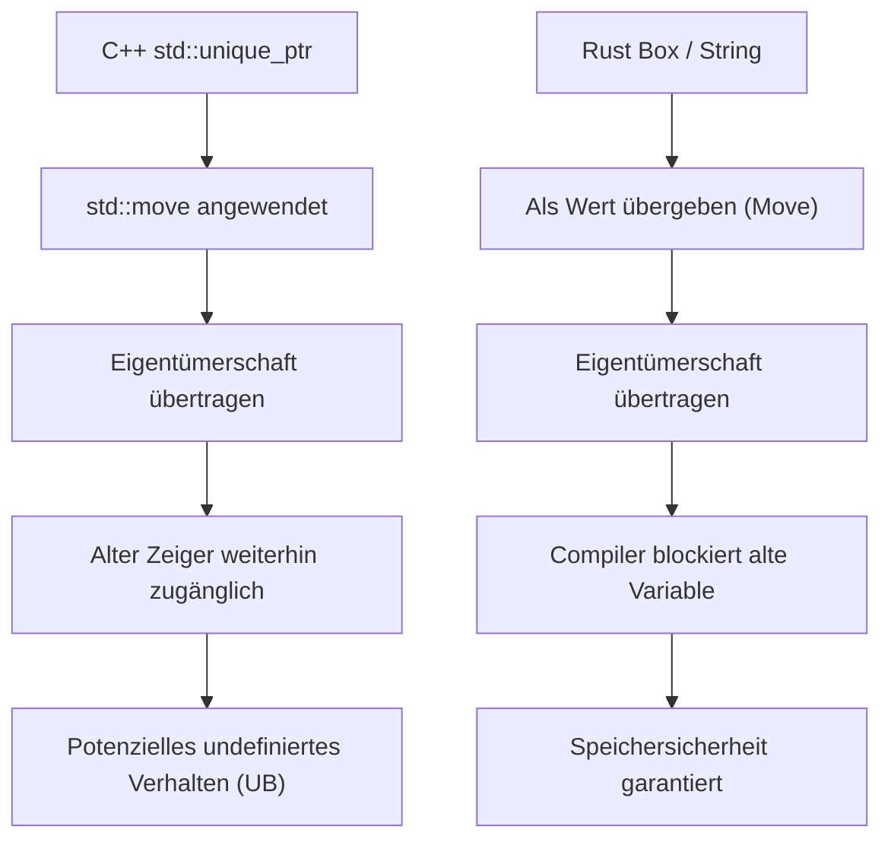
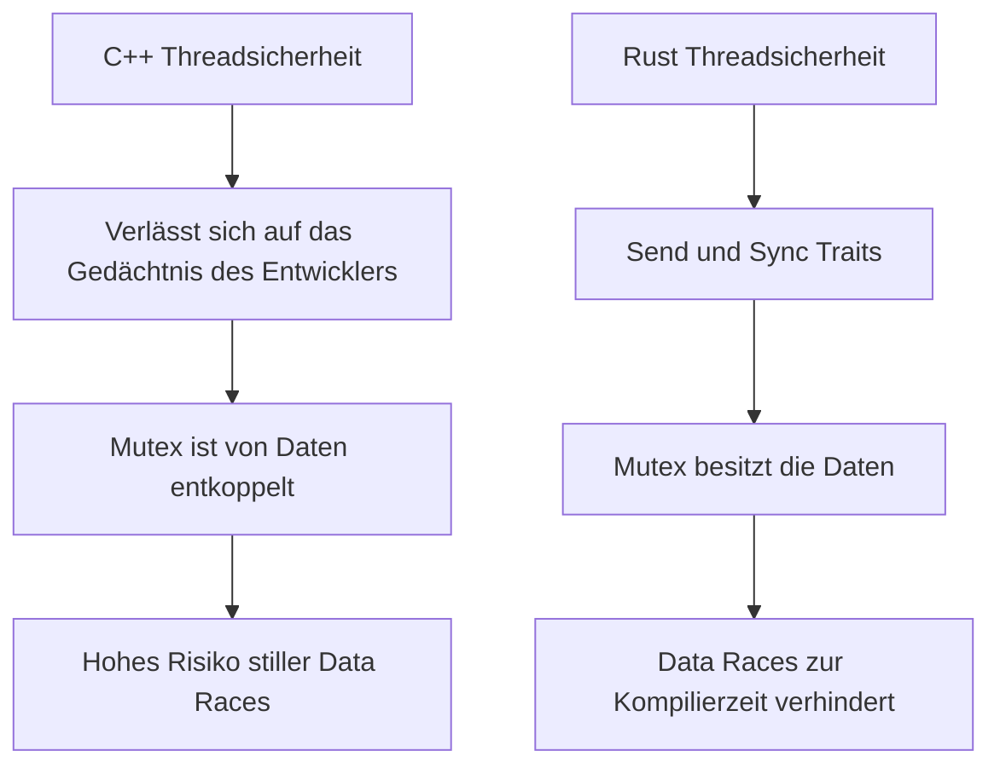
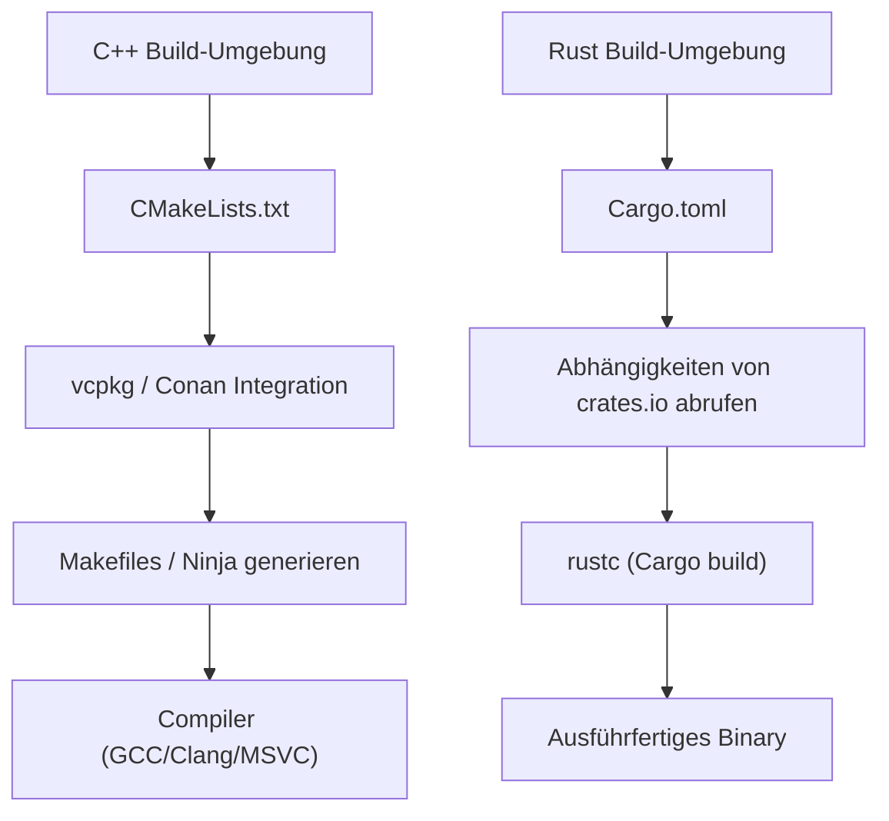

# Einführung: Eine neue Morgenröte in der Systemprogrammierung

In der modernen Softwareentwicklung sind C++ und Rust die zwei großen Giganten, die an vorderster Front der Systemprogrammierung stehen. Viele Jahre lang herrschte C++ als absoluter König in Bereichen, in denen extreme Hardwareleistung gefordert ist, wie Betriebssysteme, eingebettete Geräte, Spiele-Engines und Hochfrequenzhandel (HFT). Ich selbst schreibe als Senior-C++-Entwickler seit der C++98-Ära mit ihrem Dschungel aus rohen Zeigern Code und habe die Welle der Modernisierung durch C++11 (Einführung von Smart Pointern, Lambda-Ausdrücken und `auto`) sowie die kontinuierliche Vergrößerung der Spezifikationen in C++14/17/20 hautnah miterlebt.

In den letzten Jahren hat Rust jedoch als Lösung für die strukturellen Probleme von C++ – insbesondere das "Fehlen von Speichersicherheit", das zu Sicherheitslücken führt (etwa 70% der CVEs sollen speicherbedingt sein), und die "endlos komplexen Spezifikationen sowie undefiniertes Verhalten (UB)" – einen dramatischen Aufstieg erlebt. Die offizielle Einführung in den Linux-Kernel sowie groß angelegte Migrationsprojekte zu Rust durch Tech-Giganten wie Microsoft, Google und AWS sind nicht nur ein vorübergehender Trend, sondern bedeuten einen Paradigmenwechsel in der Systemprogrammierung.

In diesem Artikel werde ich die "Vorteile" und "Nachteile", die ich als waschechter C++-Entwickler beim tiefgreifenden Erlernen und praktischen Einsatz von Rust erfahren habe, aus einer technischen Perspektive, die an die Grundlagen des Sprachdesigns rührt, gründlich vergleichen und erläutern.

---

# 1. Paradigmenwechsel in der Speicherverwaltung: Von RAII zu Ownership und Borrowing

## Die Grenzen von RAII und Smart Pointern in C++

Eine der größten Erfindungen von C++ ist **RAII (Resource Acquisition Is Initialization)**. Dieses Konzept, bei dem Ressourcen im Konstruktor gesichert und beim Verlassen des Gültigkeitsbereichs (Scope) im Destruktor automatisch freigegeben werden, befreite Entwickler von der Angst vor Speicherlecks durch manuelles `new` und `delete`. Seit C++11 wurden `std::unique_ptr` und `std::shared_ptr` in die Standardbibliothek eingeführt, wodurch das Konzept der Eigentümerschaft (Ownership) im Code darstellbar wurde.

Allerdings haben die Smart Pointer und die Move-Semantik von C++ eine fatale Schwäche: Die statische Überprüfung durch den Compiler ist unvollständig.

```cpp
#include <iostream>
#include <memory>
#include <string>

void consume(std::unique_ptr<std::string> ptr) {
    std::cout << "Consuming: " << *ptr << std::endl;
}

int main() {
    auto my_ptr = std::make_unique<std::string>("Hello, C++");
    
    // Eigentümerschaft an die Funktion übertragen (Move)
    consume(std::move(my_ptr));
    
    // Gefahr: In C++ führt der Zugriff auf das Objekt nach dem Move nicht zu einem Kompilierungsfehler.
    // std::move ist nur ein Cast zu einer R-Value-Referenz (T&&) und der Compiler blockiert die Nutzung nicht.
    if (my_ptr) {
        std::cout << "Pointer is still valid?" << std::endl;
    } else {
        std::cout << "Pointer is null." << std::endl;
    }
    
    // std::cout << *my_ptr << std::endl; // Undefiniertes Verhalten durch Nutzung nach Freigabe (Use-After-Free)
    return 0;
}
```

In C++ besteht immer das Risiko, versehentlich auf ein Objekt zuzugreifen, das durch `std::move` entleert wurde (ein gültiger, aber unspezifizierter Zustand). Dies führt unmittelbar zu Abstürzen zur Laufzeit oder im schlimmsten Fall zu Sicherheitslücken.

## Rusts Eigentümerschaft (Ownership) und die absolute Verteidigung des Borrow Checkers

Rust hat dieses Konzept der "Eigentümerschaft" in das Kerndesign der Sprache integriert und führt durch eine Compiler-Funktion namens **Borrow Checker** eine strenge statische Analyse durch.

```rust
fn consume(s: String) {
    println!("Consuming: {}", s);
} // Hier verlässt s den Scope und der Speicher wird freigegeben (Drop)

fn main() {
    let my_string = String::from("Hello, Rust");
    
    // Eigentümerschaft wird an die Funktion gemovet. In Rust ist Move-Semantik der Standard.
    consume(my_string);
    
    // Kompilierungsfehler! Auf eine Variable nach einem Move kann unter keinen Umständen mehr zugegriffen werden
    // println!("Is it still there? {}", my_string);
}
```

Wenn in Rust die Eigentümerschaft einer Variablen verschoben wird, behandelt der Compiler die ursprüngliche Variable so, als wäre sie "uninitialisiert", und blockiert jeglichen weiteren Zugriff vollständig. Dadurch können Fehler wie "Use-After-Free" oder "Dangling Pointers" theoretisch nicht durch die Kompilierung gelangen.



## Ausleihen (Borrowing) und die Kontrolle der Veränderbarkeit

Noch leistungsfähiger sind die Regeln für das "Ausleihen (Borrowing)", bei dem eine Referenz auf eine Ressource erstellt wird. In Rust werden folgende Regeln erzwungen:
1. Zu einem beliebigen Zeitpunkt darf **entweder** "mehrere unveränderliche Referenzen (`&T`)" **oder** "genau eine veränderliche Referenz (`&mut T`)" existieren, aber nicht beides gleichzeitig.
2. Eine Referenz darf nicht länger leben als die Daten, auf die sie verweist (Lebensdauer-Beschränkungen / Lifetimes).

In C++ können problemlos mehrere veränderliche Referenzen oder Zeiger auf dasselbe Objekt erstellt werden, was zu unerwarteter Zerstörung des Zustands (wie Invalidation von Iteratoren) führen kann. Rust verhindert solche Fehler im Vorfeld, indem es die Kombination aus "Aliasing" und "Mutability" (Veränderbarkeit) auf Sprachebene verbietet.

---

# 2. Speicherlayout und der mathematische Overhead von Smart Pointern

In der Systemprogrammierung ist ein genaues Verständnis des Speicherlayouts unerlässlich. Vergleichen wir `std::shared_ptr` in C++ mit `std::rc::Rc` / `std::sync::Arc` in Rust.

Der C++ `std::shared_ptr` verwaltet Ressourcen über Referenzzählung, verwendet aber standardmäßig threadsichere atomare Operationen (`std::atomic`), um den Referenzzähler zu erhöhen oder zu verringern. Dieser Overhead im Speicher kann wie folgt formuliert werden:

$$ Overhead_{C++} = sizeof(T) + sizeof(ControlBlock) $$

Hierbei enthält der $ControlBlock$ den "Strong Ref Count" (Starker Referenzzähler), den "Weak Ref Count" (Schwacher Referenzzähler) und einen "Custom Deleter". Das Problem dabei ist, dass der Overhead von atomaren Anweisungen (wie Cache-Line-Sperren) bedingungslos auftritt, selbst in Situationen, in denen er nur in einem einzigen Thread verwendet wird.

Im Gegensatz dazu trennt Rust Smart Pointer streng nach ihrem Verwendungszweck.

- **Für Single-Thread**: `Rc<T>` (Reference Counted)
- **Für Multi-Thread**: `Arc<T>` (Atomic Reference Counted)

$$ Overhead_{Rc} = sizeof(T) + 2 \times sizeof(usize) $$
$$ Overhead_{Arc} = sizeof(T) + 2 \times sizeof(AtomicUsize) $$

In Rust können Sie die Strafe (Penalty) für atomare Operationen vollständig vermeiden (Zero-Cost Abstraction), wenn Sie das für Single-Thread-Anwendungen spezifische `Rc<T>` verwenden. Und dank des unten beschriebenen Mechanismus zur Threadsicherheit wird das versehentliche Übergeben eines `Rc<T>` an einen anderen Thread durch das Typsystem vollständig verhindert.

---

# 3. Threadsicherheit: Der Schock der "Fearless Concurrency"

Die Multithread-Programmierung in C++ ging schon immer mit der ständigen Angst vor Data Races (Datenwettläufen) und Deadlocks einher.

## Mutexe in C++ und die Gefahr der Trennung von Daten

Das C++ `std::mutex` ist lediglich ein Werkzeug zur exklusiven Steuerung eines "bestimmten Codeblocks (Kritischer Abschnitt)", und es gibt auf Sprachebene keine Verbindung zwischen den "zu schützenden Daten" und dem "Mutex".

```cpp
#include <iostream>
#include <thread>
#include <mutex>
#include <vector>

std::vector<int> shared_data;
std::mutex mtx;

void worker() {
    // Selbst wenn der Entwickler vergisst, die Sperre zu erwerben, wird die Kompilierung normal durchlaufen.
    // std::lock_guard<std::mutex> lock(mtx);
    shared_data.push_back(1); // Fatales Data Race!
}

int main() {
    std::thread t1(worker);
    std::thread t2(worker);
    t1.join();
    t2.join();
    return 0;
}
```

## Rusts Mutex "besitzt" die Daten

In Rust kapselt (besitzt) `Mutex<T>` den zu schützenden Datentyp `T` mithilfe von Generics. Um auf die Daten zuzugreifen, ist es zwingend erforderlich, `lock()` aufzurufen, um ein Guard-Objekt zu erhalten. Es ist syntaktisch unmöglich, die Daten zu berühren, ohne die Sperre (Lock) zu erwerben.

```rust
use std::sync::{Arc, Mutex};
use std::thread;

fn main() {
    // Die Daten sind vollständig im Mutex gekapselt.
    let shared_data = Arc::new(Mutex::new(Vec::new()));
    let mut handles = vec![];

    for _ in 0..2 {
        // Arc (threadsicherer Referenzzähler) klonen, um ihn zwischen Threads zu teilen.
        let data_clone = Arc::clone(&shared_data);
        let handle = thread::spawn(move || {
            // Ohne den Erwerb des Locks kann auf den internen Vec nicht zugegriffen werden.
            let mut data = data_clone.lock().unwrap();
            data.push(1);
        });
        handles.push(handle);
    }

    for handle in handles {
        handle.join().unwrap();
    }
}
```

Darüber hinaus gibt es in Rust zwei zentrale Traits, die die Sicherheit der Nebenläufigkeit (Concurrency) garantieren.
- `Send`: Typen, deren Eigentümerschaft sicher zwischen Threads übertragen werden kann.
- `Sync`: Typen, die sicher von mehreren Threads gleichzeitig referenziert werden können.

Zum Beispiel implementiert das nicht-threadsichere `Rc<T>` den `Send`-Trait nicht. Wenn man also versucht, es an `thread::spawn` zu übergeben, führt dies sofort zu einem Kompilierungsfehler. Durch diese "Fearless Concurrency (Nebenläufigkeit ohne Furcht)" werden Entwickler von der Angst vor Bugs befreit und können Parallelisierung deutlich aggressiver vorantreiben.

Nach dem Amdahlschen Gesetz (Amdahl's Law) kann der theoretisch maximale Durchsatz für einen parallelisierbaren Anteil $P$ und einen Parallelitätsgrad $N$ wie folgt ausgedrückt werden:

$$ S(N) = \frac{1}{(1 - P) + \frac{P}{N}} $$

Rust ermöglicht es, Refactorings zur Maximierung dieses $P$-Wertes äußerst sicher durchzuführen, indem man sich voll auf das Typsystem verlässt.



---

# 4. Fehlerbehandlung: Ausnahmen vs. Algebraische Datentypen

Der Standard für die Fehlerbehandlung in C++ sind "Ausnahmen (Exceptions)". Ausnahmen machen den Kontrollfluss jedoch undurchsichtig und verursachen Performance-Einbußen (Stack Unwinding und Aufblähung der RTTI). In eingebetteten Systemen oder Spiele-Engines werden Ausnahmen oft vollständig deaktiviert (`-fno-exceptions`), und man entscheidet sich für ein klassisches Design, das Fehlercodes zurückgibt. In C++23 wurde `std::expected` eingeführt, aber es wird Zeit brauchen, bis es das gesamte Ökosystem durchdringt.

In Rust gibt es das Konzept der Ausnahmen nicht. Fehler werden als reine "Werte" zurückgegeben und durch einen Aufzählungstyp (Algebraischer Datentyp) namens `Result<T, E>` dargestellt.

```rust
use std::fs::File;
use std::io::{self, Read};

// Allein durch den Rückgabetyp wird klar, dass ein IO-Fehler auftreten kann.
fn read_file_content(path: &str) -> Result<String, io::Error> {
    // Der ?-Operator bewirkt eine sofortige vorzeitige Rückgabe (Early Return) bei einem Fehler oder entpackt den Inhalt bei Erfolg.
    let mut file = File::open(path)?; 
    let mut content = String::new();
    file.read_to_string(&mut content)?;
    Ok(content)
}
```

Dieser `?`-Operator ist revolutionär. Er eliminiert tiefe Verschachtelungen (die if-Anweisungs-Pyramiden), die bei der Überprüfung von Fehlercodes in C++ auftreten, und bewahrt gleichzeitig einen sauberen Code-Fluss, der dem von Ausnahmen ähnelt, während explizit angegeben wird, bei welchem Funktionsaufruf Fehler propagiert werden.

---

# 5. Polymorphismus: Von virtuellen Funktionen und Templates zu Traits

Polymorphismus wird in C++ hauptsächlich durch Klassenvererbung und dynamischen Dispatch über virtuelle Funktionen (`virtual`) oder statischen Dispatch über Templates (wie CRTP) erreicht.

Beim dynamischen Dispatch wird ein Zeiger (vptr) auf eine Tabelle virtueller Funktionen (vtable) in das Objekt eingebettet, was beim Funktionsaufruf einen Overhead für die Zeigerauflösung verursacht.

$$ T_{dispatch} = T_{lookup\_in\_vtable} + T_{dereference} $$

Rust hat die klassische objektorientierte "Klassenvererbung" verworfen und stattdessen das Konzept der "**Traits**" eingeführt (ähnlich den Concepts in C++20, aber vielseitiger).

```rust
trait Drawable {
    fn draw(&self);
}

struct Circle { radius: f64 }
impl Drawable for Circle {
    fn draw(&self) { println!("Drawing a Circle of radius {}", self.radius); }
}

// Statischer Dispatch (Monomorphisierung / Zero-Overhead)
fn draw_static<T: Drawable>(item: &T) {
    item.draw();
}

// Dynamischer Dispatch (Trait-Objekt)
fn draw_dynamic(item: &dyn Drawable) {
    item.draw();
}
```

Das Hauptmerkmal des dynamischen Dispatches in Rust (`dyn Trait`) ist, dass er keinen vptr innerhalb der Datenstruktur hat, sondern einen **Fat Pointer** verwendet. Ein Fat Pointer hält ein Paar bestehend aus einem "Zeiger auf die Daten" und einem "Zeiger auf die vtable". Dies macht es extrem einfach, später Traits für Typen zu implementieren (zu erweitern), die in externen Bibliotheken definiert sind, und sie einem dynamischen Dispatch zu unterziehen.

---

# 6. Paketverwaltung und Build-Systeme: Die Qualen von CMake und der Segen von Cargo

Eine der größten Schwächen von C++ ist das Fehlen eines Standard-Paketmanagers. Die obskure Syntax von `CMakeLists.txt`, die Komplexität der Auflösung von Abhängigkeiten mit `find_package` und die Unterschiede in den Bibliothekspfaden je nach Betriebssystem rauben C++-Entwicklern weiterhin enorm viel Zeit.

Rust ist standardmäßig mit **Cargo** ausgestattet, einem der weltbesten Paketmanager und Build-Systeme.



Indem man einfach eine einzige Zeile mit dem Namen und der Version der Abhängigkeitsbibliothek (Crate) zu `Cargo.toml` hinzufügt, werden die Auflösung transitiver Abhängigkeiten, das Herunterladen und der Build vollautomatisch durchgeführt. Darüber hinaus sind alle für die Entwicklung notwendigen Toolchains, wie Tests (`cargo test`), Dokumentationsgenerierung (`cargo doc`), statische Analyse (`cargo clippy`) und Formatierer (`cargo fmt`), in diesem einen Befehl integriert. Dieser Komfort hat eine solche Durchschlagskraft, dass man, wenn man ihn einmal erlebt hat, nie wieder zur Build-Umgebung von C++ zurückkehren möchte.

---

# 7. Nachteile und die Lernkurve beim Erlernen von Rust

Bisher habe ich über die Vorteile von Rust gesprochen, aber es gibt definitiv "Barrieren" und Nachteile, auf die C++-Entwickler stoßen, wenn sie Rust in der Praxis einsetzen.

## 1. Der harte Kampf mit dem Borrow Checker
Wenn man versucht, Datenstrukturen, die in C++ "irgendwie mit rohen Zeigern verbunden waren" (z. B. doppelt verkettete Listen, Graphenstrukturen oder selbstreferenzielle Strukturen), unverändert in Rust zu implementieren, wird die Kompilierung aufgrund von Eigentümerschafts- und Lebensdauerbeschränkungen fehlschlagen. Um den Borrow Checker zufriedenzustellen, muss man entweder komplexe Wrapper wie `Rc<RefCell<T>>` verwenden oder das Design grundlegend überdenken, hin zu Arena-Allokatoren oder indexbasiertem Management.

## 2. Lange Kompilierungszeiten
Auch C++ wird durch die Verschachtelung von Templates langsam kompiliert, aber die Kompilierungszeit von Rust (insbesondere bei einem Clean Build von Grund auf) ist keineswegs kurz. Da die leistungsstarken Optimierungs-Pässe von LLVM, die Makro-Erweiterung und die Monomorphisierung von Generics zusammenkommen, wird die Build-Zeit in großen Projekten zu einem Engpass. Während der Entwicklung ist es unerlässlich, Workarounds wie die häufige Nutzung von `cargo check` anzuwenden.

## 3. Interoperabilität mit C++-Codebasen
Während die Integration mit C (FFI) sehr reibungslos verläuft, ist es äußerst schwierig, bestehende, riesige C++-Codebasen (die Klassen, Templates und virtuelle Funktionen stark nutzen) direkt mit Rust zu verbinden. In den letzten Jahren haben sich Bridge-Tools wie `cxx` und `autocxx` weiterentwickelt, aber es gibt immer noch hohe Hürden für eine völlig nahtlose Migration.

---

# Fazit: Sollten wir zu Rust wechseln?

C++ wird auch in Zukunft eine wichtige Rolle in der Entwicklung von Spiele-Engines und in bestehenden riesigen Infrastrukturen spielen. Die Modernisierung durch C++20/23 ist ebenfalls bemerkenswert und ermöglicht ein sichereres Schreiben von Code.

Bei "neu gestarteten Systemprogrammierungsprojekten" fällt es mir jedoch zunehmend schwerer, **Gründe zu finden, sich nicht für Rust zu entscheiden**. Die "Gewissheit" von Rust – dass man, sobald der Code kompiliert ist, von der Angst vor undefiniertem Verhalten und Speicherbeschädigung befreit ist und Nebenläufigkeit bei hoher Leistung sicher ausführen kann – verbessert das mentale Modell der Entwickler drastisch.

Für einen C++-Entwickler bedeutet das Erlernen von Rust nicht nur das Auswendiglernen einer neuen Syntax, sondern ist eine großartige Erfahrung, um eine neue Perspektive auf "die sichere Verwaltung von Speicher und Threads" zu gewinnen. Ich lade Sie alle ein, den Komfort von Cargo und die Strenge des Borrow Checkers selbst zu erleben.
