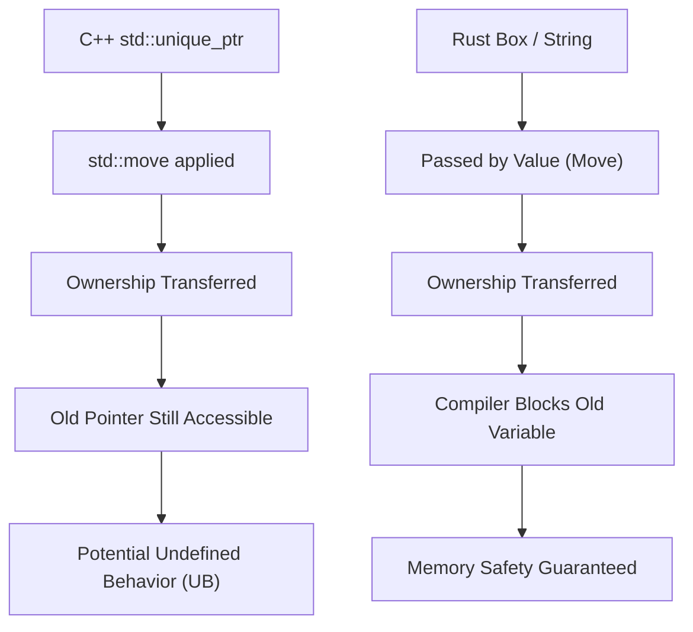
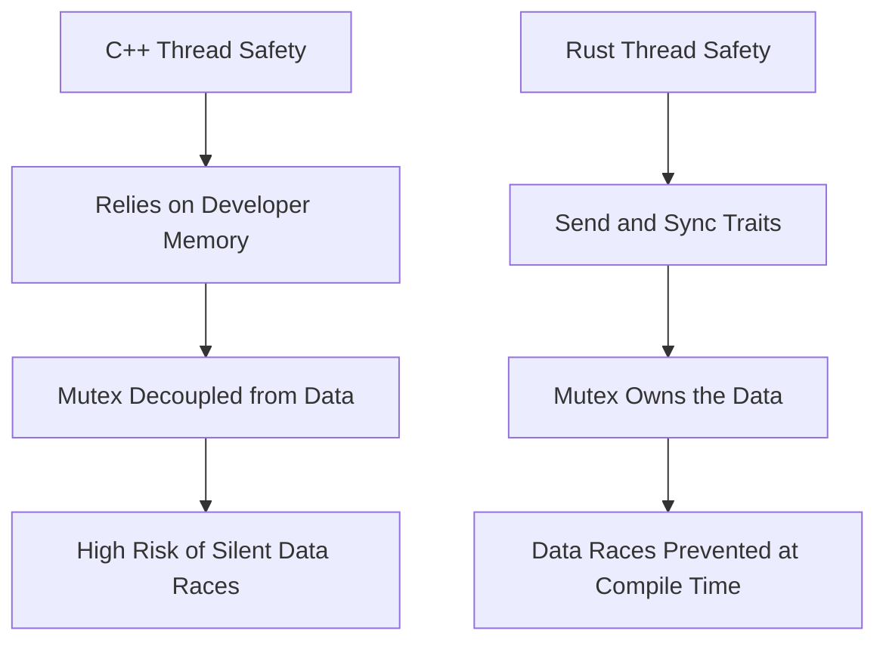
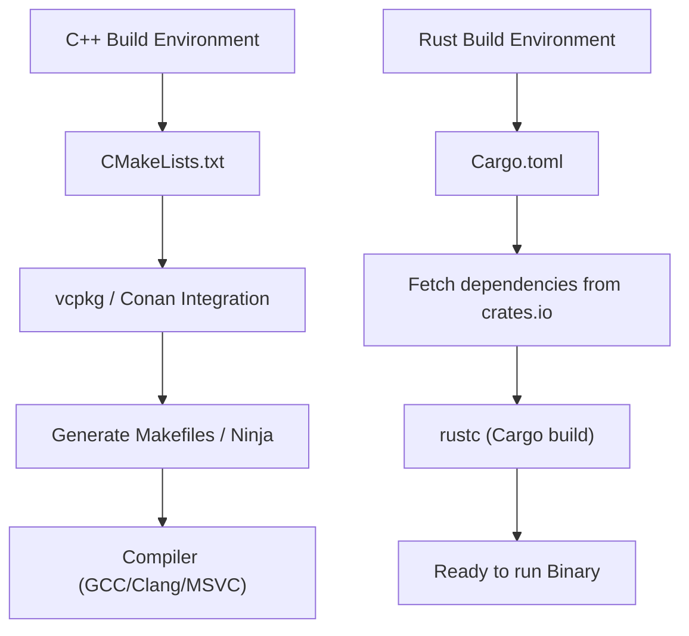

# Introduction: A New Dawn in System Programming

In modern software engineering, C++ and Rust stand as the two giants at the forefront of system programming. For many years, C++ has reigned as the absolute king in domains that extract extreme performance from hardware, such as operating systems, embedded devices, game engines, and high-frequency trading (HFT) systems. As a senior C++ engineer myself, I have continued writing code while keeping pace with the massive expansion of specifications—starting from the jungle of raw pointers in the C++98 era, through the wave of modernization introduced by C++11 (smart pointers, lambda expressions, the introduction of `auto`), and moving on to C++14/17/20.

However, in recent years, Rust has seen a dramatic rise as a solution to structural issues inherent in C++—particularly security vulnerabilities stemming from the "lack of memory safety" (it is said that about 70% of CVEs are memory-related) and the "endlessly complex specifications and undefined behavior (UB)." Its official adoption into the Linux kernel and large-scale Rust migration projects by tech giants like Microsoft, Google, and AWS are not mere passing fads, but signify a paradigm shift in system programming.

In this article, I will thoroughly compare and explain the "pros" and "cons" that a purebred C++ engineer felt after deeply learning and practically using Rust, focusing on technical aspects related to the foundation of the language specifications.

---

# 1. The Paradigm Shift in Memory Management: From RAII to Ownership and Borrowing

## The Limits of RAII and Smart Pointers in C++

One of the greatest inventions of C++ is **RAII (Resource Acquisition Is Initialization)**. This concept of acquiring resources in the constructor and automatically releasing them in the destructor upon exiting a scope freed developers from the fear of memory leaks caused by manual `new` and `delete`. From C++11, `std::unique_ptr` and `std::shared_ptr` were introduced to the standard library, allowing the concept of Ownership to be expressed in code.

However, C++'s smart pointers and move semantics have a fatal weakness in that static verification by the compiler is incomplete.

```cpp
#include <iostream>
#include <memory>
#include <string>

void consume(std::unique_ptr<std::string> ptr) {
    std::cout << "Consuming: " << *ptr << std::endl;
}

int main() {
    auto my_ptr = std::make_unique<std::string>("Hello, C++");
    
    // Move ownership to the function
    consume(std::move(my_ptr));
    
    // Danger: Accessing a moved object in C++ does not result in a compile error
    // std::move is just a cast to an rvalue reference (T&&), and the compiler does not block its use
    if (my_ptr) {
        std::cout << "Pointer is still valid?" << std::endl;
    } else {
        std::cout << "Pointer is null." << std::endl;
    }
    
    // std::cout << *my_ptr << std::endl; // Undefined behavior due to Use-After-Free
    return 0;
}
```

In C++, there is always a risk of mistakenly accessing an object whose contents have been emptied by `std::move` (a valid but unspecified state). This can lead directly to runtime crashes or, in the worst case, security holes.

## Rust's Ownership and the Absolute Defense of the Borrow Checker

Rust incorporates this concept of "Ownership" into the core design of the language, performing strict static analysis via a compiler feature called the **Borrow Checker**.

```rust
fn consume(s: String) {
    println!("Consuming: {}", s);
} // s goes out of scope here, and memory is released (Drop)

fn main() {
    let my_string = String::from("Hello, Rust");
    
    // Move ownership to the function. Move semantics are the default in Rust.
    consume(my_string);
    
    // Compile error! You can absolutely never access a variable after it has been moved
    // println!("Is it still there? {}", my_string);
}
```

In Rust, the moment ownership of a variable is moved, the original variable is treated as equivalent to an "uninitialized" state by the compiler, completely blocking any subsequent access. Because of this, bugs like "Use-After-Free" and "Dangling Pointers" theoretically cannot pass compilation.



## Borrowing and Control of Mutability

What is even more powerful is the rules of "Borrowing" for referencing resources. Rust enforces the following rules:
1. At any given time, you can have **either** "multiple immutable references (`&T`)" **or** "a single mutable reference (`&mut T`)", but not both.
2. References must not live longer than the scope of the original data (lifetime constraints).

In C++, it is easy to create multiple mutable references or pointers to the same object, which can cause unexpected state corruption (such as iterator invalidation). Rust prevents bugs before they happen by prohibiting this combination of "Aliasing + Mutability" at the language level.

---

# 2. Memory Layout and the Mathematical Overhead of Smart Pointers

In system programming, an accurate understanding of memory layout is essential. Let's compare C++'s `std::shared_ptr` with Rust's `std::rc::Rc` / `std::sync::Arc`.

C++'s `std::shared_ptr` manages resources via reference counting, but by default, it uses thread-safe atomic operations (`std::atomic`) to increment and decrement the reference count. Its memory overhead can be formulated as follows:

$$ Overhead_{C++} = sizeof(T) + sizeof(ControlBlock) $$

Here, $ControlBlock$ includes a "Strong Ref Count", a "Weak Ref Count", and a "Custom Deleter". The problem is that even in situations where it is only used in a single thread, the overhead of atomic instructions (such as cache line locking) occurs unconditionally.

In contrast, Rust strictly separates smart pointers based on their intended use.

- **For single-threaded use**: `Rc<T>` (Reference Counted)
- **For multi-threaded use**: `Arc<T>` (Atomic Reference Counted)

$$ Overhead_{Rc} = sizeof(T) + 2 \times sizeof(usize) $$
$$ Overhead_{Arc} = sizeof(T) + 2 \times sizeof(AtomicUsize) $$

In Rust, by using `Rc<T>`, which is exclusively for single threads, you can completely avoid the penalty of atomic operations (zero-cost abstraction). Furthermore, due to the thread safety mechanisms described later, mistakenly passing `Rc<T>` to another thread is entirely prevented by the type system.

---

# 3. Thread Safety: The Impact of "Fearless Concurrency"

Multi-threaded programming in C++ has always been fraught with the fear of data races and deadlocks.

## C++ Mutexes and the Danger of Data Separation

C++'s `std::mutex` is merely for providing mutually exclusive control over a "specific code block (critical section)", and there is no linguistic connection between the "mutex" and the "data to be protected".

```cpp
#include <iostream>
#include <thread>
#include <mutex>
#include <vector>

std::vector<int> shared_data;
std::mutex mtx;

void worker() {
    // Even if the developer forgets to acquire the lock, compilation passes normally
    // std::lock_guard<std::mutex> lock(mtx);
    shared_data.push_back(1); // Fatal data race!
}

int main() {
    std::thread t1(worker);
    std::thread t2(worker);
    t1.join();
    t2.join();
    return 0;
}
```

## Rust's Mutex "Owns" the Data

In Rust, `Mutex<T>` **encapsulates (owns)** the data type `T` to be protected using generics. To access the data, you must always call `lock()` to acquire a guard object. It is syntactically impossible to touch the data without acquiring the lock.

```rust
use std::sync::{Arc, Mutex};
use std::thread;

fn main() {
    // The data is completely encapsulated inside the Mutex
    let shared_data = Arc::new(Mutex::new(Vec::new()));
    let mut handles = vec![];

    for _ in 0..2 {
        // Clone the Arc (thread-safe reference counting) to share between threads
        let data_clone = Arc::clone(&shared_data);
        let handle = thread::spawn(move || {
            // You cannot access the internal Vec unless you acquire the lock
            let mut data = data_clone.lock().unwrap();
            data.push(1);
        });
        handles.push(handle);
    }

    for handle in handles {
        handle.join().unwrap();
    }
}
```

Furthermore, Rust has two core traits that guarantee the safety of concurrent processing:
- `Send`: Types whose ownership can be safely transferred between threads
- `Sync`: Types that are safe to reference from multiple threads simultaneously

For example, the non-thread-safe `Rc<T>` does not implement the `Send` trait. Therefore, attempting to pass it to `thread::spawn` immediately results in a compile error. This "Fearless Concurrency" frees developers from the fear of bugs, allowing them to push parallelization more aggressively.

According to Amdahl's Law, the theoretical maximum throughput for a parallelizable portion $P$ and a degree of parallelism $N$ is expressed as follows:

$$ S(N) = \frac{1}{(1 - P) + \frac{P}{N}} $$

Rust makes it possible to safely perform refactoring to maximize this $P$, relying on the type system.



---

# 4. Error Handling: Exceptions vs. Algebraic Data Types

The standard for error handling in C++ is "Exceptions". However, exceptions obscure control flow and incur performance penalties (stack unwinding and bloat in RTTI). In embedded systems and game engines, it is common practice to completely disable exceptions (`-fno-exceptions`) and adopt a design that returns classic error codes. Although `std::expected` was introduced in C++23, it will take time to permeate the entire ecosystem.

Rust does not have the concept of exceptions. Errors are returned purely as "values" and are represented by an enum (algebraic data type) called `Result<T, E>`.

```rust
use std::fs::File;
use std::io::{self, Read};

// Just by looking at the return type, it is clear that an IO error can occur
fn read_file_content(path: &str) -> Result<String, io::Error> {
    // The ? operator early returns immediately on error, or extracts the value on success
    let mut file = File::open(path)?; 
    let mut content = String::new();
    file.read_to_string(&mut content)?;
    Ok(content)
}
```

This `?` operator is revolutionary. It eliminates the deep nesting (the pyramid of if statements) that occurs when checking error codes in C++, while maintaining clean code flow similar to exceptions, and explicitly describing in which function calls errors will propagate.

---

# 5. Polymorphism: From Virtual Functions and Templates to Traits

Polymorphism in C++ is primarily achieved through dynamic dispatch via class inheritance and virtual functions (`virtual`), or static dispatch via templates (such as CRTP).

In dynamic dispatch, a pointer to a virtual function table (vptr) is embedded in the object, incurring a pointer resolution overhead at function call time.

$$ T_{dispatch} = T_{lookup\_in\_vtable} + T_{dereference} $$

Rust discarded classic object-oriented "class inheritance" and instead adopted the concept of "**Traits**" (similar to C++20's Concepts, but more versatile).

```rust
trait Drawable {
    fn draw(&self);
}

struct Circle { radius: f64 }
impl Drawable for Circle {
    fn draw(&self) { println!("Drawing a Circle of radius {}", self.radius); }
}

// Static dispatch (Monomorphization, zero overhead)
fn draw_static<T: Drawable>(item: &T) {
    item.draw();
}

// Dynamic dispatch (Trait objects)
fn draw_dynamic(item: &dyn Drawable) {
    item.draw();
}
```

The most prominent feature of dynamic dispatch in Rust (`dyn Trait`) is that it does not hold a vptr within the data structure, but rather uses a **Fat Pointer**. A fat pointer holds a "pointer to the data" and a "pointer to the vtable" as a pair. This makes it incredibly easy to implement (extend) traits for types defined in external libraries at a later time and subject them to dynamic dispatch.

---

# 6. Package Management and Build Systems: The Agony of CMake and the Blessings of Cargo

One of C++'s greatest weaknesses is the absence of a standard package manager. The arcane syntax of `CMakeLists.txt`, the complexity of resolving dependencies with `find_package`, and the differences in library paths across OSes have continued to rob C++ engineers of vast amounts of time.

Rust comes standard with **Cargo**, one of the best package managers and build systems in the world.



By simply adding one line with the name and version of a dependency library (crate) to `Cargo.toml`, it fully automates the resolution of transitive dependencies, downloading, and building. Furthermore, the toolchains necessary for development—such as testing (`cargo test`), document generation (`cargo doc`), static analysis (`cargo clippy`), and formatting (`cargo fmt`)—are all integrated into this single command. This level of comfort is so disruptive that once experienced, you will not want to return to a C++ build environment.

---

# 7. Disadvantages and the Learning Curve When Learning Rust

I have discussed Rust's strengths so far, but there are certainly "walls" and disadvantages that C++ engineers will face when trying to deploy Rust in practice.

## 1. The Struggle with the Relentless Borrow Checker
If you try to implement data structures in Rust exactly as you did in C++ where you "somehow linked them with raw pointers" (for example, doubly linked lists, graph structures, or self-referential structs), compilation will fail due to ownership and lifetime constraints. To satisfy the borrow checker, you need to either use complex wrappers like `Rc<RefCell<T>>` or fundamentally redesign your architecture towards arena allocators or index-based management.

## 2. Long Compilation Times
While C++ also suffers from slow compilations due to template nesting, Rust's compilation times (especially clean builds from scratch) are by no means short. Because LLVM's powerful optimization passes, macro expansion, and generic monomorphization stack up, build times become a bottleneck in large-scale projects. Workarounds like making heavy use of `cargo check` during development are essential.

## 3. Interoperability with C++ Codebases
While integration with C (FFI) is very smooth, it is extremely difficult to directly link Rust with existing, massive C++ codebases (those that heavily use classes, templates, and virtual functions). Although bridge tools like `cxx` and `autocxx` have evolved in recent years, there remains a high hurdle for a completely seamless migration.

---

# Conclusion: Should We Migrate to Rust?

C++ will likely continue to play a crucial role in game engine development and existing, massive infrastructure. The modernization brought by C++20/23 is remarkable, and it is becoming safer to write.

However, for "newly launched system programming projects," I feel that it is now **harder to find a reason NOT to choose Rust**. The "certainty" of Rust—that as long as it compiles, you are freed from the fear of undefined behavior and memory corruption, and can safely perform concurrent processing with high performance—drastically improves an engineer's mental model.

For C++ engineers, learning Rust is not simply about memorizing new syntax, but it is the ultimate experience of gaining a new perspective on "how to manage memory and threads safely." By all means, please experience the comfort of Cargo and the strictness of the borrow checker for yourselves.
