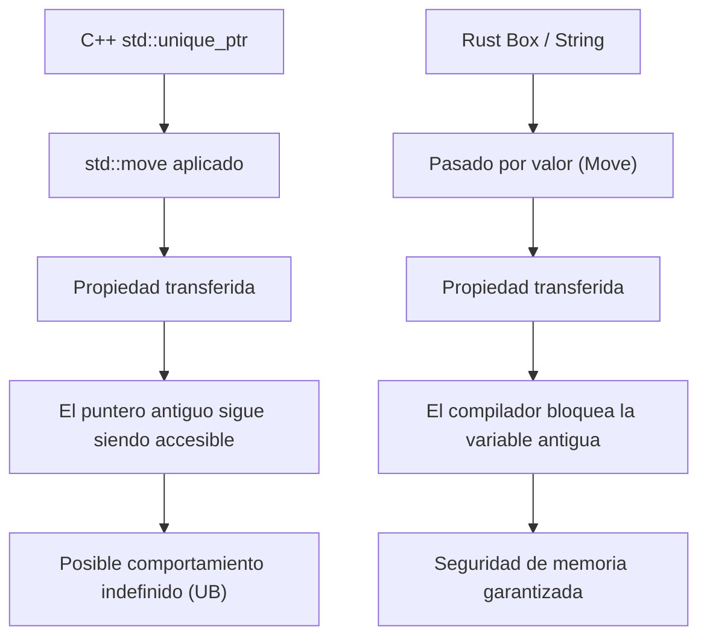
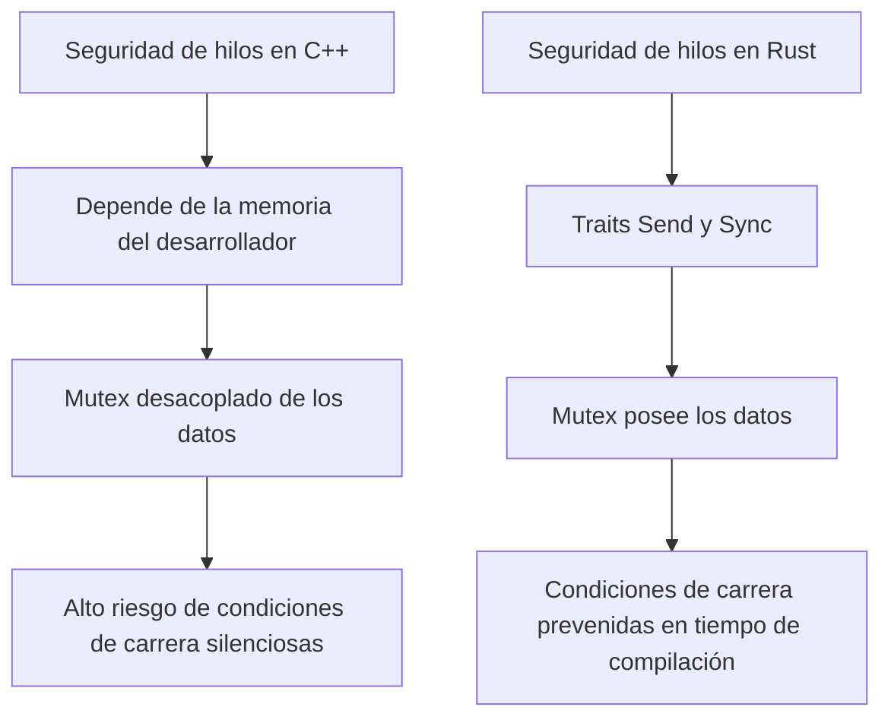
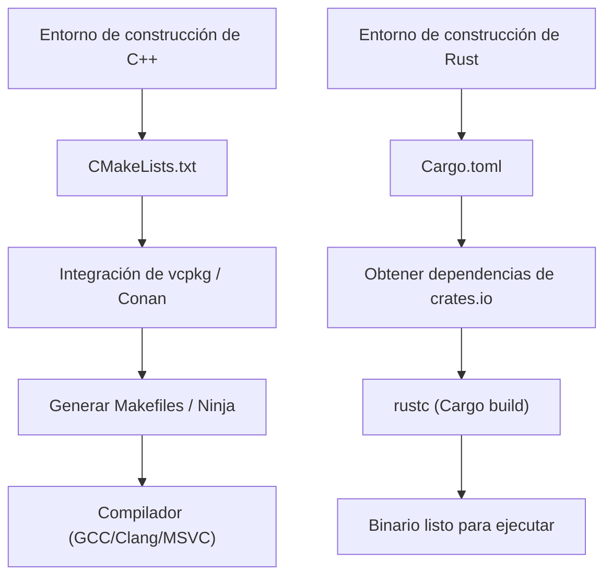

# Introducción: Un nuevo amanecer en la programación de sistemas

En la ingeniería de software moderna, C++ y Rust son los dos gigantes que lideran la vanguardia de la programación de sistemas. Durante muchos años, C++ ha reinado como el rey absoluto en áreas que extraen el máximo rendimiento del hardware, como sistemas operativos, dispositivos embebidos, motores de juegos y sistemas de comercio de alta frecuencia (HFT). Como ingeniero senior de C++, yo mismo he estado escribiendo código a lo largo de este viaje, empezando por la jungla de los punteros crudos en la era de C++98, pasando por la ola de modernización con C++11 (introducción de punteros inteligentes, expresiones lambda, `auto`), y continuando con la expansión masiva de las especificaciones en C++14/17/20.

Sin embargo, en los últimos años, Rust ha experimentado un ascenso dramático como solución a los problemas estructurales que enfrenta C++: específicamente la "falta de seguridad de memoria" que conduce a vulnerabilidades de seguridad (se dice que alrededor del 70% de los CVE son causados por la memoria) y la "complejidad interminable de especificaciones y comportamientos indefinidos (UB)". Su adopción oficial en el kernel de Linux, y los proyectos de migración a gran escala a Rust por gigantes tecnológicos como Microsoft, Google y AWS, significan que no es solo una moda pasajera, sino un cambio de paradigma en la programación de sistemas.

En este artículo, compararé y explicaré exhaustivamente desde un punto de vista técnico y fundamental las "ventajas" y "desventajas" que un ingeniero de C++ puro ha experimentado al aprender profundamente Rust y usarlo en la práctica.

---

# 1. El cambio de paradigma en la gestión de memoria: de RAII a Ownership y Borrowing

## RAII en C++ y los límites de los punteros inteligentes

Una de las mayores invenciones de C++ es **RAII (Resource Acquisition Is Initialization)**. Este concepto, que consiste en asegurar los recursos en el constructor y liberarlos automáticamente en el destructor al salir del alcance (scope), liberó a los desarrolladores del temor a las fugas de memoria causadas por el uso manual de `new` y `delete`. A partir de C++11, se introdujeron `std::unique_ptr` y `std::shared_ptr` en la biblioteca estándar, lo que permitió expresar el concepto de propiedad (Ownership) en el código.

Sin embargo, los punteros inteligentes y la semántica de movimiento de C++ tienen una debilidad fatal: la verificación estática por parte del compilador es incompleta.

```cpp
#include <iostream>
#include <memory>
#include <string>

void consume(std::unique_ptr<std::string> ptr) {
    std::cout << "Consuming: " << *ptr << std::endl;
}

int main() {
    auto my_ptr = std::make_unique<std::string>("Hello, C++");
    
    // Mover (Move) la propiedad a la función
    consume(std::move(my_ptr));
    
    // Peligro: En C++, acceder a un objeto después del movimiento no causa un error de compilación
    // std::move es simplemente un cast a una referencia rvalue (T&&), y el compilador no bloquea su uso
    if (my_ptr) {
        std::cout << "Pointer is still valid?" << std::endl;
    } else {
        std::cout << "Pointer is null." << std::endl;
    }
    
    // std::cout << *my_ptr << std::endl; // Comportamiento indefinido por el uso de memoria después de ser liberada (Use-After-Free)
    return 0;
}
```

En C++, siempre existe el riesgo de acceder por error a un objeto que ha sido vaciado por `std::move` (un estado válido pero no especificado). Esto puede provocar bloqueos (crashes) en tiempo de ejecución o, en el peor de los casos, directamente vulnerabilidades de seguridad.

## Propiedad (Ownership) en Rust y la defensa absoluta del Borrow Checker

Rust incorpora este concepto de "propiedad" en el diseño central del lenguaje, y realiza un análisis estático estricto mediante una característica del compilador llamada **Borrow Checker**.

```rust
fn consume(s: String) {
    println!("Consuming: {}", s);
} // Aquí s sale del alcance, y la memoria es liberada (Drop)

fn main() {
    let my_string = String::from("Hello, Rust");
    
    // Mover la propiedad a la función. En Rust, la semántica de movimiento es el valor por defecto.
    consume(my_string);
    
    // ¡Error de compilación! Es absolutamente imposible acceder a la variable después de ser movida
    // println!("Is it still there? {}", my_string);
}
```

En Rust, en el momento en que se transfiere la propiedad de una variable, el compilador trata a la variable original de manera equivalente a un estado "no inicializado", bloqueando completamente cualquier acceso posterior. Debido a esto, errores como "Use-After-Free (Uso de memoria después de ser liberada)" y "Dangling Pointer (Puntero colgante)" teóricamente no pueden pasar la compilación.



## Préstamo (Borrowing) y control de mutabilidad

Aún más poderosas son las reglas de "Préstamo (Borrowing)" que referencian recursos. En Rust se imponen las siguientes reglas:
1. En cualquier momento, **solo puede existir uno** de los siguientes casos: "Múltiples referencias inmutables (`&T`)" o "Una única referencia mutable (`&mut T`)".
2. Una referencia no debe vivir más tiempo que el alcance de los datos originales (restricción de tiempo de vida - lifetime).

En C++, se pueden crear fácilmente múltiples referencias o punteros mutables para el mismo objeto, lo que provoca la destrucción de estados inesperados (como la invalidación de iteradores). Rust prohíbe esta combination de "Aliasing + Mutabilidad" a nivel de lenguaje para prevenir errores antes de que ocurran.

---

# 2. Diseño de memoria y la sobrecarga matemática de los punteros inteligentes

En la programación de sistemas, es esencial tener una comprensión precisa del diseño de la memoria. Comparemos `std::shared_ptr` de C++ con `std::rc::Rc` / `std::sync::Arc` de Rust.

`std::shared_ptr` en C++ gestiona los recursos mediante conteo de referencias, y por defecto aumenta y disminuye este conteo utilizando operaciones atómicas thread-safe (`std::atomic`). Su sobrecarga de memoria se puede formular de la siguiente manera:

$$ Overhead_{C++} = sizeof(T) + sizeof(ControlBlock) $$

Aquí, el $ControlBlock$ incluye el "Contador de referencias fuertes (Strong Ref Count)", el "Contador de referencias débiles (Weak Ref Count)" y un "Eliminador personalizado (Custom Deleter)". El problema es que, incluso en escenarios donde solo se usa un hilo (single-thread), la sobrecarga de las instrucciones atómicas (bloqueos en la línea de caché, etc.) ocurre incondicionalmente.

En contraste, Rust separa estrictamente los punteros inteligentes según su caso de uso.

- **Para un solo hilo**: `Rc<T>` (Reference Counted)
- **Para múltiples hilos**: `Arc<T>` (Atomic Reference Counted)

$$ Overhead_{Rc} = sizeof(T) + 2 \times sizeof(usize) $$
$$ Overhead_{Arc} = sizeof(T) + 2 \times sizeof(AtomicUsize) $$

En Rust, si se usa `Rc<T>`, que es exclusivo para un solo hilo, se puede evitar por completo la penalización de las operaciones atómicas (abstracción de costo cero). Y gracias al mecanismo de seguridad de hilos (thread-safety) que veremos más adelante, pasar `Rc<T>` a otro hilo por error es completamente prevenido por el sistema de tipos.

---

# 3. Seguridad de hilos (Thread-Safety): El impacto de "Fearless Concurrency"

En C++, la programación multihilo siempre ha estado acompañada del miedo a las condiciones de carrera (data races) y los bloqueos (deadlocks).

## Peligros de los Mutex en C++ y la separación de datos

El `std::mutex` en C++ es simplemente para controlar la exclusividad en "un bloque de código específico (sección crítica)", y no existe ningún vínculo a nivel de lenguaje entre "los datos que se deben proteger" y el "mutex".

```cpp
#include <iostream>
#include <thread>
#include <mutex>
#include <vector>

std::vector<int> shared_data;
std::mutex mtx;

void worker() {
    // Incluso si el desarrollador olvida adquirir el bloqueo, compilará sin problemas
    // std::lock_guard<std::mutex> lock(mtx);
    shared_data.push_back(1); // ¡Condición de carrera fatal!
}

int main() {
    std::thread t1(worker);
    std::thread t2(worker);
    t1.join();
    t2.join();
    return 0;
}
```

## En Rust, Mutex "posee" los datos

En Rust, `Mutex<T>` utiliza genéricos para **encapsular (poseer)** el tipo de dato `T` que protege. Para acceder a los datos, es absolutamente necesario invocar `lock()` y obtener un objeto guardia (guard object). Es sintácticamente imposible tocar los datos sin obtener el bloqueo.

```rust
use std::sync::{Arc, Mutex};
use std::thread;

fn main() {
    // Los datos están completamente encapsulados dentro del Mutex
    let shared_data = Arc::new(Mutex::new(Vec::new()));
    let mut handles = vec![];

    for _ in 0..2 {
        // Clonar Arc (conteo de referencias seguro para hilos) para compartirlo entre hilos
        let data_clone = Arc::clone(&shared_data);
        let handle = thread::spawn(move || {
            // No se puede acceder al Vec interno a menos que se adquiera el bloqueo
            let mut data = data_clone.lock().unwrap();
            data.push(1);
        });
        handles.push(handle);
    }

    for handle in handles {
        handle.join().unwrap();
    }
}
```

Además, Rust cuenta con dos traits centrales que garantizan la seguridad del procesamiento concurrente.
- `Send`: Tipos cuya propiedad puede transferirse de forma segura entre hilos.
- `Sync`: Tipos a los que se puede acceder simultáneamente desde varios hilos de forma segura.

Por ejemplo, `Rc<T>`, que no es seguro para hilos, no implementa el trait `Send`. Por lo tanto, intentar pasarlo a `thread::spawn` resulta en un error de compilación instantáneo. Gracias a esta "Fearless Concurrency" (Concurrencia sin miedo), los desarrolladores se liberan del temor a los errores y pueden promover la paralelización de forma más agresiva.

Según la Ley de Amdahl (Amdahl's Law), el rendimiento máximo teórico en relación a la parte paralelizable $P$ y el grado de paralelismo $N$ se expresa de la siguiente manera:

$$ S(N) = \frac{1}{(1 - P) + \frac{P}{N}} $$

Rust permite maximizar esta $P$ a través de refactorizaciones que pueden realizarse con extrema seguridad basándose en el sistema de tipos.



---

# 4. Manejo de errores: Excepciones vs Tipos de Datos Algebraicos

El estándar de manejo de errores en C++ son las "Excepciones" (Exceptions). Sin embargo, las excepciones opacan el flujo de control y provocan penalizaciones de rendimiento (stack unwinding y sobrecarga de RTTI). En los sistemas embebidos y en los motores de juegos, suele ser común adoptar un diseño que devuelve códigos de error clásicos y deshabilita completamente las excepciones (`-fno-exceptions`). En C++23 se introdujo `std::expected`, pero tomará tiempo hasta que penetre en todo el ecosistema.

En Rust, el concepto de excepción no existe. Los errores se devuelven como "valores" puros y se representan mediante un enum (tipo de dato algebraico) llamado `Result<T, E>`.

```rust
use std::fs::File;
use std::io::{self, Read};

// Con solo mirar el tipo de retorno, queda claro que puede ocurrir un error de IO
fn read_file_content(path: &str) -> Result<String, io::Error> {
    // Con el operador ?, si hay un error, hace un retorno anticipado inmediato, si es un éxito, extrae el contenido
    let mut file = File::open(path)?; 
    let mut content = String::new();
    file.read_to_string(&mut content)?;
    Ok(content)
}
```

Este operador `?` es revolucionario. Elimina la profunda anidación (pirámide de if) que ocurre al comprobar los códigos de error en C++, manteniendo un flujo de código limpio como el de las excepciones, a la vez que permite describir explícitamente en qué llamadas a funciones se propagan los errores.

---

# 5. Polimorfismo: De Funciones Virtuales y Plantillas a Traits

El polimorfismo en C++ se logra principalmente a través del despacho dinámico (dynamic dispatch) mediante herencia de clases y funciones virtuales (`virtual`), o despacho estático mediante plantillas (CRTP, etc.).

En el despacho dinámico, se inserta un puntero (vptr) a la tabla de funciones virtuales (vtable) en el objeto, lo que provoca una sobrecarga en la resolución del puntero al invocar la función.

$$ T_{dispatch} = T_{lookup\_in\_vtable} + T_{dereference} $$

Rust ha descartado la clásica "herencia de clases" orientada a objetos, adoptando en su lugar el concepto de "**Traits**" (similar a Concept de C++20, pero con más funcionalidades).

```rust
trait Drawable {
    fn draw(&self);
}

struct Circle { radius: f64 }
impl Drawable for Circle {
    fn draw(&self) { println!("Drawing a Circle of radius {}", self.radius); }
}

// Despacho estático (Monomorfización, costo cero de sobrecarga)
fn draw_static<T: Drawable>(item: &T) {
    item.draw();
}

// Despacho dinámico (Objetos Trait)
fn draw_dynamic(item: &dyn Drawable) {
    item.draw();
}
```

La característica principal del despacho dinámico de Rust (`dyn Trait`) es que no tiene un vptr dentro de la estructura de datos, sino que utiliza un **Puntero Gordo (Fat Pointer)**. El Fat Pointer mantiene un par con el "puntero a los datos" y el "puntero a la vtable". Gracias a esto, es muy fácil implementar (extender) un Trait a un tipo definido en una biblioteca externa y aplicarle el despacho dinámico posteriormente.

---

# 6. Gestión de paquetes y sistema de construcción: La agonía de CMake y las bendiciones de Cargo

Una de las mayores debilidades de C++ es la falta de un administrador de paquetes estándar. La sintaxis incomprensible de `CMakeLists.txt`, la complejidad para resolver dependencias a través de `find_package`, y las diferencias en las rutas de las bibliotecas según el sistema operativo, han estado robando una enorme cantidad de tiempo a los ingenieros de C++.

Rust viene equipado de serie con **Cargo**, un sistema de construcción y administrador de paquetes de primer nivel a nivel mundial.



Con solo agregar una línea en `Cargo.toml` con el nombre y la versión de la biblioteca dependiente (crate), se resuelve, descarga y compila de forma totalmente automática, incluyendo sus dependencias transitivas. Además, herramientas esenciales para el desarrollo como pruebas (`cargo test`), generación de documentación (`cargo doc`), análisis estático (`cargo clippy`) y formateador (`cargo fmt`) están completamente integradas en este único comando. Esta comodidad es tan disruptiva que, una vez que la experimentas, no querrás volver al entorno de construcción de C++.

---

# 7. Desventajas y curva de aprendizaje al aprender Rust

Hasta ahora, he hablado de las ventajas de Rust, pero ciertamente existen "muros" y desventajas que un ingeniero de C++ enfrentará al implementarlo en la práctica.

## 1. La feroz lucha con el Borrow Checker
Si intentas implementar de la misma manera en Rust una estructura de datos que en C++ simplemente "conectabas de alguna manera con punteros crudos" (por ejemplo, listas doblemente enlazadas, estructuras de grafos, estructuras autorreferenciadas, etc.), la compilación fallará debido a las restricciones de propiedad y tiempos de vida. Para satisfacer al Borrow Checker, necesitas hacer envolturas complejas como `Rc<RefCell<T>>`, o rediseñar desde la raíz usando un asignador de arena (arena allocator) o una gestión basada en índices.

## 2. Largos tiempos de compilación
Aunque C++ también ralentiza la compilación al anidar plantillas, el tiempo de compilación de Rust (especialmente en un clean build desde cero) no es para nada corto. Esto se debe a la superposición de las potentes pasadas de optimización de LLVM, la expansión de macros y la monomorfización de genéricos, lo que convierte al tiempo de construcción en un cuello de botella en proyectos a gran escala. Durante el desarrollo, es indispensable ingeniárselas usando `cargo check` con frecuencia.

## 3. Interoperabilidad con bases de código de C++
La integración con el lenguaje C (FFI) es muy fluida, pero integrar Rust directamente en bases de código enormes de C++ existentes (aquellas que utilizan en gran medida clases, plantillas y funciones virtuales) es extremadamente difícil. En los últimos años, han evolucionado herramientas puente como `cxx` y `autocxx`, pero todavía hay un listón alto para una transición completamente fluida.

---

# Conclusión: ¿Deberíamos migrar a Rust?

C++ seguirá desempeñando un papel importante en el desarrollo de motores de juegos y en la enorme infraestructura existente. Su modernización a través de C++20/23 también ha sido notable, volviéndose más seguro de escribir.

Sin embargo, para "proyectos de programación de sistemas creados desde cero", siento que hoy en día **es más difícil encontrar razones para no elegir Rust**. Una vez que pasas la compilación, te liberas del miedo a los comportamientos indefinidos y a la corrupción de memoria, y puedes ejecutar un procesamiento concurrente seguro y con alto rendimiento; esta "certeza" de Rust mejora drásticamente el modelo mental del ingeniero.

Para los ingenieros de C++, aprender Rust no es solo memorizar una nueva sintaxis, sino la mejor experiencia para adquirir una nueva perspectiva sobre "cómo gestionar de forma segura la memoria y los hilos". Te invito a experimentar la comodidad de Cargo y la severidad del Borrow Checker.
