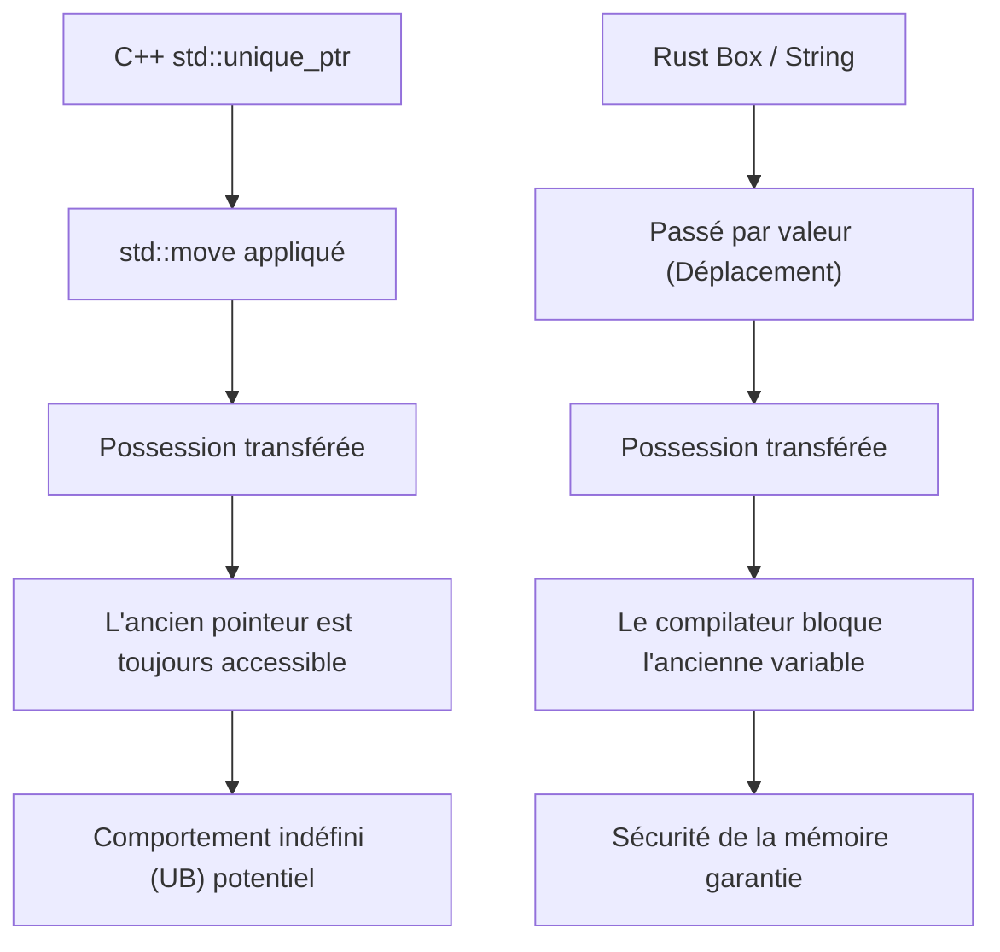
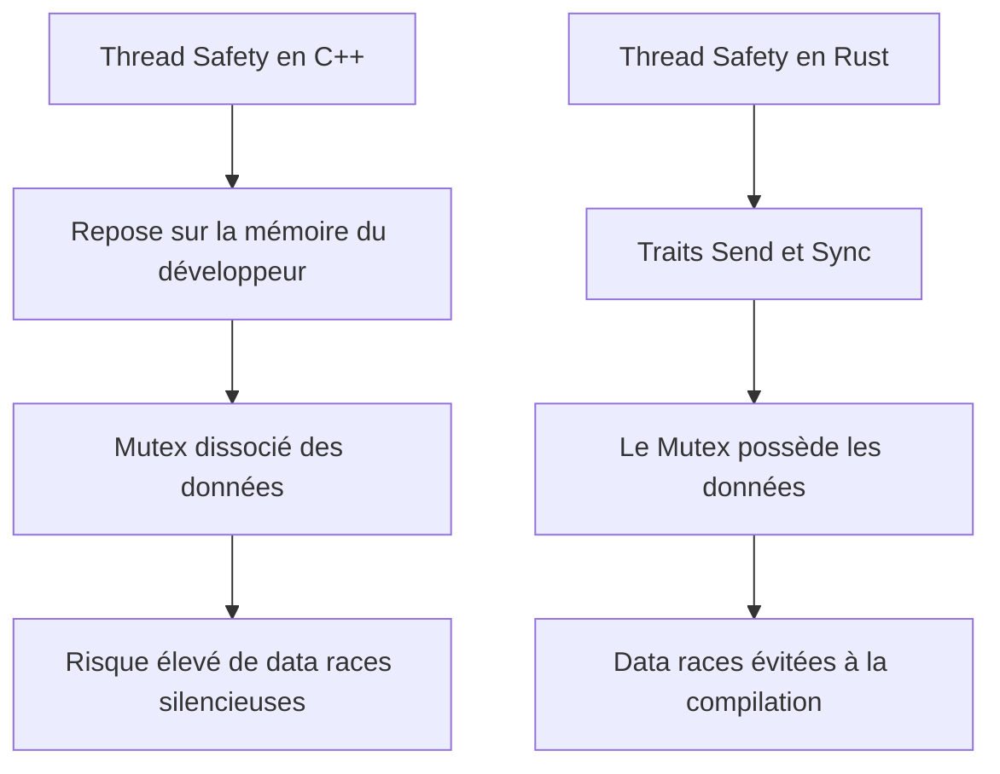
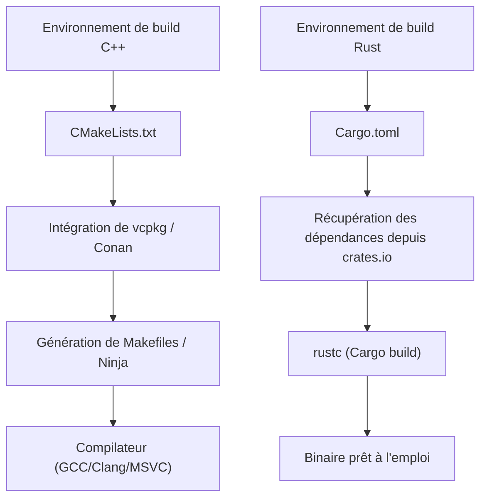

# Introduction : Une nouvelle aube pour la programmation système

Dans l'ingénierie logicielle moderne, C++ et Rust sont les deux géants à l'avant-garde de la programmation système. Pendant de nombreuses années, le C++ a régné en maître absolu dans les domaines poussant les performances matérielles à leurs limites extrêmes, tels que les systèmes d'exploitation, les appareils embarqués, les moteurs de jeu et les systèmes de trading à haute fréquence (HFT). En tant qu'ingénieur C++ senior moi-même, j'ai commencé dans la jungle des pointeurs bruts de l'ère C++98, et j'ai continué à écrire du code tout en suivant la vague de modernisation apportée par C++11 (pointeurs intelligents, expressions lambda et l'introduction de `auto`), ainsi que l'expansion massive des spécifications qui a suivi avec C++14/17/20.

Cependant, ces dernières années, Rust a connu une montée en puissance spectaculaire en tant que solution aux problèmes structurels du C++, en particulier le "manque de sécurité de la mémoire" entraînant des vulnérabilités de sécurité (on dit qu'environ 70 % des CVE sont liés à la mémoire) et les "spécifications infiniment complexes et comportements indéfinis (UB)". Son adoption officielle dans le noyau Linux et les projets de migration à grande échelle vers Rust par des géants de la technologie comme Microsoft, Google et AWS ne sont pas qu'une simple tendance passagère, mais signifient un véritable changement de paradigme dans la programmation système.

Dans cet article, je vais comparer et expliquer en détail les "avantages" et les "inconvénients" que j'ai ressentis en tant que pur ingénieur C++ ayant appris Rust en profondeur et l'ayant utilisé en pratique, d'un point de vue technique lié aux fondements même du langage.

---

# 1. Changement de paradigme de la gestion de la mémoire : Du RAII à la possession (Ownership) et l'emprunt (Borrowing)

## Le RAII en C++ et les limites des pointeurs intelligents

L'une des plus grandes inventions du C++ est le **RAII (Resource Acquisition Is Initialization)**. Ce concept, qui consiste à allouer des ressources dans le constructeur et à les libérer automatiquement dans le destructeur lorsqu'elles sortent de la portée, a libéré les développeurs de la peur des fuites de mémoire dues aux `new` et `delete` manuels. Depuis C++11, `std::unique_ptr` et `std::shared_ptr` ont été introduits dans la bibliothèque standard, permettant d'exprimer le concept de possession (Ownership) dans le code.

Cependant, les pointeurs intelligents du C++ et la sémantique de déplacement (move semantics) ont une faiblesse fatale : la vérification statique par le compilateur est incomplète.

```cpp
#include <iostream>
#include <memory>
#include <string>

void consume(std::unique_ptr<std::string> ptr) {
    std::cout << "Consuming: " << *ptr << std::endl;
}

int main() {
    auto my_ptr = std::make_unique<std::string>("Hello, C++");
    
    // Déplace la possession (Ownership) vers la fonction (Move)
    consume(std::move(my_ptr));
    
    // Danger : En C++, l'accès à un objet après son déplacement ne provoque pas d'erreur de compilation
    // std::move n'est qu'un cast vers une référence de rvalue (T&&), et le compilateur ne bloque pas son utilisation
    if (my_ptr) {
        std::cout << "Pointer is still valid?" << std::endl;
    } else {
        std::cout << "Pointer is null." << std::endl;
    }
    
    // std::cout << *my_ptr << std::endl; // Comportement indéfini (UB) causé par l'utilisation de mémoire après libération (Use-After-Free)
    return 0;
}
```

En C++, il y a toujours un risque d'accéder accidentellement à un objet qui a été vidé par `std::move` (un état valide mais non spécifié). Cela conduit directement à des plantages à l'exécution ou, dans le pire des cas, à des failles de sécurité.

## La possession (Ownership) en Rust et la défense absolue du Borrow Checker

Rust intègre ce concept de "possession" dans la conception même du langage et effectue une analyse statique stricte grâce à une fonctionnalité du compilateur appelée **Borrow Checker** (vérificateur d'emprunt).

```rust
fn consume(s: String) {
    println!("Consuming: {}", s);
} // Ici, s sort de la portée et la mémoire est libérée (Drop)

fn main() {
    let my_string = String::from("Hello, Rust");
    
    // Déplace la possession vers la fonction. En Rust, la sémantique de déplacement est la valeur par défaut.
    consume(my_string);
    
    // Erreur de compilation ! Il est absolument impossible d'accéder à une variable après son déplacement
    // println!("Is it still there? {}", my_string);
}
```

En Rust, lorsque la possession d'une variable est transférée, la variable d'origine est traitée par le compilateur comme étant équivalente à un état "non initialisé", bloquant complètement tout accès ultérieur. Par conséquent, les bugs tels que l'"utilisation après libération (Use-After-Free)" ou les "pointeurs fantômes (Dangling Pointers)" ne peuvent théoriquement pas passer la compilation.



## Emprunt (Borrowing) et contrôle de la mutabilité

Ce qui est encore plus puissant, ce sont les règles d'"emprunt (Borrowing)" qui font référence aux ressources. En Rust, les règles suivantes sont imposées :
1. À tout moment, il ne peut y avoir **soit** que "plusieurs références immuables (`&T`)", **soit** qu'"une seule référence mutable (`&mut T`)".
2. Les références ne doivent pas vivre plus longtemps que la portée des données d'origine (contraintes de durée de vie).

En C++, il est facile de créer plusieurs références mutables ou pointeurs vers le même objet, ce qui peut causer des destructions d'état inattendues (comme l'invalidation d'itérateurs). Rust empêche ces bugs en interdisant la combinaison de "l'aliasing + la mutabilité" au niveau du langage.

---

# 2. Agencement de la mémoire et coût mathématique des pointeurs intelligents

Dans la programmation système, une compréhension précise de l'agencement de la mémoire est essentielle. Comparons le `std::shared_ptr` du C++ avec le `std::rc::Rc` / `std::sync::Arc` de Rust.

Le `std::shared_ptr` en C++ gère les ressources par comptage de références, mais par défaut, il utilise des opérations atomiques thread-safe (`std::atomic`) pour incrémenter ou décrémenter le compteur de références. Son coût (overhead) en mémoire peut être formulé comme suit :

$$ Overhead_{C++} = sizeof(T) + sizeof(ControlBlock) $$

Ici, $ControlBlock$ comprend le "compteur de références fortes (Strong Ref Count)", le "compteur de références faibles (Weak Ref Count)" et un "suppresseur personnalisé (Custom Deleter)". Le problème est que, même si l'objet n'est utilisé que dans un seul thread, le coût des instructions atomiques (comme le verrouillage de la ligne de cache, etc.) se produit de manière inconditionnelle.

En revanche, Rust sépare strictement les pointeurs intelligents en fonction de leur utilisation.

- **Pour le single-thread** : `Rc<T>` (Reference Counted)
- **Pour le multi-thread** : `Arc<T>` (Atomic Reference Counted)

$$ Overhead_{Rc} = sizeof(T) + 2 \times sizeof(usize) $$
$$ Overhead_{Arc} = sizeof(T) + 2 \times sizeof(AtomicUsize) $$

En Rust, si vous utilisez `Rc<T>`, qui est dédié à un usage single-thread, vous pouvez éviter complètement la pénalité des opérations atomiques (abstraction à coût zéro). Et, grâce au mécanisme de thread-safety décrit ci-dessous, le système de types empêche complètement de passer par erreur un `Rc<T>` à un autre thread.

---

# 3. Thread-Safety : Le choc de la "Fearless Concurrency" (Concurrence sans peur)

La programmation multi-thread en C++ a toujours été accompagnée de la peur des data races (conditions de course de données) et des deadlocks (interblocages).

## Les dangers des mutex C++ et de la séparation des données

Le `std::mutex` en C++ ne fournit un contrôle exclusif que sur "un bloc de code spécifique (section critique)", et il n'y a aucun lien au niveau du langage entre "les données à protéger" et "le mutex".

```cpp
#include <iostream>
#include <thread>
#include <mutex>
#include <vector>

std::vector<int> shared_data;
std::mutex mtx;

void worker() {
    // Même si le développeur oublie d'acquérir le verrou, la compilation réussira normalement
    // std::lock_guard<std::mutex> lock(mtx);
    shared_data.push_back(1); // Data race fatale !
}

int main() {
    std::thread t1(worker);
    std::thread t2(worker);
    t1.join();
    t2.join();
    return 0;
}
```

## Le Mutex en Rust "possède" les données

En Rust, `Mutex<T>` utilise des génériques pour **encapsuler (posséder)** le type de données `T` à protéger. Pour accéder aux données, il est obligatoire d'appeler `lock()` pour obtenir un objet de garde (guard). Toucher aux données sans acquérir le verrou est syntaxiquement impossible.

```rust
use std::sync::{Arc, Mutex};
use std::thread;

fn main() {
    // Les données sont complètement encapsulées dans le Mutex
    let shared_data = Arc::new(Mutex::new(Vec::new()));
    let mut handles = vec![];

    for _ in 0..2 {
        // Clone de l'Arc (comptage de références thread-safe) pour partager entre les threads
        let data_clone = Arc::clone(&shared_data);
        let handle = thread::spawn(move || {
            // Impossible d'accéder au Vec interne sans obtenir le verrou
            let mut data = data_clone.lock().unwrap();
            data.push(1);
        });
        handles.push(handle);
    }

    for handle in handles {
        handle.join().unwrap();
    }
}
```

De plus, Rust possède deux traits de base (core traits) qui garantissent la sécurité de la concurrence :
- `Send` : Type dont la possession peut être transférée en toute sécurité entre les threads
- `Sync` : Type qui peut être référencé simultanément par plusieurs threads en toute sécurité

Par exemple, `Rc<T>`, qui n'est pas thread-safe, n'implémente pas le trait `Send`. Par conséquent, si vous essayez de le passer à `thread::spawn`, cela entraînera une erreur de compilation immédiate. Grâce à cette "Fearless Concurrency" (Concurrence sans peur), les développeurs sont libérés de la peur des bugs et peuvent pousser la parallélisation de manière beaucoup plus agressive.

Selon la loi d'Amdahl (Amdahl's Law), le débit maximal théorique avec une partie parallélisable $P$ et un degré de parallélisme $N$ est exprimé comme suit :

$$ S(N) = \frac{1}{(1 - P) + \frac{P}{N}} $$

Rust permet d'effectuer des refactorisations pour maximiser ce $P$ en toute sécurité en s'appuyant sur le système de types.



---

# 4. Gestion des erreurs : Exceptions vs Types de données algébriques

Le standard pour la gestion des erreurs en C++ est l'utilisation des "exceptions". Cependant, les exceptions rendent le flux de contrôle opaque et entraînent des pénalités de performances (déroulement de la pile ou stack unwinding, et augmentation du RTTI). Dans les systèmes embarqués ou les moteurs de jeu, il est courant de désactiver complètement les exceptions (`-fno-exceptions`) et d'adopter une conception renvoyant des codes d'erreur classiques. Bien que `std::expected` ait été introduit dans C++23, il faudra du temps pour qu'il pénètre l'ensemble de l'écosystème.

Le concept d'exception n'existe pas en Rust. Les erreurs sont renvoyées comme des "valeurs" pures et sont exprimées par l'énumération (type de données algébrique) `Result<T, E>`.

```rust
use std::fs::File;
use std::io::{self, Read};

// Rien qu'en regardant le type de retour, il est clair qu'une erreur d'E/S peut se produire
fn read_file_content(path: &str) -> Result<String, io::Error> {
    // L'opérateur ? effectue un retour anticipé immédiat s'il y a une erreur, ou extrait le contenu en cas de succès
    let mut file = File::open(path)?; 
    let mut content = String::new();
    file.read_to_string(&mut content)?;
    Ok(content)
}
```

Cet opérateur `?` est révolutionnaire. Il élimine l'imbrication profonde (la pyramide de if) qui se produit lors de la vérification des codes d'erreur en C++, maintient un flux de code propre similaire à celui des exceptions, tout en décrivant explicitement à quels appels de fonction les erreurs sont propagées.

---

# 5. Polymorphisme : Des fonctions virtuelles et templates aux Traits

Le polymorphisme en C++ est principalement réalisé par la répartition dynamique (dynamic dispatch) via l'héritage de classes et les fonctions virtuelles (`virtual`), ou par la répartition statique (static dispatch) via les templates (comme CRTP).

Dans la répartition dynamique, un pointeur vers la table des fonctions virtuelles (vptr vers vtable) est intégré dans l'objet, ce qui entraîne un coût de résolution du pointeur lors de l'appel de la fonction.

$$ T_{dispatch} = T_{lookup\_in\_vtable} + T_{dereference} $$

Rust a abandonné l'"héritage de classes" classique orienté objet et a adopté à la place le concept de "**Traits**" (similaire aux Concepts de C++20, mais avec plus de fonctionnalités).

```rust
trait Drawable {
    fn draw(&self);
}

struct Circle { radius: f64 }
impl Drawable for Circle {
    fn draw(&self) { println!("Drawing a Circle of radius {}", self.radius); }
}

// Répartition statique (monomorphisation, sans coût supplémentaire / zero-overhead)
fn draw_static<T: Drawable>(item: &T) {
    item.draw();
}

// Répartition dynamique (objets de trait)
fn draw_dynamic(item: &dyn Drawable) {
    item.draw();
}
```

La principale caractéristique de la répartition dynamique de Rust (`dyn Trait`) est qu'elle n'a pas de vptr dans la structure de données, mais utilise un **Fat Pointer** (pointeur lourd). Un Fat Pointer contient une paire : "un pointeur vers les données" et "un pointeur vers la vtable". Il est ainsi très facile d'implémenter (étendre) un trait pour un type défini dans une bibliothèque externe a posteriori et de le soumettre à une répartition dynamique.

---

# 6. Gestion des paquets et système de build : L'agonie de CMake et les bienfaits de Cargo

L'une des plus grandes faiblesses du C++ est l'absence d'un gestionnaire de paquets standard. La syntaxe obscure de `CMakeLists.txt`, la complexité de la résolution des dépendances avec `find_package` et les différences dans les chemins de bibliothèques entre les systèmes d'exploitation ont continuellement fait perdre un temps énorme aux ingénieurs C++.

Rust est livré en standard avec **Cargo**, l'un des meilleurs gestionnaires de paquets et systèmes de build au monde.



Il suffit d'ajouter une ligne avec le nom et la version de la bibliothèque dépendante (crate) dans `Cargo.toml`, et il gérera la résolution des dépendances transitives, le téléchargement et la compilation de manière entièrement automatique. De plus, tous les outils nécessaires au développement, tels que les tests (`cargo test`), la génération de la documentation (`cargo doc`), l'analyse statique (`cargo clippy`) et le formateur (`cargo fmt`), sont intégrés dans cette seule commande. Ce confort est tel qu'une fois que vous y avez goûté, son pouvoir destructeur vous empêche de vouloir revenir à l'environnement de build du C++.

---

# 7. Les inconvénients et la courbe d'apprentissage de Rust

Bien que j'aie vanté les mérites de Rust jusqu'ici, il y a certainement des "murs" et des inconvénients auxquels un ingénieur C++ devra faire face lors du déploiement de Rust en production.

## 1. La lutte acharnée avec le Borrow Checker
Si vous essayez d'implémenter des structures de données que vous auriez "vaguement connectées avec des pointeurs bruts" en C++ (comme les listes doublement chaînées, les graphes ou les structures auto-référentielles) directement en Rust, la compilation échouera en raison des contraintes de possession (ownership) et de durée de vie (lifetimes). Pour satisfaire le Borrow Checker, vous devez soit utiliser des enveloppes (wrappers) complexes comme `Rc<RefCell<T>>`, soit revoir fondamentalement la conception avec un allocateur d'arène ou une gestion basée sur des index.

## 2. La longueur des temps de compilation
Tout comme le C++ ralentit la compilation avec l'imbrication des templates, le temps de compilation de Rust (en particulier pour les builds propres à partir de zéro) n'est en aucun cas court. Les puissantes passes d'optimisation de LLVM, l'expansion des macros et la monomorphisation des génériques s'accumulent, ce qui fait du temps de compilation un goulot d'étranglement dans les grands projets. Pendant le développement, des astuces comme l'utilisation intensive de `cargo check` sont indispensables.

## 3. L'interopérabilité avec les bases de code C++
Bien que l'intégration avec le langage C (FFI) soit très fluide, il est extrêmement difficile d'intégrer directement Rust avec d'énormes bases de code C++ existantes (celles qui utilisent massivement des classes, des templates et des fonctions virtuelles). Ces dernières années, des outils de liaison (bridge tools) comme `cxx` et `autocxx` ont évolué, mais il y a encore de grands obstacles à surmonter pour une transition complètement fluide.

---

# Conclusion : Devons-nous passer à Rust ?

Le C++ continuera de jouer un rôle important dans le développement de moteurs de jeu et dans les énormes infrastructures existantes. Sa modernisation avec C++20/23 est également remarquable, permettant d'écrire du code de manière plus sûre.

Cependant, pour les "nouveaux projets de programmation système", je trouve qu'il est désormais **plus difficile de trouver des raisons de ne pas choisir Rust**. La "certitude" de Rust—une fois que ça compile, vous êtes libéré de la peur des comportements indéfinis et de la corruption de mémoire, et vous pouvez gérer la concurrence en toute sécurité avec de hautes performances—améliore radicalement le modèle mental de l'ingénieur.

Pour un ingénieur C++, apprendre Rust ne se limite pas à mémoriser une nouvelle syntaxe ; c'est une excellente expérience qui offre une nouvelle perspective sur "la gestion sûre de la mémoire et des threads". Je vous encourage vivement à expérimenter par vous-même le confort de Cargo et la rigueur du Borrow Checker.
