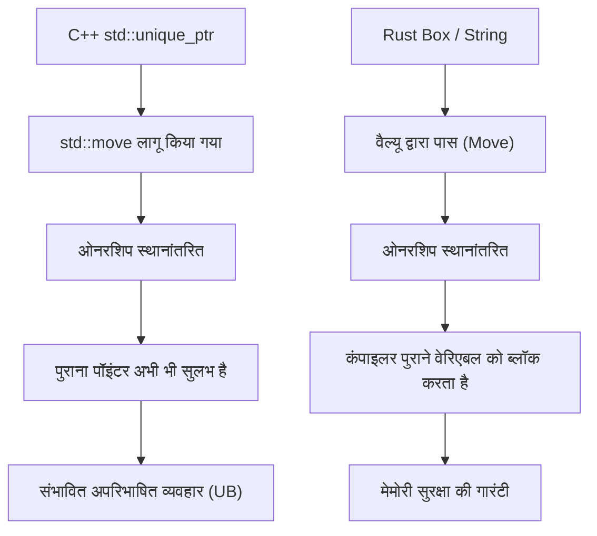
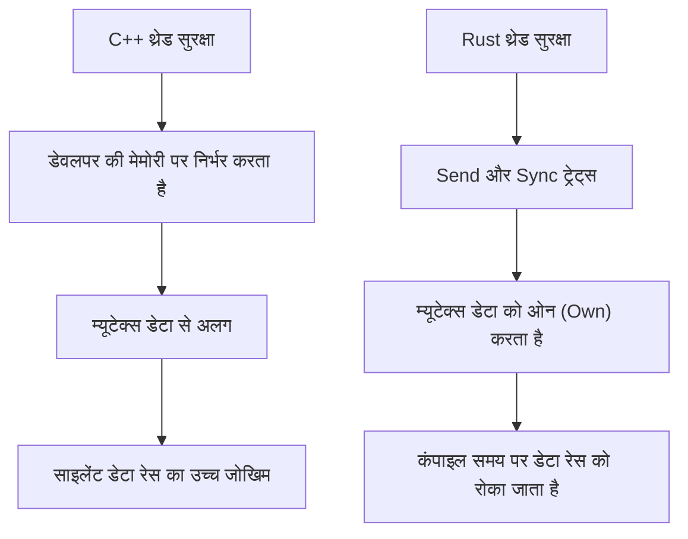
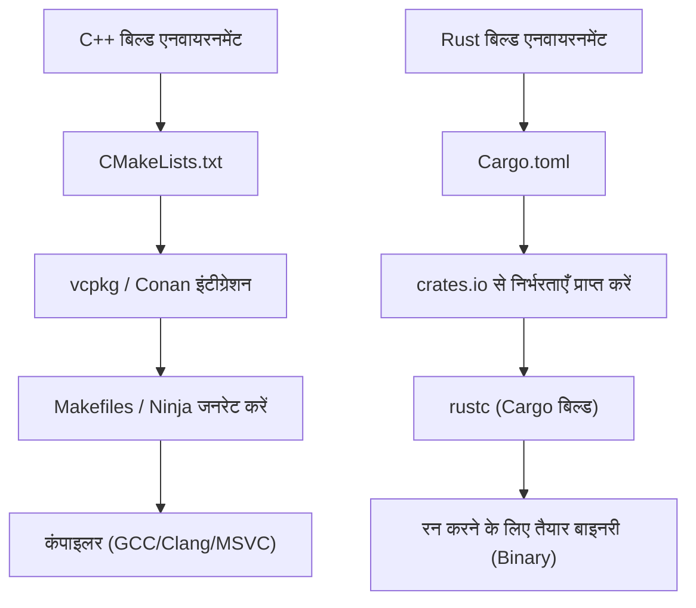

# प्रस्तावना: सिस्टम प्रोग्रामिंग की एक नई सुबह

आधुनिक सॉफ्टवेयर इंजीनियरिंग में, C++ और Rust सिस्टम प्रोग्रामिंग के अग्रिम मोर्चे पर खड़े दो बड़े नाम हैं। कई वर्षों तक, C++ ऑपरेटिंग सिस्टम, एम्बेडेड डिवाइस, गेम इंजन, और हाई-फ्रीक्वेंसी ट्रेडिंग (HFT) सिस्टम जैसे हार्डवेयर के चरम प्रदर्शन को निकालने वाले क्षेत्रों में एक पूर्ण राजा के रूप में हावी रहा है। मैं खुद एक सीनियर C++ इंजीनियर के रूप में, C++98 युग के कच्चे पॉइंटर्स (raw pointers) के जंगल से शुरू करके, C++11 के आधुनिकीकरण की लहर (स्मार्ट पॉइंटर्स, लैम्ब्डा एक्सप्रेशन, `auto` की शुरूआत), और C++14/17/20 के साथ निरंतर बढ़ती विशेषताओं के साथ कोड लिखता आ रहा हूँ।

हालाँकि, हाल के वर्षों में, C++ की संरचनात्मक चुनौतियों - विशेष रूप से "मेमोरी सुरक्षा की कमी" के कारण होने वाली सुरक्षा कमजोरियों (माना जाता है कि लगभग 70% CVE मेमोरी से उत्पन्न होते हैं) और "अंतहीन रूप से जटिल विनिर्देशों और अपरिभाषित व्यवहार (UB)" के समाधान के रूप में Rust का नाटकीय उदय हुआ है। Linux कर्नेल में इसकी आधिकारिक स्वीकृति और Microsoft, Google, AWS जैसी बड़ी टेक कंपनियों द्वारा बड़े पैमाने पर Rust में माइग्रेशन प्रोजेक्ट, केवल एक अस्थायी चलन नहीं है, बल्कि सिस्टम प्रोग्रामिंग के पैराडाइम शिफ्ट को दर्शाता है।

इस लेख में, एक सच्चे C++ इंजीनियर द्वारा वास्तव में गहराई से Rust को सीखने और व्यावहारिक उपयोग में महसूस किए गए "फायदे" और "नुकसान" की तकनीकी दृष्टिकोण से पूरी तरह से तुलना और व्याख्या की जाएगी, जो भाषा के मूल डिजाइन से संबंधित है।

---

# 1. मेमोरी मैनेजमेंट का पैराडाइम शिफ्ट: RAII से ओनरशिप (Ownership) और बॉरोइंग (Borrowing) तक

## C++ का RAII और स्मार्ट पॉइंटर्स की सीमाएँ

C++ के सबसे महान आविष्कारों में से एक **RAII (Resource Acquisition Is Initialization)** है। कंस्ट्रक्टर में संसाधनों को आरक्षित करने और स्कोप से बाहर निकलते समय डिस्ट्रक्टर द्वारा उन्हें स्वचालित रूप से मुक्त करने की यह अवधारणा, मैन्युअल `new` और `delete` के कारण होने वाले मेमोरी लीक के डर से डेवलपर्स को मुक्त करती है। C++11 के बाद से `std::unique_ptr` और `std::shared_ptr` को मानक लाइब्रेरी में पेश किया गया, जिससे ओनरशिप (Ownership) की अवधारणा को कोड में व्यक्त करना संभव हो गया।

लेकिन, C++ के स्मार्ट पॉइंटर्स और मूव सिमेंटिक्स (Move Semantics) में एक गंभीर कमजोरी है कि कंपाइलर द्वारा स्टेटिक सत्यापन अधूरा है।

```cpp
#include <iostream>
#include <memory>
#include <string>

void consume(std::unique_ptr<std::string> ptr) {
    std::cout << "Consuming: " << *ptr << std::endl;
}

int main() {
    auto my_ptr = std::make_unique<std::string>("Hello, C++");
    
    // ओनरशिप को फंक्शन में मूव (Move) करें
    consume(std::move(my_ptr));
    
    // खतरा: C++ में मूव किए गए ऑब्जेक्ट तक पहुंचने पर कंपाइल एरर नहीं होता है
    // std::move केवल एक राइट-वैल्यू रेफरेंस (T&&) में कास्ट है, और कंपाइलर इसके उपयोग को नहीं रोकता है
    if (my_ptr) {
        std::cout << "Pointer is still valid?" << std::endl;
    } else {
        std::cout << "Pointer is null." << std::endl;
    }
    
    // std::cout << *my_ptr << std::endl; // मुक्त करने के बाद मेमोरी का उपयोग (Use-After-Free) के कारण अपरिभाषित व्यवहार
    return 0;
}
```

C++ में, `std::move` द्वारा खाली किए गए (मान्य लेकिन अनिर्दिष्ट अवस्था वाले) ऑब्जेक्ट तक गलती से पहुँचने का जोखिम हमेशा बना रहता है। इससे रनटाइम क्रैश या सबसे खराब स्थिति में सुरक्षा भेद्यता हो सकती है।

## Rust की ओनरशिप (Ownership) और बॉरो चेकर (Borrow Checker) का पूर्ण बचाव

Rust इस "ओनरशिप" की अवधारणा को भाषा के मूल डिज़ाइन में शामिल करता है, और **बॉरो चेकर (Borrow Checker)** नामक कंपाइलर की सुविधा द्वारा सख्त स्टेटिक विश्लेषण करता है।

```rust
fn consume(s: String) {
    println!("Consuming: {}", s);
} // यहां s स्कोप से बाहर निकल जाता है, और मेमोरी मुक्त (Drop) हो जाती है

fn main() {
    let my_string = String::from("Hello, Rust");
    
    // ओनरशिप को फंक्शन में मूव करें। Rust में डिफॉल्ट मूव सिमेंटिक्स होता है।
    consume(my_string);
    
    // कंपाइल एरर! मूव किए गए चर (variable) को बिल्कुल एक्सेस नहीं किया जा सकता
    // println!("Is it still there? {}", my_string);
}
```

Rust में, जैसे ही किसी वेरिएबल की ओनरशिप स्थानांतरित होती है, मूल वेरिएबल को कंपाइलर द्वारा "असंसाधित (uninitialized)" अवस्था के बराबर माना जाता है, और आगे की पहुँच को पूरी तरह से अवरुद्ध कर दिया जाता है। इसके कारण, "Use-After-Free (मुक्त होने के बाद मेमोरी का उपयोग)" और "Dangling Pointer (डैंगलिंग पॉइंटर)" जैसे बग सैद्धांतिक रूप से कंपाइल नहीं हो सकते हैं।



## बॉरोइंग (Borrowing) और परिवर्तनशीलता (Mutability) का नियंत्रण

इससे भी अधिक शक्तिशाली संसाधनों को संदर्भित करने वाले "बॉरोइंग (Borrowing)" के नियम हैं। Rust में निम्नलिखित नियम लागू किए जाते हैं:
1. किसी भी समय, "कई अपरिवर्तनीय संदर्भ (immutable references) (`&T`)" या "एकल परिवर्तनीय संदर्भ (mutable reference) (`&mut T`)" में से **केवल एक** ही मौजूद हो सकता है।
2. संदर्भ मूल डेटा के स्कोप से अधिक समय तक नहीं रहना चाहिए (लाइफटाइम की बाधाएं)।

C++ में, आप एक ही ऑब्जेक्ट के लिए आसानी से कई म्यूटबल (परिवर्तनीय) संदर्भ या पॉइंटर्स बना सकते हैं, जिससे अप्रत्याशित अवस्था का विनाश (जैसे इटरेटर का अमान्यकरण) हो सकता है। Rust भाषा के स्तर पर इस "अलियासिंग (Aliasing) + म्यूटबिलिटी (Mutability)" के संयोजन को प्रतिबंधित करके बग को रोकता है।

---

# 2. मेमोरी लेआउट और स्मार्ट पॉइंटर्स का गणितीय ओवरहेड

सिस्टम प्रोग्रामिंग में, मेमोरी लेआउट की सटीक समझ आवश्यक है। आइए C++ के `std::shared_ptr` और Rust के `std::rc::Rc` / `std::sync::Arc` की तुलना करें।

C++ का `std::shared_ptr` संदर्भ गणना (reference counting) द्वारा संसाधनों का प्रबंधन करता है, लेकिन डिफ़ॉल्ट रूप से संदर्भ गणना को बढ़ाने या घटाने के लिए थ्रेड-सेफ एटॉमिक ऑपरेशंस (`std::atomic`) का उपयोग करता है। मेमोरी पर इसके ओवरहेड को इस प्रकार सूत्रबद्ध किया जा सकता है:

$$ Overhead_{C++} = sizeof(T) + sizeof(ControlBlock) $$

यहाँ, $ControlBlock$ में "मजबूत संदर्भ काउंटर (Strong Ref Count)", "कमजोर संदर्भ काउंटर (Weak Ref Count)", और "कस्टम डिलीटर (Custom Deleter)" शामिल हैं। समस्या यह है कि सिंगल-थ्रेड का उपयोग करते समय भी, एटॉमिक निर्देशों का ओवरहेड (जैसे कैशलाइन को लॉक करना) बिना किसी शर्त के उत्पन्न होता है।

इसके विपरीत, Rust स्मार्ट पॉइंटर्स को उपयोग के आधार पर सख्ती से अलग करता है।

- **सिंगल-थ्रेड के लिए**: `Rc<T>` (Reference Counted)
- **मल्टी-थ्रेड के लिए**: `Arc<T>` (Atomic Reference Counted)

$$ Overhead_{Rc} = sizeof(T) + 2 \times sizeof(usize) $$
$$ Overhead_{Arc} = sizeof(T) + 2 \times sizeof(AtomicUsize) $$

Rust में, यदि आप सिंगल-थ्रेड के लिए विशेष रूप से `Rc<T>` का उपयोग करते हैं, तो आप एटॉमिक ऑपरेशंस के दंड (penalty) से पूरी तरह बच सकते हैं (ज़ीरो-कॉस्ट एब्स्ट्रैक्शन)। इसके अलावा, थ्रेड सुरक्षा तंत्र (जिसके बारे में बाद में बताया जाएगा) के कारण, गलती से `Rc<T>` को किसी अन्य थ्रेड में पास करने से टाइप सिस्टम द्वारा पूरी तरह से बचा जा सकता है।

---

# 3. थ्रेड सुरक्षा: "Fearless Concurrency" का प्रभाव

C++ में मल्टी-थ्रेडेड प्रोग्रामिंग हमेशा डेटा रेस (data race) और डेडलॉक (deadlock) के डर के साथ होती थी।

## C++ का म्यूटेक्स (Mutex) और डेटा अलगाव का खतरा

C++ का `std::mutex` केवल "विशिष्ट कोड ब्लॉक (क्रिटिकल सेक्शन)" को परस्पर अनन्य (mutually exclusive) रूप से नियंत्रित करने के लिए है, और "सुरक्षित किए जाने वाले डेटा" और "म्यूटेक्स" के बीच कोई भाषाई संबंध नहीं है।

```cpp
#include <iostream>
#include <thread>
#include <mutex>
#include <vector>

std::vector<int> shared_data;
std::mutex mtx;

void worker() {
    // यदि डेवलपर लॉक प्राप्त करना भूल भी जाता है, तो कंपाइलेशन सामान्य रूप से पास हो जाता है
    // std::lock_guard<std::mutex> lock(mtx);
    shared_data.push_back(1); // घातक डेटा रेस!
}

int main() {
    std::thread t1(worker);
    std::thread t2(worker);
    t1.join();
    t2.join();
    return 0;
}
```

## Rust का म्यूटेक्स डेटा को "ओन (own)" करता है

Rust में, `Mutex<T>` जेनरिक (Generics) का उपयोग करके सुरक्षित किए जाने वाले डेटा प्रकार `T` को **सम्मिलित (स्वयं का/own)** करता है। डेटा तक पहुँचने के लिए, आपको हमेशा `lock()` को कॉल करना होगा और एक गार्ड ऑब्जेक्ट प्राप्त करना होगा। लॉक प्राप्त किए बिना डेटा को छूना व्याकरणिक रूप से असंभव है।

```rust
use std::sync::{Arc, Mutex};
use std::thread;

fn main() {
    // डेटा पूरी तरह से म्यूटेक्स (Mutex) के अंदर इनकैप्सुलेटेड (encapsulated) है
    let shared_data = Arc::new(Mutex::new(Vec::new()));
    let mut handles = vec![];

    for _ in 0..2 {
        // थ्रेड्स के बीच साझा करने के लिए Arc (थ्रेड-सेफ रेफरेंस काउंटिंग) को क्लोन करें
        let data_clone = Arc::clone(&shared_data);
        let handle = thread::spawn(move || {
            // यदि आप लॉक प्राप्त नहीं करते हैं, तो आप आंतरिक Vec तक नहीं पहुंच सकते
            let mut data = data_clone.lock().unwrap();
            data.push(1);
        });
        handles.push(handle);
    }

    for handle in handles {
        handle.join().unwrap();
    }
}
```

इसके अलावा, Rust में समवर्ती प्रसंस्करण (concurrent processing) की सुरक्षा सुनिश्चित करने के लिए दो कोर ट्रेट (Traits) हैं:
- `Send`: वे प्रकार जिनकी ओनरशिप थ्रेड्स के बीच सुरक्षित रूप से स्थानांतरित की जा सकती है
- `Sync`: वे प्रकार जिन्हें एक ही समय में कई थ्रेड्स से संदर्भित करना सुरक्षित है

उदाहरण के लिए, नॉन-थ्रेड-सेफ `Rc<T>` `Send` ट्रेट को लागू नहीं करता है। इसलिए, यदि आप इसे `thread::spawn` में पास करने का प्रयास करते हैं, तो तत्काल कंपाइल एरर होगा। इस "Fearless Concurrency (निडर समवर्ती प्रसंस्करण)" के साथ, डेवलपर्स बग के डर से मुक्त हो जाते हैं और समानांतरकरण (parallelization) को अधिक आक्रामकता से आगे बढ़ा सकते हैं।

अमदाल के नियम (Amdahl's Law) के अनुसार, समानांतर (parallelizable) भाग $P$ और समानांतरता की डिग्री $N$ में अधिकतम सैद्धांतिक थ्रूपुट को इस प्रकार व्यक्त किया जाता है:

$$ S(N) = \frac{1}{(1 - P) + \frac{P}{N}} $$

Rust इस $P$ को अधिकतम करने के लिए रिफैक्टरिंग को टाइप सिस्टम की सहायता से अत्यधिक सुरक्षित रूप से करने की अनुमति देता है।



---

# 4. एरर हैंडलिंग: अपवाद (Exceptions) बनाम बीजीय डेटा प्रकार (Algebraic Data Types)

C++ में एरर हैंडलिंग का मानक "अपवाद (Exceptions)" है। हालाँकि, अपवाद कंट्रोल फ्लो (control flow) को अपारदर्शी बनाते हैं और प्रदर्शन दंड (स्टैक अनवाइंडिंग और RTTI की वृद्धि) का कारण बनते हैं। एम्बेडेड सिस्टम और गेम इंजन में, अक्सर अपवादों को पूरी तरह से अक्षम (`-fno-exceptions`) किया जाता है और क्लासिक त्रुटि कोड (error codes) वापस करने का डिज़ाइन अपनाया जाता है। C++23 में `std::expected` पेश किया गया backwards, लेकिन इसे पूरे इकोसिस्टम में प्रवेश करने में समय लगेगा।

Rust में अपवाद की कोई अवधारणा नहीं है। त्रुटियों को शुद्ध "वैल्यू" के रूप में वापस किया जाता है और `Result<T, E>` नामक एन्यूमरेशन (बीजीय डेटा प्रकार) द्वारा दर्शाया जाता है।

```rust
use std::fs::File;
use std::io::{self, Read};

// केवल रिटर्न वैल्यू टाइप को देखकर स्पष्ट हो जाता है कि IO एरर हो सकता है
fn read_file_content(path: &str) -> Result<String, io::Error> {
    // ? ऑपरेटर के साथ, अगर कोई त्रुटि है तो तुरंत अर्ली-रिटर्न (early return), यदि सफल होता है तो सामग्री निकालें
    let mut file = File::open(path)?; 
    let mut content = String::new();
    file.read_to_string(&mut content)?;
    Ok(content)
}
```

यह `?` ऑपरेटर क्रांतिकारी है। यह C++ में त्रुटि कोड की जांच करते समय उत्पन्न होने वाले गहरे नेस्ट (if स्टेटमेंट का पिरामिड) को समाप्त करता है, अपवादों की तरह एक साफ़ कोड प्रवाह बनाए रखता है, और आपको स्पष्ट रूप से यह वर्णन करने की अनुमति देता है कि कौन से फ़ंक्शन कॉल त्रुटि का प्रचार (propagate) करेंगे।

---

# 5. पॉलीमॉर्फिज्म: वर्चुअल फ़ंक्शन/टेम्पलेट से ट्रेट (Trait) तक

C++ का पॉलीमॉर्फिज्म मुख्य रूप से क्लास इनहेरिटेंस और वर्चुअल फंक्शंस (`virtual`) द्वारा डायनेमिक डिस्पैच, या टेम्पलेट्स द्वारा स्टैटिक डिस्पैच (CRTP आदि) से प्राप्त होता है।

डायनेमिक डिस्पैच में, एक वर्चुअल फ़ंक्शन टेबल (vtable) का पॉइंटर (vptr) ऑब्जेक्ट में एम्बेडेड होता है, और फ़ंक्शन कॉल के समय पॉइंटर रिज़ॉल्यूशन ओवरहेड होता है।

$$ T_{dispatch} = T_{lookup\_in\_vtable} + T_{dereference} $$

Rust क्लासिकल ऑब्जेक्ट-ओरिएंटेड "क्लास इनहेरिटेंस" को छोड़ देता है और इसके बजाय "**ट्रेट (Traits)**" की अवधारणा को अपनाता है (यह C++20 की Concept के समान है, लेकिन अधिक बहुमुखी है)।

```rust
trait Drawable {
    fn draw(&self);
}

struct Circle { radius: f64 }
impl Drawable for Circle {
    fn draw(&self) { println!("Drawing a Circle of radius {}", self.radius); }
}

// स्टैटिक डिस्पैच (मोनोमोर्फाइजेशन / शून्य ओवरहेड)
fn draw_static<T: Drawable>(item: &T) {
    item.draw();
}

// डायनेमिक डिस्पैच (ट्रेट ऑब्जेक्ट)
fn draw_dynamic(item: &dyn Drawable) {
    item.draw();
}
```

Rust के डायनेमिक डिस्पैच (`dyn Trait`) की सबसे बड़ी विशेषता यह है कि यह डेटा संरचना के भीतर vptr नहीं रखता है, बल्कि **फैट पॉइंटर (Fat Pointer)** का उपयोग करता है। फैट पॉइंटर्स जोड़े (pair) में "डेटा का पॉइंटर" और "vtable का पॉइंटर" रखते हैं। यह बाहरी पुस्तकालयों में परिभाषित प्रकारों के लिए बाद में ट्रेट को लागू (विस्तारित) करना और डायनेमिक डिस्पैच करना बहुत आसान बनाता है।

---

# 6. पैकेज मैनेजमेंट और बिल्ड सिस्टम: CMake का संघर्ष और Cargo का वरदान

C++ की सबसे बड़ी कमजोरियों में से एक मानक पैकेज मैनेजर की अनुपस्थिति है। `CMakeLists.txt` का गूढ़ सिंटैक्स, `find_package` के साथ निर्भरता रिज़ॉल्यूशन की जटिलता, और OS के आधार पर लाइब्रेरी पथों (paths) में अंतर ने C++ इंजीनियरों का बहुत समय बर्बाद किया है।

Rust में **Cargo** नामक दुनिया का सबसे अच्छा पैकेज मैनेजर और बिल्ड सिस्टम मानक के रूप में शामिल है।



`Cargo.toml` में बस एक लाइन में निर्भरता लाइब्रेरी (Crate) का नाम और संस्करण जोड़कर, ट्रांजिटिव (transitive) निर्भरता का समाधान, डाउनलोड और निर्माण सब स्वचालित रूप से किया जाता है। इसके अलावा, परीक्षण (`cargo test`), दस्तावेज़ जनरेशन (`cargo doc`), स्टेटिक विश्लेषण (`cargo clippy`), और फ़ॉर्मेटर (`cargo fmt`) जैसे विकास के लिए आवश्यक सभी टूलचेन इस एकल कमांड में एकीकृत हैं। यह आराम इतना जबरदस्त है कि एक बार इसे अनुभव करने के बाद, आप कभी भी C++ बिल्ड वातावरण में वापस नहीं जाना चाहेंगे।

---

# 7. Rust सीखने के नुकसान और लर्निंग कर्व (Learning Curve)

अब तक मैंने Rust के फायदों के बारे में बात की है, लेकिन कुछ "दीवारें" और नुकसान भी हैं जिनका सामना C++ इंजीनियरों को Rust को व्यावहारिक उपयोग में लाते समय करना पड़ता है।

## 1. कठोर बॉरो चेकर (Borrow Checker) के साथ संघर्ष
यदि आप C++ में डेटा स्ट्रक्चर्स (जैसे कि डबली-लिंक्ड लिस्ट्स, ग्राफ स्ट्रक्चर्स, सेल्फ-रेफरेंशियल स्ट्रक्चर्स आदि) जिन्हें आपने "किसी तरह रॉ पॉइंटर्स (raw pointers) के साथ जोड़ा था" को सीधे Rust में लागू करने का प्रयास करते हैं, तो ओनरशिप और लाइफटाइम बाधाओं के कारण कंपाइलेशन पास नहीं होगा। बॉरो चेकर को संतुष्ट करने के लिए, आपको या तो `Rc<RefCell<T>>` जैसी जटिल रैपिंग करनी होगी, या एरिना एलोकेटर (arena allocator) या इंडेक्स-आधारित प्रबंधन का उपयोग करने के लिए डिज़ाइन पर मौलिक रूप से पुनर्विचार करना होगा।

## 2. लंबे समय तक कंपाइलेशन (Compilation Time)
C++ में टेम्पलेट्स की नेस्टिंग के कारण भी कंपाइलेशन धीमा हो जाता है, लेकिन Rust का कंपाइलेशन समय (विशेष रूप से खरोंच से क्लीन बिल्ड) भी कम नहीं है। LLVM के शक्तिशाली ऑप्टिमाइजेशन पास, मैक्रोज़ का विस्तार, और जेनरिक के मोनोमोर्फाइजेशन (Monomorphization) के ओवरलैप होने के कारण, बड़े पैमाने के प्रोजेक्ट्स में बिल्ड समय एक बाधा बन जाता है। विकास के दौरान `cargo check` का भारी उपयोग करना जैसी तकनीकें आवश्यक हैं।

## 3. C++ कोडबेस के साथ इंटरऑपरेबिलिटी (Interoperability)
C भाषा (FFI) के साथ एकीकरण बहुत सुचारू है, लेकिन Rust को सीधे मौजूदा विशाल C++ कोडबेस (जो क्लास, टेम्पलेट्स, वर्चुअल फ़ंक्शंस का भारी उपयोग करते हैं) के साथ एकीकृत करना बहुत मुश्किल है। हाल के वर्षों में, `cxx` और `autocxx` जैसे ब्रिजिंग टूल विकसित हुए हैं, लेकिन पूर्ण सीमलेस (seamless) माइग्रेशन के लिए अभी भी उच्च बाधाएँ हैं।

---

# निष्कर्ष: क्या हमें Rust की ओर रुख करना चाहिए?

C++ भविष्य में भी गेम इंजन डेवलपमेंट और मौजूदा बड़े इन्फ्रास्ट्रक्चर में महत्वपूर्ण भूमिका निभाता रहेगा। C++20/23 के साथ आधुनिकीकरण भी उल्लेखनीय है, और इसे अधिक सुरक्षित रूप से लिखा जा सकता है।

हालाँकि, "नए शुरू किए जा रहे सिस्टम प्रोग्रामिंग प्रोजेक्ट्स" के लिए, मुझे लगता है कि **Rust को नहीं चुनने का कारण खोजना अब अधिक कठिन है**। एक बार कंपाइल हो जाने पर, अपरिभाषित व्यवहार (undefined behavior) और मेमोरी करप्शन के डर से मुक्ति, और उच्च प्रदर्शन के साथ सुरक्षित रूप से समवर्ती रूप से प्रोसेस करने में सक्षम होने की Rust की "निश्चितता" इंजीनियर के मानसिक मॉडल (mental model) में नाटकीय रूप से सुधार करती है।

C++ इंजीनियरों के लिए, Rust सीखना केवल एक नया सिंटैक्स सीखना नहीं है, बल्कि "मेमोरी और थ्रेड्स को सुरक्षित रूप से प्रबंधित करने" पर एक नया दृष्टिकोण प्राप्त करने का सबसे अच्छा अनुभव है। मैं आप सभी को Cargo की सुविधा और बॉरो चेकर की सख्ती का अनुभव करने के लिए प्रोत्साहित करता हूँ।
