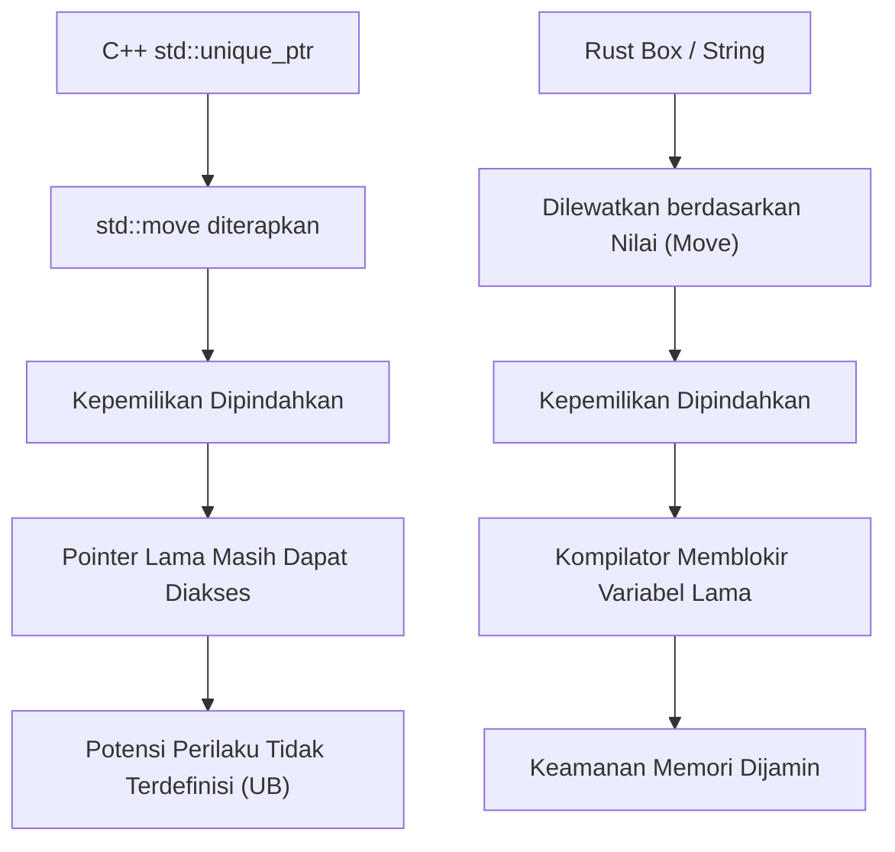
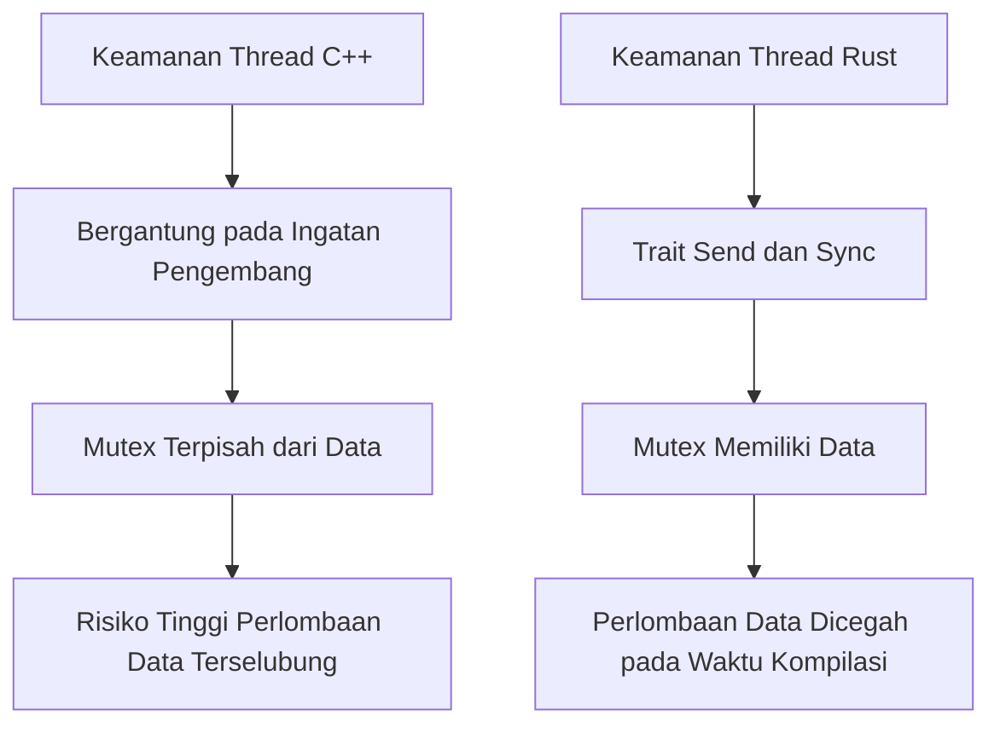
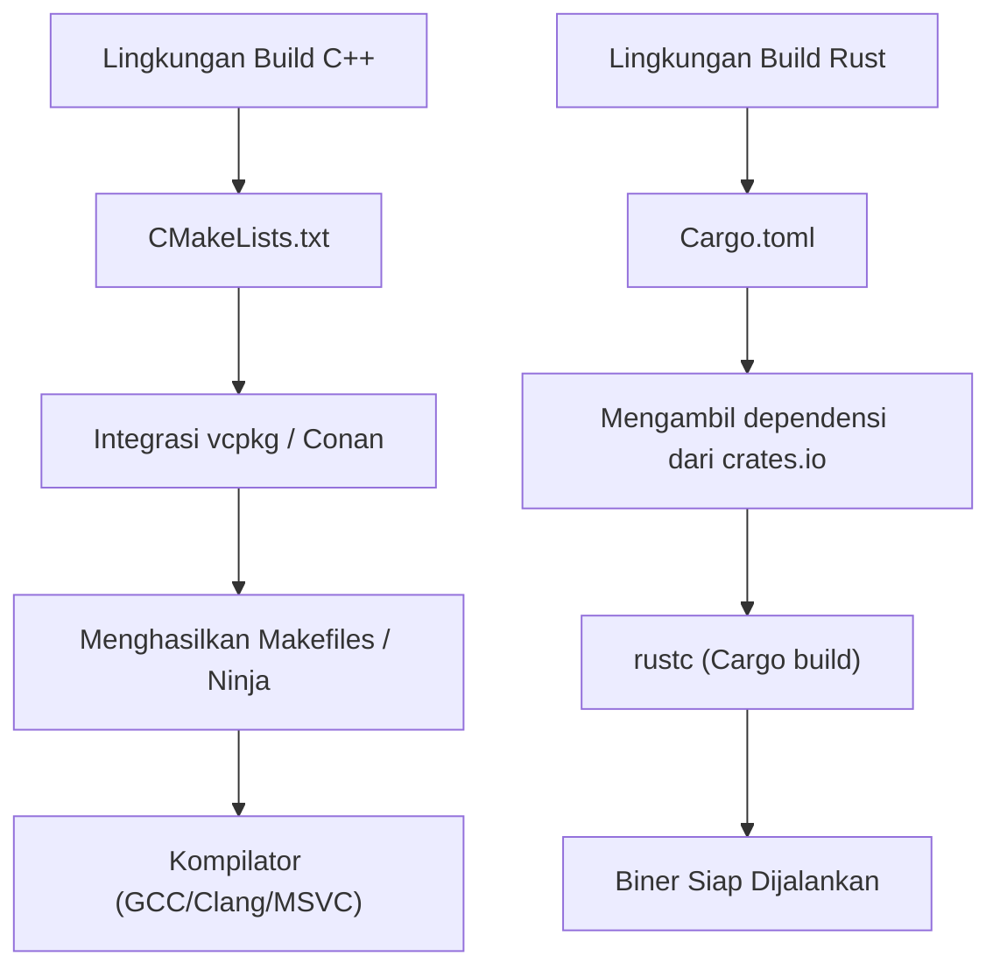

# Pendahuluan: Fajar Baru Pemrograman Sistem

Dalam rekayasa perangkat lunak modern, C++ dan Rust berdiri di garis depan pemrograman sistem sebagai dua raksasa utama. Selama bertahun-tahun, C++ telah berkuasa sebagai raja mutlak di domain yang menuntut performa ekstrem dari perangkat keras, seperti sistem operasi, perangkat tertanam (embedded devices), mesin game (game engines), dan sistem perdagangan frekuensi tinggi (HFT). Saya sendiri sebagai insinyur C++ senior, mulai dari belantara pointer mentah di era C++98, melalui gelombang modernisasi C++11 (pengenalan smart pointer, lambda expressions, dan `auto`), hingga mendampingi spesifikasi yang terus membengkak di C++14/17/20, telah terus menulis kode.

Namun baru-baru ini, sebagai solusi untuk kelemahan struktural yang dimiliki C++—terutama kerentanan keamanan yang disebabkan oleh "kurangnya keamanan memori" (sekitar 70% dari CVE konon disebabkan oleh memori) dan "spesifikasi yang semakin kompleks tanpa akhir dan perilaku tidak terdefinisi (UB)"—Rust telah menunjukkan kebangkitan yang dramatis. Adopsi resminya ke dalam kernel Linux, serta proyek migrasi skala besar ke Rust oleh perusahaan-perusahaan teknologi raksasa seperti Microsoft, Google, dan AWS, bukanlah sekadar tren sementara, melainkan menandakan pergeseran paradigma dalam pemrograman sistem.

Dalam artikel ini, dari sudut pandang teknis yang berkaitan erat dengan fondasi spesifikasi bahasa, saya akan membandingkan dan menjelaskan secara mendalam "kelebihan" dan "kekurangan" yang dirasakan oleh seorang insinyur C++ tulen setelah benar-benar mempelajari Rust secara mendalam dan menggunakannya dalam praktik.

---

# 1. Pergeseran Paradigma Manajemen Memori: Dari RAII ke Kepemilikan dan Peminjaman

## RAII pada C++ dan Keterbatasan Smart Pointer

Salah satu penemuan terbesar C++ adalah **RAII (Resource Acquisition Is Initialization)**. Konsep ini, di mana sumber daya dialokasikan di konstruktor dan dibebaskan secara otomatis di destruktor saat keluar dari cakupan (scope), telah membebaskan pengembang dari teror kebocoran memori akibat penggunaan `new` dan `delete` secara manual. Mulai C++11, `std::unique_ptr` dan `std::shared_ptr` diperkenalkan ke perpustakaan standar, memungkinkan konsep kepemilikan (Ownership) untuk diekspresikan dalam kode.

Namun, smart pointer dan semantik perpindahan (move semantics) C++ memiliki kelemahan fatal di mana verifikasi statis oleh kompilator tidak sempurna.

```cpp
#include <iostream>
#include <memory>
#include <string>

void consume(std::unique_ptr<std::string> ptr) {
    std::cout << "Consuming: " << *ptr << std::endl;
}

int main() {
    auto my_ptr = std::make_unique<std::string>("Hello, C++");
    
    // Memindahkan (move) kepemilikan ke fungsi
    consume(std::move(my_ptr));
    
    // Bahaya: Di C++, mengakses objek setelah di-move tidak menyebabkan error kompilasi
    // std::move hanyalah sekadar cast ke rvalue reference (T&&), dan kompilator tidak memblokir penggunaannya
    if (my_ptr) {
        std::cout << "Pointer is still valid?" << std::endl;
    } else {
        std::cout << "Pointer is null." << std::endl;
    }
    
    // std::cout << *my_ptr << std::endl; // Perilaku tidak terdefinisi akibat penggunaan memori setelah dibebaskan (Use-After-Free)
    return 0;
}
```

Di C++, selalu ada risiko bahwa Anda secara tidak sengaja mengakses objek yang isinya telah dikosongkan (valid tetapi dalam keadaan yang tidak ditentukan) oleh `std::move`. Ini dapat langsung berujung pada crash saat runtime, atau dalam kasus terburuk, lubang keamanan.

## Kepemilikan (Ownership) Rust dan Pertahanan Absolut Borrow Checker

Rust menggabungkan konsep "kepemilikan" ini ke dalam desain inti bahasanya, dan melakukan analisis statis yang ketat melalui fitur kompilator yang disebut **Borrow Checker (Pengecek Peminjaman)**.

```rust
fn consume(s: String) {
    println!("Consuming: {}", s);
} // Di sini s keluar dari scope, dan memori dibebaskan (Drop)

fn main() {
    let my_string = String::from("Hello, Rust");
    
    // Memindahkan kepemilikan ke fungsi. Di Rust, default-nya adalah semantik move.
    consume(my_string);
    
    // Error kompilasi! Variabel setelah di-move sama sekali tidak bisa diakses
    // println!("Is it still there? {}", my_string);
}
```

Di Rust, pada saat kepemilikan sebuah variabel dipindahkan, variabel asli tersebut diperlakukan oleh kompilator setara dengan status "tidak diinisialisasi" dan sepenuhnya memblokir akses selanjutnya. Akibatnya, bug seperti "Use-After-Free (penggunaan memori setelah pembebasan)" dan "Dangling Pointer (pointer menggantung)" secara teoretis tidak akan dapat melewati kompilasi.



## Peminjaman (Borrowing) dan Kontrol Mutabilitas

Yang lebih kuat lagi adalah aturan "peminjaman (Borrowing)" yang merujuk pada sumber daya. Di Rust, aturan berikut ini dipaksakan:
1. Pada waktu tertentu, **hanya satu dari keduanya** yang boleh ada: "banyak referensi tidak dapat diubah (immutable reference, `&T`)" ATAU "satu referensi yang dapat diubah (mutable reference, `&mut T`)".
2. Referensi tidak boleh hidup lebih lama daripada scope data aslinya (batasan lifetime).

Di C++, sangat mudah untuk membuat beberapa referensi atau pointer yang mutable (dapat diubah) ke objek yang sama, dan ini memicu kerusakan status yang tidak terduga (seperti pembatalan iterator). Rust mencegah bug ini sejak awal dengan melarang kombinasi "Aliasing (penamaan alternatif) + Mutability (kemampuan diubah)" di tingkat bahasa.

---

# 2. Tata Letak Memori dan Overhead Matematis Smart Pointer

Dalam pemrograman sistem, pemahaman yang akurat tentang tata letak memori sangatlah penting. Mari kita bandingkan `std::shared_ptr` dari C++ dengan `std::rc::Rc` / `std::sync::Arc` dari Rust.

`std::shared_ptr` C++ mengelola sumber daya melalui penghitungan referensi, dan secara default menggunakan operasi atomik (`std::atomic`) yang aman untuk thread (thread-safe) untuk menambah atau mengurangi jumlah referensi. Overhead pada memori tersebut dapat dirumuskan sebagai berikut:

$$ Overhead_{C++} = sizeof(T) + sizeof(ControlBlock) $$

Di sini, $ControlBlock$ mencakup "Penghitung Referensi Kuat (Strong Ref Count)", "Penghitung Referensi Lemah (Weak Ref Count)", dan "Deleter Kustom (Custom Deleter)". Masalahnya adalah, meskipun hanya digunakan dalam single-thread, overhead dari instruksi atomik (seperti penguncian baris cache, dll.) terjadi tanpa syarat.

Sebaliknya, Rust secara tegas memisahkan smart pointer sesuai dengan tujuan penggunaannya.

- **Untuk Single-thread**: `Rc<T>` (Reference Counted)
- **Untuk Multi-thread**: `Arc<T>` (Atomic Reference Counted)

$$ Overhead_{Rc} = sizeof(T) + 2 \times sizeof(usize) $$
$$ Overhead_{Arc} = sizeof(T) + 2 \times sizeof(AtomicUsize) $$

Di Rust, jika menggunakan `Rc<T>` yang khusus untuk single-thread, Anda dapat sepenuhnya menghindari penalti operasi atomik (abstraksi nol-biaya). Dan melalui mekanisme keselamatan thread (thread-safety) yang dijelaskan nanti, sistem tipe (type system) sepenuhnya mencegah kesalahan dalam memberikan `Rc<T>` ke thread lain.

---

# 3. Keselamatan Thread: Kejutan dari "Fearless Concurrency"

Pemrograman multi-thread di C++ selalu berdampingan dengan ketakutan akan perlombaan data (data race) dan kebuntuan (deadlock).

## Bahaya dari Pemisahan Mutex dan Data di C++

`std::mutex` pada C++ pada dasarnya hanyalah pengontrol eksklusif untuk "blok kode tertentu (critical section)", dan tidak ada kaitan bahasawi antara "data yang harus dilindungi" dan "mutex"-nya.

```cpp
#include <iostream>
#include <thread>
#include <mutex>
#include <vector>

std::vector<int> shared_data;
std::mutex mtx;

void worker() {
    // Sekalipun pengembang lupa mendapatkan kunci (lock), proses kompilasi tetap akan lolos
    // std::lock_guard<std::mutex> lock(mtx);
    shared_data.push_back(1); // Perlombaan data (data race) yang fatal!
}

int main() {
    std::thread t1(worker);
    std::thread t2(worker);
    t1.join();
    t2.join();
    return 0;
}
```

## Mutex Rust "Memiliki" Datanya

Di Rust, `Mutex<T>` menggunakan generik untuk **membungkus (memiliki)** tipe data yang dilindunginya, `T`. Untuk mengakses data, Anda diharuskan memanggil `lock()` untuk mendapatkan objek pelindung (guard object). Menyentuh data tanpa mendapatkan kunci (lock) adalah hal yang tidak mungkin secara tata bahasa (sintaks).

```rust
use std::sync::{Arc, Mutex};
use std::thread;

fn main() {
    // Data sepenuhnya dienkapsulasi di dalam Mutex
    let shared_data = Arc::new(Mutex::new(Vec::new()));
    let mut handles = vec![];

    for _ in 0..2 {
        // Mengkloning Arc (penghitungan referensi yang aman untuk thread) untuk dibagikan antar thread
        let data_clone = Arc::clone(&shared_data);
        let handle = thread::spawn(move || {
            // Tanpa mendapatkan kunci (lock), akses ke Vec internal tidak bisa dilakukan
            let mut data = data_clone.lock().unwrap();
            data.push(1);
        });
        handles.push(handle);
    }

    for handle in handles {
        handle.join().unwrap();
    }
}
```

Terlebih lagi, di dalam Rust terdapat 2 sifat inti (core traits) yang menjamin keamanan pemrosesan paralel.
- `Send`: Tipe data yang kepemilikannya dapat ditransfer antar thread dengan aman
- `Sync`: Tipe data yang aman jika diakses secara bersamaan oleh beberapa thread

Sebagai contoh, `Rc<T>` yang tidak aman untuk thread tidak mengimplementasikan trait `Send`. Oleh karena itu, jika Anda mencoba meneruskannya ke `thread::spawn`, ini akan langsung menyebabkan error kompilasi. Dengan adanya "Fearless Concurrency (Konkurensi Tanpa Rasa Takut)" ini, pengembang terbebas dari ketakutan akan bug, dan dapat memajukan paralelisasi dengan jauh lebih agresif.

Menurut Hukum Amdahl (Amdahl's Law), throughput maksimum teoretis untuk bagian yang dapat diparalelkan $P$ dan derajat paralelisme $N$ dinyatakan sebagai berikut:

$$ S(N) = \frac{1}{(1 - P) + \frac{P}{N}} $$

Rust memungkinkan dilakukannya refaktor untuk memaksimalkan $P$ ini dengan sangat aman, mengandalkan sistem tipe.



---

# 4. Penanganan Kesalahan: Pengecualian vs Tipe Data Aljabar

Standar penanganan kesalahan (error handling) di C++ adalah "Pengecualian (Exceptions)". Namun, pengecualian membuat alur kontrol menjadi tidak jelas, dan menyebabkan penalti performa (seperti stack unwinding dan pembengkakan RTTI). Dalam sistem tertanam atau mesin game, menonaktifkan pengecualian sepenuhnya (`-fno-exceptions`) dan mengadopsi desain yang mengembalikan kode kesalahan (error code) klasik sangat sering dilakukan. Meskipun `std::expected` telah diperkenalkan pada C++23, dibutuhkan waktu bagi ekosistem secara keseluruhan untuk mengadopsinya.

Di Rust, konsep pengecualian tidak ada. Kesalahan dikembalikan murni sebagai "nilai", dan direpresentasikan menggunakan tipe enumerasi (tipe data aljabar) `Result<T, E>`.

```rust
use std::fs::File;
use std::io::{self, Read};

// Hanya dengan melihat tipe nilai kembaliannya, jelas bahwa kesalahan IO dapat terjadi
fn read_file_content(path: &str) -> Result<String, io::Error> {
    // Dengan operator ?, return awal seketika jika error, dan jika sukses ekstrak isinya
    let mut file = File::open(path)?; 
    let mut content = String::new();
    file.read_to_string(&mut content)?;
    Ok(content)
}
```

Operator `?` ini revolusioner. Operator ini menghilangkan persarangan (nesting) dalam (piramida pernyataan if) yang terjadi saat memeriksa kode kesalahan di C++, mempertahankan alur kode yang bersih seperti pengecualian, sekaligus memungkinkan penulisan secara eksplisit pada panggilan fungsi mana kesalahan tersebut disebarkan (propagated).

---

# 5. Polimorfisme: Dari Fungsi Virtual dan Templat ke Trait

Polimorfisme dalam C++ diimplementasikan terutama melalui pewarisan kelas dan dispatch dinamis dengan fungsi virtual (`virtual`), atau dispatch statis menggunakan templat (seperti CRTP).

Pada dispatch dinamis, pointer ke tabel fungsi virtual (vtable), yaitu vptr, tertanam ke dalam objek, menyebabkan terjadinya overhead akibat penyelesaian pointer saat pemanggilan fungsi.

$$ T_{dispatch} = T_{lookup\_in\_vtable} + T_{dereference} $$

Rust membuang "pewarisan kelas" ala orientasi objek klasik dan sebagai gantinya mengadopsi konsep "**Traits**" (ini mirip dengan Konsep/Concept C++20, namun jauh lebih kaya fitur).

```rust
trait Drawable {
    fn draw(&self);
}

struct Circle { radius: f64 }
impl Drawable for Circle {
    fn draw(&self) { println!("Menggambar Lingkaran dengan jari-jari {}", self.radius); }
}

// Dispatch Statis (Monomorfisasi / Nol Overhead)
fn draw_static<T: Drawable>(item: &T) {
    item.draw();
}

// Dispatch Dinamis (Objek Trait)
fn draw_dynamic(item: &dyn Drawable) {
    item.draw();
}
```

Fitur terbesar dari dispatch dinamis Rust (`dyn Trait`) adalah penggunaan **Fat Pointer** alih-alih memiliki vptr di dalam struktur datanya. Fat Pointer menyimpan "pointer ke data" dan "pointer ke vtable" sebagai pasangan. Karena itu, sangat mudah untuk mengimplementasikan (memperluas) trait kemudian pada tipe yang didefinisikan oleh perpustakaan (library) eksternal untuk dipanggil secara dispatch dinamis.

---

# 6. Manajemen Paket dan Sistem Build: Penderitaan CMake vs Karunia Cargo

Salah satu kelemahan terbesar C++ adalah ketiadaan manajer paket (package manager) standar. Tata bahasa `CMakeLists.txt` yang rumit, kompleksitas penyelesaian dependensi oleh `find_package`, dan perbedaan pada jalur pustaka (library path) untuk setiap sistem operasi (OS) terus-menerus merampas banyak waktu dari insinyur C++.

Rust hadir dengan standar **Cargo**, yaitu gabungan antara manajer paket dan sistem build terbaik di dunia.



Hanya dengan menambahkan satu baris nama dan versi dari pustaka dependensi (crate) ke `Cargo.toml`, Cargo akan menangani semuanya secara otomatis mulai dari menyelesaikan dependensi transitif, pengunduhan, hingga kompilasi. Selanjutnya, semua rantai perkakas (toolchain) yang diperlukan untuk pengembangan seperti pengujian (`cargo test`), pembuatan dokumentasi (`cargo doc`), analisis statis (`cargo clippy`), dan formatter (`cargo fmt`), seluruhnya terintegrasi ke dalam satu perintah ini. Kenyamanan ini memiliki daya hancur yang sedemikian rupa sehingga begitu Anda mencicipinya, Anda tak akan mau kembali ke lingkungan build C++.

---

# 7. Kekurangan dan Kurva Pembelajaran dalam Mempelajari Rust

Sejauh ini saya telah membicarakan tentang kelebihan Rust, tetapi "dinding" dan kekurangan yang pasti dihadapi oleh insinyur C++ ketika mencoba untuk menempatkan Rust ke dalam praktik pertempuran yang sesungguhnya tentu saja ada.

## 1. Pergulatan Sengit dengan Borrow Checker
Jika Anda mencoba untuk secara langsung mengimplementasikan struktur data yang di C++ "biasanya dihubungkan dengan pointer mentah (raw pointer)" (seperti doubly linked list, struktur graf, atau struktur yang mereferensikan dirinya sendiri) ke dalam Rust, kode tersebut tidak akan lulus kompilasi karena adanya batasan pada kepemilikan dan lifetime. Untuk memuaskan Borrow Checker, Anda perlu menerapkan pembungkus yang rumit seperti `Rc<RefCell<T>>`, atau secara fundamental merombak desain menjadi pengelolaan berbasis indeks atau menggunakan arena allocator.

## 2. Lamanya Waktu Kompilasi
Meskipun kompilasi di C++ menjadi lambat karena templat yang bersarang (nested), waktu kompilasi Rust (terutama clean build dari nol) sama sekali tidak bisa dikatakan singkat. Karena tumpang tindih dari pass optimasi LLVM yang kuat, perluasan makro, dan monomorfisasi (monomorphization) dari generik, waktu build akan menjadi hambatan (bottleneck) dalam proyek skala besar. Selama masa pengembangan, berbagai trik seperti seringnya menggunakan `cargo check` merupakan hal yang sangat penting.

## 3. Interoperabilitas dengan Basis Kode C++
Meskipun integrasi dengan bahasa C (FFI) sangat lancar, untuk mengintegrasikan Rust secara langsung dengan basis kode C++ yang ada dan sangat besar (yang banyak menggunakan kelas, templat, dan fungsi virtual) adalah hal yang sangat sulit. Baru-baru ini, alat jembatan seperti `cxx` dan `autocxx` memang telah berkembang, tetapi masih terdapat rintangan yang tinggi untuk mencapai transisi yang benar-benar mulus.

---

# Kesimpulan: Haruskah Kita Bermigrasi ke Rust?

C++ di masa mendatang akan terus memainkan peran penting dalam pengembangan mesin game dan infrastruktur besar yang sudah ada. Modernisasi melalui C++20/23 juga sangat luar biasa, memungkinkannya untuk ditulis dengan cara yang jauh lebih aman.

Namun, untuk "proyek pemrograman sistem yang baru dimulai," saya merasa sekarang **lebih sulit menemukan alasan untuk TIDAK memilih Rust**. "Kepastian (certainty)" yang ditawarkan oleh Rust, di mana selama kodenya lulus dikompilasi maka Anda terbebas dari ketakutan akan perilaku tidak terdefinisi dan kerusakan memori, serta kemampuan untuk memproses secara paralel dengan aman dan pada kinerja tinggi, secara dramatis meningkatkan model mental seorang insinyur.

Bagi seorang insinyur C++, mempelajari Rust bukan sekadar tentang menghafal sintaksis baru, melainkan sebuah pengalaman terbaik untuk mendapatkan perspektif baru terhadap "metode pengelolaan memori dan thread yang aman". Saya harap Anda semua juga dapat merasakan secara langsung nyamannya penggunaan Cargo sekaligus ketegasan yang diberikan oleh Borrow Checker.
