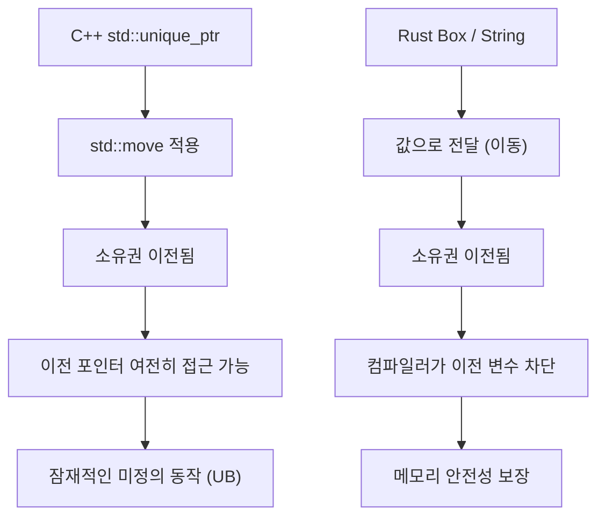
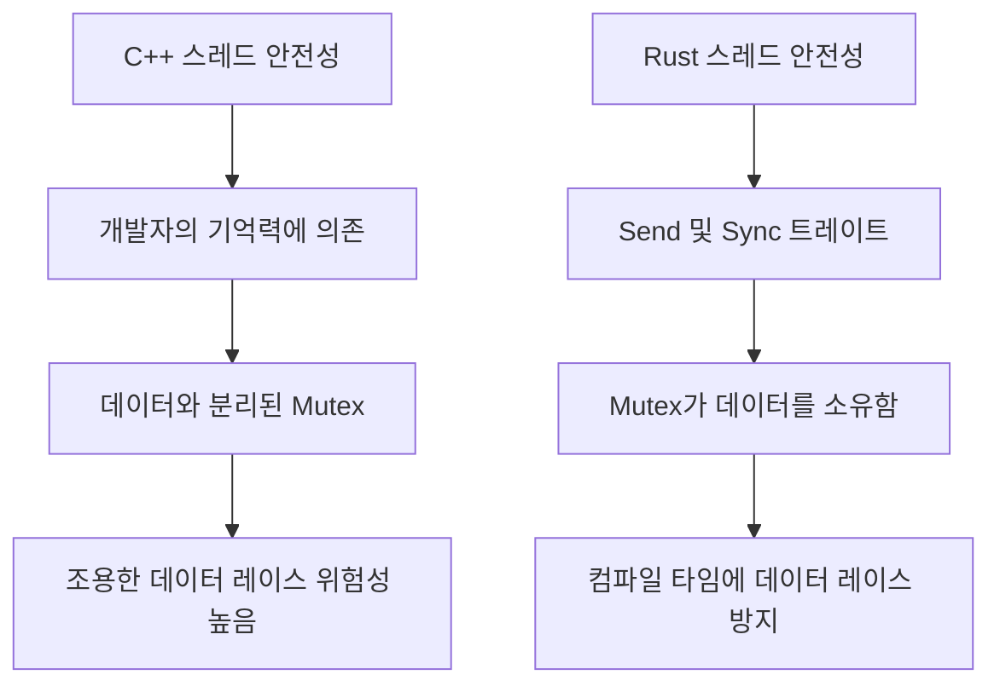
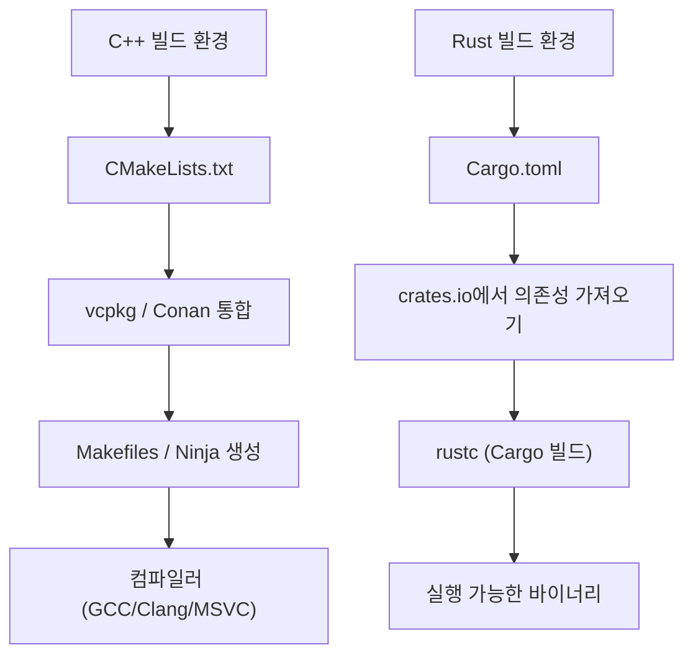

# 머리말: 시스템 프로그래밍의 새로운 새벽

현대 소프트웨어 엔지니어링에서 C++와 Rust는 시스템 프로그래밍의 최전선에 서 있는 양대 산맥입니다. 오랫동안 C++는 운영 체제, 임베디드 장치, 게임 엔진, 고빈도 거래(HFT) 시스템 등 하드웨어의 극한 성능을 끌어내는 영역에서 절대적인 왕으로 군림해 왔습니다. 저 자신도 시니어 C++ 엔지니어로서 C++98 시절의 원시 포인터(raw pointer) 정글에서 시작해, C++11에 의한 현대화의 물결(스마트 포인터, 람다 표현식, `auto` 도입), 그리고 C++14/17/20으로 이어지는 사양의 거대화와 나란히 달리며 코드를 계속 작성해 왔습니다.

그러나 최근 C++가 안고 있는 구조적인 과제, 특히 "메모리 안전성 결여"로 인한 보안 취약점(CVE의 약 70%가 메모리 기인이라고 알려져 있습니다)과 "끝없이 복잡해지는 사양 및 미정의 동작(UB)"에 대한 해결책으로 Rust가 극적으로 대두되고 있습니다. Linux 커널에 공식 채택되거나 Microsoft, Google, AWS 등 거대 기술 기업의 대규모 Rust 전환 프로젝트는 단순한 일시적 유행이 아니라 시스템 프로그래밍의 패러다임 전환을 의미합니다.

본 문서에서는 오리지널 C++ 엔지니어가 실제로 Rust를 깊이 배우고 실전에서 사용하며 느낀 '장점'과 '단점'을 언어 사양의 근간과 관련된 기술적 관점에서 철저하게 비교하고 해설합니다.

---

# 1. 메모리 관리의 패러다임 전환: RAII에서 소유권과 차용으로

## C++의 RAII와 스마트 포인터의 한계

C++의 가장 위대한 발명 중 하나가 **RAII (Resource Acquisition Is Initialization)**입니다. 생성자에서 리소스를 확보하고, 스코프를 벗어날 때 소멸자에서 자동으로 해제한다는 이 개념은 수동 `new`와 `delete`에 의한 메모리 누수 공포로부터 개발자를 해방시켰습니다. C++11부터는 `std::unique_ptr`과 `std::shared_ptr`이 표준 라이브러리에 도입되어, 소유권(Ownership) 개념을 코드 상에서 표현할 수 있게 되었습니다.

그러나 C++의 스마트 포인터와 이동 의미론(Move Semantics)에는 컴파일러에 의한 정적 검증이 불완전하다는 치명적인 약점이 있습니다.

```cpp
#include <iostream>
#include <memory>
#include <string>

void consume(std::unique_ptr<std::string> ptr) {
    std::cout << "Consuming: " << *ptr << std::endl;
}

int main() {
    auto my_ptr = std::make_unique<std::string>("Hello, C++");
    
    // 소유권을 함수로 이동(무브)한다
    consume(std::move(my_ptr));
    
    // 위험: C++에서는 무브 이후의 객체에 대한 접근이 컴파일 에러가 되지 않는다
    // std::move는 단순한 우측값 참조(T&&)로의 캐스트이며, 컴파일러는 사용을 차단하지 않는다
    if (my_ptr) {
        std::cout << "Pointer is still valid?" << std::endl;
    } else {
        std::cout << "Pointer is null." << std::endl;
    }
    
    // std::cout << *my_ptr << std::endl; // 해제 후 메모리 사용(Use-After-Free)에 의한 미정의 동작
    return 0;
}
```

C++에서는 `std::move`에 의해 내용이 비워진(유효하지만 지정되지 않은 상태의) 객체에 대해 실수로 접근해버릴 위험이 항상 존재합니다. 런타임 충돌이나, 최악의 경우 보안 홀로 직결됩니다.

## Rust의 소유권(Ownership)과 빌림 검사기의 절대적 방어

Rust는 이 '소유권'이라는 개념을 언어의 핵심 설계에 통합하고, **빌림 검사기(Borrow Checker)**라고 불리는 컴파일러 기능을 통해 엄격한 정적 분석을 수행합니다.

```rust
fn consume(s: String) {
    println!("Consuming: {}", s);
} // 여기서 s가 스코프를 벗어나고, 메모리가 해제(Drop)된다

fn main() {
    let my_string = String::from("Hello, Rust");
    
    // 소유권을 함수로 이동한다. Rust에서는 기본값이 무브 시맨틱스.
    consume(my_string);
    
    // 컴파일 에러! 무브된 이후의 변수에는 절대 접근할 수 없다
    // println!("Is it still there? {}", my_string);
}
```

Rust에서는 변수의 소유권이 이동한 시점에 원본 변수는 컴파일러에 의해 '초기화되지 않은' 상태와 동등하게 취급되어, 이후의 접근을 완전히 차단합니다. 이로 인해 'Use-After-Free(해제 후 메모리 사용)'나 'Dangling Pointer(댕글링 포인터)'와 같은 버그는 이론상 컴파일을 통과할 수 없습니다.



## 차용(Borrowing)과 가변성의 제어

더욱 강력한 것은 리소스를 참조하는 '차용(Borrowing)' 규칙입니다. Rust에서는 다음 규칙이 강제됩니다:
1. 임의의 타이밍에 "여러 개의 불변 참조(`&T`)" 또는 "단일 가변 참조(`&mut T`)" 중 **어느 한쪽만** 존재할 수 있다.
2. 참조는 원본 데이터의 스코프보다 오래 살아남아서는 안 된다(수명 제약).

C++에서는 같은 객체에 대해 여러 개의 가변적인(Mutable) 참조나 포인터를 쉽게 만들 수 있으며, 이것이 예기치 않은 상태 파괴(반복자 무효화 등)를 일으킵니다. Rust는 이 "에일리어싱(Aliasing) + 가변성(Mutability)" 조합을 언어 수준에서 금지함으로써 버그를 미연에 방지합니다.

---

# 2. 메모리 레이아웃과 스마트 포인터의 수학적 오버헤드

시스템 프로그래밍에서 메모리 레이아웃에 대한 정확한 이해는 필수적입니다. C++의 `std::shared_ptr`과 Rust의 `std::rc::Rc` / `std::sync::Arc`를 비교해 봅시다.

C++의 `std::shared_ptr`은 참조 카운트를 통해 리소스를 관리하지만, 기본적으로 스레드 안전한 원자적 연산(`std::atomic`)을 사용하여 참조 카운트를 증감시킵니다. 그 메모리 상의 오버헤드는 다음과 같이 공식화할 수 있습니다.

$$ Overhead_{C++} = sizeof(T) + sizeof(ControlBlock) $$

여기서, $ControlBlock$ 에는 "강한 참조 카운터(Strong Ref Count)", "약한 참조 카운터(Weak Ref Count)", 그리고 "사용자 지정 소멸자(Custom Deleter)"가 포함됩니다. 문제는 단일 스레드에서만 사용하는 상황에서도 원자적 명령의 오버헤드(캐시 라인 잠금 등)가 무조건 발생한다는 점입니다.

대조적으로, Rust는 용도에 따라 스마트 포인터를 엄격하게 분리하고 있습니다.

- **단일 스레드용**: `Rc<T>` (Reference Counted)
- **멀티 스레드용**: `Arc<T>` (Atomic Reference Counted)

$$ Overhead_{Rc} = sizeof(T) + 2 \times sizeof(usize) $$
$$ Overhead_{Arc} = sizeof(T) + 2 \times sizeof(AtomicUsize) $$

Rust에서는 단일 스레드 전용인 `Rc<T>`를 사용하면 원자적 연산의 패널티를 완전히 피할 수 있습니다(제로 코스트 추상화). 그리고 후술할 스레드 안전성 메커니즘을 통해 `Rc<T>`를 실수로 다른 스레드에 전달하는 것은 타입 시스템에 의해 완전히 방지됩니다.

---

# 3. 스레드 안전성: "Fearless Concurrency"의 충격

C++에서의 멀티 스레드 프로그래밍은 항상 데이터 레이스와 교착 상태(Deadlock)의 공포와 맞닿아 있었습니다.

## C++의 뮤텍스와 데이터 분리의 위험성

C++의 `std::mutex`는 어디까지나 "특정 코드 블록(크리티컬 섹션)"을 배타적으로 제어하는 것이며, "보호해야 할 데이터"와 "뮤텍스" 사이에 언어적인 결합이 없습니다.

```cpp
#include <iostream>
#include <thread>
#include <mutex>
#include <vector>

std::vector<int> shared_data;
std::mutex mtx;

void worker() {
    // 개발자가 잠금을 획득하는 것을 잊어도, 컴파일은 정상적으로 통과해버린다
    // std::lock_guard<std::mutex> lock(mtx);
    shared_data.push_back(1); // 치명적인 데이터 레이스!
}

int main() {
    std::thread t1(worker);
    std::thread t2(worker);
    t1.join();
    t2.join();
    return 0;
}
```

## Rust의 Mutex는 데이터를 "소유"한다

Rust에서 `Mutex<T>`는 제네릭스를 사용하여 보호 대상인 데이터 타입 `T`를 **내포(소유)**합니다. 데이터에 접근하기 위해서는 반드시 `lock()`을 호출하여 가드 객체를 얻어야 합니다. 잠금을 획득하지 않고 데이터에 접근하는 것은 문법적으로 불가능합니다.

```rust
use std::sync::{Arc, Mutex};
use std::thread;

fn main() {
    // 데이터는 Mutex 안에 완전히 캡슐화된다
    let shared_data = Arc::new(Mutex::new(Vec::new()));
    let mut handles = vec![];

    for _ in 0..2 {
        // 스레드 간에 공유하기 위해 Arc(스레드 안전한 참조 카운트)를 클론
        let data_clone = Arc::clone(&shared_data);
        let handle = thread::spawn(move || {
            // 잠금을 획득하지 않으면, 내부의 Vec에 접근할 수 없다
            let mut data = data_clone.lock().unwrap();
            data.push(1);
        });
        handles.push(handle);
    }

    for handle in handles {
        handle.join().unwrap();
    }
}
```

더 나아가 Rust에는 동시성의 안전성을 보장하는 두 가지 핵심 트레이트(Trait)가 존재합니다.
- `Send`: 스레드 간에 소유권을 안전하게 전송할 수 있는 타입
- `Sync`: 여러 스레드에서 동시에 참조해도 안전한 타입

예를 들어, 스레드 안전하지 않은 `Rc<T>`는 `Send` 트레이트를 구현하지 않습니다. 따라서 `thread::spawn`에 전달하려고 하면 즉시 컴파일 에러가 발생합니다. 이러한 "Fearless Concurrency(두려움 없는 동시성)" 덕분에 개발자는 버그의 공포로부터 해방되어 더욱 적극적으로 병렬화를 추진할 수 있습니다.

암달의 법칙(Amdahl's Law)에 따르면, 병렬화 가능한 부분 $P$와 병렬도 $N$에서의 이론상 최대 처리량(Throughput)은 다음과 같이 표현됩니다.

$$ S(N) = \frac{1}{(1 - P) + \frac{P}{N}} $$

Rust는 이 $P$를 극대화하기 위한 리팩터링을 타입 시스템에 의존하여 극도로 안전하게 수행할 수 있게 해줍니다.



---

# 4. 에러 처리: 예외 vs 대수적 데이터 타입

C++ 에러 처리의 표준은 '예외(Exceptions)'입니다. 그러나 예외는 제어 흐름을 불투명하게 만들고 성능 상의 페널티(스택 언와인딩 및 RTTI의 비대화)를 초래합니다. 임베디드 시스템이나 게임 엔진에서는 예외를 완전히 비활성화(`-fno-exceptions`)하고 고전적인 에러 코드를 반환하는 설계를 채택하는 경우가 많습니다. C++23에서는 `std::expected`가 도입되었지만, 생태계 전체로 스며드는 데는 시간이 걸릴 것입니다.

Rust에는 예외라는 개념이 존재하지 않습니다. 에러는 순수한 '값'으로 반환되며, `Result<T, E>`라는 열거형(대수적 데이터 타입)으로 표현됩니다.

```rust
use std::fs::File;
use std::io::{self, Read};

// 반환 타입을 보는 것만으로도 IO 에러가 발생할 수 있음이 명확함
fn read_file_content(path: &str) -> Result<String, io::Error> {
    // ? 연산자로 에러 시 즉시 조기 반환, 성공 시 내용 추출
    let mut file = File::open(path)?; 
    let mut content = String::new();
    file.read_to_string(&mut content)?;
    Ok(content)
}
```

이 `?` 연산자는 혁명적입니다. C++에서 에러 코드를 확인할 때 발생하는 깊은 중첩(if문 피라미드)을 제거하고, 예외와 같은 깔끔한 코드 흐름을 유지하면서 어떤 함수 호출에서 에러가 전파되는지를 명시적으로 기술할 수 있습니다.

---

# 5. 다형성: 가상 함수/템플릿에서 트레이트로

C++의 다형성은 주로 클래스 상속과 가상 함수(`virtual`)를 통한 동적 디스패치(Dynamic Dispatch), 또는 템플릿에 의한 정적 디스패치(CRTP 등)로 구현됩니다.

동적 디스패치에서는 객체에 가상 함수 테이블(vtable)에 대한 포인터(vptr)가 내장되며, 함수 호출 시 포인터를 해석하는 오버헤드가 발생합니다.

$$ T_{dispatch} = T_{lookup\_in\_vtable} + T_{dereference} $$

Rust는 고전적인 객체 지향의 "클래스 상속"을 버리고, 대신 "**트레이트(Traits)**"라는 개념을 채택했습니다(C++20의 Concept과 비슷하지만, 기능이 더 다양합니다).

```rust
trait Drawable {
    fn draw(&self);
}

struct Circle { radius: f64 }
impl Drawable for Circle {
    fn draw(&self) { println!("Drawing a Circle of radius {}", self.radius); }
}

// 정적 디스패치 (단형화/모노모피제이션・제로 오버헤드)
fn draw_static<T: Drawable>(item: &T) {
    item.draw();
}

// 동적 디스패치 (트레이트 객체)
fn draw_dynamic(item: &dyn Drawable) {
    item.draw();
}
```

Rust 동적 디스패치(`dyn Trait`)의 가장 큰 특징은 데이터 구조 내에 vptr을 가지지 않고, **팻 포인터(Fat Pointer)**를 사용한다는 점입니다. 팻 포인터는 "데이터를 가리키는 포인터"와 "vtable을 가리키는 포인터"를 쌍으로 유지합니다. 이를 통해 외부 라이브러리에 정의된 타입에 대해 나중에 트레이트를 구현(확장)하여 동적 디스패치를 적용하는 것이 매우 쉬워집니다.

---

# 6. 패키지 관리 및 빌드 시스템: CMake의 고뇌와 Cargo의 은혜

C++의 가장 큰 약점 중 하나가 표준 패키지 매니저의 부재입니다. `CMakeLists.txt`의 난해한 문법, `find_package`에 의한 의존성 해결의 복잡성, OS마다 다른 라이브러리 경로 등은 C++ 엔지니어의 엄청난 시간을 빼앗아 왔습니다.

Rust에는 **Cargo**라는 세계 최고 수준의 패키지 매니저 겸 빌드 시스템이 기본으로 탑재되어 있습니다.



`Cargo.toml`에 의존 라이브러리(크레이트)의 이름과 버전을 한 줄 추가하는 것만으로 전이적 의존성 해결, 다운로드, 빌드까지 전자동으로 수행해 줍니다. 또한 테스트(`cargo test`), 문서 생성(`cargo doc`), 정적 분석(`cargo clippy`), 포매터(`cargo fmt`) 등 개발에 필요한 툴체인이 모두 이 명령어 하나에 통합되어 있습니다. 이 쾌적함은 한 번 맛보면 C++ 빌드 환경으로 돌아가고 싶지 않을 정도의 파괴력을 가지고 있습니다.

---

# 7. Rust를 배우는 데 있어서의 단점과 학습 곡선

지금까지 Rust의 장점을 이야기했지만, C++ 엔지니어가 Rust를 실전에 투입할 때 직면하는 '벽'이나 단점도 분명히 존재합니다.

## 1. 가혹한 빌림 검사기와의 격투
C++에서 "대충 원시 포인터로 연결해두었던" 데이터 구조(예: 이중 연결 리스트나 그래프 구조, 자기 참조 구조체 등)를 Rust에서 그대로 구현하려고 하면, 소유권과 수명 제약으로 인해 컴파일이 통과되지 않습니다. 빌림 검사기를 만족시키기 위해서는 `Rc<RefCell<T>>`와 같은 복잡한 래퍼를 사용하거나 아레나 할당기(Arena Allocator), 인덱스 기반 관리로 설계를 근본적으로 재검토해야 합니다.

## 2. 긴 컴파일 시간
C++도 템플릿의 중첩으로 인해 컴파일이 느려지지만, Rust의 컴파일 시간(특히 제로에서 시작하는 클린 빌드)도 결코 짧지 않습니다. LLVM의 강력한 최적화 패스, 매크로 확장, 제네릭스의 단형화(모노모피제이션)가 겹치기 때문에 대규모 프로젝트에서는 빌드 시간이 병목이 됩니다. 개발 중에는 `cargo check`를 자주 사용하는 등의 연구가 필수적입니다.

## 3. C++ 코드 베이스와의 상호 운용성
C 언어(FFI)와의 연동은 매우 매끄럽지만, 기존의 거대한 C++ 코드 베이스(클래스, 템플릿, 가상 함수를 다수 사용하는 것)와 Rust를 직접 연동하는 것은 매우 어렵습니다. 최근에는 `cxx`나 `autocxx` 같은 브리지 도구가 발전하고 있지만, 완전하고 원활한 전환에는 아직 높은 진입 장벽이 있습니다.

---

# 요약: 우리는 Rust로 마이그레이션해야 하는가?

C++는 앞으로도 게임 엔진 개발이나 기존의 거대한 인프라스트럭처에서 중요한 역할을 계속 담당할 것입니다. C++20/23에 의한 현대화도 눈부시며 더욱 안전하게 작성할 수 있게 되었습니다.

그러나 "새로 시작하는 시스템 프로그래밍 프로젝트"에 있어서 저는 이제 **Rust를 선택하지 않을 이유를 찾는 것이 더 어렵다**고 느낍니다. 컴파일만 통과하면 미정의 동작과 메모리 파괴의 공포에서 해방되고 높은 성능으로 안전하게 병렬 처리를 수행할 수 있다는 Rust의 "확실성"은 엔지니어의 멘탈 모델을 극적으로 개선합니다.

C++ 엔지니어에게 Rust의 학습은 단순히 새로운 문법을 외우는 것이 아니라, "메모리와 스레드의 안전한 관리 방법"에 대한 새로운 시각을 얻는 최고의 경험입니다. 여러분도 꼭 Cargo의 쾌적함과 빌림 검사기의 엄격함을 체험해 보시기 바랍니다.
