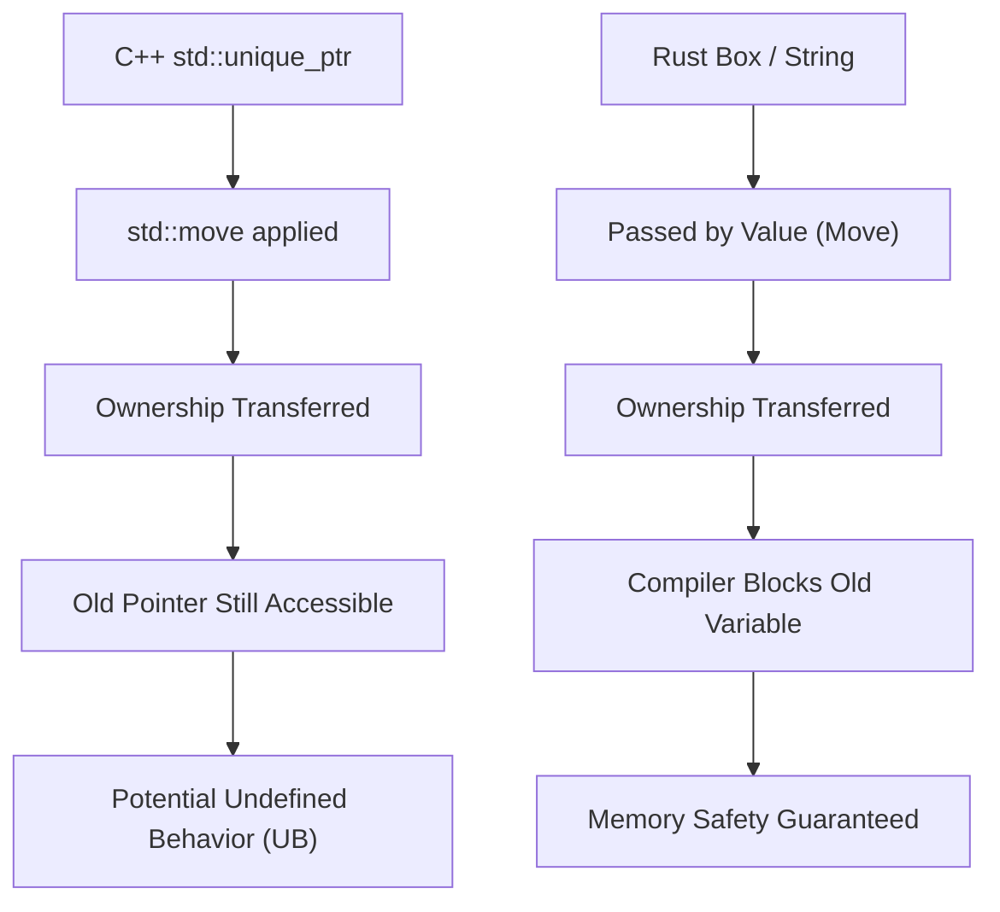
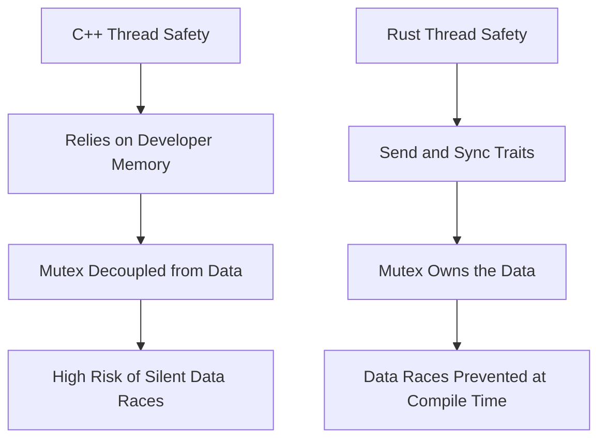
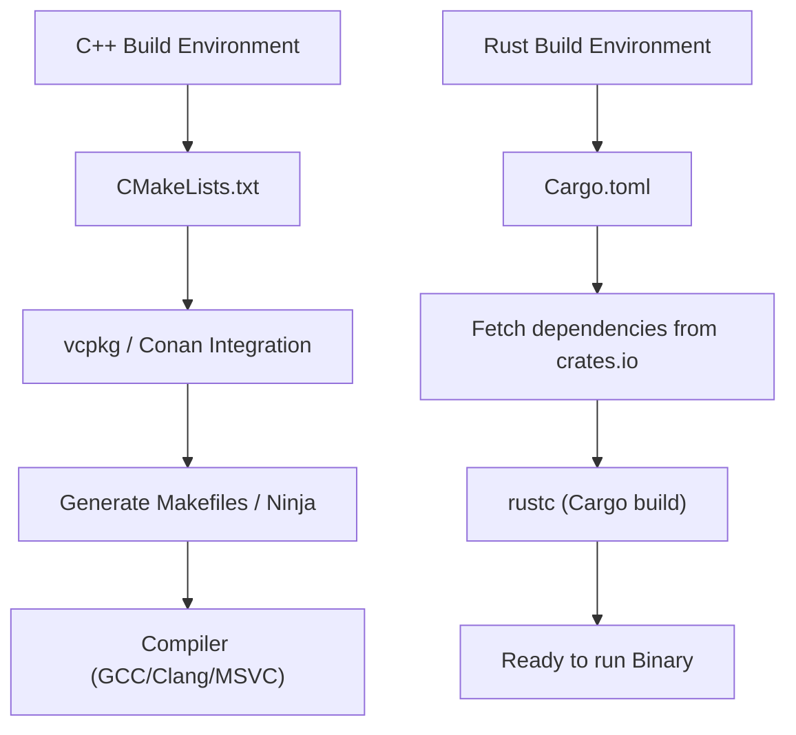

# はじめに：システムプログラミングの新たな夜明け

現代のソフトウェアエンジニアリングにおいて、C++とRustはシステムプログラミングの最前線に立つ二大巨頭です。長年にわたり、C++はオペレーティングシステム、組み込みデバイス、ゲームエンジン、高頻度取引（HFT）システムなど、ハードウェアの極限のパフォーマンスを引き出す領域において絶対的な王として君臨してきました。私自身もシニアC++エンジニアとして、C++98時代の生ポインタのジャングルから始まり、C++11によるモダン化の波（スマートポインタ、ラムダ式、`auto`の導入）、そしてC++14/17/20と続く仕様の巨大化に並走しながらコードを書き続けてきました。

しかし近年、C++が抱える構造的な課題—特に「メモリ安全性の欠如」によるセキュリティ脆弱性（CVEの約7割がメモリ起因と言われています）と、「果てしなく複雑化する仕様と未定義動作（UB）」—に対する解決策として、Rustが劇的な台頭を見せています。Linuxカーネルへの公式採用や、Microsoft、Google、AWSといった巨大テック企業による大規模なRustへの移行プロジェクトは、単なる一時的な流行ではなく、システムプログラミングのパラダイムシフトを意味しています。

本記事では、生粋のC++エンジニアが実際にRustを深く学び、実戦で利用して感じた「メリット」と「デメリット」を、言語仕様の根幹に関わる技術的な観点から徹底的に比較・解説します。

---

# 1. メモリ管理のパラダイムシフト：RAIIから所有権と借用へ

## C++のRAIIとスマートポインタの限界

C++の最も偉大な発明の一つが**RAII (Resource Acquisition Is Initialization)**です。コンストラクタでリソースを確保し、スコープを抜ける際にデストラクタで自動的に解放するというこの概念は、手動の`new`と`delete`によるメモリリークの恐怖から開発者を解放しました。C++11からは`std::unique_ptr`と`std::shared_ptr`が標準ライブラリに導入され、所有権（Ownership）の概念がコード上で表現可能になりました。

しかし、C++のスマートポインタとムーブセマンティクスには、コンパイラによる静的な検証が不完全であるという致命的な弱点があります。

```cpp
#include <iostream>
#include <memory>
#include <string>

void consume(std::unique_ptr<std::string> ptr) {
    std::cout << "Consuming: " << *ptr << std::endl;
}

int main() {
    auto my_ptr = std::make_unique<std::string>("Hello, C++");
    
    // 所有権を関数に移動（ムーブ）する
    consume(std::move(my_ptr));
    
    // 危険: C++ではムーブ後のオブジェクトへのアクセスがコンパイルエラーにならない
    // std::moveは単なる右辺値参照(T&&)へのキャストであり、コンパイラは使用をブロックしない
    if (my_ptr) {
        std::cout << "Pointer is still valid?" << std::endl;
    } else {
        std::cout << "Pointer is null." << std::endl;
    }
    
    // std::cout << *my_ptr << std::endl; // 解放後メモリ使用（Use-After-Free）による未定義動作
    return 0;
}
```

C++では、`std::move`によって中身が空になった（有効だが未規定の状態の）オブジェクトに対して、誤ってアクセスしてしまうリスクが常に存在します。実行時のクラッシュや、最悪の場合はセキュリティホールに直結します。

## Rustの所有権（Ownership）とボローチェッカーの絶対的防御

Rustは、この「所有権」という概念を言語のコア設計に組み込み、**ボローチェッカー（Borrow Checker）**と呼ばれるコンパイラの機能によって厳密な静的解析を行います。

```rust
fn consume(s: String) {
    println!("Consuming: {}", s);
} // ここで s がスコープを抜け、メモリが解放(Drop)される

fn main() {
    let my_string = String::from("Hello, Rust");
    
    // 所有権を関数にムーブする。Rustではデフォルトがムーブセマンティクス。
    consume(my_string);
    
    // コンパイルエラー！ムーブされた後の変数には絶対にアクセスできない
    // println!("Is it still there? {}", my_string);
}
```

Rustでは、変数の所有権が移動した時点で、元の変数はコンパイラによって「未初期化」状態と同等に扱われ、以降のアクセスを完全に遮断します。これにより、「Use-After-Free（解放後メモリ使用）」や「Dangling Pointer（ダングリングポインタ）」といったバグは、理論上コンパイルを通過することができません。



## 借用（Borrowing）と可変性の制御

さらに強力なのが、リソースを参照する「借用（Borrowing）」のルールです。Rustでは以下のルールが強制されます：
1. 任意のタイミングにおいて、「複数の不変参照（`&T`）」または「単一の可変参照（`&mut T`）」の**どちらか一方のみ**が存在できる。
2. 参照は、元のデータのスコープよりも長生きしてはならない（ライフタイムの制約）。

C++では、同じオブジェクトに対して複数のミュータブル（可変）な参照やポインタを簡単に作成でき、それが予期せぬ状態の破壊（イテレータの無効化など）を引き起こします。Rustはこの「エイリアシング（Aliasing）＋ミュータビリティ（Mutability）」の組み合わせを言語レベルで禁止することで、バグを未然に防ぎます。

---

# 2. メモリレイアウトとスマートポインタの数学的オーバーヘッド

システムプログラミングにおいて、メモリレイアウトの正確な理解は不可欠です。C++の`std::shared_ptr`とRustの`std::rc::Rc` / `std::sync::Arc`を比較してみましょう。

C++の`std::shared_ptr`は参照カウントによってリソースを管理しますが、デフォルトでスレッドセーフなアトミック演算（`std::atomic`）を用いて参照カウントを増減させます。そのメモリ上のオーバーヘッドは次のように定式化できます。

$$ Overhead_{C++} = sizeof(T) + sizeof(ControlBlock) $$

ここで、$ControlBlock$ には「強参照カウンタ（Strong Ref Count）」、「弱参照カウンタ（Weak Ref Count）」、および「カスタムデリータ（Custom Deleter）」が含まれます。問題は、シングルスレッドでしか使わない場面でも、アトミック命令のオーバーヘッド（キャッシュラインのロック等）が無条件で発生してしまう点です。

対照的に、Rustは用途に応じてスマートポインタを厳密に分離しています。

- **シングルスレッド用**: `Rc<T>` (Reference Counted)
- **マルチスレッド用**: `Arc<T>` (Atomic Reference Counted)

$$ Overhead_{Rc} = sizeof(T) + 2 \times sizeof(usize) $$
$$ Overhead_{Arc} = sizeof(T) + 2 \times sizeof(AtomicUsize) $$

Rustでは、シングルスレッド専用の`Rc<T>`を使えば、アトミック演算のペナルティを完全に回避（ゼロコスト抽象化）できます。そして、後述するスレッドセーフティの仕組みにより、`Rc<T>`を誤って別スレッドに渡すことは型システムによって完全に防がれます。

---

# 3. スレッドセーフティ："Fearless Concurrency" の衝撃

C++におけるマルチスレッドプログラミングは、常にデータレースとデッドロックの恐怖と隣り合わせでした。

## C++のミューテックスとデータの分離の危険性

C++の`std::mutex`は、あくまで「特定のコードブロック（クリティカルセクション）」を排他制御するものであり、「保護すべきデータ」と「ミューテックス」の間に言語的な結びつきがありません。

```cpp
#include <iostream>
#include <thread>
#include <mutex>
#include <vector>

std::vector<int> shared_data;
std::mutex mtx;

void worker() {
    // 開発者がロックを取得し忘れても、コンパイルは普通に通ってしまう
    // std::lock_guard<std::mutex> lock(mtx);
    shared_data.push_back(1); // 致命的なデータレース！
}

int main() {
    std::thread t1(worker);
    std::thread t2(worker);
    t1.join();
    t2.join();
    return 0;
}
```

## RustのMutexはデータを「所有」する

Rustでは、`Mutex<T>`はジェネリクスを用いて保護対象のデータ型 `T` を**内包（所有）**します。データにアクセスするためには、必ず`lock()`を呼び出してガードオブジェクトを取得する必要があります。ロックを取得せずにデータに触ることは、文法的に不可能です。

```rust
use std::sync::{Arc, Mutex};
use std::thread;

fn main() {
    // データはMutexの中に完全にカプセル化される
    let shared_data = Arc::new(Mutex::new(Vec::new()));
    let mut handles = vec![];

    for _ in 0..2 {
        // スレッド間で共有するためにArc(スレッドセーフな参照カウント)をクローン
        let data_clone = Arc::clone(&shared_data);
        let handle = thread::spawn(move || {
            // ロックを取得しなければ、内部のVecにアクセスできない
            let mut data = data_clone.lock().unwrap();
            data.push(1);
        });
        handles.push(handle);
    }

    for handle in handles {
        handle.join().unwrap();
    }
}
```

さらにRustには、並行処理の安全性を担保する2つのコアトレイトが存在します。
- `Send`: スレッド間で所有権を安全に転送できる型
- `Sync`: 複数のスレッドから同時に参照しても安全な型

例えば、非スレッドセーフな`Rc<T>`は`Send`トレイトを実装していません。そのため、`thread::spawn`に渡そうとすると即座にコンパイルエラーになります。この「Fearless Concurrency（恐れなき並行処理）」により、開発者はバグの恐怖から解放され、よりアグレッシブに並列化を推し進めることができます。

アムダールの法則（Amdahl's Law）によれば、並列化可能な部分 $P$ と並列度 $N$ における理論上の最大スループットは次のように表されます。

$$ S(N) = \frac{1}{(1 - P) + \frac{P}{N}} $$

Rustは、この $P$ を最大化するためのリファクタリングを、型システムを頼りに極めて安全に行うことを可能にします。



---

# 4. エラーハンドリング：例外 vs 代数的データ型

C++のエラーハンドリングの標準は「例外（Exceptions）」です。しかし、例外は制御フローを不透明にし、パフォーマンス上のペナルティ（スタックアンワインディングやRTTIの肥大化）を引き起こします。組み込みシステムやゲームエンジンでは、例外を完全に無効化（`-fno-exceptions`）して、古典的なエラーコードを返す設計を採用することが多々あります。C++23では`std::expected`が導入されましたが、エコシステム全体への浸透には時間がかかるでしょう。

Rustには例外という概念が存在しません。エラーは純粋な「値」として返され、`Result<T, E>` という列挙型（代数的データ型）で表現されます。

```rust
use std::fs::File;
use std::io::{self, Read};

// 戻り値の型を見るだけで、IOエラーが発生し得ることが明確
fn read_file_content(path: &str) -> Result<String, io::Error> {
    // ? 演算子でエラーなら即座に早期リターン、成功なら中身を取り出す
    let mut file = File::open(path)?; 
    let mut content = String::new();
    file.read_to_string(&mut content)?;
    Ok(content)
}
```

この `?` 演算子は革命的です。C++でエラーコードをチェックする際に生じる深いネスト（if文のピラミッド）を排除し、例外のようなクリーンなコードフローを保ちながら、どの関数呼び出しでエラーが伝播するかを明示的に記述できます。

---

# 5. ポリモーフィズム：仮想関数・テンプレートからトレイトへ

C++のポリモーフィズムは、主にクラスの継承と仮想関数（`virtual`）による動的ディスパッチ、またはテンプレートによる静的ディスパッチ（CRTPなど）で実現されます。

動的ディスパッチでは、オブジェクトに仮想関数テーブル（vtable）へのポインタ（vptr）が埋め込まれ、関数呼び出し時にポインタの解決オーバーヘッドが発生します。

$$ T_{dispatch} = T_{lookup\_in\_vtable} + T_{dereference} $$

Rustは古典的なオブジェクト指向の「クラス継承」を切り捨て、代わりに「**トレイト（Traits）**」という概念を採用しました（C++20のConceptに似ていますが、より多機能です）。

```rust
trait Drawable {
    fn draw(&self);
}

struct Circle { radius: f64 }
impl Drawable for Circle {
    fn draw(&self) { println!("Drawing a Circle of radius {}", self.radius); }
}

// 静的ディスパッチ (単相化・ゼロオーバーヘッド)
fn draw_static<T: Drawable>(item: &T) {
    item.draw();
}

// 動的ディスパッチ (トレイトオブジェクト)
fn draw_dynamic(item: &dyn Drawable) {
    item.draw();
}
```

Rustの動的ディスパッチ（`dyn Trait`）の最大の特徴は、データ構造内にvptrを持たず、**ファットポインタ（Fat Pointer）**を使用する点です。ファットポインタは「データへのポインタ」と「vtableへのポインタ」をペアで保持します。これにより、外部のライブラリで定義された型に対して、後からトレイトを実装（拡張）して動的ディスパッチにかけることが非常に容易になっています。

---

# 6. パッケージ管理とビルドシステム：CMakeの苦悩とCargoの恩恵

C++の最大の弱点の一つが、標準パッケージマネージャの不在です。`CMakeLists.txt`の難解な文法、`find_package`による依存関係解決の複雑さ、OSごとのライブラリパスの違いは、C++エンジニアの膨大な時間を奪い続けてきました。

Rustには、**Cargo** という世界最高峰のパッケージマネージャ兼ビルドシステムが標準搭載されています。



`Cargo.toml` に依存ライブラリ（クレート）の名前とバージョンを1行追記するだけで、推移的依存関係の解決、ダウンロード、ビルドまでを全自動で行ってくれます。さらに、テスト（`cargo test`）、ドキュメント生成（`cargo doc`）、静的解析（`cargo clippy`）、フォーマッタ（`cargo fmt`）など、開発に必要なツールチェーンが全てこのコマンド一つに統合されています。この快適さは、一度味わうとC++のビルド環境には戻りたくなくなるほどの破壊力を持っています。

---

# 7. Rustを学ぶ上でのデメリットと学習曲線

ここまでRustの長所を語りましたが、C++エンジニアがRustを実戦投入するにあたって直面する「壁」やデメリットも確実に存在します。

## 1. 苛烈なボローチェッカーとの格闘
C++で「何となく生のポインタで繋いでいた」データ構造（例えば双方向リンクリストや、グラフ構造、自己参照構造体など）をRustでそのまま実装しようとすると、所有権とライフタイムの制約によりコンパイルが通りません。ボローチェッカーを満足させるためには、`Rc<RefCell<T>>` のような複雑なラップを行うか、アリーナアロケータやインデックスベースの管理に設計を根本から見直す必要があります。

## 2. コンパイル時間の長さ
C++もテンプレートのネストによってコンパイルが遅くなりますが、Rustのコンパイル時間（特にゼロからのクリーンビルド）も決して短くありません。LLVMの強力な最適化パス、マクロの展開、ジェネリクスの単相化（モノモルフィゼーション）が重なるため、大規模プロジェクトではビルド時間がボトルネックになります。開発中は `cargo check` を多用するなどの工夫が必須です。

## 3. C++コードベースとの相互運用性
C言語（FFI）との連携は非常にスムーズですが、既存の巨大なC++コードベース（クラス、テンプレート、仮想関数を多用しているもの）とRustを直接連携させるのは非常に困難です。近年は `cxx` や `autocxx` といったブリッジツールが進化していますが、完全なシームレスな移行にはまだ高いハードルがあります。

---

# まとめ：私たちはRustへ移行すべきか？

C++は今後もゲームエンジン開発や、既存の巨大なインフラストラクチャにおいて重要な役割を担い続けるでしょう。C++20/23による近代化も目覚ましく、より安全に書けるようになってきています。

しかし、「新規に立ち上げるシステムプログラミングのプロジェクト」において、私はもはや**Rustを選択しない理由を見つける方が難しい**と感じています。コンパイルさえ通れば、未定義動作やメモリ破壊の恐怖から解放され、高いパフォーマンスで安全に並行処理を行えるという Rust の「確実性」は、エンジニアのメンタルモデルを劇的に改善します。

C++エンジニアにとって、Rustの学習は単に新しいシンタックスを覚えることではなく、「メモリとスレッドの安全な管理方法」に対する新たな視座を得る最高の体験です。ぜひ皆さんも、Cargoの快適さとボローチェッカーの厳しさを体感してみてください。
