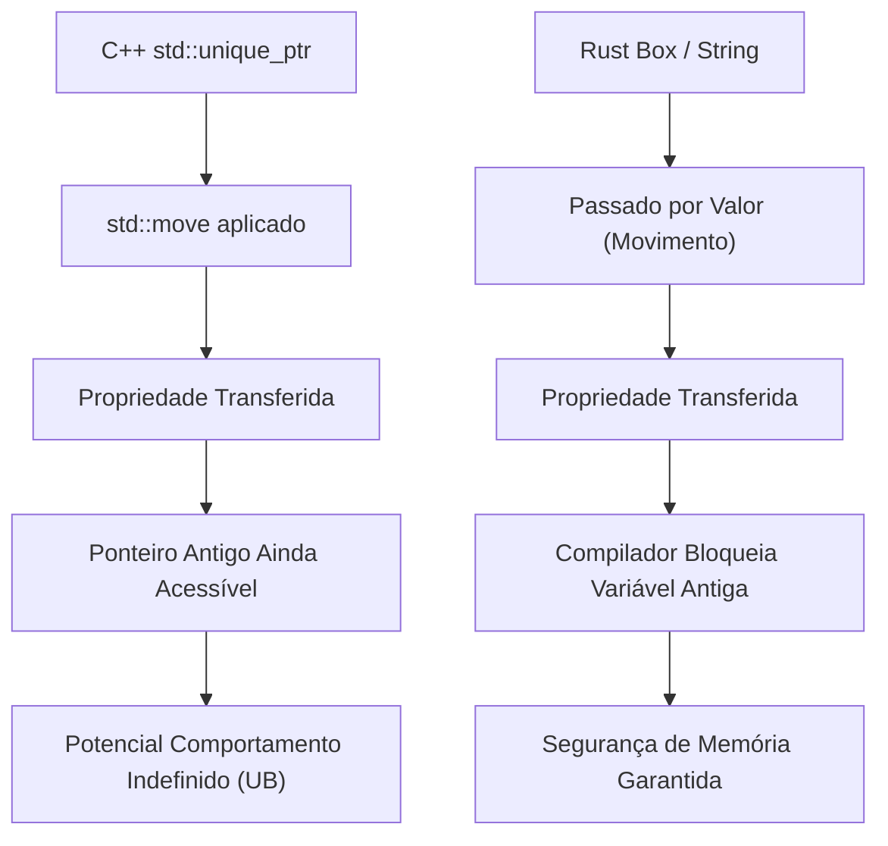
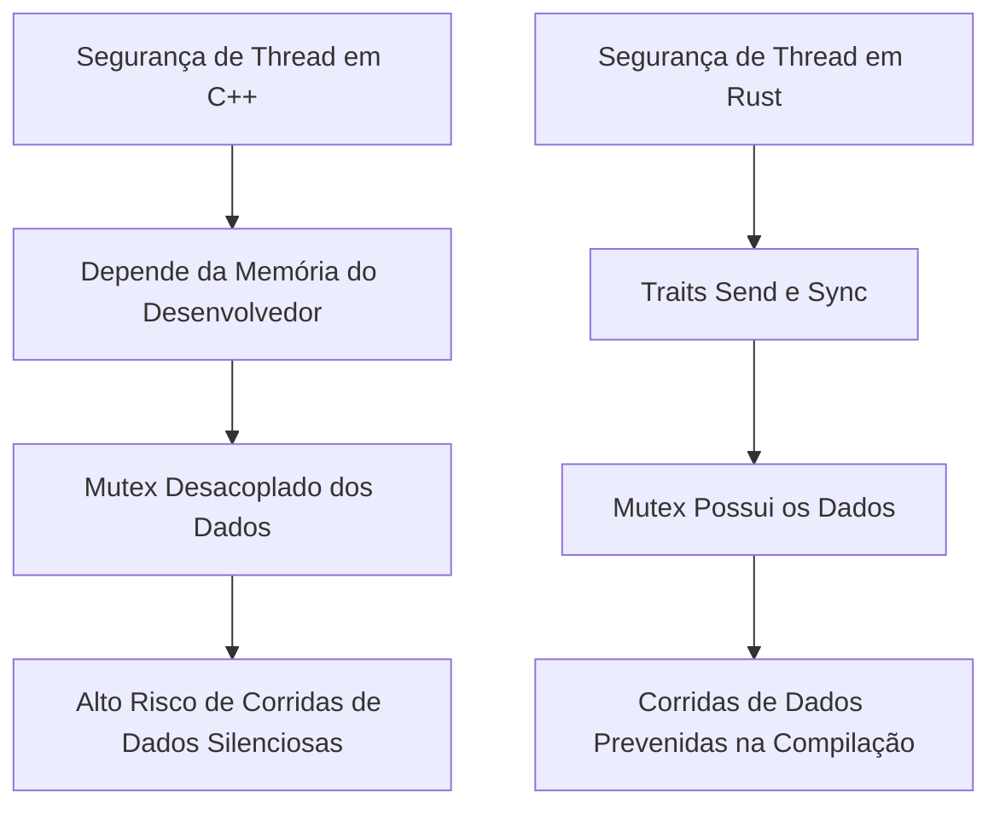
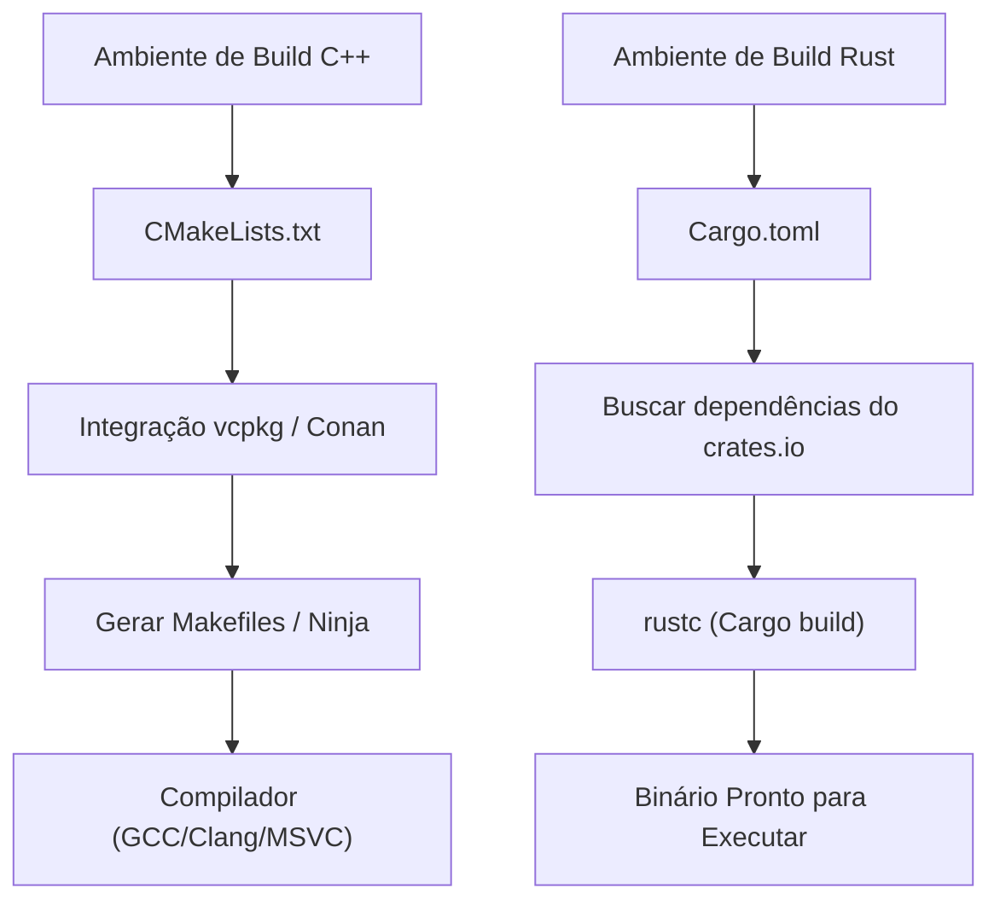

# Introdução: Um Novo Amanhecer na Programação de Sistemas

Na engenharia de software moderna, C++ e Rust são os dois gigantes na vanguarda da programação de sistemas. Por muitos anos, C++ reinou como o rei absoluto em áreas que extraem o máximo de desempenho do hardware, como sistemas operacionais, dispositivos embarcados, motores de jogos e sistemas de negociação de alta frequência (HFT). Eu mesmo, como engenheiro C++ sênior, comecei na selva de ponteiros brutos da era C++98, acompanhei a onda de modernização do C++11 (introdução de ponteiros inteligentes, expressões lambda, `auto`) e continuei escrevendo código enquanto a especificação crescia massivamente com C++14/17/20.

No entanto, nos últimos anos, Rust tem mostrado uma ascensão dramática como solução para os problemas estruturais que o C++ enfrenta — especialmente vulnerabilidades de segurança devido à "falta de segurança de memória" (diz-se que cerca de 70% das CVEs são relacionadas à memória) e "especificações infinitamente complexas e comportamentos indefinidos (UB)". Sua adoção oficial no kernel do Linux e projetos de migração em larga escala para Rust por gigantes da tecnologia como Microsoft, Google e AWS não são apenas uma tendência passageira, mas representam uma mudança de paradigma na programação de sistemas.

Neste artigo, compararei e explicarei detalhadamente as "vantagens" e "desvantagens" que eu, um engenheiro C++ puro-sangue, senti ao aprender profundamente o Rust e utilizá-lo na prática, a partir de uma perspectiva técnica que afeta o núcleo das especificações da linguagem.

---

# 1. Mudança de Paradigma no Gerenciamento de Memória: De RAII para Ownership e Borrowing

## RAII do C++ e os Limites dos Ponteiros Inteligentes

Uma das maiores invenções do C++ é o **RAII (Resource Acquisition Is Initialization)**. O conceito de alocar recursos no construtor e liberá-los automaticamente no destrutor ao sair do escopo libertou os desenvolvedores do terror dos vazamentos de memória causados pelo uso manual de `new` e `delete`. A partir do C++11, `std::unique_ptr` e `std::shared_ptr` foram introduzidos na biblioteca padrão, tornando possível expressar o conceito de propriedade (Ownership) no código.

Porém, os ponteiros inteligentes e a semântica de movimento (move semantics) do C++ têm uma fraqueza fatal: a verificação estática pelo compilador é incompleta.

```cpp
#include <iostream>
#include <memory>
#include <string>

void consume(std::unique_ptr<std::string> ptr) {
    std::cout << "Consuming: " << *ptr << std::endl;
}

int main() {
    auto my_ptr = std::make_unique<std::string>("Hello, C++");
    
    // Move a propriedade para a função
    consume(std::move(my_ptr));
    
    // Perigo: Em C++, o acesso a um objeto após o movimento não gera erro de compilação
    // std::move é apenas um cast para uma referência rvalue (T&&), o compilador não bloqueia o uso
    if (my_ptr) {
        std::cout << "Pointer is still valid?" << std::endl;
    } else {
        std::cout << "Pointer is null." << std::endl;
    }
    
    // std::cout << *my_ptr << std::endl; // Comportamento indefinido por uso da memória após liberação (Use-After-Free)
    return 0;
}
```

No C++, sempre há o risco de acessar acidentalmente um objeto que foi esvaziado (em um estado válido, mas não especificado) pelo `std::move`. Isso leva a travamentos em tempo de execução ou, no pior dos casos, a brechas de segurança.

## Ownership do Rust e a Defesa Absoluta do Borrow Checker

O Rust incorpora esse conceito de "propriedade" (Ownership) no design central da linguagem e realiza uma análise estática rigorosa usando um recurso do compilador chamado **Borrow Checker** (Verificador de Empréstimos).

```rust
fn consume(s: String) {
    println!("Consuming: {}", s);
} // Aqui s sai do escopo e a memória é liberada (Drop)

fn main() {
    let my_string = String::from("Hello, Rust");
    
    // Move a propriedade para a função. No Rust, o padrão é a semântica de movimento.
    consume(my_string);
    
    // Erro de compilação! É absolutamente impossível acessar a variável após ser movida
    // println!("Is it still there? {}", my_string);
}
```

No Rust, no momento em que a propriedade de uma variável é movida, a variável original é tratada pelo compilador de forma equivalente a um estado "não inicializado", bloqueando completamente qualquer acesso subsequente. Com isso, bugs como "Use-After-Free" (Uso após liberação) e "Dangling Pointer" (Ponteiro pendente) não conseguem passar pela compilação, teoricamente.



## Empréstimo (Borrowing) e Controle de Mutabilidade

Ainda mais poderosa é a regra de "Empréstimo" (Borrowing) para referenciar recursos. No Rust, as seguintes regras são impostas:
1. Em qualquer momento, pode existir **apenas uma** das seguintes opções: "múltiplas referências imutáveis (`&T`)" ou "uma única referência mutável (`&mut T`)".
2. As referências não devem viver mais do que o escopo dos dados originais (restrição de tempo de vida - lifetime).

No C++, é fácil criar vários ponteiros ou referências mutáveis para o mesmo objeto, o que pode causar corrupção de estado inesperada (como a invalidação de iteradores). O Rust evita esses bugs ao proibir a combinação de "Aliasing" (Múltiplas referências) + "Mutability" (Mutabilidade) em nível de linguagem.

---

# 2. Layout de Memória e Sobrecarga Matemática dos Ponteiros Inteligentes

Na programação de sistemas, um entendimento preciso do layout de memória é indispensável. Vamos comparar o `std::shared_ptr` do C++ e o `std::rc::Rc` / `std::sync::Arc` do Rust.

O `std::shared_ptr` do C++ gerencia recursos por contagem de referências, mas por padrão usa operações atômicas thread-safe (`std::atomic`) para incrementar e decrementar essa contagem. A sobrecarga na memória pode ser formulada da seguinte forma:

$$ Overhead_{C++} = sizeof(T) + sizeof(ControlBlock) $$

Aqui, o $ControlBlock$ inclui um "Contador de Referência Forte (Strong Ref Count)", um "Contador de Referência Fraca (Weak Ref Count)" e um "Deletor Customizado (Custom Deleter)". O problema é que, mesmo ao utilizá-lo em uma única thread (single-thread), a sobrecarga das instruções atômicas (como bloqueio de linha de cache) ocorre incondicionalmente.

Em contraste, o Rust separa estritamente os ponteiros inteligentes de acordo com o uso pretendido.

- **Para uso em Single-Thread**: `Rc<T>` (Reference Counted)
- **Para uso em Multi-Thread**: `Arc<T>` (Atomic Reference Counted)

$$ Overhead_{Rc} = sizeof(T) + 2 \times sizeof(usize) $$
$$ Overhead_{Arc} = sizeof(T) + 2 \times sizeof(AtomicUsize) $$

No Rust, se você usar `Rc<T>`, que é exclusivo para single-thread, poderá evitar completamente a penalidade de desempenho das operações atômicas (abstração de custo zero). Além disso, graças ao mecanismo de segurança de thread descrito abaixo, o sistema de tipos impede completamente que você passe acidentalmente um `Rc<T>` para outra thread.

---

# 3. Segurança de Threads: O Impacto da "Concorrência Sem Medo" (Fearless Concurrency)

A programação multi-thread em C++ sempre esteve lado a lado com o medo de corrida de dados (data races) e deadlocks.

## Mutex do C++ e o Perigo da Separação de Dados

O `std::mutex` do C++ serve apenas para controle exclusivo de um "bloco de código específico (seção crítica)", e não há ligação linguística entre os "dados a serem protegidos" e o "mutex".

```cpp
#include <iostream>
#include <thread>
#include <mutex>
#include <vector>

std::vector<int> shared_data;
std::mutex mtx;

void worker() {
    // Mesmo que o desenvolvedor esqueça de obter o lock, a compilação passa normalmente
    // std::lock_guard<std::mutex> lock(mtx);
    shared_data.push_back(1); // Corrida de dados fatal!
}

int main() {
    std::thread t1(worker);
    std::thread t2(worker);
    t1.join();
    t2.join();
    return 0;
}
```

## O Mutex do Rust "Possui" os Dados

No Rust, `Mutex<T>` encapsula (possui) o tipo de dado `T` que ele protege usando genéricos. Para acessar os dados, é obrigatório chamar `lock()` e obter um objeto guard (guarda). É sintaticamente impossível tocar nos dados sem obter o lock.

```rust
use std::sync::{Arc, Mutex};
use std::thread;

fn main() {
    // Os dados são completamente encapsulados dentro do Mutex
    let shared_data = Arc::new(Mutex::new(Vec::new()));
    let mut handles = vec![];

    for _ in 0..2 {
        // Clona o Arc (contagem de referência thread-safe) para compartilhar entre threads
        let data_clone = Arc::clone(&shared_data);
        let handle = thread::spawn(move || {
            // Não é possível acessar o Vec interno sem obter o lock
            let mut data = data_clone.lock().unwrap();
            data.push(1);
        });
        handles.push(handle);
    }

    for handle in handles {
        handle.join().unwrap();
    }
}
```

Além disso, o Rust possui duas Traits principais que garantem a segurança em processamento paralelo:
- `Send`: Tipos cuja propriedade pode ser transferida com segurança entre threads.
- `Sync`: Tipos que são seguros para serem referenciados simultaneamente a partir de múltiplas threads.

Por exemplo, `Rc<T>`, que não é thread-safe, não implementa a Trait `Send`. Portanto, se você tentar passá-lo para `thread::spawn`, receberá um erro de compilação imediato. Com esta "Fearless Concurrency" (Concorrência Sem Medo), os desenvolvedores são libertados do medo de bugs e podem impulsionar a paralelização de forma mais agressiva.

De acordo com a Lei de Amdahl (Amdahl's Law), o rendimento (throughput) máximo teórico para a porção paralelizável $P$ e o grau de paralelismo $N$ é expresso da seguinte forma:

$$ S(N) = \frac{1}{(1 - P) + \frac{P}{N}} $$

O Rust possibilita realizar refatorações para maximizar esse $P$ de forma extremamente segura, confiando no sistema de tipos.



---

# 4. Tratamento de Erros: Exceções vs. Tipos de Dados Algébricos

O padrão de tratamento de erros no C++ são as "Exceções" (Exceptions). No entanto, as exceções tornam o fluxo de controle opaco e causam penalidades de desempenho (stack unwinding e inflação de RTTI). Em sistemas embarcados ou motores de jogos, é muito comum desativar completamente as exceções (`-fno-exceptions`) e adotar um design que retorna códigos de erro clássicos. O `std::expected` foi introduzido no C++23, mas levará tempo para permear todo o ecossistema.

No Rust, o conceito de exceções não existe. Erros são retornados como "valores" puros, representados por uma enumeração (tipo de dados algébricos) chamada `Result<T, E>`.

```rust
use std::fs::File;
use std::io::{self, Read};

// Só de olhar para o tipo de retorno, fica claro que pode ocorrer um erro de IO
fn read_file_content(path: &str) -> Result<String, io::Error> {
    // Com o operador ?, retorna o erro antecipadamente ou extrai o valor em caso de sucesso
    let mut file = File::open(path)?; 
    let mut content = String::new();
    file.read_to_string(&mut content)?;
    Ok(content)
}
```

Esse operador `?` é revolucionário. Ele elimina o aninhamento profundo (a pirâmide de ifs) que ocorre ao verificar códigos de erro no C++, mantendo um fluxo de código limpo como as exceções, e permite descrever explicitamente quais chamadas de função propagam erros.

---

# 5. Polimorfismo: De Funções Virtuais e Templates a Traits

O polimorfismo no C++ é implementado principalmente por meio de herança de classes e despacho dinâmico (dynamic dispatch) com funções virtuais (`virtual`), ou despacho estático usando templates (como CRTP).

No despacho dinâmico, um ponteiro (vptr) para uma tabela de funções virtuais (vtable) é embutido no objeto, gerando uma sobrecarga de resolução do ponteiro durante a chamada da função.

$$ T_{dispatch} = T_{lookup\_in\_vtable} + T_{dereference} $$

O Rust descartou a "herança de classes" orientada a objetos clássica e adotou o conceito de "**Traits**" (semelhante ao Concept do C++20, mas com mais funcionalidades).

```rust
trait Drawable {
    fn draw(&self);
}

struct Circle { radius: f64 }
impl Drawable for Circle {
    fn draw(&self) { println!("Drawing a Circle of radius {}", self.radius); }
}

// Despacho estático (Monomorfização / Sobrecarga zero)
fn draw_static<T: Drawable>(item: &T) {
    item.draw();
}

// Despacho dinâmico (Trait Object)
fn draw_dynamic(item: &dyn Drawable) {
    item.draw();
}
```

A maior característica do despacho dinâmico do Rust (`dyn Trait`) é que ele não possui um vptr dentro da estrutura de dados, mas usa um **Fat Pointer** (Ponteiro Gordo). O Fat Pointer armazena um par: um "ponteiro para os dados" e um "ponteiro para a vtable". Isso torna extremamente fácil implementar (estender) Traits posteriormente para tipos definidos em bibliotecas externas e aplicar o despacho dinâmico a eles.

---

# 6. Gerenciamento de Pacotes e Sistema de Build: A Agonia do CMake e a Bênção do Cargo

Uma das maiores fraquezas do C++ é a ausência de um gerenciador de pacotes padrão. A sintaxe obscura do `CMakeLists.txt`, a complexidade da resolução de dependências com `find_package` e as diferenças nos caminhos de bibliotecas por sistema operacional continuam roubando uma quantidade enorme de tempo dos engenheiros C++.

O Rust vem nativamente com o **Cargo**, um gerenciador de pacotes e sistema de build de classe mundial.



Apenas adicionando uma linha com o nome e a versão da biblioteca de dependência (crate) no `Cargo.toml`, ele cuida automaticamente de toda a resolução transitiva de dependências, download e compilação. Além disso, as ferramentas necessárias para o desenvolvimento, como testes (`cargo test`), geração de documentação (`cargo doc`), análise estática (`cargo clippy`) e formatador (`cargo fmt`), estão todas integradas neste único comando. Esse conforto, uma vez experimentado, possui um poder destrutivo que faz com que você nunca mais queira voltar para o ambiente de build do C++.

---

# 7. Desvantagens e Curva de Aprendizado ao Aprender Rust

Até agora discuti as vantagens do Rust, mas certamente existem "muros" e desvantagens que um engenheiro C++ enfrentará ao tentar colocar o Rust em uso prático.

## 1. A Batalha Feroz com o Borrow Checker
Se você tentar implementar estruturas de dados diretamente em Rust (como listas duplamente encadeadas, estruturas de grafos ou structs auto-referenciadas) que em C++ você conectava casualmente usando ponteiros brutos, a compilação falhará devido às restrições de propriedade e tempo de vida. Para satisfazer o Borrow Checker, você precisará usar invólucros complexos como `Rc<RefCell<T>>`, ou repensar o design de forma fundamental para usar Arena Allocators ou gerenciamento baseado em índices.

## 2. Longo Tempo de Compilação
Embora o C++ também fique lento ao compilar devido ao aninhamento de templates, o tempo de compilação do Rust (especialmente em um clean build a partir do zero) também não é curto. Como ele acumula os poderosos passes de otimização do LLVM, a expansão de macros e a monomorfização (monomorphization) de genéricos, o tempo de build se torna um gargalo em projetos de grande escala. Durante o desenvolvimento, é essencial adotar estratégias como o uso intensivo do `cargo check`.

## 3. Interoperabilidade com Bases de Código C++
Embora a integração com a linguagem C (FFI) seja muito tranquila, vincular o Rust diretamente a bases de código C++ já existentes e massivas (que fazem uso pesado de classes, templates e funções virtuais) é extremamente difícil. Ferramentas de ponte como `cxx` e `autocxx` evoluíram nos últimos anos, mas ainda há uma grande barreira para uma transição perfeitamente contínua.

---

# Conclusão: Devemos Migrar para o Rust?

O C++ continuará desempenhando um papel importante no desenvolvimento de motores de jogos e nas infraestruturas massivas existentes no futuro. Sua modernização por meio do C++20/23 tem sido notável, permitindo escrever de forma mais segura.

No entanto, em um "novo projeto de programação de sistemas a ser iniciado", acho que agora é **mais difícil encontrar um motivo para não escolher o Rust**. A "certeza" do Rust — que, desde que compile, você estará livre do medo de comportamentos indefinidos e corrupção de memória, e poderá executar processamento paralelo de forma segura com alto desempenho — melhora drasticamente o modelo mental dos engenheiros.

Para um engenheiro C++, aprender Rust não é apenas memorizar uma nova sintaxe, mas é a melhor experiência para obter uma nova perspectiva sobre "o método de gerenciamento seguro de memória e threads". Convido todos a experimentarem o conforto do Cargo e o rigor do Borrow Checker.
