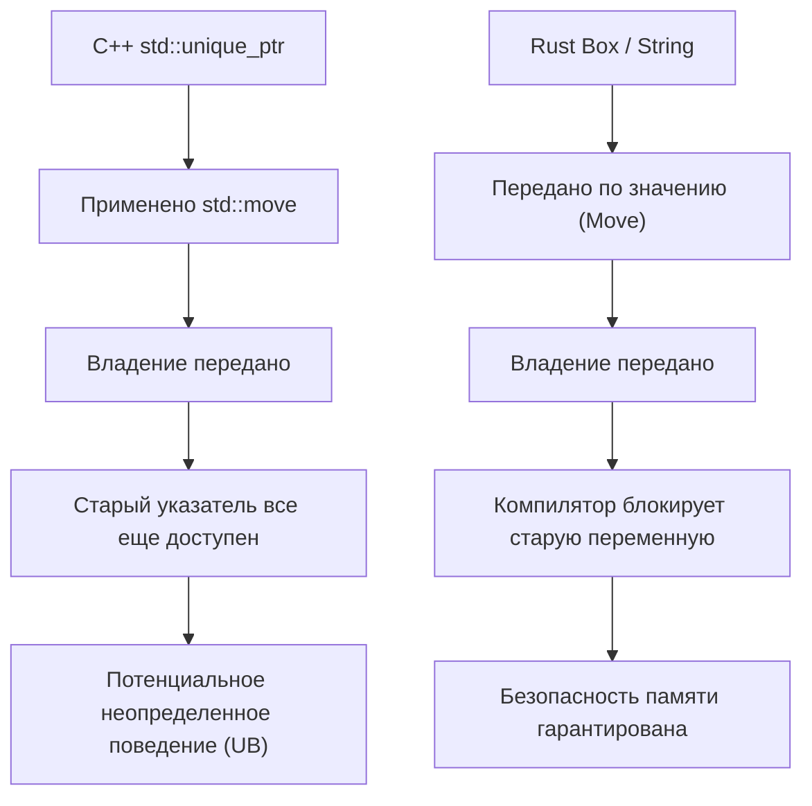
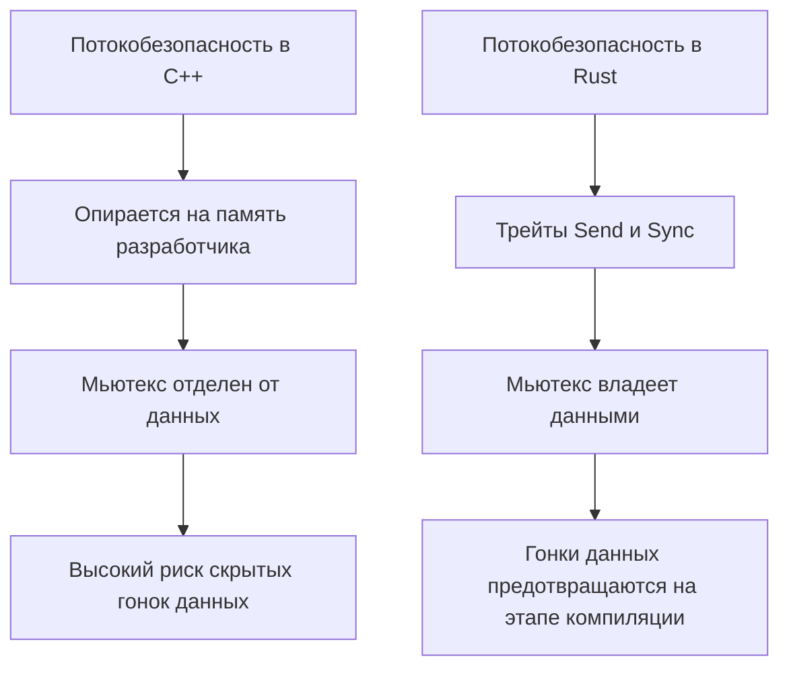
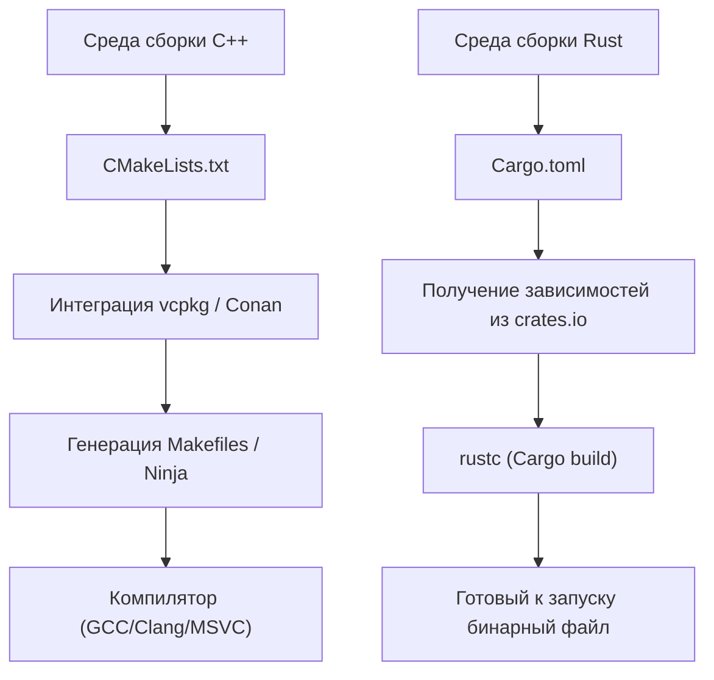

# Введение: Новый рассвет системного программирования

В современной программной инженерии C++ и Rust являются двумя гигантами, стоящими на передовой системного программирования. На протяжении многих лет C++ безраздельно властвовал в областях, требующих максимальной производительности от аппаратного обеспечения: в операционных системах, встраиваемых устройствах, игровых движках и системах высокочастотного трейдинга (HFT). Я сам, будучи Senior C++ разработчиком, начинал писать код еще в джунглях сырых указателей эпохи C++98, прошел через волну модернизации C++11 (внедрение умных указателей, лямбда-выражений, `auto`) и продолжал работать бок о бок с непрерывным разрастанием спецификаций в C++14/17/20.

Однако в последние годы Rust продемонстрировал впечатляющий взлет, предлагая решения структурных проблем C++ — в первую очередь, уязвимостей безопасности, вызванных "отсутствием безопасности памяти" (считается, что около 70% CVE связаны с памятью), а также "бесконечно усложняющихся спецификаций и неопределенного поведения (UB)". Официальное внедрение Rust в ядро Linux и масштабные проекты по переходу на него в таких технологических гигантах, как Microsoft, Google и AWS, — это не просто временное увлечение, а сдвиг парадигмы в системном программировании.

В этой статье я, как истинный C++ инженер, глубоко изучивший Rust и применивший его на практике, подробно сравню и объясню его "плюсы" и "минусы" с технической точки зрения, касающейся самых основ спецификации языка.

---

# 1. Сдвиг парадигмы управления памятью: от RAII к владению и заимствованию

## RAII в C++ и ограничения умных указателей

Одним из величайших изобретений C++ является **RAII (Resource Acquisition Is Initialization)**. Эта концепция захвата ресурсов в конструкторе и автоматического их освобождения в деструкторе при выходе из области видимости избавила разработчиков от страха утечек памяти, связанных с ручным использованием `new` и `delete`. Начиная с C++11, в стандартную библиотеку были добавлены `std::unique_ptr` и `std::shared_ptr`, что позволило выразить концепцию владения (Ownership) в коде.

Однако у умных указателей и семантики перемещения в C++ есть фатальный недостаток: статическая проверка компилятором несовершенна.

```cpp
#include <iostream>
#include <memory>
#include <string>

void consume(std::unique_ptr<std::string> ptr) {
    std::cout << "Consuming: " << *ptr << std::endl;
}

int main() {
    auto my_ptr = std::make_unique<std::string>("Hello, C++");
    
    // Передаем владение (перемещение) в функцию
    consume(std::move(my_ptr));
    
    // ОПАСНОСТЬ: В C++ обращение к объекту после перемещения не вызывает ошибки компиляции
    // std::move — это просто приведение к rvalue-ссылке (T&&), компилятор не блокирует использование
    if (my_ptr) {
        std::cout << "Pointer is still valid?" << std::endl;
    } else {
        std::cout << "Pointer is null." << std::endl;
    }
    
    // std::cout << *my_ptr << std::endl; // Неопределенное поведение из-за использования после освобождения (Use-After-Free)
    return 0;
}
```

В C++ всегда существует риск случайного обращения к объекту, опустошенному с помощью `std::move` (находящемуся в валидном, но неопределенном состоянии). Это может привести к сбоям во время выполнения или, в худшем случае, прямо к уязвимостям безопасности.

## Владение (Ownership) в Rust и абсолютная защита Borrow Checker

Rust интегрирует эту концепцию "владения" в самый костяк языка, выполняя строгий статический анализ с помощью функции компилятора, называемой **Borrow Checker (Анализатор заимствований)**.

```rust
fn consume(s: String) {
    println!("Consuming: {}", s);
} // Здесь s выходит из области видимости, и память освобождается (Drop)

fn main() {
    let my_string = String::from("Hello, Rust");
    
    // Передаем владение (перемещение) в функцию. В Rust семантика перемещения используется по умолчанию.
    consume(my_string);
    
    // Ошибка компиляции! Обращение к переменной после перемещения абсолютно невозможно
    // println!("Is it still there? {}", my_string);
}
```

В Rust, как только владение переменной перемещается, компилятор рассматривает исходную переменную как "неинициализированную" и полностью блокирует последующие обращения к ней. Благодаря этому ошибки типа "Use-After-Free" (использование после освобождения) и "Dangling Pointer" (висячий указатель) теоретически не могут пройти компиляцию.



## Заимствование (Borrowing) и контроль мутабельности

Еще более мощным инструментом являются правила "Заимствования" (Borrowing) при обращении к ресурсам по ссылке. В Rust соблюдаются следующие строгие правила:
1. В любой момент времени может существовать **только одно из двух**: либо "несколько неизменяемых ссылок (`&T`)", либо "одна изменяемая ссылка (`&mut T`)".
2. Ссылка не должна жить дольше, чем исходные данные (ограничения времени жизни - Lifetime).

В C++ можно легко создать несколько изменяемых (мутабельных) ссылок или указателей на один и тот же объект, что может привести к неожиданному повреждению состояния (например, инвалидации итераторов). Rust предотвращает подобные ошибки, запрещая комбинацию "алиасинга" (Aliasing) и "мутабельности" (Mutability) на уровне языка.

---

# 2. Структура памяти и математические накладные расходы умных указателей

В системном программировании точное понимание структуры памяти (memory layout) абсолютно необходимо. Давайте сравним `std::shared_ptr` в C++ с `std::rc::Rc` / `std::sync::Arc` в Rust.

`std::shared_ptr` в C++ управляет ресурсами с помощью подсчета ссылок, по умолчанию используя потокобезопасные атомарные операции (`std::atomic`) для увеличения и уменьшения счетчика. Накладные расходы на память можно формализовать следующим образом:

$$ Overhead_{C++} = sizeof(T) + sizeof(ControlBlock) $$

Здесь $ControlBlock$ содержит "счетчик сильных ссылок (Strong Ref Count)", "счетчик слабых ссылок (Weak Ref Count)" и "кастомный удалитель (Custom Deleter)". Проблема заключается в том, что даже при использовании только в одном потоке безоговорочно возникают накладные расходы от атомарных инструкций (блокировка кэш-линий и т.д.).

В отличие от этого, Rust строго разделяет умные указатели в зависимости от их предназначения:

- **Для одного потока**: `Rc<T>` (Reference Counted)
- **Для нескольких потоков**: `Arc<T>` (Atomic Reference Counted)

$$ Overhead_{Rc} = sizeof(T) + 2 \times sizeof(usize) $$
$$ Overhead_{Arc} = sizeof(T) + 2 \times sizeof(AtomicUsize) $$

В Rust использование `Rc<T>`, предназначенного исключительно для одного потока, позволяет полностью избежать штрафов за атомарные вычисления (абстракция с нулевой стоимостью). При этом благодаря механизмам потокобезопасности, описанным ниже, система типов полностью предотвращает случайную передачу `Rc<T>` в другой поток.

---

# 3. Потокобезопасность: Потрясающий "Fearless Concurrency" (Бесстрашная многопоточность)

Многопоточное программирование в C++ всегда шло рука об руку со страхом перед гонками данных (data races) и взаимными блокировками (deadlocks).

## Опасность разделения мьютексов и данных в C++

В C++ `std::mutex` служит исключительно для эксклюзивного контроля над "определенным блоком кода (критической секцией)", и на уровне языка нет никакой связи между "защищаемыми данными" и самим "мьютексом".

```cpp
#include <iostream>
#include <thread>
#include <mutex>
#include <vector>

std::vector<int> shared_data;
std::mutex mtx;

void worker() {
    // Даже если разработчик забудет захватить блокировку, компиляция пройдет успешно
    // std::lock_guard<std::mutex> lock(mtx);
    shared_data.push_back(1); // Фатальная гонка данных!
}

int main() {
    std::thread t1(worker);
    std::thread t2(worker);
    t1.join();
    t2.join();
    return 0;
}
```

## Mutex в Rust "владеет" данными

В Rust `Mutex<T>` использует дженерики для **инкапсуляции (владения)** защищаемыми данными типа `T`. Чтобы получить доступ к данным, необходимо обязательно вызвать `lock()` и получить объект-защитник (guard). Синтаксически невозможно обратиться к данным без получения блокировки.

```rust
use std::sync::{Arc, Mutex};
use std::thread;

fn main() {
    // Данные полностью инкапсулированы внутри Mutex
    let shared_data = Arc::new(Mutex::new(Vec::new()));
    let mut handles = vec![];

    for _ in 0..2 {
        // Клонируем Arc (потокобезопасный подсчет ссылок) для совместного использования между потоками
        let data_clone = Arc::clone(&shared_data);
        let handle = thread::spawn(move || {
            // Без получения блокировки невозможно получить доступ к внутреннему Vec
            let mut data = data_clone.lock().unwrap();
            data.push(1);
        });
        handles.push(handle);
    }

    for handle in handles {
        handle.join().unwrap();
    }
}
```

Кроме того, в Rust существуют два основных типажа (traits), гарантирующих безопасность параллельных вычислений:
- `Send`: типы, владение которыми можно безопасно передавать между потоками.
- `Sync`: типы, к которым можно безопасно обращаться одновременно из нескольких потоков.

Например, непотокобезопасный `Rc<T>` не реализует трейт `Send`. Поэтому попытка передать его в `thread::spawn` немедленно вызовет ошибку компиляции. Благодаря этому "Fearless Concurrency" (бесстрашной многопоточности) разработчики избавляются от страха перед багами и могут более агрессивно внедрять распараллеливание.

Согласно закону Амдала (Amdahl's Law), теоретическая максимальная пропускная способность при доле параллельных вычислений $P$ и степени параллелизма $N$ выражается следующим образом:

$$ S(N) = \frac{1}{(1 - P) + \frac{P}{N}} $$

Rust позволяет предельно безопасно проводить рефакторинг для максимизации $P$, опираясь на систему типов.



---

# 4. Обработка ошибок: Исключения против алгебраических типов данных

Стандартом обработки ошибок в C++ являются "Исключения (Exceptions)". Однако исключения делают поток управления непрозрачным и вызывают падение производительности (раскрутка стека и раздувание RTTI). Во встраиваемых системах и игровых движках часто прибегают к полному отключению исключений (`-fno-exceptions`) и использованию классических кодов возврата ошибок. В C++23 был введен `std::expected`, но его внедрение во всю экосистему займет время.

В Rust концепция исключений отсутствует. Ошибки возвращаются как чистые "значения" и представляются перечислением (алгебраическим типом данных) `Result<T, E>`.

```rust
use std::fs::File;
use std::io::{self, Read};

// По одному лишь типу возвращаемого значения ясно, что может возникнуть ошибка ввода-вывода (IO error)
fn read_file_content(path: &str) -> Result<String, io::Error> {
    // Оператор ? осуществляет ранний возврат при ошибке, а в случае успеха извлекает содержимое
    let mut file = File::open(path)?; 
    let mut content = String::new();
    file.read_to_string(&mut content)?;
    Ok(content)
}
```

Этот оператор `?` поистине революционен. Он устраняет глубокую вложенность (пирамиды из `if`), возникающую в C++ при проверке кодов ошибок, сохраняя чистый поток управления, подобный исключениям, и при этом явно указывая, при вызове каких функций ошибка передается дальше.

---

# 5. Полиморфизм: от виртуальных функций и шаблонов к трейтам

Полиморфизм в C++ реализуется в основном за счет динамической диспетчеризации через наследование классов и виртуальные функции (`virtual`), либо статической диспетчеризации через шаблоны (например, CRTP).

При динамической диспетчеризации в объект встраивается указатель (vptr) на таблицу виртуальных функций (vtable), что создает накладные расходы на разрешение указателя во время вызова функции.

$$ T_{dispatch} = T_{lookup\_in\_vtable} + T_{dereference} $$

Rust отказался от классического объектно-ориентированного "наследования классов" в пользу концепции "**Трейтов (Traits)**" (похоже на Concepts в C++20, но более функционально).

```rust
trait Drawable {
    fn draw(&self);
}

struct Circle { radius: f64 }
impl Drawable for Circle {
    fn draw(&self) { println!("Drawing a Circle of radius {}", self.radius); }
}

// Статическая диспетчеризация (мономорфизация, нулевые накладные расходы)
fn draw_static<T: Drawable>(item: &T) {
    item.draw();
}

// Динамическая диспетчеризация (трейт-объект)
fn draw_dynamic(item: &dyn Drawable) {
    item.draw();
}
```

Главная особенность динамической диспетчеризации в Rust (`dyn Trait`) заключается в том, что вместо хранения vptr внутри структуры данных используются **Толстые указатели (Fat Pointers)**. Толстый указатель содержит пару: "указатель на данные" и "указатель на vtable". Это значительно упрощает реализацию (расширение) трейтов для типов, определенных во внешних библиотеках, с последующим использованием динамической диспетчеризации.

---

# 6. Управление пакетами и системы сборки: страдания с CMake и блага Cargo

Одна из главных слабостей C++ — отсутствие стандартного пакетного менеджера. Запутанный синтаксис `CMakeLists.txt`, сложность разрешения зависимостей через `find_package` и различия в путях к библиотекам в зависимости от ОС постоянно отнимают огромное количество времени у C++ инженеров.

В Rust по умолчанию включен **Cargo** — один из лучших в мире менеджеров пакетов и систем сборки.



Достаточно добавить всего одну строку с названием и версией библиотеки (крейта) в `Cargo.toml`, и транзитивное разрешение зависимостей, скачивание и сборка произойдут полностью автоматически. Более того, весь необходимый инструментарий для разработки — тестирование (`cargo test`), генерация документации (`cargo doc`), статический анализ (`cargo clippy`), форматирование (`cargo fmt`) — объединен в одной этой команде. Этот уровень комфорта обладает настолько разрушительной силой, что, познав его однажды, вам больше не захочется возвращаться к среде сборки C++.

---

# 7. Минусы и кривая обучения при изучении Rust

До сих пор я говорил о достоинствах Rust, но, безусловно, существуют "барьеры" и недостатки, с которыми столкнется C++ инженер при внедрении Rust в реальные проекты.

## 1. Ожесточенная борьба с Borrow Checker

Если вы попытаетесь в лоб реализовать на Rust структуры данных, которые в C++ вы "как-то связывали сырыми указателями" (например, двусвязные списки, графы или самоссылающиеся структуры), код не скомпилируется из-за ограничений владения и времени жизни. Чтобы удовлетворить Borrow Checker, придется либо использовать сложные обертки вроде `Rc<RefCell<T>>`, либо радикально пересмотреть архитектуру в пользу аренных аллокаторов или управления на основе индексов.

## 2. Длительное время компиляции

Компиляция C++ также замедляется из-за вложенности шаблонов, но и в Rust время компиляции (особенно чистой сборки с нуля) отнюдь не маленькое. Мощные проходы оптимизации LLVM, раскрытие макросов и мономорфизация дженериков накладываются друг на друга, превращая время сборки в узкое место в крупных проектах. Во время разработки необходимо прибегать к хитростям вроде частого использования `cargo check`.

## 3. Взаимодействие с кодовыми базами на C++

Взаимодействие с языком C (FFI) проходит очень гладко, однако прямая интеграция Rust с существующими гигантскими кодовыми базами C++ (активно использующими классы, шаблоны и виртуальные функции) крайне сложна. Хотя в последние годы такие инструменты-мосты, как `cxx` и `autocxx`, сильно эволюционировали, до полностью бесшовного перехода еще очень далеко.

---

# Заключение: Стоит ли нам переходить на Rust?

C++ продолжит играть важную роль в разработке игровых движков и огромных существующих инфраструктурах. Модернизация благодаря C++20/23 также впечатляет, и писать безопасный код становится проще.

Однако при "создании новых проектов в области системного программирования" мне теперь **гораздо сложнее найти причины НЕ выбирать Rust**. "Надежность" Rust — тот факт, что успешная компиляция освобождает от страха неопределенного поведения и повреждения памяти, позволяя безопасно выполнять параллельную обработку с высокой производительностью — радикально улучшает ментальную модель инженера.

Для C++ инженеров изучение Rust — это не просто запоминание нового синтаксиса, а лучший опыт обретения новой перспективы на "безопасные методы управления памятью и потоками". Обязательно попробуйте сами ощутить комфорт Cargo и строгость Borrow Checker.
