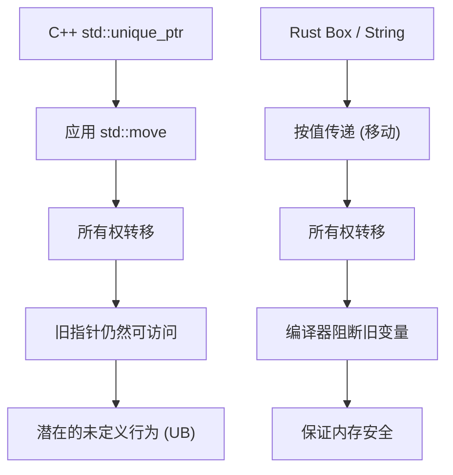
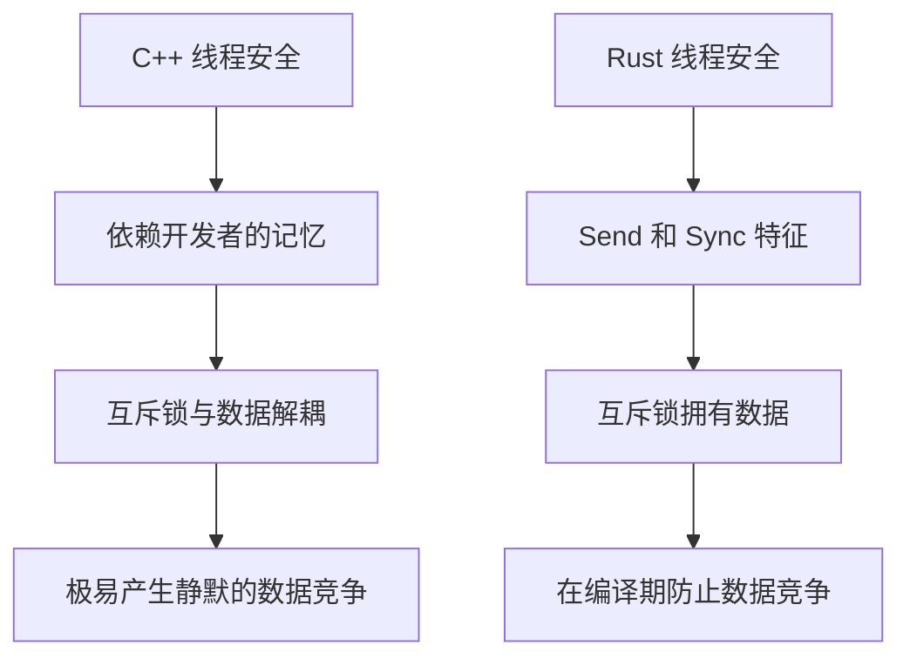
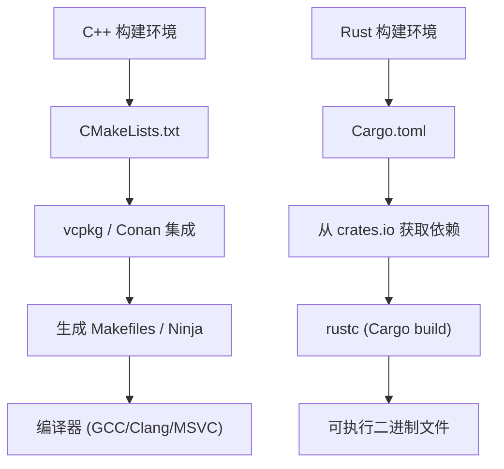

# 引言：系统编程的新黎明

在现代软件工程中，C++和Rust是站在系统编程最前沿的两大巨头。多年来，在操作系统、嵌入式设备、游戏引擎、高频交易（HFT）系统等需要发挥硬件极限性能的领域，C++一直作为绝对的王者君临天下。作为一名资深C++工程师，我自己也是从C++98时代的裸指针丛林开始，经历了C++11的现代化浪潮（智能指针、Lambda表达式、`auto`的引入），并伴随着C++14/17/20规范的不断庞大，一直坚持编写代码至今。

然而近年来，作为C++结构性问题——特别是“缺乏内存安全”导致的安全漏洞（据说约70%的CVE源于内存问题）以及“无止境复杂化的规范和未定义行为（UB）”——的解决方案，Rust正在戏剧性地崛起。被Linux内核正式采用，以及微软、谷歌、AWS等科技巨头大规模向Rust迁移的项目，并不只是短暂的流行，而是意味着系统编程领域范式的转变。

在本文中，我将作为一名纯正的C++工程师，从涉及语言规范根本的技术视角，彻底比较并剖析在深入学习Rust并将其应用于实战后所体会到的“优点”和“缺点”。

---

# 1. 内存管理的范式转变：从RAII到所有权与借用

## C++的RAII与智能指针的局限性

C++最伟大的发明之一是**RAII（资源获取即初始化）**。在构造函数中获取资源，在离开作用域时通过析构函数自动释放资源的理念，将开发者从手动使用`new`和`delete`导致的内存泄漏恐惧中解放出来。从C++11开始，`std::unique_ptr`和`std::shared_ptr`被引入标准库，使得所有权（Ownership）的概念可以在代码中表达。

但是，C++的智能指针和移动语义有一个致命的弱点：编译器进行的静态验证是不完整的。

```cpp
#include <iostream>
#include <memory>
#include <string>

void consume(std::unique_ptr<std::string> ptr) {
    std::cout << "Consuming: " << *ptr << std::endl;
}

int main() {
    auto my_ptr = std::make_unique<std::string>("Hello, C++");
    
    // 将所有权移动（Move）给函数
    consume(std::move(my_ptr));
    
    // 危险：在C++中，访问移动后的对象不会产生编译错误
    // std::move仅仅是转换为右值引用（T&&）的强制类型转换，编译器不会阻止其使用
    if (my_ptr) {
        std::cout << "Pointer is still valid?" << std::endl;
    } else {
        std::cout << "Pointer is null." << std::endl;
    }
    
    // std::cout << *my_ptr << std::endl; // 释放后使用（Use-After-Free）导致的未定义行为
    return 0;
}
```

在C++中，始终存在由于误访问被`std::move`掏空（处于有效但未指定状态）的对象而带来的风险。这会导致运行时崩溃，最坏的情况下还会直接引发安全漏洞。

## Rust的所有权（Ownership）与借用检查器的绝对防御

Rust将“所有权”这一概念融入了语言的核心设计中，并通过称为**借用检查器（Borrow Checker）**的编译器功能进行严格的静态分析。

```rust
fn consume(s: String) {
    println!("Consuming: {}", s);
} // 在这里 s 离开作用域，内存被释放（Drop）

fn main() {
    let my_string = String::from("Hello, Rust");
    
    // 将所有权移动给函数。在Rust中，默认就是移动语义。
    consume(my_string);
    
    // 编译错误！绝对无法访问被移动后的变量
    // println!("Is it still there? {}", my_string);
}
```

在Rust中，当变量的所有权转移时，原变量会被编译器视为“未初始化”状态，从而彻底阻断后续的访问。这使得“释放后使用（Use-After-Free）”或“悬垂指针（Dangling Pointer）”等漏洞在理论上根本无法通过编译。



## 借用（Borrowing）与可变性的控制

更为强大的是引用资源的“借用（Borrowing）”规则。在Rust中，强制执行以下规则：
1. 在任何给定的时间点，要么只能存在“多个不可变引用（`&T`）”，要么只能存在“一个可变引用（`&mut T`）”，**二者只能选其一**。
2. 引用的生命周期不能超过其原始数据的作用域（生命周期的限制）。

在C++中，可以轻松地对同一个对象创建多个可变引用或指针，这常常会引起意想不到的状态破坏（如迭代器失效等）。Rust通过在语言层面上禁止这种“别名（Aliasing）+ 可变性（Mutability）”的组合，将漏洞扼杀在摇篮里。

---

# 2. 内存布局与智能指针的数学开销

在系统编程中，对内存布局的准确理解是不可或缺的。让我们比较一下C++的`std::shared_ptr`和Rust的`std::rc::Rc` / `std::sync::Arc`。

C++的`std::shared_ptr`通过引用计数来管理资源，但它默认使用线程安全的原子操作（`std::atomic`）来增加或减少引用计数。其内存开销可以用如下公式表示：

$$ Overhead_{C++} = sizeof(T) + sizeof(ControlBlock) $$

这里，$ControlBlock$ 包含“强引用计数（Strong Ref Count）”、“弱引用计数（Weak Ref Count）”以及“自定义删除器（Custom Deleter）”。问题在于，即使只在单线程环境下使用，原子指令的开销（如缓存行锁定等）也会无条件地产生。

相比之下，Rust根据用途对智能指针进行了严格的区分。

- **单线程专用**: `Rc<T>` (Reference Counted)
- **多线程专用**: `Arc<T>` (Atomic Reference Counted)

$$ Overhead_{Rc} = sizeof(T) + 2 \times sizeof(usize) $$
$$ Overhead_{Arc} = sizeof(T) + 2 \times sizeof(AtomicUsize) $$

在Rust中，只要使用单线程专用的`Rc<T>`，就能完全避免原子操作带来的性能惩罚（零成本抽象）。而且，借助后文将要提到的线程安全机制，将`Rc<T>`错误地传递给另一个线程的行为会被类型系统完全阻止。

---

# 3. 线程安全：“无畏并发”的冲击

在C++中进行多线程编程，总是伴随着数据竞争和死锁的恐惧。

## C++互斥锁与数据分离的危险性

C++的`std::mutex`仅仅是对“特定的代码块（临界区）”进行排他控制，“需要保护的数据”与“互斥锁”之间在语言层面上没有任何绑定关系。

```cpp
#include <iostream>
#include <thread>
#include <mutex>
#include <vector>

std::vector<int> shared_data;
std::mutex mtx;

void worker() {
    // 即使开发者忘记获取锁，编译也能正常通过
    // std::lock_guard<std::mutex> lock(mtx);
    shared_data.push_back(1); // 致命的数据竞争！
}

int main() {
    std::thread t1(worker);
    std::thread t2(worker);
    t1.join();
    t2.join();
    return 0;
}
```

## Rust的互斥锁“所有”数据

在Rust中，`Mutex<T>`通过泛型将要保护的数据类型 `T` **包裹（所有）**在内部。为了访问数据，必须调用`lock()`获取一个守卫对象。在不获取锁的情况下接触数据，在语法上是不可能的。

```rust
use std::sync::{Arc, Mutex};
use std::thread;

fn main() {
    // 数据被完全封装在Mutex内部
    let shared_data = Arc::new(Mutex::new(Vec::new()));
    let mut handles = vec![];

    for _ in 0..2 {
        // 为了在线程间共享，克隆Arc（线程安全的引用计数）
        let data_clone = Arc::clone(&shared_data);
        let handle = thread::spawn(move || {
            // 如果不获取锁，就无法访问内部的Vec
            let mut data = data_clone.lock().unwrap();
            data.push(1);
        });
        handles.push(handle);
    }

    for handle in handles {
        handle.join().unwrap();
    }
}
```

此外，Rust中还有两个保证并发安全的核心特征（Trait）：
- `Send`：可以在线程间安全地转移所有权的类型
- `Sync`：可以被多个线程同时安全引用的类型

例如，非线程安全的`Rc<T>`没有实现`Send`特征。因此，如果试图将其传递给`thread::spawn`，会立刻引发编译错误。这种“无畏并发（Fearless Concurrency）”将开发者从漏洞的恐惧中解放出来，从而可以更加激进地推进并行化。

根据阿姆达尔定律（Amdahl's Law），对于可并行化的部分 $P$ 和并行度 $N$ ，理论上的最大吞吐量可以表示为：

$$ S(N) = \frac{1}{(1 - P) + \frac{P}{N}} $$

借助类型系统，Rust使得为了最大化该 $P$ 值而进行的重构变得极其安全。



---

# 4. 错误处理：异常 vs 代数数据类型

C++的标准错误处理机制是“异常（Exceptions）”。然而，异常会让控制流变得不透明，并带来性能损失（如栈展开或RTTI膨胀）。在嵌入式系统和游戏引擎中，经常会完全禁用异常（`-fno-exceptions`），并采用返回传统错误代码的设计。虽然C++23引入了`std::expected`，但要渗透到整个生态系统中还需要时间。

Rust中不存在异常的概念。错误被作为纯粹的“值”返回，并用 `Result<T, E>` 这个枚举类型（代数数据类型）来表示。

```rust
use std::fs::File;
use std::io::{self, Read};

// 仅通过查看返回值类型，就可以明确可能会发生IO错误
fn read_file_content(path: &str) -> Result<String, io::Error> {
    // 如果发生错误，? 运算符会立即提早返回；如果成功，则取出其中的内容
    let mut file = File::open(path)?; 
    let mut content = String::new();
    file.read_to_string(&mut content)?;
    Ok(content)
}
```

这个 `?` 运算符是革命性的。它消除了在C++中检查错误代码时产生的深层嵌套（if语句金字塔），在保持类似异常那种整洁代码流的同时，还可以显式地指出错误是在哪个函数调用中传播的。

---

# 5. 多态性：从虚函数/模板到特征（Trait）

C++的多态主要通过类的继承和虚函数（`virtual`）实现的动态分发，或通过模板实现的静态分发（如CRTP等）来实现。

在动态分发中，对象内部嵌入了指向虚函数表（vtable）的指针（vptr），在调用函数时会产生解析指针的开销。

$$ T_{dispatch} = T_{lookup\_in\_vtable} + T_{dereference} $$

Rust摒弃了经典面向对象中的“类继承”，取而代之采用了“**特征（Traits）**”的概念（类似于C++20的Concept，但功能更强大）。

```rust
trait Drawable {
    fn draw(&self);
}

struct Circle { radius: f64 }
impl Drawable for Circle {
    fn draw(&self) { println!("Drawing a Circle of radius {}", self.radius); }
}

// 静态分发 (单态化・零开销)
fn draw_static<T: Drawable>(item: &T) {
    item.draw();
}

// 动态分发 (特征对象)
fn draw_dynamic(item: &dyn Drawable) {
    item.draw();
}
```

Rust动态分发（`dyn Trait`）最大的特点是，数据结构内部不包含vptr，而是使用**胖指针（Fat Pointer）**。胖指针成对地保存“指向数据的指针”和“指向vtable的指针”。这使得对外部库定义的类型进行事后特征实现（扩展）并应用于动态分发变得非常容易。

---

# 6. 包管理与构建系统：CMake的苦恼与Cargo的恩惠

C++最大的弱点之一就是缺乏标准的包管理器。`CMakeLists.txt`晦涩难懂的语法、使用`find_package`解决依赖关系的复杂性，以及不同操作系统库路径的差异，持续吞噬着C++工程师大量的时间。

而在Rust中，标准搭载了**Cargo**这款世界上最顶级的包管理器兼构建系统。



只需在 `Cargo.toml` 中加上一行依赖库（Crate）的名称和版本，推移依赖的解决、下载、构建等所有过程都会全自动完成。不仅如此，测试（`cargo test`）、文档生成（`cargo doc`）、静态分析（`cargo clippy`）、代码格式化（`cargo fmt`）等开发所需的工具链全部集成在这个单一命令中。这种舒适感具有一旦体验过就不想再回到C++构建环境的破坏力。

---

# 7. 学习Rust的缺点与学习曲线

到目前为止，我已经讲述了Rust的优点，但是C++工程师在将Rust投入实战时，也肯定会面临一些“高墙”和缺点。

## 1. 与严苛的借用检查器搏斗
如果我们试图将C++中“随便用裸指针连接”的数据结构（例如双向链表、图结构、自引用结构体等）原封不动地在Rust中实现，会因为所有权和生命周期的限制而无法通过编译。为了满足借用检查器，我们需要使用 `Rc<RefCell<T>>` 进行复杂的包装，或者从根本上重新设计，改用Arena分配器或基于索引的管理。

## 2. 漫长的编译时间
虽然C++也会因为模板嵌套而导致编译变慢，但Rust的编译时间（特别是从零开始的干净构建）也绝对不算短。由于LLVM强大的优化过程、宏展开以及泛型的单态化（Monomorphization）相互叠加，在大型项目中构建时间会成为瓶颈。开发过程中必须经常使用 `cargo check` 等技巧来应对。

## 3. 与C++代码库的互操作性
与C语言（FFI）的互操作非常顺畅，但是要将Rust与现有庞大的C++代码库（大量使用了类、模板、虚函数）直接连接起来却非常困难。近年来，虽然 `cxx` 和 `autocxx` 等桥接工具正在发展，但要实现完全无缝的迁移仍然面临很高的门槛。

---

# 总结：我们应该转向Rust吗？

未来，C++仍将在游戏引擎开发以及现有庞大基础设施中继续扮演重要角色。C++20/23带来的现代化进程也引人瞩目，使得代码编写变得越来越安全。

然而，在“新启动的系统编程项目”中，我觉得**越来越难找到不选择Rust的理由了**。只要通过编译，就能从未定义行为和内存破坏的恐惧中解脱出来，并以高性能安全地进行并发处理——Rust带来的这种“确定性”极大地改善了工程师的心理模型。

对于C++工程师而言，学习Rust不仅仅是记住新的语法，更是一次绝佳的体验，让你在“如何安全管理内存和线程”方面获得全新的视野。请大家也务必亲自体验一下Cargo的舒适与借用检查器的严苛。
