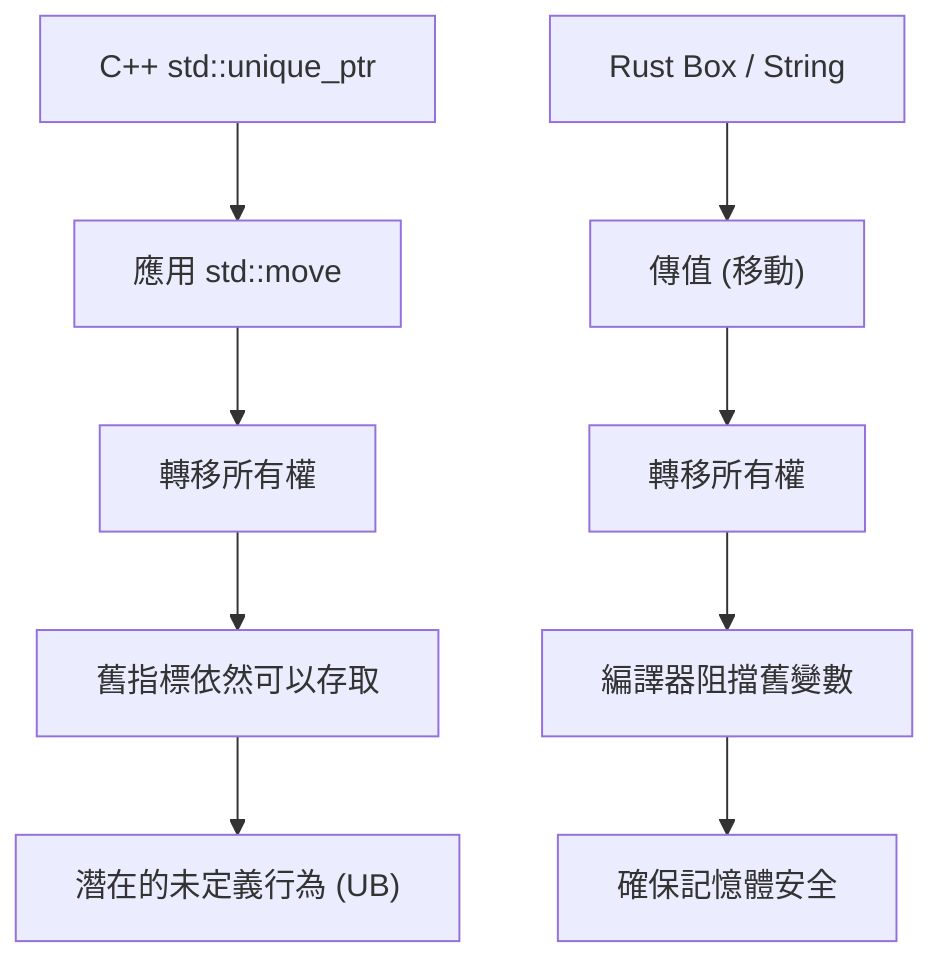
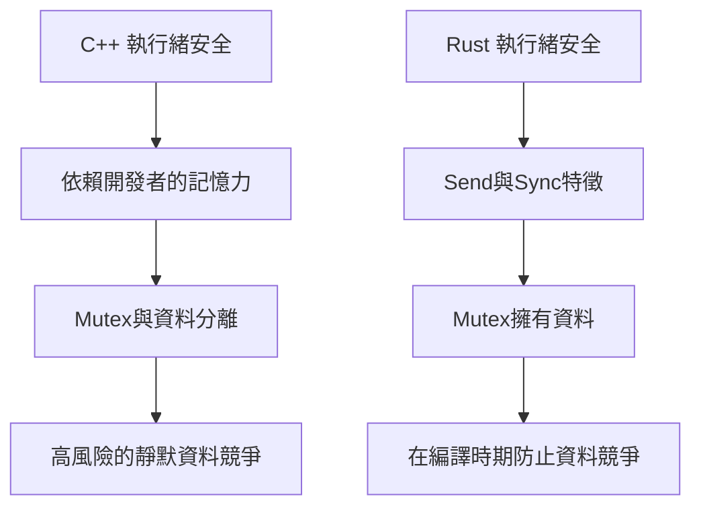
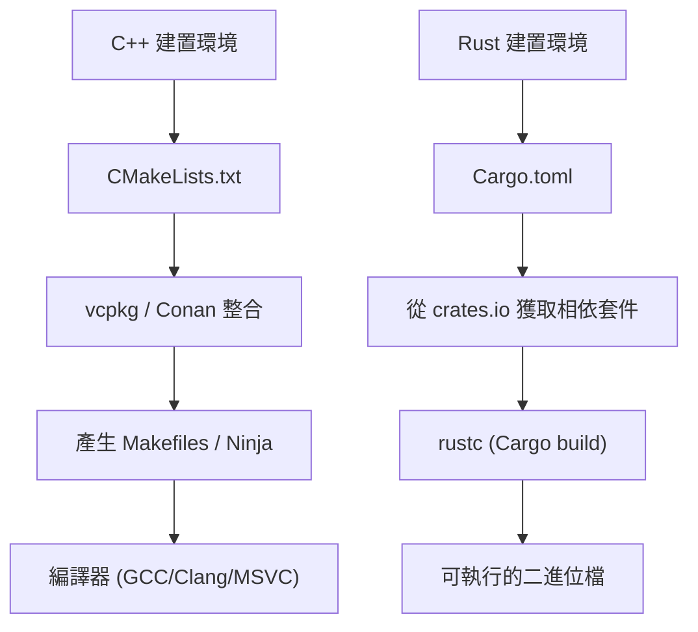

# 前言：系統程式設計的新黎明

在現代軟體工程中，C++與Rust是站在系統程式設計最前線的兩大巨頭。長年以來，C++在作業系統、嵌入式裝置、遊戲引擎、高頻交易（HFT）系統等需要發揮硬體極限效能的領域中，一直以絕對王者的姿態君臨天下。我本身也是一位資深C++工程師，從C++98時代的原始指標叢林開始，一路伴隨著C++11現代化浪潮（引進智慧指標、Lambda表達式、`auto`），以及C++14/17/20不斷龐大化的規範編寫著程式碼。

然而近年來，為了解決C++所面臨的結構性問題——特別是因「缺乏記憶體安全性」造成的安全漏洞（據說約7成的CVE起因於記憶體問題）以及「無止盡複雜化的規範與未定義行為（UB）」——Rust的強勢崛起提供了解決方案。Linux核心正式採用Rust，以及Microsoft、Google、AWS等科技巨頭進行的大規模Rust轉移專案，這不僅僅是一時的流行，更意味著系統程式設計正經歷典範轉移。

本篇文章將由一位道地的C++工程師，從語言規範核心的技術觀點出發，深入比較並解說實際深入學習Rust、並在實戰中使用後所感受到的「優點」與「缺點」。

---

# 1. 記憶體管理的典範轉移：從RAII到所有權與借用

## C++的RAII與智慧指標的極限

C++最偉大的發明之一就是**RAII (Resource Acquisition Is Initialization)**。在建構函式中取得資源，並在離開作用域時透過解構函式自動釋放，這個概念將開發者從手動使用`new`與`delete`造成的記憶體洩漏恐懼中解放出來。從C++11開始，`std::unique_ptr`與`std::shared_ptr`被導入標準函式庫，讓所有權（Ownership）的概念能在程式碼上表現出來。

但是，C++的智慧指標與移動語意（Move Semantics）有一個致命的弱點，那就是編譯器的靜態驗證並不完美。

```cpp
#include <iostream>
#include <memory>
#include <string>

void consume(std::unique_ptr<std::string> ptr) {
    std::cout << "Consuming: " << *ptr << std::endl;
}

int main() {
    auto my_ptr = std::make_unique<std::string>("Hello, C++");
    
    // 將所有權移動（Move）給函式
    consume(std::move(my_ptr));
    
    // 危險：在C++中，存取移動後的物件不會引發編譯錯誤
    // std::move只是單純轉型為右值參考(T&&)，編譯器不會阻止其使用
    if (my_ptr) {
        std::cout << "Pointer is still valid?" << std::endl;
    } else {
        std::cout << "Pointer is null." << std::endl;
    }
    
    // std::cout << *my_ptr << std::endl; // 釋放後使用（Use-After-Free）造成的未定義行為
    return 0;
}
```

在C++中，總是存在著錯誤存取因`std::move`而被掏空（有效但處於未指定狀態）的物件的風險。這會直接導致執行時的崩潰，或在最糟的情況下產生安全漏洞。

## Rust的所有權（Ownership）與借用檢查器的絕對防禦

Rust將這個「所有權」的概念融入語言的核心設計中，並透過稱為**借用檢查器（Borrow Checker）**的編譯器功能進行嚴格的靜態分析。

```rust
fn consume(s: String) {
    println!("Consuming: {}", s);
} // s 在這裡離開作用域，記憶體被釋放 (Drop)

fn main() {
    let my_string = String::from("Hello, Rust");
    
    // 將所有權移動給函式。在Rust中預設就是移動語意。
    consume(my_string);
    
    // 編譯錯誤！絕對無法存取移動後的變數
    // println!("Is it still there? {}", my_string);
}
```

在Rust中，當變數的所有權移動的那一刻，原來的變數在編譯器眼中就被視為等同「未初始化」狀態，並完全阻斷後續的存取。因此，「Use-After-Free（釋放後使用）」或「Dangling Pointer（迷途指標）」等Bug，在理論上根本無法通過編譯。



## 借用（Borrowing）與可變性的控制

更強大的是參考資源的「借用（Borrowing）」規則。Rust強制實施以下規則：
1. 在任何時間點，「多個不可變參考（`&T`）」或「單一可變參考（`&mut T`）」**只能有其中一種**存在。
2. 參考的生命週期絕對不能比原來的資料更長（生命週期限制）。

在C++中，可以輕易地為同一個物件建立多個可變參考或指標，這會引起非預期的狀態破壞（如迭代器失效等）。Rust在語言層級禁止了這種「別名（Aliasing）＋可變性（Mutability）」的組合，從而防患未然。

---

# 2. 記憶體佈局與智慧指標的數學運算開銷

在系統程式設計中，正確理解記憶體佈局是不可或缺的。讓我們來比較C++的`std::shared_ptr`與Rust的`std::rc::Rc` / `std::sync::Arc`。

C++的`std::shared_ptr`透過參考計數來管理資源，但預設使用執行緒安全的原子操作（`std::atomic`）來增減參考計數。其在記憶體上的開銷可以公式化如下：

$$ Overhead_{C++} = sizeof(T) + sizeof(ControlBlock) $$

在這裡，$ControlBlock$ 包含了「強參考計數（Strong Ref Count）」、「弱參考計數（Weak Ref Count）」以及「自訂刪除器（Custom Deleter）」。問題在於，即使在只使用單執行緒的情況下，原子指令的開銷（如快取行鎖定等）也會無條件地發生。

相對地，Rust會根據用途嚴格區分智慧指標：

- **單執行緒用**: `Rc<T>` (Reference Counted)
- **多執行緒用**: `Arc<T>` (Atomic Reference Counted)

$$ Overhead_{Rc} = sizeof(T) + 2 \times sizeof(usize) $$
$$ Overhead_{Arc} = sizeof(T) + 2 \times sizeof(AtomicUsize) $$

在Rust中，只要使用單執行緒專用的`Rc<T>`，就能完全避免原子操作的效能懲罰（零成本抽象化）。而且，透過後述的執行緒安全機制，型別系統會完全防止你將`Rc<T>`錯誤地傳遞到另一個執行緒。

---

# 3. 執行緒安全："Fearless Concurrency" 的衝擊

在C++中進行多執行緒程式設計，總是伴隨著資料競爭與死結的恐懼。

## C++的互斥鎖與資料分離的危險性

C++的`std::mutex`充其量只是對「特定的程式碼區塊（臨界區段）」進行互斥控制，「需要保護的資料」與「互斥鎖」之間並沒有語言層面上的連結。

```cpp
#include <iostream>
#include <thread>
#include <mutex>
#include <vector>

std::vector<int> shared_data;
std::mutex mtx;

void worker() {
    // 即使開發者忘記取得鎖，也能順利通過編譯
    // std::lock_guard<std::mutex> lock(mtx);
    shared_data.push_back(1); // 致命的資料競爭！
}

int main() {
    std::thread t1(worker);
    std::thread t2(worker);
    t1.join();
    t2.join();
    return 0;
}
```

## Rust的Mutex「擁有」資料

在Rust中，`Mutex<T>`使用泛型將受保護的資料型別 `T` **內含（擁有）**在其中。為了存取資料，必須呼叫`lock()`來取得守衛物件（Guard Object）。如果不取得鎖就想觸碰資料，在語法上是不可能的。

```rust
use std::sync::{Arc, Mutex};
use std::thread;

fn main() {
    // 資料被完全封裝在Mutex之中
    let shared_data = Arc::new(Mutex::new(Vec::new()));
    let mut handles = vec![];

    for _ in 0..2 {
        // 為了在執行緒間共享而克隆Arc（執行緒安全的參考計數）
        let data_clone = Arc::clone(&shared_data);
        let handle = thread::spawn(move || {
            // 如果不取得鎖，就無法存取內部的Vec
            let mut data = data_clone.lock().unwrap();
            data.push(1);
        });
        handles.push(handle);
    }

    for handle in handles {
        handle.join().unwrap();
    }
}
```

此外，Rust存在兩個確保並行處理安全性的核心特徵（Trait）：
- `Send`: 可以在執行緒間安全轉移所有權的型別
- `Sync`: 從多個執行緒同時參考也安全的型別

舉例來說，非執行緒安全的`Rc<T>`沒有實作`Send`特徵。因此，如果試圖將其傳遞給`thread::spawn`，會立刻引發編譯錯誤。這種「Fearless Concurrency（無懼並行）」讓開發者從Bug的恐懼中解放出來，能夠更積極地推動平行化。

根據阿姆達爾定律（Amdahl's Law），可平行化部分 $P$ 與平行度 $N$ 之下的理論最大吞吐量可表示如下：

$$ S(N) = \frac{1}{(1 - P) + \frac{P}{N}} $$

Rust讓你可以依賴型別系統，極度安全地進行重構，以最大化這個 $P$ 值。



---

# 4. 錯誤處理：例外 vs 代數資料型別

C++錯誤處理的標準是「例外（Exceptions）」。然而，例外會讓控制流程變得不透明，並引起效能上的開銷（堆疊展開與RTTI膨脹）。在嵌入式系統或遊戲引擎中，經常會採用完全停用例外（`-fno-exceptions`）並回傳傳統錯誤碼的設計。雖然C++23導入了`std::expected`，但要普及到整個生態圈還需要一段時間。

Rust不存在例外的概念。錯誤純粹作為「值」被回傳，並透過 `Result<T, E>` 這個列舉型別（代數資料型別）來表現。

```rust
use std::fs::File;
use std::io::{self, Read};

// 只要看回傳值的型別，就很清楚可能會發生IO錯誤
fn read_file_content(path: &str) -> Result<String, io::Error> {
    // 透過 ? 運算子，如果是錯誤就立即提早回傳，成功的話就取出內容
    let mut file = File::open(path)?; 
    let mut content = String::new();
    file.read_to_string(&mut content)?;
    Ok(content)
}
```

這個 `?` 運算子是革命性的。它排除了C++在檢查錯誤碼時產生的深層巢狀（if語句金字塔），並保持了如同例外般乾淨的程式碼流程，同時能明確標示錯誤會在哪個函式呼叫中傳播。

---

# 5. 多型：從虛擬函式・樣板到特徵

C++的多型主要是透過類別繼承與虛擬函式（`virtual`）的動態分派（Dynamic Dispatch），或是透過樣板的靜態分派（如CRTP）來實現。

在動態分派中，物件內部會嵌入指向虛擬函式表（vtable）的指標（vptr），在呼叫函式時會產生解析指標的開銷。

$$ T_{dispatch} = T_{lookup\_in\_vtable} + T_{dereference} $$

Rust捨棄了傳統物件導向的「類別繼承」，轉而採用「**特徵（Traits）**」這個概念（類似於C++20的Concept，但功能更豐富）。

```rust
trait Drawable {
    fn draw(&self);
}

struct Circle { radius: f64 }
impl Drawable for Circle {
    fn draw(&self) { println!("Drawing a Circle of radius {}", self.radius); }
}

// 靜態分派 (單態化・零開銷)
fn draw_static<T: Drawable>(item: &T) {
    item.draw();
}

// 動態分派 (特徵物件)
fn draw_dynamic(item: &dyn Drawable) {
    item.draw();
}
```

Rust的動態分派（`dyn Trait`）最大的特點是，資料結構內部不包含vptr，而是使用**胖指標（Fat Pointer）**。胖指標將「指向資料的指標」與「指向vtable的指標」作為一對保存。這使得為外部函式庫定義的型別事後實作（擴充）特徵並進行動態分派變得非常容易。

---

# 6. 套件管理與建置系統：CMake的苦惱與Cargo的恩惠

C++最大的弱點之一就是缺乏標準的套件管理工具。`CMakeLists.txt`難解的語法、`find_package`解決相依性問題的複雜度，以及各個OS之間函式庫路徑的差異，持續奪走C++工程師大量的時間。

Rust標準內建了 **Cargo** 這個世界頂尖的套件管理器兼建置系統。



只要在 `Cargo.toml` 中加入一行相依函式庫（Crate）的名稱與版本，它就會全自動完成推移相依性解析、下載，直到建置完成。更進一步，測試（`cargo test`）、文件產生（`cargo doc`）、靜態分析（`cargo clippy`）、格式化工具（`cargo fmt`）等開發所需的所有工具鏈，全都整合在這個單一指令中。這種舒適感一旦體驗過，就擁有讓人再也不想回到C++建置環境的破壞力。

---

# 7. 學習Rust的缺點與學習曲線

到目前為止談了許多Rust的優點，但C++工程師要將Rust投入實戰時，也確實會面臨一些「高牆」與缺點。

## 1. 與嚴酷借用檢查器的搏鬥
如果在Rust中試圖直接實作C++裡「隨便用原始指標串接」的資料結構（例如雙向鏈結串列、圖結構、自我參考結構等），會因為所有權與生命週期的限制而無法通過編譯。為了解決借用檢查器的問題，必須進行像 `Rc<RefCell<T>>` 這樣複雜的包裝，或者從根本上重新設計，改用區域分配器（Arena Allocator）或基於索引的管理方式。

## 2. 漫長的編譯時間
雖然C++也會因為樣板巢狀而導致編譯緩慢，但Rust的編譯時間（特別是從零開始的乾淨建置）也絕不算短。由於LLVM強大的最佳化流程、巨集展開、泛型的單態化（Monomorphization）等因素疊加，在大型專案中建置時間將成為瓶頸。在開發過程中，必須經常運用 `cargo check` 等技巧。

## 3. 與C++程式碼庫的互通性
雖然與C語言（FFI）的整合非常順暢，但要將既存的龐大C++程式碼庫（大量使用類別、樣板、虛擬函式）直接與Rust整合卻非常困難。近年來雖然有 `cxx` 或 `autocxx` 等橋接工具不斷進化，但要達到完全無縫的轉移仍然有很高的門檻。

---

# 總結：我們應該轉移到Rust嗎？

C++未來在遊戲引擎開發以及既存的龐大基礎設施中，仍將繼續扮演重要的角色。C++20/23帶來的現代化也非常顯著，使得撰寫程式碼變得更安全。

然而，在「全新啟動的系統程式設計專案」中，我覺得現在**已經很難找到不選擇Rust的理由**了。只要能通過編譯，就能從未定義行為與記憶體破壞的恐懼中解放出來，並能以高效能安全地進行並行處理，Rust這種「確定性」大幅改善了工程師的心智模型。

對C++工程師而言，學習Rust不單只是記住新的語法，而是獲得對「安全管理記憶體與執行緒的方法」全新視角的最佳體驗。請大家務必親身體會看看Cargo的舒適與借用檢查器的嚴格。
