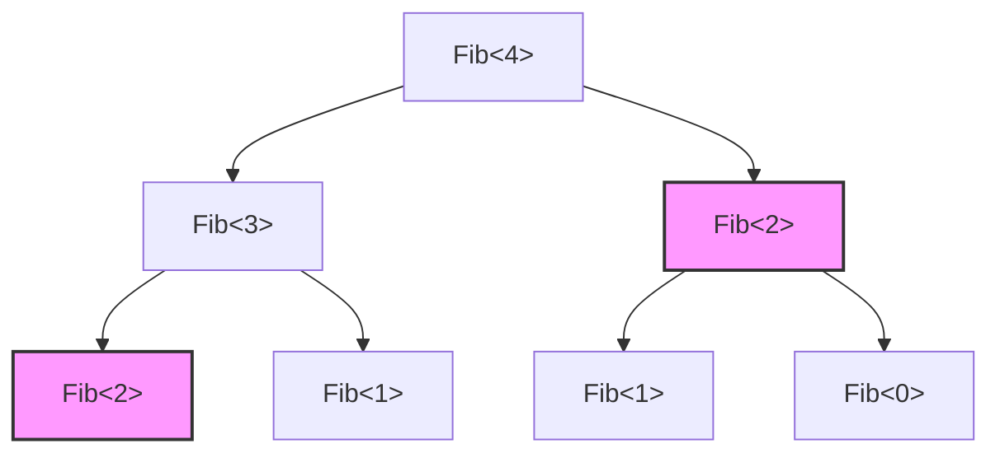
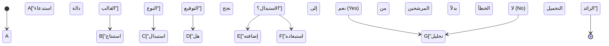
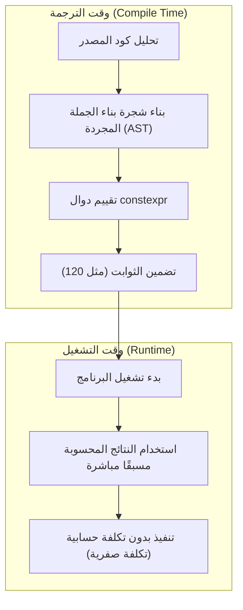

من أكبر عوامل الجذب في لغة C++، وفي نفس الوقت من أكثر الجوانب تعقيدًا، هو "البرمجة الوصفية للقوالب" (Template Metaprogramming: TMP). إنها تقنية تتيح تقديم العمليات الحسابية التي تتم عادةً أثناء وقت التشغيل (Run-time) ليتم تنفيذها مسبقًا أثناء وقت الترجمة (Compile-time)، وذلك عندما يقوم المترجم (compiler) بتحليل كود المصدر لإنشاء الملفات الثنائية (binary).

في هذا المقال، سنشرح بالتفصيل الممل التطور التاريخي لكيفية اكتساب قوالب C++ لقدراتها الحسابية، بدءًا من SFINAE الكلاسيكي، ومرورًا بـ `constexpr` الحديثة و `if constexpr`، وصولًا إلى `consteval` و Concepts (المفاهيم) في C++20. وسنقدم ذلك مع أمثلة برمجية عملية وخلفية رياضية.

---

## 1. فجر البرمجة الوصفية للقوالب: اكتشاف اكتمال تورنغ بالصدفة

### 1.1 ما هو اكتمال تورنغ (Turing Completeness)؟

في علوم الحاسب، أن يكون النظام "مكتمل تورنغ" (Turing Complete) يعني أن لديه نفس القدرة الحسابية لآلة تورنغ الشاملة. ببساطة، هو نظام يمكنه تمثيل "التفرع الشرطي" و"الحلقات اللانهائية (أو الاستدعاء الذاتي)"، وبالتالي يمكنه كتابة وتنفيذ أي خوارزمية.

### 1.2 اكتشاف إروين أونرو

في عام 1994، خلال اجتماع للجنة توحيد معايير C++، قدم شخص يُدعى إروين أونرو (Erwin Unruh) كود C++. كان هذا الكود يفشل في الترجمة، ولكن والمفاجأة كانت أن **رسائل الخطأ الناتجة عن المترجم كانت تحتوي على سلسلة من الأعداد الأولية**.

كان المترجم يقوم بمعالجة عودية (recursive) أثناء عملية استنساخ القوالب (instantiation)، ويُخرج نتيجة تلك الحسابات كرسائل خطأ. لقد كانت تلك اللحظة التي أُثبت فيها أن ميزة القوالب في C++ تحتوي على **نظام حسابي مكتمل تورنغ** لم يكن مقصودًا حتى من قبل مصمم اللغة، بيارن ستروستروب.

---

## 2. البرمجة الوصفية للقوالب الكلاسيكية (C++98 / C++03)

في البدايات، اتخذت البرمجة الوصفية للقوالب أسلوب برمجة وظيفية خالصة، معتمدة على الهياكل (`struct`) وتخصيص القوالب (Template Specialization).

### 2.1 حساب المضروب (Factorial)

دعونا نلقي نظرة أولاً على المثال الأساسي وهو حساب المضروب ($N!$). رياضيًا، يُعرّف كما يلي:

$$
N! = 
\begin{cases} 
1 & (N = 0) \\
N \times (N - 1)! & (N > 0)
\end{cases}
$$

عند كتابة هذا باستخدام قوالب C++98، سيكون كالتالي:

```cpp
#include <iostream>

// القالب الأساسي (الحالة العامة للاستدعاء الذاتي)
template <int N>
struct Factorial {
    static const int value = N * Factorial<N - 1>::value;
};

// تخصيص صريح للقالب (الحالة الأساسية للاستدعاء الذاتي)
template <>
struct Factorial<0> {
    static const int value = 1;
};

int main() {
    // يُحسب في وقت الترجمة ويُضمن كقيمة ثابتة
    std::cout << "5! = " << Factorial<5>::value << std::endl; 
    return 0;
}
```

النقطة المهمة هنا هي أن `Factorial<5>::value` لا يُحسب وقت التشغيل، بل يتم فكه وقت الترجمة. في الملف الثنائي النهائي، يتم إنشاء كود يعادل `std::cout << "5! = " << 120 << std::endl;`. وهذا يعني أن التكلفة الإضافية (overhead) أثناء التشغيل تساوي صفرًا.

### 2.2 متتالية فيبوناتشي والتعقيد الحسابي

بعد ذلك، لنحسب متتالية فيبوناتشي. العلاقة التكرارية هي كالتالي:

$$
F_n = F_{n-1} + F_{n-2} \quad (F_0 = 0, F_1 = 1)
$$

```cpp
template <int N>
struct Fib {
    static const int value = Fib<N - 1>::value + Fib<N - 2>::value;
};

template <>
struct Fib<0> { static const int value = 0; };

template <>
struct Fib<1> { static const int value = 1; };
```

إذا كُتب هذا التنفيذ كدالة عودية وقت التشغيل، فإنه سيكرر نفس الحسابات عدة مرات، مما يجعل التعقيد الحسابي أسيًا $O(2^N)$. ولكن، **أثناء استنساخ القوالب في وقت الترجمة، يتم استنساخ النوع الذي يمتلك نفس وسائط القالب مرة واحدة فقط** (تأثير يشبه الحفظ أو Memoization). لذلك، فإن التعقيد الحسابي وقت الترجمة يصبح فعليًا $O(N)$.

يوضح الشكل التالي كيف يقوم المترجم بحل النسخ:



في الشكل أعلاه، يتم استنساخ `Fib<2>` الذي يحمل نفس اللون أو الشكل مرة واحدة فقط داخل المترجم، وفي المرات اللاحقة يتم استخدام تعريف النوع المخبأ (cached).

---

## 3. SFINAE وسمات النوع (Type Traits) (C++11)

مع تطور البرمجة الوصفية، أصبحت "معالجة وتقييم الأنواع" لا تقل أهمية عن "حساب القيم". وهنا يظهر مصطلح **SFINAE** (Substitution Failure Is Not An Error: فشل الاستبدال ليس خطأ).

### 3.1 آلية عمل SFINAE

أثناء تحليل التحميل الزائد (overload resolution) لدوال القوالب، يستنتج المترجم وسائط القالب من الوسائط المُمررة، ويستبدل الأنواع في توقيع الدالة. في هذه المرحلة، إذا حدث تعارض في الأنواع وفشل الاستبدال، فلن يقوم المترجم بإصدار خطأ ترجمة فورًا، بل سيقوم بـ **استبعاد هذا المرشح للتحميل الزائد بهدوء** ويبحث عن المرشح التالي.



### 3.2 الترجمة المشروطة باستخدام std::enable_if

باستخدام الترويسة `<type_traits>` و `std::enable_if` اللتين تم تقديمهما في C++11، يمكنك تفعيل دوال معينة فقط للأنواع التي تستوفي شروطًا محددة.

```cpp
#include <iostream>
#include <type_traits>

// تفعيل التحميل الزائد فقط إذا كان T نوعًا صحيحًا
template <typename T>
typename std::enable_if<std::is_integral<T>::value>::type
print_type(T val) {
    std::cout << "Integer: " << val << std::endl;
}

// تفعيل التحميل الزائد فقط إذا كان T نوعًا فاصلة عائمة
template <typename T>
typename std::enable_if<std::is_floating_point<T>::value>::type
print_type(T val) {
    std::cout << "Floating point: " << val << std::endl;
}

int main() {
    print_type(42);      // Integer: 42
    print_type(3.1415);  // Floating point: 3.1415
    // print_type("str"); // خطأ في الترجمة: لا توجد دالة مطابقة
}
```

كان هذا النهج قويًا للغاية، ولكن الصياغة مثل `typename std::enable_if<...>::type` كانت مطولة جدًا، مما جعل البعض يتجنب البرمجة الوصفية في C++ معتبرين إياها "كرموز مشفرة".

---

## 4. التحول الجذري: إدخال constexpr (C++11/C++14)

في C++11، تم إدخال الكلمة المفتاحية `constexpr`، والتي تُعد ثورة في تاريخ البرمجة الوصفية. وبفضلها، أصبح من الممكن **إجراء حسابات وقت الترجمة باستخدام صياغة الدوال العادية**، دون الحاجة إلى اللجوء إلى التكرار غير الطبيعي في القوالب.

### 4.1 constexpr في C++11

دوال `constexpr` في إصدار C++11 كانت تخضع لقيد صارم: "يجب أن يتكون جسم الدالة من تعليمة `return` واحدة فقط". ولذلك، لم يكن بالإمكان استخدام الحلقات، بل كان يجب الاعتماد على المعامل الثلاثي والاستدعاء الذاتي.

```cpp
// فيبوناتشي بـ constexpr في C++11
constexpr int fib_cxx11(int n) {
    return (n <= 1) ? n : fib_cxx11(n - 1) + fib_cxx11(n - 2);
}
```

### 4.2 تخفيف قيود constexpr في C++14

في C++14، تم تخفيف هذا القيد بشكل كبير، حيث أصبح من الممكن استخدام تعريف المتغيرات المحلية، وعبارات `if`، وحلقات `for` داخل دوال `constexpr`. أتاح هذا كتابة الخوارزميات بشكل مباشر وبنفس الطريقة المستخدمة في وقت التشغيل.

```cpp
// فيبوناتشي بـ constexpr في C++14
constexpr int fib_cxx14(int n) {
    if (n <= 1) return n;
    int a = 0, b = 1;
    for (int i = 2; i <= n; ++i) {
        int temp = a + b;
        a = b;
        b = temp;
    }
    return b;
}
```

يتم حساب هذا الكود في وقت الترجمة إذا كان التقييم ممكنًا في ذلك الوقت، أما إذا مُررت المتغيرات أثناء وقت التشغيل، فسيتم حسابها كدالة عادية وقت التشغيل.



---

## 5. إتقان التفرع الشرطي الثابت: if constexpr (C++17)

قدمت C++17 ميزة `if constexpr`، التي جعلت التحميل الزائد المعقد باستخدام SFINAE شيئًا من الماضي. إنها عبارة `if` تُقيّم في وقت الترجمة، والكتل التي يكون شرطها `false` لا يتم استنساخها على الإطلاق، بل يتم تجاهلها تمامًا من عملية الترجمة.

إذا أعدنا كتابة مثال SFINAE السابق باستخدام `if constexpr`، سيصبح بسيطًا بشكل مذهل.

```cpp
#include <iostream>
#include <type_traits>

template <typename T>
void print_type(T val) {
    if constexpr (std::is_integral_v<T>) {
        std::cout << "Integer: " << val << std::endl;
    } 
    else if constexpr (std::is_floating_point_v<T>) {
        std::cout << "Floating point: " << val << std::endl;
    } 
    else {
        std::cout << "Other type" << std::endl;
    }
}
```

باستخدام `if constexpr`، يمكن تجميع المعالجات الخاصة بالأنواع المختلفة داخل نفس قالب الدالة، مما أدى إلى تحسين قابلية قراءة الكود بشكل كبير.

---

## 6. جوهر C++ الحديثة: consteval و Concepts (C++20)

يعتبر إصدار C++20 تحديثًا هائلاً منذ C++11. وقد شهد مجال البرمجة الوصفية تطورات جذرية فيه أيضًا.

### 6.1 الحساب الإجباري في وقت الترجمة: consteval

كانت `constexpr` توجيهًا لـ "الحساب وقت الترجمة إذا توفرت الشروط"، لكنها تسمح أيضًا بالتقييم وقت التشغيل. على النقيض من ذلك، تُعرِّف `consteval`، التي أضيفت في C++20، **دالة فورية (Immediate Function) "يجب أن تُقيّم في وقت الترجمة"**. أي محاولة لتقييمها في وقت التشغيل ستؤدي إلى خطأ في الترجمة.

```cpp
// فرض الحساب في وقت الترجمة
consteval int square(int n) {
    return n * n;
}

int main() {
    constexpr int a = square(5); // صحيح (OK): تقييم وقت الترجمة
    
    int x = 5;
    // int b = square(x); // خطأ: x متغير وقت تشغيل لذا لا يمكن تقييمه
}
```

### 6.2 توضيح متطلبات القوالب: المفاهيم (Concepts)

من أكبر نقاط ضعف البرمجة الوصفية كانت "صعوبة فهم رسائل الخطأ". عند تمرير نوع خاطئ إلى وسيط القالب، قد يُصدر المترجم مئات الأسطر من الأخطاء غير المفهومة.

باستخدام **المفاهيم (Concepts)** في C++20، يمكنك تحديد القيود المفروضة على الأنواع التي يقبلها القالب بطريقة تشبه اللغة الطبيعية، وتصبح رسائل الخطأ واضحة للغاية.

```cpp
#include <concepts>
#include <iostream>

// يتطلب أن يكون النوع T نوعًا صحيحًا (integral)
template <std::integral T>
T add(T a, T b) {
    return a + b;
}

int main() {
    std::cout << add(10, 20) << std::endl;      // صحيح (OK)
    // std::cout << add(1.5, 2.5) << std::endl; // خطأ: لا يستوفي متطلبات std::integral
}
```

---

## 7. مثال عملي: التحقق من الأعداد الأولية في وقت الترجمة وتحسين الخوارزمية

لنقم بجمع كل المعرفة التي اكتسبناها لكتابة كود يتحقق من الأعداد الأولية في وقت الترجمة. سنستخدم هنا ميزة C++20 الحديثة (`consteval`).

التعقيد الزمني لخوارزمية التحقق من الأعداد الأولية هو $O(N)$ بالطريقة البسيطة، ولكن يكفي الفحص حتى $\sqrt{N}$، لذا فإن الخوارزمية المثلى ستكون بتعقيد $O(\sqrt{N})$.

```cpp
#include <iostream>

// دالة مساعدة لحساب الجزء الصحيح للجذر التربيعي في وقت الترجمة
consteval int compile_time_sqrt(int n) {
    if (n <= 1) return n;
    int res = 1;
    while (res * res <= n) {
        res++;
    }
    return res - 1;
}

// التحقق من العدد الأولي باستخدام C++20 consteval
consteval bool is_prime(int n) {
    if (n <= 1) return false;
    if (n == 2 || n == 3) return true;
    if (n % 2 == 0) return false;
    
    int limit = compile_time_sqrt(n);
    for (int i = 3; i <= limit; i += 2) {
        if (n % i == 0) return false;
    }
    return true;
}

int main() {
    // يتم تقييمها بالكامل في وقت الترجمة
    static_assert(is_prime(104729) == true, "104729 should be prime!");
    static_assert(is_prime(100) == false, "100 should not be prime!");
    
    constexpr bool p = is_prime(9973);
    std::cout << "Is 9973 prime? " << std::boolalpha << p << std::endl;

    return 0;
}
```

في الكود أعلاه، كلا الدالتين `compile_time_sqrt` و `is_prime` محددتان بـ `consteval`، لذا تكتمل هذه الحسابات بنسبة 100% في وقت الترجمة. كل ما يُضمَّن في الملف الثنائي التنفيذي هو مجرد ثوابت منطقية (Boolean) كـ `true` أو `false`.

### 7.1 التعبير الرياضي للتعقيد الحسابي

في التحقق من الأعداد الأولية، أقصى قيمة يجب فحصها هي $\lfloor \sqrt{N} \rfloor$.
بالتالي، وقت الحساب في أسوأ الحالات $T(N)$ يكون كما يلي:

$$
T(N) = O(\sqrt{N})
$$

إذا تم حساب ذلك في وقت التشغيل، فقد يؤدي إلى تأخير يتراوح بين مئات الميلي ثانية إلى ثوانٍ، خاصة في المعالجات التشفيرية أو تهيئة المحاكاة واسعة النطاق. ومع ذلك، عند استخدام البرمجة الوصفية في وقت الترجمة، يتحمل المترجم هذه التكلفة $T(N)$ بالكامل، وتصبح تكلفة التنفيذ الفعلي على المستخدم $O(1)$.

---

## 8. النور والظل في حسابات وقت الترجمة

على الرغم من أننا رأينا قوة حسابات وقت الترجمة في C++ حتى الآن، إلا أنه لا ينبغي الإفراط في استخدامها دون قيود.

### الإيجابيات (المزايا)
- **بدون تكلفة إضافية في وقت التشغيل (Zero Overhead)**: نظرًا لأنه يتم تحويل نتائج العمليات الحسابية إلى ثوابت، فإن سرعة التنفيذ تكون في أقصى حدودها.
- **الاكتشاف المبكر للأخطاء**: من خلال دمجها مع `static_assert` وما شابه، يمكن التقاط أخطاء المنطق أو عدم توافق الأنواع بشكل مؤكد في مرحلة الترجمة.

### السلبيات (العيوب)
- **انفجار في وقت البناء (Build Time)**: العمليات الحسابية داخل المترجم تتم في بيئة مفسر مخصصة (مُقيِّم AST الخاص بالمترجم)، مما يجعلها أبطأ بكثير من تنفيذ الكود الأصلي (native code) وقت التشغيل. إجراء حسابات ضخمة، كحسابات المصفوفات الكبيرة، في وقت الترجمة قد يؤدي إلى تضخم وقت البناء ليصل إلى عدة ساعات.
- **تضخم الملف الثنائي (Code Bloat)**: عندما يتم استنساخ القوالب لأنواع متعددة ومختلفة، تتولد العديد من الدوال مما قد يتسبب في زيادة حجم الملف التنفيذي بشكل كبير.

---

## 9. الخاتمة

بدأت البرمجة الوصفية للقوالب في C++ كـ "نتاج صدفة (هاك)" حيث تم إخراج الأعداد الأولية من رسائل الخطأ، ومن خلال سنوات من العمل على التوحيد القياسي، تطورت إلى ميزات لغوية مصقولة ومتقدمة (`constexpr`، `if constexpr`، و `Concepts`).

في لغة C++ الحديثة، انخفض حاجز مصطلح "البرمجة الوصفية" بشكل جذري، وأصبح من الممكن الاستفادة من مزايا الحسابات في وقت الترجمة أثناء كتابة كود بديهي تمامًا كما نفعل في البرمجة العادية.

ستظل هذه التقنية سلاحًا لا غنى عنه مستقبلاً في الأنظمة التي تتطلب أداءً فائقًا، كالأنظمة المدمجة، محركات الألعاب، وأنظمة التداول عالي التردد (HFT).

لا يزال تطور C++ مستمرًا. في المعايير القادمة مثل C++23 و C++26، هناك ميزات أكثر قوة تلوح في الأفق مثل الانعكاس في وقت الترجمة (Compile-time Reflection). ندعوكم جميعًا لإتقان برمجة القوالب الحديثة، والاستمتاع بعالم التحسينات التي تتجاوز كل الحدود.
