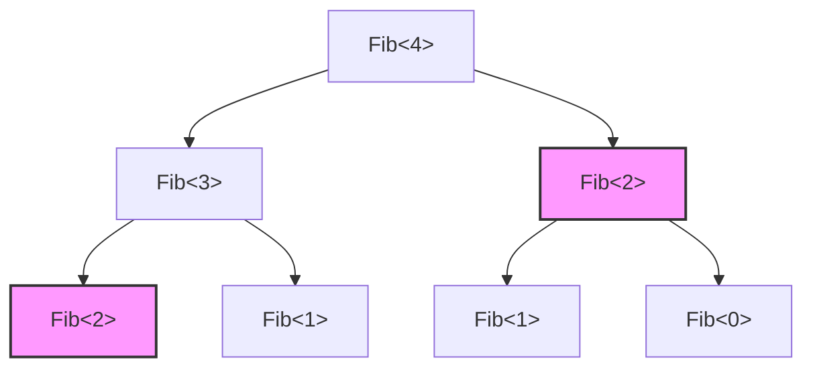
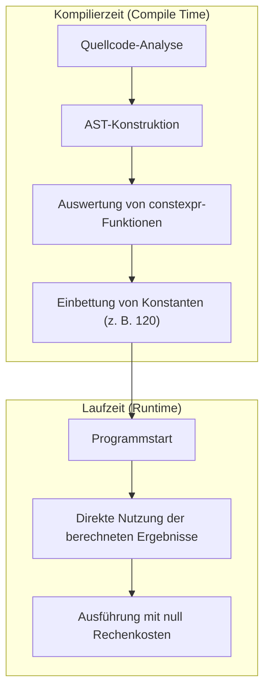

Die „Template-Metaprogrammierung“ (Template Metaprogramming: TMP) ist wahrscheinlich die größte Attraktion der Sprache C++, aber gleichzeitig auch ihr größtes Mysterium. Dies ist eine Technik, bei der Berechnungen, die normalerweise zur Laufzeit (Run-time) des Programms durchgeführt werden, auf die Kompilierzeit (Compile-time) vorgezogen werden, wenn der Compiler den Quellcode interpretiert und die Binärdatei generiert.

In diesem Artikel werden wir im Detail erklären, wie die C++-Templates historisch gesehen überhaupt zu ihrer Rechenkapazität gekommen sind, und die Entwicklung von klassischem SFINAE über das moderne `constexpr` und `if constexpr` bis hin zu `consteval` und Concepts (Konzepten) in C++20 anhand von praktischen Codebeispielen und mathematischem Hintergrund beleuchten.

---

## 1. Die Anfänge der Template-Metaprogrammierung: Die zufällige Entdeckung der Turing-Vollständigkeit

### 1.1 Was ist Turing-Vollständigkeit?

In der Informatik bedeutet „turing-vollständig“ (Turing Complete) zu sein, dass man über dieselbe Rechenleistung wie eine universelle Turingmaschine verfügt. Einfach ausgedrückt handelt es sich um ein System, das „bedingte Verzweigungen“ und „Endlosschleifen (oder Rekursionen)“ ausdrücken und jeden beliebigen Algorithmus beschreiben und ausführen kann.

### 1.2 Die Entdeckung von Erwin Unruh

Im Jahr 1994 präsentierte Erwin Unruh auf einem Treffen des C++-Standardisierungskomitees einen C++-Code. Dieser Code schlug zwar bei der Kompilierung fehl, aber interessanterweise **enthielt die vom Compiler ausgegebene Fehlermeldung eine Folge von Primzahlen**.

Der Compiler führte während des Prozesses der Template-Instanziierung rekursive Verarbeitungen durch und gab das Berechnungsergebnis als Fehlermeldung aus. Dies war der Moment, in dem bewiesen wurde, dass die Template-Funktion von C++ ein **turing-vollständiges Berechnungssystem** enthielt, das selbst der Sprachdesigner Bjarne Stroustrup nicht beabsichtigt hatte.

---

## 2. Klassische Template-Metaprogrammierung (C++98 / C++03)

Frühe Template-Metaprogrammierung nutzte Strukturen (`struct`) und Template-Spezialisierung (Template Specialization) in einem Stil, der der reinen funktionalen Programmierung ähnelte.

### 2.1 Berechnung der Fakultät (Factorial)

Schauen wir uns zunächst das grundlegendste Beispiel an: die Berechnung der Fakultät ($N!$). Mathematisch ist sie wie folgt definiert:

$$
N! = 
\begin{cases} 
1 & (N = 0) \\
N \times (N - 1)! & (N > 0)
\end{cases}
$$

Wenn man dies in C++98-Templates schreibt, sieht das folgendermaßen aus:

```cpp
#include <iostream>

// Primäres Template (Allgemeiner Fall der Rekursion)
template <int N>
struct Factorial {
    static const int value = N * Factorial<N - 1>::value;
};

// Explizite Spezialisierung des Templates (Basisfall der Rekursion)
template <>
struct Factorial<0> {
    static const int value = 1;
};

int main() {
    // Wird zur Kompilierzeit berechnet und als Konstante eingebettet
    std::cout << "5! = " << Factorial<5>::value << std::endl; 
    return 0;
}
```

Das Wichtige hierbei ist, dass `Factorial<5>::value` nicht zur Laufzeit berechnet, sondern zur Kompilierzeit aufgelöst wird, und in der endgültigen Binärdatei wird ein Code generiert, der äquivalent zu `std::cout << "5! = " << 120 << std::endl;` ist. Dadurch wird der Laufzeit-Overhead auf null reduziert.

### 2.2 Fibonacci-Folge und Komplexität

Als Nächstes berechnen wir die Fibonacci-Folge. Die Rekursionsgleichung lautet wie folgt:

$$
F_n = F_{n-1} + F_{n-2} \quad (F_0 = 0, F_1 = 1)
$$

```cpp
template <int N>
struct Fib {
    static const int value = Fib<N - 1>::value + Fib<N - 2>::value;
};

template <>
struct Fib<0> { static const int value = 0; };

template <>
struct Fib<1> { static const int value = 1; };
```

Wenn diese Implementierung mit einer rekursiven Funktion zur Laufzeit geschrieben wird, wird dieselbe Berechnung viele Male wiederholt, was zu einer exponentiellen Zeitkomplexität von $O(2^N)$ führt. Bei der Instanziierung von Templates zur Kompilierzeit gibt es jedoch die Eigenschaft, dass **Typen mit denselben Template-Argumenten nur einmal instanziiert werden** (ein Effekt ähnlich der Memoisation). Daher beträgt die Berechnungskomplexität zur Kompilierzeit effektiv $O(N)$.

Das folgende Diagramm zeigt, wie der Compiler die Instanzen auflöst.



Oben wird `Fib<2>`, das dieselbe Farbe und Form hat, nur einmal im Compiler instanziiert, und ab dem zweiten Mal wird die zwischengespeicherte Typdefinition verwendet.

---

## 3. SFINAE und Type Traits (C++11)

Mit der Weiterentwicklung der Metaprogrammierung wurde nicht nur die „Berechnung von Werten“, sondern auch die „Manipulation und Bewertung von Typen“ immer wichtiger. Hier kommt **SFINAE** (Substitution Failure Is Not An Error: Ein Ersetzungsfehler ist kein Fehler) ins Spiel.

### 3.1 Der SFINAE-Mechanismus

Bei der Überladungsauflösung von Template-Funktionen leitet der Compiler die Template-Argumente aus den übergebenen Argumenten ab und ersetzt die Typen in der Signatur (dem Deklarationsteil der Funktion). Wenn es dabei zu einem Typwiderspruch kommt und die Ersetzung fehlschlägt, gibt der Compiler nicht sofort einen Kompilierungsfehler aus, sondern **schließt diesen Überladungskandidaten stillschweigend aus** und sucht nach dem nächsten Kandidaten.

```mermaid
stateDiagram-v2
    [*] --> A
    A["Aufruf der Template-Funktion"] --> B["Typableitung"]
    B["Typableitung"] --> C["Ersetzung der Signatur"]
    C["Ersetzung der Signatur"] --> D["Ersetzung erfolgreich?"]
    D["Ersetzung erfolgreich?"] --> E["Zum Kandidaten hinzufügen"] : Yes
    D["Ersetzung erfolgreich?"] --> F["Als Kandidat ausschließen (nicht als Fehler) (SFINAE)"] : No
    E["Zum Kandidaten hinzufügen"] --> G["Überladungsauflösung"]
    F["Als Kandidat ausschließen (nicht als Fehler) (SFINAE)"] --> G["Überladungsauflösung"]
    G["Überladungsauflösung"] --> [*]
```

### 3.2 Bedingte Kompilierung mit std::enable_if

Durch die Verwendung des in C++11 eingeführten Headers `<type_traits>` und `std::enable_if` können Funktionen nur für Typen aktiviert werden, die bestimmte Bedingungen erfüllen.

```cpp
#include <iostream>
#include <type_traits>

// Überladung, die nur aktiviert wird, wenn T ein Ganzzahltyp ist
template <typename T>
typename std::enable_if<std::is_integral<T>::value>::type
print_type(T val) {
    std::cout << "Integer: " << val << std::endl;
}

// Überladung, die nur aktiviert wird, wenn T ein Gleitkommatyp ist
template <typename T>
typename std::enable_if<std::is_floating_point<T>::value>::type
print_type(T val) {
    std::cout << "Floating point: " << val << std::endl;
}

int main() {
    print_type(42);      // Integer: 42
    print_type(3.1415);  // Floating point: 3.1415
    // print_type("str"); // Kompilierungsfehler: Keine passende Funktion
}
```

Dieser Ansatz war sehr mächtig, aber Schreibweisen wie `typename std::enable_if<...>::type` waren extrem wortreich und trugen dazu bei, dass die C++-Metaprogrammierung als „kryptisch“ gemieden wurde.

---

## 4. Paradigmenwechsel: Die Einführung von constexpr (C++11/C++14)

In C++11 wurde das Schlüsselwort `constexpr` eingeführt, was eine Revolution in der Geschichte der Metaprogrammierung darstellte. Dadurch wurde es möglich, **Kompilierzeitberechnungen mit der üblichen Funktionsschreibweise durchzuführen**, ohne auf unnatürliche Template-Rekursionen zurückgreifen zu müssen.

### 4.1 constexpr in C++11

Für `constexpr`-Funktionen zum Zeitpunkt von C++11 gab es die strenge Einschränkung, dass der „Rumpf nur aus einer einzigen `return`-Anweisung bestehen durfte“. Daher mussten Schleifen vermieden und auf ternäre Operatoren und Rekursion zurückgegriffen werden.

```cpp
// C++11 constexpr Fibonacci
constexpr int fib_cxx11(int n) {
    return (n <= 1) ? n : fib_cxx11(n - 1) + fib_cxx11(n - 2);
}
```

### 4.2 Lockerung von constexpr in C++14

In C++14 wurde diese Einschränkung stark gelockert, sodass die Deklaration von lokalen Variablen, `if`-Anweisungen, `for`-Schleifen usw. innerhalb von `constexpr`-Funktionen verwendet werden konnten. Dadurch ist es möglich, Algorithmen genauso unkompliziert wie für die Laufzeit zu schreiben.

```cpp
// C++14 constexpr Fibonacci
constexpr int fib_cxx14(int n) {
    if (n <= 1) return n;
    int a = 0, b = 1;
    for (int i = 2; i <= n; ++i) {
        int temp = a + b;
        a = b;
        b = temp;
    }
    return b;
}
```

Dieser Code wird zur Kompilierzeit berechnet, wenn er zur Kompilierzeit ausgewertet werden kann, und als normale Funktion zur Laufzeit ausgeführt, wenn die Argumente zur Laufzeit übergeben werden.



---

## 5. Beherrschung der statischen bedingten Verzweigung: if constexpr (C++17)

In C++17 wurde `if constexpr` eingeführt, womit die wortreiche Überladungsauflösung mittels SFINAE der Vergangenheit angehört. Es handelt sich um eine `if`-Anweisung, die zur Kompilierzeit ausgewertet wird. Ein Block, dessen Bedingung `false` ist, wird gar nicht erst instanziiert und komplett aus dem Kompilierungsziel verworfen.

Wenn wir das vorherige SFINAE-Beispiel mit `if constexpr` umschreiben, wird es überraschend einfach.

```cpp
#include <iostream>
#include <type_traits>

template <typename T>
void print_type(T val) {
    if constexpr (std::is_integral_v<T>) {
        std::cout << "Integer: " << val << std::endl;
    } 
    else if constexpr (std::is_floating_point_v<T>) {
        std::cout << "Floating point: " << val << std::endl;
    } 
    else {
        std::cout << "Other type" << std::endl;
    }
}
```

Durch die Verwendung von `if constexpr` können Verarbeitungen für verschiedene Typen in derselben Funktionstemplate zusammengefasst werden, was die Lesbarkeit des Codes dramatisch verbessert.

---

## 6. Die wahre Stärke von modernem C++: consteval und Concepts (C++20)

C++20 war das größte Update seit C++11. Auch im Bereich der Metaprogrammierung hat es eine dramatische Entwicklung durchgemacht.

### 6.1 Berechnungen zwingend zur Kompilierzeit: consteval

Während `constexpr` eine Anweisung war, die besagte „wenn die Bedingungen erfüllt sind, berechne zur Kompilierzeit“, aber auch die Auswertung zur Laufzeit erlaubte, definiert das in C++20 hinzugefügte `consteval` **eine sofortige Funktion (Immediate Function), die „zwingend zur Kompilierzeit ausgewertet werden muss“**. Wenn versucht wird, sie zur Laufzeit auszuwerten, führt dies zu einem Kompilierungsfehler.

```cpp
// Erzwingt definitiv die Berechnung zur Kompilierzeit
consteval int square(int n) {
    return n * n;
}

int main() {
    constexpr int a = square(5); // OK: Auswertung zur Kompilierzeit
    
    int x = 5;
    // int b = square(x); // Fehler: x ist eine Laufzeitvariable und kann nicht ausgewertet werden
}
```

### 6.2 Klärung von Template-Anforderungen: Concepts

Eine der größten Schwächen der Metaprogrammierung waren die „kryptischen Fehlermeldungen“. Wenn ein falscher Typ an ein Template-Argument übergeben wurde, wurden manchmal hunderte von Zeilen unverständlicher Fehlermeldungen ausgegeben.

Mit den **Concepts (Konzepten)** von C++20 können die Typbeschränkungen, die ein Template akzeptiert, in einer Form spezifiziert werden, die natürlicher Sprache nahekommt, und auch die Fehlermeldungen werden extrem klar.

```cpp
#include <concepts>
#include <iostream>

// Erfordert, dass T ein Ganzzahltyp ist
template <std::integral T>
T add(T a, T b) {
    return a + b;
}

int main() {
    std::cout << add(10, 20) << std::endl;      // OK
    // std::cout << add(1.5, 2.5) << std::endl; // Fehler: std::integral nicht erfüllt
}
```

---

## 7. Praxisbeispiel: Primzahltest zur Kompilierzeit und Algorithmenoptimierung

Lassen Sie uns nun unser gesamtes Wissen nutzen, um einen Code für einen Primzahltest zur Kompilierzeit zu schreiben. Hier verwenden wir eine moderne C++20-Funktion (`consteval`).

Die Zeitkomplexität eines Primzahltest-Algorithmus ist bei naiver Prüfung $O(N)$, aber da es ausreicht, bis $\sqrt{N}$ zu prüfen, beträgt sie beim optimalen Algorithmus $O(\sqrt{N})$.

```cpp
#include <iostream>

// Hilfsfunktion zur Berechnung des ganzzahligen Teils der Quadratwurzel zur Kompilierzeit
consteval int compile_time_sqrt(int n) {
    if (n <= 1) return n;
    int res = 1;
    while (res * res <= n) {
        res++;
    }
    return res - 1;
}

// Primzahltest mit C++20 consteval
consteval bool is_prime(int n) {
    if (n <= 1) return false;
    if (n == 2 || n == 3) return true;
    if (n % 2 == 0) return false;
    
    int limit = compile_time_sqrt(n);
    for (int i = 3; i <= limit; i += 2) {
        if (n % i == 0) return false;
    }
    return true;
}

int main() {
    // Wird vollständig zur Kompilierzeit ausgewertet
    static_assert(is_prime(104729) == true, "104729 should be prime!");
    static_assert(is_prime(100) == false, "100 should not be prime!");
    
    constexpr bool p = is_prime(9973);
    std::cout << "Is 9973 prime? " << std::boolalpha << p << std::endl;

    return 0;
}
```

Im obigen Code sind sowohl `compile_time_sqrt` als auch `is_prime` als `consteval` spezifiziert, sodass diese Berechnungen zu 100 % zur Kompilierzeit abgeschlossen sind. In der Binärdatei der ausführbaren Datei sind lediglich Konstanten (boolesche Werte) wie `true` oder `false` eingebettet.

### 7.1 Mathematischer Ausdruck der Komplexität

Beim Primzahltest ist der maximale zu prüfende Wert $\lfloor \sqrt{N} \rfloor$.
Daher ist die Worst-Case-Zeitkomplexität $T(N)$ wie folgt:

$$
T(N) = O(\sqrt{N})
$$

Wenn dies zur Laufzeit berechnet wird, kann es beispielsweise bei kryptografischen Prozessen oder der Initialisierung groß angelegter Simulationen zu Verzögerungen von Hunderten von Millisekunden bis zu einigen Sekunden kommen. Wenn jedoch die Template-Metaprogrammierung zur Kompilierzeit verwendet wird, werden die Kosten von $T(N)$ vollständig auf der Seite des Compilers getragen, und die Kosten zur Ausführungszeit für den Benutzer betragen $O(1)$.

---

## 8. Licht und Schatten der Kompilierzeitberechnung

Bisher haben wir die mächtigen Berechnungsfunktionen von C++ zur Kompilierzeit gesehen, aber sie sollten nicht bedingungslos überbeansprucht werden.

### Vorteile
- **Null Overhead zur Laufzeit**: Da die Berechnungsergebnisse als Konstanten eingebettet werden, ist die Ausführungsgeschwindigkeit maximal.
- **Frühzeitige Fehlererkennung**: In Kombination mit `static_assert` etc. können Logikfehler oder Typinkonsistenzen bereits zum Zeitpunkt der Kompilierung sicher abgefangen werden.

### Nachteile
- **Explosion der Build-Zeiten**: Da Berechnungen innerhalb des Compilers in einer speziellen Interpreter-Umgebung (dem AST-Evaluator des Compilers) durchgeführt werden, sind sie viel langsamer als die Ausführung von nativem Code zur Laufzeit. Wenn riesige Matrixberechnungen usw. zur Kompilierzeit durchgeführt werden, besteht die Gefahr, dass die Build-Zeit auf mehrere Stunden ansteigt.
- **Aufblähen der Binärdatei (Code Bloat)**: Wenn Templates mit vielen verschiedenen Typen instanziiert werden, werden viele Funktionen generiert, was zu dem Phänomen führen kann, dass die Größe der ausführbaren Datei stark anwächst.

---

## 9. Fazit

Die Template-Metaprogrammierung in C++ begann als „Zufallsprodukt (Hack)“, bei dem aus Fehlermeldungen Primzahlen ausgegeben wurden, und hat sich durch jahrelange Standardisierungsarbeit zu raffinierten Sprachfunktionen (`constexpr`, `if constexpr`, `Concepts`) weiterentwickelt.

Im modernen C++ ist die Hürde für den Begriff „Metaprogrammierung“ drastisch gesunken, und es ist möglich, von den Vorteilen der Kompilierzeitberechnung zu profitieren, während man Code genauso intuitiv wie in normalen Programmen schreibt.

In Bereichen, in denen ultimative Leistung gefordert ist, wie bei eingebetteten Systemen, Spiele-Engines und Hochfrequenzhandelssystemen (HFT), wird diese Technologie weiterhin eine unverzichtbare Waffe sein.

Die Entwicklung von C++ ist noch nicht abgeschlossen. Zukünftige Standards wie C++23 und C++26 werden noch leistungsfähigere Funktionen wie die Reflexion zur Kompilierzeit (Compile-time Reflection) mit sich bringen. Wir hoffen, dass auch Sie die moderne Template-Programmierung meistern und die Welt der Optimierung jenseits aller Grenzen genießen können.
