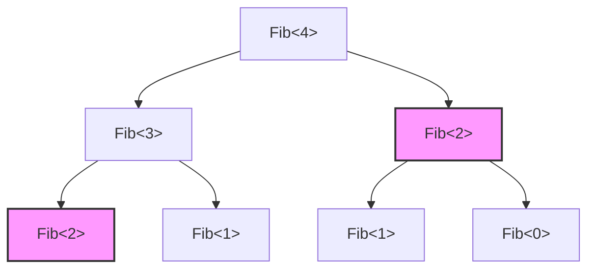
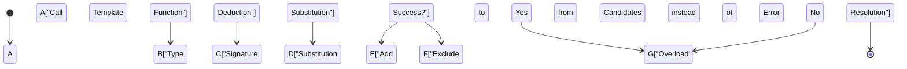
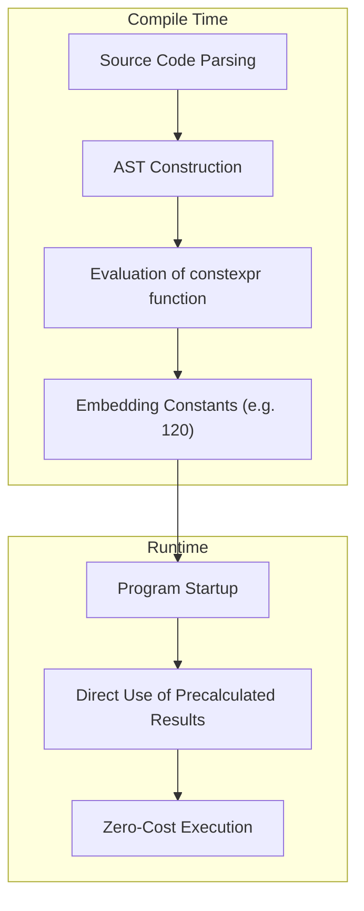

"Template Metaprogramming (TMP)" is perhaps the most fascinating appeal of C++, while simultaneously being its deepest, darkest abyss. It is a technique where computations normally performed at run-time are brought forward and executed at compile-time by the compiler interpreting the source code and generating the binary.

In this article, we will thoroughly explain how C++ templates acquired computational capabilities from a historical perspective, and trace their evolution from classic SFINAE to modern `constexpr` and `if constexpr`, all the way to `consteval` and Concepts in C++20. We will provide detailed explanations alongside practical code examples and mathematical backgrounds.

---

## 1. The Dawn of Template Metaprogramming: Accidental Discovery of Turing Completeness

### 1.1 What is Turing Completeness?

In computer science, being "Turing Complete" means having the same computational power as a universal Turing machine. Put simply, it refers to a system capable of expressing "conditional branching" and "infinite loops (or recursion)", allowing it to describe and execute any arbitrary algorithm.

### 1.2 Erwin Unruh's Discovery

In 1994, during a C++ Standards Committee meeting, a person named Erwin Unruh presented a certain C++ code. That code was designed to fail compilation, but astonishingly, **the error messages output by the compiler contained a sequence of prime numbers**.

During the template instantiation process, the compiler performed recursive processing and output the calculated results as error messages. In other words, this was the moment it was proven that the C++ template feature contained a **Turing-complete computational system**, something not even intended by the language's designer, Bjarne Stroustrup.

---

## 2. Classic Template Metaprogramming (C++98 / C++03)

Early template metaprogramming took the style of pure functional programming utilizing structures (`struct`) and Template Specialization.

### 2.1 Calculating Factorials

First, let's look at the calculation of a factorial ($N!$), which is the most basic example. Mathematically, it is defined as follows:

$$
N! = 
\begin{cases} 
1 & (N = 0) \\
N \times (N - 1)! & (N > 0)
\end{cases}
$$

Writing this with C++98 templates looks like this:

```cpp
#include <iostream>

// Primary template (general case for recursion)
template <int N>
struct Factorial {
    static const int value = N * Factorial<N - 1>::value;
};

// Explicit template specialization (base case for recursion)
template <>
struct Factorial<0> {
    static const int value = 1;
};

int main() {
    // Calculated at compile time, embedded as a constant
    std::cout << "5! = " << Factorial<5>::value << std::endl; 
    return 0;
}
```

What's important here is that `Factorial<5>::value` is not calculated at runtime, but expanded at compile time. The final binary will generate code equivalent to `std::cout << "5! = " << 120 << std::endl;`. As a result, the runtime overhead becomes zero.

### 2.2 Fibonacci Sequence and Time Complexity

Next, let's calculate the Fibonacci sequence. The recurrence relation is as follows:

$$
F_n = F_{n-1} + F_{n-2} \quad (F_0 = 0, F_1 = 1)
$$

```cpp
template <int N>
struct Fib {
    static const int value = Fib<N - 1>::value + Fib<N - 2>::value;
};

template <>
struct Fib<0> { static const int value = 0; };

template <>
struct Fib<1> { static const int value = 1; };
```

If implemented as a runtime recursive function, the same calculation is repeated many times, leading to an exponential time complexity of $O(2^N)$. However, **during compile-time template instantiation, a type with the same template arguments is instantiated only once** (an effect similar to memoization). Therefore, the compile-time computational complexity is effectively $O(N)$.

The diagram below shows how the compiler resolves the instances.



In the above, `Fib<2>` nodes with the same color and shape are instantiated only once within the compiler, and for any subsequent occurrences, the cached type definition is utilized.

---

## 3. SFINAE and Type Traits (C++11)

As metaprogramming evolved, not only "value calculation" but also "type manipulation and determination" became important. This is where **SFINAE** (Substitution Failure Is Not An Error) comes in.

### 3.1 The Mechanism of SFINAE

During overload resolution of template functions, the compiler deduces the template arguments from the passed arguments and substitutes the types in the signature (the declaration part of the function). At this time, if an inconsistency occurs in the types and the substitution fails, the compiler does not immediately throw a compile error. Instead, it **quietly discards that overload candidate** and searches for the next one.



### 3.2 Conditional Compilation using std::enable_if

By using the `<type_traits>` header and `std::enable_if` introduced in C++11, you can enable a function only for types that satisfy certain conditions.

```cpp
#include <iostream>
#include <type_traits>

// Overload enabled only when T is an integral type
template <typename T>
typename std::enable_if<std::is_integral<T>::value>::type
print_type(T val) {
    std::cout << "Integer: " << val << std::endl;
}

// Overload enabled only when T is a floating-point type
template <typename T>
typename std::enable_if<std::is_floating_point<T>::value>::type
print_type(T val) {
    std::cout << "Floating point: " << val << std::endl;
}

int main() {
    print_type(42);      // Integer: 42
    print_type(3.1415);  // Floating point: 3.1415
    // print_type("str"); // Compile error: No matching function
}
```

While this approach was extremely powerful, expressions like `typename std::enable_if<...>::type` were very verbose, contributing to the perception that "C++ metaprogramming is like reading cryptography" and causing developers to avoid it.

---

## 4. Paradigm Shift: Introduction of constexpr (C++11/C++14)

In C++11, the keyword `constexpr`, which can be considered a revolution in the history of metaprogramming, was introduced. This allowed **compile-time computations using normal function syntax** without resorting to unnatural template recursion.

### 4.1 C++11 constexpr

In C++11, `constexpr` functions had a strict limitation: "the body must consist of a single `return` statement." Therefore, loops could not be used, and one had to rely on the ternary operator and recursion.

```cpp
// C++11 constexpr Fibonacci
constexpr int fib_cxx11(int n) {
    return (n <= 1) ? n : fib_cxx11(n - 1) + fib_cxx11(n - 2);
}
```

### 4.2 Relaxation of constexpr in C++14

In C++14, this restriction was greatly relaxed. Local variable declarations, `if` statements, and `for` loops became usable inside `constexpr` functions. This allows algorithms to be written just as straightforwardly as they are for runtime execution.

```cpp
// C++14 constexpr Fibonacci
constexpr int fib_cxx14(int n) {
    if (n <= 1) return n;
    int a = 0, b = 1;
    for (int i = 2; i <= n; ++i) {
        int temp = a + b;
        a = b;
        b = temp;
    }
    return b;
}
```

This code is calculated at compile-time if it can be evaluated at compile-time; if runtime arguments are passed, it is calculated at runtime just like a normal function.



---

## 5. Mastering Static Conditional Branching: if constexpr (C++17)

C++17 introduced `if constexpr`, making verbose overload resolution using SFINAE a thing of the past. This is an `if` statement evaluated at compile time. The block whose condition evaluates to `false` is not even instantiated and is completely discarded from compilation.

Rewriting the previous SFINAE example with `if constexpr` makes it surprisingly simple.

```cpp
#include <iostream>
#include <type_traits>

template <typename T>
void print_type(T val) {
    if constexpr (std::is_integral_v<T>) {
        std::cout << "Integer: " << val << std::endl;
    } 
    else if constexpr (std::is_floating_point_v<T>) {
        std::cout << "Floating point: " << val << std::endl;
    } 
    else {
        std::cout << "Other type" << std::endl;
    }
}
```

By using `if constexpr`, processing for different types can be consolidated within a single function template, dramatically improving code readability.

---

## 6. The True Worth of Modern C++: consteval and Concepts (C++20)

C++20 was a massive update since C++11. In the realm of metaprogramming as well, it has achieved dramatic evolution.

### 6.1 Forcing Compile-Time Computation: consteval

While `constexpr` was an instruction saying "calculate at compile time if conditions are met," it is also allowed to be evaluated at runtime. In contrast, `consteval` introduced in C++20 defines an **"Immediate Function" that must be evaluated at compile time**. Attempting to evaluate it at runtime results in a compile error.

```cpp
// Strictly enforces compile-time calculation
consteval int square(int n) {
    return n * n;
}

int main() {
    constexpr int a = square(5); // OK: Compile-time evaluation
    
    int x = 5;
    // int b = square(x); // Error: x is a runtime variable, cannot be evaluated
}
```

### 6.2 Clarifying Template Requirements: Concepts

One of the biggest weaknesses of metaprogramming was the "obscurity of error messages". Passing an incorrect type as a template argument could spew hundreds of lines of incomprehensible errors.

By using **Concepts** in C++20, the type constraints accepted by a template can be specified clearly in a form close to natural language, and error messages become extremely clear.

```cpp
#include <concepts>
#include <iostream>

// Requires T to be an integral type
template <std::integral T>
T add(T a, T b) {
    return a + b;
}

int main() {
    std::cout << add(10, 20) << std::endl;      // OK
    // std::cout << add(1.5, 2.5) << std::endl; // Error: does not satisfy std::integral
}
```

---

## 7. Practical Example: Compile-Time Prime Validation and Algorithm Optimization

Mobilizing all the knowledge we have so far, let's write code that performs prime validation at compile time. Here, we'll use a modern C++20 feature (`consteval`).

The time complexity of a prime validation algorithm is $O(N)$ if checked naively, but since it is sufficient to check up to $\sqrt{N}$, an optimal algorithm yields $O(\sqrt{N})$.

```cpp
#include <iostream>

// Helper function to calculate integer part of square root at compile time
consteval int compile_time_sqrt(int n) {
    if (n <= 1) return n;
    int res = 1;
    while (res * res <= n) {
        res++;
    }
    return res - 1;
}

// Prime validation using C++20 consteval
consteval bool is_prime(int n) {
    if (n <= 1) return false;
    if (n == 2 || n == 3) return true;
    if (n % 2 == 0) return false;
    
    int limit = compile_time_sqrt(n);
    for (int i = 3; i <= limit; i += 2) {
        if (n % i == 0) return false;
    }
    return true;
}

int main() {
    // Evaluated entirely at compile time
    static_assert(is_prime(104729) == true, "104729 should be prime!");
    static_assert(is_prime(100) == false, "100 should not be prime!");
    
    constexpr bool p = is_prime(9973);
    std::cout << "Is 9973 prime? " << std::boolalpha << p << std::endl;

    return 0;
}
```

In the code above, since both `compile_time_sqrt` and `is_prime` are designated with `consteval`, their computations are 100% completed at compile time. The executable binary simply embeds constants (boolean values) like `true` or `false`.

### 7.1 Mathematical Expression of Time Complexity

In prime validation, the maximum value to check is $\lfloor \sqrt{N} \rfloor$.
Therefore, the worst-case time complexity $T(N)$ is as follows:

$$
T(N) = O(\sqrt{N})
$$

If this is calculated at runtime, it could cause delays of hundreds of milliseconds to several seconds in scenarios like cryptographic processing or initializing large-scale simulations. However, by using compile-time metaprogramming, the compiler fully absorbs the cost of this $T(N)$, and the user's runtime cost becomes $O(1)$.

---

## 8. The Light and Shadow of Compile-Time Computation

We have seen the powerful compile-time computation features of C++, but they should not be overused unconditionally.

### Advantages
- **Zero Runtime Overhead**: Since calculation results are made constant, execution speed is maximized.
- **Early Bug Detection**: Combined with `static_assert`, logical flaws and type inconsistencies can be reliably caught at compile time.

### Disadvantages
- **Build Time Explosion**: Computations inside the compiler take place in a dedicated interpreter environment (the compiler's AST evaluator), which is much slower than executing native code at runtime. Having the compiler perform huge matrix calculations, for example, risks bloating build times to the level of hours.
- **Binary Bloat**: When templates are instantiated with various types, a multitude of functions are generated, which can cause the executable file size to grow—a phenomenon known as Code Bloat.

---

## 9. Conclusion

C++ template metaprogramming started as an "accidental product (hack)" where prime numbers were output from error messages, and through years of standardization, evolved into refined language features (`constexpr`, `if constexpr`, `Concepts`).

In modern C++, the barrier to entry for the term "metaprogramming" has dropped dramatically. You can now reap the benefits of compile-time computation while writing intuitive code just like a regular program.

In areas where ultimate performance is demanded—such as embedded systems, game engines, and high-frequency trading (HFT) systems—this technology will undoubtedly remain an indispensable weapon.

The evolution of C++ has not stopped yet. Future standards like C++23 and C++26 hold even more powerful features in store, such as compile-time reflection. We encourage everyone to master modern template programming and enjoy the world of optimization that pushes beyond limits.
